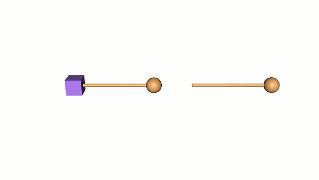
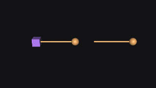
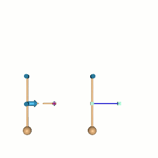
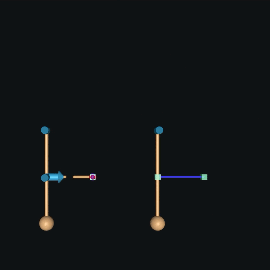

=============
XML Reference
=============

Introduction
------------

This chapter is the reference manual for the MJCF modeling language used in MuJoCo.

.. _CSchema:

XML schema
~~~~~~~~~~

The table below summarizes the XML elements and their attributes in MJCF. Note that all information in MJCF is entered
through elements and attributes. Text content in elements is not used; if present, the parser ignores it.

.. collapse:: Collapse schema table
   :open:

   The symbols in the second column of the table have the following meaning:

   ====== ===================================================
   **!**  required element, can appear only once
   **?**  optional element, can appear only once
   **\*** optional element, can appear many times
   **R**  optional element, can appear many times recursively
   ====== ===================================================

   .. cssclass:: schema-small

   .. include:: XMLschema.rst

.. _CType:

Attribute types
~~~~~~~~~~~~~~~

| Each attribute has a data type enforced by the parser. The available data types are:

========= ==============================================================================================
string    An arbitrary string, usually specifying a file name or a user-defined name of a model element.
int(N)    An array of N integers. If N is omitted it equals 1.
real(N)   An array of N real-valued numbers. If N is omitted it equals 1.
[...]     Keyword attribute. The list of valid keywords is given in brackets.
========= ==============================================================================================

|
| For array-type attributes, the length of the array is enforced by the parser unless specified otherwise in the
  reference documentation below.
| In addition to having a data type, attributes can be required or optional. Optional attributes can have internal
  defaults or not. Optional attributes that do not have internal defaults are initialized in a special undefined state.
  This state is different from any valid setting that can be entered in the XML. This mechanism enables the compiler to
  determine if the attribute has been "touched" by the user, either explicitly or through defaults, and take
  appropriate action. Some attributes have internal defaults (usually 0) which are not actually allowed by the
  compiler. When such attributes become relevant in a given context, they must be set to allowed values.

+-------------+--------------------------------------------------------------------------------------------------+
| required    | The attribute is required by the parser. If it is not present the parser will generate an error. |
+-------------+--------------------------------------------------------------------------------------------------+
| optional    | The attribute is optional. There is no internal default. The attribute is initialized in the     |
|             | undefined state.                                                                                 |
+-------------+--------------------------------------------------------------------------------------------------+
| "..."       | The attribute is optional. The internal default is given in quotes.                              |
+-------------+--------------------------------------------------------------------------------------------------+

In the reference documentation below the attribute name is shown in boldface, followed by its data type, followed by the
required/optional status including the internal default if any. For example, the attribute angle is a keyword attribute
whose value can be "radian" or "degree". It is an optional attribute and has internal default "degree". Therefore it
will appear in the reference documentation as

:at:`angle`: :at-val:`[radian, degree], "degree"`
   .. raw:: html

      

.. _Reference:

MJCF Reference
--------------

MJCF files have a unique top-level element :ref:`mujoco <mujoco>`. The next-level elements are referred to as
*sections*. They are all optional. Some sections are merely used for grouping and have no attributes. Sections can be
repeated, to facilitate merging of models via the :ref:`include <include>` element. The *order* of attributes within an
element can be arbitrary. The order of child elements within a parent element can also be arbitrary, with four
exceptions:

-  The order of :ref:`joint <body-joint>` elements within a :ref:`body <body>` matters because joint transformations are
   performed in sequence.
-  The order of elements in a :ref:`spatial <tendon-spatial>` tendon matters because it determines the sequence of
   objects that the tendon passes through or wraps around.
-  The order of repeated sections matters when the same attribute is set multiple times to different values. In that
   case the last setting takes effect for the entire model.
-  The order of multiple actuator shortcuts in the same defaults class matters, because each shortcut sets the
   attributes of the single :ref:`general <actuator-general>` element in that defaults class, overriding the previous
   settings.

In the remainder of this chapter we describe all valid MJCF elements and their attributes. Some elements can be used in
multiple contexts, in which case their meaning depends on the parent element. This is why we always show the parent as a
prefix in the documentation below.

.. _meta-element:

Meta elements
~~~~~~~~~~~~~

These elements are not strictly part of the low-level MJCF format definition, but rather instruct the compiler to
perform some operation on the model. A general property of meta-elements is that they disappear from the model upon
saving the XML. There are currently six meta-elements in MJCF:

- :ref:`include<include>`, :ref:`frame<frame>`, and :ref:`replicate<replicate>` which are outside of the schema.
- :ref:`composite<body-composite>`, :ref:`flexcomp<body-flexcomp>` and :ref:`attach<body-attach>` which are part of the
  schema, but serve to procedurally generate other MJCF elements.

.. _frame:

**frame** (R)
^^^^^^^^^^^^^

The frame meta-element is a pure coordinate transformation that can wrap any group of elements in the kinematic tree
(under :ref:`worldbody<body>`). After compilation, frame elements disappear and their transformation is accumulated
in their direct children. The attributes of the frame meta-element are documented :ref:`below<body-frame>`.

.. collapse:: Usage example of frame

   Loading this model and saving it:

   .. code-block:: xml

      <mujoco>
        <worldbody>
          <frame quat="0 0 1 0">
             <geom name="Alice" quat="0 1 0 0" size="1"/>
          </frame>

          <frame pos="0 1 0">
            <geom name="Bob" pos="0 1 0" size="1"/>
            <body name="Carl" pos="1 0 0">
              ...
            </body>
          </frame>
        </worldbody>
      </mujoco>

   Results in this model:

   .. code-block:: xml

      <mujoco>
        <worldbody>
          <geom name="Alice" quat="0 0 0 1" size="1"/>
          <geom name="Bob" pos="0 2 0" size="1"/>
          <body name="Carl" pos="1 1 0">
            ...
          </body>
        </worldbody>
      </mujoco>

   Note that in the saved model, the frame elements have disappeared but their transformation was accumulated with those
   of their child elements.

.. _replicate:

**replicate** (R)
^^^^^^^^^^^^^^^^^

The replicate element duplicates the enclosed kinematic tree elements with incremental translational and rotational
offsets, adding namespace suffixes to avoid name collisions. Appended suffix strings are integers in the
range ``[0...count-1]`` with the minimum number of digits required to represent the total element count (i.e., if
replicating 200 times, suffixes will be ``000, 001, ...`` etc). All referencing elements are automatically replicated
and namespaced appropriately. Detailed examples of models using replicate can be found in the
`model/replicate/ <https://github.com/google-deepmind/mujoco/tree/main/model/replicate>`__ directory.

There is a caveat concerning :ref:`keyframes<keyframe>` when using replicate. Since :ref:`mjs_attach` is used to
self-attach multiple times the enclosed kinematic tree, if this tree contains further :ref:`attach<body-attach>`
elements, keyframes will not be replicated nor namespaced by :ref:`replicate<replicate>`, but they will be attached and
namespaced once by the innermost call of :ref:`mjs_attach`. See the limitations discussed in :ref:`attach<body-attach>`.

.. _replicate-count:

:at:`count`: :at-val:`int, required`
   The number of replicas. Must be positive.

.. _replicate-sep:

:at:`sep`: :at-val:`string, optional`
   The namespace separator. This optional string is prepended to the namespace suffix string. Note that for nested
   replicate elements, the innermost namespace suffixes are appended first.

.. _replicate-offset:

:at:`offset`: :at-val:`real(3), optional`
   Translational offset along the three coordinate axes. In general, the frame of the offset is with respect to the
   previous replica, except for the first one which is with respect to the replicate element's parent.
   If there is no rotation, these values are always in the frame of the replicate element's parent.

.. _replicate-euler:

:at:`euler`: :at-val:`real(3), optional`
   Rotation angles around three coordinate axes between two subsequent replicas. The angular units and rotation sequence
   respect the global :ref:`angle<compiler-angle>` and :ref:`eulerseq<compiler-eulerseq>` settings. Rotation is always
   with respect to the frame of the previous replica, so total rotation is cumulative.

.. collapse:: Usage example of replicate

   Loading this model and saving it:

   .. code-block:: xml

      <mujoco>
        <worldbody>
          <replicate count="2" offset="0 1 0" euler="90 0 0">
            <replicate count="2" sep="-" offset="1 0 0" euler="0 90 0">
              <geom name="Alice" size=".1"/>
            </replicate>
          </replicate>
        </worldbody>

        <sensor>
          <accelerometer name="Bob" site="Alice"/>
        </sensor>
      </mujoco>

   Results in this model:

   .. code-block:: xml

      <mujoco>
        <worldbody>
          <geom name="Alice-00" size="0.1"/>
          <geom name="Alice-10" size="0.1" pos="1 0 0" quat="1 0 1 0"/>
          <geom name="Alice-01" size="0.1" pos="0 1 0" quat="1 1 0 0"/>
          <geom name="Alice-11" size="0.1" pos="1 1 0" quat="0.5 0.5 0.5 0.5"/>
        </worldbody>

        <sensor>
          <accelerometer name="Bob-00" site="Alice-00"/>
          <accelerometer name="Bob-10" site="Alice-10"/>
          <accelerometer name="Bob-01" site="Alice-01"/>
          <accelerometer name="Bob-11" site="Alice-11"/>
        </sensor>
      </mujoco>

.. _include:

**include** (*)
^^^^^^^^^^^^^^^

This element does not strictly belong to MJCF. Instead it is a meta-element, used to assemble multiple XML
files in a single document object model (DOM) before parsing. The included file must be a valid XML file with a unique
top-level element. This top-level element is removed by the parser, and the elements below it are inserted at the
location of the :el:`include` element. At least one element must be inserted as a result of this procedure. The
:el:`include` element can be used where ever an XML element is expected in the MJCF file. Nested includes are allowed,
however a given XML file can be included at most once in the entire model. After all the included XML files have been
assembled into a single DOM, it must correspond to a valid MJCF model. Other than that, it is up to the user to decide
how to use includes and how to modularize large files if desired.

:at:`file`: :at-val:`string, required`
   The name of the XML file to be included. The file location is relative to the directory of the main MJCF file. If the
   file is not in the same directory, it should be prefixed with a relative path.

.. admonition:: Prefer attach to include
   :class: note

   While some use cases for :ref:`include<include>` remain valid, it is recommended to use the
   :ref:`attach<body-attach>` element instead, where applicable.

.. _mujoco:

**mujoco** (!)
~~~~~~~~~~~~~~

The unique top-level element, identifying the XML file as an MJCF model file.

.. _mujoco-model:

:at:`model`: :at-val:`string, "MuJoCo Model"`
   The name of the model. This name is shown in the title bar of :ref:`simulate.cc <saSimulate>`.

.. _option:

**option** (*)
~~~~~~~~~~~~~~

This element is in one-to-one correspondence with the low level structure mjOption contained in the field mjModel.opt of
mjModel. These are simulation options and do not affect the compilation process in any way; they are simply copied into
the low level model. Even though mjOption can be modified by the user at runtime, it is nevertheless a good idea to
adjust it properly through the XML.

.. _option-timestep:

:at:`timestep`: :at-val:`real, "0.002"`
   Simulation time step in seconds. This is the single most important parameter affecting the speed-accuracy trade-off
   which is inherent in every physics simulation. Smaller values result in better accuracy and stability. To achieve
   real-time performance, the time step must be larger than the CPU time per step (or 4 times larger when using the RK4
   integrator). The CPU time is measured with internal timers. It should be monitored when adjusting the time step.
   MuJoCo can simulate most robotic systems a lot faster than real-time, however models with many floating objects
   (resulting in many contacts) are more demanding computationally. Keep in mind that stability is determined not only
   by the time step but also by the :ref:`CSolver`; in particular softer constraints can be simulated with larger time
   steps. When fine-tuning a challenging model, it is recommended to experiment with both settings jointly. In
   optimization-related applications, real-time is no longer good enough and instead it is desirable to run the
   simulation as fast as possible. In that case the time step should be made as large as possible.

.. _option-apirate:

:at:`apirate`: :at-val:`real, "100"`
   This parameter determines the rate (in Hz) at which an external API allows the update function to be executed. This
   mechanism is used to simulate devices with limited communication bandwidth. It only affects the socket API and not
   the physics simulation.

.. _option-impratio:

:at:`impratio`: :at-val:`real, "1"`
   This attribute determines the ratio of frictional-to-normal constraint impedance for elliptic friction cones. The
   setting of solimp determines a single impedance value for all contact dimensions, which is then modulated by this
   attribute. Settings larger than 1 cause friction forces to be "harder" than normal forces, having the general effect
   of preventing slip, without increasing the actual friction coefficient. For pyramidal friction cones the situation is
   more complex because the pyramidal approximation mixes normal and frictional dimensions within each basis vector; it
   is not recommended to use high impratio values with pyramidal cones.

.. _option-gravity:

:at:`gravity`: :at-val:`real(3), "0 0 -9.81"`
   Gravitational acceleration vector. In the default world orientation the Z-axis points up. The MuJoCo GUI is organized
   around this convention (both the camera and perturbation commands are based on it) so we do not recommend deviating
   from it.

.. _option-wind:

:at:`wind`: :at-val:`real(3), "0 0 0"`
   Velocity vector of the medium (i.e., wind). This vector is subtracted from the 3D translational velocity of each
   body, and the result is used to compute viscous, lift and drag forces acting on the body; recall :ref:`Passive forces
   <gePassive>` in the Computation chapter. The magnitude of these forces scales with the values of the next two
   attributes.

.. _option-magnetic:

:at:`magnetic`: :at-val:`real(3), "0 -0.5 0"`
   Global magnetic flux. This vector is used by magnetometer sensors, which are defined as sites and return the magnetic
   flux at the site position expressed in the site frame.

.. _option-density:

:at:`density`: :at-val:`real, "0"`
   Density of the medium, not to be confused with the geom density used to infer masses and inertias. This parameter is
   used to simulate lift and drag forces, which scale quadratically with velocity. In SI units the density of air is
   around 1.2 while the density of water is around 1000 depending on temperature. Setting density to 0 disables lift and
   drag forces.

.. _option-viscosity:

:at:`viscosity`: :at-val:`real, "0"`
   Viscosity of the medium. This parameter is used to simulate viscous forces, which scale linearly with velocity. In SI
   units the viscosity of air is around 0.00002 while the viscosity of water is around 0.0009 depending on temperature.
   Setting viscosity to 0 disables viscous forces. Note that the default Euler :ref:`integrator <geIntegration>` handles
   damping in the joints implicitly – which improves stability and accuracy. It does not presently do this with body
   viscosity. Therefore, if the goal is merely to create a damped simulation (as opposed to modeling the specific
   effects of viscosity), we recommend using joint damping rather than body viscosity, or switching to the
   :at:`implicit` or :at:`implicitfast` integrators.

.. _option-o_margin:

:at:`o_margin`: :at-val:`real, "0"`
   This attribute replaces the margin parameter of all active contact pairs when :ref:`Contact override <COverride>` is
   enabled. Otherwise MuJoCo uses the element-specific margin attribute of :ref:`geom<body-geom>` or
   :ref:`pair<contact-pair>` depending on how the contact pair was generated. See also :ref:`Collision` in the
   Computation chapter. The related gap parameter does not have a global override.

.. _option-o_solref:
.. _option-o_solimp:
.. _option-o_friction:

:at:`o_solref`, :at:`o_solimp`, :at:`o_friction`
   These attributes replace the solref, solimp and friction parameters of all active contact pairs when contact override is
   enabled. See :ref:`CSolver` for details.

.. _option-integrator:

:at:`integrator`: :at-val:`[Euler, RK4, implicit, implicitfast], "Euler"`
   This attribute selects the numerical :ref:`integrator <geIntegration>` to be used. Currently the available
   integrators are the semi-implicit Euler method, the fixed-step 4-th order Runge Kutta method, the
   Implicit-in-velocity Euler method, and :at:`implicitfast`, which drops the Coriolis and centrifugal terms. See
   :ref:`Numerical Integration<geIntegration>` for more details.

.. _option-cone:

:at:`cone`: :at-val:`[pyramidal, elliptic], "pyramidal"`
   The type of contact friction cone. Elliptic cones are a better model of the physical reality, but pyramidal cones
   sometimes make the solver faster and more robust.

.. _option-jacobian:

:at:`jacobian`: :at-val:`[dense, sparse, auto], "auto"`
   The type of constraint Jacobian and matrices computed from it. Auto resolves to dense when the number of degrees of
   freedom is up to 60, and sparse over 60.

.. _option-solver:

:at:`solver`: :at-val:`[PGS, CG, Newton], "Newton"`
   This attribute selects one of the constraint solver :ref:`algorithms <soAlgorithms>` described in the Computation
   chapter. Guidelines for solver selection and parameter tuning are available in the :ref:`Algorithms <CAlgorithms>`
   section above.

.. _option-iterations:

:at:`iterations`: :at-val:`int, "100"`
   Maximum number of iterations of the constraint solver. When the warmstart attribute of :ref:`flag <option-flag>` is
   enabled (which is the default), accurate results are obtained with fewer iterations. Larger and more complex systems
   with many interacting constraints require more iterations. Note that mjData.solver contains statistics about solver
   convergence, also shown in the profiler.

.. _option-tolerance:

:at:`tolerance`: :at-val:`real, "1e-8"`
   Tolerance threshold used for early termination of the iterative solver. For PGS, the threshold is applied to the cost
   improvement between two iterations. For CG and Newton, it is applied to the smaller of the cost improvement and the
   gradient norm. Set the tolerance to 0 to disable early termination.

.. _option-ls_iterations:

:at:`ls_iterations`: :at-val:`int, "50"`
   Maximum number of linesearch iterations performed by CG/Newton constraint solvers. Ensures that at most
   :ref:`iterations<option-iterations>` times :ref:`ls_iterations<option-ls_iterations>` linesearch iterations are
   performed during each constraint solve.

.. _option-ls_tolerance:

:at:`ls_tolerance`: :at-val:`real, "0.01"`
   Tolerance threshold used for early termination of the linesearch algorithm.

.. _option-noslip_iterations:

:at:`noslip_iterations`: :at-val:`int, "0"`
   Maximum number of iterations of the Noslip solver. This is a post-processing step executed after the main solver. It
   uses a modified PGS method to suppress slip/drift in friction dimensions resulting from the soft-constraint model.
   The default setting 0 disables this post-processing step.

.. _option-noslip_tolerance:

:at:`noslip_tolerance`: :at-val:`real, "1e-6"`
   Tolerance threshold used for early termination of the Noslip solver.

.. _option-ccd_iterations:

:at:`ccd_iterations`: :at-val:`int, "50"`
   Maximum number of iterations of the algorithm used for convex collisions. This rarely needs to be adjusted,
   except in situations where some geoms have very large aspect ratios.

.. _option-ccd_tolerance:

:at:`ccd_tolerance`: :at-val:`real, "1e-6"`
   Tolerance threshold used for early termination of the convex collision algorithm.

.. _option-sdf_iterations:

:at:`sdf_iterations`: :at-val:`int, "10"`
   Number of iterations used for Signed Distance Field collisions (per initial point).

.. _option-sdf_initpoints:

:at:`sdf_initpoints`: :at-val:`int, "40"`
   Number of starting points used for finding contacts with Signed Distance Field collisions.

.. youtube:: H9qG9Zf2W44
   :align: right
   :width: 240px

.. _option-actuatorgroupdisable:

:at:`actuatorgroupdisable`: :at-val:`int(31), optional`
   List of actuator groups to disable. Actuators whose :ref:`group<actuator-general-group>` is in this list will produce
   no force. If they are stateful, their activation states will not be integrated. Internally this list is
   implemented as an integer bitfield, so values must be in the range ``0 <= group <= 30``. If not set, all actuator
   groups are enabled. See `example model
   <https://github.com/google-deepmind/mujoco/blob/main/test/engine/testdata/actuation/actuator_group_disable.xml>`__
   and associated screen-capture on the right.

.. _option-flag:

:el-prefix:`option/` |-| **flag** (?)
^^^^^^^^^^^^^^^^^^^^^^^^^^^^^^^^^^^^^

This element sets the flags that enable and disable different parts of the simulation pipeline. The actual flags used at
runtime are represented as the bits of two integers, namely mjModel.opt.disableflags and mjModel.opt.enableflags, used
to disable standard features and enable optional features respectively. The reason for this separation is that setting
both integers to 0 restores the default. In the XML we do not make this separation explicit, except for the default
attribute values - which are "enable" for flags corresponding to standard features, and "disable" for flags
corresponding to optional features. In the documentation below, we explain what happens when the setting is different
from its default.

.. _option-flag-constraint:

:at:`constraint`: :at-val:`[disable, enable], "enable"`
   This flag disables all standard computations related to the constraint solver. As a result, no constraint forces are
   applied. Note that the next four flags disable the computations related to a specific type of constraint. Both this
   flag and the type-specific flag must be set to "enable" for a given computation to be performed.

.. _option-flag-equality:

:at:`equality`: :at-val:`[disable, enable], "enable"`
   This flag disables all standard computations related to equality constraints.

.. _option-flag-frictionloss:

:at:`frictionloss`: :at-val:`[disable, enable], "enable"`
   This flag disables all standard computations related to friction loss constraints.

.. _option-flag-limit:

:at:`limit`: :at-val:`[disable, enable], "enable"`
   This flag disables all standard computations related to joint and tendon limit constraints.

.. _option-flag-contact:

:at:`contact`: :at-val:`[disable, enable], "enable"`
   This flag disables collision detection and all standard computations related to contact constraints.

.. _option-flag-passive:

:at:`passive`: :at-val:`[disable, enable], "enable"`
   This flag disables the simulation of joint and tendon spring-dampers, fluid dynamics forces, and custom passive
   forces computed by the :ref:`mjcb_passive` callback. As a result, no passive forces are applied.

.. _option-flag-gravity:

:at:`gravity`: :at-val:`[disable, enable], "enable"`
   This flag causes the gravitational acceleration vector in mjOption to be replaced with (0 0 0) at runtime, without
   changing the value in mjOption. Once the flag is re-enabled, the value in mjOption is used.

.. _option-flag-clampctrl:

:at:`clampctrl`: :at-val:`[disable, enable], "enable"`
   This flag disables the clamping of control inputs to all actuators, even if the actuator-specific attributes are set
   to enable clamping.

.. _option-flag-warmstart:

:at:`warmstart`: :at-val:`[disable, enable], "enable"`
   This flag disables warm-starting of the constraint solver. By default the solver uses the solution (i.e., the
   constraint force) from the previous time step to initialize the iterative optimization. This feature should be
   disabled when evaluating the dynamics at a collection of states that do not form a trajectory - in which case warm
   starts make no sense and are likely to slow down the solver.

.. _option-flag-filterparent:

:at:`filterparent`: :at-val:`[disable, enable], "enable"`
   This flag disables the filtering of contact pairs where the two geoms belong to a parent and child body; recall
   contact :ref:`selection <coSelection>` in the Computation chapter.

.. _option-flag-actuation:

:at:`actuation`: :at-val:`[disable, enable], "enable"`
   This flag disables all standard computations related to actuator forces, including the actuator dynamics. As a
   result, no actuator forces are applied to the simulation.

.. _option-flag-refsafe:

:at:`refsafe`: :at-val:`[disable, enable], "enable"`
   This flag enables a safety mechanism that prevents instabilities due to solref[0] being too small compared to the
   simulation timestep. Recall that solref[0] is the stiffness of the virtual spring-damper used for constraint
   stabilization. If this setting is enabled, the solver uses max(solref[0], 2*timestep) in place of solref[0]
   separately for each active constraint.

.. _option-flag-sensor:

:at:`sensor`: :at-val:`[disable, enable], "enable"`
   This flag disables all computations related to sensors. When disabled, sensor values will remain constant, either
   zeros if disabled at the start of simulation, or, if disabled at runtime, whatever value was last computed.

.. _option-flag-midphase:

:at:`midphase`: :at-val:`[disable, enable], "enable"`
   This flag disables the mid-phase collision filtering using a static AABB bounding volume hierarchy (a BVH binary
   tree). If disabled, all geoms pairs that are allowed to collide are checked for collisions.

.. _option-flag-nativeccd:

:at:`nativeccd`: :at-val:`[disable, enable], "enable"`
   This flag enables the native convex collision detection pipeline instead of using the
   `libccd library <https://github.com/danfis/libccd>`__, see :ref:`convex collisions<coCCD>` for more details.

.. _option-flag-eulerdamp:

:at:`eulerdamp`: :at-val:`[disable, enable], "enable"`
   This flag disables implicit integration with respect to joint damping in the Euler integrator. See the
   :ref:`Numerical Integration<geIntegration>` section for more details.

.. _option-flag-autoreset:

:at:`autoreset`: :at-val:`[disable, enable], "enable"`
   This flag disables the automatic resetting of the simulation state when numerical issues are detected.

.. _option-flag-override:

:at:`override`: :at-val:`[disable, enable], "disable"`
   This flag enables to :ref:`Contact override <COverride>` mechanism explained above.

.. _option-flag-energy:

:at:`energy`: :at-val:`[disable, enable], "disable"`
   This flag enables the computation of potential and kinetic energy in ``mjData.energy[0, 1]`` respectively,
   and displayed in the simulate GUI info overlay. Potential energy includes the gravitational component summed over
   all bodies :math:`\sum_b m_b g h` and energy stored in passive springs in joints, tendons and flexes
   :math:`\tfrac{1}{2} k x^2`, where :math:`x` is the displacement and :math:`k` is the spring constant. Kinetic
   energy is given by :math:`\tfrac{1}{2} v^T M v`, where :math:`v` is the velocity and :math:`M` is the
   mass matrix. Note that potential and kinetic energy in constraints is not accounted for.

   The extra computation (also triggered by :ref:`potential<sensor-e_potential>` and
   :ref:`kinetic<sensor-e_kinetic>` energy sensors) adds some CPU time but it is usually negligible. Monitoring energy
   for a system that is supposed to be energy-conserving is one of the best ways to assess the accuracy of a complex
   simulation.

.. _option-flag-fwdinv:

:at:`fwdinv`: :at-val:`[disable, enable], "disable"`
   This flag enables the automatic comparison of forward and inverse dynamics. When enabled, the inverse dynamics is
   invoked after mj_forward (or internally within mj_step) and the difference in applied forces is recorded in
   mjData.solver_fwdinv[2]. The first value is the relative norm of the discrepancy in joint space, the next is in
   constraint space.

.. _option-flag-invdiscrete:

:at:`invdiscrete`: :at-val:`[disable, enable], "disable"`
   This flag enables discrete-time inverse dynamics with :ref:`mj_inverse` for all
   :ref:`integrators<option-integrator>` other than ``RK4``. Recall from the
   :ref:`numerical integration<geIntegration>` section that the one-step integrators (``Euler``, ``implicit`` and
   ``implicitfast``), modify the mass matrix :math:`M \rightarrow M-hD`. This implies that finite-differenced
   accelerations :math:`(v_{t+h} - v_t)/h` will not correspond to the continuous-time acceleration ``mjData.qacc``.
   When this flag is enabled, :ref:`mj_inverse` will  interpret ``qacc`` as having been computed from the difference of
   two sequential velocities, and undo the above modification.

.. _option-flag-multiccd:

:at:`multiccd`: :at-val:`[disable, enable], "disable"`
   This flag enables multiple-contact collision detection for geom pairs that use a general-purpose convex-convex
   collider e.g., mesh-mesh collisions. This can be useful when the contacting geoms have a flat surface and the
   single contact point generated by the convex-convex collider cannot accurately capture the surface contact, leading
   to instabilities that typically manifest as sliding or wobbling. The implementation of this feature depends on the
   selected convex collision pipeline, see :ref:`convex collisions<coCCD>` for more details.

.. _option-flag-island:

:at:`island`: :at-val:`[disable, enable], "disable"`
   This flag enables discovery of constraint islands: disjoint sets of constraints and
   degrees-of-freedom that do not interact. The flag currently has no effect on the physics pipeline, but enabling it
   allows for `island visualization <https://youtu.be/Vc1tq0fFvQA>`__.
   In a future release, the constraint solver will exploit the disjoint nature of constraint islands.

.. _compiler:

**compiler** (*)
~~~~~~~~~~~~~~~~

This element is used to set options for the built-in parser and compiler. After parsing and compilation it no longer
has any effect. The settings here are global and apply to the entire model.

.. _compiler-autolimits:

:at:`autolimits`: :at-val:`[false, true], "true"`
   This attribute affects the behavior of attributes such as "limited" (on <body-joint> or <tendon>), "forcelimited",
   "ctrllimited", and "actlimited" (on <actuator>). If "true", these attributes are unnecessary and their value
   will be inferred from the presence of their corresponding "range" attribute.
   If "false", no such inference will happen: For a joint to be limited, both limited="true" and range="min max" must
   be specified. In this mode, it is an error to specify a range without a limit.

.. _compiler-boundmass:

:at:`boundmass`: :at-val:`real, "0"`
   This attribute imposes a lower bound on the mass of each body except for the world body. Setting this attribute to
   a value greater than 0 can be used as a quick fix for poorly designed models that contain massless moving bodies,
   such as the dummy bodies often used in URDF models to attach sensors. Note that in MuJoCo there is no need to create
   dummy bodies.

.. _compiler-boundinertia:

:at:`boundinertia`: :at-val:`real, "0"`
   This attribute imposes a lower bound on the diagonal inertia components of each body except for the world body. Its
   use is similar to boundmass above.

.. _compiler-settotalmass:

:at:`settotalmass`: :at-val:`real, "-1"`
   If this value is positive, the compiler will scale the masses and inertias of all bodies in the model, so that the
   total mass equals the value specified here. The world body has mass 0 and does not participate in any mass-related
   computations. This scaling is performed last, after all other operations affecting the body mass and inertia. The
   same scaling operation can be applied at runtime to the compiled mjModel with the function
   :ref:`mj_setTotalmass`.

.. _compiler-balanceinertia:

:at:`balanceinertia`: :at-val:`[false, true], "false"`
   A valid diagonal inertia matrix must satisfy A+B>=C for all permutations of the three diagonal elements. Some poorly
   designed models violate this constraint, which will normally result in a compile error. If this attribute is set to
   "true", the compiler will silently set all three diagonal elements to their average value whenever the above
   condition is violated.

.. _compiler-strippath:

:at:`strippath`: :at-val:`[false, true], "false" for MJCF, "true" for URDF`
   When this attribute is "true", the parser will remove any path information in file names specified in the model. This
   is useful for loading models created on a different system using a different directory structure.

.. _compiler-coordinate:

:at:`coordinate`: :at-val:`[local, global], "local"`
   In previous versions, this attribute could be used to specify whether frame positions and orientations are expressed
   in local or global coordinates, but the "global" option has since been removed, and will cause an error to be
   generated. In order to convert older models which used the "global" option, load and save them in MuJoCo 2.3.3 or
   older.

.. _compiler-angle:

:at:`angle`: :at-val:`[radian, degree], "degree" for MJCF, always "radian" for URDF`
   This attribute specifies whether the angles in the MJCF model are expressed in units of degrees or radians. The
   compiler converts degrees into radians, and mjModel always uses radians. For URDF models the parser sets this
   attribute to "radian" internally, regardless of the XML setting.

.. _compiler-fitaabb:

:at:`fitaabb`: :at-val:`[false, true], "false"`
   The compiler is able to replace a mesh with a geometric primitive fitted to that mesh; see :ref:`geom <body-geom>`
   below. If this attribute is "true", the fitting procedure uses the axis-aligned bounding box (aabb) of the mesh.
   Otherwise it uses the equivalent-inertia box of the mesh. The type of geometric primitive used for fitting is
   specified separately for each geom.

.. _compiler-eulerseq:

:at:`eulerseq`: :at-val:`string, "xyz"`
   This attribute specifies the sequence of Euler rotations for all :at:`euler` attributes of elements that have spatial
   frames, as explained in :ref:`COrientation`. This must be a string with exactly 3 characters from the set {x, y, z,
   X, Y, Z}. The character at position n determines the axis around which the n-th rotation is performed. Lower case
   letters denote axes that rotate with the frame (intrinsic), while upper case letters denote axes that remain fixed in
   the parent frame (extrinsic). The "rpy" convention used in URDF corresponds to "XYZ" in MJCF.

.. _compiler-meshdir:

:at:`meshdir`: :at-val:`string, optional`
   This attribute instructs the compiler where to look for mesh and height field files. The full path to a file is
   determined as follows. If the strippath attribute described above is "true", all path information from the file name
   is removed. The following checks are then applied in order: (1) if the file name contains an absolute path, it is
   used without further changes; (2) if this attribute is set and contains an absolute path, the full path is the string
   given here appended with the file name; (3) the full path is the path to the main MJCF model file, appended with the
   value of this attribute if specified, appended with the file name.

.. _compiler-texturedir:

:at:`texturedir`: :at-val:`string, optional`
   This attribute is used to instruct the compiler where to look for texture files. It works in the same way as meshdir
   above.

.. _compiler-assetdir:

:at:`assetdir`: :at-val:`string, optional`
   This attribute sets the values of both :at:`meshdir` and :at:`texturedir` above. Values in the latter attributes take
   precedence over :at:`assetdir`.

.. _compiler-discardvisual:

:at:`discardvisual`: :at-val:`[false, true], "false" for MJCF, "true" for URDF`
   This attribute instructs the compiler to discard all model elements which are purely visual and have no effect on the
   physics (with one exception, see below). This often enables smaller :ref:`mjModel` structs and faster simulation.

   - All materials are discarded.
   - All textures are discarded.
   - All geoms with :ref:`contype<body-geom-contype>` |-| = |-| :ref:`conaffinity<body-geom-conaffinity>` |-| =0 are
     discarded, if they are not referenced in another MJCF element. If a discarded geom was used for inferring body
     inertia, an explicit :ref:`inertial<body-inertial>` element is added to the body.
   - All meshes which are not referenced by any geom (in particular those discarded above) are discarded.

   The resulting compiled model will have exactly the same dynamics as the original model. The only engine-level
   computation which might change is the output of :ref:`raycasting<mj_ray>` computations, as used for example by
   :ref:`rangefinder<sensor-rangefinder>` sensors, since raycasting reports distances to visual geoms. When visualizing
   models compiled with this flag, it is important to remember that collision geoms are often placed in a
   :ref:`group<body-geom-group>` which is invisible by default.

.. _compiler-usethread:

:at:`usethread`: :at-val:`[false, true], "true"`
   If this attribute is "true", the model compiler will run in multi-threaded mode. Currently multi-threading is used
   for computing the length ranges of actuators and for parallel loading of meshes.

.. _compiler-fusestatic:

:at:`fusestatic`: :at-val:`[false, true], "false" for MJCF, "true" for URDF`
   This attribute controls a compiler optimization feature where static bodies are fused with their parent, and any
   elements defined in those bodies are reassigned to the parent. Static bodies are fused with their parent unless

   - They are referenced by another element in the model.
   - They contain a site which is referenced by a :ref:`force<sensor-force>` or :ref:`torque<sensor-torque>` sensor.

   This optimization is particularly useful when importing URDF models which often have many dummy bodies, but can also
   be used to optimize MJCF models. After optimization, the new model has identical kinematics and dynamics as the
   original but is faster to simulate.

.. _compiler-inertiafromgeom:

:at:`inertiafromgeom`: :at-val:`[false, true, auto], "auto"`
   This attribute controls the automatic inference of body masses and inertias from geoms attached to the body. If this
   setting is "false", no automatic inference is performed. In that case each body must have explicitly defined mass and
   inertia with the :ref:`inertial <body-inertial>` element, or else a compile error will be generated. If this setting is
   "true", the mass and inertia of each body will be inferred from the geoms attached to it, overriding any values
   specified with the :el:`inertial` element. The default setting "auto" means that masses and inertias are inferred
   automatically only when the :el:`inertial` element is missing in the body definition. One reason to set this
   attribute to "true" instead of "auto" is to override inertial data imported from a poorly designed model. In
   particular, a number of publicly available URDF models have seemingly arbitrary inertias which are too large compared
   to the mass. This results in equivalent inertia boxes which extend far beyond the geometric boundaries of the model.
   Note that the built-in OpenGL visualizer can render equivalent inertia boxes.

.. _compiler-alignfree:

:at:`alignfree`: :at-val:`[false, true], "false"`
   This attribute toggles the default behaviour of an optimization that applies to bodies with a
   :ref:`free joint<body-freejoint>` and no child bodies.
   When true, the body frame and free joint will automatically be aligned with inertial frame, which leads to both
   faster and more stable simulation. See :ref:`freejoint/align<body-freejoint-align>` for details.

.. _compiler-inertiagrouprange:

:at:`inertiagrouprange`: :at-val:`int(2), "0 5"`
   This attribute specifies the range of geom groups that are used to infer body masses and inertias (when such
   inference is enabled). The group attribute of :ref:`geom <body-geom>` is an integer. If this integer falls in the range
   specified here, the geom will be used in the inertial computation, otherwise it will be ignored. This feature is
   useful in models that have redundant sets of geoms for collision and visualization. Note that the world body does not
   participate in the inertial computations, so any geoms attached to it are automatically ignored. Therefore it is not
   necessary to adjust this attribute and the geom-specific groups so as to exclude world geoms from the inertial
   computation.

.. _compiler-saveinertial:

:at:`saveinertial`: :at-val:`[false, true], "false"`
   If set to "true", the compiler will save explicit :ref:`inertial <body-inertial>` clauses for all bodies.

.. _compiler-lengthrange:

:el-prefix:`compiler/` |-| **lengthrange** (?)
^^^^^^^^^^^^^^^^^^^^^^^^^^^^^^^^^^^^^^^^^^^^^^

This element controls the computation of actuator length ranges. For an overview of this functionality see :ref:`Length
range <CLengthRange>` section. Note that if this element is omitted the defaults shown below still apply. In order to
disable length range computations altogether, include this element and set mode="none".

.. _compiler-lengthrange-mode:

:at:`mode`: :at-val:`[none, muscle, muscleuser, all], "muscle"`
   Determines the type of actuators to which length range computation is applied. "none" disables this functionality.
   "all" applies it to all actuators. "muscle" applies it to actuators whose gaintype or biastype is set to "muscle".
   "muscleuser" applies it to actuators whose gaintype or biastype is set to either "muscle" or "user". The default is
   "muscle" because MuJoCo's muscle model requires actuator length ranges to be defined.

.. _compiler-lengthrange-useexisting:

:at:`useexisting`: :at-val:`[false, true], "true"`
   If this attribute is "true" and the length range for a given actuator is already defined in the model, the existing
   value will be used and the automatic computation will be skipped. The range is considered defined if the first number
   is smaller than the second number. The only reason to set this attribute to "false" is to force re-computation of
   actuator length ranges - which is needed when the model geometry is modified. Note that the automatic computation
   relies on simulation and can be slow, so saving the model and using the existing values when possible is recommended.

.. _compiler-lengthrange-uselimit:

:at:`uselimit`: :at-val:`[false, true], "false"`
   If this attribute is "true" and the actuator is attached to a joint or a tendon which has limits defined, these
   limits will be copied into the actuator length range and the automatic computation will be skipped. This may seem
   like a good idea but note that in complex models the feasible range of tendon actuators depends on the entire model,
   and may be smaller than the user-defined limits for that tendon. So the safer approach is to set this to "false", and
   let the automatic computation discover the feasible range.

.. _compiler-lengthrange-accel:

:at:`accel`: :at-val:`real, "20"`
   This attribute scales the forces applied to the simulation in order to push each actuator to its smallest and largest
   length. The force magnitude is computed so that the resulting joint-space acceleration vector has norm equal to this
   attribute.

.. _compiler-lengthrange-maxforce:

:at:`maxforce`: :at-val:`real, "0"`
   The force computed via the accel attribute above can be very large when the actuator has very small moments. Such a
   force will still produce reasonable acceleration (by construction) but large numbers could cause numerical issues.
   Although we have never observed such issues, the present attribute is provided as a safeguard. Setting it to a value
   larger than 0 limits the norm of the force being applied during simulation. The default setting of 0 disables this
   safeguard.

.. _compiler-lengthrange-timeconst:

:at:`timeconst`: :at-val:`real, "1"`
   The simulation is damped in a non-physical way so as to push the actuators to their limits without the risk of
   instabilities. This is done by simply scaling down the joint velocity at each time step. In the absence of new
   accelerations, such scaling will decrease the velocity exponentially. The timeconst attribute specifies the time
   constant of this exponential decrease, in seconds.

.. _compiler-lengthrange-timestep:

:at:`timestep`: :at-val:`real, "0.01"`
   The timestep used for the internal simulation. Setting this to 0 will cause the model timestep to be used. The latter
   is not the default because models that can go unstable usually have small timesteps, while the simulation here is
   artificially damped and very stable. To speed up the length range computation, users can attempt to increase this
   value.

.. _compiler-lengthrange-inttotal:

:at:`inttotal`: :at-val:`real, "10"`
   The total time interval (in seconds) for running the internal simulation, for each actuator and actuator direction.
   Each simulation is initialized at qpos0. It is expected to settle after inttotal time has passed.

.. _compiler-lengthrange-interval:

:at:`interval`: :at-val:`real, "2"`
   The time interval at the end of the simulation over which length data is collected and analyzed. The maximum (or
   respectively minimum) length achieved during this interval is recorded. The difference between the maximum and
   minimum is also recorded and is used as a measure of divergence. If the simulation settles, this difference will be
   small. If it is not small, this could be because the simulation has not yet settled - in which case the above
   attributes should be adjusted - or because the model does not have sufficient joint and tendon limits and so the
   actuator range is effectively unlimited. Both of these conditions cause the same compiler error. Recall that contacts
   are disabled in this simulation, so joint and tendon limits as well as overall geometry are the only things that can
   prevent actuators from having infinite length.

.. _compiler-lengthrange-tolrange:

:at:`tolrange`: :at-val:`real, "0.05"`
   This determines the threshold for detecting divergence and generating a compiler error. The range of actuator lengths
   observed during interval is divided by the overall range computed via simulation. If that value is larger than
   tolrange, a compiler error is generated. So one way to suppress compiler errors is to simply make this attribute
   larger, but in that case the results could be inaccurate.

.. _size:

**size** (*)
~~~~~~~~~~~~

This element specifies size parameters that cannot be inferred from the number of elements in the model. Unlike the
fields of mjOption which can be modified at runtime, sizes are structural parameters and should not be modified after
compilation.

.. _size-memory:

:at:`memory`: :at-val:`string, "-1"`
   This attribute specifies the size of memory allocated for dynamic arrays in the ``mjData.arena`` memory space, in
   bytes. The default setting of ``-1`` instructs the compiler to guess how much space to allocate. Appending the digits
   with one of the letters {K, M, G, T, P, E} sets the unit to be {kilo, mega, giga, tera, peta, exa}-byte,
   respectively. Thus "16M" means "allocate 16 megabytes of ``arena`` memory".
   See the :ref:`Memory allocation <CSize>` section for details.

.. _size-njmax:

:at:`njmax`: :at-val:`int, "-1"` |nbsp| |nbsp| |nbsp| (legacy)
   This is a deprecated legacy attribute. In versions prior to 2.3.0, it determined the maximum allowed number
   of constraints. Currently it means "allocate as much memory as would have previously been required for this number of
   constraints". Specifying both :at:`njmax` and :at:`memory` leads to an error.

.. _size-nconmax:

:at:`nconmax`: :at-val:`int, "-1"` |nbsp| |nbsp| |nbsp| (legacy)
   This attribute specifies the maximum number of contacts that will be generated at runtime.  If the number of active
   contacts is about to exceed this value, the extra contacts are discarded and a warning is generated.  This is a
   deprecated legacy attribute which prior to version 2.3.0 affected memory allocation. It is kept for backwards
   compatibillity and debugging purposes.

.. _size-nstack:

:at:`nstack`: :at-val:`int, "-1"` |nbsp| |nbsp| |nbsp| (legacy)
   This is a deprecated legacy attribute. In versions prior to 2.3.0, it determined the maximum size of the
   :ref:`stack <siStack>`. After version 2.3.0, if :at:`nstack` is specified, then the size of ``mjData.narena`` is
   ``nstack * sizeof(mjtNum)`` bytes, plus an additional space for the constraint solver. Specifying both :at:`nstack`
   and :at:`memory` leads to an error.

.. _size-nuserdata:

:at:`nuserdata`: :at-val:`int, "0"`
   The size of the field mjData.userdata of mjData. This field should be used to store custom dynamic variables. See
   also :ref:`CUser`.

.. _size-nkey:

:at:`nkey`: :at-val:`int, "0"`
   The number of key frames allocated in mjModel is the larger of this value and the number of :ref:`key <keyframe-key>`
   elements below. Note that the interactive simulator has the ability to take snapshots of the system state and save
   them as key frames.

.. _size-nuser_body:

:at:`nuser_body`: :at-val:`int, "-1"`
   The number of custom user parameters added to the definition of each body. See also :ref:`User parameters <CUser>`.
   The parameter values are set via the user attribute of the :ref:`body <body>` element. These values are not accessed
   by MuJoCo. They can be used to define element properties needed in user callbacks and other custom code.

.. _size-nuser_jnt:

:at:`nuser_jnt`: :at-val:`int, "-1"`
   The number of custom user parameters added to the definition of each :ref:`joint <body-joint>`.

.. _size-nuser_geom:

:at:`nuser_geom`: :at-val:`int, "-1"`
   The number of custom user parameters added to the definition of each :ref:`geom <body-geom>`.

.. _size-nuser_site:

:at:`nuser_site`: :at-val:`int, "-1"`
   The number of custom user parameters added to the definition of each :ref:`site <body-site>`.

.. _size-nuser_cam:

:at:`nuser_cam`: :at-val:`int, "-1"`
   The number of custom user parameters added to the definition of each :ref:`camera <body-camera>`.

.. _size-nuser_tendon:

:at:`nuser_tendon`: :at-val:`int, "-1"`
   The number of custom user parameters added to the definition of each :ref:`tendon <tendon>`.

.. _size-nuser_actuator:

:at:`nuser_actuator`: :at-val:`int, "-1"`
   The number of custom user parameters added to the definition of each :ref:`actuator <actuator>`.

.. _size-nuser_sensor:

:at:`nuser_sensor`: :at-val:`int, "-1"`
   The number of custom user parameters added to the definition of each :ref:`sensor <sensor>`.

.. _statistic:

**statistic** (*)
~~~~~~~~~~~~~~~~~

This element is used to override model statistics computed by the compiler. These statistics are not only informational
but are also used to scale various components of the rendering and perturbation. We provide an override mechanism in the
XML because it is sometimes easier to adjust a small number of model statistics than a larger number of visual
parameters.

.. _statistic-meanmass:

:at:`meanmass`: :at-val:`real, optional`
   If this attribute is specified, it replaces the value of mjModel.stat.meanmass computed by the compiler. The computed
   value is the average body mass, not counting the massless world body. At runtime this value scales the perturbation
   force.

.. _statistic-meaninertia:

:at:`meaninertia`: :at-val:`real, optional`
   If this attribute is specified, it replaces the value of mjModel.stat.meaninertia computed by the compiler. The
   computed value is the average diagonal element of the joint-space inertia matrix when the model is in qpos0. At
   runtime this value scales the solver cost and gradient used for early termination.

.. _statistic-meansize:

:at:`meansize`: :at-val:`real, optional`
   If this attribute is specified, it replaces the value of ``mjModel.stat.meansize`` computed by the compiler. At
   runtime this value multiplies the attributes of the :ref:`scale <visual-scale>` element above, and acts as their
   length unit. If specific lengths are desired, it can be convenient to set :at:`meansize` to a round number like 1 or
   0.01 so that :ref:`scale <visual-scale>` values are in recognized length units. This is the only semantic of
   :at:`meansize` and setting it has no other side-effect. The automatically computed value is heuristic, representing
   the average body radius. The heuristic is based on geom sizes when present, the distances between joints when
   present, and the sizes of the body equivalent inertia boxes.

.. _statistic-extent:

:at:`extent`: :at-val:`real, optional`
   If this attribute is specified, it replaces the value of mjModel.stat.extent computed by the compiler. The computed
   value is half the side of the bounding box of the model in the initial configuration. At runtime this value is
   multiplied by some of the attributes of the :ref:`map <visual-map>` element above. When the model is first loaded,
   the free camera's initial distance from the :at:`center` (see below) is 1.5 times the :at:`extent`. Must be strictly
   positive.

.. _statistic-center:

:at:`center`: :at-val:`real(3), optional`
   If this attribute is specified, it replaces the value of mjModel.stat.center computed by the compiler. The computed
   value is the center of the bounding box of the entire model in the initial configuration. This 3D vector is used to
   center the view of the free camera when the model is first loaded.

.. _asset:

**asset** (*)
~~~~~~~~~~~~~

This is a grouping element for defining assets. It does not have attributes. Assets are created in the model so that
they can be referenced from other model elements; recall the discussion of :ref:`Assets <Assets>` in the Overview
chapter. Assets opened from a file can be identified in two different ways: filename extensions or the ``content_type``
attribute. MuJoCo will attempt to open a file specified by the content type provided, and only defaults to the filename
extension if no ``content_type`` attribute is specified. The content type is ignored if the asset isn't loaded from a
file.

.. _asset-mesh:

:el-prefix:`asset/` |-| **mesh** (*)
^^^^^^^^^^^^^^^^^^^^^^^^^^^^^^^^^^^^

This element creates a mesh asset, which can then be referenced from geoms. If the referencing geom type is
:at-val:`mesh` the mesh is instantiated in the model, otherwise a geometric primitive is automatically fitted to it; see
the :ref:`geom <body-geom>` element below.

MuJoCo works with triangulated meshes. They can be loaded from binary STL files, OBJ files or MSH files with custom
format described below, or vertex and face data specified directly in the XML. Software such as MeshLab can be used to
convert from other mesh formats to STL or OBJ. While any collection of triangles can be loaded as a mesh and rendered,
collision detection works with the convex hull of the mesh as explained in :ref:`Collision`. See also the convexhull
attribute of the :ref:`compiler <compiler>` element which controls the automatic generation of convex hulls. The mesh
appearance (including texture mapping) is controlled by the :at:`material` and :at:`rgba` attributes of the referencing
geom, similarly to height fields.

Meshes can have explicit texture coordinates instead of relying on the automated texture
mapping mechanism. When provided, these explicit coordinates have priority. Note that texture coordinates can be
specified with OBJ files and MSH files, as well as explicitly in the XML with the :at:`texcoord` attribute, but not via
STL files. These mechanism cannot be mixed. So if you have an STL mesh, the only way to add texture coordinates to it is
to convert to one of the other supported formats.

.. _legacy-msh-docs:

.. collapse:: Legacy MSH file format

   The binary MSH file starts with 4 integers specifying the number of vertex positions (nvertex), vertex normals
   (nnormal), vertex texture coordinates (ntexcoord), and vertex indices making up the faces (nface), followed by the
   numeric data. nvertex must be at least 4. nnormal and ntexcoord can be zero (in which case the corresponding data is
   not defined) or equal to nvertex. nface can also be zero, in which case faces are constructed automatically from the
   convex hull of the vertex positions. The file size in bytes must be exactly: 16 + 12*(nvertex + nnormal + nface) +
   8*ntexcoord. The contents of the file must be as follows:

   .. code:: Text

          (int32)   nvertex
          (int32)   nnormal
          (int32)   ntexcoord
          (int32)   nface
          (float)   vertex_positions[3*nvertex]
          (float)   vertex_normals[3*nnormal]
          (float)   vertex_texcoords[2*ntexcoord]
          (int32)   face_vertex_indices[3*nface]

Poorly designed meshes can display rendering artifacts. In particular, the shadow mapping mechanism relies on having
some distance between front and back-facing triangle faces. If the faces are repeated, with opposite normals as
determined by the vertex order in each triangle, this causes shadow aliasing. The solution is to remove the repeated
faces (which can be done in MeshLab) or use a better designed mesh. Flipped faces are checked by MuJoCo for meshes
specified as OBJ or XML and an error message is returned.

The size of the mesh is determined by the 3D coordinates of the vertex data in the mesh file, multiplied by the
components of the :at:`scale` attribute below. Scaling is applied separately for each coordinate axis. Note that
negative scaling values can be used to flip the mesh; this is a legitimate operation. The size parameters of the
referencing geoms are ignored, similarly to height fields. We also provide a mechanism to translate and
rotate the 3D coordinates, using the attributes :ref:`refpos<asset-mesh-refpos>` and :ref:`refquat<asset-mesh-refquat>`.

A mesh can also be defined without faces (a point cloud essentially). In that case
the convex hull is constructed automatically, even if the compiler attribute :at:`convexhull` is
false. This makes it easy to construct simple shapes directly in the XML. For example, a pyramid can
be created as follows:

.. code-block:: xml

   <asset>
     <mesh name="tetrahedron" vertex="0 0 0  1 0 0  0 1 0  0 0 1"/>
   </asset>

Positioning and orienting is complicated by the fact that vertex data in the source asset are often relative to
coordinate frames whose origin is not inside the mesh. In contrast, MuJoCo expects the origin of a geom's local frame to
coincide with the geometric center of the shape. We resolve this discrepancy by pre-processing the mesh in the compiler,
so that it is centered around (0,0,0) and its principal axes of inertia are the coordinate axes. We save the translation
and rotation offsets applied to the source asset in :ref:`mjModel.mesh_pos<mjModel>` and
:ref:`mjModel.mesh_quat<mjModel>`; these are required if one reads vertex data from the source and needs to re-apply the
transform. These offsets are then composed with the referencing geom's position and orientation; see also the :at:`mesh`
attribute of :ref:`geom <body-geom>` below. Fortunately most meshes used in robot models are designed in a coordinate
frame centered at the joint. This makes the corresponding MJCF model intuitive: we set the body frame at the joint, so
that the joint position is (0,0,0) in the body frame, and simply reference the mesh. Below is an MJCF model fragment of
a forearm, containing all the information needed to put the mesh where one would expect it to be. The body position is
specified relative to the parent body, namely the upper arm (not shown). It is offset by 35 cm which is the typical
length of the human upper arm. If the mesh vertex data were not designed in the above convention, we would have to use
the geom position and orientation (or the :at:`refpos`, :at:`refquat` mechanism) to compensate, but in practice this is
rarely needed.

.. code-block:: xml

   <asset>
     <mesh file="forearm.stl"/>
   </asset>

   <body pos="0 0 0.35"/>
     <joint type="hinge" axis="1 0 0"/>
     <geom type="mesh" mesh="forearm"/>
   </body>

The inertial computation mentioned above is part of an algorithm used not only to center and align the mesh, but also to
infer the mass and inertia of the body to which it is attached. This is done by computing the centroid of the triangle
faces, connecting each face with the centroid to form a triangular pyramid, computing the mass and signed inertia of all
pyramids (considered solid, or hollow if :at:`shellinertia` is true) and accumulating them. The sign ensures that
pyramids on the outside of the surfaces are subtracted, as can occur with concave geometries. This algorithm can be
found in section 1.3.8 of Computational Geometry in C (Second Edition) by Joseph O'Rourke.

The full list of processing steps applied by the compiler to each mesh is as follows:

#. For STL meshes, remove any repeated vertices and re-index the faces if needed. If the mesh is not STL, we assume that
   the desired vertices and faces have already been generated and do not apply removal or re-indexing;
#. If vertex normals are not provided, generate normals automatically, using a weighted average of the surrounding face
   normals. If sharp edges are encountered, the renderer uses the face normals to preserve the visual information about
   the edge, unless :ref:`smoothnormal<asset-mesh-smoothnormal>` is true.
   Note that normals cannot be provided with STL meshes;
#. Scale, translate and rotate the vertices and normals, re-normalize the normals in case of scaling. Save these
   transformations in ``mjModel.mesh_{pos, quat, scale}``.
#. Construct the convex hull if specified;
#. Find the centroid of all triangle faces, and construct the union-of-pyramids representation. Triangles whose area is
   too small (below the :ref:`mjMINVAL <glNumeric>` value of 1E-14) result in compile error;
#. Compute the center of mass and inertia matrix of the union-of-pyramids. Use eigenvalue decomposition to find the
   principal axes of inertia. Center and align the mesh, saving the translational and rotational offsets for subsequent
   geom-related computations.

.. _asset-mesh-name:

:at:`name`: :at-val:`string, optional`
   Name of the mesh, used for referencing. If omitted, the mesh name equals the file name without the path and
   extension.

.. _asset-mesh-class:

:at:`class`: :at-val:`string, optional`
   Defaults class for setting unspecified attributes (only scale in this case).

.. _asset-mesh-content_type:

:at:`content_type`: :at-val:`string, optional`
   If the file attribute is specified, then this sets the
   `Media Type <https://www.iana.org/assignments/media-types/media-types.xhtml>`_ (formerly known as MIME type) of the
   file to be loaded. Any filename extensions will be overloaded.  Currently ``model/vnd.mujoco.msh``, ``model/obj``,
   and ``model/stl`` are supported.

.. _asset-mesh-file:

:at:`file`: :at-val:`string, optional`
   The file from which the mesh will be loaded. The path is determined as described in the meshdir attribute of
   :ref:`compiler <compiler>`. The file extension must be "stl", "msh", or "obj" (not case sensitive) specifying the
   file type.  If the file name is omitted, the vertex attribute becomes required.

.. _asset-mesh-scale:

:at:`scale`: :at-val:`real(3), "1 1 1"`
   This attribute specifies the scaling that will be applied to the vertex data along each coordinate axis. Negative
   values are allowed, resulting in flipping the mesh along the corresponding axis.

.. _asset-mesh-inertia:

:at:`inertia`: :at-val:`[convex, exact, legacy, shell], "legacy"`
   This attribute controls how the mesh is used when mass and inertia are
   :ref:`inferred from geometry<compiler-inertiafromgeom>`. The current default value :at-val:`legacy` will be changed
   to :at-val:`convex` in a future release.

   :at-val:`convex`: Use the mesh's convex hull to compute volume and inertia, assuming uniform density.

   :at-val:`exact`: Compute volume and inertia exactly, even for non-convex meshes. This algorithm requires a
   well-oriented, watertight mesh and will error otherwise.

   :at-val:`legacy`: Use the legacy algorithm, leads to volume overcounting for non-convex meshes. Though currently the
   default to avoid breakages, it is not recommended.

   :at-val:`shell`: Assume mass is concentrated on the surface of the mesh. Use the mesh's surface to compute
   the inertia, assuming uniform surface density.

.. _asset-mesh-smoothnormal:

:at:`smoothnormal`: :at-val:`[false, true], "false"`
   Controls the automatic generation of vertex normals when normals are not given explicitly. If true, smooth normals
   are generated by averaging the face normals at each vertex, with weight proportional to the face area. If false,
   faces at large angles relative to the average normal are excluded from the average. In this way, sharp edges (as in
   cube edges) are not smoothed.

.. _asset-mesh-maxhullvert:

:at:`maxhullvert`: :at-val:`int, "-1"`
   Maximum number of vertices in a mesh's convex hull. Currently this is implemented by asking qhull
   `to terminate <http://www.qhull.org/html/qh-optt.htm#TAn>`__ after :at:`maxhullvert` vertices. The default
   value of -1 means "unlimited". Positive values must be larger than 3.

.. _asset-mesh-vertex:

:at:`vertex`: :at-val:`real(3*nvert), optional`
   Vertex 3D position data. You can specify position data in the XML using this attribute, or using a binary file, but
   not both.

.. _asset-mesh-normal:

:at:`normal`: :at-val:`real(3*nvert), optional`
   Vertex 3D normal data. If specified, the number of normals must equal the number of vertices. The model compiler
   normalizes the normals automatically.

.. _asset-mesh-texcoord:

:at:`texcoord`: :at-val:`real(2*nvert), optional`
   Vertex 2D texture coordinates, which are numbers between 0 and 1. If specified, the number of texture coordinate
   pairs must equal the number of vertices.

.. _asset-mesh-face:

:at:`face`: :at-val:`int(3*nface), optional`
   Faces of the mesh. Each face is a sequence of 3 vertex indices, in counter-clockwise order. The indices must be
   integers between 0 and nvert-1.

.. _asset-mesh-refpos:

:at:`refpos`: :at-val:`real(3), "0 0 0"`
   Reference position relative to which the 3D vertex coordinates are defined. This vector is subtracted from the
   positions.

.. _asset-mesh-refquat:

:at:`refquat`: :at-val:`real(4), "1 0 0 0"`
   Reference orientation relative to which the 3D vertex coordinates and normals are defined. The conjugate of this
   quaternion is used to rotate the positions and normals. The model compiler normalizes the quaternion automatically.

.. _mesh-plugin:

:el-prefix:`mesh/` |-| **plugin** (?)
'''''''''''''''''''''''''''''''''''''

Associate this mesh with an :ref:`engine plugin<exPlugin>`. Either :at:`plugin` or :at:`instance` are required.

.. _mesh-plugin-plugin:

:at:`plugin`: :at-val:`string, optional`
   Plugin identifier, used for implicit plugin instantiation.

.. _mesh-plugin-instance:

:at:`instance`: :at-val:`string, optional`
   Instance name, used for explicit plugin instantiation.

.. _asset-hfield:

:el-prefix:`asset/` |-| **hfield** (*)
^^^^^^^^^^^^^^^^^^^^^^^^^^^^^^^^^^^^^^

This element creates a height field asset, which can then be referenced from geoms with type "hfield". A height field,
also known as terrain map, is a 2D matrix of elevation data. The data can be specified in one of three ways:

#. The elevation data can be loaded from a PNG file. The image is converted internally to gray scale, and the intensity
   of each pixel is used to define elevation; white is high and black is low.

#. The elevation data can be loaded from a binary file in the custom format described below. As with all other matrices
   used in MuJoCo, the data ordering is row-major, like pixels in an image. If the data size is nrow-by-ncol, the file
   must have 4*(2+nrow*ncol) bytes:

   ::

              (int32)   nrow
              (int32)   ncol
              (float32) data[nrow*ncol]

#. The elevation data can be left undefined at compile time. This is done by specifying the attributes nrow and ncol.
   The compiler allocates space for the height field data in mjModel and sets it to 0. The user can then generate a
   custom height field at runtime, either programmatically or using sensor data.

| Regardless of which method is used to specify the elevation data, the compiler always normalizes it to the range [0
  1]. However if the data is left undefined at compile time and generated later at runtime, it is the user's
  responsibility to normalize it.
| The position and orientation of the height field is determined by the geom that references it. The spatial extent on
  the other hand is specified by the height field asset itself via the size attribute, and cannot be modified by the
  referencing geom (the geom size parameters are ignored in this case). The same approach is used for meshes below:
  positioning is done by the geom while sizing is done by the asset. This is because height fields and meshes involve
  sizing operations that are not common to other geoms.
| For collision detection, a height field is treated as a union of triangular prisms. Collisions between height fields
  and other geoms (except for planes and other height fields which are not supported) are computed by first selecting
  the sub-grid of prisms that could collide with the geom based on its bounding box, and then using the general convex
  collider. The number of possible contacts between a height field and a geom is limited to 50
  (:ref:`mjMAXCONPAIR <glNumeric>`); any contacts beyond that are discarded. To avoid penetration due to discarded
  contacts, the spatial features of the height field should be large compared to the geoms it collides with.

.. _asset-hfield-name:

:at:`name`: :at-val:`string, optional`
   Name of the height field, used for referencing. If the name is omitted and a file name is specified, the height field
   name equals the file name without the path and extension.

.. _asset-hfield-content_type:

:at:`content_type`: :at-val:`string, optional`
   If the file attribute is specified, then this sets the
   `Media Type <https://www.iana.org/assignments/media-types/media-types.xhtml>`__ (formerly known as MIME types) of the
   file to be loaded. Any filename extensions will be overloaded.  Currently ``image/png`` and
   ``image/vnd.mujoco.hfield`` are supported.

.. _asset-hfield-file:

:at:`file`: :at-val:`string, optional`
   If this attribute is specified, the elevation data is loaded from the given file. If the file extension is ".png",
   not case-sensitive, the file is treated as a PNG file. Otherwise it is treated as a binary file in the above custom
   format. The number of rows and columns in the data are determined from the file contents. Loading data from a file
   and setting nrow or ncol below to non-zero values results is compile error, even if these settings are consistent
   with the file contents.

.. _asset-hfield-nrow:

:at:`nrow`: :at-val:`int, "0"`
   This attribute and the next are used to allocate a height field in mjModel. If the :at:`elevation` attribute is not
   set, the elevation data is set to 0. This attribute specifies the number of rows in the elevation data matrix. The
   default value of 0 means that the data will be loaded from a file, which will be used to infer the size of the
   matrix.

.. _asset-hfield-ncol:

:at:`ncol`: :at-val:`int, "0"`
   This attribute specifies the number of columns in the elevation data matrix.

.. _asset-hfield-elevation:

:at:`elevation`: :at-val:`real(nrow*ncol), optional`
   This attribute specifies the elevation data matrix. Values are automatically normalized to lie between 0 and 1 by
   first subtracting the minimum value and then dividing by the (maximum-minimum) difference, if not 0. If not provided,
   values are set to 0.

.. _asset-hfield-size:

:at:`size`: :at-val:`real(4), required`
   .. figure:: images/XMLreference/peaks.png
      :width: 350px
      :align: right

   The four numbers here are (radius_x, radius_y, elevation_z, base_z). The height field is centered at the referencing
   geom's local frame. Elevation is in the +Z direction. The first two numbers specify the X and Y extent (or "radius")
   of the rectangle over which the height field is defined. This may seem unnatural for rectangles, but it is natural
   for spheres and other geom types, and we prefer to use the same convention throughout the model. The third number is
   the maximum elevation; it scales the elevation data which is normalized to [0-1]. Thus the minimum elevation point is
   at Z=0 and the maximum elevation point is at Z=elevation_z. The last number is the depth of a box in the -Z direction
   serving as a "base" for the height field. Without this automatically generated box, the height field would have zero
   thickness at places there the normalized elevation data is zero. Unlike planes which impose global unilateral
   constraints, height fields are treated as unions of regular geoms, so there is no notion of being "under" the height
   field. Instead a geom is either inside or outside the height field - which is why the inside part must have non-zero
   thickness. The example on the right is the MATLAB "peaks" surface saved in our custom height field format, and loaded
   as an asset with size = "1 1 1 0.1". The horizontal size of the box is 2, the difference between the maximum and
   minimum elevation is 1, and the depth of the base added below the minimum elevation point is 0.1.

.. _asset-skin:

:el-prefix:`asset/` |-| **skin** (*)
^^^^^^^^^^^^^^^^^^^^^^^^^^^^^^^^^^^^

.. _asset-skin-name:
.. _asset-skin-file:
.. _asset-skin-vertex:
.. _asset-skin-texcoord:
.. _asset-skin-face:
.. _asset-skin-inflate:
.. _asset-skin-material:
.. _asset-skin-rgba:
.. _asset-skin-group:

:ref:`Skins<deformable-skin>` have been moved under the new grouping element :ref:`deformable<deformable>`. They can
still be specified here but this functionality is now deprecated and will be removed in the future.

.. _asset-texture:

:el-prefix:`asset/` |-| **texture** (*)
^^^^^^^^^^^^^^^^^^^^^^^^^^^^^^^^^^^^^^^

   This element creates a texture asset, which is then referenced from a :ref:`material <asset-material>` asset, which
   is finally referenced from a model element that needs to be textured.

   The texture data can be loaded from files or can be generated by the compiler as a procedural texture. Because
   different texture types require different parameters, only a subset of the attributes below are used for any given
   texture. Provisions are provided for loading cube and skybox textures from individual image files.

   Currently, three file formats are supported for loading textures: PNG, KTX, and a custom MuJoCo texture format. The
   loader will use the extension of the file name to determine which format to use, defaulting to the custom format if
   the extension is not recognized. Alternatively, the content_type attribute can be used to specify the format
   explicitly. Only ``image/png``, ``image/ktx``, or ``image/vnd.mujoco.texture`` are supported.

   The custom MuJoCo format is assumed to be a binary file containing the following data:

.. code:: Text

       (int32)   width
       (int32)   height
       (byte)    rgb_data[3*width*height]

.. _asset-texture-name:

:at:`name`: :at-val:`string, optional`
   As with all other assets, a texture must have a name in order to be referenced. However if the texture is loaded from
   a single file with the file attribute, the explicit name can be omitted and the file name (without the path and
   extension) becomes the texture name. If the name after parsing is empty and the texture type is not "skybox", the
   compiler will generate an error.

.. _asset-texture-type:

:at:`type`: :at-val:`[2d, cube, skybox], "cube"`
   This attribute determines how the texture is represented and mapped to objects. It also determines which of the
   remaining attributes are relevant. The keywords have the following meaning:

   The **cube** type has the effect of shrink-wrapping a texture cube over an object. Apart from
   the adjustment provided by the texuniform attribute of :ref:`material <asset-material>`, the process is automatic.
   Internally the GPU constructs a ray from the center of the object to each pixel (or rather fragment), finds the
   intersection of this ray with the cube surface (the cube and the object have the same center), and uses the
   corresponding texture color. The six square images defining the cube can be the same or different; if they are the
   same, only one copy is stored in mjModel. There are four mechanisms for specifying the texture data:

   #. Single file (PNG or custom) specified with the file attribute, containing a square image which is repeated on each
      side of the cube. This is the most common approach. If for example the goal is to create the appearance of wood,
      repeating the same image on all sides is sufficient.
   #. Single file containing a composite image from which the six squares are extracted by the compiler. The layout of
      the composite image is determined by the gridsize and gridlayout attributes.
   #. Six separate files specified with the attributes fileright, fileleft etc, each containing one square image.
   #. Procedural texture generated internally. The type of procedural texture is determined by the builtin attribute.
      The texture data also depends on a number of parameters documented below.

   The **skybox** type is very similar to cube mapping, and in fact the texture data is specified in exactly the same
   way. The only difference is that the visualizer uses the first such texture defined in the model to render a skybox.
   This is a large box centered at the camera and always moving with it, with size determined automatically from the far
   clipping plane. The idea is that images on the skybox appear stationary, as if they are infinitely far away. If such
   a texture is referenced from a material applied to a regular object, the effect is equivalent to a cube map. Note
   however that the images suitable for skyboxes are rarely suitable for texturing objects.

   The **2d** type maps a 2D image to a 3D object using :ref:`texture coordinates<asset-mesh-texcoord>` (a.k.a UV
   coordinates). However, UV coordinates are only available for meshes. For primitive geoms, the texture is mapped to
   the object surface using the local XY coordinates of the geom, effectively projecting the texture along the Z axis.
   This sort of mapping is only suitable for planes and height fields, since their top surfaces always face the Z axis.
   2d textures can be rectangular, unlike the sides of cube textures which must be square. The scaling can be controlled
   with the texrepeat attribute of :ref:`material <asset-material>`. The data can be loaded from a single file or
   created procedurally.

.. _asset-texture-colorspace:

:at:`colorspace`: :at-val:`[auto, linear, sRGB], "auto"`
   This attribute determines the color space of the texture. The default value ``auto`` means that the color space will
   be determined from the image file itself.  If no color space is defined in the file, then ``linear`` is assumed.

.. _asset-texture-content_type:

:at:`content_type`: :at-val:`string, optional`
   If the file attribute is specified, then this sets the
   `Media Type <https://www.iana.org/assignments/media-types/media-types.xhtml>`_ (formerly known as MIME types) of the
   file to be loaded. Any filename extensions will be ignored.  Currently ``image/png``, ``image/ktx``, and
   ``image/vnd.mujoco.texture`` are supported.

.. _asset-texture-file:

:at:`file`: :at-val:`string, optional`
   If this attribute is specified, and the builtin attribute below is set to "none", the texture data is loaded from a
   single file. See the texturedir attribute of :ref:`compiler <compiler>` regarding the file path.

.. _asset-texture-gridsize:

:at:`gridsize`: :at-val:`int(2), "1 1"`
   When a cube or skybox texture is loaded from a single file, this attribute and the next specify how the six square
   sides of the texture cube are obtained from the single image. The default setting "1 1" means that the same image is
   repeated on all sides of the cube. Otherwise the image is interpreted as a grid from which the six sides are
   extracted. The two integers here correspond to the number of rows and columns in the grid. Each integer must be
   positive and the product of the two cannot exceed 12. The number of rows and columns in the image must be integer
   multiples of the number of rows and columns in the grid, and these two multiples must be equal, so that the extracted
   images are square.

.. _asset-texture-gridlayout:

:at:`gridlayout`: :at-val:`string, "............"`
   .. figure:: images/XMLreference/skybox.png
      :width: 250px
      :align: right

   When a cube or skybox texture is loaded from a single file, and the grid size is different from "1 1", this attribute
   specifies which grid cells are used and which side of the cube they correspond to. There are many skybox textures
   available online as composite images, but they do not use the same convention, which is why we have designed a
   flexible mechanism for decoding them. The string specified here must be composed of characters from the set {'.',
   'R', 'L', 'U', 'D', 'F', 'B'}. The number of characters must equal the product of the two grid sizes. The grid is
   scanned in row-major order. The '.' character denotes an unused cell. The other characters are the first letters of
   Right, Left, Up, Down, Front, Back; see below for coordinate frame description. If the symbol for a given side
   appears more than once, the last definition is used. If a given side is omitted, it is filled with the color
   specified by the rgb1 attribute. For example, the desert landscape below can be loaded as a skybox or a cube map
   using gridsize = "3 4" and gridlayout = ".U..LFRB.D.." The full-resolution image file without the markings can be
   downloaded `here <_static/desert.png>`__.

.. _asset-texture-fileright:

.. _asset-texture-fileleft:

.. _asset-texture-fileup:

.. _asset-texture-filedown:

.. _asset-texture-filefront:

.. _asset-texture-fileback:

:at:`fileright`, :at:`fileleft`, :at:`fileup`, :at:`filedown`, :at:`filefront`, :at:`fileback` : string, optional
   These attributes are used to load the six sides of a cube or skybox texture from separate files, but only if the file
   attribute is omitted and the builtin attribute is set to "none". If any one of these attributes are omitted, the
   corresponding side is filled with the color specified by the rgb1 attribute. The coordinate frame here is unusual.
   When a skybox is viewed with the default free camera in its initial configuration, the Right, Left, Up, Down sides
   appear where one would expect them. The Back side appears in front of the viewer, because the viewer is in the middle
   of the box and is facing its back. There is however a complication. In MuJoCo the +Z axis points up, while existing
   skybox textures (which are non-trivial to design) tend to assume that the +Y axis points up. Changing coordinates
   cannot be done by merely renaming files; instead one would have to transpose and/or mirror some of the images. To
   avoid this complication, we render the skybox rotated by 90 deg around the +X axis, in violation of our convention.
   However we cannot do the same for regular objects. Thus the mapping of skybox and cube textures on regular objects,
   expressed in the local frame of the object, is as follows:
   Right = +X, Left = -X, Up = +Y, Down = -Y, Front = +Z, Back = -Z.

.. _asset-texture-builtin:

:at:`builtin`: :at-val:`[none, gradient, checker, flat], "none"`
   This and the remaining attributes control the generation of procedural textures. If the value of this attribute is
   different from "none", the texture is treated as procedural and any file names are ignored. The keywords have the
   following meaning:

   **gradient**
      Generates a color gradient from rgb1 to rgb2. The interpolation in color space is done through
      a sigmoid function. For cube and skybox textures the gradient is along the +Y axis, i.e., from top to bottom for
      skybox rendering.

   **checker**
      Generates a 2-by-2 checker pattern with alternating colors given by rgb1 and rgb2. This is suitable for rendering
      ground planes and also for marking objects with rotational symmetries. Note that 2d textures can be scaled so as
      to repeat the pattern as many times as necessary. For cube and skybox textures, the checker pattern is painted on
      each side of the cube.

   **flat**
      Fills the entire texture with rgb1, except for the bottom face of cube and skybox textures which is
      filled with rgb2.

.. _asset-texture-rgb1:

:at:`rgb1`: :at-val:`real(3), "0.8 0.8 0.8"`
   The first color used for procedural texture generation. This color is also used to fill missing sides of cube and
   skybox textures loaded from files. The components of this and all other RGB(A) vectors should be in the range [0 1].

.. _asset-texture-rgb2:

:at:`rgb2`: :at-val:`real(3), "0.5 0.5 0.5"`
   The second color used for procedural texture generation.

.. _asset-texture-mark:

:at:`mark`: :at-val:`[none, edge, cross, random], "none"`
   Procedural textures can be marked with the markrgb color, on top of the colors determined by the builtin type. "edge"
   means that the edges of all texture images are marked. "cross" means that a cross is marked in the middle of each
   image. "random" means that randomly chosen pixels are marked. All markings are one-pixel wide, thus the markings
   appear larger and more diffuse on smaller textures.

.. _asset-texture-markrgb:

:at:`markrgb`: :at-val:`real(3), "0 0 0"`
   The color used for procedural texture markings.

.. _asset-texture-random:

:at:`random`: :at-val:`real, "0.01"`
   When the mark attribute is set to "random", this attribute determines the probability of turning on each pixel. Note
   that larger textures have more pixels, and the probability here is applied independently to each pixel -- thus the
   texture size and probability need to be adjusted jointly. Together with a gradient skybox texture, this can create
   the appearance of a night sky with stars. The random number generator is initialized with a fixed seed.

.. _asset-texture-width:

:at:`width`: :at-val:`int, "0"`
   The width of a procedural texture, i.e., the number of columns in the image. Larger values usually result in higher
   quality images, although in some cases (e.g. checker patterns) small values are sufficient. For textures loaded from
   files, this attribute is ignored.

.. _asset-texture-height:

:at:`height`: :at-val:`int, "0"`
   The height of the procedural texture, i.e., the number of rows in the image. For cube and skybox textures, this
   attribute is ignored and the height is set to 6 times the width. For textures loaded from files, this attribute is
   ignored.

.. _asset-texture-hflip:

:at:`hflip`: :at-val:`[false, true], "false"`
   If true, images loaded from file are flipped in the horizontal direction. Does not affect procedural textures.

.. _asset-texture-vflip:

:at:`vflip`: :at-val:`[false, true], "false"`
   If true, images loaded from file are flipped in the vertical direction. Does not affect procedural textures.

.. _asset-texture-nchannel:

:at:`nchannel`: :at-val:`int, "3"`
   The number of channels in the texture image file. This allows loading 4-channel textures (RGBA) or single-channel
   textures (e.g., for Physics-Based Rendering properties such as roughness or metallic).

.. _asset-material:

:el-prefix:`asset/` |-| **material** (*)
^^^^^^^^^^^^^^^^^^^^^^^^^^^^^^^^^^^^^^^^

This element creates a material asset. It can be referenced from :ref:`skins <deformable-skin>`, :ref:`geoms <body-geom>`,
:ref:`sites <body-site>` and :ref:`tendons <tendon>` to set their appearance. Note that all these elements also have a
local rgba attribute, which is more convenient when only colors need to be adjusted, because it does not require
creating materials and referencing them. Materials are useful for adjusting appearance properties beyond color. However
once a material is created, it is more natural the specify the color using the material, so that all appearance
properties are grouped together.

.. _asset-material-name:

:at:`name`: :at-val:`string, required`
   Name of the material, used for referencing.

.. _asset-material-class:

:at:`class`: :at-val:`string, optional`
   Defaults class for setting unspecified attributes.

.. _asset-material-texture:

:at:`texture`: :at-val:`string, optional`
   If this attribute is specified, the material has a texture associated with it. Referencing the material from a model
   element will cause the texture to be applied to that element. Note that the value of this attribute is the name of a
   texture asset, not a texture file name. Textures cannot be loaded in the material definition; instead they must be
   loaded explicitly via the :ref:`texture <asset-texture>` element and then referenced here. The texture referenced
   here is used for specifying the RGB values. For advanced rendering (e.g., Physics-Based Rendering), more texture
   types need to be specified (e.g., roughness, metallic).  In this case, this texture attribute should be omitted, and
   the texture types should be specified using :ref:`layer <material-layer>` child elements. Note however that the
   built-in renderer does not support PBR properties, so these advanced rendering features are only available when using
   an external renderer.

.. _asset-material-texrepeat:

:at:`texrepeat`: :at-val:`real(2), "1 1"`
   This attribute applies to textures of type "2d". It specifies how many times the texture image is repeated, relative
   to either the object size or the spatial unit, as determined by the next attribute.

.. _asset-material-texuniform:

:at:`texuniform`: :at-val:`[false, true], "false"`
   For cube textures, this attribute controls how cube mapping is applied. The default value "false" means apply cube
   mapping directly, using the actual size of the object. The value "true" maps the texture to a unit object before
   scaling it to its actual size (geometric primitives are created by the renderer as unit objects and then scaled). In
   some cases this leads to more uniform texture appearance, but in general, which settings produces better results
   depends on the texture and the object. For 2d textures, this attribute interacts with texrepeat above. Let texrepeat
   be N. The default value "false" means that the 2d texture is repeated N times over the (z-facing side of the) object.
   The value "true" means that the 2d texture is repeated N times over one spatial unit, regardless of object size.

.. _asset-material-emission:

:at:`emission`: :at-val:`real, "0"`
   Emission in OpenGL has the RGBA format, however we only provide a scalar setting. The RGB components of the OpenGL
   emission vector are the RGB components of the material color multiplied by the value specified here. The alpha
   component is 1.

.. _asset-material-specular:

:at:`specular`: :at-val:`real, "0.5"`
   Specularity in OpenGL has the RGBA format, however we only provide a scalar setting. The RGB components of the OpenGL
   specularity vector are all equal to the value specified here. The alpha component is 1. This value should be in the
   range [0 1].

.. _asset-material-shininess:

:at:`shininess`: :at-val:`real, "0.5"`
   Shininess in OpenGL is a number between 0 and 128. The value given here is multiplied by 128 before passing it to
   OpenGL, so it should be in the range [0 1]. Larger values correspond to tighter specular highlight (thus reducing the
   overall amount of highlight but making it more salient visually). This interacts with the specularity setting; see
   OpenGL documentation for details.

.. _asset-material-reflectance:

:at:`reflectance`: :at-val:`real, "0"`
   This attribute should be in the range [0 1]. If the value is greater than 0, and the material is applied to a plane
   or a box geom, the renderer will simulate reflectance. The larger the value, the stronger the reflectance. For boxes,
   only the face in the direction of the local +Z axis is reflective. Simulating reflectance properly requires
   ray-tracing which cannot (yet) be done in real-time. We are using the stencil buffer and suitable projections
   instead. Only the first reflective geom in the model is rendered as such. This adds one extra rendering pass through
   all geoms, in addition to the extra rendering pass added by each shadow-casting light.

.. _asset-material-metallic:

:at:`metallic`: :at-val:`real, "-1"`
   This attribute corresponds to uniform metallicity coefficient applied to the entire material. This attribute has no
   effect in MuJoCo's native renderer, but it can be useful when rendering scenes with a physically-based renderer. In
   this case, if a non-negative value is specified, this metallic value should be multiplied by the metallic texture
   sampled value to obtain the final metallicity of the material.

.. _asset-material-roughness:

:at:`roughness`: :at-val:`real, "-1"`
   This attribute corresponds to uniform roughness coefficient applied to the entire material. This attribute has no
   effect in MuJoCo's native renderer, but it can be useful when rendering scenes with a physically-based renderer. In
   this case, if a non-negative value is specified, this roughness value should be multiplied by the roughness texture
   sampled value to obtain the final roughness of the material.

.. _asset-material-rgba:

:at:`rgba`: :at-val:`real(4), "1 1 1 1"`
   Color and transparency of the material. All components should be in the range [0 1]. Note that the texture color (if
   assigned) and the color specified here are multiplied component-wise. Thus the default value of "1 1 1 1" has the
   effect of leaving the texture unchanged. When the material is applied to a model element which defines its own local
   rgba attribute, the local definition has precedence. Note that this "local" definition could in fact come from a
   defaults class. The remaining material properties always apply.

.. _material-layer:

:el-prefix:`material/` |-| **layer** (?)
''''''''''''''''''''''''''''''''''''''''

If multiple textures are needed to specify the appearance of a material, the :ref:`texture <asset-material-texture>`
attribute cannot be used, and :el:`layer` child elements must be used instead. Specifying both the :at:`texture`
attribute and :el:`layer` child elements is an error.

.. _material-layer-texture:

:at:`texture`: :at-val:`string, required`
   Name of the texture, like the :ref:`texture <asset-material-texture>` attribute.

.. _material-layer-role:

:at:`role`: :at-val:`string, required`
   Role of the texture. The valid values, expected number of channels, and the role semantics are:

   .. list-table::
      :widths: 1 1 8
      :header-rows: 1

      * - value
        - channels
        - description
      * - :at:`rgb`
        - 3
        - base color / albedo [red, green, blue]
      * - :at:`normal`
        - 3
        - bump map (surface normals)
      * - :at:`occlusion`
        - 1
        - ambient occlusion
      * - :at:`roughness`
        - 1
        - roughness
      * - :at:`metallic`
        - 1
        - metallicity
      * - :at:`opacity`
        - 1
        - opacity (alpha channel)
      * - :at:`emissive`
        - 4
        - RGB light emmision intensity, exposure weight in 4th channel
      * - :at:`orm`
        - 3
        - packed 3 channel [occlusion, roughness, metallic]
      * - :at:`rgba`
        - 4
        - packed 4 channel [red, green, blue, alpha]

.. _asset-model:

:el-prefix:`asset/` |-| **model** (*)
^^^^^^^^^^^^^^^^^^^^^^^^^^^^^^^^^^^^^
This element specifies other MJCF models which may be used for :ref:`attachment<body-attach>` in the current model.

.. _asset-model-name:

:at:`name`: :at-val:`string, optional`
   Name of the sub-model, used for referencing in :ref:`attach<body-attach>`. If unspecified, the
   :ref:`model name<mujoco-model>` is used.

.. _asset-model-file:

:at:`file`: :at-val:`string, required`
   The file from which the sub-model will be loaded. Note that the sub-model must be a valid MJCF model.

.. _asset-model-content_type:

:at:`content_type` :at-val:`string, optional`
   The file type to be loaded into a model. Currently only text/xml is supported.

.. _body:

**(world)body** (R)
~~~~~~~~~~~~~~~~~~~

This element is used to construct the :ref:`kinematic tree <CTree>` via nesting. The element :el:`worldbody` is used for
the top-level body, while the element :el:`body` is used for all other bodies. The top-level body is a restricted type
of body: it cannot have child elements :ref:`inertial <body-inertial>` and :ref:`joint <body-joint>`, and also cannot
have any attributes. It corresponds to the origin of the world frame, within which the rest of the kinematic tree is
defined. Its body name is automatically defined as "world".

.. _body-name:

:at:`name`: :at-val:`string, optional`
   Name of the body.

.. _body-childclass:

:at:`childclass`: :at-val:`string, optional`
   If this attribute is present, all descendant elements that admit a defaults class will use the class specified here,
   unless they specify their own class or another body or frame with a childclass attribute is encountered along the
   chain of nested bodies and frames. Recall :ref:`CDefault`.

.. _body-mocap:

:at:`mocap`: :at-val:`[false, true], "false"`
   If this attribute is "true", the body is labeled as a mocap body. This is allowed only for bodies that are children
   of the world body and have no joints. Such bodies are fixed from the viewpoint of the dynamics, but nevertheless the
   forward kinematics set their position and orientation from the fields ``mjData.mocap_{pos,quat}`` at each
   time step. The size of these arrays is adjusted by the compiler so as to match the number of mocap bodies in the
   model. This mechanism can be used to stream motion capture data into the simulation. Mocap bodies can also be moved
   via mouse perturbations in the interactive visualizer, even in dynamic simulation mode. This can be useful for
   creating props with adjustable position and orientation.

.. _body-pos:

:at:`pos`: :at-val:`real(3), optional`
   The 3D position of the body frame, in the parent coordinate frame. If undefined it defaults to (0,0,0).

.. _body-quat:

.. _body-axisangle:

.. _body-xyaxes:

.. _body-zaxis:

.. _body-euler:

:at:`quat`, :at:`axisangle`, :at:`xyaxes`, :at:`zaxis`, :at:`euler`
   See :ref:`COrientation`.

.. _body-gravcomp:

:at:`gravcomp`: :at-val:`real, "0"`
  Gravity compensation force, specified as fraction of body weight. This attribute creates an upwards force applied to
  the body's center of mass, countering the force of gravity. As an example, a value of ``1`` creates an upward force
  equal to the body's weight and compensates for gravity exactly. Values greater than ``1`` will create a net upwards
  force or buoyancy effect.

.. _body-user:

:at:`user`: :at-val:`real(nbody_user), "0 0 ..."`
   See :ref:`CUser`.

.. _body-inertial:

:el-prefix:`body/` |-| **inertial** (?)
^^^^^^^^^^^^^^^^^^^^^^^^^^^^^^^^^^^^^^^

This element specifies the mass and inertial properties of the body. If this element is not included in a given body,
the inertial properties are inferred from the geoms attached to the body. When a compiled MJCF model is saved, the XML
writer saves the inertial properties explicitly using this element, even if they were inferred from geoms. The inertial
frame is such that its center coincides with the center of mass of the body, and its axes coincide with the principal
axes of inertia of the body. Thus the inertia matrix is diagonal in this frame.

.. _body-inertial-pos:

:at:`pos`: :at-val:`real(3), required`
   Position of the inertial frame. This attribute is required even when the inertial properties can be inferred from
   geoms. This is because the presence of the :el:`inertial` element itself disables the automatic inference mechanism.

.. _body-inertial-quat:

.. _body-inertial-axisangle:

.. _body-inertial-xyaxes:

.. _body-inertial-zaxis:

.. _body-inertial-euler:

:at:`quat`, :at:`axisangle`, :at:`xyaxes`, :at:`zaxis`, :at:`euler`
   Orientation of the inertial frame. See :ref:`COrientation`.

.. _body-inertial-mass:

:at:`mass`: :at-val:`real, required`
   Mass of the body. Negative values are not allowed. MuJoCo requires the inertia matrix in generalized coordinates to
   be positive-definite, which can sometimes be achieved even if some bodies have zero mass. In general however there is
   no reason to use massless bodies. Such bodies are often used in other engines to bypass the limitation that joints
   cannot be combined, or to attach sensors and cameras. In MuJoCo primitive joint types can be combined, and we have
   sites which are a more efficient attachment mechanism.

.. _body-inertial-diaginertia:

:at:`diaginertia`: :at-val:`real(3), optional`
   Diagonal inertia matrix, expressing the body inertia relative to the inertial frame. If this attribute is omitted,
   the next attribute becomes required.

.. _body-inertial-fullinertia:

:at:`fullinertia`: :at-val:`real(6), optional`
   Full inertia matrix M. Since M is 3-by-3 and symmetric, it is specified using only 6 numbers in the following order:
   M(1,1), M(2,2), M(3,3), M(1,2), M(1,3), M(2,3). The compiler computes the eigenvalue decomposition of M and sets the
   frame orientation and diagonal inertia accordingly. If non-positive eigenvalues are encountered (i.e., if M is not
   positive definite) a compile error is generated.

.. _body-joint:

:el-prefix:`body/` |-| **joint** (*)
^^^^^^^^^^^^^^^^^^^^^^^^^^^^^^^^^^^^

This element creates a joint. As explained in :ref:`Kinematic tree <CTree>`, a joint creates motion degrees of freedom
between the body where it is defined and the body's parent. If multiple joints are defined in the same body, the
corresponding spatial transformations (of the body frame relative to the parent frame) are applied in order. If no
joints are defined, the body is welded to its parent. Joints cannot be defined in the world body. At runtime the
positions and orientations of all joints defined in the model are stored in the vector ``mjData.qpos``, in the order in
which the appear in the kinematic tree. The linear and angular velocities are stored in the vector ``mjData.qvel``.
These two vectors have different dimensionality when free or ball joints are used, because such joints represent
rotations as unit quaternions.

.. _body-joint-name:

:at:`name`: :at-val:`string, optional`
   Name of the joint.

.. _body-joint-class:

:at:`class`: :at-val:`string, optional`
   Defaults class for setting unspecified attributes.

.. _body-joint-type:

:at:`type`: :at-val:`[free, ball, slide, hinge], "hinge"`
   Type of the joint. The keywords have the following meaning:
   The **free** type creates a free "joint" with three translational degrees of freedom followed by three rotational
   degrees of freedom. In other words it makes the body floating. The rotation is represented as a unit quaternion. This
   joint type is only allowed in bodies that are children of the world body. No other joints can be defined in the body
   if a free joint is defined. Unlike the remaining joint types, free joints do not have a position within the body
   frame. Instead the joint position is assumed to coincide with the center of the body frame. Thus at runtime the
   position and orientation data of the free joint correspond to the global position and orientation of the body frame.
   Free joints cannot have limits.

   The **ball** type creates a ball joint with three rotational degrees of freedom. The rotation is represented as a
   unit quaternion. The quaternion (1,0,0,0) corresponds to the initial configuration in which the model is defined. Any
   other quaternion is interpreted as a 3D rotation relative to this initial configuration. The rotation is around the
   point defined by the :ref:`pos<body-joint-pos>` attribute. If a body has a ball joint, it cannot have other
   rotational joints (ball or hinge). Combining ball joints with slide joints in the same body is allowed.

   The **slide** type creates a sliding or prismatic joint with one translational degree of freedom. Such joints are
   defined by a position and a sliding direction. For simulation purposes only the direction is needed; the joint
   position is used for rendering purposes.

   The **hinge** type creates a hinge joint with one rotational degree of freedom. The rotation takes place around a
   specified axis through a specified position. This is the most common type of joint and is therefore the default. Most
   models contain only hinge and free joints.

.. _body-joint-group:

:at:`group`: :at-val:`int, "0"`
   Integer group to which the joint belongs. This attribute can be used for custom tags. It is also used by the
   visualizer to enable and disable the rendering of entire groups of joints.

.. _body-joint-pos:

:at:`pos`: :at-val:`real(3), "0 0 0"`
   Position of the joint, specified in the frame of the body where the joint is defined.
   For free joints this attribute is ignored.

.. _body-joint-axis:

:at:`axis`: :at-val:`real(3), "0 0 1"`
   This attribute specifies the axis of rotation for hinge joints and the direction of translation for slide joints. It
   is ignored for free and ball joints. The vector specified here is automatically normalized to unit length as long as
   its length is greater than 10E-14; otherwise a compile error is generated.

.. _body-joint-springdamper:

:at:`springdamper`: :at-val:`real(2), "0 0"`
   When both numbers are positive, the compiler will override any stiffness and damping values specified with the
   attributes below, and will instead set them automatically so that the resulting mass-spring-damper for this joint has
   the desired time constant (first value) and damping ratio (second value). This is done by taking into account the
   joint inertia in the model reference configuration. Note that the format is the same as the solref parameter of the
   constraint solver.

.. _body-joint-solreflimit:

.. _body-joint-solimplimit:

:at:`solreflimit`, :at:`solimplimit`
   Constraint solver parameters for simulating joint limits. See :ref:`CSolver`.

.. _body-joint-solreffriction:

.. _body-joint-solimpfriction:

:at:`solreffriction`, :at:`solimpfriction`
   Constraint solver parameters for simulating dry friction. See :ref:`CSolver`.

.. _body-joint-stiffness:

:at:`stiffness`: :at-val:`real, "0"`
   Joint stiffness. If this value is positive, a spring will be created with equilibrium position given by springref
   below. The spring force is computed along with the other passive forces.

.. _body-joint-range:

:at:`range`: :at-val:`real(2), "0 0"`
   The joint limits. Limits can be imposed on all joint types except for free joints. For hinge and ball joints, the
   range is specified in degrees or radians depending on the angle attribute of :ref:`compiler <compiler>`. For ball
   joints, the limit is imposed on the angle of rotation (relative to the reference configuration) regardless of the
   axis of rotation. Only the second range parameter is used for ball joints; the first range parameter should be set to
   0. See the :ref:`Limit <coLimit>` section in the Computation chapter for more information.
   |br| Setting this attribute without specifying :at:`limited` is an error if :at:`autolimits` is "false" in
   :ref:`compiler <compiler>`.

.. _body-joint-limited:

:at:`limited`: :at-val:`[false, true, auto], "auto"`
   This attribute specifies if the joint has limits. It interacts with the :ref:`range<body-joint-range>` attribute. If
   this attribute is "false", joint limits are disabled. If this attribute is "true", joint limits are enabled. If this
   attribute is "auto", and :at:`autolimits` is set in :ref:`compiler <compiler>`, joint limits will be enabled if range
   is defined.

.. _body-joint-actuatorfrcrange:

:at:`actuatorfrcrange`: :at-val:`real(2), "0 0"`
   Range for clamping total actuator forces acting on this joint. See :ref:`CForceRange` for details. It is available
   only for scalar joints (hinge and slider) and ignored for ball and free joints. |br| The compiler expects the first
   value to be smaller than the second value. |br| Setting this attribute without specifying :at:`actuatorfrclimited`
   is an error if :at:`compiler-autolimits` is "false".

.. _body-joint-actuatorfrclimited:

:at:`actuatorfrclimited`: :at-val:`[false, true, auto], "auto"`
   This attribute specifies whether actuator forces acting on the joint should be clamped. See :ref:`CForceRange` for
   details. It is available only for scalar joints (hinge and slider) and ignored for ball and free joints. |br| This
   attribute interacts with the :ref:`actuatorfrcrange<body-joint-actuatorfrcrange>` attribute. If this attribute is
   "false", actuator force clamping is disabled. If it is "true", actuator force clamping is enabled. If this attribute
   is "auto", and :at:`autolimits` is set in :ref:`compiler <compiler>`, actuator force clamping will be enabled if
   :at:`actuatorfrcrange` is defined.

.. _body-joint-actuatorgravcomp:

:at:`actuatorgravcomp`: :at-val:`[false, true], "false"`
   If this flag is enabled, gravity compensation applied to this joint is added to actuator forces
   (``mjData.qfrc_actuator``) rather than passive forces (``mjData.qfrc_passive``). Notionally, this means that gravity
   compensation is the result of a control system rather than natural buoyancy. In practice, enabling this flag is
   useful when joint-level actuator force clamping is used. In this case, the total actuation force applied on a joint,
   including gravity compensation, is guaranteed to not exceed the specified limits. See :ref:`CForceRange` and
   :ref:`actuatorfrcrange<body-joint-actuatorfrcrange>` for more details on this type of force limit.

.. _body-joint-margin:

:at:`margin`: :at-val:`real, "0"`
   The distance threshold below which limits become active. Recall that the :ref:`Constraint solver <Solver>` normally
   generates forces as soon as a constraint becomes active, even if the margin parameter makes that happen at a
   distance. This attribute together with solreflimit and solimplimit can be used to model a soft joint limit.

.. _body-joint-ref:

:at:`ref`: :at-val:`real, "0"`
   The reference position or angle of the joint. This attribute is only used for slide and hinge joints. It defines the
   joint value corresponding to the initial model configuration. The amount of spatial transformation that the joint
   applies at runtime equals the current joint value stored in mjData.qpos minus this reference value stored in
   mjModel.qpos0. The meaning of these vectors was discussed in the :ref:`Stand-alone <Standalone>` section in
   the Overview chapter.

.. _body-joint-springref:

:at:`springref`: :at-val:`real, "0"`
   The joint position or angle in which the joint spring (if any) achieves equilibrium. Similar to the vector
   mjModel.qpos0 which stores all joint reference values specified with the ref attribute above, all spring reference
   values specified with this attribute are stored in the vector mjModel.qpos_spring. The model configuration
   corresponding to mjModel.qpos_spring is also used to compute the spring reference lengths of all tendons, stored in
   mjModel.tendon_lengthspring. This is because :ref:`tendons <tendon>` can also have springs.

.. _body-joint-armature:

:at:`armature`: :at-val:`real, "0"`
   Additional inertia associated with movement of the joint that is not due to body mass. This added inertia is usually
   due to a rotor (a.k.a `armature <https://en.wikipedia.org/wiki/Armature_(electrical)>`__) spinning faster than the
   joint itself due to a geared transmission. In the illustration, we compare (*left*) a 2-dof system with an armature
   body (purple box), coupled with a gear ratio of :math:`3` to the pendulum using a :ref:`joint
   equality<equality-joint>` constraint, and (*right*) a simple 1-dof pendulum with an equivalent :at:`armature`.
   Because the gear ratio appears twice, multiplying both forces and lengths, the effect is known as "reflected
   inertia" and the equivalent value is the inertia of the spinning body multiplied by the *square of the gear ratio*,
   in this case :math:`9=3^2`. The value applies to all degrees of freedom created by this joint.

   Besides increasing the realism of joints with geared transmission, positive :at:`armature` significantly improves
   simulation stability, even for small values, and is a recommended possible fix when encountering stability issues.

.. _body-joint-damping:

:at:`damping`: :at-val:`real, "0"`
   Damping applied to all degrees of freedom created by this joint. Unlike friction loss which is computed by the
   constraint solver, damping is simply a force linear in velocity. It is included in the passive forces. Despite this
   simplicity, larger damping values can make numerical integrators unstable, which is why our Euler integrator handles
   damping implicitly. See :ref:`Integration <geIntegration>` in the Computation chapter.

.. _body-joint-frictionloss:

:at:`frictionloss`: :at-val:`real, "0"`
   Friction loss due to dry friction. This value is the same for all degrees of freedom created by this joint.
   Semantically friction loss does not make sense for free joints, but the compiler allows it. To enable friction loss,
   set this attribute to a positive value.

.. _body-joint-user:

:at:`user`: :at-val:`real(njnt_user), "0 0 ..."`
   See :ref:`CUser`.

.. _body-freejoint:

:el-prefix:`body/` |-| **freejoint** (*)
^^^^^^^^^^^^^^^^^^^^^^^^^^^^^^^^^^^^^^^^

This element creates a free joint whose only attributes are :at:`name` and :at:`group`. The :el:`freejoint` element is
an XML shortcut for

.. code-block:: xml

   <joint type="free" stiffness="0" damping="0" frictionloss="0" armature="0"/>

While this joint can evidently be created with the :ref:`joint <body-joint>` element, default joint settings could
affect it. This is usually undesirable as physical free bodies do not have nonzero stiffness, damping, friction or
armature. To avoid this complication, the :el:`freejoint` element was introduced, ensuring joint defaults are *not
inherited*. If the XML model is saved, it will appear as a regular joint of type :at:`free`.

.. _body-freejoint-name:

:at:`name`: :at-val:`string, optional`
   Name of the joint.

.. _body-freejoint-group:

:at:`group`: :at-val:`int, "0"`
   Integer group to which the joint belongs. This attribute can be used for custom tags. It is also used by the
   visualizer to enable and disable the rendering of entire groups of joints.

.. _body-freejoint-align:

:at:`align`: :at-val:`[false, true, auto], "auto"`
   When set to :at-val:`true`, the body frame and free joint will automatically be aligned with inertial frame. When set
   to :at-val:`false`, no alignment will occur. When set to :at-val:`auto`, the compiler's
   :ref:`alignfree<compiler-alignfree>` global attribute will be respected.

   Inertial frame alignment is an optimization only applies to bodies with a free joint and no child bodies ("simple
   free bodies"). The alignment diagonalizes the 6x6 inertia matrix and minimizes bias forces, leading to faster and
   more stable simulation. While this behaviour is a strict improvement, it modifies the semantics of the free joint,
   making ``qpos`` and ``qvel`` values saved in older versions (for example, in :ref:`keyframes<keyframe>`) invalid.

   Note that the :at:`align` attribute is never saved to XML. Instead, the pose of simple free bodies and their children
   will be modified such that the body frame and inertial frame are aligned.

.. _body-geom:

:el-prefix:`body/` |-| **geom** (*)
^^^^^^^^^^^^^^^^^^^^^^^^^^^^^^^^^^^

This element creates a geom, and attaches it rigidly to the body within which the geom is defined. Multiple geoms can
be attached to the same body. At runtime they determine the appearance and collision properties of the body. At
compile time they can also determine the inertial properties of the body, depending on the presence of the
:ref:`inertial <body-inertial>` element and the setting of the inertiafromgeom attribute of :ref:`compiler <compiler>`.
This is done by summing the masses and inertias of all geoms attached to the body with geom group in the range
specified by the inertiagrouprange attribute of :ref:`compiler <compiler>`. The geom masses and inertias are computed
using the geom shape, a specified density or a geom mass which implies a density, and the assumption of uniform
density.

Geoms are not strictly required for physics simulation. One can create and simulate a model that only has bodies and
joints. Such a model can even be visualized, using equivalent inertia boxes to represent bodies. Only contact forces
would be missing from such a simulation. We do not recommend using such models, but knowing that this is possible
helps clarify the role of bodies and geoms in MuJoCo.

.. _body-geom-name:

:at:`name`: :at-val:`string, optional`
   Name of the geom.

.. _body-geom-class:

:at:`class`: :at-val:`string, optional`
   Defaults class for setting unspecified attributes.

.. _body-geom-type:

:at:`type`: :at-val:`[plane, hfield, sphere, capsule, ellipsoid, cylinder, box, mesh, sdf], "sphere"`
   Type of geometric shape. The keywords have the following meaning: The **plane** type defines a plane which is
   infinite for collision detection purposes. It can only be attached to the world body or static children of the world.
   The plane passes through a point specified via the pos attribute. It is normal to the Z axis of the geom's local
   frame. The +Z direction corresponds to empty space. Thus the position and orientation defaults of (0,0,0) and
   (1,0,0,0) would create a ground plane at Z=0 elevation, with +Z being the vertical direction in the world (which is
   MuJoCo's convention). Since the plane is infinite, it could have been defined using any other point in the plane. The
   specified position however has additional meaning with regard to rendering. If either of the first two size
   parameters are positive, the plane is rendered as a rectangle of finite size (in the positive dimensions). This
   rectangle is centered at the specified position. Three size parameters are required. The first two specify the half-
   size of the rectangle along the X and Y axes. The third size parameter is unusual: it specifies the spacing between
   the grid subdivisions of the plane for rendering purposes. The subdivisions are revealed in wireframe rendering mode,
   but in general they should not be used to paint a grid over the ground plane (textures should be used for that
   purpose). Instead their role is to improve lighting and shadows, similar to the subdivisions used to render boxes.
   When planes are viewed from the back, the are automatically made semi-transparent. Planes and the +Z faces of boxes
   are the only surfaces that can show reflections, if the :ref:`material <asset-material>` applied to the geom has
   positive reflection. To render an infinite plane, set the first two size parameters to zero.

   The **hfield** type defines a height field geom. The geom must reference the desired height field asset with the
   hfield attribute below. The position and orientation of the geom set the position and orientation of the height
   field. The size of the geom is ignored, and the size parameters of the height field asset are used instead. See the
   description of the :ref:`hfield <asset-hfield>` element. Similar to planes, height field geoms can only be attached
   to the world body or to static children of the world.

   The **sphere** type defines a sphere. This and the next four types correspond to built-in geometric primitives. These
   primitives are treated as analytic surfaces for collision detection purposes, in many cases relying on custom pair-
   wise collision routines. Models including only planes, spheres, capsules and boxes are the most efficient in terms of
   collision detection. Other geom types invoke the general-purpose convex collider. The sphere is centered at the
   geom's position. Only one size parameter is used, specifying the radius of the sphere. Rendering of geometric
   primitives is done with automatically generated meshes whose density can be adjusted via
   :ref:`quality <visual-quality>`. The sphere mesh is triangulated along the lines of latitude and longitude,
   with the Z axis passing through the north and south pole. This can be useful in wireframe mode for visualizing frame
   orientation.

   The **capsule** type defines a capsule, which is a cylinder capped with two half-spheres. It is oriented along the Z
   axis of the geom's frame. When the geom frame is specified in the usual way, two size parameters are required: the
   radius of the capsule followed by the half-height of the cylinder part. However capsules as well as cylinders can
   also be thought of as connectors, allowing an alternative specification with the fromto attribute below. In that case
   only one size parameter is required, namely the radius of the capsule.

   The **ellipsoid** type defines a ellipsoid. This is a sphere scaled separately along the X, Y and Z axes of the local
   frame. It requires three size parameters, corresponding to the three radii. Note that even though ellipsoids are
   smooth, their collisions are handled via the general-purpose convex collider. The only exception are plane-ellipsoid
   collisions which are computed analytically.

   The **cylinder** type defines a cylinder. It requires two size parameters: the radius and half-height of the
   cylinder. The cylinder is oriented along the Z axis of the geom's frame. It can alternatively be specified with the
   fromto attribute below.

   The **box** type defines a box. Three size parameters are required, corresponding to the half-sizes of the box along
   the X, Y and Z axes of the geom's frame. Note that box-box collisions are the only pair-wise collision type that can
   generate a large number of contact points, up to 8 depending on the configuration. The contact generation itself is
   fast but this can slow down the constraint solver. As an alternative, we provide the boxconvex attribute in
   :ref:`flag <option-flag>` which causes the general-purpose convex collider to be used instead, yielding at most one
   contact point per geom pair.

   The **mesh** type defines a mesh. The geom must reference the desired mesh asset with the mesh attribute. Note that
   mesh assets can also be referenced from other geom types, causing primitive shapes to be fitted; see below. The size
   is determined by the mesh asset and the geom size parameters are ignored. Unlike all other geoms, the position and
   orientation of mesh geoms after compilation do not equal the settings of the corresponding attributes here. Instead
   they are offset by the translation and rotation that were needed to center and align the mesh asset in its own
   coordinate frame. Recall the discussion of centering and alignment in the :ref:`mesh <asset-mesh>` element.

   The **sdf** type defines a signed distance field (SDF, also referred to as signed distance function). In order to
   visualize the SDF, a custom mesh must be specified using the :ref:`mesh/plugin <mesh-plugin>` attribute. See the
   `model/plugin/sdf/ <https://github.com/google-deepmind/mujoco/tree/main/model/plugin/sdf>`__ directory for example models
   with SDF geometries. For more details regarding SDF plugins, see the :ref:`Extensions chapter<exWriting>`.

.. _body-geom-contype:

:at:`contype`: :at-val:`int, "1"`
   This attribute and the next specify 32-bit integer bitmasks used for contact filtering of dynamically generated
   contact pairs. See :ref:`Collision` in the Computation chapter. Two geoms can collide if the contype of one geom
   is compatible with the conaffinity of the other geom or vice versa. Compatible means that the two bitmasks have
   a common bit set to 1.

.. _body-geom-conaffinity:

:at:`conaffinity`: :at-val:`int, "1"`
   Bitmask for contact filtering; see contype above.

.. _body-geom-condim:

:at:`condim`: :at-val:`int, "3"`
   The dimensionality of the contact space for a dynamically generated contact pair is set to the maximum of the condim
   values of the two participating geoms. See :ref:`coContact` in the Computation chapter. The allowed values and their
   meaning are:

   +--------+----------------------------------------------------------------------------------------------------------+
   | condim | Description                                                                                              |
   +========+==========================================================================================================+
   | 1      | Frictionless contact.                                                                                    |
   +--------+----------------------------------------------------------------------------------------------------------+
   | 3      | Regular frictional contact, opposing slip in the tangent plane.                                          |
   +--------+----------------------------------------------------------------------------------------------------------+
   | 4      | Frictional contact, opposing slip in the tangent plane and rotation around the contact normal. This is   |
   |        | useful for modeling soft contacts (independent of contact penetration).                                  |
   +--------+----------------------------------------------------------------------------------------------------------+
   | 6      | Frictional contact, opposing slip in the tangent plane, rotation around the contact normal and rotation  |
   |        | around the two axes of the tangent plane. The latter frictional effects are useful for preventing        |
   |        | objects from indefinite rolling.                                                                         |
   +--------+----------------------------------------------------------------------------------------------------------+

.. _body-geom-group:

:at:`group`: :at-val:`int, "0"`
   This attribute specifies an integer group to which the geom belongs. The only effect on the physics is at compile
   time, when body masses and inertias are inferred from geoms selected based on their group; see inertiagrouprange
   attribute of :ref:`compiler <compiler>`. At runtime this attribute is used by the visualizer to enable and disable
   the rendering of entire geom groups. By default, groups 0, 1 and 2 are visible, while all other groups are invisible.
   The group attribute can also be used as a tag for custom computations.

.. _body-geom-priority:

:at:`priority`: :at-val:`int, "0"`
   The geom priority determines how the properties of two colliding geoms are combined to form the properties of the
   contact. This interacts with the solmix attribute. See :ref:`CContact`.

.. _body-geom-size:

:at:`size`: :at-val:`real(3), "0 0 0"`
   Geom size parameters. The number of required parameters and their meaning depends on the geom type as documented
   under the type attribute. Here we only provide a summary. All required size parameters must be positive; the internal
   defaults correspond to invalid settings. Note that when a non-mesh geom type references a mesh, a geometric primitive
   of that type is fitted to the mesh. In that case the sizes are obtained from the mesh, and the geom size parameters
   are ignored. Thus the number and description of required size parameters in the table below only apply to geoms that
   do not reference meshes.

   +---------+--------+------------------------------------------------------------------------------------------------+
   | Type    | Number | Description                                                                                    |
   +=========+========+================================================================================================+
   | plane   | 3      | X half-size; Y half-size; spacing between square grid lines for rendering. If either the X or Y|
   |         |        | half-size is 0, the plane is rendered as infinite in the dimension(s) with 0 size.             |
   +---------+--------+------------------------------------------------------------------------------------------------+
   | hfield  | 0      | The geom sizes are ignored and the height field sizes are used instead.                        |
   +---------+--------+------------------------------------------------------------------------------------------------+
   | sphere  | 1      | Radius of the sphere.                                                                          |
   +---------+--------+------------------------------------------------------------------------------------------------+
   | capsule | 1 or 2 | Radius of the capsule; half-length of the cylinder part when not using the :at:`fromto`        |
   |         |        | specification.                                                                                 |
   +---------+--------+------------------------------------------------------------------------------------------------+
   |ellipsoid| 3      | X radius; Y radius; Z radius.                                                                  |
   +---------+--------+------------------------------------------------------------------------------------------------+
   |cylinder | 1 or 2 | Radius of the cylinder; half-length of the cylinder when not using the :at:`fromto`            |
   |         |        | specification.                                                                                 |
   +---------+--------+------------------------------------------------------------------------------------------------+
   | box     | 3      | X half-size; Y half-size; Z half-size.                                                         |
   +---------+--------+------------------------------------------------------------------------------------------------+
   | mesh    | 0      | The geom sizes are ignored and the mesh sizes are used instead.                                |
   +---------+--------+------------------------------------------------------------------------------------------------+

.. _body-geom-material:

:at:`material`: :at-val:`string, optional`
   If specified, this attribute applies a material to the geom. The material determines the visual properties of the
   geom. The only exception is color: if the rgba attribute below is different from its internal default, it takes
   precedence while the remaining material properties are still applied. Note that if the same material is referenced
   from multiple geoms (as well as sites and tendons) and the user changes some of its properties at runtime, these
   changes will take effect immediately for all model elements referencing the material. This is because the compiler
   saves the material and its properties as a separate element in mjModel, and the elements using this material only
   keep a reference to it.

.. _body-geom-rgba:

:at:`rgba`: :at-val:`real(4), "0.5 0.5 0.5 1"`
   Instead of creating material assets and referencing them, this attribute can be used to set color and transparency
   only. This is not as flexible as the material mechanism, but is more convenient and is often sufficient. If the value
   of this attribute is different from the internal default, it takes precedence over the material.

.. _body-geom-friction:

:at:`friction`: :at-val:`real(3), "1 0.005 0.0001"`
   Contact friction parameters for dynamically generated contact pairs. The first number is the sliding friction, acting
   along both axes of the tangent plane. The second number is the torsional friction, acting around the contact normal.
   The third number is the rolling friction, acting around both axes of the tangent plane. The friction parameters for
   the contact pair are combined depending on the solmix and priority attributes, as explained in :ref:`Contact
   parameters <CContact>`. See the general :ref:`Contact<coContact>` section for descriptions of the semantics of this
   attribute.

.. _body-geom-mass:

:at:`mass`: :at-val:`real, optional`
   If this attribute is specified, the density attribute below is ignored and the geom density is computed from the
   given mass, using the geom shape and the assumption of uniform density. The computed density is then used to obtain
   the geom inertia. Recall that the geom mass and inertia are only used during compilation, to infer the body mass and
   inertia if necessary. At runtime only the body inertial properties affect the simulation; the geom mass and inertia
   are not saved in mjModel.

.. _body-geom-density:

:at:`density`: :at-val:`real, "1000"`
   Material density used to compute the geom mass and inertia. The computation is based on the geom shape and the
   assumption of uniform density. The internal default of 1000 is the density of water in SI units. This attribute is
   used only when the mass attribute above is unspecified. If `shellinertia` is "false" (the default), density has
   semantics of mass/volume; if "true", it has semantics of mass/area.

.. _body-geom-shellinertia:

:at:`shellinertia` :at-val:`[false, true], "false"`
   If true, the geom's inertia is computed assuming that all the mass is concentrated on the surface. In this case
   :at:`density` is interpreted as surface rather than volumetric density. This attribute only applies to primitive
   geoms and is ignored for meshes. Surface inertia for meshes can be specified by setting the
   :ref:`asset/mesh/inertia<asset-mesh-inertia>` attribute to :at-val:`"shell"`.

.. _body-geom-solmix:

:at:`solmix`: :at-val:`real, "1"`
   This attribute specifies the weight used for averaging of contact parameters, and interacts with the priority
   attribute. See :ref:`CContact`.

.. _body-geom-solref:

.. _body-geom-solimp:

:at:`solref`, :at:`solimp`
   Constraint solver parameters for contact simulation. See :ref:`CSolver`.

.. _body-geom-margin:

:at:`margin`: :at-val:`real, "0"`
   Distance threshold below which contacts are detected and included in the global array mjData.contact. This however
   does not mean that contact force will be generated. A contact is considered active only if the distance between the
   two geom surfaces is below margin-gap. Recall that constraint impedance can be a function of distance, as explained
   in :ref:`CSolver`. The quantity this function is applied to is the distance between
   the two geoms minus the margin plus the gap.

.. _body-geom-gap:

:at:`gap`: :at-val:`real, "0"`
   This attribute is used to enable the generation of inactive contacts, i.e., contacts that are ignored by the
   constraint solver but are included in mjData.contact for the purpose of custom computations. When this value is
   positive, geom distances between margin and margin-gap correspond to such inactive contacts.

.. _body-geom-fromto:

:at:`fromto`: :at-val:`real(6), optional`
   .. figure:: images/XMLreference/fromto.png
      :width: 350px
      :align: right

   This attribute can only be used with capsule, box, cylinder and ellipsoid geoms. It provides an alternative
   specification of the geom length as well as the frame position and orientation. The six numbers are the 3D
   coordinates of one point followed by the 3D coordinates of another point. The elongated part of the geom connects
   these two points, with the +Z axis of the geom's frame oriented from the first towards the second point, while in the
   perpendicular direction, the geom sizes are both equal to the first value of the :at:`size` attribute. The frame
   orientation is obtained with the same procedure as the :at:`zaxis` attribute described in :ref:`Frame orientations
   <COrientation>`. The frame position is in the middle between the end points. If this attribute is specified, the
   remaining position and orientation-related attributes are ignored. The image on the right demonstrates use of
   :at:`fromto` with the four supported geoms, using identical Z values. The model is `here <_static/fromto.xml>`__.
   Note that the :at:`fromto` semantics of *capsule* are unique: the two end points specify the segment around which
   the radius defines the capsule surface.

.. _body-geom-pos:

:at:`pos`: :at-val:`real(3), "0 0 0"`
   Position of the geom, specified in the frame of the body where the geom is defined.

.. _body-geom-quat:

.. _body-geom-axisangle:

.. _body-geom-xyaxes:

.. _body-geom-zaxis:

.. _body-geom-euler:

:at:`quat`, :at:`axisangle`, :at:`xyaxes`, :at:`zaxis`, :at:`euler`
   Orientation of the geom frame. See :ref:`COrientation`.

.. _body-geom-hfield:

:at:`hfield`: :at-val:`string, optional`
   This attribute must be specified if and only if the geom type is "hfield". It references the height field asset to be
   instantiated at the position and orientation of the geom frame.

.. _body-geom-mesh:

:at:`mesh`: :at-val:`string, optional`
   If the geom type is "mesh", this attribute is required. It references the mesh asset to be instantiated. This
   attribute can also be specified if the geom type corresponds to a geometric primitive, namely one of "sphere",
   "capsule", "cylinder", "ellipsoid", "box". In that case the primitive is automatically fitted to the mesh asset
   referenced here. The fitting procedure uses either the equivalent inertia box or the axis-aligned bounding box of the
   mesh, as determined by the attribute fitaabb of :ref:`compiler <compiler>`. The resulting size of the fitted geom is
   usually what one would expect, but if not, it can be further adjusted with the fitscale attribute below. In the
   compiled mjModel the geom is represented as a regular geom of the specified primitive type, and there is no reference
   to the mesh used for fitting.

.. _body-geom-fitscale:

:at:`fitscale`: :at-val:`real, "1"`
   This attribute is used only when a primitive geometric type is being fitted to a mesh asset. The scale specified here
   is relative to the output of the automated fitting procedure. The default value of 1 leaves the result unchanged, a
   value of 2 makes all sizes of the fitted geom two times larger.

.. _body-geom-fluidshape:

:at:`fluidshape`: :at-val:`[none, ellipsoid], "none"`
   "ellipsoid" activates the geom-level fluid interaction model based on an ellipsoidal approximation of the geom
   shape. When active, the model based on :ref:`body inertia sizes <flInertia>` is disabled for the body in which the
   geom is defined. See section on :ref:`ellipsoid-based<flEllipsoid>` fluid interaction model for details.

.. _body-geom-fluidcoef:

:at:`fluidcoef`: :at-val:`real(5), "0.5 0.25 1.5 1.0 1.0"`
   Dimensionless coefficients of fluid interaction model, as follows.
   See section on :ref:`ellipsoid-based<flEllipsoid>` fluid interaction model for details.

.. list-table::
   :width: 60%
   :align: left
   :widths: 1 5 2 1
   :header-rows: 1

   * - Index
     - Description
     - Symbol
     - Default
   * - 0
     - Blunt drag coefficient
     - :math:`C_{D, \text{blunt}}`
     - 0.5
   * - 1
     - Slender drag coefficient
     - :math:`C_{D, \text{slender}}`
     - 0.25
   * - 2
     - Angular drag coefficient
     - :math:`C_{D, \text{angular}}`
     - 1.5
   * - 3
     - Kutta lift coefficient
     - :math:`C_K`
     - 1.0
   * - 4
     - Magnus lift coefficient
     - :math:`C_M`
     - 1.0

.. _body-geom-user:

:at:`user`: :at-val:`real(nuser_geom), "0 0 ..."`
   See :ref:`CUser`.

.. _geom-plugin:

:el-prefix:`geom/` |-| **plugin** (?)
'''''''''''''''''''''''''''''''''''''

Associate this geom with an :ref:`engine plugin<exPlugin>`. Either :at:`plugin` or :at:`instance` are required.

.. _geom-plugin-plugin:

:at:`plugin`: :at-val:`string, optional`
   Plugin identifier, used for implicit plugin instantiation.

.. _geom-plugin-instance:

:at:`instance`: :at-val:`string, optional`
   Instance name, used for explicit plugin instantiation.

.. _body-site:

:el-prefix:`body/` |-| **site** (*)
^^^^^^^^^^^^^^^^^^^^^^^^^^^^^^^^^^^

This element creates a site, which is a simplified and restricted kind of geom. A small subset of the geom attributes
are available here; see the :ref:`geom <body-geom>` element for their detailed documentation. Semantically sites represent
locations of interest relative to the body frames. Sites do not participate in collisions and computation of body masses
and inertias. The geometric shapes that can be used to render sites are limited to a subset of the available geom types.
However sites can be used in some places where geoms are not allowed: mounting sensors, specifying via-points of spatial
tendons, constructing slider-crank transmissions for actuators.

.. _body-site-name:

:at:`name`: :at-val:`string, optional`
   Name of the site.

.. _body-site-class:

:at:`class`: :at-val:`string, optional`
   Defaults class for setting unspecified attributes.

.. _body-site-type:

:at:`type`: :at-val:`[sphere, capsule, ellipsoid, cylinder, box], "sphere"`
   Type of geometric shape. This is used for rendering, and also determines the active sensor zone for :ref:`touch
   sensors <sensor-touch>`.

.. _body-site-group:

:at:`group`: :at-val:`int, "0"`
   Integer group to which the site belongs. This attribute can be used for custom tags. It is also used by the
   visualizer to enable and disable the rendering of entire groups of sites.

.. _body-site-material:

:at:`material`: :at-val:`string, optional`
   Material used to specify the visual properties of the site.

.. _body-site-rgba:

:at:`rgba`: :at-val:`real(4), "0.5 0.5 0.5 1"`
   Color and transparency. If this value is different from the internal default, it overrides the corresponding material
   properties.

.. _body-site-size:

:at:`size`: :at-val:`real(3), "0.005 0.005 0.005"`
   Sizes of the geometric shape representing the site.

.. _body-site-fromto:

:at:`fromto`: :at-val:`real(6), optional`
   This attribute can only be used with capsule, cylinder, ellipsoid and box sites. It provides an alternative
   specification of the site length as well as the frame position and orientation. The six numbers are the 3D
   coordinates of one point followed by the 3D coordinates of another point. The elongated part of the site connects
   these two points, with the +Z axis of the site's frame oriented from the first towards the second point. The frame
   orientation is obtained with the same procedure as the zaxis attribute described in :ref:`Frame orientations
   <COrientation>`. The frame position is in the middle between the two points. If this attribute is specified, the
   remaining position and orientation-related attributes are ignored.

.. _body-site-pos:

:at:`pos`: :at-val:`real(3), "0 0 0"`
   Position of the site frame.

.. _body-site-quat:

.. _body-site-axisangle:

.. _body-site-xyaxes:

.. _body-site-zaxis:

.. _body-site-euler:

:at:`quat`, :at:`axisangle`, :at:`xyaxes`, :at:`zaxis`, :at:`euler`
   Orientation of the site frame. See :ref:`COrientation`.

.. _body-site-user:

:at:`user`: :at-val:`real(nuser_site), "0 0 ..."`
   See :ref:`CUser`.

.. _body-camera:

:el-prefix:`body/` |-| **camera** (*)
^^^^^^^^^^^^^^^^^^^^^^^^^^^^^^^^^^^^^

This element creates a camera, which moves with the body where it is defined. To create a fixed camera, define it in the
world body. The cameras created here are in addition to the default free camera which is always defined and is adjusted
via the :ref:`visual <visual>` element. Internally MuJoCo uses a flexible camera model, where the viewpoint and
projection surface are adjusted independently so as to obtain oblique projections needed for virtual environments. This
functionality however is not accessible through MJCF. Instead, the cameras created with this element (as well as the
free camera) have a viewpoint that is always centered in front of the projection surface. The viewpoint coincides with
the center of the camera frame. The camera is looking along the -Z axis of its frame. The +X axis points to the right,
and the +Y axis points up. Thus the frame position and orientation are the key adjustments that need to be made here.

.. _body-camera-name:

:at:`name`: :at-val:`string, optional`
   Name of the camera.

.. _body-camera-class:

:at:`class`: :at-val:`string, optional`
   Defaults class for setting unspecified attributes.

.. _body-camera-mode:

:at:`mode`: :at-val:`[fixed, track, trackcom, targetbody, targetbodycom], "fixed"`
   This attribute specifies how the camera position and orientation in world coordinates are computed in forward
   kinematics (which in turn determine what the camera sees). "fixed" means that the position and orientation specified
   below are fixed relative to the body where the camera is defined. "track" means that the camera position is at a
   constant offset from the body in world coordinates, while the camera orientation is constant in world coordinates.
   These constants are determined by applying forward kinematics in qpos0 and treating the camera as fixed. Tracking can
   be used for example to position a camera above a body, point it down so it sees the body, and have it always remain
   above the body no matter how the body translates and rotates. "trackcom" is similar to "track" but the constant
   spatial offset is defined relative to the center of mass of the kinematic subtree starting at the body in which the
   camera is defined. This can be used to keep an entire mechanism in view. Note that the subtree center of mass for the
   world body is the center of mass of the entire model. So if a camera is defined in the world body in mode "trackcom",
   it will track the entire model. "targetbody" means that the camera position is fixed in the body frame, while the
   camera orientation is adjusted so that it always points towards the targeted body (which is specified with the target
   attribute below). This can be used for example to model an eye that fixates a moving object; the object will be the
   target, and the camera/eye will be defined in the body corresponding to the head. "targetbodycom" is the same as
   "targetbody" but the camera is oriented towards the center of mass of the subtree starting at the target body.

.. _body-camera-target:

:at:`target`: :at-val:`string, optional`
   When the camera mode is "targetbody" or "targetbodycom", this attribute becomes required. It specifies which body
   should be targeted by the camera. In all other modes this attribute is ignored.

.. _body-camera-orthographic:

:at:`orthographic`: :at-val:`[false, true], "false"`
   Whether the camera uses a perspective projection (the default) or an orthographic projection. Setting this attribute
   changes the semantic of the :ref:`fovy<body-camera-fovy>` attribute, see below.

.. _body-camera-fovy:

:at:`fovy`: :at-val:`real, "45"`
   Vertical field-of-view of the camera. If the camera uses a perspective projection, the field-of-view is expressed in
   degrees, regardless of the global :ref:`compiler/angle <compiler-angle>` setting. If the camera uses an orthographic
   projection, the field-of-view is expressed in units of length; note that in this case the default of 45 is too large
   for most scenes and should likely be reduced. In either case, the horizontal field of view is computed automatically
   given the window size and the vertical field of view.

.. _body-camera-resolution:

:at:`resolution`: :at-val:`int(2), "1 1"`
   Resolution of the camera in pixels [width height]. Note that these values are not used for rendering since those
   dimensions are determined by the size of the rendering context. This attribute serves as a convenient
   location to save the required resolution when creating a context.

.. _body-camera-focal:

:at:`focal`: :at-val:`real(2), "0 0"`
   Focal length of the camera in length units. It is mutually exclusive with :ref:`fovy <body-camera-fovy>`.
   See :ref:`CCamera` for details.

.. _body-camera-focalpixel:

:at:`focalpixel`: :at-val:`int(2), "0 0"`
   Focal length of the camera in pixel units. If both :at:`focal`: and :at:`focalpixel`: are specified, the former is
   ignored.

.. _body-camera-principal:

:at:`principal`: :at-val:`real(2), "0 0"`
   Principal point of the camera in length units. It is mutually exclusive with :ref:`fovy <body-camera-fovy>`.

.. _body-camera-principalpixel:

:at:`principalpixel`: :at-val:`real(2), "0 0"`
   Principal point of the camera in pixel units. If both :at:`principal`: and :at:`principalpixel`: are specified, the
   former is ignored.

.. _body-camera-sensorsize:

:at:`sensorsize`: :at-val:`real(2), "0 0"`
   Size of the camera sensor in length units. It is mutually exclusive with :ref:`fovy <body-camera-fovy>`. If
   specified, :ref:`resolution <body-camera-resolution>` and :ref:`focal <body-camera-focal>` are required.

.. _body-camera-ipd:

:at:`ipd`: :at-val:`real, "0.068"`
   Inter-pupilary distance. This attribute only has an effect during stereoscopic rendering. It specifies the distance
   between the left and right viewpoints. Each viewpoint is shifted by +/- half of the distance specified here, along
   the X axis of the camera frame.

.. _body-camera-pos:

:at:`pos`: :at-val:`real(3), "0 0 0"`
   Position of the camera frame.

.. _body-camera-quat:

.. _body-camera-axisangle:

.. _body-camera-xyaxes:

.. _body-camera-zaxis:

.. _body-camera-euler:

:at:`quat`, :at:`axisangle`, :at:`xyaxes`, :at:`zaxis`, :at:`euler`
   Orientation of the camera frame. See :ref:`COrientation`.
   Note that specifically for cameras, the :at:`xyaxes` attribute is semantically convenient as the X and Y axes
   correspond to the directions "right" and "up" in pixel space, respectively.

.. _body-camera-user:

:at:`user`: :at-val:`real(nuser_cam), "0 0 ..."`
   See :ref:`CUser`.

.. _body-light:

:el-prefix:`body/` |-| **light** (*)
^^^^^^^^^^^^^^^^^^^^^^^^^^^^^^^^^^^^

This element creates a light, which moves with the body where it is defined. To create a fixed light, define it in the
world body. The lights created here are in addition to the headlight which is always defined and is configured via the
:ref:`visual <visual>` element. Lights shine along the direction specified by the dir attribute. They do not have
a full spatial frame with three orthogonal axes.

By default, MuJoCo uses the standard OpenGL (fixed functional) Phong lighting model for its rendering, with augmented
with shadow mapping. (See the OpenGL documentation for more information, including details about various attributes.)

MJCF also supports alternative lighting models (e.g. physically-based rendering) by providing additional attributes.
Attributes may be applied or ignored depending on the lighting model being used.

.. _body-light-name:

:at:`name`: :at-val:`string, optional`
   Name of the light.

.. _body-light-class:

:at:`class`: :at-val:`string, optional`
   Defaults class for setting unspecified attributes.

.. _body-light-mode:

:at:`mode`: :at-val:`[fixed, track, trackcom, targetbody, targetbodycom], "fixed"`
   This is identical to the mode attribute of :ref:`camera <body-camera>` above. It specifies the how the light position
   and orientation in world coordinates are computed in forward kinematics (which in turn determine what the light
   illuminates).

.. _body-light-target:

:at:`target`: :at-val:`string, optional`
   This is identical to the target attribute of :ref:`camera <body-camera>` above. It specifies which body should be
   targeted in "targetbody" and "targetbodycom" modes.

.. _body-light-type:

:at:`type`: :at-val:`[spot, directional, point, image], "spot"`
   Determines the type of light. Note that some light types may not be supported by some renderers (e.g. only spot and
   directional lights are supported by the default native renderer).

.. _body-light-directional:

:at:`directional`: :at-val:`[false, true], "false"`
   This is a deprecated legacy attribute. Please use :ref:`light <body-light-type>` type instead. If set to "true", and
   no type is specified, this will change the light type to be directional.

.. _body-light-castshadow:

:at:`castshadow`: :at-val:`[false, true], "true"`
   If this attribute is "true" the light will cast shadows. More precisely, the geoms illuminated by the light will cast
   shadows, however this is a property of lights rather than geoms. Since each shadow-casting light causes one extra
   rendering pass through all geoms, this attribute should be used with caution. Higher quality of the shadows is
   achieved by increasing the value of the shadowsize attribute of :ref:`quality <visual-quality>`, as well as
   positioning spotlights closer to the surface on which shadows appear, and limiting the volume in which shadows are
   cast. For spotlights this volume is a cone, whose angle is the cutoff attribute below multiplied by the shadowscale
   attribute of :ref:`map <visual-map>`. For directional lights this volume is a box, whose half-sizes in the directions
   orthogonal to the light are the model extent multiplied by the shadowclip attribute of :ref:`map <visual-map>`. The
   model extent is computed by the compiler but can also be overridden by specifying the extent attribute of
   :ref:`statistic <statistic>`. Internally the shadow-mapping mechanism renders the scene from the light viewpoint (as
   if it were a camera) into a depth texture, and then renders again from the camera viewpoint, using the depth texture
   to create shadows. The internal rendering pass uses the same near and far clipping planes as regular rendering, i.e.,
   these clipping planes bound the cone or box shadow volume in the light direction. As a result, some shadows
   (especially those very close to the light) may be clipped.

.. _body-light-active:

:at:`active`: :at-val:`[false, true], "true"`
   The light is active if this attribute is "true". This can be used at runtime to turn lights on and off.

.. _body-light-pos:

:at:`pos`: :at-val:`real(3), "0 0 0"`
   Position of the light. This attribute only affects the rendering for spotlights, but it should also be defined for
   directional lights because we render the cameras as decorative elements.

.. _body-light-dir:

:at:`dir`: :at-val:`real(3), "0 0 -1"`
   Direction of the light.

.. _body-light-diffuse:

:at:`diffuse`: :at-val:`real(3), "0.7 0.7 0.7"`
   The color of the light. For the Phong (default) lighting model, this defines the diffuse color of
   the light.

.. _body-light-texture:

:at:`texture`: :at-val:`string, optional`
   The texture to use for image-based lighting. This is unused by the default Phong lighting model.

.. _body-light-intensity:

:at:`intensity`: :at-val:`real, "0.0"`
   The intensity of the light source, measured in candela, used for physically-based lighting models.
   This is unused by the default Phong lighting model.

.. _body-light-ambient:

:at:`ambient`: :at-val:`real(3), "0 0 0"`
   The ambient color of the light, used by the default Phong lighting model.

.. _body-light-specular:

:at:`specular`: :at-val:`real(3), "0.3 0.3 0.3"`
   The specular color of the light, used by the default Phong lighting model.

.. _body-light-range:

:at:`range`: :at-val:`real, "10.0"`
   The effective range of the light. Objects further than this distance from the light position
   will not be illuminated by this light. This only applies to spotlights.

.. _body-light-bulbradius:

:at:`bulbradius`: :at-val:`real, "0.02"`
   The radius of the light source which can affect shadow softness depending on the
   renderer. This only applies to spotlights.

.. _body-light-attenuation:

:at:`attenuation`: :at-val:`real(3), "1 0 0"`
   These are the constant, linear and quadratic attenuation coefficients for Phong lighting.
   The default corresponds to no attenuation.

.. _body-light-cutoff:

:at:`cutoff`: :at-val:`real, "45"`
   Cutoff angle for spotlights, always in degrees regardless of the global angle setting.

.. _body-light-exponent:

:at:`exponent`: :at-val:`real, "10"`
   Exponent for spotlights. This setting controls the softness of the spotlight cutoff.

.. _body-composite:

:el-prefix:`body/` |-| **composite** (*)
^^^^^^^^^^^^^^^^^^^^^^^^^^^^^^^^^^^^^^^^

This is not a model element, but rather a macro which expands into multiple model elements representing a composite
object. These elements are bodies (with their own joints and geoms) that become children of the parent body containing
the macro. The macro expansion is done by the model compiler. If the resulting model is then saved, the macro will be
replaced with the actual model elements. The defaults mechanism used in the rest of MJCF does not apply here, even if
the parent body has a childclass attribute defined. Instead there are internal defaults adjusted automatically for each
composite object type. See :ref:`CComposite` in the modeling guide for more detailed explanation. Note that there used
to be several composite types, but they have incrementally replaced by :ref:`replicate<replicate>` (for repeated
objects) and :ref:`flexcomp<body-flexcomp>` (for soft objects). Therefore, the only supported composite type is now
cable, which produces an inextensible chain of bodies connected with ball joints.

.. _body-composite-prefix:

:at:`prefix`: :at-val:`string, optional`
   All automatically generated model elements have names indicating the element type and index. For example, the body at
   coordinates (2, 0) in a 2D grid is named "B2_0" by default. If prefix="C" is specified, the same body is named
   "CB2_0". The prefix is needed when multiple composite objects are used in the same model, to avoid name conflicts.

.. _body-composite-type:

:at:`type`: :at-val:`[cable], required`
   This attribute determines the type of composite object. The only supported type is cable.

   The **cable** type creates a 1D chain of bodies connected with ball joints, each having a geom with user-defined type
   (cylinder, capsule or box). The geometry can either be defined with an array of 3D vertex coordinates :at:`vertex`
   or with prescribed functions with the option :at:`curve`. Currently, only linear and trigonometric functions are
   supported. For example, an helix can be obtained with curve="cos(s) sin(s) s". The size is set with the option
   :at:`size`, resulting in :math:`f(s)=\{\text{size}[1]\cdot\cos(2\pi\cdot\text{size}[2]),\;
   \text{size}[1]\cdot\sin(2\pi\cdot\text{size}[2]),\; \text{size}[0]\cdot s\}`.

.. _body-composite-count:

:at:`count`: :at-val:`int(3), required`
   The element count in each dimension of the grid. This can have 1, 2 or 3 numbers, specifying the element count along
   the X, Y and Z axis of the parent body frame within. Any missing numbers default to 1. If any of these numbers is 1,
   all subsequent numbers must also be 1, so that the leading dimensions of the grid are used. This means for example
   that a 1D grid will always extend along the X axis. To achieve a different orientation, rotate the frame of the
   parent body. Note that some types imply a grid of certain dimensionality, so the requirements for this attribute
   depend on the specified type.

.. _body-composite-offset:

:at:`offset`: :at-val:`real(3), "0 0 0"`
   It specifies a 3D offset from the center of the parent body to the center of the first body of the cable. The offset
   is expressed in the local coordinate frame of the parent body.

.. _body-composite-quat:

:at:`quat`: :at-val:`real(4), "1 0 0 0"`
   It specifies a quaternion that rotates the first body frame. The quaternion is expressed in the parent body frame.

.. _body-composite-vertex:

:at:`vertex`: :at-val:`real(3*nvert), optional`
   Vertex 3D positions in global coordinates.

.. _body-composite-initial:

:at:`initial`: :at-val:`[free, ball, none], "0"`
   Behavior of the first point. Free: free joint. Ball: ball joint. None: no dof.

.. _body-composite-curve:

:at:`curve`: :at-val:`string(3), optional`
   Functions specifying the vertex positions. Available functions are `s`, `cos(s)`, and `sin(s)`, where `s` is the arc
   length parameter.

.. _body-composite-size:

:at:`size`: :at-val:`int(3), optional`
   Scaling of the curve functions. `size[0]` is the scaling of `s`, `size[1]` is the radius of `\cos(s)` and `\sin(s)`,
   and `size[2]` is the speed of the argument (i.e. `\cos(2*\pi*size[2]*s)`).

.. _composite-joint:

:el-prefix:`composite/` |-| **joint** (*)
'''''''''''''''''''''''''''''''''''''''''

Depending on the composite type, some joints are created automatically (e.g. the universal joints in rope) while other
joints are optional (e.g. the stretch and twist joints in rope). This sub-element is used to specify which optional
joints should be created, as well as to adjust the attributes of both automatic and optional joints.

.. _composite-joint-kind:

:at:`kind`: :at-val:`[main], required`
   The joint kind here is orthogonal to the joint type in the rest of MJCF. The joint kind refers to the function of the
   joint within the mechanism comprising the composite body, while the joint type (hinge or slide) is implied by the
   joint kind and composite body type.

   The **main** kind corresponds to the main joints forming each composite type. These joints are automatically included
   in the model even if the joint sub-element is missing. The main joints are 3D sliders for particle and grid; 1D
   sliders for box, cylinder and rope; universal joints for cloth, rope and loop. Even though the main joints are
   included automatically, this sub-element is still useful for adjusting their attributes.

.. _composite-joint-solreffix:

.. _composite-joint-solimpfix:

:at:`solreffix`, :at:`solimpfix`
   These are the solref and solimp attributes used to equality-constrain the joint. Whether or not a given joint is
   quality-constrained depends on the joint kind and composite object type as explained above. For joints that are not
   equality-constrained, this attribute has no effect. The defaults are adjusted depending on the composite type.
   Otherwise these attributes obey the same rules as all other solref and solimp attributes in MJCF. See :ref:`Solver
   parameters <CSolver>`.

.. _composite-joint-axis:

.. _composite-joint-group:

.. _composite-joint-stiffness:

.. _composite-joint-damping:

.. _composite-joint-armature:

.. _composite-joint-limited:

.. _composite-joint-range:

.. _composite-joint-margin:

.. _composite-joint-solreflimit:

.. _composite-joint-solimplimit:

.. _composite-joint-frictionloss:

.. _composite-joint-solreffriction:

.. _composite-joint-solimpfriction:

.. _composite-joint-type:

.. |body/composite/joint attrib list| replace::
   :at:`axis`, :at:`group`, :at:`stiffness`, :at:`damping`, :at:`armature`, :at:`limited`, :at:`range`, :at:`margin`,
   :at:`solreflimit`, :at:`solimplimit`, :at:`frictionloss`, :at:`solreffriction`, :at:`solimpfriction`, :at:`type`

|body/composite/joint attrib list|
   Same meaning as regular :ref:`joint <body-joint>` attributes.

.. _composite-geom:

:el-prefix:`composite/` |-| **geom** (?)
''''''''''''''''''''''''''''''''''''''''

This sub-element adjusts the attributes of the geoms in the composite object. The default attributes are the same as in
the rest of MJCF (except that user-defined defaults have no effect here). Note that the geom sub-element can appears
only once, unlike joint and tendon sub-elements which can appear multiple times. This is because different kinds of
joints and tendons have different sets of attributes, while all geoms in the composite object are identical.

.. _composite-geom-type:

.. _composite-geom-contype:

.. _composite-geom-conaffinity:

.. _composite-geom-condim:

.. _composite-geom-group:

.. _composite-geom-priority:

.. _composite-geom-size:

.. _composite-geom-material:

.. _composite-geom-rgba:

.. _composite-geom-friction:

.. _composite-geom-mass:

.. _composite-geom-density:

.. _composite-geom-solmix:

.. _composite-geom-solref:

.. _composite-geom-solimp:

.. _composite-geom-margin:

.. _composite-geom-gap:

.. |body/composite/geom attrib list| replace::
   :at:`type`, :at:`contype`, :at:`conaffinity`, :at:`condim`, :at:`group`, :at:`priority`, :at:`size`, :at:`material`,
   :at:`rgba`, :at:`friction`, :at:`mass`, :at:`density`, :at:`solmix`, :at:`solref`, :at:`solimp`, :at:`margin`,
   :at:`gap`

|body/composite/geom attrib list|
   Same meaning as regular :ref:`geom <body-geom>` attributes.

.. _composite-site:

:el-prefix:`composite/` |-| **site** (?)
''''''''''''''''''''''''''''''''''''''''

This sub-element adjusts the attributes of the sites in the composite object. Otherwise it is the same as geom above.

.. _composite-site-group:

.. _composite-site-size:

.. _composite-site-material:

.. _composite-site-rgba:

:at:`group`, :at:`size`, :at:`material`, :at:`rgba`
   Same meaning as regular :ref:`site <body-site>` attributes.

.. _composite-skin:

:el-prefix:`composite/` |-| **skin** (?)
''''''''''''''''''''''''''''''''''''''''

If this element is included, the model compiler will generate a skinned mesh asset and attach it to the element bodies
of the composite object. Skin can be attached to 2D grid, cloth, box, cylinder and ellipsoid. For other composite types
it has no effect. Note that the skin created here is equivalent to a skin specified directly in the XML, as opposed to a
skin loaded from file. So if the model is saved as XML, it will contain a large section describing the
automatically-generated skin.

.. _composite-skin-texcoord:

:at:`texcoord`: :at-val:`[false, true], "false"`
   If this is true, explicit texture coordinates will be generated, mapping the skin to the unit square in texture
   space. This is needed when the material specifies a texture. If texcoord is false and the skin has texture, the
   texture will appear fixed to the world instead of the skin. The reason for having this attribute in the first place
   is because skins with texture coordinates upload these coordinates to the GPU even if no texture is applied later. So
   this attribute should be set to false in cases where no texture will be applied via the material attribute.

.. _composite-skin-material:

.. _composite-skin-rgba:

.. _composite-skin-group:

:at:`material`, :at:`rgba`, :at:`group`:
   Same meaning as in :ref:`geom <body-geom>`.

.. _composite-skin-inflate:

:at:`inflate`: :at-val:`real, "0"`
   The default value of 0 means that the automatically-generated skin passes through the centers of the body elements
   comprising the composite object. Positive values offset each skin vertex by the specified amount, in the direction
   normal to the (non-inflated) skin at that vertex. This has two uses. First, in 2D objects, a small positive inflate
   factor is needed to avoid aliasing artifacts. Second, collisions are done with geoms that create some thickness, even
   for 2D objects. Inflating the skin with a value equal to the geom size will render the skin as a "mattress" that
   better represents the actual collision geometry. The value of this attribute is copied into the corresponding
   attribute of the :el:`skin` asset being created.

.. _composite-skin-subgrid:

:at:`subgrid`: :at-val:`int, "0"`
   This is only applicable to cloth and 2D grid types, and has no effect for any other composite type. The default value
   of 0 means that the skin has as many vertices as the number of element bodies. A positive value causes subdivision,
   with the specified number of (additional) grid lines. In this case the model compiler generates a denser skin using
   bi-cubic interpolation. This increases the quality of the rendering (especially in the absence of textures) but also
   slows down the renderer, so use it with caution. Values above 3 are unlikely to be needed.

.. _composite-plugin:

:el-prefix:`composite/` |-| **plugin** (?)
''''''''''''''''''''''''''''''''''''''''''

Associate this composite with an :ref:`engine plugin<exPlugin>`. Either :at:`plugin` or :at:`instance` are required.

.. _composite-plugin-plugin:

:at:`plugin`: :at-val:`string, optional`
   Plugin identifier, used for implicit plugin instantiation.

.. _composite-plugin-instance:

:at:`instance`: :at-val:`string, optional`
   Instance name, used for explicit plugin instantiation.

.. _body-flexcomp:

:el-prefix:`body/` |-| **flexcomp** (*)
^^^^^^^^^^^^^^^^^^^^^^^^^^^^^^^^^^^^^^^

Similar to :el:`composite`, this element (new in MuJoCo 3.0) is not a model element, but rather a macro which expands
into multiple model elements representing a deformable entity. In particular this macro creates one
:ref:`flex<deformable-flex>` element, a number of bodies that are children of the body in which the :el:`flexcomp` is
defined, and optionally one :ref:`flex equality<equality-flex>` which constrains all flex edges to their initial length.
A number of attributes are specified here and then passed through to the automatically-constructed flex. The primary
role of :el:`flexcomp` is to automate the creation of a (possibly large) collection of moving bodies with corresponding
joints, and connect them with stretchable flex elements. See :ref:`flex<deformable-flex>` and :ref:`deformable
objects<CDeformable>` documentation for specifics on how flexes work. Here we only describe the automated construction
process.

An important distinction between :el:`flex` and :el:`flexcomp` is that the flex references bodies and specifies vertex
coordinates in the frames of those bodies, while the flexcomp defines *points*. Each flexcomp point corresponds to one
body and one vertex in the underlying flex. If the flexcomp point is *pinned*, the corresponding flex body is the parent
body of the flexcomp, while the corresponding flex vertex coordinates equal the flexcomp point coordinates. If the
flexcomp point is not pinned, a new child body is created at the coordinates of the flexcomp point (within the flexcomp
parent body), and then the coordinates of the flex vertex within that new body are (0,0,0). The mechanism for
:ref:`pinning<flexcomp-pin>` flexcomp points is explained below.

Composite objects (available prior to MuJoCo 3.0) needed bodies with geoms for collisions, and sites for connecting
tendons which generated shape-preserving forces. In contrast, flexes generate their own collisions and shape-preserving
forces (as well as rendering), thus the bodies created here are much simpler: no geoms, sites or tendons are needed.
Most of the bodies created here have 3 orthogonal slider joints, corresponding to freely moving point masses. In some
cases we generate radial slider joints, allowing only expansion and contraction. Since no geoms are generated, the
bodies need to have explicit inertial parameters.

Below is a simple example of a flexcomp, modeling a (somewhat flexible) double pendulum with one end pinned to the
world:

.. code-block:: xml

   <mujoco>
     <worldbody>
       <flexcomp name="FL" type="grid" dim="1" count="3 1 1" mass="3" spacing="0.2 0.2 0.2">
         <pin id="0"/>
       </flexcomp>
     </worldbody>
   </mujoco>

This flexcomp has 3 points, however the first point is pinned to the world (i.e. the parent of the flexcomp) and so only
two bodies are automatically created, namely FL_1 and FL_2. Here is what this flexcomp generates after loading and
saving the XML:

.. code-block:: xml

   <mujoco>
     <worldbody>
       <body name="FL_1">
         <inertial pos="0 0 0" mass="1" diaginertia="1.66667e-05 1.66667e-05 1.66667e-05"/>
         <joint pos="0 0 0" axis="1 0 0" type="slide"/>
         <joint pos="0 0 0" axis="0 1 0" type="slide"/>
         <joint pos="0 0 0" axis="0 0 1" type="slide"/>
       </body>
       <body name="FL_2" pos="0.2 0 0">
         <inertial pos="0 0 0" mass="1" diaginertia="1.66667e-05 1.66667e-05 1.66667e-05"/>
         <joint pos="0 0 0" axis="1 0 0" type="slide"/>
         <joint pos="0 0 0" axis="0 1 0" type="slide"/>
         <joint pos="0 0 0" axis="0 0 1" type="slide"/>
       </body>
     </worldbody>
     <deformable>
       <flex name="FL" dim="1" body="world FL_1 FL_2" vertex="-0.2 0 0 0 0 0 0 0 0" element="0 1 1 2"/>
     </deformable>
     <equality>
       <flex flex="FL"/>
     </equality>
   </mujoco>

.. _body-flexcomp-name:

:at:`name`: :at-val:`string, required`
   The name of the flex element being generated automatically. This name is used as a prefix for all bodies that are
   automatically generated here, and is also referenced by the corresponding flex equality constraint (if applicable).

.. _body-flexcomp-dim:

:at:`dim`: :at-val:`int(1), "2"`
   Dimensionality of the flex object. This value must be 1, 2 or 3. The flex elements are capsules in 1D, triangles with
   radius in 2D, and tetrahedra with radius in 3D. Certain flexcomp types imply a dimensionality, in which case the
   value specified here is ignored.

.. youtube:: uNt3i8hrJu4
   :align: right
   :width: 240px

.. _body-flexcomp-dof:

:at:`dof`: :at-val:`[full, radial, trilinear], "full"`
   The parametrization of the flex's degrees of freedom (dofs). See the video on the right illustrating the
   different parametrizations with deformable spheres. The three models in the video are respectively
   `sphere_full <https://github.com/google-deepmind/mujoco/blob/main/model/flex/sphere_full.xml>`__,
   `sphere_radial <https://github.com/google-deepmind/mujoco/blob/main/model/flex/sphere_radial.xml>`__
   and `sphere_trilinear <https://github.com/google-deepmind/mujoco/blob/main/model/flex/sphere_trilinear.xml>`__.

   **full**
     Three translational dofs per vertex. This is the most expressive but also the most expensive option.

   **radial**
     A single radial translational dof per vertex. Note that unlike in the "full" case, the radial parametrization
     requires a free joint at the flex's parent in order for free body motion to be possible. This type of
     parametrization is appropriate for shapes that are relatively spherical.

   **trilinear**
     Three translational dofs at each corner of the bounding box of the flex, for a total of 24 dofs for the entire
     flex, independent of the number of vertices. The positions of the vertices are updated using trilinear
     interpolation over the bounding box.

   .. youtube:: qJFbx-FR7Bc
      :align: right
      :width: 240px

   Trilinear flexes are much faster than the previous two options, and are the preferred choice if the expected
   deformations can be captured by the reduced parametriation. For example, see the video on the right comparing `full
   <https://github.com/google-deepmind/mujoco/blob/main/model/flex/gripper.xml>`__ and `trilinear
   <https://github.com/google-deepmind/mujoco/blob/main/model/flex/gripper_trilinear.xml>`__ flexes for modeling
   deformable gripper pads.

   Note that the choice of dof parametrization affects the deformation modes of the flex but has no effect on the
   accuracy of the collision geometry, which always takes into account the high-resolution mesh of the flex.

.. _body-flexcomp-type:

:at:`type`: :at-val:`[grid, box, cylinder, ellipsoid, disc, circle, mesh, gmsh, direct], "grid"`
   This attribute determines the type of :el:`flexcomp` object. The remaining attributes and sub-elements are then
   interpreted according to the type. Default settings are also adjusted depending on the type. Different types
   correspond to different methods for specifying the flexcomp points and the stretchable elements that connect them.
   They fall in three categories: direct specification entered in the XML, direct specification loaded from file, and
   automated generation from higher-level specification.

   **grid** generates a rectangular grid of points in 1D, 2D or 3D as specified by :at:`dim`. The number of points in
   each dimension is determined by :at:`count` while the grid spacing in each dimension is determined by :at:`spacing`.
   Make sure the spacing is sufficiently large relative to :at:`radius` to avoid permanent contacts. In 2D and 3D the
   grid is automatically triangulated, and corresponding flex elements are created (triangles or tetrahedra). In 1D the
   elements are capsules connecting consecutive pairs of points.

   **box** generates a 3D box object, however flex bodies are only generated on the outer shell. Each flex body has a
   radial slider joint allowing it to move in and out from the center of the box. The parent body would normally be a
   floating body. The box surface is triangulated, and each flex element is a tetrahedron connecting the center of the
   box with one triangle face. :at:`count` and :at:`spacing` determine the count and spacing of the flex bodies, similar
   to the **grid** type in 3D. Note that the resulting flex has the same topology as the box generated by
   :el:`composite`.

   **cylinder** is the same as **box**, except the points are projected on the surface of a cylinder.

   **ellipsoid** is the same as **box**, except the points are projected on the surface of an ellipsoid.

   **disc** is the same as **box**, except the points are projected on the surface of a disc. It is only compatible
   with :at:`dim=2`.

   **circle** is the same as **grid**, except the points are sampled along a circle so that the first and last points
   are the same. The radius of the circle is computed such that each segment has the requested spacing. It is only
   compatible with :at:`dim=1`.

   **mesh** loads the flexcomp points and elements (i.e. triangles) from a mesh file, in the same file formats as mesh
   assets, excluding the legacy .msh format. A mesh asset is not actually added to the model. Instead the vertex and
   face data from the mesh file are used to populate the point and element data of the flexcomp. :at:`dim` is
   automatically set to 2. Recall that a mesh asset in MuJoCo can be used as a rigid geom attached to a single body. In
   contrast, the flex generated here corresponds to a soft mesh with the same initial shape, where each vertex is a
   separate moving body (unless pinned).

   .. _gmsh-file-docs:

   **gmsh** is similar to mesh, but it loads a GMSH file in
   `format 4.1 <https://gmsh.info//doc/texinfo/gmsh.html#MSH-file-format>`__
   and `format 2.2 <https://gmsh.info//doc/texinfo/gmsh.html#MSH-file-format-version-2-_0028Legacy_0029>`__
   (ascii or binary). The file extension can be anything; the parser recognizes the format by examining
   the file header. This is a very rich file format, allowing all kinds of elements with different dimensionality and
   topology. MuJoCo only supports GMSH element types 1, 2, 4 which happen to correspond to our 1D, 2D and 3D flexes and
   assumes that the nodes are specified in a single block. Only the Nodes and Elements sections of the GMHS file are
   processed, and used to populate the point and element data of the flexcomp. The parser will generate an error if the
   GMSH file contains meshes that are not supported by MuJoCo. :at:`dim` is automatically set to the dimensionality
   specified in the GMSH file. Presently this is the only mechanism to load a large tetrahedral mesh in MuJoCo and
   generate a corresponding soft entity. If such a mesh is available in a different file format, use the freely
   available `GMSH software <https://gmsh.info/>`__ to convert it to GMSH in one of the supported versions.

   **direct** allows the user to specify the point and element data of the flexcomp directly in the XML. Note that
   flexcomp will still generate moving bodies automatically, as well as automate other settings; so it still provides
   convenience compared to specifing the corresponding flex directly.

.. _body-flexcomp-count:

:at:`count`: :at-val:`int(3), "10 10 10"`
   The number of automatically generated points in each dimension. This and the next attribute only apply to types grid,
   box, cylinder, ellipsoid.

.. _body-flexcomp-spacing:

:at:`spacing`: :at-val:`real(3), "0.02 0.02 0.02"`
   The spacing between the automatically generated points in each dimension. The spacing should be sufficiently large
   compared to the radius, to avoid permanent contacts.

.. _body-flexcomp-point:

:at:`point`: :at-val:`real(3*npoint), optional`
   The 3D coordinates of the points. This attribute is only used with type **direct**. All other flexcomp types generate
   their own points. The points are used to construct bodies and vertices as explained earlier.

.. _body-flexcomp-element:

:at:`element`: :at-val:`int((dim+1)*npoint), optional`
   The zero-based point ids forming each flex elements. This attribute is only used with type **direct**. All other
   flexcomp types generate their own elements. This data is passed through to the automatically-generated flex.

.. _body-flexcomp-texcoord:

:at:`texcoord`: :at-val:`real(2*npoint), optional`
   Texture coordinates of each point, passed through to the automatically-generated flex. Note that flexcomp does not
   generate texture coordinates automatically, except for 2D grids, box, cylinder and ellipsoid. For all other types,
   the user can specify explicit texture coordinates here, even if the points themselves were generated automatically.
   This requires understanding of the layout of the automatically-generated points and how they correspond to the
   texture referenced by the material.

.. _body-flexcomp-mass:

:at:`mass`: :at-val:`real(1), "1"`
   The mass of each automatically-generated body equals this value divided by the number of points. Note that pinning
   some points does not affect the mass of the other bodies.

.. _body-flexcomp-inertiabox:

:at:`inertiabox`: :at-val:`real(1), "0.005"`
   Even though the automatically-generated bodies have the physics of point masses, with slider joints, MuJoCo still
   requires each body to have rotational inertia. The inertias generated here are diagonal, and are computed such that
   the corresponding equivalent-inertia boxes have sides equal to this value.

.. _body-flexcomp-file:

:at:`file`: :at-val:`string, optional`
   The name of the file from which a **surface** (triangular) or **volumetric** (tetrahedral) mesh is loaded. For
   surface meshes, the file extension is used to determine the file format. Supported formats are GMSH and the formats
   specified in :ref:`mesh assets<asset-mesh>`, excluding the legacy .msh format. Volumetric meshes are supported only
   in GMSH format. See :ref:`here<gmsh-file-docs>` for more information on GMSH files.

.. _body-flexcomp-rigid:

:at:`rigid`: :at-val:`[true, false], "false"`
   If this is true, all points correspond to vertices within the parent body, and no new bodies are created. This is
   equivalent to pinning all points. Note that if all points are indeed pinned, the model compiler will detect that the
   flex is rigid (which behaves is a non-convex mesh in collision detection).

.. _body-flexcomp-pos:

:at:`pos`: :at-val:`real(3), "0 0 0"`
   This 3D vector translates all points relative to the frame of the parent body.

.. _body-flexcomp-quat:

:at:`quat`: :at-val:`real(4), "1 0 0 0"`
   This is a quaternion rotation of all points around the :at:`pos` vector specified above. Together these two vectors
   define a pose transformation, used to position and orient the points as needed.

.. _body-flexcomp-axisangle:
.. _body-flexcomp-xyaxes:
.. _body-flexcomp-zaxis:
.. _body-flexcomp-euler:

:at:`axisangle`, :at:`xyaxes`, :at:`zaxis`, :at:`euler`
   Alternative specification of rotation, that can be used instead of :at:`quat`.

.. _body-flexcomp-scale:

:at:`scale`: :at-val:`real(3), "1 1 1"`
   Scaling of all point coordinates, for types that specify coordinates explicitly. Scaling is applied after the pose
   transformation.

.. _body-flexcomp-radius:
.. _body-flexcomp-material:
.. _body-flexcomp-rgba:
.. _body-flexcomp-group:
.. _body-flexcomp-flatskin:

:at:`radius`, :at:`material`, :at:`rgba`, :at:`group`, :at:`flatskin`
   These attributes are directly passed through to the automatically-generated :ref:`flex<deformable-flex>` object and
   have the same meaning.

.. _body-flexcomp-origin:

:at:`origin`: :at-val:`real(3), "0 0 0"`
   The origin of the flexcomp. Used for generating a volumetric mesh from an OBJ surface mesh. Each surface triangle is
   connected to the origin to create a tetrahedron, so the resulting volumetric mesh is guaranteed to be well-formed
   only for convex shapes.

.. _flexcomp-contact:

:el-prefix:`flexcomp/` |-| **contact** (*)
''''''''''''''''''''''''''''''''''''''''''

.. _flexcomp-contact-internal:
.. _flexcomp-contact-selfcollide:
.. _flexcomp-contact-vertcollide:
.. _flexcomp-contact-activelayers:
.. _flexcomp-contact-contype:
.. _flexcomp-contact-conaffinity:
.. _flexcomp-contact-condim:
.. _flexcomp-contact-priority:
.. _flexcomp-contact-friction:
.. _flexcomp-contact-solmix:
.. _flexcomp-contact-solref:
.. _flexcomp-contact-solimp:
.. _flexcomp-contact-margin:
.. _flexcomp-contact-gap:

.. |body/flexcomp/contact attrib list| replace::
   :at:`internal`, :at:`selfcollide`, :at:`vertcollide`, :at:`activelayers`, :at:`contype`, :at:`conaffinity`,
   :at:`condim`, :at:`priority`, :at:`friction`, :at:`solmix`, :at:`solimp`, :at:`margin`, :at:`gap`

|body/flexcomp/contact attrib list|
   Same as in :ref:`flex/contact<flex-contact>`. All attributes are passed through to the automatically-generated flex.

.. _flexcomp-edge:

:el-prefix:`flexcomp/` |-| **edge** (*)
'''''''''''''''''''''''''''''''''''''''

Each flex element has one edge in 1D (coinciding with the capsule element), three edges in 2D, and six edges in 3D. The
edges are generated automatically when the flex element is compiled, and the user cannot specify them directly. This
element is used to adjust the properties of all edges in the flex.

.. _flexcomp-edge-equality:

:at:`equality`: :at-val:`[true, false], "false"`
   When enabled, an equality constraint of :ref:`type flex<equality-flex>` is added to the model, referencing the
   automatically-generated flex by name.

.. _flexcomp-edge-solref:
.. _flexcomp-edge-solimp:

:at:`solref`, :at:`solimp`
   The standard constraint parameters, passed through to the automatically generated equality constraint.

.. _flexcomp-edge-stiffness:
.. _flexcomp-edge-damping:

:at:`stiffness`, :at:`damping`
   Edge stiffness and damping, passed through to the automatically generated flex.

.. _flexcomp-elasticity:

:el-prefix:`flexcomp/` |-| **elasticity** (*)
'''''''''''''''''''''''''''''''''''''''''''''

.. _flexcomp-elasticity-young:
.. _flexcomp-elasticity-poisson:
.. _flexcomp-elasticity-damping:
.. _flexcomp-elasticity-thickness:
.. _flexcomp-elasticity-elastic2d:

.. |body/flexcomp/elasticity attrib list| replace::
   :at:`young`, :at:`poisson`, :at:`damping`, :at:`thickness`, :at:`elastic2d`

|body/flexcomp/elasticity attrib list|
   Same as in :ref:`flex/elasticity<flex-elasticity>`.
   All attributes are passed through to the automatically-generated flex.

.. _flexcomp-pin:

:el-prefix:`flexcomp/` |-| **pin** (*)
''''''''''''''''''''''''''''''''''''''

Each point is either pinned or not pinned. The effect of pinning was explained earlier. This element is used to specify
which points are pinned. Note that each attribute below can be used to specify multiple pins, and in addition to that,
the :el:`pin` element itself can be repeated for user convenience. The effects are cumulative; pinning the same point
multiple times is allowed.

.. _flexcomp-pin-id:

:at:`id`: :at-val:`int(n), required`
   Zero-based ids of points to pin. When the points are automatically-generaged, the user needs to understand their
   layout in order to decide which points to pin. This can be done by first creating a flexcomp without any pins,
   loading it in the simulator, and showing the body labels.

.. _flexcomp-pin-range:

:at:`range`: :at-val:`int(2*n), required`
   Ranges of points to pin. Each range is specified by two integers.

.. _flexcomp-pin-grid:

:at:`grid`: :at-val:`int(dim*n), required`
   Grid coordinates of points to pin. This can only be used with type grid.

.. _flexcomp-pin-gridrange:

:at:`gridrange`: :at-val:`int(2*dim*n), required`
   Ranges of grid coordinates of points to pin. Each range is specified by (dim) integers for the minimum of the range
   followed by (dim) integers for the maximum of the range. This can only be used with type grid.

.. _flexcomp-plugin:

:el-prefix:`flexcomp/` |-| **plugin** (?)
'''''''''''''''''''''''''''''''''''''''''

Associate this flexcomp with an :ref:`engine plugin<exPlugin>`. Either :at:`plugin` or :at:`instance` are required.

.. _flexcomp-plugin-plugin:

:at:`plugin`: :at-val:`string, optional`
   Plugin identifier, used for implicit plugin instantiation.

.. _flexcomp-plugin-instance:

:at:`instance`: :at-val:`string, optional`
   Instance name, used for explicit plugin instantiation.

.. _body-plugin:

:el-prefix:`body/` |-| **plugin** (?)
^^^^^^^^^^^^^^^^^^^^^^^^^^^^^^^^^^^^^

Associate this body with an :ref:`engine plugin<exPlugin>`. Either :at:`plugin` or :at:`instance` are required.

.. _body-plugin-plugin:

:at:`plugin`: :at-val:`string, optional`
   Plugin identifier, used for implicit plugin instantiation.

.. _body-plugin-instance:

:at:`instance`: :at-val:`string, optional`
   Instance name, used for explicit plugin instantiation.

.. _body-attach:

:el-prefix:`body/` |-| **attach** (*)
^^^^^^^^^^^^^^^^^^^^^^^^^^^^^^^^^^^^^

The :el:`attach` element is used to insert a sub-tree of bodies from another model into this model's kinematic tree.
Unlike :ref:`include<include>`, which is implemented in the parser and is equivalent to copying and pasting XML from
one file into another, :el:`attach` is implemented in the model compiler. In order to use this element, the sub-model
must first be defined as an :ref:`asset<asset-model>`. When creating an attachment, the top body of the attached subtree
is specified, and all referencing elements outside the kinematic tree (e.g., sensors and actuators), are
also copied into the top-level model. Additionally, any elements referenced from within the attached subtree (e.g.
defaults and assets) will be copied in to the top-level model. :el:`attach` is a :ref:`meta-element`, so upon saving
all attachments will appear in the saved XML file.

.. admonition:: Known issues
   :class: note

   The following known limitations exist, to be addressed in a future release:

   - An entire model cannot be attached (i.e. including all elements, referenced or not).
   - All assets from the child model will be copied in, whether they are referenced or not.
   - Circular references are not checked for and will lead to infinite loops.
   - When attaching a model with :ref:`keyframes<keyframe>`, model compilation is required for the re-indexing to be
     finalized. If a second attachment is performed without compilation, the keyframes from the first attachment will be
     lost.

.. _body-attach-model:

:at:`model`: :at-val:`string, required`
   The sub-model from which to attach a subtree.

.. _body-attach-body:

:at:`body`: :at-val:`string, optional`
   Name of the body in the sub-model to attach here. The body and its subtree will be attached. If this attribute is not
   specified, the contents of the world body will be attached in a new :ref:`frame<body-frame>`.

.. _body-attach-prefix:

:at:`prefix`: :at-val:`string, required`
   Prefix to prepend to names of elements in the sub-model. This attribute is required to prevent name collisions with
   the parent or when attaching the same sub-tree multiple times.

.. _body-frame:

:el-prefix:`body/` |-| **frame** (*)
^^^^^^^^^^^^^^^^^^^^^^^^^^^^^^^^^^^^

Frames specify a coordinate transformation which is applied to all child elements. They disappear during compilation
and the transformation they encode is accumulated in their direct children. See :ref:`frame<frame>` for examples.

.. _frame-name:

:at:`name`: :at-val:`string, optional`
   Name of the frame.

.. _frame-childclass:

:at:`childclass`: :at-val:`string, optional`
   If this attribute is present, all descendant elements that admit a defaults class will use the class specified here,
   unless they specify their own class or another frame or body with a childclass attribute is encountered along the
   chain of nested bodies and frames. Recall :ref:`CDefault`.

.. _frame-pos:

:at:`pos`: :at-val:`real(3), "0 0 0"`
   The 3D position of the frame, in the parent coordinate system.

.. _frame-quat:

.. _frame-axisangle:

.. _frame-xyaxes:

.. _frame-zaxis:

.. _frame-euler:

:at:`quat`, :at:`axisangle`, :at:`xyaxes`, :at:`zaxis`, :at:`euler`
   See :ref:`COrientation`.

.. _contact:

**contact** (*)
~~~~~~~~~~~~~~~

This is a grouping element and does not have any attributes. It groups elements that are used to adjust the generation
of candidate contact pairs for collision checking. :ref:`Collision` was described in detail in the Computation chapter,
thus the description here is brief.

.. _contact-pair:

:el-prefix:`contact/` |-| **pair** (*)
^^^^^^^^^^^^^^^^^^^^^^^^^^^^^^^^^^^^^^

This element creates a predefined geom pair which will be checked for collision. Unlike dynamically generated pairs
whose properties are inferred from the corresponding geom properties, the pairs created here specify all their
properties explicitly or through defaults, and the properties of the individual geoms are not used. Anisotropic
friction can only be created with this element.

.. _contact-pair-name:

:at:`name`: :at-val:`string, optional`
   Name of this contact pair.

.. _contact-pair-class:

:at:`class`: :at-val:`string, optional`
   Defaults class for setting unspecified attributes.

.. _contact-pair-geom1:

:at:`geom1`: :at-val:`string, required`
   The name of the first geom in the pair.

.. _contact-pair-geom2:

:at:`geom2`: :at-val:`string, required`
   The name of the second geom in the pair. The contact force vector computed by the solver and stored in
   mjData.efc_force points from the first towards the second geom by convention. The forces applied to the system are of
   course equal and opposite, so the order of geoms does not affect the physics.

.. _contact-pair-condim:

:at:`condim`: :at-val:`int, "3"`
   The dimensionality of the contacts generated by this geom pair.

.. _contact-pair-friction:

:at:`friction`: :at-val:`real(5), "1 1 0.005 0.0001 0.0001"`
   The friction coefficients of the contacts generated by this geom pair. Making the first two coefficients different
   results in anisotropic tangential friction. Making the last two coefficients different results in anisotropic rolling
   friction. The length of this array is not enforced by the parser, and can be smaller than 5. This is because some of
   the coefficients may not be used, depending on the contact dimensionality. Unspecified coefficients remain equal to
   their defaults.

.. _contact-pair-solref:

.. _contact-pair-solimp:

:at:`solref`, :at:`solimp`
   Constraint solver parameters for contact simulation. See :ref:`CSolver`.

.. _contact-pair-solreffriction:

:at:`solreffriction`: :at-val:`real, "0 0"`
   Contact reference acceleration, in the friction dimensions. This attribute has the same semantics as other
   :at:`solref` attributes (described in :ref:`CSolver`), with two important distictions:

   - The default :at-val:`"0 0"` means "use the same values as :at:`solref`".
   - This attribute only takes effect for :ref:`elliptic friction cones<option-cone>`, since pyramidal cones mix normal
     and frictional forces.

   Note that as with other :at:`solreffriction` attributes, the constraint violation is identically 0. Therefore, when
   using positive semantics :at:`solreffriction[1]` is ignored, while for negative semantics :at:`solreffriction[0]` is
   ignored. See :ref:`CSolver` for more details.

.. _contact-pair-margin:

:at:`margin`: :at-val:`real, "0"`
   Distance threshold below which contacts are detected and included in the global array mjData.contact.

.. _contact-pair-gap:

:at:`gap`: :at-val:`real, "0"`
   This attribute is used to enable the generation of inactive contacts, i.e., contacts that are ignored by the
   constraint solver but are included in mjData.contact for the purpose of custom computations. When this value is
   positive, geom distances between margin and margin-gap correspond to such inactive contacts.

.. _contact-exclude:

:el-prefix:`contact/` |-| **exclude** (*)
^^^^^^^^^^^^^^^^^^^^^^^^^^^^^^^^^^^^^^^^^

This element is used to exclude a pair of bodies from collision checking. Unlike all other contact-related elements
which refer to geoms, this element refers to bodies. Experience has shown that exclusion is more useful on the level of
bodies. Collisions between any geom defined in the first body and any geom defined in the second body are excluded.

.. _contact-exclude-name:

:at:`name`: :at-val:`string, optional`
   Name of this exclude pair.

.. _contact-exclude-body1:

:at:`body1`: :at-val:`string, required`
   The name of the first body in the pair.

.. _contact-exclude-body2:

:at:`body2`: :at-val:`string, required`
   The name of the second body in the pair.

.. _deformable:

**deformable** (*)
~~~~~~~~~~~~~~~~~~

This is a grouping element and does not have any attributes. It groups elements that specify deformable objects, namely flexes and skins.

.. _deformable-flex:

:el-prefix:`deformable/` |-| **flex** (*)
^^^^^^^^^^^^^^^^^^^^^^^^^^^^^^^^^^^^^^^^^

Flexible objects (or flexes) were added in MuJoCo 3.0. These are collections of massless stretchable geometric elements
(capsules, triangles or tetrahedra) connecting vertices that are defined within different moving body frames. These
stretchable elements support collisions and contact forces, which are then distributed to all the interconnected bodies.
Flexes also generate passive and constraint forces as needed to simulate deformable entities with the desired material
properties. The modeling of flexes is automated and simplified by the :ref:`flexcomp<body-flexcomp>` element. In most
cases, the user will specify a :el:`flexcomp` which will then automatically construct the corresponding low-level
:el:`flex`. See :ref:`deformable objects<CDeformable>` for additional information.

.. _deformable-flex-name:

:at:`name`: :at-val:`string, optional`
   Name of the flex.

.. _deformable-flex-dim:

:at:`dim`: :at-val:`int, "2"`
   Dimensionality of the flex. Allowed values are 1, 2 and 3. In 1D the elements are capsules, in 2D the elements are
   triangles with radius, in 3D the elements are tetrahedra with (optional) radius.

.. _deformable-flex-radius:

:at:`radius`: :at-val:`real, "0.005"`
   Radius of all flex elements. It can be zero in 3D, but must be positive in 1D and 2D. The radius affects both
   collision detection and rendering. In 1D and 2D it is needed to make the elements volumetric.

.. _deformable-flex-body:

:at:`body`: :at-val:`string(nvert or 1), required`
   An array of MuJoCo body names (separated by white space) to which each vertex belongs. The number of body names
   should either equal the number of vertices (nvert), or be a single body. If a single body is specified, all vertices
   are defined within that body - in which case the flex becomes a rigid body. The latter functionality effectively
   creates a general non-convex mesh (unlike mesh geoms which are convexified for collision detection purposes).

.. _deformable-flex-vertex:

:at:`vertex`: :at-val:`real(3*nvert), optional`
   The local coordinates of the vertices within the corresponding body frames. If this attribute is omitted, all
   coordinates are (0,0,0) or in other words, the vertices coincide with the centers of the body frames.

.. _deformable-flex-texcoord:

:at:`texcoord`: :at-val:`real(2*vert or ntexcoord), optional`
   Texture coordinates. If omitted, texture mapping for this flex is disabled, even if a texture is specified in the
   material.

.. _deformable-flex-elemtexcoord:

:at:`elemtexcoord`: :at-val:`int((dim+1)*nelem), optional`
   Texture indices for each face. If omitted, texture are assumed to be vertex-based.

.. _deformable-flex-element:

:at:`element`: :at-val:`int((dim+1)*nelem), required`
   For each element of the flex, this lists the zero-based indices of the vertices forming that flex element. We need
   two vertices to specify a capsule, three vertices to specify a triangle, and four vertices to specify a tetrahedron -
   which is why the number of indices equals (dim+1) times the number of elements. In 2D, the vertices should be listed
   in counter-clockwise order. In 1D and 3D the order is irrelevant; in 3D the model compiler will rearrange the
   vertices as needed. Repeated vertex indices within a flex element are not allowed. The topology of the flex is not
   enforced; it could correspond to a continuous soft body, or a collection of disconnected stretchable elements, or
   anything in-between.

.. _deformable-flex-flatskin:

:at:`flatskin`: :at-val:`[true, false], "false"`
   This attribute determines whether 2D and 3D flexes that are rendered in flexskin mode will use smooth or flat
   shading. The default smooth shading is suitable in most cases, however if the object is intended to have visible
   sharp edges (such as a cube) then flat shading is more natural.

.. _deformable-flex-material:

:at:`material`: :at-val:`string, optional`
   If specified, this attribute applies a :ref:`material<asset-material>` to the flex. Note that textures specified in
   the material will be applied only if the flex has explicit texture coordinates.

.. _deformable-flex-rgba:

:at:`rgba`: :at-val:`real(4), "0.5 0.5 0.5 1"`
   Instead of creating material assets and referencing them, this attribute can be used to set color and transparency
   only. This is not as flexible as the material mechanism, but is more convenient and is often sufficient. If the value
   of this attribute is different from the internal default, it takes precedence over the material.

.. _deformable-flex-group:

:at:`group`: :at-val:`int, "0"`
   Integer group to which the flex belongs. This attribute can be used for custom tags. It is also used by the
   visualizer to enable and disable the rendering of entire groups of flexes.

.. _deformable-flex-node:

:at:`node`: :at-val:`string(nnode), optional`
   The degrees-of-freedom of the flex.
   An array of MuJoCo body names (separated by white space) to which each node belongs. The number of body names
   should equal the number of nodes (nnode). See the flexcomp :ref:`dof<body-flexcomp-dof>` attribute for more details.

.. _flex-edge:

:el-prefix:`flex/` |-| **edge** (?)
'''''''''''''''''''''''''''''''''''

This element adjusts the passive or constraint properties of all edges of the flex. A flex edge can have a damping
passive force and an :ref:`equality constraint<equality-flex>` associated with it, resulting in edge constraint forces.
In the latter case, passive forces are usually unnecessary. For a 1D flex, an edge can also have a passive stiffness,
while ``Solid`` or ``Membrane`` first-party plugins can be used for the 2D and 3D case, respectively. which would
generally make edge constraints unnecessary. However these are modeling choices left to the user. MuJoCo allows all
these mechanisms to be combined as desired.

.. _flex-edge-stiffness:

:at:`stiffness`: :at-val:`real(1), "0"`
   Stiffness of all edges. Only for 1D flex. For 2D and 3D, plugins must be used.

.. _flex-edge-damping:

:at:`damping`: :at-val:`real(1), "0"`
   Damping of all edges.

.. _flex-elasticity:

:el-prefix:`flex/` |-| **elasticity** (?)
'''''''''''''''''''''''''''''''''''''''''

The elasticity model is a `Saint Venant-Kirchhoff
<https://en.wikipedia.org/wiki/Hyperelastic_material#Saint_Venant%E2%80%93Kirchhoff_model>`__ model discretized with
piecewise linear finite elements, intended to simulate the compression or elongation of hyperelastic materials subjected
to large displacements (finite rotations) and small strains, since it uses a nonlinear strain-displacement but a linear
stress-strain relationship.. See also :ref:`deformable <CDeformable>` objects.

.. _flex-elasticity-young:

:at:`young`: :at-val:`real(1), "0"`
   Young's elastic modulus, a measure of tensile and compressive stiffness for continuum elastic materials.
   Units of :math:`\textrm{pressure}=\textrm{force}/\textrm{area}`.

.. _flex-elasticity-poisson:

:at:`poisson`: :at-val:`real(1), "0"`
   Poisson's ratio, the ratio of transverse deformation to applied longitudinal strain.
   This unitless quantity is in the range :math:`[0, 0.5)`.
   Small or large values imply compressibility or incompressiblity, respectively.

.. _flex-elasticity-damping:

:at:`damping`: :at-val:`real(1), "0"`
   Rayleigh's damping coefficient, units of time.
   This quantity scales the stiffness defined by Young's modulus to produce the damping matrix.

.. _flex-elasticity-thickness:

:at:`thickness`: :at-val:`real(1), "-1"`
   Shell thickness, units of length; only for used 2D flexes. Used to scale the stretching stiffness.
   This thickness can be set equal to 2 times the :ref:`radius <deformable-flex-radius>` in order to match the geometry,
   but is exposed separately since the radius might be constrained by considerations related to collision detection.

.. _flex-elasticity-elastic2d:

:at:`elastic2d`: :at-val:`[none, bend, stretch, both], "none"`
   Elastic contribution to passive forces of 2D flexes. "none": none, "bend": bending only, "stretch": stretching only,
   "both": bending and stretching.

.. _flex-contact:

:el-prefix:`flex/` |-| **contact** (?)
''''''''''''''''''''''''''''''''''''''

This element adjusts the contact properties of the flex. It is mostly identical to geom contact properties, with some
extensions specific to flexes.

.. _flex-contact-internal:

:at:`internal`: :at-val:`[true, false], "false"`
   Enables or disables internal collisions which prevent flex self-penetration and element inversion. Note that flex
   elements that have shared vertices cannot collide (or else there will be permanent contacts). In 1D and 2D, internal
   collision checks rely on predefined vertex-element pairs, where the vertex is treated as a sphere with the same
   radius as the flex. These spheres correspond to non-shared vertices of neighboring elements on the periphery of the
   flex. The pre-defined vertex-element pairs are generated by the model compiler automatically. In 3D, internal
   collision checks are performed within each tetraheron: each vertex is collided with the plane corresponding to the
   opposing triangle face (again using the flex radius). The resulting contacts are always created with condim 1, gap 0,
   margin 0. Note that internal contacts modify the behavior implied by the :ref:`elasticity
   parameters<flex-elasticity>` and is recommended only for flexes where element inversion cannot be prevented. The
   default value of this attribute was changed from "true" to "false" in version 3.3.1.

.. _flex-contact-selfcollide:

:at:`selfcollide`: :at-val:`[none, narrow, bvh, sap, auto], "auto"`
   This determines the strategy for midphase collision pruning of element pairs belonging to the same flex. **none**
   means flex elements cannot collide with each other. **narrow** means narrow phase only (i.e. all pairs are checked).
   This is a diagnostic tool and is never a good idea in practice. **bvh** and **sap** refer to bounding volume
   hierarchies and sweep-and-prune (which are two different strategies for midphase collision pruning). **auto** selects
   **sap** in 1D and 2D, and **bvh** in 3D. Which strategy performs better depends on the specifics of the model. The
   automatic setting is just a simple rule which we have found to perform well in general.

.. _flex-contact-vertcollide:

:at:`vertcollide`: :at-val:`[true, false], "false"`
   Enables or disables vertex collisions. if **true**, spherical geoms are added at the vertices of flex, with radius
   equal to the radius of the flex. These geoms can collide with other geoms and are not visible by default. If
   **false**, no additional geoms are added.

.. _flex-contact-activelayers:

:at:`activelayers`: :at-val:`int(1), "1"`
   This only has an effect for 3D flexes. Each tetrahedron is labeled by the model compiler with an integer
   corresponding to (graph) distance to the outside surface of the flex. Thus outside-facing elements are in layer 0,
   their neighbors are in layer 1, etc. This attribute specifies how many layers will be allowed to participate in
   collisions. The default setting 1 means that only one layer (i.e. layer 0) can collide, with itself and with the rest
   of the world. This is usually sufficient, however if the outer layer is composed of small tetrahedra, another body
   can "pierce" it and get stuck. In that case the value should be increased.

.. _flex-contact-contype:
.. _flex-contact-conaffinity:
.. _flex-contact-condim:
.. _flex-contact-priority:
.. _flex-contact-friction:
.. _flex-contact-solmix:
.. _flex-contact-solref:
.. _flex-contact-solimp:
.. _flex-contact-margin:
.. _flex-contact-gap:

.. |deformable/flex/contact attrib list| replace::
   :at:`contype`, :at:`conaffinity`, :at:`condim`, :at:`priority`, :at:`friction`,
   :at:`solmix`, :at:`solref`, :at:`solimp`, :at:`margin`, :at:`gap`

|deformable/flex/contact attrib list|
   Same meaning as regular :ref:`geom <body-geom>` attributes.

.. _deformable-skin:

:el-prefix:`deformable/` |-| **skin** (*)
^^^^^^^^^^^^^^^^^^^^^^^^^^^^^^^^^^^^^^^^^

These are deformable meshes whose vertex positions and normals are computed each time the model is rendered. MuJoCo
skins are only used for visualization and do not affect the physics in any way. In particular, collisions involve the
geoms of the bodies to which the skin is attached, and not the skin itself. Unlike regular meshes which are referenced
from geoms and participate in collisions, the skin is not referenced from anywhere else in the model. It is a
stand-alone element that is used by renderer and not by the simulator.

The skin has vertex positions and normals updated at runtime, and triangle faces and optional texture coordinates
which are predefined. It also has "bones" used for updating. Bones are regular MuJoCo bodies referenced with the
:el:`bone` subelement. Each bone has a list of vertex indices and corresponding real-valued weights which specify how
much the bone position and orientation influence the corresponding vertex. The vertex has local coordinates with
respect to every bone that influences it. The local coordinates are computed by the model compiler, given global
vertex coordinates and global bind poses for each body. The bind poses do not have to correspond to the model
reference configuration qpos0. Note that the vertex positions and bone bind poses provided in the skin definition are
always global, even if the model itself is defined in local coordinates.

At runtime the local coordinates of each vertex with respect to each bone that influences it are converted to global
coordinates, and averaged in proportion to the corresponding weights to obtain a single set of 3D coordinates for each
vertex. Normals then are computed automatically given the resulting global vertex positions and face information.
Finally, the skin can be inflated by applying an offset to each vertex position along its (computed) normal.
Skins are one-sided for rendering purposes; this is because back-face culling is needed to avoid shading and aliasing
artifacts. When the skin is a closed 3D shape this does not matter because the back sides cannot be seen. But if the
skin is a 2D object, we have to specify both sides and offset them slightly to avoid artifacts. Note that the
composite objects generate skins automatically. So one can save an XML model with a composite
object, and obtain an elaborate example of how a skin is specified in the XML.

Similar to meshes, skins can be specified directly in the XML via attributes documented later, or loaded from a binary
SKN file which is in a custom format. The specification of skins is more complex than meshes because of the bone
subelements. The file format starts with a header of 4 integers: nvertex, ntexcoord, nface, nbone. The first three are
the same as in meshes, and specify the total number of vertices, texture coordinate pairs, and triangle faces in the
skin. ntexcoord can be zero or equal to nvertex. nbone specifies the number of MuJoCo bodies that will be used as
bones in the skin. The header is followed by the vertex, texcoord and face data, followed by a specification for each
bone. The bone specification contains the name of the corresponding model body, 3D bind position, 4D bind quaternion,
number of vertices influenced by the bone, and the vertex index array and weight array. Body names are represented as
fixed-length character arrays and are expected to be 0-terminated. Characters after the first 0 are ignored. The
contents of the SKN file are:

.. code:: Text

       (int32)   nvertex
       (int32)   ntexcoord
       (int32)   nface
       (int32)   nbone
       (float)   vertex_positions[3*nvertex]
       (float)   vertex_texcoords[2*ntexcoord]
       (int32)   face_vertex_indices[3*nface]
       for each bone:
           (char)    body_name[40]
           (float)   bind_position[3]
           (float)   bind_quaternion[4]
           (int32)   vertex_count
           (int32)   vertex_index[vertex_count]
           (float)   vertex_weight[vertex_count]

Similar to the other custom binary formats used in MuJoCo, the file size in bytes is strictly enforced by the model
compiler. The skin file format has subelements so the overall file size formula is difficult to write down, but should
be clear from the above specification.

.. _deformable-skin-name:

:at:`name`: :at-val:`string, optional`
   Name of the skin.

.. _deformable-skin-file:

:at:`file`: :at-val:`string, optional`
   The SKN file from which the skin will be loaded. The path is determined as described in the meshdir attribute of
   :ref:`compiler <compiler>`. If the file is omitted, the skin specification must be provided in the XML using the
   attributes below.

.. _deformable-skin-vertex:

:at:`vertex`: :at-val:`real(3*nvert), optional`
   Vertex 3D positions, in the global bind pose where the skin is defined.

.. _deformable-skin-texcoord:

:at:`texcoord`: :at-val:`real(2*nvert), optional`
   Vertex 2D texture coordinates, between 0 and 1. Note that skin and geom texturing are somewhat different. Geoms can
   use automated texture coordinate generation while skins cannot. This is because skin data are computed directly in
   global coordinates. So if the material references a texture, one should specify explicit texture coordinates for the
   skin using this attribute. Otherwise the texture will appear to be stationary in the world while the skin moves
   around (creating an interesting effect but probably not as intended).

.. _deformable-skin-face:

:at:`face`: :at-val:`int(3*nface), optional`
   Trinagular skin faces. Each face is a triple of vertex indices, which are integers between zero and nvert-1.

.. _deformable-skin-inflate:

:at:`inflate`: :at-val:`real, "0"`
   If this number is not zero, the position of vertex during updating will be offset along the vertex normal, but the
   distance specified in this attribute. This is particularly useful for skins representing flexible 2D shapes.

.. _deformable-skin-material:

:at:`material`: :at-val:`string, optional`
   If specified, this attribute applies a material to the skin.

.. _deformable-skin-rgba:

:at:`rgba`: :at-val:`real(4), "0.5 0.5 0.5 1"`
   Instead of creating material assets and referencing them, this attribute can be used to set color and transparency
   only. This is not as flexible as the material mechanism, but is more convenient and is often sufficient. If the value
   of this attribute is different from the internal default, it takes precedence over the material.

.. _deformable-skin-group:

:at:`group`: :at-val:`int, "0"`
   Integer group to which the skin belongs. This attribute can be used for custom tags. It is also used by the
   visualizer to enable and disable the rendering of entire groups of skins.

.. _skin-bone:

:el-prefix:`skin/` |-| **bone** (*)
'''''''''''''''''''''''''''''''''''

This element defines a bone of the skin. The bone is a regular MuJoCo body which is referenced by name here.

.. _skin-bone-body:

:at:`body`: :at-val:`string, required`
   Name of the body corresponding to this bone.

.. _skin-bone-bindpos:

:at:`bindpos`: :at-val:`real(3), required`
   Global body position corresponding to the bind pose.

.. _skin-bone-bindquat:

:at:`bindquat`: :at-val:`real(4), required`
   Global body orientation corresponding to the bind pose.

.. _skin-bone-vertid:

:at:`vertid`: :at-val:`int(nvert), required`
   Integer indices of the vertices influenced by this bone. The vertex index corresponds to the order of the vertex in
   the skin mesh. The number of vertex indices specified here (nvert) must equal the number of vertex weights specified
   with the next attribute. The same vertex may be influenced by multiple bones, and each vertex must be influenced by
   at least one bone.

.. _skin-bone-vertweight:

:at:`vertweight`: :at-val:`real(nvert), required`
   Weights for the vertices influenced by this bone, in the same order as the vertex indices. Negative weights are
   allowed (which is needed for cubic interpolation for example) however the sum of all bone weights for a given vertex
   must be positive.

.. _equality:

**equality** (*)
~~~~~~~~~~~~~~~~

This is a grouping element for equality constraints. It does not have attributes. See the :ref:`Equality <coEquality>`
section of the Computation chapter for a detailed description of equality constraints. Several attributes are common to
all equality constraint types, thus we document them only once, under the :ref:`connect <equality-connect>` element.

.. _equality-connect:

:el-prefix:`equality/` |-| **connect** (*)
^^^^^^^^^^^^^^^^^^^^^^^^^^^^^^^^^^^^^^^^^^

This element creates an equality constraint that connects two bodies at a point. The constraint effectively defines a
ball joint outside the kinematic tree. Connect constraints can be specified in one of two ways

- Using :ref:`body1<equality-connect-body1>` and :ref:`anchor<equality-connect-anchor>` (both required) and
  optionally :ref:`body2<equality-connect-body2>`. When using this specification, the constraint is assumed to be
  satisfied at the configuration in which the model is defined (``mjData.qpos0``).
- :ref:`site1<equality-connect-site1>` and :ref:`site2<equality-connect-site2>` (both required). When using this
  specification, the two sites will be pulled together by the constraint, regardless of their position in the default
  configuration. An example of this specification is shown in
  `this model <https://github.com/google-deepmind/mujoco/blob/main/test/engine/testdata/equality_site.xml>`__.

.. _equality-connect-name:

:at:`name`: :at-val:`string, optional`
   Name of the equality constraint.

.. _equality-connect-class:

:at:`class`: :at-val:`string, optional`
   Defaults class for setting unspecified attributes.

.. _equality-connect-active:

:at:`active`: :at-val:`[false, true], "true"`
   If this attribute is set to "true", the constraint is active and the constraint solver will try to enforce it. The
   field :ref:`mjModel.eq_active0<mjModel>` corresponds to this value, and is used to initialize
   :ref:`mjData.eq_active<mjData>`, which is user-settable at runtime.

.. _equality-connect-solref:

.. _equality-connect-solimp:

:at:`solref`, :at:`solimp`
   Constraint solver parameters for equality constraint simulation. See :ref:`CSolver`.

.. _equality-connect-body1:

:at:`body1`: :at-val:`string, optional`
   Name of the first body participating in the constraint. Either this attribute and :at:`anchor` must be specified, or
   :at:`site1` and :at:`site2` must be specified.

.. _equality-connect-body2:

:at:`body2`: :at-val:`string, optional`
   Name of the second body participating in the constraint. If this attribute is omitted, the second body is the world
   body.

.. _equality-connect-anchor:

:at:`anchor`: :at-val:`real(3), optional`
   Coordinates of the 3D anchor point where the two bodies are connected, in the local coordinate frame of :at:`body1`.
   The constraint is assumed to be satisfied in the configuration at which the model is defined (``mjData.qpos0``),
   which lets the compiler compute the associated anchor point for :at:`body2`.

.. _equality-connect-site1:

:at:`site1`: :at-val:`string, optional`
   Name of a site belonging to the first body participating in the constraint. When specified, :at:`site2` must also be
   specified. The (:at:`site1`, :at:`site2`) specification is a more flexible alternative to the body-based
   specification, and is different in two ways. First, the sites are not required to overlap at the default
   configuration; if they do not overlap then the sites will "snap together" at the beginning of the simulation. Second,
   changing the site positions in ``mjModel.site_pos`` at runtime will correctly change the position of the constraint
   (i.e. the content of ``mjModel.eq_data`` has no effect when this semantic is used).

.. _equality-connect-site2:

:at:`site2`: :at-val:`string, optional`
   Name of a site belonging to the second body participating in the constraint. When specified, :at:`site1` must also be
   specified. See the :ref:`site1<equality-connect-site1>` description for more details.

.. _equality-weld:

:el-prefix:`equality/` |-| **weld** (*)
^^^^^^^^^^^^^^^^^^^^^^^^^^^^^^^^^^^^^^^

This element creates a weld equality constraint. It attaches two bodies to each other, removing all relative degrees of
freedom between them (softly of course, like all other constraints in MuJoCo). The two bodies are not required to be
close to each other. The relative body position and orientation being enforced by the constraint solver is the one in
which the model was defined. Note that two bodies can also be welded together rigidly, by defining one body as a child
of the other body, without any joint elements in the child body. Weld constraints can be specified in one of two ways:

- Using :ref:`body1<equality-weld-body1>` (and optionally :ref:`anchor<equality-weld-anchor>`,
  :ref:`relpose<equality-weld-relpose>`, :ref:`body2<equality-weld-body2>`). When using this specification, the
  constraint is assumed to be satisfied at the configuration in which the model is defined.
- :ref:`site1<equality-weld-site1>` and :ref:`site2<equality-weld-site2>` (both required). When using this
  specification, the frames of the two sites will be aligned by the constraint, regardless of their position in the
  default configuration. An example of this specification is shown in
  `this model <https://github.com/google-deepmind/mujoco/blob/main/test/engine/testdata/equality_site.xml>`__.

.. _equality-weld-name:

.. _equality-weld-class:

.. _equality-weld-active:

.. _equality-weld-solref:

.. _equality-weld-solimp:

:at:`name`, :at:`class`, :at:`active`, :at:`solref`, :at:`solimp`
   Same as in :ref:`connect <equality-connect>` element.

.. _equality-weld-body1:

:at:`body1`: :at-val:`string, optional`
   Name of the first body participating in the constraint. Either this attribute and must be specified or :at:`site1`
   and :at:`site2` must be specified.

.. _equality-weld-body2:

:at:`body2`: :at-val:`string, optional`
   Name of the second body. If this attribute is omitted, the second body is the world body. Welding a body to the world
   and changing the corresponding component of mjData.eq_active at runtime can be used to fix the body temporarily.

.. _equality-weld-relpose:

:at:`relpose`: :at-val:`real(7), "0 1 0 0 0 0 0"`
   This attribute specifies the relative pose (3D position followed by 4D quaternion orientation) of body2 relative to
   body1. If the quaternion part (i.e., last 4 components of the vector) are all zeros, as in the default setting, this
   attribute is ignored and the relative pose is the one corresponding to the model reference pose in qpos0. The unusual
   default is because all equality constraint types share the same default for their numeric parameters.

.. _equality-weld-anchor:

:at:`anchor`: :at-val:`real(3), "0 0 0"`
   Coordinates of the weld point relative to body2. If :at:`relpose` is not specified, the meaning of
   this parameter is the same as for connect constraints, except that is relative to body2. If :at:`relpose` is
   specified, body1 will use the pose to compute its anchor point.

.. _equality-weld-site1:

:at:`site1`: :at-val:`string, optional`
   Name of a site belonging to the first body participating in the constraint. When specified, :at:`site2` must also be
   specified. The (:at:`site1`, :at:`site2`) specification is a more flexible alternative to the body-based
   specification, and is different in two ways. First, the sites are not required to overlap at the default
   configuration; if they do not overlap then the sites will "snap together" at the beginning of the simulation. Second,
   changing the site position and orientation in ``mjModel.site_pos`` and ``mjModel.site_quat`` at runtime will
   correctly change the position and orientation of the constraint (i.e. the content of ``mjModel.eq_data`` has no
   effect when this semantic is used, with the exception of :ref:`torquescale<equality-weld-torquescale>`).

.. _equality-weld-site2:

:at:`site2`: :at-val:`string, optional`
   Name of a site belonging to the second body participating in the constraint. When specified, :at:`site1` must also be
   specified. See the :ref:`site1<equality-weld-site1>` description for more details.

.. _equality-weld-torquescale:

:at:`torquescale`: :at-val:`real, "1"`
   A constant that scales the angular residual (angular constraint violation). Notionally in units of
   :math:`\textrm{torque}/\textrm{force}=\textrm{length}`. Intuitively this coefficient defines how much the weld
   "cares" about rotational displacements vs. translational displacements. Setting this value to 0 makes the :el:`weld`
   behave like a :el:`connect` constraint. Note that this value has units of length and can therefore be understood as
   follows. Imagining that the weld is implemented by a flat patch of glue sticking the two bodies together,
   :at:`torquescale` can be interpreted as the diameter of this glue patch.

.. _equality-joint:

:el-prefix:`equality/` |-| **joint** (*)
^^^^^^^^^^^^^^^^^^^^^^^^^^^^^^^^^^^^^^^^

This element constrains the position or angle of one joint to be a quartic polynomial of another joint. Only scalar
joint types (slide and hinge) can be used.

.. _equality-joint-name:

.. _equality-joint-class:

.. _equality-joint-active:

.. _equality-joint-solref:

.. _equality-joint-solimp:

:at:`name`, :at:`class`, :at:`active`, :at:`solref`, :at:`solimp`
   Same as in :ref:`connect <equality-connect>` element.

.. _equality-joint-joint1:

:at:`joint1`: :at-val:`string, required`
   Name of the first joint.

.. _equality-joint-joint2:

:at:`joint2`: :at-val:`string, optional`
   Name of the second joint. If this attribute is omitted, the first joint is fixed to a constant.

.. _equality-joint-polycoef:

:at:`polycoef`: :at-val:`real(5), "0 1 0 0 0"`
   Coefficients :math:`a_0 \ldots a_4` of the quartic polynomial. If the joint values of :at:`joint1` and :at:`joint2`
   are respectively :math:`y` and :math:`x`, and their reference positions (corresponding to the joint values in the
   initial model configuration) are :math:`y_0` and :math:`x_0`, the constraint is:

   .. math::
      y-y_0 = a_0 + a_1(x-x_0) + a_2(x-x_0)^2 + a_3(x-x_0)^3 + a_4(x-x_0)^4

   Omitting :at:`joint2` is equivalent to setting :math:`x = x_0`, in which case the constraint is
   :math:`y = y_0 + a_0`.

.. _equality-tendon:

:el-prefix:`equality/` |-| **tendon** (*)
^^^^^^^^^^^^^^^^^^^^^^^^^^^^^^^^^^^^^^^^^

This element constrains the length of one tendon to be a quartic polynomial of another tendon.

.. _equality-tendon-name:

.. _equality-tendon-class:

.. _equality-tendon-active:

.. _equality-tendon-solref:

.. _equality-tendon-solimp:

:at:`name`, :at:`class`, :at:`active`, :at:`solref`, :at:`solimp`
   Same as in :ref:`connect <equality-connect>` element.

.. _equality-tendon-tendon1:

:at:`tendon1`: :at-val:`string, required`
   Name of the first tendon.

.. _equality-tendon-tendon2:

:at:`tendon2`: :at-val:`string, optional`
   Name of the second tendon. If this attribute is omitted, the first tendon is fixed to a constant.

.. _equality-tendon-polycoef:

:at:`polycoef`: :at-val:`real(5), "0 1 0 0 0"`
   Same as in the :ref:`equality/joint <equality-joint>` element above, but applied to tendon lengths instead of joint
   positions.

.. _equality-flex:

:el-prefix:`equality/` |-| **flex** (*)
^^^^^^^^^^^^^^^^^^^^^^^^^^^^^^^^^^^^^^^^^

This element constrains the lengths of all edges of a specified flex to their respective lengths in the initial model
configuration. In this way the edges are used to maintain the shape of the deformable entity. Note that all other
equality constraint types add a fixed number of scalar constraints, while this element adds as many scalar constraints
as there are edges in the specified flex.

.. _equality-flex-name:
.. _equality-flex-class:
.. _equality-flex-active:
.. _equality-flex-solref:
.. _equality-flex-solimp:

:at:`name`, :at:`class`, :at:`active`, :at:`solref`, :at:`solimp`
   Same as in :ref:`connect <equality-connect>` element.

.. _equality-flex-flex:

:at:`flex`: :at-val:`string, required`
   Name of the flex whose edges are being constrained.

.. _equality-distance:

:el-prefix:`equality/` |-| **distance** (*)
^^^^^^^^^^^^^^^^^^^^^^^^^^^^^^^^^^^^^^^^^^^

Distance equality constraints were removed in MuJoCo version 2.2.2. If you are using an earlier version, please switch
to the corresponding version of the documentation.

.. _tendon:

**tendon** (*)
~~~~~~~~~~~~~~

Grouping element for tendon definitions. The attributes of fixed tendons are a subset of the attributes of spatial
tendons, thus we document them only once under spatial tendons. Tendons can be used to impose length limits, simulate
spring, damping and dry friction forces, as well as attach actuators to them. When used in equality constraints, tendons
can also represent different forms of mechanical coupling.

.. _tendon-spatial:

:el-prefix:`tendon/` |-| **spatial** (*)
^^^^^^^^^^^^^^^^^^^^^^^^^^^^^^^^^^^^^^^^

.. figure:: images/XMLreference/tendon.png
   :width: 400px
   :align: right

This element creates a spatial tendon, which is a minimum-length path passing through specified via-points and
wrapping around specified obstacle geoms. The objects along the path are defined with the sub-elements
:ref:`site <spatial-site>` and :ref:`geom <spatial-geom>` below. One can also define :ref:`pulleys <spatial-pulley>`
which split the path in multiple branches. Each branch of the tendon path must start and end with a site, and if it
has multiple obstacle geoms they must be separated by sites - so as to avoid the need for an iterative solver at the
tendon level. This example illustrates a multi-branch tendon acting as a finger extensor, with a counter-weight
instead of an actuator: `tendon.xml <_static/tendon.xml>`__.

A second form of wrapping is where the tendon is constrained to pass *through* a geom rather than
wrap around it. This is enabled automatically when a sidesite is specified and its position is inside the volume of
the obstacle geom.

.. youtube:: I2q7D0Vda-A
   :width: 300px
   :align: right

**Visualization:** Tendon paths are visualized as in the image above, respecting the :ref:`width<tendon-spatial-width>`,
:ref:`material<tendon-spatial-material>` and :ref:`rgba<tendon-spatial-rgba>` attributes below. A special kind of
visualization is used for unactuated 2-point tendons with :ref:`range<tendon-spatial-range>` or
:ref:`springlength<tendon-spatial-springlength>` of the form :at-val:`[0 X]`, with positive X. Such tendons act like a
cable, applying force only when stretched. Therefore when not stretched, they are drawn as a catenary of
length X, as in the clip on the right of `this example model
<https://github.com/google-deepmind/mujoco/blob/main/test/engine/testdata/catenary.xml>`__.

.. _tendon-spatial-name:

:at:`name`: :at-val:`string, optional`
   Name of the tendon.

.. _tendon-spatial-class:

:at:`class`: :at-val:`string, optional`
   Defaults class for setting unspecified attributes.

.. _tendon-spatial-group:

:at:`group`: :at-val:`int, "0"`
   Integer group to which the tendon belongs. This attribute can be used for custom tags. It is also used by the
   visualizer to enable and disable the rendering of entire groups of tendons.

.. _tendon-spatial-limited:

:at:`limited`: :at-val:`[false, true, auto], "auto"`
   If this attribute is "true", the length limits defined by the range attribute below are imposed by the constraint
   solver. If this attribute is "auto", and :at:`autolimits` is set in :ref:`compiler <compiler>`, length limits
   will be enabled if range is defined.

.. _tendon-spatial-actuatorfrclimited:

:at:`actuatorfrclimited`: :at-val:`[false, true, auto], "auto"`
   This attribute specifies whether actuator forces acting on the tendon should be clamped. See :ref:`CForceRange` for
   details. This attribute interacts with the :ref:`actuatorfrcrange<tendon-spatial-actuatorfrcrange>` attribute. If
   this attribute is "false", actuator force clamping is disabled. If it is "true", actuator force clamping is enabled.
   If this attribute is "auto", and :at:`autolimits` is set in :ref:`compiler <compiler>`, actuator force clamping will
   be enabled if :at:`actuatorfrcrange` is defined.

.. _tendon-spatial-range:

:at:`range`: :at-val:`real(2), "0 0"`
   Range of allowed tendon lengths. Setting this attribute without specifying :at:`limited` is an error, unless
   :at:`autolimits` is set in :ref:`compiler <compiler>`.

.. _tendon-spatial-actuatorfrcrange:

:at:`actuatorfrcrange`: :at-val:`real(2), "0 0"`
   Range for clamping total actuator forces acting on this tendon. See :ref:`CForceRange` for details. The compiler
   expects the lower bound to be nonpositive and the upper bound to be nonnegative. |br| Setting this attribute without
   specifying :at:`actuatorfrclimited` is an error if :at:`compiler-autolimits` is "false".

.. _tendon-spatial-solreflimit:

.. _tendon-spatial-solimplimit:

:at:`solreflimit`, :at:`solimplimit`
   Constraint solver parameters for simulating tendon limits. See :ref:`CSolver`.

.. _tendon-spatial-solreffriction:

.. _tendon-spatial-solimpfriction:

:at:`solreffriction`, :at:`solimpfriction`
   Constraint solver parameters for simulating dry friction in the tendon. See :ref:`CSolver`.

.. _tendon-spatial-margin:

:at:`margin`: :at-val:`real, "0"`
   The limit constraint becomes active when the absolute value of the difference between the tendon length and either
   limit of the specified range falls below this margin. Similar to contacts, the margin parameter is subtracted from
   the difference between the range limit and the tendon length. The resulting constraint distance is always negative
   when the constraint is active. This quantity is used to compute constraint impedance as a function of distance, as
   explained in :ref:`CSolver`.

.. _tendon-spatial-frictionloss:

:at:`frictionloss`: :at-val:`real, "0"`
   Friction loss caused by dry friction. To enable friction loss, set this attribute to a positive value.

.. _tendon-spatial-width:

:at:`width`: :at-val:`real, "0.003"`
   Radius of the cross-section area of the spatial tendon, used for rendering. Parts of the tendon that wrap around geom
   obstacles are rendered with reduced width.

.. _tendon-spatial-material:

:at:`material`: :at-val:`string, optional`
   Material used to set the appearance of the tendon.

.. _tendon-spatial-rgba:

:at:`rgba`: :at-val:`real(4), "0.5 0.5 0.5 1"`
   Color and transparency of the tendon. When this value is different from the internal default, it overrides the
   corresponding material properties.

.. _tendon-spatial-springlength:

:at:`springlength`: :at-val:`real(2), "-1 -1"`
   Spring resting position, can take either one or two values. If one value is given, it corresponds to the length of
   the tendon at rest. If it is ``-1``, the tendon resting length is determined from the model reference configuration
   in ``mjModel.qpos0``.  |br| Note that the default value of ``-1``, which invokes the automatic length computation,
   was designed with :ref:`spatial<tendon-spatial>` tendons in mind, which can only have nonegative length. In order to
   set the :at:`springlength` of a :ref:`fixed<tendon-fixed>` tendon to ``-1``, use a nearby value like ``-0.99999``.
   |br| If two non-decreasing values are given, they define a `dead-band <https://en.wikipedia.org/wiki/Deadband>`_
   range. If the tendon length is between the two values, the force is 0. If it is outside this range, the force behaves
   like a regular spring, with the rest-point corresponding to the nearest :at:`springlength` value. A deadband can be
   used to define tendons whose limits are enforced by springs rather than constraints.

.. _tendon-spatial-stiffness:

:at:`stiffness`: :at-val:`real, "0"`
   Stiffness coefficient. A positive value generates a spring force (linear in position) acting along the tendon.

.. _tendon-spatial-damping:

:at:`damping`: :at-val:`real, "0"`
   Damping coefficient. A positive value generates a damping force (linear in velocity) acting along the tendon. Unlike
   joint damping which is integrated implicitly by the Euler method, tendon damping is not integrated implicitly, thus
   joint damping should be used if possible.

.. _tendon-spatial-armature:

:at:`armature`: :at-val:`real, "0"`
   Inertia associated with changes in tendon length. Setting this attribute to a positive value :math:`m` adds a kinetic
   energy term :math:`\frac{1}{2}mv^2`, where :math:`v` is the tendon velocity. Tendon inertia is most valuable
   when modeling the :ref:`armature<body-joint-armature>` inertia in a linear actuator which contains a spinning element
   or the inertial motion of a fluid in a linear hydraulic actuator. In the illustration, we compare (*left*) a 3-dof
   system with a "tendon" implemented with a rotational joint and a slider joint with
   :ref:`armature<body-joint-armature>`, attached to the world with a :ref:`connect<equality-connect>` constraint and
   (*right*) an equivalent 1-dof model with an armature-bearing tendon. Like joint :ref:`armature<body-joint-armature>`,
   this added inertia is only associated with changes in tendon length, and would not affect the dynamics of a moving
   fixed-length tendon. Because the tendon Jacobian :math:`J` is position-dependent, tendon armature leads to an
   additional bias-force term :math:`c = m J \dot{J}^T \dot{q}`.

.. _tendon-spatial-user:

:at:`user`: :at-val:`real(nuser_tendon), "0 0 ..."`
   See :ref:`CUser`.

.. _spatial-site:

:el-prefix:`spatial/` |-| **site** (*)
''''''''''''''''''''''''''''''''''''''

This attribute specifies a site that the tendon path has to pass through. Recall that sites are rigidly attached to
bodies.

.. _spatial-site-site:

:at:`site`: :at-val:`string, required`
   The name of the site that the tendon must pass through.

.. _spatial-geom:

:el-prefix:`spatial/` |-| **geom** (*)
''''''''''''''''''''''''''''''''''''''

This element specifies a geom that acts as an obstacle for the tendon path. If the minimum-length path does not touch
the geom it has no effect; otherwise the path wraps around the surface of the geom. Wrapping is computed analytically,
which is why we restrict the geom types allowed here to spheres and cylinders. The latter are treated as having infinite
length for tendon wrapping purposes. If a sidesite is defined, and its position is inside the geom, then the tendon is
constrained to pass through the geom instead of passing around it.

.. _spatial-geom-geom:

:at:`geom`: :at-val:`string, required`
   The name of a geom that acts as an obstacle for the tendon path. Only sphere and cylinder geoms can be referenced
   here.

.. _spatial-geom-sidesite:

:at:`sidesite`: :at-val:`string, optional`
   To prevent the tendon path from snapping from one side of the geom to the other as the model configuration varies,
   the user can define a preferred "side" of the geom. At runtime, the wrap that is closer to the specified site is
   automatically selected. Specifying a side site is often needed in practice. If the side site is inside the geom, the
   tendon is constrained to pass through the interior of the geom.

.. _spatial-pulley:

:el-prefix:`spatial/` |-| **pulley** (*)
''''''''''''''''''''''''''''''''''''''''

This element starts a new branch in the tendon path. The branches are not required to be connected spatially. Similar to
the transmissions described in the :ref:`Actuation model <geActuation>` section of the Computation
chapter, the quantity that affects the simulation is the tendon length and its gradient with respect to the joint
positions. If a spatial tendon has multiple branches, the length of each branch is divided by the divisor attribute of
the pulley element that started the branch, and added up to obtain the overall tendon length. This is why the spatial
relations among branches are not relevant to the simulation. The `tendon.xml <_static/tendon.xml>`__ example above
illustrated the use of pulleys.

.. _spatial-pulley-divisor:

:at:`divisor`: :at-val:`real, required`
   The length of the tendon branch started by the pulley element is divided by the value specified here. For a physical
   pulley that splits a single branch into two parallel branches, the common branch would have divisor value of 1 and
   the two branches following the pulley would have divisor values of 2. If one of them is further split by another
   pulley, each new branch would have divisor value of 4 and so on. Note that in MJCF each branch starts with a pulley,
   thus a single physical pulley is modeled with two MJCF pulleys. If no pulley elements are included in the tendon
   path, the first and only branch has divisor value of 1.

.. _tendon-fixed:

:el-prefix:`tendon/` |-| **fixed** (*)
^^^^^^^^^^^^^^^^^^^^^^^^^^^^^^^^^^^^^^

This element creates an abstract tendon whose length is defined as a linear combination of joint positions. Recall that
the tendon length and its gradient are the only quantities needed for simulation. Thus we could define any scalar
function of joint positions, call it "tendon", and plug it in MuJoCo. Presently the only such function is a fixed linear
combination. The attributes of fixed tendons are a subset of the attributes of spatial tendons and have the same meaning
as above.

.. _tendon-fixed-name:

.. _tendon-fixed-class:

.. _tendon-fixed-group:

.. _tendon-fixed-limited:

.. _tendon-fixed-actuatorfrclimited:

.. _tendon-fixed-range:

.. _tendon-fixed-actuatorfrcrange:

.. _tendon-fixed-solreflimit:

.. _tendon-fixed-solimplimit:

.. _tendon-fixed-solreffriction:

.. _tendon-fixed-solimpfriction:

.. _tendon-fixed-frictionloss:

.. _tendon-fixed-margin:

.. _tendon-fixed-springlength:

.. _tendon-fixed-stiffness:

.. _tendon-fixed-damping:

.. _tendon-fixed-armature:

.. _tendon-fixed-user:

.. |tendon/fixed attrib list| replace::
   :at:`name`, :at:`class`, :at:`group`, :at:`limited`, :at:`range`, :at:`solreflimit`, :at:`solimplimit`,
   :at:`solreffriction`, :at:`solimpfriction`, :at:`frictionloss`, :at:`margin`, :at:`springlength`, :at:`stiffness`,
   :at:`damping`, :at:`user`

|tendon/fixed attrib list|
   Same as in the :ref:`spatial <tendon-spatial>` element.

.. _fixed-joint:

:el-prefix:`fixed/` |-| **joint** (*)
'''''''''''''''''''''''''''''''''''''

This element adds a joint to the computation of the fixed tendon length. The position or angle of each included joint is
multiplied by the corresponding coef value, and added up to obtain the tendon length.

.. _fixed-joint-joint:

:at:`joint`: :at-val:`string, required`
   Name of the joint to be added to the fixed tendon. Only scalar joints (slide and hinge) can be referenced here.

.. _fixed-joint-coef:

:at:`coef`: :at-val:`real, required`
   Scalar coefficient multiplying the position or angle of the specified joint.

.. _actuator:

**actuator** (*)
~~~~~~~~~~~~~~~~~~~~~~~~~~~~~

This is a grouping element for actuator definitions. Recall the discussion of MuJoCo's :ref:`Actuation model
<geActuation>` in the Computation chapter, and the :ref:`Actuator shortcuts <CActShortcuts>` discussed earlier in this
chapter. The first 13 attributes of all actuator-related elements below are the same, so we document them only once,
under the :el:`general` actuator.

.. _actuator-general:

:el-prefix:`actuator/` |-| **general** (*)
^^^^^^^^^^^^^^^^^^^^^^^^^^^^^^^^^^^^^^^^^^

This element creates a general actuator, providing full access to all actuator components and allowing the user to
specify them independently.

.. _actuator-general-name:

:at:`name`: :at-val:`string, optional`
   Element name. See :ref:`CName`.

.. _actuator-general-class:

:at:`class`: :at-val:`string, optional`
   Active defaults class. See :ref:`CDefault`.

.. _actuator-general-group:

:at:`group`: :at-val:`int, "0"`
   Integer group to which the actuator belongs. This attribute can be used for custom tags. It is also used by the
   visualizer to enable and disable the rendering of entire groups of actuators.

.. _actuator-general-ctrllimited:

:at:`ctrllimited`: :at-val:`[false, true, auto], "auto"`
   If true, the control input to this actuator is automatically clamped to :at:`ctrlrange` at runtime. If false, control
   input clamping is disabled. If "auto" and :at:`autolimits` is set in :ref:`compiler <compiler>`, control
   clamping will automatically be set to true if :at:`ctrlrange` is defined without explicitly setting this attribute
   to "true". Note that control input clamping can also be globally disabled with the :at:`clampctrl` attribute of
   :ref:`option/flag <option-flag>`.

.. _actuator-general-forcelimited:

:at:`forcelimited`: :at-val:`[false, true, auto], "auto"`
   If true, the force output of this actuator is automatically clamped to :at:`forcerange` at runtime. If false, force
   clamping is disabled. If "auto" and :at:`autolimits` is set in :ref:`compiler <compiler>`, force clamping will
   automatically be set to true if :at:`forcerange` is defined without explicitly setting this attribute to "true".

.. _actuator-general-actlimited:

:at:`actlimited`: :at-val:`[false, true, auto], "auto"`
   If true, the internal state (activation) associated with this actuator is automatically clamped to :at:`actrange` at
   runtime. If false, activation clamping is disabled. If "auto" and :at:`autolimits` is set in
   :ref:`compiler <compiler>`, activation clamping will automatically be set to true if :at:`actrange` is defined
   without explicitly setting this attribute to "true". See the :ref:`Activation clamping <CActRange>` section for more
   details.

.. _actuator-general-ctrlrange:

:at:`ctrlrange`: :at-val:`real(2), "0 0"`
   Range for clamping the control input. The first value must be smaller than the second value.
   |br| Setting this attribute without specifying :at:`ctrllimited` is an error if :at:`autolimits` is "false" in
   :ref:`compiler <compiler>`.

.. _actuator-general-forcerange:

:at:`forcerange`: :at-val:`real(2), "0 0"`
   Range for clamping the force output. The first value must be no greater than the second value.
   |br| Setting this attribute without specifying :at:`forcelimited` is an error if :at:`autolimits` is "false" in
   :ref:`compiler <compiler>`.

.. _actuator-general-actrange:

:at:`actrange`: :at-val:`real(2), "0 0"`
   Range for clamping the activation state. The first value must be no greater than the second value.
   See the :ref:`Activation clamping <CActRange>` section for more details.
   |br| Setting this attribute without specifying :at:`actlimited` is an error if :at:`autolimits` is "false" in
   :ref:`compiler <compiler>`.

.. _actuator-general-lengthrange:

:at:`lengthrange`: :at-val:`real(2), "0 0"`
   Range of feasible lengths of the actuator's transmission. See :ref:`Length Range <CLengthRange>`.

.. _actuator-general-gear:

:at:`gear`: :at-val:`real(6), "1 0 0 0 0 0"`
   This attribute scales the length (and consequently moment arms, velocity and force) of the actuator, for all
   transmission types. It is different from the gain in the force generation mechanism, because the gain only scales the
   force output and does not affect the length, moment arms and velocity. For actuators with scalar transmission, only
   the first element of this vector is used. The remaining elements are needed for joint, jointinparent and site
   transmissions where this attribute is used to specify 3D force and torque axes.

.. _actuator-general-cranklength:

:at:`cranklength`: :at-val:`real, "0"`
   Used only for the slider-crank transmission type. Specifies the length of the connecting rod. The compiler expects
   this value to be positive when a slider-crank transmission is present.

.. _actuator-general-joint:

:at:`joint`: :at-val:`string, optional`
   This and the next four attributes determine the type of actuator transmission. All of them are optional, and exactly
   one of them must be specified. If this attribute is specified, the actuator acts on the given joint. For **hinge**
   and **slide** joints, the actuator length equals the joint position/angle times the first element of :at:`gear`. For
   **ball** joints, the first three elements of gear define a 3d rotation axis in the child frame around which the
   actuator produces torque. The actuator length is defined as the dot-product between this gear axis and the angle-axis
   representation of the joint quaternion, and is in units of radian if :at:`gear` is normalized (generally scaled by
   by the norm of :at:`gear`). Note that after total rotation of more than :math:`\pi`, the length will wrap to :math:`-
   \pi`, and vice-versa. Therefore :el:`position` servos for ball joints should generally use tighter limits which
   prevent this wrapping. For **free** joints, gear defines a 3d translation axis in the world frame followed by a 3d
   rotation axis in the child frame. The actuator generates force and torque relative to the specified axes. The
   actuator length for free joints is defined as zero (so it should not be used with position servos).

.. _actuator-general-jointinparent:

:at:`jointinparent`: :at-val:`string, optional`
   Identical to joint, except that for ball and free joints, the 3d rotation axis given by gear is defined in the parent
   frame (which is the world frame for free joints) rather than the child frame.

.. _actuator-general-site:

:at:`site`: :at-val:`string, optional`
   This transmission can apply force and torque at a site. The gear vector defines a 3d translation axis followed by a
   3d rotation axis. Both are defined in the site's frame. This can be used to model jets and propellers. The effect is
   similar to actuating a free joint, and the actuator length is defined as zero unless a :at:`refsite` is defined (see
   below). One difference from the :at:`joint` and :at:`jointinparent` transmissions above is that here the actuator
   operates on a site rather than a joint, but this difference disappears when the site is defined at the frame origin
   of the free-floating body. The other difference is that for site transmissions both the translation and rotation axes
   are defined in local coordinates. In contrast, translation is global and rotation is local for :at:`joint`, and both
   translation and rotation are global for :at:`jointinparent`.

..  youtube:: s-0JHanqV1A
    :align: right
    :height: 150px

.. _actuator-general-refsite:

:at:`refsite`: :at-val:`string, optional`
   When using a :at:`site` transmission, measure the translation and rotation w.r.t the frame of the :at:`refsite`. In
   this case the actuator *does* have length and :el:`position` actuators can be used to directly control an end
   effector, see `refsite.xml
   <https://github.com/google-deepmind/mujoco/tree/main/test/engine/testdata/actuation/refsite.xml>`__ example
   model. As above, the length is the dot product of the :at:`gear` vector and the frame difference. So ``gear="0 1 0 0
   0 0"`` means "Y-offset of :at:`site` in the :at:`refsite` frame", while ``gear="0 0 0 0 0 1"`` means rotation "Z-
   rotation of :at:`site` in the :at:`refsite` frame". It is recommended to use a normalized :at:`gear` vector with
   nonzeros in only the first 3 *or* the last 3 elements of :at:`gear`, so the actuator length will be in either length
   units or radians, respectively. As with ball joints (see :at:`joint` above), for rotations which exceed a total angle
   of :math:`\pi` will wrap around, so tighter limits are recommended.

.. _actuator-general-body:

:at:`body`: :at-val:`string, optional`
   This transmission can apply linear forces at contact points in the direction of the contact normal. The set of
   contacts is all those belonging to the specified :at:`body`. This can be used to model natural active adhesion
   mechanisms like the feet of geckos and insects. The actuator length is again defined as zero. For more information,
   see the :ref:`adhesion<actuator-adhesion>` shortcut below.

.. _actuator-general-tendon:

:at:`tendon`: :at-val:`string, optional`
   If specified, the actuator acts on the given tendon. The actuator length equals the tendon length times the gear
   ratio. Both spatial and fixed tendons can be used.

.. _actuator-general-cranksite:

:at:`cranksite`: :at-val:`string, optional`
   If specified, the actuator acts on a slider-crank mechanism which is implicitly determined by the actuator (i.e., it
   is not a separate model element). The specified site corresponds to the pin joining the crank and the connecting rod.
   The actuator length equals the position of the slider-crank mechanism times the gear ratio.

.. _actuator-general-slidersite:

:at:`slidersite`: :at-val:`string, required for slider-crank transmission`
   Used only for the slider-crank transmission type. The specified site is the pin joining the slider and the connecting
   rod. The slider moves along the z-axis of the slidersite frame. Therefore the site should be oriented as needed when
   it is defined in the kinematic tree; its orientation cannot be changed in the actuator definition.

.. _actuator-general-user:

:at:`user`: :at-val:`real(nuser_actuator), "0 ... 0"`
   See :ref:`CUser`.

.. _actuator-general-actdim:

:at:`actdim`: :at-val:`real, "-1"`
   Dimension of the activation state. The default value of ``-1`` instructs the compiler to set the dimension according
   to the :at:`dyntype`. Values larger than ``1`` are only allowed for user-defined activation dynamics, as native types
   require dimensions of only 0 or 1. For activation dimensions bigger than 1, the *last element* is used to generate
   force.

.. _actuator-general-dyntype:

:at:`dyntype`: :at-val:`[none, integrator, filter, filterexact, muscle, user], "none"`
   Activation dynamics type for the actuator. The available dynamics types were already described in the :ref:`Actuation
   model <geActuation>` section. Repeating that description in somewhat different notation (corresponding to the mjModel
   and mjData fields involved) we have:

   =========== ======================================
   Keyword     Description
   =========== ======================================
   none        No internal state
   integrator  act_dot = ctrl
   filter      act_dot = (ctrl - act) / dynprm[0]
   filterexact Like filter but with exact integration
   muscle      act_dot = mju_muscleDynamics(...)
   user        act_dot = mjcb_act_dyn(...)
   =========== ======================================

.. _actuator-general-gaintype:

:at:`gaintype`: :at-val:`[fixed, affine, muscle, user], "fixed"`
   The gain and bias together determine the output of the force generation mechanism, which is currently assumed to be
   affine. As already explained in :ref:`Actuation model <geActuation>`, the general formula is:
   scalar_force = gain_term \* (act or ctrl) + bias_term.
   The formula uses the activation state when present, and the control otherwise. The keywords have the following
   meaning:

   ======= ===============================
   Keyword Description
   ======= ===============================
   fixed   gain_term = gainprm[0]
   affine  gain_term = gain_prm[0] + gain_prm[1]*length + gain_prm[2]*velocity
   muscle  gain_term = mju_muscleGain(...)
   user    gain_term = mjcb_act_gain(...)
   ======= ===============================

.. _actuator-general-biastype:

:at:`biastype`: :at-val:`[none, affine, muscle, user], "none"`
   The keywords have the following meaning:

   ======= ================================================================
   Keyword Description
   ======= ================================================================
   none    bias_term = 0
   affine  bias_term = biasprm[0] + biasprm[1]*length + biasprm[2]*velocity
   muscle  bias_term = mju_muscleBias(...)
   user    bias_term = mjcb_act_bias(...)
   ======= ================================================================

.. _actuator-general-dynprm:

:at:`dynprm`: :at-val:`real(10), "1 0 ... 0"`
   Activation dynamics parameters. The built-in activation types (except for muscle) use only the first parameter, but
   we provide additional parameters in case user callbacks implement a more elaborate model. The length of this array is
   not enforced by the parser, so the user can enter as many parameters as needed. These defaults are not compatible
   with muscle actuators; see :ref:`muscle <actuator-muscle>` below.

.. _actuator-general-gainprm:

:at:`gainprm`: :at-val:`real(10), "1 0 ... 0"`
   Gain parameters. The built-in gain types (except for muscle) use only the first parameter, but we provide additional
   parameters in case user callbacks implement a more elaborate model. The length of this array is not enforced by the
   parser, so the user can enter as many parameters as needed. These defaults are not compatible with muscle actuators;
   see :ref:`muscle <actuator-muscle>` below.

.. _actuator-general-biasprm:

:at:`biasprm`: :at-val:`real(10), "0 ... 0"`
   Bias parameters. The affine bias type uses three parameters. The length of this array is not enforced by the parser,
   so the user can enter as many parameters as needed. These defaults are not compatible with muscle actuators; see
   :ref:`muscle <actuator-muscle>` below.

.. _actuator-general-actearly:

:at:`actearly`: :at-val:`[false, true], "false"`
   If true, force computation will use the next value of the activation variable rather than the current one.
   Setting this flag reduces the delay between the control and accelerations by one time-step.

.. _actuator-motor:

:el-prefix:`actuator/` |-| **motor** (*)
^^^^^^^^^^^^^^^^^^^^^^^^^^^^^^^^^^^^^^^^

This and the next three elements are the :ref:`Actuator shortcuts <CActShortcuts>` discussed earlier. When a
such shortcut is encountered, the parser creates a :el:`general` actuator and sets its dynprm, gainprm and biasprm
attributes to the internal defaults shown above, regardless of any default settings. It then adjusts dyntype, gaintype
and biastype depending on the shortcut, parses any custom attributes (beyond the common ones), and translates them
into regular attributes (i.e., attributes of the :el:`general` actuator type) as explained here.

This element creates a direct-drive actuator. The underlying :el:`general` attributes are set as follows:

========= ======= ========= =======
Attribute Setting Attribute Setting
========= ======= ========= =======
dyntype   none    dynprm    1 0 0
gaintype  fixed   gainprm   1 0 0
biastype  none    biasprm   0 0 0
========= ======= ========= =======

This element does not have custom attributes. It only has common attributes, which are:

.. _actuator-motor-name:

.. _actuator-motor-class:

.. _actuator-motor-group:

.. _actuator-motor-ctrllimited:

.. _actuator-motor-forcelimited:

.. _actuator-motor-ctrlrange:

.. _actuator-motor-forcerange:

.. _actuator-motor-lengthrange:

.. _actuator-motor-gear:

.. _actuator-motor-cranklength:

.. _actuator-motor-joint:

.. _actuator-motor-jointinparent:

.. _actuator-motor-tendon:

.. _actuator-motor-cranksite:

.. _actuator-motor-slidersite:

.. _actuator-motor-site:

.. _actuator-motor-refsite:

.. _actuator-motor-user:

.. |actuator/motor attrib list| replace::
   :at:`name`, :at:`class`, :at:`group`, :at:`ctrllimited`, :at:`forcelimited`, :at:`ctrlrange`, :at:`forcerange`,
   :at:`lengthrange`, :at:`gear`, :at:`cranklength`, :at:`joint`, :at:`jointinparent`, :at:`tendon`, :at:`cranksite`,
   :at:`slidersite`, :at:`site`, :at:`refsite`, :at:`user`

|actuator/motor attrib list|
   Same as in actuator/ :ref:`general <actuator-general>`.

.. _actuator-position:

:el-prefix:`actuator/` |-| **position** (*)
^^^^^^^^^^^^^^^^^^^^^^^^^^^^^^^^^^^^^^^^^^^

This element creates a position servo with an optional first-order filter. The underlying :el:`general` attributes are
set as follows:

========= =================== ========= =============
Attribute Setting             Attribute Setting
========= =================== ========= =============
dyntype   none or filterexact dynprm    timeconst 0 0
gaintype  fixed               gainprm   kp 0 0
biastype  affine              biasprm   0 -kp -kv
========= =================== ========= =============

This element has one custom attribute in addition to the common attributes:

.. _actuator-position-name:

.. _actuator-position-class:

.. _actuator-position-group:

.. _actuator-position-ctrllimited:

.. _actuator-position-forcelimited:

.. _actuator-position-ctrlrange:

.. _actuator-position-forcerange:

.. _actuator-position-lengthrange:

.. _actuator-position-gear:

.. _actuator-position-cranklength:

.. _actuator-position-joint:

.. _actuator-position-jointinparent:

.. _actuator-position-tendon:

.. _actuator-position-cranksite:

.. _actuator-position-slidersite:

.. _actuator-position-site:

.. _actuator-position-refsite:

.. _actuator-position-user:

.. |actuator/position attrib list| replace::
   :at:`name`, :at:`class`, :at:`group`, :at:`ctrllimited`, :at:`forcelimited`, :at:`ctrlrange`, :at:`forcerange`,
   :at:`lengthrange`, :at:`gear`, :at:`cranklength`, :at:`joint`, :at:`jointinparent`, :at:`tendon`, :at:`cranksite`,
   :at:`slidersite`, :at:`site`, :at:`refsite`, :at:`user`

|actuator/position attrib list|
   Same as in actuator/ :ref:`general <actuator-general>`.

.. _actuator-position-kp:

:at:`kp`: :at-val:`real, "1"`
   Position feedback gain.

.. _actuator-position-kv:

:at:`kv`: :at-val:`real, "0"`
   Damping applied by the actuator.
   When using this attribute, it is recommended to use the implicitfast or implicit :ref:`integrators<geIntegration>`.

.. _actuator-position-dampratio:

:at:`dampratio`: :at-val:`real, "0"`
   Damping applied by the actuator, using damping ratio units.
   This attribute is exclusive with :at:`kv` and has similar meaning, but instead of units of force/velocity, the units
   are :math:`2 \sqrt{k_p \cdot m}`, corresponding to a harmonic oscillator's
   `damping ratio <https://en.wikipedia.org/wiki/Damping#Damping_ratio_definition>`__.
   A value of 1 corresponds to a *critically damped* oscillator, which often produces desirable behavior.
   Values smaller or larger than 1 correspond to underdamped and overdamped oscillations, respectively.
   The mass :math:`m` is computed at the reference configuration ``mjModel.qpos0``, taking into account joint
   :ref:`armature <body-joint-armature>`.
   However, passive :ref:`damping <body-joint-damping>` or :ref:`frictionloss <body-joint-frictionloss>` in the affected
   joints are not taken into account; if they are non-negligible, :at:`dampratio` values smaller than 1 might be
   required to achieve desirable motion.
   When using this attribute, it is recommended to use the implicitfast or implicit :ref:`integrators<geIntegration>`.

.. _actuator-position-timeconst:

:at:`timeconst`: :at-val:`real, "0"`
   Time-constant of optional first-order filter.  If larger than zero, the actuator uses the :at:`filterexact`
   :ref:`dynamics type<actuator-general-dyntype>`, if zero (the default) no filter is used.

.. _actuator-position-inheritrange:

:at:`inheritrange`: :at-val:`real, "0"`
   Automatically set the actuator's :at:`ctrlrange` to match the transmission target's :at:`range`. The default value
   means "disabled". A positive value :at-val:`X` sets the :at:`ctrlrange` around the midpoint of the target range,
   scaled by :at-val:`X`. For example if the target joint has :at:`range` of :at-val:`[0, 1]`, then a value of
   :at-val:`1.0` will set :at:`ctrlrange` to :at-val:`[0, 1]`; values of :at-val:`0.8` and :at-val:`1.2` will set the
   :at:`ctrlrange` to :at-val:`[0.1, 0.9]` and :at-val:`[-0.1, 1.1]`, respectively. Values smaller than 1 are useful for
   not hitting the limits; values larger than 1 are useful for maintaining control authority at the limits (being able
   to push on them). This attribute is exclusive with :at:`ctrlrange` and available only for joint and tendon
   transmissions which have :at:`range` defined. Note that while :at:`inheritrange` is available both as a
   :ref:`position<actuator-position>` attribute and in the :ref:`default class<default-position-inheritrange>`,
   saved XMLs always convert it to explicit :at:`ctrlrange` at the actuator.

.. _actuator-velocity:

:el-prefix:`actuator/` |-| **velocity** (*)
^^^^^^^^^^^^^^^^^^^^^^^^^^^^^^^^^^^^^^^^^^^

This element creates a velocity servo. Note that in order create a PD controller, one has to define two actuators: a
position servo and a velocity servo. This is because MuJoCo actuators are SISO while a PD controller takes two control
inputs (reference position and reference velocity).
When using this actuator, it is recommended to use the implicitfast or implicit :ref:`integrators<geIntegration>`.
The underlying :el:`general` attributes are set as follows:

========= ======= ========= =======
Attribute Setting Attribute Setting
========= ======= ========= =======
dyntype   none    dynprm    1 0 0
gaintype  fixed   gainprm   kv 0 0
biastype  affine  biasprm   0 0 -kv
========= ======= ========= =======

This element has one custom attribute in addition to the common attributes:

.. _actuator-velocity-name:

.. _actuator-velocity-class:

.. _actuator-velocity-group:

.. _actuator-velocity-ctrllimited:

.. _actuator-velocity-forcelimited:

.. _actuator-velocity-ctrlrange:

.. _actuator-velocity-forcerange:

.. _actuator-velocity-lengthrange:

.. _actuator-velocity-gear:

.. _actuator-velocity-cranklength:

.. _actuator-velocity-joint:

.. _actuator-velocity-jointinparent:

.. _actuator-velocity-tendon:

.. _actuator-velocity-cranksite:

.. _actuator-velocity-slidersite:

.. _actuator-velocity-site:

.. _actuator-velocity-refsite:

.. _actuator-velocity-user:

.. |actuator/velocity attrib list| replace::
   :at:`name`, :at:`class`, :at:`group`, :at:`ctrllimited`, :at:`forcelimited`, :at:`ctrlrange`, :at:`forcerange`,
   :at:`lengthrange`, :at:`gear`, :at:`cranklength`, :at:`joint`, :at:`jointinparent`, :at:`tendon`, :at:`cranksite`,
   :at:`slidersite`, :at:`site`, :at:`refsite`, :at:`user`

|actuator/velocity attrib list|
   Same as in actuator/ :ref:`general <actuator-general>`.

.. _actuator-velocity-kv:

:at:`kv`: :at-val:`real, "1"`
   Velocity feedback gain.

.. _actuator-intvelocity:

:el-prefix:`actuator/` |-| **intvelocity** (*)
^^^^^^^^^^^^^^^^^^^^^^^^^^^^^^^^^^^^^^^^^^^^^^

This element creates an integrated-velocity servo. For more information, see the
:ref:`Activation clamping <CActRange>` section of the Modeling chapter. The underlying
:el:`general` attributes are set as follows:

==========   =========== ========= =========
Attribute    Setting     Attribute Setting
==========   =========== ========= =========
dyntype      integrator  dynprm    1 0 0
gaintype     fixed       gainprm   kp 0 0
biastype     affine      biasprm   0 -kp -kv
actlimited   true
==========   =========== ========= =========

This element has one custom attribute in addition to the common attributes:

.. _actuator-intvelocity-name:

.. _actuator-intvelocity-class:

.. _actuator-intvelocity-group:

.. _actuator-intvelocity-ctrllimited:

.. _actuator-intvelocity-forcelimited:

.. _actuator-intvelocity-ctrlrange:

.. _actuator-intvelocity-forcerange:

.. _actuator-intvelocity-actrange:

.. _actuator-intvelocity-lengthrange:

.. _actuator-intvelocity-gear:

.. _actuator-intvelocity-cranklength:

.. _actuator-intvelocity-joint:

.. _actuator-intvelocity-jointinparent:

.. _actuator-intvelocity-tendon:

.. _actuator-intvelocity-cranksite:

.. _actuator-intvelocity-slidersite:

.. _actuator-intvelocity-site:

.. _actuator-intvelocity-refsite:

.. _actuator-intvelocity-user:

.. |actuator/intvelocity attrib list| replace::
   :at:`name`, :at:`class`, :at:`group`, :at:`ctrllimited`, :at:`forcelimited`, :at:`ctrlrange`, :at:`forcerange`,
   :at:`actrange`, :at:`lengthrange`, :at:`gear`, :at:`cranklength`, :at:`joint`, :at:`jointinparent`, :at:`tendon`,
   :at:`cranksite`, :at:`slidersite`, :at:`site`, :at:`refsite`, :at:`user`

|actuator/intvelocity attrib list|
   Same as in actuator/ :ref:`general <actuator-general>`.

.. _actuator-intvelocity-kp:

:at:`kp`: :at-val:`real, "1"`
   Position feedback gain.

.. _actuator-intvelocity-kv:

:at:`kv`: :at-val:`real, "0"`
   Damping applied by the actuator.
   When using this attribute, it is recommended to use the implicitfast or implicit :ref:`integrators<geIntegration>`.

.. _actuator-intvelocity-dampratio:

:at:`dampratio`: :at-val:`real, "0"`
   See :ref:`position/dampratio<actuator-position-dampratio>`.

.. _actuator-intvelocity-inheritrange:

:at:`inheritrange`: :at-val:`real, "0"`
   Identical to :ref:`position/inheritrange<actuator-position-inheritrange>`, but sets :at:`actrange` (which has the same
   length semantics as the transmission target) rather than :at:`ctrlrange` (which has velocity semantics).

.. _actuator-damper:

:el-prefix:`actuator/` |-| **damper** (*)
^^^^^^^^^^^^^^^^^^^^^^^^^^^^^^^^^^^^^^^^^

This element is an active damper which produces a force proportional to both velocity and control: ``F = - kv * velocity
* control``, where ``kv`` must be nonnegative. :at:`ctrlrange` is required and must also be nonnegative.
When using this actuator, it is recommended to use the implicitfast or implicit :ref:`integrators<geIntegration>`.
The underlying :el:`general` attributes are set as follows:

=========== ======= ========= =======
Attribute   Setting Attribute Setting
=========== ======= ========= =======
dyntype     none    dynprm    1 0 0
gaintype    affine  gainprm   0 0 -kv
biastype    none    biasprm   0 0 0
ctrllimited true
=========== ======= ========= =======

This element has one custom attribute in addition to the common attributes:

.. _actuator-damper-name:

.. _actuator-damper-class:

.. _actuator-damper-group:

.. _actuator-damper-ctrllimited:

.. _actuator-damper-forcelimited:

.. _actuator-damper-ctrlrange:

.. _actuator-damper-forcerange:

.. _actuator-damper-lengthrange:

.. _actuator-damper-gear:

.. _actuator-damper-cranklength:

.. _actuator-damper-joint:

.. _actuator-damper-jointinparent:

.. _actuator-damper-tendon:

.. _actuator-damper-cranksite:

.. _actuator-damper-slidersite:

.. _actuator-damper-site:

.. _actuator-damper-refsite:

.. _actuator-damper-user:

.. |actuator/damper attrib list| replace:: :at:`name`, :at:`class`, :at:`group`, :at:`ctrllimited`, :at:`forcelimited`,
   :at:`ctrlrange`, :at:`forcerange`, :at:`lengthrange`, :at:`gear`, :at:`cranklength`, :at:`joint`,
   :at:`jointinparent`, :at:`tendon`, :at:`cranksite`, :at:`slidersite`, :at:`site`, :at:`refsite`, :at:`user`

|actuator/damper attrib list|
   Same as in actuator/ :ref:`general <actuator-general>`.

.. _actuator-damper-kv:

:at:`kv`: :at-val:`real, "1"`
   Velocity feedback gain.

.. _actuator-cylinder:

:el-prefix:`actuator/` |-| **cylinder** (*)
^^^^^^^^^^^^^^^^^^^^^^^^^^^^^^^^^^^^^^^^^^^

This element is suitable for modeling pneumatic or hydraulic cylinders. The underlying :el:`general` attributes are
set as follows:

========= ======= ========= =============
Attribute Setting Attribute Setting
========= ======= ========= =============
dyntype   filter  dynprm    timeconst 0 0
gaintype  fixed   gainprm   area 0 0
biastype  affine  biasprm   bias(3)
========= ======= ========= =============

This element has four custom attributes in addition to the common attributes:

.. _actuator-cylinder-name:

.. _actuator-cylinder-class:

.. _actuator-cylinder-group:

.. _actuator-cylinder-ctrllimited:

.. _actuator-cylinder-forcelimited:

.. _actuator-cylinder-ctrlrange:

.. _actuator-cylinder-forcerange:

.. _actuator-cylinder-lengthrange:

.. _actuator-cylinder-gear:

.. _actuator-cylinder-cranklength:

.. _actuator-cylinder-joint:

.. _actuator-cylinder-jointinparent:

.. _actuator-cylinder-tendon:

.. _actuator-cylinder-cranksite:

.. _actuator-cylinder-slidersite:

.. _actuator-cylinder-site:

.. _actuator-cylinder-refsite:

.. _actuator-cylinder-user:

.. |actuator/cylinder attrib list| replace::
   :at:`name`, :at:`class`, :at:`group`, :at:`ctrllimited`, :at:`forcelimited`, :at:`ctrlrange`, :at:`forcerange`,
   :at:`lengthrange`, :at:`gear`, :at:`cranklength`, :at:`joint`, :at:`jointinparent`, :at:`tendon`, :at:`cranksite`,
   :at:`slidersite`, :at:`site`, :at:`refsite`, :at:`user`

|actuator/cylinder attrib list|
   Same as in actuator/ :ref:`general <actuator-general>`.

.. _actuator-cylinder-timeconst:

:at:`timeconst`: :at-val:`real, "1"`
   Time constant of the activation dynamics.

.. _actuator-cylinder-area:

:at:`area`: :at-val:`real, "1"`
   Area of the cylinder. This is used internally as actuator gain.

.. _actuator-cylinder-diameter:

:at:`diameter`: :at-val:`real, optional`
   Instead of area the user can specify diameter. If both are specified, diameter has precedence.

.. _actuator-cylinder-bias:

:at:`bias`: :at-val:`real(3), "0 0 0"`
   Bias parameters, copied internally into biasprm.

.. _actuator-muscle:

:el-prefix:`actuator/` |-| **muscle** (*)
^^^^^^^^^^^^^^^^^^^^^^^^^^^^^^^^^^^^^^^^^

This element is used to model a muscle actuator, as described in the :ref:`Muscles actuators <CMuscle>`
section. The underlying :el:`general` attributes are set as follows:

========= ======= ========= ======================================================
Attribute Setting Attribute Setting
========= ======= ========= ======================================================
dyntype   muscle  dynprm    timeconst(2) tausmooth
gaintype  muscle  gainprm   range(2), force, scale, lmin, lmax, vmax, fpmax, fvmax
biastype  muscle  biasprm   same as gainprm
========= ======= ========= ======================================================

This element has nine custom attributes in addition to the common attributes:

.. _actuator-muscle-name:

.. _actuator-muscle-class:

.. _actuator-muscle-group:

.. _actuator-muscle-ctrllimited:

.. _actuator-muscle-forcelimited:

.. _actuator-muscle-ctrlrange:

.. _actuator-muscle-forcerange:

.. _actuator-muscle-lengthrange:

.. _actuator-muscle-gear:

.. _actuator-muscle-cranklength:

.. _actuator-muscle-joint:

.. _actuator-muscle-jointinparent:

.. _actuator-muscle-tendon:

.. _actuator-muscle-cranksite:

.. _actuator-muscle-slidersite:

.. _actuator-muscle-user:

.. |actuator/muscle attrib list| replace::
   :at:`name`, :at:`class`, :at:`group`, :at:`ctrllimited`, :at:`forcelimited`, :at:`ctrlrange`, :at:`forcerange`,
   :at:`lengthrange`, :at:`gear`, :at:`cranklength`, :at:`joint`, :at:`jointinparent`, :at:`tendon`, :at:`cranksite`,
   :at:`slidersite`, :at:`user`

|actuator/muscle attrib list|
   Same as in actuator/ :ref:`general <actuator-general>`.

.. _actuator-muscle-timeconst:

:at:`timeconst`: :at-val:`real(2), "0.01 0.04"`
   Time constants for activation and de-activation dynamics.

.. _actuator-muscle-tausmooth:

:at:`tausmooth`: :at-val:`real, "0"`
   Width of smooth transition between activation and deactivation time constants. Units of ctrl, must be
   nonegative.

.. _actuator-muscle-range:

:at:`range`: :at-val:`real(2), "0.75 1.05"`
   Operating length range of the muscle, in units of L0.

.. _actuator-muscle-force:

:at:`force`: :at-val:`real, "-1"`
   Peak active force at rest. If this value is negative, the peak force is determined automatically using the scale
   attribute below.

.. _actuator-muscle-scale:

:at:`scale`: :at-val:`real, "200"`
   If the force attribute is negative, the peak active force for the muscle is set to this value divided by
   mjModel.actuator_acc0. The latter is the norm of the joint-space acceleration vector caused by unit force on the
   actuator's transmission in qpos0. In other words, scaling produces higher peak forces for muscles that pull more
   weight.

.. _actuator-muscle-lmin:

:at:`lmin`: :at-val:`real, "0.5"`
   Lower position range of the normalized FLV curve, in units of L0.

.. _actuator-muscle-lmax:

:at:`lmax`: :at-val:`real, "1.6"`
   Upper position range of the normalized FLV curve, in units of L0.

.. _actuator-muscle-vmax:

:at:`vmax`: :at-val:`real, "1.5"`
   Shortening velocity at which muscle force drops to zero, in units of L0 per second.

.. _actuator-muscle-fpmax:

:at:`fpmax`: :at-val:`real, "1.3"`
   Passive force generated at lmax, relative to the peak rest force.

.. _actuator-muscle-fvmax:

:at:`fvmax`: :at-val:`real, "1.2"`
   Active force generated at saturating lengthening velocity, relative to the peak rest force.

.. _actuator-adhesion:

:el-prefix:`actuator/` |-| **adhesion** (*)
^^^^^^^^^^^^^^^^^^^^^^^^^^^^^^^^^^^^^^^^^^^

..  youtube:: BcHZ5BFeTmU
    :align: right
    :height: 150px

This element defines an active adhesion actuator which injects forces at contacts in the normal direction, see
illustration video. The model shown in the video can be found `here
<https://github.com/google-deepmind/mujoco/tree/main/model/adhesion>`_ and includes inline annotations. The transmission target
is a :el:`body`, and adhesive forces are injected into all contacts involving geoms which belong to this body. The force
is divided equally between multiple contacts. When the :at:`gap` attribute is not used, this actuator requires active
contacts and cannot apply a force at a distance, more like the active adhesion on the feet of geckos and insects rather
than an industrial vacuum gripper. In order to enable "suction at a distance", "inflate" the body's geoms by
:at:`margin` and add a corresponding :at:`gap` which activates contacts only after :at:`gap` penetration distance. This
will create a layer around the geom where contacts are detected but are inactive, and can be used for
applying the adhesive force. In the video above, such inactive contacts are blue, while active contacts are orange.
An adhesion actuator's length is always 0. :at:`ctrlrange` is required and must also be nonnegative (no repulsive forces
are allowed). The underlying :el:`general` attributes are set as follows:

=========== ======= =========== ========
Attribute   Setting Attribute   Setting
=========== ======= =========== ========
dyntype     none    dynprm      1 0 0
gaintype    fixed   gainprm     gain 0 0
biastype    none    biasprm     0 0 0
trntype     body    ctrllimited true
=========== ======= =========== ========

This element has a subset of the common attributes and two custom attributes.

.. _actuator-adhesion-name:

.. _actuator-adhesion-class:

.. _actuator-adhesion-group:

.. _actuator-adhesion-forcelimited:

.. _actuator-adhesion-ctrlrange:

.. _actuator-adhesion-forcerange:

.. _actuator-adhesion-user:

.. |actuator/adhesion attrib list| replace:: :at:`name`, :at:`class`, :at:`group`,
   :at:`forcelimited`, :at:`ctrlrange`, :at:`forcerange`, :at:`user`

|actuator/adhesion attrib list|
   Same as in actuator/ :ref:`general <actuator-general>`.

.. _actuator-adhesion-body:

:at:`body`: :at-val:`string, required`
   The actuator acts on all contacts involving this body's geoms.

.. _actuator-adhesion-gain:

:at:`gain`: :at-val:`real, "1"`
   Gain of the adhesion actuator, in units of force. The total adhesion force applied by the actuator is the control
   value multiplied by the gain. This force is distributed equally between all the contacts involving geoms belonging
   to the target body.

.. _actuator-plugin:

:el-prefix:`actuator/` |-| **plugin** (?)
^^^^^^^^^^^^^^^^^^^^^^^^^^^^^^^^^^^^^^^^^^^

Associate this actuator with an :ref:`engine plugin<exPlugin>`. Either :at:`plugin` or :at:`instance` are required.

.. _actuator-plugin-plugin:

:at:`plugin`: :at-val:`string, optional`
   Plugin identifier, used for implicit plugin instantiation.

.. _actuator-plugin-instance:

:at:`instance`: :at-val:`string, optional`
   Instance name, used for explicit plugin instantiation.

.. _actuator-plugin-dyntype:

:at:`dyntype`: :at-val:`[none, integrator, filter, filterexact, muscle, user], "none"`
   Activation dynamics type for the actuator. The available dynamics types were already described in the :ref:`Actuation
   model <geActuation>` section. If :ref:`dyntype<actuator-general-dyntype>` is not "none", an activation variable will
   be added to the actuator. This variable will be added after any activation state computed by the plugin (see
   :ref:`actuator plugin activations<exActuatorAct>`).

.. _actuator-plugin-actrange:

:at:`actrange`: :at-val:`real(2), "0 0"`
   Range for clamping the activation state associated with this actuator's dyntype. The limit doesn't apply to
   activations computed by the plugin. The first value must be no greater than the second value.
   See the :ref:`Activation clamping <CActRange>` section for more details.

.. _actuator-plugin-name:

.. _actuator-plugin-class:

.. _actuator-plugin-group:

.. _actuator-plugin-actlimited:

.. _actuator-plugin-ctrllimited:

.. _actuator-plugin-forcelimited:

.. _actuator-plugin-ctrlrange:

.. _actuator-plugin-forcerange:

.. _actuator-plugin-lengthrange:

.. _actuator-plugin-gear:

.. _actuator-plugin-cranklength:

.. _actuator-plugin-joint:

.. _actuator-plugin-jointinparent:

.. _actuator-plugin-site:

.. _actuator-plugin-tendon:

.. _actuator-plugin-cranksite:

.. _actuator-plugin-slidersite:

.. _actuator-plugin-user:

.. _actuator-plugin-actdim:

.. _actuator-plugin-dynprm:

.. _actuator-plugin-actearly:

.. |actuator/plugin attrib list| replace:: :at:`name`, :at:`class`, :at:`group`, :at:`actlimited`, :at:`ctrllimited`,
   :at:`forcelimited`, :at:`ctrlrange`, :at:`forcerange`, :at:`lengthrange`, :at:`gear`, :at:`cranklength`,
   :at:`joint`, :at:`jointinparent`, :at:`site`, :at:`tendon`, :at:`cranksite`, :at:`slidersite`, :at:`user`,
   :at:`actdim`, :at:`dynprm`, :at:`actearly`

|actuator/plugin attrib list|
   Same as in actuator/ :ref:`general <actuator-general>`.

.. _sensor:

**sensor** (*)
~~~~~~~~~~~~~~

This is a grouping element for sensor definitions. It does not have attributes. The outputs of all sensors are
concatenated in the field mjData.sensordata which has size mjModel.nsensordata. This data is not used in any internal
computations.

In addition to the sensors created with the elements below, the top-level function
:ref:`mj_step` computes the quantities mjData.cacc, mjData.cfrc_int and mjData.crfc_ext
corresponding to body accelerations and interaction forces. Some of these quantities are used to compute the output of
certain sensors (force, acceleration etc.) but even if no such sensors are defined in the model, these quantities
themselves are "features" that could be of interest to the user.

.. _sensor-touch:

:el-prefix:`sensor/` |-| **touch** (*)
^^^^^^^^^^^^^^^^^^^^^^^^^^^^^^^^^^^^^^

This element creates a touch sensor. The active sensor zone is defined by a site. If a contact point falls within the
site's volume, and involves a geom attached to the same body as the site, the corresponding contact force is included in
the sensor reading. If a contact point falls outside the sensor zone, but the normal ray intersects the sensor zone, it
is also included. This re-projection feature is needed because, without it, the contact point may leave the sensor zone
from the back (due to soft contacts) and cause an erroneous force reading. The output of this sensor is non-negative
scalar. It is computed by adding up the (scalar) normal forces from all included contacts.

.. _sensor-touch-name:

.. _sensor-touch-noise:

.. _sensor-touch-cutoff:

.. _sensor-touch-user:

:at:`name`, :at:`noise`, :at:`cutoff`, :at:`user`
   See :ref:`CSensor`.

.. _sensor-touch-site:

:at:`site`: :at-val:`string, required`
   Site defining the active sensor zone.

.. _sensor-accelerometer:

:el-prefix:`sensor/` |-| **accelerometer** (*)
^^^^^^^^^^^^^^^^^^^^^^^^^^^^^^^^^^^^^^^^^^^^^^

This element creates a 3-axis accelerometer. The sensor is mounted at a site, and has the same position and orientation
as the site frame. This sensor outputs three numbers, which are the linear acceleration of the site (including gravity)
in local coordinates.

The presence of this sensor in a model triggers a call to :ref:`mj_rnePostConstraint` during sensor computation.

.. _sensor-accelerometer-name:

.. _sensor-accelerometer-noise:

.. _sensor-accelerometer-cutoff:

.. _sensor-accelerometer-user:

:at:`name`, :at:`noise`, :at:`cutoff`, :at:`user`
   See :ref:`CSensor`.

.. _sensor-accelerometer-site:

:at:`site`: :at-val:`string, required`
   Site where the sensor is mounted. The accelerometer is centered and aligned with the site local frame.

.. _sensor-velocimeter:

:el-prefix:`sensor/` |-| **velocimeter** (*)
^^^^^^^^^^^^^^^^^^^^^^^^^^^^^^^^^^^^^^^^^^^^

This element creates a 3-axis velocimeter. The sensor is mounted at a site, and has the same position and orientation as
the site frame. This sensor outputs three numbers, which are the linear velocity of the site in local coordinates.

.. _sensor-velocimeter-name:

.. _sensor-velocimeter-noise:

.. _sensor-velocimeter-cutoff:

.. _sensor-velocimeter-user:

:at:`name`, :at:`noise`, :at:`cutoff`, :at:`user`
   See :ref:`CSensor`.

.. _sensor-velocimeter-site:

:at:`site`: :at-val:`string, required`
   Site where the sensor is mounted. The velocimeter is centered and aligned with the site local frame.

.. _sensor-gyro:

:el-prefix:`sensor/` |-| **gyro** (*)
^^^^^^^^^^^^^^^^^^^^^^^^^^^^^^^^^^^^^

This element creates a 3-axis gyroscope. The sensor is mounted at a site, and has the same position and orientation as
the site frame. This sensor outputs three numbers, which are the angular velocity of the site in local coordinates. This
sensor is often used in conjunction with an :ref:`accelerometer <sensor-accelerometer>` mounted at the same site, to
simulate an inertial measurement unit (IMU).

.. _sensor-gyro-name:

.. _sensor-gyro-noise:

.. _sensor-gyro-cutoff:

.. _sensor-gyro-user:

:at:`name`, :at:`noise`, :at:`cutoff`, :at:`user`
   See :ref:`CSensor`.

.. _sensor-gyro-site:

:at:`site`: :at-val:`string, required`
   Site where the sensor is mounted. The gyroscope is centered and aligned with the site local frame.

.. _sensor-force:

:el-prefix:`sensor/` |-| **force** (*)
^^^^^^^^^^^^^^^^^^^^^^^^^^^^^^^^^^^^^^

This element creates a 3-axis force sensor. The sensor outputs three numbers, which are the interaction force between a
child and a parent body, expressed in the site frame defining the sensor. The convention is that the site is attached to
the child body, and the force points from the child towards the parent. The computation here takes into account all
forces acting on the system, including contacts as well as external perturbations. Using this sensor often requires
creating a dummy body welded to its parent (i.e., having no joint elements).

The presence of this sensor in a model triggers a call to :ref:`mj_rnePostConstraint` during sensor computation.

.. _sensor-force-name:

.. _sensor-force-noise:

.. _sensor-force-cutoff:

.. _sensor-force-user:

:at:`name`, :at:`noise`, :at:`cutoff`, :at:`user`
   See :ref:`CSensor`.

.. _sensor-force-site:

:at:`site`: :at-val:`string, required`
   Site where the sensor is mounted. The measured interaction force is between the body where the site is defined and
   its parent body, and points from the child towards the parent. The physical sensor being modeled could of course be
   attached to the parent body, in which case the sensor data would have the opposite sign. Note that each body has a
   unique parent but can have multiple children, which is why we define this sensor through the child rather than the
   parent body in the pair.

.. _sensor-torque:

:el-prefix:`sensor/` |-| **torque** (*)
^^^^^^^^^^^^^^^^^^^^^^^^^^^^^^^^^^^^^^^

This element creates a 3-axis torque sensor. This is similar to the :ref:`force <sensor-force>` sensor above, but
measures torque rather than force.

The presence of this sensor in a model triggers a call to :ref:`mj_rnePostConstraint` during sensor computation.

.. _sensor-torque-name:

.. _sensor-torque-noise:

.. _sensor-torque-cutoff:

.. _sensor-torque-user:

:at:`name`, :at:`noise`, :at:`cutoff`, :at:`user`
   See :ref:`CSensor`.

.. _sensor-torque-site:

:at:`site`: :at-val:`string, required`
   Site where the sensor is mounted. The measured interaction torque is between the body where the site is defined and
   its parent body.

.. _sensor-magnetometer:

:el-prefix:`sensor/` |-| **magnetometer** (*)
^^^^^^^^^^^^^^^^^^^^^^^^^^^^^^^^^^^^^^^^^^^^^

This element creates a magnetometer. It measures the magnetic flux at the sensor site position, expressed in the sensor
site frame. The output is a 3D vector.

.. _sensor-magnetometer-name:

.. _sensor-magnetometer-noise:

.. _sensor-magnetometer-cutoff:

.. _sensor-magnetometer-user:

:at:`name`, :at:`noise`, :at:`cutoff`, :at:`user`
   See :ref:`CSensor`.

.. _sensor-magnetometer-site:

:at:`site`: :at-val:`string, required`
   The site where the sensor is attached.

.. _sensor-rangefinder:

:el-prefix:`sensor/` |-| **rangefinder** (*)
^^^^^^^^^^^^^^^^^^^^^^^^^^^^^^^^^^^^^^^^^^^^

This element creates a rangefinder. It measures the distance to the nearest geom surface, along the ray defined by the
positive Z-axis of the sensor site. If the ray does not intersect any geom surface, the sensor output is -1. If the
origin of the ray is inside a geom, the surface is still sensed (but not the inner volume). Geoms attached to the same
body as the sensor site are excluded. Invisible geoms, defined as geoms whose rgba (or whose material rgba) has alpha=0,
are also excluded. Note however that geoms made invisible in the visualizer by disabling their geom group are not
excluded; this is because sensor calculations are independent of the visualizer.

.. _sensor-rangefinder-name:

.. _sensor-rangefinder-noise:

.. _sensor-rangefinder-cutoff:

.. _sensor-rangefinder-user:

:at:`name`, :at:`noise`, :at:`cutoff`, :at:`user`
   See :ref:`CSensor`.

.. _sensor-rangefinder-site:

:at:`site`: :at-val:`string, required`
   The site where the sensor is attached.

.. _sensor-camprojection:

:el-prefix:`sensor/` |-| **camprojection** (*)
^^^^^^^^^^^^^^^^^^^^^^^^^^^^^^^^^^^^^^^^^^^^^^

This element creates a camera projection sensor: the location of a target site, projected onto a camera image in pixel
coordinates. The pixel origin (0, 0) is located at the top-left corner. Values are not clipped, so targets which fall
outside the camera image will take values above or below the pixel range limits. Moreover, points behind the camera are
also projected onto the image, so it is up to the user to filter out such points, if desired. This can be done using a
:ref:`framepos<sensor-framepos>` sensor with the camera as a reference frame: a negative/positive value in the
z-coordinate indicates a location in front of/behind the camera plane, respectively.

.. _sensor-camprojection-site:

:at:`site`: :at-val:`string, required`
   The site which is projected on to the camera image.

.. _sensor-camprojection-camera:

:at:`camera`: :at-val:`string, required`
   The camera used for the projection, its :ref:`resolution<body-camera-resolution>` attribute must be positive.

.. _sensor-camprojection-name:

.. _sensor-camprojection-noise:

.. _sensor-camprojection-cutoff:

.. _sensor-camprojection-user:

:at:`name`, :at:`noise`, :at:`cutoff`, :at:`user`
   See :ref:`CSensor`.

.. _sensor-jointpos:

:el-prefix:`sensor/` |-| **jointpos** (*)
^^^^^^^^^^^^^^^^^^^^^^^^^^^^^^^^^^^^^^^^^

This and the remaining sensor elements do not involve sensor-specific computations. Instead they copy into the array
mjData.sensordata quantities that are already computed. This element creates a joint position or angle sensor. It can be
attached to scalar joints (slide or hinge). Its output is scalar.

.. _sensor-jointpos-name:

.. _sensor-jointpos-noise:

.. _sensor-jointpos-cutoff:

.. _sensor-jointpos-user:

:at:`name`, :at:`noise`, :at:`cutoff`, :at:`user`
   See :ref:`CSensor`.

.. _sensor-jointpos-joint:

:at:`joint`: :at-val:`string, required`
   The joint whose position or angle will be sensed. Only scalar joints can be referenced here. The sensor output is
   copied from mjData.qpos.

.. _sensor-jointvel:

:el-prefix:`sensor/` |-| **jointvel** (*)
^^^^^^^^^^^^^^^^^^^^^^^^^^^^^^^^^^^^^^^^^

This element creates a joint velocity sensor. It can be attached to scalar joints (slide or hinge). Its output is
scalar.

.. _sensor-jointvel-name:

.. _sensor-jointvel-noise:

.. _sensor-jointvel-cutoff:

.. _sensor-jointvel-user:

:at:`name`, :at:`noise`, :at:`cutoff`, :at:`user`
   See :ref:`CSensor`.

.. _sensor-jointvel-joint:

:at:`joint`: :at-val:`string, required`
   The joint whose velocity will be sensed. Only scalar joints can be referenced here. The sensor output is copied from
   mjData.qvel.

.. _sensor-tendonpos:

:el-prefix:`sensor/` |-| **tendonpos** (*)
^^^^^^^^^^^^^^^^^^^^^^^^^^^^^^^^^^^^^^^^^^

This element creates a tendon length sensor. It can be attached to both spatial and fixed tendons. Its output is scalar.

.. _sensor-tendonpos-name:

.. _sensor-tendonpos-noise:

.. _sensor-tendonpos-cutoff:

.. _sensor-tendonpos-user:

:at:`name`, :at:`noise`, :at:`cutoff`, :at:`user`
   See :ref:`CSensor`.

.. _sensor-tendonpos-tendon:

:at:`tendon`: :at-val:`string, required`
   The tendon whose length will be sensed. The sensor output is copied from mjData.ten_length.

.. _sensor-tendonvel:

:el-prefix:`sensor/` |-| **tendonvel** (*)
^^^^^^^^^^^^^^^^^^^^^^^^^^^^^^^^^^^^^^^^^^

This element creates a tendon velocity sensor. It can be attached to both spatial and fixed tendons. Its output is
scalar.

.. _sensor-tendonvel-name:

.. _sensor-tendonvel-noise:

.. _sensor-tendonvel-cutoff:

.. _sensor-tendonvel-user:

:at:`name`, :at:`noise`, :at:`cutoff`, :at:`user`
   See :ref:`CSensor`.

.. _sensor-tendonvel-tendon:

:at:`tendon`: :at-val:`string, required`
   The tendon whose velocity will be sensed. The sensor output is copied from mjData.ten_velocity.

.. _sensor-actuatorpos:

:el-prefix:`sensor/` |-| **actuatorpos** (*)
^^^^^^^^^^^^^^^^^^^^^^^^^^^^^^^^^^^^^^^^^^^^

This element creates an actuator length sensor. Recall that each actuator has a transmission which has length. This
sensor can be attached to any actuator. Its output is scalar.

.. _sensor-actuatorpos-name:

.. _sensor-actuatorpos-noise:

.. _sensor-actuatorpos-cutoff:

.. _sensor-actuatorpos-user:

:at:`name`, :at:`noise`, :at:`cutoff`, :at:`user`
   See :ref:`CSensor`.

.. _sensor-actuatorpos-actuator:

:at:`actuator`: :at-val:`string, required`
   The actuator whose transmission's length will be sensed. The sensor output is copied from mjData.actuator_length.

.. _sensor-actuatorvel:

:el-prefix:`sensor/` |-| **actuatorvel** (*)
^^^^^^^^^^^^^^^^^^^^^^^^^^^^^^^^^^^^^^^^^^^^

This element creates an actuator velocity sensor. This sensor can be attached to any actuator. Its output is scalar.

.. _sensor-actuatorvel-name:

.. _sensor-actuatorvel-noise:

.. _sensor-actuatorvel-cutoff:

.. _sensor-actuatorvel-user:

:at:`name`, :at:`noise`, :at:`cutoff`, :at:`user`
   See :ref:`CSensor`.

.. _sensor-actuatorvel-actuator:

:at:`actuator`: :at-val:`string, required`
   The actuator whose transmission's velocity will be sensed. The sensor output is copied from mjData.actuator_velocity.

.. _sensor-actuatorfrc:

:el-prefix:`sensor/` |-| **actuatorfrc** (*)
^^^^^^^^^^^^^^^^^^^^^^^^^^^^^^^^^^^^^^^^^^^^

This element creates an actuator force sensor. The quantity being sensed is the scalar actuator force, not the
generalized force contributed by the actuator (the latter is the product of the scalar force and the vector of moment
arms determined by the transmission). This sensor can be attached to any actuator. Its output is scalar.

.. _sensor-actuatorfrc-name:

.. _sensor-actuatorfrc-noise:

.. _sensor-actuatorfrc-cutoff:

.. _sensor-actuatorfrc-user:

:at:`name`, :at:`noise`, :at:`cutoff`, :at:`user`
   See :ref:`CSensor`.

.. _sensor-actuatorfrc-actuator:

:at:`actuator`: :at-val:`string, required`
   The actuator whose scalar force output will be sensed. The sensor output is copied from mjData.actuator_force.

.. _sensor-jointactuatorfrc:

:el-prefix:`sensor/` |-| **jointactuatorfrc** (*)
^^^^^^^^^^^^^^^^^^^^^^^^^^^^^^^^^^^^^^^^^^^^^^^^^

This element creates an actuator force sensor, measured at a joint. The quantity being sensed is the generalized force
contributed by all actuators to a single scalar joint (hinge or slider). If the joint's
:ref:`actuatorgravcomp<body-joint-actuatorgravcomp>` attribute is "true", this sensor will also measure contributions by
gravity compensation forces (which are added directly to the joint and would *not* register in the
:ref:`actuatorfrc<sensor-actuatorfrc>`) sensor. This type of sensor is important when multiple actuators act on a single
joint or when a single actuator acts on multiple joints. See :ref:`CForceRange` for details.

.. _sensor-jointactuatorfrc-name:

.. _sensor-jointactuatorfrc-noise:

.. _sensor-jointactuatorfrc-cutoff:

.. _sensor-jointactuatorfrc-user:

:at:`name`, :at:`noise`, :at:`cutoff`, :at:`user`
   See :ref:`CSensor`.

.. _sensor-jointactuatorfrc-joint:

:at:`joint`: :at-val:`string, required`
   The joint where actuator forces will be sensed. The sensor output is copied from ``mjData.qfrc_actuator``.

.. _sensor-tendonactuatorfrc:

:el-prefix:`sensor/` |-| **tendonactuatorfrc** (*)
^^^^^^^^^^^^^^^^^^^^^^^^^^^^^^^^^^^^^^^^^^^^^^^^^^

This element creates an actuator force sensor, measured at a tendon. The quantity being sensed is the total force
contributed by all actuators to a single tendon. This type of sensor is important when multiple actuators act on a
single tendon. See :ref:`CForceRange` for details.

.. _sensor-tendonactuatorfrc-name:

.. _sensor-tendonactuatorfrc-noise:

.. _sensor-tendonactuatorfrc-cutoff:

.. _sensor-tendonactuatorfrc-user:

:at:`name`, :at:`noise`, :at:`cutoff`, :at:`user`
   See :ref:`CSensor`.

.. _sensor-tendonactuatorfrc-tendon:

:at:`tendon`: :at-val:`string, required`
   The tendon where actuator forces will be sensed.

.. _sensor-ballquat:

:el-prefix:`sensor/` |-| **ballquat** (*)
^^^^^^^^^^^^^^^^^^^^^^^^^^^^^^^^^^^^^^^^^

This element creates a quaternion sensor for a ball joints. It outputs 4 numbers corresponding to a unit quaternion.

.. _sensor-ballquat-name:

.. _sensor-ballquat-noise:

.. _sensor-ballquat-cutoff:

.. _sensor-ballquat-user:

:at:`name`, :at:`noise`, :at:`cutoff`, :at:`user`
   See :ref:`CSensor`.

.. _sensor-ballquat-joint:

:at:`joint`: :at-val:`string, required`
   The ball joint whose quaternion is sensed. The sensor output is copied from mjData.qpos.

.. _sensor-ballangvel:

:el-prefix:`sensor/` |-| **ballangvel** (*)
^^^^^^^^^^^^^^^^^^^^^^^^^^^^^^^^^^^^^^^^^^^

This element creates a ball joint angular velocity sensor. It outputs 3 numbers corresponding to the angular velocity of
the joint. The norm of that vector is the rotation speed in rad/s and the direction is the axis around which the
rotation takes place.

.. _sensor-ballangvel-name:

.. _sensor-ballangvel-noise:

.. _sensor-ballangvel-cutoff:

.. _sensor-ballangvel-user:

:at:`name`, :at:`noise`, :at:`cutoff`, :at:`user`
   See :ref:`CSensor`.

.. _sensor-ballangvel-joint:

:at:`joint`: :at-val:`string, required`
   The ball joint whose angular velocity is sensed. The sensor output is copied from mjData.qvel.

.. _sensor-jointlimitpos:

:el-prefix:`sensor/` |-| **jointlimitpos** (*)
^^^^^^^^^^^^^^^^^^^^^^^^^^^^^^^^^^^^^^^^^^^^^^

This element creates a joint limit sensor for position.

.. _sensor-jointlimitpos-name:

.. _sensor-jointlimitpos-noise:

.. _sensor-jointlimitpos-cutoff:

.. _sensor-jointlimitpos-user:

:at:`name`, :at:`noise`, :at:`cutoff`, :at:`user`
   See :ref:`CSensor`.

.. _sensor-jointlimitpos-joint:

:at:`joint`: :at-val:`string, required`
   The joint whose limit is sensed. The sensor output equals mjData.efc_pos - mjData.efc_margin for the corresponding
   limit constraint. Note that the result is negative if the limit is violated, regardless of which side of the limit is
   violated. If both sides of the limit are violated simultaneously, only the first component is returned. If there is
   no violation, the result is 0.

.. _sensor-jointlimitvel:

:el-prefix:`sensor/` |-| **jointlimitvel** (*)
^^^^^^^^^^^^^^^^^^^^^^^^^^^^^^^^^^^^^^^^^^^^^^

This element creates a joint limit sensor for velocity.

.. _sensor-jointlimitvel-name:

.. _sensor-jointlimitvel-noise:

.. _sensor-jointlimitvel-cutoff:

.. _sensor-jointlimitvel-user:

:at:`name`, :at:`noise`, :at:`cutoff`, :at:`user`
   See :ref:`CSensor`.

.. _sensor-jointlimitvel-joint:

:at:`joint`: :at-val:`string, required`
   The joint whose limit is sensed. The sensor output is copied from mjData.efc_vel. If the joint limit is not violated,
   the result is 0.

.. _sensor-jointlimitfrc:

:el-prefix:`sensor/` |-| **jointlimitfrc** (*)
^^^^^^^^^^^^^^^^^^^^^^^^^^^^^^^^^^^^^^^^^^^^^^

This element creates a joint limit sensor for constraint force.

.. _sensor-jointlimitfrc-name:

.. _sensor-jointlimitfrc-noise:

.. _sensor-jointlimitfrc-cutoff:

.. _sensor-jointlimitfrc-user:

:at:`name`, :at:`noise`, :at:`cutoff`, :at:`user`
   See :ref:`CSensor`.

.. _sensor-jointlimitfrc-joint:

:at:`joint`: :at-val:`string, required`
   The joint whose limit is sensed. The sensor output is copied from mjData.efc_force. If the joint limit is not
   violated, the result is 0.

.. _sensor-tendonlimitpos:

:el-prefix:`sensor/` |-| **tendonlimitpos** (*)
^^^^^^^^^^^^^^^^^^^^^^^^^^^^^^^^^^^^^^^^^^^^^^^

This element creates a tendon limit sensor for position.

.. _sensor-tendonlimitpos-name:

.. _sensor-tendonlimitpos-noise:

.. _sensor-tendonlimitpos-cutoff:

.. _sensor-tendonlimitpos-user:

:at:`name`, :at:`noise`, :at:`cutoff`, :at:`user`
   See :ref:`CSensor`.

.. _sensor-tendonlimitpos-tendon:

:at:`tendon`: :at-val:`string, required`
   The tendon whose limit is sensed. The sensor output equals mjData.efc_pos - mjData.efc_margin for the corresponding
   limit constraint. If the tendon limit is not violated, the result is 0.

.. _sensor-tendonlimitvel:

:el-prefix:`sensor/` |-| **tendonlimitvel** (*)
^^^^^^^^^^^^^^^^^^^^^^^^^^^^^^^^^^^^^^^^^^^^^^^

This element creates a tendon limit sensor for velocity.

.. _sensor-tendonlimitvel-name:

.. _sensor-tendonlimitvel-noise:

.. _sensor-tendonlimitvel-cutoff:

.. _sensor-tendonlimitvel-user:

:at:`name`, :at:`noise`, :at:`cutoff`, :at:`user`
   See :ref:`CSensor`.

.. _sensor-tendonlimitvel-tendon:

:at:`tendon`: :at-val:`string, required`
   The tendon whose limit is sensed. The sensor output is copied from mjData.efc_vel. If the tendon limit is not
   violated, the result is 0.

.. _sensor-tendonlimitfrc:

:el-prefix:`sensor/` |-| **tendonlimitfrc** (*)
^^^^^^^^^^^^^^^^^^^^^^^^^^^^^^^^^^^^^^^^^^^^^^^

This element creates a tendon limit sensor for constraint force.

.. _sensor-tendonlimitfrc-name:

.. _sensor-tendonlimitfrc-noise:

.. _sensor-tendonlimitfrc-cutoff:

.. _sensor-tendonlimitfrc-user:

:at:`name`, :at:`noise`, :at:`cutoff`, :at:`user`
   See :ref:`CSensor`.

.. _sensor-tendonlimitfrc-tendon:

:at:`tendon`: :at-val:`string, required`
   The tendon whose limit is sensed. The sensor output is copied from mjData.efc_force. If the tendon limit is not
   violated, the result is 0.

.. _sensor-framepos:

:el-prefix:`sensor/` |-| **framepos** (*)
^^^^^^^^^^^^^^^^^^^^^^^^^^^^^^^^^^^^^^^^^

This element creates a sensor that returns the 3D position of the spatial frame of the object, in global coordinates or
optionally with respect to a given frame-of-reference.

.. _sensor-framepos-name:

.. _sensor-framepos-noise:

.. _sensor-framepos-cutoff:

.. _sensor-framepos-user:

:at:`name`, :at:`noise`, :at:`cutoff`, :at:`user`
   See :ref:`CSensor`.

.. _sensor-framepos-objtype:

:at:`objtype`: :at-val:`[body, xbody, geom, site, camera], required`
   The type of object to which the sensor is attached. This must be an object type that has a spatial frame. "body"
   refers to the inertial frame of the body, while "xbody" refers to the regular frame of the body (usually centered at
   the joint with the parent body).

.. _sensor-framepos-objname:

:at:`objname`: :at-val:`string, required`
   The name of the object to which the sensor is attached.

.. _sensor-framepos-reftype:

:at:`reftype`: :at-val:`[body, xbody, geom, site, camera]`
   The type of object to which the frame-of-reference is attached. The semantics are identical to the :at:`objtype`
   attribute. If :at:`reftype` and :at:`refname` are given, the sensor values will be measured with respect to this
   frame. If they are not given, sensor values will be measured with respect to the global frame.

.. _sensor-framepos-refname:

:at:`refname`: :at-val:`string`
   The name of the object to which the frame-of-reference is attached.

.. _sensor-framequat:

:el-prefix:`sensor/` |-| **framequat** (*)
^^^^^^^^^^^^^^^^^^^^^^^^^^^^^^^^^^^^^^^^^^

This element creates a sensor that returns the unit quaternion specifying the orientation of the spatial frame of the
object, in global coordinates.

.. _sensor-framequat-name:

.. _sensor-framequat-noise:

.. _sensor-framequat-cutoff:

.. _sensor-framequat-user:

:at:`name`, :at:`noise`, :at:`cutoff`, :at:`user`
   See :ref:`CSensor`.

.. _sensor-framequat-objtype:

:at:`objtype`: :at-val:`[body, xbody, geom, site, camera], required`
   See :ref:`framepos<sensor-framepos>` sensor.

.. _sensor-framequat-objname:

:at:`objname`: :at-val:`string, required`
   See :ref:`framepos<sensor-framepos>` sensor.

.. _sensor-framequat-reftype:

:at:`reftype`: :at-val:`[body, xbody, geom, site, camera]`
   See :ref:`framepos<sensor-framepos>` sensor.

.. _sensor-framequat-refname:

:at:`refname`: :at-val:`string`
   See :ref:`framepos<sensor-framepos>` sensor.

.. _sensor-framexaxis:

:el-prefix:`sensor/` |-| **framexaxis** (*)
^^^^^^^^^^^^^^^^^^^^^^^^^^^^^^^^^^^^^^^^^^^

This element creates a sensor that returns the 3D unit vector corresponding to the X-axis of the spatial frame of the
object, in global coordinates.

.. _sensor-framexaxis-name:

.. _sensor-framexaxis-noise:

.. _sensor-framexaxis-cutoff:

.. _sensor-framexaxis-user:

:at:`name`, :at:`noise`, :at:`cutoff`, :at:`user`
   See :ref:`CSensor`.

.. _sensor-framexaxis-objtype:

:at:`objtype`: :at-val:`[body, xbody, geom, site, camera], required`
   See :ref:`framepos<sensor-framepos>` sensor.

.. _sensor-framexaxis-objname:

:at:`objname`: :at-val:`string, required`
   See :ref:`framepos<sensor-framepos>` sensor.

.. _sensor-framexaxis-reftype:

:at:`reftype`: :at-val:`[body, xbody, geom, site, camera]`
   See :ref:`framepos<sensor-framepos>` sensor.

.. _sensor-framexaxis-refname:

:at:`refname`: :at-val:`string`
   See :ref:`framepos<sensor-framepos>` sensor.

.. _sensor-frameyaxis:

:el-prefix:`sensor/` |-| **frameyaxis** (*)
^^^^^^^^^^^^^^^^^^^^^^^^^^^^^^^^^^^^^^^^^^^

This element creates a sensor that returns the 3D unit vector corresponding to the Y-axis of the spatial frame of the
object, in global coordinates.

.. _sensor-frameyaxis-name:

.. _sensor-frameyaxis-noise:

.. _sensor-frameyaxis-cutoff:

.. _sensor-frameyaxis-user:

:at:`name`, :at:`noise`, :at:`cutoff`, :at:`user`
   See :ref:`CSensor`.

.. _sensor-frameyaxis-objtype:

:at:`objtype`: :at-val:`[body, xbody, geom, site, camera], required`
   See :ref:`framepos<sensor-framepos>` sensor.

.. _sensor-frameyaxis-objname:

:at:`objname`: :at-val:`string, required`
   See :ref:`framepos<sensor-framepos>` sensor.

.. _sensor-frameyaxis-reftype:

:at:`reftype`: :at-val:`[body, xbody, geom, site, camera]`
   See :ref:`framepos<sensor-framepos>` sensor.

.. _sensor-frameyaxis-refname:

:at:`refname`: :at-val:`string`
   See :ref:`framepos<sensor-framepos>` sensor.

.. _sensor-framezaxis:

:el-prefix:`sensor/` |-| **framezaxis** (*)
^^^^^^^^^^^^^^^^^^^^^^^^^^^^^^^^^^^^^^^^^^^

This element creates a sensor that returns the 3D unit vector corresponding to the Z-axis of the spatial frame of the
object, in global coordinates.

.. _sensor-framezaxis-name:

.. _sensor-framezaxis-noise:

.. _sensor-framezaxis-cutoff:

.. _sensor-framezaxis-user:

:at:`name`, :at:`noise`, :at:`cutoff`, :at:`user`
   See :ref:`CSensor`.

.. _sensor-framezaxis-objtype:

:at:`objtype`: :at-val:`[body, xbody, geom, site, camera], required`
   See :ref:`framepos<sensor-framepos>` sensor.

.. _sensor-framezaxis-objname:

:at:`objname`: :at-val:`string, required`
   See :ref:`framepos<sensor-framepos>` sensor.

.. _sensor-framezaxis-reftype:

:at:`reftype`: :at-val:`[body, xbody, geom, site, camera]`
   See :ref:`framepos<sensor-framepos>` sensor.

.. _sensor-framezaxis-refname:

:at:`refname`: :at-val:`string`
   See :ref:`framepos<sensor-framepos>` sensor.

.. _sensor-framelinvel:

:el-prefix:`sensor/` |-| **framelinvel** (*)
^^^^^^^^^^^^^^^^^^^^^^^^^^^^^^^^^^^^^^^^^^^^

This element creates a sensor that returns the 3D linear velocity of the spatial frame of the object, in global
coordinates.

.. _sensor-framelinvel-name:

.. _sensor-framelinvel-noise:

.. _sensor-framelinvel-cutoff:

.. _sensor-framelinvel-user:

:at:`name`, :at:`noise`, :at:`cutoff`, :at:`user`
   See :ref:`CSensor`.

.. _sensor-framelinvel-objtype:

:at:`objtype`: :at-val:`[body, xbody, geom, site, camera], required`
   See :ref:`framepos<sensor-framepos>` sensor.

.. _sensor-framelinvel-objname:

:at:`objname`: :at-val:`string, required`
   See :ref:`framepos<sensor-framepos>` sensor.

.. _sensor-framelinvel-reftype:

:at:`reftype`: :at-val:`[body, xbody, geom, site, camera]`
   See :ref:`framepos<sensor-framepos>` sensor.

.. _sensor-framelinvel-refname:

:at:`refname`: :at-val:`string`
   See :ref:`framepos<sensor-framepos>` sensor.

.. _sensor-frameangvel:

:el-prefix:`sensor/` |-| **frameangvel** (*)
^^^^^^^^^^^^^^^^^^^^^^^^^^^^^^^^^^^^^^^^^^^^

This element creates a sensor that returns the 3D angular velocity of the spatial frame of the object, in global
coordinates.

.. _sensor-frameangvel-name:

.. _sensor-frameangvel-noise:

.. _sensor-frameangvel-cutoff:

.. _sensor-frameangvel-user:

:at:`name`, :at:`noise`, :at:`cutoff`, :at:`user`
   See :ref:`CSensor`.

.. _sensor-frameangvel-objtype:

:at:`objtype`: :at-val:`[body, xbody, geom, site, camera], required`
   See :ref:`framepos<sensor-framepos>` sensor.

.. _sensor-frameangvel-objname:

:at:`objname`: :at-val:`string, required`
   See :ref:`framepos<sensor-framepos>` sensor.

.. _sensor-frameangvel-reftype:

:at:`reftype`: :at-val:`[body, xbody, geom, site, camera]`
   See :ref:`framepos<sensor-framepos>` sensor.

.. _sensor-frameangvel-refname:

:at:`refname`: :at-val:`string`
   See :ref:`framepos<sensor-framepos>` sensor.

.. _sensor-framelinacc:

:el-prefix:`sensor/` |-| **framelinacc** (*)
^^^^^^^^^^^^^^^^^^^^^^^^^^^^^^^^^^^^^^^^^^^^

This element creates a sensor that returns the 3D linear acceleration of the spatial frame of the object, in global
coordinates.

The presence of this sensor in a model triggers a call to :ref:`mj_rnePostConstraint` during sensor computation.

.. _sensor-framelinacc-name:

.. _sensor-framelinacc-noise:

.. _sensor-framelinacc-cutoff:

.. _sensor-framelinacc-user:

:at:`name`, :at:`noise`, :at:`cutoff`, :at:`user`
   See :ref:`CSensor`.

.. _sensor-framelinacc-objtype:

:at:`objtype`: :at-val:`[body, xbody, geom, site, camera], required`
   See :ref:`framepos<sensor-framepos>` sensor.

.. _sensor-framelinacc-objname:

:at:`objname`: :at-val:`string, required`
   See :ref:`framepos<sensor-framepos>` sensor.

.. _sensor-frameangacc:

:el-prefix:`sensor/` |-| **frameangacc** (*)
^^^^^^^^^^^^^^^^^^^^^^^^^^^^^^^^^^^^^^^^^^^^

This element creates a sensor that returns the 3D angular acceleration of the spatial frame of the object, in global
coordinates.

The presence of this sensor in a model triggers a call to :ref:`mj_rnePostConstraint` during sensor computation.

.. _sensor-frameangacc-name:

.. _sensor-frameangacc-noise:

.. _sensor-frameangacc-cutoff:

.. _sensor-frameangacc-user:

:at:`name`, :at:`noise`, :at:`cutoff`, :at:`user`
   See :ref:`CSensor`.

.. _sensor-frameangacc-objtype:

:at:`objtype`: :at-val:`[body, xbody, geom, site, camera], required`
   See :ref:`framepos<sensor-framepos>` sensor.

.. _sensor-frameangacc-objname:

:at:`objname`: :at-val:`string, required`
   See :ref:`framepos<sensor-framepos>` sensor.

.. _sensor-subtreecom:

:el-prefix:`sensor/` |-| **subtreecom** (*)
^^^^^^^^^^^^^^^^^^^^^^^^^^^^^^^^^^^^^^^^^^^

This element creates sensor that returns the center of mass of the kinematic subtree rooted at a specified body, in
global coordinates.

.. _sensor-subtreecom-name:

.. _sensor-subtreecom-noise:

.. _sensor-subtreecom-cutoff:

.. _sensor-subtreecom-user:

:at:`name`, :at:`noise`, :at:`cutoff`, :at:`user`
   See :ref:`CSensor`.

.. _sensor-subtreecom-body:

:at:`body`: :at-val:`string, required`
   Name of the body where the kinematic subtree is rooted.

.. _sensor-subtreelinvel:

:el-prefix:`sensor/` |-| **subtreelinvel** (*)
^^^^^^^^^^^^^^^^^^^^^^^^^^^^^^^^^^^^^^^^^^^^^^

This element creates sensor that returns the linear velocity of the center of mass of the kinematic subtree rooted at a
specified body, in global coordinates.

The presence of this sensor in a model triggers a call to :ref:`mj_subtreeVel` during sensor computation.

.. _sensor-subtreelinvel-name:

.. _sensor-subtreelinvel-noise:

.. _sensor-subtreelinvel-cutoff:

.. _sensor-subtreelinvel-user:

:at:`name`, :at:`noise`, :at:`cutoff`, :at:`user`
   See :ref:`CSensor`.

.. _sensor-subtreelinvel-body:

:at:`body`: :at-val:`string, required`
   Name of the body where the kinematic subtree is rooted.

.. _sensor-subtreeangmom:

:el-prefix:`sensor/` |-| **subtreeangmom** (*)
^^^^^^^^^^^^^^^^^^^^^^^^^^^^^^^^^^^^^^^^^^^^^^

This element creates sensor that returns the angular momentum around the center of mass of the kinematic subtree rooted
at a specified body, in global coordinates.

The presence of this sensor in a model triggers a call to :ref:`mj_subtreeVel` during sensor computation.

.. _sensor-subtreeangmom-name:

.. _sensor-subtreeangmom-noise:

.. _sensor-subtreeangmom-cutoff:

.. _sensor-subtreeangmom-user:

:at:`name`, :at:`noise`, :at:`cutoff`, :at:`user`
   See :ref:`CSensor`.

.. _sensor-subtreeangmom-body:

:at:`body`: :at-val:`string, required`
   Name of the body where the kinematic subtree is rooted.

.. _collision-sensors:

collision sensors
^^^^^^^^^^^^^^^^^

The following 3 sensor types, :ref:`sensor/distance<sensor-distance>`, :ref:`sensor/normal<sensor-normal>` and
:ref:`sensor/fromto<sensor-fromto>`, respectively measure the distance, normal direction and line segment of the
smallest signed distance between the surfaces of two geoms using the narrow-phase geom-geom colliders. The collision
computation is always performed, independently of the standard collision :ref:`selection and filtering<coSelection>`
pipeline. These 3 sensors share some common properties:

.. _collision-sensors-cutoff:

:at:`cutoff`
   For most sensors, the :at:`cutoff` attribute simply defines a clipping operation on sensor values. For collision
   sensors, it defines the maximum distance at which collisions will be detected, corresponding to the ``dismax``
   argument of :ref:`mj_geomDistance`. For example, at the default value of 0, only negative distances (corresponding
   to geom-geom penetration) will be reported by :ref:`sensor/distance<sensor-distance>`.
   In order to determine collision properties of non-penetrating geom pairs, a positive :at:`cutoff` is required.

   .. admonition:: different (correct) behavior under `nativeccd`
      :class: note

      As explained in :ref:`Collision Detection<coDistance>`, distances are inaccurate when using the
      :ref:`legacy CCD pipeline<coCCD>`, and its use is discouraged.

:at:`geom1`, :at:`geom2`, :at:`body1`, :at:`body2`
   For all 3 collision sensor types, the two colliding geoms can be specified explicitly using the :at:`geom1` and
   :at:`geom2` attributes or implicitly, using :at:`body1`, :at:`body2`. In the latter case the sensor will iterate over
   all geoms of the specified body or bodies (mixed specification like :at:`geom1`, :at:`body2` are allowed), and
   select the collision with the smallest signed distance.

sequential sensors
   When multiple collision sensors are defined sequentially and have identical attributes (:at:`geom1`, :at:`body1`,
   :at:`geom2`, :at:`body2`, :at:`cutoff`), for example when both distance and normal are queried for the same geom
   pair, the collision functions will be called once for the whole sensor block, avoiding repeated computation.

.. _sensor-distance:

:el-prefix:`sensor/` |-| **distance** (*)
^^^^^^^^^^^^^^^^^^^^^^^^^^^^^^^^^^^^^^^^^

This element creates a sensor that returns the smallest signed distance between the surfaces of two geoms.
See :ref:`collision-sensors` for more details about sensors of this type.

.. _sensor-distance-cutoff:

:at:`cutoff`
   See :ref:`collision-sensors` for the sematics of this attribute, which is different than for other sensor categories.
   If no collision is detected, the distance sensor returns the :at:`cutoff` value, so in this case
   :at:`cutoff` acts as a maximum clipping value, in addition to the special semantics.

.. _sensor-distance-geom1:

:at:`geom1`: :at-val:`string, optional`
   Name of the first geom. Exactly one of (:at:`geom1`, :at:`body1`) must be specified.

.. _sensor-distance-geom2:

:at:`geom2`: :at-val:`string, optional`
   Name of the second geom. Exactly one of (:at:`geom2`, :at:`body2`) must be specified.

.. _sensor-distance-body1:

:at:`body1`: :at-val:`string, optional`
   Name of the first body. Exactly one of (:at:`geom1`, :at:`body1`) must be specified.

.. _sensor-distance-body2:

:at:`body2`: :at-val:`string, optional`
   Name of the second body. Exactly one of (:at:`geom2`, :at:`body2`) must be specified.

.. _sensor-distance-name:

.. _sensor-distance-noise:

.. _sensor-distance-user:

:at:`name`, :at:`noise`, :at:`user`
   See :ref:`CSensor`.

.. _sensor-normal:

:el-prefix:`sensor/` |-| **normal** (*)
^^^^^^^^^^^^^^^^^^^^^^^^^^^^^^^^^^^^^^^

This element creates a sensor that returns the normal direction of the smallest signed distance between the surfaces of
two geoms. It is guaranteed to point from the surface of geom1 to the surface of geom2, though note that in the case of
penetration, this direction is generally in the opposite direction to that of the centroids.
See :ref:`collision-sensors` for more details about sensors of this type.

.. _sensor-normal-cutoff:

:at:`cutoff`
   See :ref:`collision-sensors` for the sematics of this attribute, which is different than for other sensor categories.
   If no collision is detected, the :ref:`normal<sensor-normal>` sensor returns (0, 0, 0), otherwise it returns a
   normalized direction vector. For this sensor, :at:`cutoff` does not lead to any clamping.

.. _sensor-normal-geom1:

:at:`geom1`: :at-val:`string, optional`
   Name of the first geom. Exactly one of (:at:`geom1`, :at:`body1`) must be specified.

.. _sensor-normal-geom2:

:at:`geom2`: :at-val:`string, optional`
   Name of the second geom. Exactly one of (:at:`geom2`, :at:`body2`) must be specified.

.. _sensor-normal-body1:

:at:`body1`: :at-val:`string, optional`
   Name of the first body. Exactly one of (:at:`geom1`, :at:`body1`) must be specified.

.. _sensor-normal-body2:

:at:`body2`: :at-val:`string, optional`
   Name of the second body. Exactly one of (:at:`geom2`, :at:`body2`) must be specified.

.. _sensor-normal-name:

.. _sensor-normal-noise:

.. _sensor-normal-user:

:at:`name`, :at:`noise`, :at:`user`
   See :ref:`CSensor`.

.. _sensor-fromto:

:el-prefix:`sensor/` |-| **fromto** (*)
^^^^^^^^^^^^^^^^^^^^^^^^^^^^^^^^^^^^^^^

This element creates a sensor that returns the segment defining the smallest signed distance between the surfaces of two
geoms. The segment is defined by 6 numbers (x1, y1, z1, x2, y2, z2) corresponding to two points in the world frame.
(x1, y1, z1) is on the surface of geom1, (x2, y2, z2) is on the surface of geom2. When this sensor is present and the
:ref:`mjVIS_RANGEFINDER<mjtVisFlag>` visualization flag is set, segments will be visualized as rangefinder rays.
See :ref:`collision-sensors` for more details about sensors of this type.

.. _sensor-fromto-cutoff:

:at:`cutoff`
   See :ref:`collision-sensors` for the sematics of this attribute, which is different than for other sensor categories.
   If no collision is detected, the :ref:`fromto<sensor-fromto>` sensor returns 6 zeros.
   For this sensor, :at:`cutoff` does not lead to any clamping.

.. _sensor-fromto-geom1:

:at:`geom1`: :at-val:`string, optional`
   Name of the first geom. Exactly one of (:at:`geom1`, :at:`body1`) must be specified.

.. _sensor-fromto-geom2:

:at:`geom2`: :at-val:`string, optional`
   Name of the second geom. Exactly one of (:at:`geom2`, :at:`body2`) must be specified.

.. _sensor-fromto-body1:

:at:`body1`: :at-val:`string, optional`
   Name of the first body. Exactly one of (:at:`geom1`, :at:`body1`) must be specified.

.. _sensor-fromto-body2:

:at:`body2`: :at-val:`string, optional`
   Name of the second body. Exactly one of (:at:`geom2`, :at:`body2`) must be specified.

.. _sensor-fromto-name:

.. _sensor-fromto-noise:

.. _sensor-fromto-user:

:at:`name`, :at:`noise`, :at:`user`
   See :ref:`CSensor`.

.. _sensor-e_potential:

:el-prefix:`sensor/` |-| **e_potential** (*)
^^^^^^^^^^^^^^^^^^^^^^^^^^^^^^^^^^^^^^^^^^^^

This element creates sensor that returns the potential energy.

.. _sensor-e_potential-name:

.. _sensor-e_potential-noise:

.. _sensor-e_potential-cutoff:

.. _sensor-e_potential-user:

:at:`name`, :at:`noise`, :at:`cutoff`, :at:`user`
   See :ref:`CSensor`.

.. _sensor-e_kinetic:

:el-prefix:`sensor/` |-| **e_kinetic** (*)
^^^^^^^^^^^^^^^^^^^^^^^^^^^^^^^^^^^^^^^^^^

This element creates sensor that returns the kinetic energy.

.. _sensor-e_kinetic-name:

.. _sensor-e_kinetic-noise:

.. _sensor-e_kinetic-cutoff:

.. _sensor-e_kinetic-user:

:at:`name`, :at:`noise`, :at:`cutoff`, :at:`user`
   See :ref:`CSensor`.

.. _sensor-clock:

:el-prefix:`sensor/` |-| **clock** (*)
^^^^^^^^^^^^^^^^^^^^^^^^^^^^^^^^^^^^^^

This element creates sensor that returns the simulation time.

.. _sensor-clock-name:

.. _sensor-clock-noise:

.. _sensor-clock-cutoff:

.. _sensor-clock-user:

:at:`name`, :at:`noise`, :at:`cutoff`, :at:`user`
   See :ref:`CSensor`.

.. _sensor-user:

:el-prefix:`sensor/` |-| **user** (*)
^^^^^^^^^^^^^^^^^^^^^^^^^^^^^^^^^^^^^

This element creates a user sensor. MuJoCo does not know how to compute the output of this sensor. Instead the user
should install the callback :ref:`mjcb_sensor` which is expected to fill in the sensor data in ``mjData.sensordata``.
The specification in the XML is used to allocate space for this sensor, and also determine which MuJoCo object it is
attached to and what stage of computation it needs before the data can be computed. Note that the MuJoCo object
referenced here can be a tuple, which in turn can reference a custom collection of MuJoCo objects -- for example several
bodies whose center of mass is of interest.

If a user sensor is of :ref:`stage<sensor-user-needstage>` "vel" or "acc", then :ref:`mj_subtreeVel` or
:ref:`mj_rnePostConstraint` will be triggered, respectively.

.. _sensor-user-name:

.. _sensor-user-noise:

.. _sensor-user-cutoff:

.. _sensor-user-user:

:at:`name`, :at:`noise`, :at:`cutoff`, :at:`user`
   See :ref:`CSensor`.

.. _sensor-user-objtype:

:at:`objtype`: :at-val:`(any element type that can be named), optional`
   Type of the MuJoCo object to which the sensor is attached. This together with the objname attribute determines the
   actual object. If unspecified, will be :ref:`mjOBJ_UNKNOWN<mjtObj>`.

.. _sensor-user-objname:

:at:`objname`: :at-val:`string, optional`
   Name of the MuJoCo object to which the sensor is attached.

.. _sensor-user-datatype:

:at:`datatype`: :at-val:`[real, positive, axis, quaternion], "real"`
   The type of output generated by this sensor. "axis" means a unit-length 3D vector. "quat" means a unit quaternion.
   These need to be declared because when MuJoCo adds noise, it must respect the vector normalization. "real" means a
   generic array (or scalar) of real values to which noise can be added independently.

.. _sensor-user-needstage:

:at:`needstage`: :at-val:`[pos, vel, acc], "acc"`
   The MuJoCo computation stage that must be completed before the user callback mjcb_sensor() is able to evaluate the
   output of this sensor.

.. _sensor-user-dim:

:at:`dim`: :at-val:`int, required`
   Number of scalar outputs of this sensor.

.. _sensor-plugin:

:el-prefix:`sensor/` |-| **plugin** (?)
^^^^^^^^^^^^^^^^^^^^^^^^^^^^^^^^^^^^^^^^^^^

Ascociate this sensor with an :ref:`engine plugin<exPlugin>`. Either :at:`plugin` or :at:`instance` are required.

.. _sensor-plugin-plugin:

:at:`plugin`: :at-val:`string, optional`
   Plugin identifier, used for implicit plugin instantiation.

.. _sensor-plugin-instance:

:at:`instance`: :at-val:`string, optional`
   Instance name, used for explicit plugin instantiation.

.. _sensor-plugin-name:

.. _sensor-plugin-cutoff:

.. _sensor-plugin-objtype:

.. _sensor-plugin-objname:

.. _sensor-plugin-reftype:

.. _sensor-plugin-refname:

.. _sensor-plugin-user:

.. |sensor/plugin attrib list| replace:: :at:`name`, :at:`cutoff`, :at:`objtype`, :at:`objname`, :at:`reftype`,
   :at:`refname`, :at:`user`

|sensor/plugin attrib list|
   See :ref:`CSensor`.

.. _keyframe:

**keyframe** (*)
~~~~~~~~~~~~~~~~

This is a grouping element for keyframe definitions. It does not have attributes. Keyframes can be used to create a
library of states that are of interest to the user, and to initialize the simulation state to one of the states in the
library. They are not needed by any MuJoCo computations. The number of keyframes allocated in mjModel is the larger of
the nkey attribute of :ref:`size <size>`, and the number of elements defined here. If fewer than nkey elements are
defined here, the undefined keyframes have all their data set to 0, except for the qpos attribute which is set to
mjModel.qpos0.
The user can also set keyframe data in mjModel at runtime; this data will then appear in the saved MJCF model. Note that
in :ref:`simulate.cc <saSimulate>` the simulation state can be copied into a selected keyframe and vice versa.

.. _keyframe-key:

:el-prefix:`keyframe/` |-| **key** (*)
^^^^^^^^^^^^^^^^^^^^^^^^^^^^^^^^^^^^^^

This element sets the data for one of the keyframes. They are set in the order in which they appear here.

.. _keyframe-key-name:

:at:`name`: :at-val:`string, optional`
   Name of this keyframe.

.. _keyframe-key-time:

:at:`time`: :at-val:`real, "0"`
   Simulation time, copied into mjData.time when the simulation state is set to this keyframe.

.. _keyframe-key-qpos:

:at:`qpos`: :at-val:`real(mjModel.nq), default = mjModel.qpos0`
   Vector of joint positions, copied into mjData.qpos when the simulation state is set to this keyframe.

.. _keyframe-key-qvel:

:at:`qvel`: :at-val:`real(mjModel.nq), "0 0 ..."`
   Vector of joint velocities, copied into mjData.qvel when the simulation state is set to this keyframe.

.. _keyframe-key-act:

:at:`act`: :at-val:`real(mjModel.na), "0 0 ..."`
   Vector of actuator activations, copied into mjData.act when the simulation state is set to this keyframe.

.. _keyframe-key-ctrl:

:at:`ctrl`: :at-val:`real(mjModel.nu), "0 0 ..."`
   Vector of controls, copied into mjData.ctrl when the simulation state is set to this keyframe.

.. _keyframe-key-mpos:

:at:`mpos`: :at-val:`real(3*mjModel.nmocap), default = mjModel.body_pos`
   Vector of mocap body positions, copied into mjData.mocap_pos when the simulation state is set to this keyframe.

.. _keyframe-key-mquat:

:at:`mquat`: :at-val:`real(4*mjModel.nmocap), default = mjModel.body_quat`
   Vector of mocap body quaternions, copied into mjData.mocap_quat when the simulation state is set to this keyframe.

.. _visual:

**visual** (*)
~~~~~~~~~~~~~~

This element is in one-to-one correspondence with the low level structure mjVisual contained in the field mjModel.vis
of mjModel. The settings here affect the visualizer, or more precisely the abstract phase of visualization which
yields a list of geometric entities for subsequent rendering. The settings here are global, in contrast with the
element-specific visual settings. The global and element-specific settings refer to non-overlapping properties. Some
of the global settings affect properties such as triangulation of geometric primitives that cannot be set per element.
Other global settings affect the properties of decorative objects, i.e., objects such as contact points and force
arrows which do not correspond to model elements. The visual settings are grouped semantically into several
subsections.
|br| This element is a good candidate for the :ref:`file include <CInclude>` mechanism. One can create an XML file with
coordinated visual settings corresponding to a "theme", and then include this file in multiple models.

.. _visual-global:

:el-prefix:`visual/` |-| **global** (?)
^^^^^^^^^^^^^^^^^^^^^^^^^^^^^^^^^^^^^^^

While all settings in mjVisual are global, the settings here could not be fit into any of the other subsections. So this
is effectively a miscellaneous subsection.

.. _visual-global-orthographic:

:at:`orthographic`: :at-val:`[false, true], "false"`
   Whether the free camera uses a perspective projection (the default) or an orthographic projection. Setting this
   attribute changes the semantic of the :ref:`global/fovy<visual-global-fovy>` attribute, see below.

.. _visual-global-fovy:

:at:`fovy`: :at-val:`real, "45"`
   This attribute specifies the vertical field of view of the free camera, i.e., the camera that is always available in
   the visualizer even if no cameras are explicitly defined in the model. If the camera uses a perspective projection,
   the field-of-view is expressed in degrees, regardless of the global :ref:`compiler/angle <compiler-angle>` setting.
   If the camera uses an orthographic projection, the field-of-view is expressed in units of length; note that in this
   case the default of 45 is too large for most scenes and should likely be reduced. In either case, the horizontal
   field of view is computed automatically given the window size and the vertical field of view. The same convention
   applies to the :ref:`camera/fovy <body-camera-fovy>` attribute.

.. _visual-global-ipd:

:at:`ipd`: :at-val:`real, "0.068"`
   This attribute specifies the inter-pupilary distance of the free camera. It only affects the rendering in
   stereoscopic mode. The left and right viewpoints are offset by half of this value in the corresponding direction.

.. _visual-global-azimuth:

:at:`azimuth`: :at-val:`real, "90"`
   This attribute specifies the initial azimuth of the free camera around the vertical z-axis, in degrees. A value of 0
   corresponds to looking in the positive x direction, while the default value of 90 corresponds to looking in the
   positive y direction. The look-at point itself is specified by the :ref:`statistic/center<statistic-center>`
   attribute, while the distance from the look-at point is controlled by the :ref:`statistic/extent<statistic-extent>`
   attribute.

.. _visual-global-elevation:

:at:`elevation`: :at-val:`real, "-45"`
   This attribute specifies the initial elevation of the free camera with respect to the lookat point. Note that since
   this is a rotation around a vector parallel to the camera's X-axis (right in pixel space), *negative* numbers
   correspond to moving the camera *up* from the horizontal plane, and vice-versa. The look-at point itself is specified
   by the :ref:`statistic/center<statistic-center>` attribute, while the distance from the look-at point is controlled
   by the :ref:`statistic/extent<statistic-extent>` attribute.

.. _visual-global-linewidth:

:at:`linewidth`: :at-val:`real, "1"`
   This attribute specifies the line-width in the sense of OpenGL. It affects the rendering in wire-frame mode.

.. _visual-global-glow:

:at:`glow`: :at-val:`real, "0.3"`
   The value of this attribute is added to the emission coefficient of all geoms attached to the selected body. As a
   result, the selected body appears to glow.

.. _visual-global-realtime:

:at:`realtime`: :at-val:`real, "1"`
   This value sets the initial real-time factor of the model, when loaded in `simulate`. 1: real time. Less than 1:
   slower than real time. Must be greater than 0.

.. _visual-global-offwidth:

:at:`offwidth`: :at-val:`int, "640"`
   This and the next attribute specify the size in pixels of the off-screen OpenGL rendering buffer. This attribute
   specifies the width of the buffer. The size of this buffer can also be adjusted at runtime, but it is usually more
   convenient to set it in the XML.

.. _visual-global-offheight:

:at:`offheight`: :at-val:`int, "480"`
   This attribute specifies the height in pixels of the OpenGL off-screen rendering buffer.

.. _visual-global-ellipsoidinertia:

:at:`ellipsoidinertia`: :at-val:`[false, true], "false"`
   This attribute specifies how the equivalent inertia is visualized. "false":
   use box, "true": use ellipsoid.

.. _visual-global-bvactive:

:at:`bvactive`: :at-val:`[false, true], "true"`
   This attribute specifies whether collision and raycasting code should mark elements of Bounding Volume Hierarchies
   as intersecting, for the purpose of visualization. Setting this attribute to "false" can speed up simulation for
   models with high-resolution meshes.

.. _visual-quality:

:el-prefix:`visual/` |-| **quality** (?)
^^^^^^^^^^^^^^^^^^^^^^^^^^^^^^^^^^^^^^^^

This element specifies settings that affect the quality of the rendering. Larger values result in higher quality but
possibly slower speed. Note that :ref:`simulate.cc <saSimulate>` displays the frames per second (FPS). The target FPS is
60 Hz; if the number shown in the visualizer is substantially lower, this means that the GPU is over-loaded and the
visualization should somehow be simplified.

.. _visual-quality-shadowsize:

:at:`shadowsize`: :at-val:`int, "4096"`
   This attribute specifies the size of the square texture used for shadow mapping. Higher values result is smoother
   shadows. The size of the area over which a :ref:`light <body-light>` can cast shadows also affects smoothness, so
   these settings should be adjusted jointly. The default here is somewhat conservative. Most modern GPUs are able to
   handle significantly larger textures without slowing down.

.. _visual-quality-offsamples:

:at:`offsamples`: :at-val:`int, "4"`
   This attribute specifies the number of multi-samples for offscreen rendering. Larger values produce better
   anti-aliasing but can slow down the GPU. Set this to 0 to disable multi-sampling. Note that this attribute only
   affects offscreen rendering. For regular window rendering, multi-sampling is specified in an OS-dependent way when
   the OpenGL context for the window is first created, and cannot be changed from within MuJoCo.
   |br| When rendering segmentation images, multi-sampling is automatically disabled so as not to average segmentation
   indices. However, some rendering backends ignore the automatic disabling. If your segmentation images contain bad
   indices, try manually setting this attribute to 0.

.. _visual-quality-numslices:

:at:`numslices`: :at-val:`int, "28"`
   This and the next three attributes specify the density of internally-generated meshes for geometric primitives. Such
   meshes are only used for rendering, while the collision detector works with the underlying analytic surfaces. This
   value is passed to the various visualizer functions as the "slices" parameter as used in GLU. It specifies the number
   of subdivisions around the Z-axis, similar to lines of longitude.

.. _visual-quality-numstacks:

:at:`numstacks`: :at-val:`int, "16"`
   This value of this attribute is passed to the various visualization functions as the "stacks" parameter as used in
   GLU. It specifies the number of subdivisions along the Z-axis, similar to lines of latitude.

.. _visual-quality-numquads:

:at:`numquads`: :at-val:`int, "4"`
   This attribute specifies the number of rectangles for rendering box faces, automatically-generated planes (as opposed
   to geom planes which have an element-specific attribute with the same function), and sides of height fields. Even
   though a geometrically correct rendering can be obtained by setting this value to 1, illumination works better for
   larger values because we use per-vertex illumination (as opposed to per-fragment).

.. _visual-headlight:

:el-prefix:`visual/` |-| **headlight** (?)
^^^^^^^^^^^^^^^^^^^^^^^^^^^^^^^^^^^^^^^^^^

This element is used to adjust the properties of the headlight. There is always a built-in headlight, in addition to any
lights explicitly defined in the model. The headlight is a directional light centered at the current camera and pointed
in the direction in which the camera is looking. It does not cast shadows (which would be invisible anyway). Note that
lights are additive, so if explicit lights are defined in the model, the intensity of the headlight would normally need
to be reduced.

.. _visual-headlight-ambient:

:at:`ambient`: :at-val:`real(3), "0.1 0.1 0.1"`
   The ambient component of the headlight, in the sense of OpenGL. The alpha component here and in the next two
   attributes is set to 1 and cannot be adjusted.

.. _visual-headlight-diffuse:

:at:`diffuse`: :at-val:`real(3), "0.4 0.4 0.4"`
   The diffuse component of the headlight, in the sense of OpenGL.

.. _visual-headlight-specular:

:at:`specular`: :at-val:`real(3), "0.5 0.5 0.5"`
   The specular component of the headlight, in the sense of OpenGL.

.. _visual-headlight-active:

:at:`active`: :at-val:`int, "1"`
   This attribute enables and disables the headlight. A value of 0 means disabled, any other value means enabled.

.. _visual-map:

:el-prefix:`visual/` |-| **map** (?)
^^^^^^^^^^^^^^^^^^^^^^^^^^^^^^^^^^^^

This element is used to specify scaling quantities that affect both the visualization and built-in mouse perturbations.
Unlike the scaling quantities in the next element which are specific to spatial extent, the quantities here are
miscellaneous.

.. _visual-map-stiffness:

:at:`stiffness`: :at-val:`real, "100"`
   This attribute controls the strength of mouse perturbations. The internal perturbation mechanism simulates a
   mass-spring-damper with critical damping, unit mass, and stiffness given here. Larger values mean that a larger force
   will be applied for the same displacement between the selected body and the mouse-controlled target.

.. _visual-map-stiffnessrot:

:at:`stiffnessrot`: :at-val:`real, "500"`
   Same as above but applies to rotational perturbations rather than translational perturbations. Empirically, the
   rotational stiffness needs to be larger in order for rotational mouse perturbations to have an effect.

.. _visual-map-force:

:at:`force`: :at-val:`real, "0.005"`
   This attributes controls the visualization of both contact forces and perturbation forces. The length of the rendered
   force vector equals the force magnitude multiplied by the value of this attribute and divided by the mean body mass
   for the model (see :ref:`statistic <statistic>` element).

.. _visual-map-torque:

:at:`torque`: :at-val:`real, "0.1"`
   Same as above, but controls the rendering of contact torque and perturbation torque rather than force (currently
   disabled).

.. _visual-map-alpha:

:at:`alpha`: :at-val:`real, "0.3"`
   When transparency is turned on in the visualizer, the geoms attached to all moving bodies are made more transparent.
   This is done by multiplying the geom-specific alpha values by this value.

.. _visual-map-fogstart:

:at:`fogstart`: :at-val:`real, "3"`
   The visualizer can simulate linear fog, in the sense of OpenGL. The start position of the fog is the model extent
   (see :ref:`statistic <statistic>` element) multiplied by the value of this attribute.

.. _visual-map-fogend:

:at:`fogend`: :at-val:`real, "10"`
   The end position of the fog is the model extent multiplied by the value of this attribute.

.. _visual-map-znear:

:at:`znear`: :at-val:`real, "0.01"`
   This and the next attribute determine the clipping planes of the OpenGL projection. The near clipping plane is
   particularly important: setting it too close causes (often severe) loss of resolution in the depth buffer, while
   setting it too far causes objects of interest to be clipped, making it impossible to zoom in. The distance to the
   near clipping plane is the model ``extent`` multiplied by the value of this attribute. Must be strictly positive.

.. _visual-map-zfar:

:at:`zfar`: :at-val:`real, "50"`
   The distance to the far clipping plane is the model ``extent`` multiplied by the value of this attribute.

.. _visual-map-haze:

:at:`haze`: :at-val:`real, "0.3"`
   Proportion of the distance-to-horizon that is covered by haze (when haze rendering is enabled and a skybox is
   present).

.. _visual-map-shadowclip:

:at:`shadowclip`: :at-val:`real, "1"`
   As mentioned above, shadow quality depends on the size of the shadow texture as well as the area where a given light
   can cast shadows. For directional lights, the area would be infinite unless we limited it somehow. This attribute
   specifies the limits, as +/- the model extent multiplied by the present value. These limits define a square in the
   plane orthogonal to the light direction. If a shadow crosses the boundary of this virtual square, it will disappear
   abruptly, revealing the edges of the square.

.. _visual-map-shadowscale:

:at:`shadowscale`: :at-val:`real, "0.6"`
   This attribute plays a similar role as the previous one, but applies to spotlights rather than directional lights.
   Spotlights have a cutoff angle, limited internally to 80 deg. However this angle is often too large to obtain good
   quality shadows, and it is necessary to limit the shadow to a smaller cone. The angle of the cone in which shadows
   can be cast is the light cutoff multiplied by the present value.

.. _visual-map-actuatortendon:

:at:`actuatortendon`: :at-val:`real, "2"`
   Ratio of actuator width to tendon width for rendering of actuators attached to tendons.

.. _visual-scale:

:el-prefix:`visual/` |-| **scale** (?)
^^^^^^^^^^^^^^^^^^^^^^^^^^^^^^^^^^^^^^

The settings in this element control the spatial extent of various decorative objects. In all cases, the rendered size
equals the mean body size (see :ref:`statistic <statistic>` element) multiplied by the value of an attribute
documented below.

.. _visual-scale-forcewidth:

:at:`forcewidth`: :at-val:`real, "0.1"`
   The radius of the arrows used to render contact forces and perturbation forces.

.. _visual-scale-contactwidth:

:at:`contactwidth`: :at-val:`real, "0.3"`
   The radius of the cylinders used to render contact points. The normal direction of the cylinder is aligned with the
   contact normal. Making the cylinder short and wide results in a "pancake" representation of the tangent plane.

.. _visual-scale-contactheight:

:at:`contactheight`: :at-val:`real, "0.1"`
   The height of the cylinders used to render contact points.

.. _visual-scale-connect:

:at:`connect`: :at-val:`real, "0.2"`
   The radius of the capsules used to connect bodies and joints, resulting in an automatically generated skeleton.

.. _visual-scale-com:

:at:`com`: :at-val:`real, "0.4"`
   The radius of the spheres used to render the centers of mass of kinematic sub-trees.

.. _visual-scale-camera:

:at:`camera`: :at-val:`real, "0.3"`
   The size of the decorative object used to represent model cameras in the rendering.

.. _visual-scale-light:

:at:`light`: :at-val:`real, "0.3"`
   The size of the decorative object used to represent model lights in the rendering.

.. _visual-scale-selectpoint:

:at:`selectpoint`: :at-val:`real, "0.2"`
   The radius of the sphere used to render the selection point (i.e., the point where the user left-double-clicked to
   select a body). Note that the local and global coordinates of this point can be printed in the 3D view by activating
   the corresponding rendering flags. In this way, the coordinates of points of interest can be found.

.. _visual-scale-jointlength:

:at:`jointlength`: :at-val:`real, "1.0"`
   The length of the arrows used to render joint axes.

.. _visual-scale-jointwidth:

:at:`jointwidth`: :at-val:`real, "0.1"`
   The radius of the arrows used to render joint axes.

.. _visual-scale-actuatorlength:

:at:`actuatorlength`: :at-val:`real, "0.7"`
   The length of the arrows used to render actuators acting on scalar joints only.

.. _visual-scale-actuatorwidth:

:at:`actuatorwidth`: :at-val:`real, "0.2"`
   The radius of the arrows used to render actuators acting on scalar joints only.

.. _visual-scale-framelength:

:at:`framelength`: :at-val:`real, "1.0"`
   The length of the cylinders used to render coordinate frames. The world frame is automatically scaled relative to
   this setting.

.. _visual-scale-framewidth:

:at:`framewidth`: :at-val:`real, "0.1"`
   The radius of the cylinders used to render coordinate frames.

.. _visual-scale-constraint:

:at:`constraint`: :at-val:`real, "0.1"`
   The radius of the capsules used to render violations in spatial constraints.

.. _visual-scale-slidercrank:

:at:`slidercrank`: :at-val:`real, "0.2"`
   The radius of the capsules used to render slider-crank mechanisms. The second part of the mechanism is automatically
   scaled relative to this setting.

.. _visual-scale-frustum:

:at:`frustum`: :at-val:`real, "10"`
   The distance of the zfar plane from the camera pinhole for rendering the frustum.

.. _visual-rgba:

:el-prefix:`visual/` |-| **rgba** (?)
^^^^^^^^^^^^^^^^^^^^^^^^^^^^^^^^^^^^^

The settings in this element control the color and transparency (rgba) of various decorative objects. We will call this
combined attribute "color" to simplify terminology below. All values should be in the range [0 1]. An alpha value of 0
disables the rendering of the corresponding object.

.. _visual-rgba-fog:

:at:`fog`: :at-val:`real(4), "0 0 0 1"`
   When fog is enabled, the color of all pixels fades towards the color specified here. The spatial extent of the fading
   is controlled by the fogstart and fogend attributes of the :ref:`map <visual-map>` element above.

.. _visual-rgba-haze:

:at:`haze`: :at-val:`real(4), "1 1 1 1"`
   Haze color at the horizon, used to transition between an infinite plane and a skybox smoothly. The default creates
   white haze. To create a seamless transition, make sure the skybox colors near the horizon are similar to the plane
   color/texture, and set the haze color somewhere in that color gamut.

.. _visual-rgba-force:

:at:`force`: :at-val:`real(4), "1 0.5 0.5 1"`
   Color of the arrows used to render perturbation forces.

.. _visual-rgba-inertia:

:at:`inertia`: :at-val:`real(4), "0.8 0.2 0.2 0.6"`
   Color of the boxes used to render equivalent body inertias. This is the only rgba setting that has transparency by
   default, because it is usually desirable to see the geoms inside the inertia box.

.. _visual-rgba-joint:

:at:`joint`: :at-val:`real(4), "0.2 0.6 0.8 1"`
   Color of the arrows used to render joint axes.

.. _visual-rgba-actuator:

:at:`actuator`: :at-val:`real(4), "0.2 0.25 0.2 1"`
   Actuator color for neutral value of the control.

.. _visual-rgba-actuatornegative:

:at:`actuatornegative`: :at-val:`real(4), "0.2 0.6 0.9 1"`
   Actuator color for most negative value of the control.

.. _visual-rgba-actuatorpositive:

:at:`actuatorpositive`: :at-val:`real(4), "0.9 0.4 0.2 1"`
   Actuator color for most positive value of the control.

.. _visual-rgba-com:

:at:`com`: :at-val:`real(4), "0.9 0.9 0.9 1"`
   Color of the spheres used to render sub-tree centers of mass.

.. _visual-rgba-camera:

:at:`camera`: :at-val:`real(4), "0.6 0.9 0.6 1"`
   Color of the decorative object used to represent model cameras in the rendering.

.. _visual-rgba-light:

:at:`light`: :at-val:`real(4), "0.6 0.6 0.9 1"`
   Color of the decorative object used to represent model lights in the rendering.

.. _visual-rgba-selectpoint:

:at:`selectpoint`: :at-val:`real(4), "0.9 0.9 0.1 1"`
   Color of the sphere used to render the selection point.

.. _visual-rgba-connect:

:at:`connect`: :at-val:`real(4), "0.2 0.2 0.8 1"`
   Color of the capsules used to connect bodies and joints, resulting in an automatically generated skeleton.

.. _visual-rgba-contactpoint:

:at:`contactpoint`: :at-val:`real(4), "0.9 0.6 0.2 1"`
   Color of the cylinders used to render contact points.

.. _visual-rgba-contactforce:

:at:`contactforce`: :at-val:`real(4), "0.7 0.9 0.9 1"`
   Color of the arrows used to render contact forces. When splitting of contact forces into normal and tangential
   components is enabled, this color is used to render the normal components.

.. _visual-rgba-contactfriction:

:at:`contactfriction`: :at-val:`real(4), "0.9 0.8 0.4 1"`
   Color of the arrows used to render contact tangential forces, only when splitting is enabled.

.. _visual-rgba-contacttorque:

:at:`contacttorque`: :at-val:`real(4), "0.9 0.7 0.9 1"`
   Color of the arrows used to render contact torques (currently disabled).

.. _visual-rgba-contactgap:

:at:`contactgap`: :at-val:`real(4), "0.5, 0.8, 0.9, 1"`
   Color of contacts that fall in the contact gap (and are thereby excluded from contact force computations).

.. _visual-rgba-rangefinder:

:at:`rangefinder`: :at-val:`real(4), "1 1 0.1 1"`
   Color of line geoms used to render rangefinder sensors.

.. _visual-rgba-constraint:

:at:`constraint`: :at-val:`real(4), "0.9 0 0 1"`
   Color of the capsules corresponding to spatial constraint violations.

.. _visual-rgba-slidercrank:

:at:`slidercrank`: :at-val:`real(4), "0.5 0.3 0.8 1"`
   Color of slider-crank mechanisms.

.. _visual-rgba-crankbroken:

:at:`crankbroken`: :at-val:`real(4), "0.9 0 0 1"`
   Color used to render the crank of slide-crank mechanisms, in model configurations where the specified rod length
   cannot be maintained, i.e., it is "broken".

.. _visual-rgba-frustum:

:at:`frustum`: :at-val:`real(4), "1 1 0 0.2"`
   Color used to render the camera frustum.

.. _visual-rgba-bv:

:at:`bv`: :at-val:`real(4), "0 1 0 0.5"`
   Color used to render bounding volumes.

.. _visual-rgba-bvactive:

:at:`bvactive`: :at-val:`real(4), "1 0 0 0.5"`
   Color used to render active bounding volumes, if the :ref:`bvactive<visual-global-bvactive>` flag is "true".

.. _default:

**default** (R)
~~~~~~~~~~~~~~~

This element is used to create a new defaults class; see :ref:`CDefault` above. Defaults classes can be nested,
inheriting all attribute values from their parent. The top-level defaults class is always defined; it is called "main"
if omitted.

.. _default-class:

:at:`class`: :at-val:`string, required (except at the top level)`
   The name of the defaults class. It must be unique among all defaults classes. This name is used to make the class
   active when creating an actual model element.

.. _default-mesh:

.. _default-mesh-scale:

.. _default-mesh-maxhullvert:

.. _default-mesh-inertia:

:el-prefix:`default/` |-| **mesh** (?)
^^^^^^^^^^^^^^^^^^^^^^^^^^^^^^^^^^^^^^

| This element sets the attributes of the dummy :ref:`mesh <asset-mesh>` element of the defaults class.
| The available attributes are: :ref:`scale <asset-mesh-scale>` and :ref:`scale <asset-mesh-maxhullvert>`.

.. _default-material:

.. _default-material-texture:

.. _default-material-emission:

.. _default-material-specular:

.. _default-material-shininess:

.. _default-material-reflectance:

.. _default-material-metallic:

.. _default-material-roughness:

.. _default-material-rgba:

.. _default-material-texrepeat:

.. _default-material-texuniform:

:el-prefix:`default/` |-| **material** (?)
^^^^^^^^^^^^^^^^^^^^^^^^^^^^^^^^^^^^^^^^^^

| This element sets the attributes of the dummy :ref:`material <asset-material>` element of the defaults class.
| All material attributes are available here except: name, class.

.. _default-joint:

.. _default-joint-type:

.. _default-joint-group:

.. _default-joint-pos:

.. _default-joint-axis:

.. _default-joint-springdamper:

.. _default-joint-limited:

.. _default-joint-actuatorfrclimited:

.. _default-joint-actuatorgravcomp:

.. _default-joint-solreflimit:

.. _default-joint-solimplimit:

.. _default-joint-solreffriction:

.. _default-joint-solimpfriction:

.. _default-joint-stiffness:

.. _default-joint-range:

.. _default-joint-actuatorfrcrange:

.. _default-joint-margin:

.. _default-joint-ref:

.. _default-joint-springref:

.. _default-joint-armature:

.. _default-joint-damping:

.. _default-joint-frictionloss:

.. _default-joint-user:

:el-prefix:`default/` |-| **joint** (?)
^^^^^^^^^^^^^^^^^^^^^^^^^^^^^^^^^^^^^^^

| This element sets the attributes of the dummy :ref:`joint <body-joint>` element of the defaults class.
| All joint attributes are available here except: name, class.

.. _default-geom:

.. _default-geom-type:

.. _default-geom-pos:

.. _default-geom-quat:

.. _default-geom-contype:

.. _default-geom-conaffinity:

.. _default-geom-condim:

.. _default-geom-group:

.. _default-geom-priority:

.. _default-geom-size:

.. _default-geom-material:

.. _default-geom-friction:

.. _default-geom-mass:

.. _default-geom-density:

.. _default-geom-shellinertia:

.. _default-geom-solmix:

.. _default-geom-solref:

.. _default-geom-solimp:

.. _default-geom-margin:

.. _default-geom-gap:

.. _default-geom-fromto:

.. _default-geom-axisangle:

.. _default-geom-xyaxes:

.. _default-geom-zaxis:

.. _default-geom-euler:

.. _default-geom-hfield:

.. _default-geom-mesh:

.. _default-geom-fitscale:

.. _default-geom-rgba:

.. _default-geom-fluidshape:

.. _default-geom-fluidcoef:

.. _default-geom-user:

:el-prefix:`default/` |-| **geom** (?)
^^^^^^^^^^^^^^^^^^^^^^^^^^^^^^^^^^^^^^

| This element sets the attributes of the dummy :ref:`geom <body-geom>` element of the defaults class.
| All geom attributes are available here except: name, class.

.. _default-site:

.. _default-site-type:

.. _default-site-group:

.. _default-site-pos:

.. _default-site-quat:

.. _default-site-material:

.. _default-site-size:

.. _default-site-fromto:

.. _default-site-axisangle:

.. _default-site-xyaxes:

.. _default-site-zaxis:

.. _default-site-euler:

.. _default-site-rgba:

.. _default-site-user:

:el-prefix:`default/` |-| **site** (?)
^^^^^^^^^^^^^^^^^^^^^^^^^^^^^^^^^^^^^^

| This element sets the attributes of the dummy :ref:`site <body-site>` element of the defaults class.
| All site attributes are available here except: name, class.

.. _default-camera-orthographic:

.. _default-camera-fovy:

.. _default-camera-resolution:

.. _default-camera-ipd:

.. _default-camera-pos:

.. _default-camera-quat:

.. _default-camera-axisangle:

.. _default-camera-xyaxes:

.. _default-camera-zaxis:

.. _default-camera-euler:

.. _default-camera-mode:

.. _default-camera-user:

.. _default-camera-focal:

.. _default-camera-focalpixel:

.. _default-camera-principal:

.. _default-camera-principalpixel:

.. _default-camera-sensorsize:

.. _default-camera:

:el-prefix:`default/` |-| **camera** (?)
^^^^^^^^^^^^^^^^^^^^^^^^^^^^^^^^^^^^^^^^

| This element sets the attributes of the dummy :ref:`camera <body-camera>` element of the defaults class.
| All camera attributes are available here except: name, class, mode, target.

.. _default-light:

.. _default-light-pos:

.. _default-light-dir:

.. _default-light-type:

.. _default-light-directional:

.. _default-light-castshadow:

.. _default-light-active:

.. _default-light-diffuse:

.. _default-light-intensity:

.. _default-light-ambient:

.. _default-light-specular:

.. _default-light-bulbradius:

.. _default-light-range:

.. _default-light-attenuation:

.. _default-light-cutoff:

.. _default-light-exponent:

.. _default-light-mode:

:el-prefix:`default/` |-| **light** (?)
^^^^^^^^^^^^^^^^^^^^^^^^^^^^^^^^^^^^^^^

| This element sets the attributes of the dummy :ref:`light <body-light>` element of the defaults class.
| All light attributes are available here except: name, class.

.. _default-pair:

.. _default-pair-condim:

.. _default-pair-friction:

.. _default-pair-solref:

.. _default-pair-solreffriction:

.. _default-pair-solimp:

.. _default-pair-gap:

.. _default-pair-margin:

:el-prefix:`default/` |-| **pair** (?)
^^^^^^^^^^^^^^^^^^^^^^^^^^^^^^^^^^^^^^

| This element sets the attributes of the dummy :ref:`pair <contact-pair>` element of the defaults class.
| All pair attributes are available here except: name, class, geom1, geom2.

.. _default-equality:

.. _default-equality-active:

.. _default-equality-solref:

.. _default-equality-solimp:

:el-prefix:`default/` |-| **equality** (?)
^^^^^^^^^^^^^^^^^^^^^^^^^^^^^^^^^^^^^^^^^^

| This element sets the attributes of the dummy :ref:`equality <equality>` element of the defaults class. The actual
  equality constraints have types depending on the sub-element used to define them. However here we are setting
  attributes common to all equality constraint types, which is why we do not make a distinction between types.
| The equality sub-element attributes available here are: :at:`active`, :at:`solref`, :at:`solimp`.

.. _default-tendon:

.. _default-tendon-group:

.. _default-tendon-limited:

.. _default-tendon-actuatorfrclimited:

.. _default-tendon-range:

.. _default-tendon-actuatorfrcrange:

.. _default-tendon-solreflimit:

.. _default-tendon-solimplimit:

.. _default-tendon-solreffriction:

.. _default-tendon-solimpfriction:

.. _default-tendon-frictionloss:

.. _default-tendon-springlength:

.. _default-tendon-width:

.. _default-tendon-material:

.. _default-tendon-margin:

.. _default-tendon-stiffness:

.. _default-tendon-damping:

.. _default-tendon-rgba:

.. _default-tendon-user:

:el-prefix:`default/` |-| **tendon** (?)
^^^^^^^^^^^^^^^^^^^^^^^^^^^^^^^^^^^^^^^^

| This element sets the attributes of the dummy :ref:`tendon <tendon>` element of the defaults class. Similar to
  equality constraints, the actual tendons have types, but here we are setting attributes common to all types.
| All tendon sub-element attributes are available here except: name, class.

.. _default-general:

.. _default-general-ctrllimited:

.. _default-general-forcelimited:

.. _default-general-actlimited:

.. _default-general-ctrlrange:

.. _default-general-forcerange:

.. _default-general-actrange:

.. _default-general-gear:

.. _default-general-cranklength:

.. _default-general-user:

.. _default-general-group:

.. _default-general-actdim:

.. _default-general-dyntype:

.. _default-general-gaintype:

.. _default-general-biastype:

.. _default-general-dynprm:

.. _default-general-gainprm:

.. _default-general-biasprm:

.. _default-general-actearly:

:el-prefix:`default/` |-| **general** (?)
^^^^^^^^^^^^^^^^^^^^^^^^^^^^^^^^^^^^^^^^^

| This element sets the attributes of the dummy :ref:`general <actuator-general>` element of the defaults class.
| All general attributes are available here except: name, class, joint, jointinparent, site, refsite, tendon,
  slidersite, cranksite.

.. _default-motor:

.. _default-motor-ctrllimited:

.. _default-motor-forcelimited:

.. _default-motor-ctrlrange:

.. _default-motor-forcerange:

.. _default-motor-gear:

.. _default-motor-cranklength:

.. _default-motor-user:

.. _default-motor-group:

:el-prefix:`default/` |-| **motor** (?)
^^^^^^^^^^^^^^^^^^^^^^^^^^^^^^^^^^^^^^^

This and the next three elements set the attributes of the :ref:`general <actuator-general>` element using
:ref:`Actuator shortcuts <CActShortcuts>`. It does not make sense to use more than one such shortcut in the same defaults
class, because they set the same underlying attributes, replacing any previous settings. All
:ref:`motor <actuator-motor>` attributes are available here except: name, class, joint, jointinparent, site, refsite,
tendon, slidersite, cranksite.

.. _default-position:

.. _default-position-ctrllimited:

.. _default-position-forcelimited:

.. _default-position-ctrlrange:

.. _default-position-inheritrange:

.. _default-position-forcerange:

.. _default-position-gear:

.. _default-position-cranklength:

.. _default-position-user:

.. _default-position-group:

.. _default-position-kp:

.. _default-position-kv:

.. _default-position-dampratio:

.. _default-position-timeconst:

:el-prefix:`default/` |-| **position** (?)
^^^^^^^^^^^^^^^^^^^^^^^^^^^^^^^^^^^^^^^^^^

All :ref:`position <actuator-position>` attributes are available here except: name, class, joint, jointinparent, site,
refsite, tendon, slidersite, cranksite.

.. _default-velocity:

.. _default-velocity-ctrllimited:

.. _default-velocity-forcelimited:

.. _default-velocity-ctrlrange:

.. _default-velocity-forcerange:

.. _default-velocity-gear:

.. _default-velocity-cranklength:

.. _default-velocity-user:

.. _default-velocity-group:

.. _default-velocity-kv:

:el-prefix:`default/` |-| **velocity** (?)
^^^^^^^^^^^^^^^^^^^^^^^^^^^^^^^^^^^^^^^^^^

All :ref:`velocity <actuator-velocity>` attributes are available here except: name, class, joint, jointinparent, site,
refsite, tendon, slidersite, cranksite.

.. _default-intvelocity:

.. _default-intvelocity-ctrllimited:

.. _default-intvelocity-forcelimited:

.. _default-intvelocity-ctrlrange:

.. _default-intvelocity-forcerange:

.. _default-intvelocity-actrange:

.. _default-intvelocity-inheritrange:

.. _default-intvelocity-gear:

.. _default-intvelocity-cranklength:

.. _default-intvelocity-user:

.. _default-intvelocity-group:

.. _default-intvelocity-kp:

.. _default-intvelocity-kv:

.. _default-intvelocity-dampratio:

:el-prefix:`default/` |-| **intvelocity** (?)
^^^^^^^^^^^^^^^^^^^^^^^^^^^^^^^^^^^^^^^^^^^^^

All :ref:`intvelocity <actuator-intvelocity>` attributes are available here except: name, class, joint, jointinparent,
site, refsite, tendon, slidersite, cranksite.

.. _default-damper:

.. _default-damper-forcelimited:

.. _default-damper-ctrlrange:

.. _default-damper-forcerange:

.. _default-damper-gear:

.. _default-damper-cranklength:

.. _default-damper-user:

.. _default-damper-group:

.. _default-damper-kv:

:el-prefix:`default/` |-| **damper** (?)
^^^^^^^^^^^^^^^^^^^^^^^^^^^^^^^^^^^^^^^^^^

All :ref:`damper <actuator-damper>` attributes are available here except: name, class, joint, jointinparent, site,
refsite, tendon, slidersite, cranksite.

.. _default-cylinder:

.. _default-cylinder-ctrllimited:

.. _default-cylinder-forcelimited:

.. _default-cylinder-ctrlrange:

.. _default-cylinder-forcerange:

.. _default-cylinder-gear:

.. _default-cylinder-cranklength:

.. _default-cylinder-user:

.. _default-cylinder-group:

.. _default-cylinder-timeconst:

.. _default-cylinder-area:

.. _default-cylinder-diameter:

.. _default-cylinder-bias:

:el-prefix:`default/` |-| **cylinder** (?)
^^^^^^^^^^^^^^^^^^^^^^^^^^^^^^^^^^^^^^^^^^

All :ref:`cylinder <actuator-cylinder>` attributes are available here except: name, class, joint, jointinparent, site,
refsite, tendon, slidersite, cranksite.

.. _default-muscle:

.. _default-muscle-ctrllimited:

.. _default-muscle-forcelimited:

.. _default-muscle-ctrlrange:

.. _default-muscle-forcerange:

.. _default-muscle-gear:

.. _default-muscle-cranklength:

.. _default-muscle-user:

.. _default-muscle-group:

.. _default-muscle-timeconst:

.. _default-muscle-range:

.. _default-muscle-force:

.. _default-muscle-scale:

.. _default-muscle-lmin:

.. _default-muscle-lmax:

.. _default-muscle-vmax:

.. _default-muscle-fpmax:

.. _default-muscle-fvmax:

:el-prefix:`default/` |-| **muscle** (?)
^^^^^^^^^^^^^^^^^^^^^^^^^^^^^^^^^^^^^^^^

All :ref:`muscle <actuator-muscle>` attributes are available here except: name, class, joint, jointinparent, site,
refsite, tendon, slidersite, cranksite.

.. _default-adhesion:

.. _default-adhesion-forcelimited:

.. _default-adhesion-ctrlrange:

.. _default-adhesion-forcerange:

.. _default-adhesion-gain:

.. _default-adhesion-user:

.. _default-adhesion-group:

:el-prefix:`default/` |-| **adhesion** (?)
^^^^^^^^^^^^^^^^^^^^^^^^^^^^^^^^^^^^^^^^^^

All :ref:`adhesion <actuator-adhesion>` attributes are available here except: name, class, body.

.. _custom:

**custom** (*)
~~~~~~~~~~~~~~

This is a grouping element for custom numeric and text elements. It does not have attributes.

.. _custom-numeric:

:el-prefix:`custom/` |-| **numeric** (*)
^^^^^^^^^^^^^^^^^^^^^^^^^^^^^^^^^^^^^^^^

This element creates a custom numeric array in mjModel.

.. _custom-numeric-name:

:at:`name`: :at-val:`string, required`
   The name of the array. This attribute is required because the only way to find a custom element of interest at
   runtime is through its name.

.. _custom-numeric-size:

:at:`size`: :at-val:`int, optional`
   If specified this attribute sets the size of the data array, in doubles. If this attribute is not specified, the size
   will be inferred from the actual data array below.

.. _custom-numeric-data:

:at:`data`: :at-val:`real(size), "0 0 ..."`
   Numeric data to be copied into mjModel. If size is specified, the length of the array given here cannot exceed the
   specified size. If the length of the array is smaller, the missing components are set to 0. Note that custom arrays
   can be created for storing information at runtime - which is why data initialization is optional. It becomes required
   only when the array size is omitted.

.. _custom-text:

:el-prefix:`custom/` |-| **text** (*)
^^^^^^^^^^^^^^^^^^^^^^^^^^^^^^^^^^^^^

This element creates a custom text field in mjModel. It could be used to store keyword commands for user callbacks and
other custom computations.

.. _custom-text-name:

:at:`name`: :at-val:`string, required`
   Name of the custom text field.

.. _custom-text-data:

:at:`data`: :at-val:`string, required`
   Custom text to be copied into mjModel.

.. _custom-tuple:

:el-prefix:`custom/` |-| **tuple** (*)
^^^^^^^^^^^^^^^^^^^^^^^^^^^^^^^^^^^^^^

This element creates a custom tuple, which is a list of MuJoCo objects. The list is created by referencing the desired
objects by name.

.. _custom-tuple-name:

:at:`name`: :at-val:`string, required`
   Name of the custom tuple.

.. _tuple-element:

:el-prefix:`tuple/` |-| **element** (*)
'''''''''''''''''''''''''''''''''''''''

This adds an element to the tuple.

.. _tuple-element-objtype:

:at:`objtype`: :at-val:`(any element type that can be named), required`
   Type of the object being added.

.. _tuple-element-objname:

:at:`objname`: :at-val:`string, required`
   Name of the object being added. The type and name must reference a named MuJoCo element defined somewhere in the
   model. Tuples can also be referenced (including self-references).

.. _tuple-element-prm:

:at:`prm`: :at-val:`real, "0"`
   Real-valued parameter associated with this element of the tuple. Its use is up to the user.

.. _extension:

**extension** (*)
~~~~~~~~~~~~~~~~~

This is a grouping element for MuJoCo extensions. Extensions allow the user to extend MuJoCo's capabilities with custom
code and are described in detail in the Programming chapter's :ref:`exExtension` page. Currently, the only available
extension type are :ref:`exPlugin`.

.. _extension-plugin:

:el-prefix:`extension/` |-| **plugin** (*)
^^^^^^^^^^^^^^^^^^^^^^^^^^^^^^^^^^^^^^^^^^

This element specifies that an engine plugin is required in order to simulate this model.
See :ref:`exPlugin` for more details.

.. _extension-plugin-plugin:

:at:`plugin`: :at-val:`string, required`
   Identifier of the plugin.

.. _plugin-instance:

:el-prefix:`plugin/` |-| **instance** (*)
'''''''''''''''''''''''''''''''''''''''''

Declares a plugin instance. Explicit instances declaration is required when multiple elements are backed by the same
plugin, or when global plugin configuration is desired. See plugin :ref:`declaration<exDeclaration>` and
:ref:`configuration<exConfiguration>` for more details.

.. _plugin-instance-name:

:at:`name`: :at-val:`string, required`
   Name of the plugin instance.

.. _plugin-config:

.. _instance-config:

:el-prefix:`instance/` |-| **config** (*)
"""""""""""""""""""""""""""""""""""""""""

Configuration of a plugin instance. When implicitly declaring a plugin under a model element, configuration is
performed with identical semantics using :el:`element/plugin/config`. The elements which currently support plugins are
:el:`body`, :el:`composite`, :el:`actuator` and :el:`sensor`.

.. _plugin-config-key:

.. _instance-config-key:

:at:`key`: :at-val:`string, optional`
   Key used for plugin configuration.

.. _plugin-config-value:

.. _instance-config-value:

:at:`value`: :at-val:`string, optional`
   Value associated with key.
