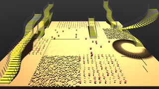
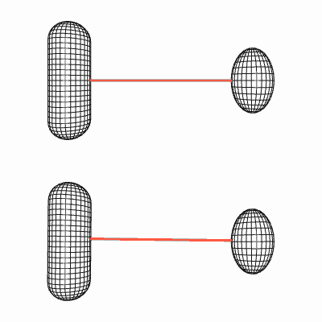
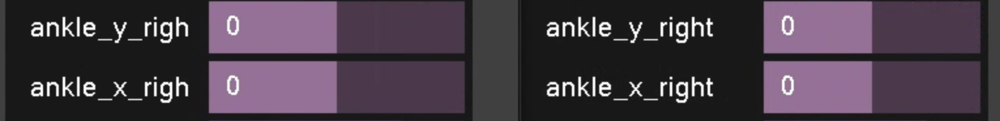
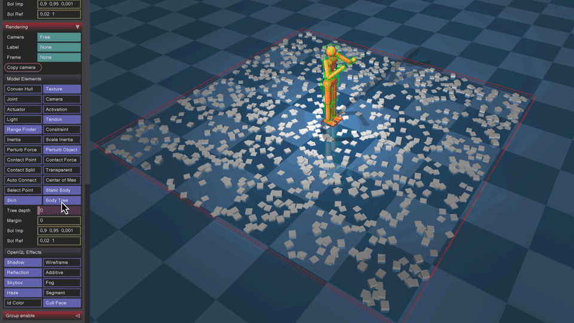
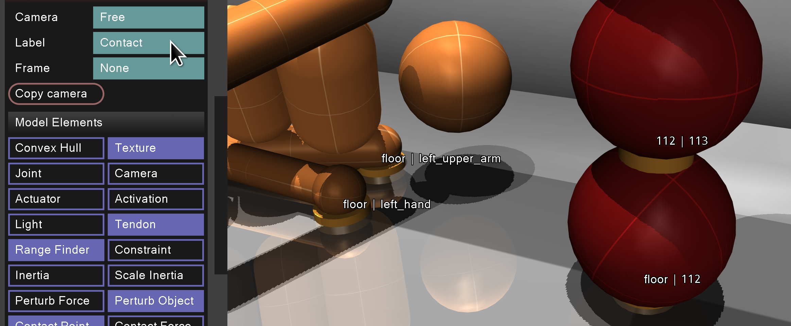
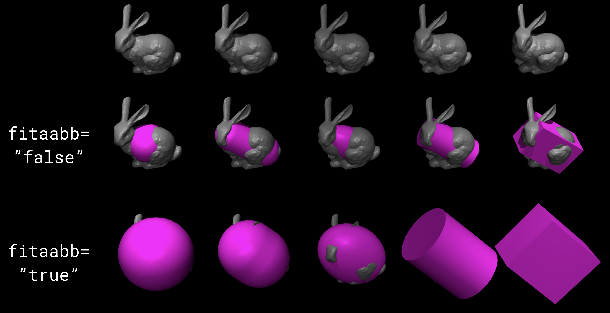
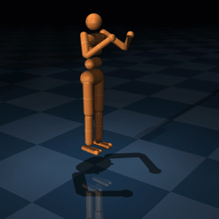

=========
Changelog
=========

Version 3.3.3 (June 10, 2025)
-----------------------------

General
^^^^^^^
1. Refactored island implementation so that island data is memory-contiguous. This speeds up island processing in the
   solver and clears the way for the addition of the Newton and PGS solvers (currently only CG is supported).
2. Removed the :at:`shell` plugin. This is now supported by :ref:`flexcomp<body-flexcomp>` and is active depending on
   the :ref:`elastic2d<flexcomp-elasticity-elastic2d>` attribute (off by default).
3. Replaced the :ref:`directional<body-light-directional>` (boolean) field for lights with a
   :ref:`type<body-light-type>` field (of type :ref:`mjtLightType<mjtLightType>`) to allow for additional lighting
   types.
4. Added new sub-component :ref:`mj_makeM` which combines the :ref:`mj_crb` call with additional logic to support the
   introduction in 3.3.1 of :ref:`tendon armature<tendon-spatial-armature>`. In addition to the traditional
   ``mjData.qM``, :ref:`mj_makeM` also computes ``mjData.M``, a CSR representation of the same matrix.
5. Added a new function :ref:`mj_copyBack` to copy real-valued arrays in an mjModel to a compatible mjSpec.
6. Removed the limitation of :ref:`fusestatic<compiler-fusestatic>` to models which contain no references. The fusestatic
   flag will now fuse all bodies which are not referenced and ignore bodies which are referenced.

Simulate
^^^^^^^^
7. The struct ``mjv_sceneState`` has been removed. This struct was used for partial synchronization of ``mjModel`` and
   ``mjData`` when the Python viewer is used in passive mode. This functionality is now provided by :ref:`mjv_copyModel`
   and :ref:`mjv_copyData`, which don't copy arrays which are not required for visualization.

Python bindings
^^^^^^^^^^^^^^^

8. Added examples of procedural terrain generation to the Model Editing tutorial: |mjspec_colab|

MJX
^^^
9. Added tendon armature.

Version 3.3.2 (April 28, 2025)
------------------------------

MJX
^^^
1. Added inverse dynamics.
2. Added tendon actuator force sensor.
3. Fix :github:issue:`2606` such that ``make_data`` copies over ``mocap_pos`` and ``mocap_quat``
   from ``body_pos`` and ``body_quat``.

Version 3.3.1 (Apr 9, 2025)
----------------------------

.. admonition:: Breaking API changes
   :class: attention

   1. The default value of the flag for toggling :ref:`internal flex contacts<flex-contact-internal>` was changed from
      "true" to "false". This feature has proven to be counterintuitive for users.
   2. All of the attach functions (``mjs_attachBody``, ``mjs_attachFrame``, ``mjs_attachToSite``,
      ``mjs_attachFrameToSite``) have been removed and replaced by a single function :ref:`mjs_attach`.

General
^^^^^^^
3. Added :ref:`tendon armature<tendon-spatial-armature>`: inertia associated with changes in tendon length.
4. Added the :ref:`compiler/saveinertial<compiler-saveinertial>` flag, writing explicit inertial clauses for all
   bodies when saving to XML.
5. Added :ref:`orientation<body-composite-quat>` attribute to :ref:`composite<body-composite>`. Moreover, allow the
   composite to be the direct child of a frame.
6. Added :ref:`tendon actuator force limits<tendon-spatial-actuatorfrclimited>` and
   :ref:`tendon actuator force sensor<sensor-tendonactuatorfrc>`.

MJX
^^^
7. Added tendon actuator force limits.

Bug fixes
^^^^^^^^^
8. :ref:`mj_jacDot` was missing a term that accounts for the motion of the point with respect to
   which the Jacobian is computed, now fixed.
9. Fixed a bug that caused the parent frame of elements in the child worldbody to be incorrectly set when attaching an
   mjSpec to a frame or a site.
10. Fixed a bug that caused shadow rendering to flicker on platforms (e.g., MacOS) that do not support
    ARB_clip_control. Fixed in collaboration with :github:user:`aftersomemath`.

Python bindings
^^^^^^^^^^^^^^^

.. youtube:: LbANnKMDOHg
   :aspect: 16:7
   :align: right
   :width: 240px

11. Added examples of procedural model creation to the Model Editing tutorial: |mjspec_colab|
12. Added support for nameless :ref:`mjSpec` objects in the ``bind`` method, see the corresponding
    :ref:`section<PyMJCF>` in the documentation.

.. |mjspec_colab| image:: https://colab.research.google.com/assets/colab-badge.svg
                  :target: https://colab.research.google.com/github/google-deepmind/mujoco/blob/main/python/mjspec.ipynb

Version 3.3.0 (Feb 26, 2025)
----------------------------

Feature promotion
^^^^^^^^^^^^^^^^^
.. youtube:: qJFbx-FR7Bc
   :aspect: 16:7
   :align: right
   :width: 240px

1. Introduced a new kind of **fast deformable body**, activated by setting :ref:`flexcomp/dof<body-flexcomp-dof>` to
   "trilinear". This type of :ref:`deformable<CDeformable>` flex object has the same collision geometry as a regular
   flex, but has far fewer degrees of freedom. Instead of 3 dofs per vertex, only the corners of the bounding box are
   free to move, with the positions of the interior vertices computed with trilinear interpolation of the 8 corners, for
   a total of 24 dofs for the entire flex object (or less, if some of the corners are pinned). This limits the types of
   deformation achievable by the flex, but allows for much faster simulation. For example, see the video on the right
   comparing `full <https://github.com/google-deepmind/mujoco/blob/main/model/flex/gripper.xml>`__ and `trilinear
   <https://github.com/google-deepmind/mujoco/blob/main/model/flex/gripper_trilinear.xml>`__ flexes for modeling
   deformable gripper pads.

.. image:: images/computation/ccd_dark.gif
   :width: 20%
   :align: right
   :class: only-dark

2. The native convex collision detection pipeline introduced in 3.2.3 and enabled by the
   :ref:`nativeccd<option-flag-nativeccd>` flag, is now the default. See the section on
   :ref:`Convex Collision Detection<coCCD>` for more details.

   **Migration:** If the new pipeline breaks your workflow, set :ref:`nativeccd<option-flag-nativeccd>` to "disable".

General
^^^^^^^
3. Add support for custom plots in the MuJoCo viewer by exposing a ``viewport`` property, a ``set_figures`` method,
   and a ``clear_figures`` method.
4. Separate collision and deformation meshes for :ref:`flex<deformable-flex>`. This enables a fixed cost for the soft
   body computations, while preserving the fidelity of high-resolution collisions.
5. Added :ref:`potential<sensor-e_potential>` and :ref:`kinetic<sensor-e_kinetic>` energy sensors.
6. Improved shadow rendering in the native renderer.
7. Moved ``introspect`` to ``python/introspect``.

.. admonition:: Breaking API changes
   :class: attention

   8. As mentioned above, the native convex collision detection pipeline is now the default, which may break some
      workflows. In this case, set :ref:`nativeccd<option-flag-nativeccd>` to "disable" to restore the old behavior.
   9. Added :ref:`mjs_setDeepCopy` API function. When the deep copy flag is 0, attaching a model will not copy it to the
      parent, so the original references to the child can be used to modify the parent after attachment. The default
      behavior is to perform such a shallow copy. The old behavior of creating a deep copy of the child model while
      attaching can be restored by setting the deep copy flag to 1.
   10. Changes to inertia inference from meshes:

       Previously, in order to specify that the mass lies on the surface, :ref:`geom/shellinertia<body-geom-shellinertia>`
       could be used for any geom type. Now this attribute is ignored if the geom is a mesh; instead, inertia inference
       for meshes is specified in the asset, using the :ref:`asset/mesh/inertia<asset-mesh-inertia>` attribute.

       Previously, if the volumetric inertia computation failed (for example due to a very flat mesh), the compiler
       would silently fall back to surface inertia computation. Now, the compiler will throw an informative error.
   11. Removed the composite type ``grid``. Users should instead use :ref:`flexcomp<body-flexcomp>`.
   12. Removed the ``particle`` composite type. It is recommended to use the more generic :ref:`replicate<replicate>`
       instead, see for example `this model
       <https://github.com/google-deepmind/mujoco/blob/main/model/replicate/particle.xml>`__.

MJX
^^^
13. Added support for spatial tendons with internal sphere and cylinder wrapping.
14. Fix a bug with box-box collisions :github:issue:`2356`.

Python bindings
^^^^^^^^^^^^^^^

15. Added a pedagogical colab notebook for ``mujoco.rollout``, a Python module for multithreaded simulation rollouts.
    It is available here |rollout_colab|.
    |br| Contribution by :github:user:`aftersomemath`.

.. |rollout_colab| image:: https://colab.research.google.com/assets/colab-badge.svg
                   :target: https://colab.research.google.com/github/google-deepmind/mujoco/blob/main/python/rollout.ipynb

Version 3.2.7 (Jan 14, 2025)
----------------------------

Python bindings
^^^^^^^^^^^^^^^
1. :ref:`rollout<PyRollout>` now features native multi-threading. If a sequence of ``MjData`` instances
   of length ``nthread`` is passed in, ``rollout`` will automatically create a thread pool and parallelize
   the computation. The thread pool can be reused across calls, but then the function cannot be called simultaneously
   from multiple threads. To run multiple threaded rollouts simultaneously, use the new class ``Rollout`` which
   encapsulates the thread pool. Contribution by :github:user:`aftersomemath`.
2. Fix global namespace pollution when using ``mjpython`` (:github:issue:`2265`).

General
^^^^^^^

.. admonition:: Breaking API changes (minor)
   :class: attention

   3. The field ``mjData.qLDiagSqrtInv`` has been removed. This field is only required for the dual solvers. It is now
      computed as-needed rather than unconditionally. Relatedly, added the corresponding argument to :ref:`mj_solveM2`.

4. Reduced the memory footprint of the PGS solver's :ref:`A matrix<soDual>`. This was the last remaining dense-memory
   allocation in MuJoCo, allowing for a significant reduction of the :ref:`dynamic memory allocation heuristic<CSize>`.

Bug fixes
^^^^^^^^^
5. Fixed a bug in the box-sphere collider, depth was incorrect for deep penetrations (:github:issue:`2206`).
6. Fixed a bug in :ref:`mj_mulM2` and added a test.

Version 3.2.6 (Dec 2, 2024)
---------------------------

General
^^^^^^^
1. Removed rope and loop from :ref:`composite<body-composite>`. The user is encouraged to instead use the :at:`cable`
   plugin or :ref:`flexcomp<body-flexcomp>`, respectively.

MJX
^^^
2. Added muscle actuators.

Python bindings
^^^^^^^^^^^^^^^
3. Provide prebuilt wheels for Python 3.13.
4. Added ``bind`` method and removed id attribute from :ref:`mjSpec` objects. Using ids is error prone in scenarios of
   repeated attachment and detachment. Python users are encouraged to use names for unique identification of model
   elements.
5. :ref:`rollout<PyRollout>` can now accept sequences of MjModel of length ``nroll``. Also removed the ``nroll``
   argument because its value can always be inferred.

Bug fixes
^^^^^^^^^
6. Fixed :github:issue:`2212`, type error in ``mjx.get_data``.
7. Fixed bug introduced in 3.2.0 in handling of :ref:`texrepeat<asset-material-texrepeat>` attribute, was mistakenly
   cast from ``float`` to ``int``, (fixed :github:issue:`2223`).

Version 3.2.5 (Nov 4, 2024)
---------------------------

Feature promotion
^^^^^^^^^^^^^^^^^
1. The :doc:`Model Editing<programming/modeledit>` framework afforded by :ref:`mjSpec`, introduced in 3.2.0 as an
   in-development feature, is now stable and recommended for general use.
2. The native convex collision detection pipeline introduced in 3.2.3 and enabled by the
   :ref:`nativeccd<option-flag-nativeccd>` flag, is not yet the default but is already recommended for general use.
   Please try it when encountering collision-related problems and report any issues you encounter.

General
^^^^^^^

3. The global compiler flag ``exactmeshinertia`` has been removed and replaced with the mesh-specific
   :ref:`inertia<asset-mesh-inertia>` attribute.
4. The not-useful ``convexhull`` compiler option (to disable computation of mesh convex hulls) has been removed.
5. Removed the deprecated ``mju_rotVecMat``, ``mju_rotVecMatT`` and ``mjv_makeConnector`` functions.
6. Sorting now uses a faster, native sort function (fixes :github:issue:`1638`).
7. The PBR texture layers introduced in 3.2.1 were refactored from separate sub-elements to a single
   :ref:`layer<material-layer>` sub-element.
8. The composite types box, cylinder, and sphere have been removed. Users should instead use the equivalent types
   available in :ref:`flexcomp<body-flexcomp>`.

MJX
^^^
9. Added ``apply_ft``, ``jac``, and  ``xfrc_accumulate`` as public functions.
10. Added ``TOUCH`` sensor.
11. Added support for ``eq_active``. Fixes :github:issue:`2173`.
12. Added ray intersection with ellipsoid.

Bug fixes
^^^^^^^^^
13. Fixed several bugs related to connect and weld constraints with site semantics (fixes :github:issue:`2179`, reported
    by :github:user:`yinfanyi`). The introduction of site specification to connects and welds in 3.2.3 conditionally
    changed the semantics of `mjData.eq_obj1id` and `mjData.eq_obj2id`, but these changes were not properly propagated
    in several places leading to incorrect computations of constraint inertia, readings of affected force/torque sensors
    and runtime enabling/disabling of such constraints.
14. Fixed a bug in slider-crank :ref:`transmission<geTransmission>`. The bug was introduced in 3.0.0.
15. Fixed a bug in flex texture coordinates that prevented the correct allocation of textures in mjModel.

Documentation
^^^^^^^^^^^^^
16. Function headers in the :doc:`API reference <../APIreference/APIfunctions>` now link to their source definitions
    in GitHub.

Version 3.2.4 (Oct 15, 2024)
----------------------------

General
^^^^^^^

.. youtube:: e8lUuykQPGs
   :aspect: 16:7
   :align: right
   :width: 240px

1. The Newton solver no longer requires ``nv*nv`` memory allocation, allowing for much larger models. See e.g.,
   `100_humanoids.xml  <https://github.com/google-deepmind/mujoco/blob/main/model/humanoid/100_humanoids.xml>`__.
   Two quadratic-memory allocations still remain to be fully sparsified: ``mjData.actuator_moment`` and the matrices
   used by the PGS solver.
2. Removed the :at:`solid` and :at:`membrane` plugins and moved the associated computations into the engine. See `3D
   example model <https://github.com/google-deepmind/mujoco/blob/main/model/flex/floppy.xml>`__ and `2D example model
   <https://github.com/google-deepmind/mujoco/blob/main/model/flex/trampoline.xml>`__ for examples of flex objects
   that previously required these plugins.
3. Replaced the function ``mjs_setActivePlugins`` with :ref:`mjs_activatePlugin`.

MJX
^^^
4. Added ``mocap_pos`` and ``mocap_quat`` in kinematics.
5. Added support for :ref:`spatial tendons <tendon-spatial>` with pulleys and external sphere and cylinder wrapping.
6. Added sphere-cylinder and sphere-ellipsoid collision functions (:github:issue:`2126`).
7. Fixed a bug with frictionloss constraints.
8. Added ``TENDONPOS`` and ``TENDONVEL`` sensors.
9. Fixed a bug with the computation of tangential contact forces in ``_decode_pyramid``.
10. Added ``JOINTINPARENT`` actuator transmission type.

Python bindings
^^^^^^^^^^^^^^^
11. Removed support for Python 3.8, now that it's `deprecated upstream <https://devguide.python.org/versions>`__.

Bug fixes
^^^^^^^^^
12. Fixed a bug where ``actuator_force`` was not set in MJX (:github:issue:`2068`).
13. Fixed bug where MJX data tendon fields were incorrect after calling ``mjx.put_data``.
14. The compiler now returns an error if height fields are used with :ref:`collision sensors<collision-sensors>` as they
    are not yet supported.

Version 3.2.3 (Sep 16, 2024)
----------------------------

General
^^^^^^^

.. admonition:: Breaking API changes
   :class: attention

   1. The runtime options ``mpr_tolerance`` and ``mpr_iterations`` were renamed to
      :ref:`ccd_tolerance<option-ccd_tolerance>` and :ref:`ccd_iterations<option-ccd_iterations>`, both in XML and in
      the :ref:`mjOption` struct. This is because the new convex collision detection pipeline (see below) does not use
      the MPR algorithm. The semantics of these options remain identical.
   2. The functions ``mjs_findMesh`` and ``mjs_findKeyframe`` were replaced by ``mjs_findElement``, which allows to look
      for any object type.
   3. The experimental use of 2D/3D elasticity plugins with :ref:`composite<body-composite>` has been removed. Users
      should instead use :ref:`flexcomp<body-flexcomp>`, which provides the correct collision behavior.

4. Added the :ref:`nativeccd<option-flag-nativeccd>` flag. When this flag is enabled, general convex collision
   detection is handled with a new native code path, rather than `libccd <https://github.com/danfis/libccd>`__.
   This feature is in early stages of testing, but users who've experienced issues related to collision detection are
   welcome to experiment with it and report any issues.

.. youtube:: kcM_oauk3ZA
   :aspect: 16:7
   :align: right
   :width: 240px

5. Added a new way of defining :ref:`connect<equality-connect>` and :ref:`weld<equality-weld>` equality constraints,
   using two sites. The new semantic is useful when the assumption that the constraint is satisfied
   in the base configuration does not hold. In this case the sites will "snap together" at the beginning of the
   simulation. Additionally, changing the site positions (``mjModel.site_pos``) and orientations
   ( ``mjModel.site_quat``) at runtime will correctly modify the constraint definition. This
   `example model <https://github.com/google-deepmind/mujoco/blob/main/test/engine/testdata/equality_site.xml>`__ using
   the new semantic is shown in the video on the right.
6. Introduced **free joint alignment**, an optimization that applies to bodies with a free joint and no child bodies
   (simple free-floating bodies): automatically aligning the body frame with the inertial frame. This feature can be
   toggled individually using the :ref:`freejoint/align<body-freejoint-align>` attribute or globally using the compiler
   :ref:`alignfree<compiler-alignfree>` attribute. The alignment diagonalizes the related 6x6 inertia sub-matrix,
   leading to both faster and more stable simulation of free bodies.

   While this optimization is a strict improvement, it changes the semantics of the joint's degrees-of-freedom.
   Therefore, ``qpos`` and ``qvel`` values saved in older versions (for example, in :ref:`keyframes<keyframe>`) will
   become invalid. The global compiler attribute currently defaults to "false" due to this potential breakage, but could
   be changed to "true" in a future release. Aligned free joints are recommended for all new models.

7. Added an :ref:`mjSpec` option for creating a texture directly from a buffer.
8. :ref:`shell (surface) inertia <body-geom-shellinertia>` is now supported by all geom types.
9. When :ref:`attaching<meAttachment>` sub-models, :ref:`keyframes<keyframe>` will now be correctly merged into the
   parent model, but only on the first attachment.
10. Added the :ref:`mjtSameFrame` enum which contains the possible frame alignments of bodies and their children. These
    alignments are used for computation shortcuts in :ref:`mj_kinematics`.
11. Added :ref:`mj_jacDot` for computing time-derivatives of kinematic Jacobians. Fixes :github:issue:`411`.

MJX
^^^
12. Added ``efc_pos`` to ``mjx.Data`` (:github:issue:`1388`).
13. Added position-dependent sensors: ``MAGNETOMETER``, ``CAMPROJECTION``, ``RANGEFINDER``, ``JOINTPOS``,
    ``ACTUATORPOS``, ``BALLQUAT``, ``FRAMEPOS``, ``FRAMEXAXIS``, ``FRAMEYAXIS``, ``FRAMEZAXIS``, ``FRAMEQUAT``,
    ``SUBTREECOM``, ``CLOCK``.
14. Added velocity-dependent sensors: ``VELOCIMETER``, ``GYRO``, ``JOINTVEL``, ``ACTUATORVEL``, ``BALLANGVEL``,
    ``FRAMELINVEL``, ``FRAMEANGVEL``, ``SUBTREELINVEL``, ``SUBTREEANGMOM``.
15. Added acceleration/force-dependent sensors: ``ACCELEROMETER``, ``FORCE``, ``TORQUE``, ``ACTUATORFRC``,
    ``JOINTACTFRC``, ``FRAMELINACC``, ``FRAMEANGACC``.
16. Changed default policy to avoid placing unused (MuJoCo-only) arrays on device.
17. Added ``device`` parameter to ``mjx.make_data`` to bring it to parity with ``mjx.put_model`` and ``mjx.put_data``.
18. Added support for :ref:`implicitfast integration<geIntegration>` for all cases except
    :doc:`fluid drag <computation/fluid>`.
19. Fixed a bug where ``qLDiagInv`` had the wrong size for sparse mass matrices.
20. Added support for joint and tendon :ref:`frictionloss <coFriction>`.
21. Added support for :ref:`connect<equality-connect>` equality constraints using two sites.
22. Added support for :ref:`spatial tendons <tendon-spatial>` with site wrapping.

Bug fixes
^^^^^^^^^
23. Fixed a performance regression introduced in 3.1.7 in mesh Bounding Volume Hierarchies (:github:issue:`1875`,
    contribution by :github:user:`michael-ahn`).
24. Fixed a bug wherein, for models that have both muscles and stateless actuators and used one of the implicit
    integrators, wrong derivatives would be computed.
25. Fixed a bug in tendon wrapping around spheres. Before this fix, tendons that wrapped around spheres with an
    externally-placed :ref:`sidesite<spatial-geom-sidesite>` could jump inside the sphere instead of wrapping around it.
26. Fixed a bug that caused :at:`meshdir` and :at:`texturedir` to be overwritten during model
    :ref:`attachment<meAttachment>`, preventing model attachment for models with assets in different directories.

Python bindings
^^^^^^^^^^^^^^^
27. Added support for engine plugins in :ref:`mjSpec` (:github:issue:`1903`).
28. Better error reporting for issues with the assets dictionary, when loading models.

Version 3.2.2 (Aug 8, 2024)
---------------------------

General
^^^^^^^
1. Increase texture and material limit back to 1000. 3.2.0 inadvertently reduced this limit to 100, breaking some
   existing models (:github:issue:`1877`).

Version 3.2.1 (Aug 5, 2024)
---------------------------

General
^^^^^^^
1. Renamed ``mjModel.tex_rgb`` to ``mjModel.tex_data``.
2. Added a new :ref:`autoreset<option-flag-autoreset>` flag to disable automatic reset when NaNs or infinities are
   detected.
3. Added sub-elements to the MJCF :ref:`material<asset-material>` element, to allow specification of multiple textures
   for rendering (e.g., ``occlusion, roughness, metallic``). Note that the MuJoCo renderer doesn't
   support these new features, and they are made available for use with external renderers.
4. Sorting (``mjQUICKSORT``) now calls ``std::sort`` when building with C++ (:github:issue:`1638`).

MJX
^^^
5. Added more fields to ``mjx.Model`` and ``mjx.Data`` for further compatibility with the corresponding MuJoCo structs.
6. Added support for :ref:`fixed tendons <tendon-fixed>`.
7. Added support for tendon length limits (``mjCNSTR_LIMIT_TENDON`` in :ref:`mjtConstraint`).
8. Added support for tendon equality constraints (``mjEQ_TENDON`` in :ref:`mjtEq`).
9. Added support for tendon actuator transmission (``mjTRN_TENDON`` in :ref:`mjtTrn`).

Python bindings
^^^^^^^^^^^^^^^
10. Added support for asset dictionary argument in ``mujoco.spec.from_file``, ``mujoco.spec.from_string`` and
    ``mujoco.spec.compile``.

Bug fixes
^^^^^^^^^
11. Fixed a bug where implicit integrators did not take into account disabled actuators (:github:issue:`1838`).

Version 3.2.0 (Jul 15, 2024)
----------------------------

New features
^^^^^^^^^^^^

1. Introduced a major new feature: **procedural model creation and editing**, using a new top-level data-structure
   :ref:`mjSpec`. See the :doc:`Model Editing<programming/modeledit>` chapter for details.
   Note that as of this release this feature is still in testing and subject to future breaking changes.
   Fixes :github:issue:`364`.

General
^^^^^^^

.. admonition:: Breaking API changes
   :class: attention

   2. Removed deprecated ``mj_makeEmptyFileVFS`` and ``mj_findFileVFS`` functions. The constants ``mjMAXVFS`` and
      ``mjMAXVFSNAME`` are also removed as they are no longer needed.

      **Migration:** Use :ref:`mj_addBufferVFS` to copy a buffer into a VFS file directly.

   3. Calls to :ref:`mj_defaultVFS` may allocate memory inside VFS, and the corresponding
      :ref:`mj_deleteVFS` must be called to deallocate any internal allocated memory.

   4. Deprecated ``mju_rotVecMat`` and ``mju_rotVecMatT`` in favor of :ref:`mju_mulMatVec3` and
      :ref:`mju_mulMatTVec3`. These function names and argument order are more consistent with the rest of the API.
      The older functions have been removed from the Python bindings and will be removed from the C API in the next
      release.
   5. Removed the ``actuator_actdim`` callback from actuator plugins. They now have the ``actdim`` attribute, which
      must be used with actuators that write state to the ``act`` array. This fixed a crash which happened when
      keyframes were used in a model with stateful actuator plugins. The PID plugin will give an error when the wrong
      value of actdim is provided.

6. Added :ref:`attach<body-attach>` meta-element to MJCF, which allows :ref:`attaching<meAttachment>` a subtree from a
   different model to a body in the current model.
7. The :ref:`VFS<Virtualfilesystem>` implementation has been rewritten in C++ and is now considerably more efficient in
   speed and memory footprint.

.. youtube:: ZXBTEIDWHhs
   :aspect: 16:7
   :align: right
   :width: 240px

8. Added support for orthographic cameras. This is available for both fixed cameras and the free camera, using the
   :ref:`camera/orthographic<body-camera-orthographic>` and :ref:`global/orthographic<visual-global-orthographic>`
   attributes, respectively.
9. Added :ref:`maxhullvert<asset-mesh-maxhullvert>`, the maximum number of vertices in a mesh's convex hull.
10. Added :ref:`mj_setKeyframe` for saving the current state into a model keyframe.
11. Added support for ``ball`` joints in the URDF parser ("spherical" in URDF).
12. Replaced ``mjUSEDOUBLE`` which was previously hard-coded in
    `mjtnum.h <https://github.com/google-deepmind/mujoco/blob/main/include/mujoco/mjtnum.h>`__
    with the build-time flag ``mjUSESINGLE``. If this symbol is not defined, MuJoCo will use double-precision floating
    point, as usual. If ``mjUSESINGLE`` is defined, MuJoCo will use single-precision floating point. See :ref:`mjtNum`.

    Relatedly, fixed various type errors that prevented building with single-precision.
13. Quaternions in ``mjData.qpos`` and ``mjData.mocap_quat`` are no longer normalized in-place by
    :ref:`mj_kinematics`. Instead they are normalized when they are used. After the first step, quaternions in
    ``mjData.qpos`` will be normalized.
14. Mesh loading in the compiler, which is usually the slowest part of the loading process, is now multi-threaded.

MJX
~~~
15. Added support for :ref:`elliptic friction cones<option-cone>`.
16. Fixed a bug that resulted in less-optimal linesearch solutions for some difficult constraint settings.
17. Fixed a bug in the Newton solver that sometimes resulted in less-optimal gradients.

.. youtube:: P83tKA1iz2Y
   :align: right
   :width: 360px

Simulate
^^^^^^^^
18. Added improved tutorial video.
19. Improved the Brownian noise generator.
20. Now displaying model load times if they are longer than 0.25 seconds.

Python bindings
^^^^^^^^^^^^^^^
21. Fixed a memory leak when using ``copy.deepcopy()`` on a ``mujoco.MjData`` instance (:github:issue:`1572`).

Bug fixes
^^^^^^^^^
22. Fix an issue where ``mj_copyData`` (or ``copy.copy()`` in the Python bindings) was not copying contact information
    correctly (:github:issue:`1710`).
23. Fix an issue with saving to XML that caused frames to be written multiple times (:github:issue:`1802`).

Version 3.1.6 (Jun 3, 2024)
---------------------------

General
^^^^^^^

1. Added :ref:`mj_geomDistance` for computing the shortest signed distance between two geoms and optionally a segment
   connecting them. Relatedly, added the 3 sensors: :ref:`distance<sensor-distance>`, :ref:`normal<sensor-normal>`,
   :ref:`fromto<sensor-fromto>`. See the function and sensor documentation for details. Fixes :github:issue:`51`.
2. Improvements to position actuators:

   - Added :ref:`timeconst<actuator-position-timeconst>` attribute to the :ref:`position actuator<actuator-position>`.
     When set to a positive value, the actuator is made stateful with :at:`filterexact` dynamics.
   - Added :ref:`dampratio<actuator-position-dampratio>` to both :el:`position` and :el:`intvelocity` actuators. An
     alternative to the :at:`kv` attribute, it provides a convenient way to set actuator damping using natural units.
     See attribute documentation for details.

MJX
^^^

3. Add height-field collision support. Fixes :github:issue:`1491`.
4. Add a pre-compiled field ``mesh_convex`` to ``mjx.Model`` so that mesh properties can be vmapped over.
   Fixes :github:issue:`1655`.
5. Fix a bug in convex mesh collisions, where erroneous edge contacts were being created even though face
   separating axes were found. Fixes :github:issue:`1695`.

Bug fixes
^^^^^^^^^

6. Fixed a bug the could cause collisions to be missed when :ref:`fusestatic<compiler-fusestatic>` is enabled, as is
   often the case for URDF imports. Fixes :github:issue:`1069`, :github:issue:`1577`.
7. Fixed a bug that was causing the visualization of SDF iterations to write outside the size of the vector storing
   them. Fixes :github:issue:`1539`.

Version 3.1.5 (May 7, 2024)
---------------------------

General
^^^^^^^

.. youtube:: 5k0_wsIRAFc
   :aspect: 16:7
   :align: right
   :width: 240px

1. Added the :ref:`replicate<replicate>` to MJCF, a :ref:`meta-element<meta-element>` which permits to repeat a subtree
   with incremental translational and rotational offsets.
2. Enabled an internal cache in the MuJoCo compiler resulting in recompilation speedup. Currently, processed
   textures, hfields, and OBJ meshes are cached. Support for Unity environments is not yet available.
3. Added ``mjModel.mesh_scale``: the scaling applied to asset vertices, as specified in the
   :ref:`scale<asset-mesh-scale>` attribute.
4. Added visual properties which are ignored by the native renderer, but can be used by external renderers:

   - :ref:`light/bulbradius<body-light-bulbradius>` attribute and corresponding ``mjModel.light_bulbradius`` field.
   - :ref:`material/metallic<asset-material-metallic>` attribute and corresponding ``mjModel.material_metallic`` field.
   - :ref:`material/roughness<asset-material-roughness>` attribute and corresponding ``mjModel.material_roughness``
     field.
5. The type of the ``size`` argument of :ref:`mj_stackAllocNum` and :ref:`mj_stackAllocInt` was changed from ``int``
   to ``size_t``.
6. Added support for gmsh format version 2.2 surface meshes in :ref:`flexcomp<body-flexcomp-file>`.

MJX
^^^
.. admonition:: Breaking API changes
   :class: attention

   7. Removed deprecated ``mjx.device_get_into`` and ``mjx.device_put`` functions as they lack critical new
      functionality.

      **Migration:** Use ``mjx.get_data_into`` instead of ``mjx.device_get_into``, and ``mjx.put_data`` instead of
      ``mjx.device_put``.

8. Added cylinder plane collisions.
9. Added ``efc_type`` to ``mjx.Data`` and ``dim``, ``efc_address`` to ``mjx.Contact``.
10. Added ``geom`` to ``mjx.Contact`` and marked ``geom1``, ``geom2`` deprecated.
11. Added ``ne``, ``nf``, ``nl``, ``nefc``, and ``ncon`` to ``mjx.Data`` to match ``mujoco.MjData``.
12. Given the above added fields, removed ``mjx.get_params``, ``mjx.ncon``, and ``mjx.count_constraints``.
13. Changed the way meshes are organized on device to speed up collision detection when a mesh is replicated for many
    geoms.
14. Fixed a bug where capsules might be ignored in broadphase colliision checking.
15. Added cylinder collisions using SDFs.
16. Added support for all :ref:`condim <coContact>`: 1, 3, 4, 6.
17. Add support functions for ``id2name`` and ``name2id``, MJX versions of :ref:`mj_id2name` and :ref:`mj_name2id`.
18. Added support for :ref:`gravcomp<body-gravcomp>` and :ref:`actuatorgravcomp<body-joint-actuatorgravcomp>`.
19. Fixed a bug in ``mjx.ray`` for sometimes allowed negative distances for ray-mesh tests.
20. Added a new `differentiable physics tutorial <https://colab.research.google.com/github/google-deepmind/mujoco/blob/main/mjx/training_apg.ipynb>`__ that demonstrates training locomotion policies with analytical gradients
    automatically derived from the MJX physics step.  Contribution by :github:user:`Andrew-Luo1`.

Bug fixes
^^^^^^^^^
21. Defaults of lights were not being saved, now fixed.
22. Prevent overwriting of frame names by body names when saving an XML. Bug introduced in 3.1.4.
23. Fixed bug in Python binding of :ref:`mj_saveModel`: ``buffer`` argument was documented as optional but was actually
    not optional.
24. Fixed bug that prevented memory allocations larger than 2.15 GB. Fixes :github:issue:`1606`.

Version 3.1.4 (April 10th, 2024)
--------------------------------

General
^^^^^^^
.. admonition:: Breaking API changes
   :class: attention

   1. Removed the ability to natively add noise to sensors. Note that the ``mjModel.sensor_noise`` field and
      :ref:`corresponding attribute<CSensor>` are kept and now function as a convenient location for the user to save
      standard-deviation information for their own use. This feature was removed because:

      - There was no mechanism to seed the random noise generator.
      - It was not thread-safe, even if seeding would have been provided, sampling on multiple threads would lead to
        non-reproducible results.
      - This feature was seen as overreach by the engine. Adding noise should be the user's responsibility.
      - We are not aware of anyone who was actually using the feature.

      **Migration:** Add noise to sensor values yourself.

2. Added the :ref:`actuatorgravcomp<body-joint-actuatorgravcomp>` joint attribute. When enabled, gravity compensation
   forces on the joint are treated as applied by actuators. See attribute documentation for more details. The example
   model
   `refsite.xml <https://github.com/google-deepmind/mujoco/blob/main/test/engine/testdata/actuation/refsite.xml>`__,
   which demostrates Cartesian actuation of an arm, has been updated to use this attribute.
3. Added support for gmsh format 2.2 , tetrahedral mesh, as generated by e.g. `fTetwild <https://github.com/wildmeshing/fTetWild>`__.

4. Added :ref:`mju_euler2Quat` for converting an Euler-angle sequence to quaternion.

MJX
^^^
5. Improved performance of SAT for convex collisions.
6. Fixed bug for sphere/capsule-convex deep penetration.
7. Fixed bug where ``mjx.Data`` produced by ``mjx.put_data`` had different treedef than ``mjx.make_data``.
8. Throw an error for margin/gap for convex mesh collisions, since they are not supported.
9. Added ellipsoid plane collisions.
10. Added support for userdata.
11. Added ellipsoid-ellipsoid and ellipsoid-capsule collisions using signed distance functions (SDFs).

Simulate
^^^^^^^^
12. Fixed bug in order of enable flag strings. Before this change, using the simulate UI to toggle the
    :ref:`invdiscrete<option-flag-invdiscrete>` or the (now removed) ``sensornoise`` flags would actually toggle the
    other flag.

Python bindings
^^^^^^^^^^^^^^^

.. youtube:: xHDS0n5DpqM
   :aspect: 16:7
   :align: right
   :width: 240px

13. Added the ``mujoco.minimize`` Python module for nonlinear least-squares, designed for System Identification (sysID).
    The sysID tutorial is work in progress, but a pedagogical colab notebook with examples, including Inverse
    Kinematics, is available here: |ls_colab|
    |br| The video on the right shows example clips from the tutorial.

.. |ls_colab| image:: https://colab.research.google.com/assets/colab-badge.svg
              :target: https://colab.research.google.com/github/google-deepmind/mujoco/blob/main/python/least_squares.ipynb

Version 3.1.3 (March 5th, 2024)
-------------------------------

General
^^^^^^^
1. Added the :at:`inheritrange` attribute to :ref:`position<actuator-position>` and
   :ref:`intvelocity<actuator-intvelocity>` actuators, allowing convenient setting of the actuator's
   :at:`ctrlrange` or :at:`actrange` (respectively), according to the range of the transmission
   target (joint or tendon). See :ref:`position/inheritrange<actuator-position-inheritrange>` for
   details.
2. Deprecated ``mj_makeEmptyFileVFS`` in favor of :ref:`mj_addBufferVFS`. :ref:`mjVFS` now computes checksums of
   its internal file buffers. :ref:`mj_addBufferVFS` allocates an empty buffer with a given name in an mjVFS and
   copies the data buffer into it, combining and replacing the deprecated two-step process of calling
   ``mj_makeEmptyFileVFS`` followed by a direct copy into the given mjVFS internal file buffer.
3. Added :ref:`mj_angmomMat` which computes the ``3 x nv`` angular momentum matrix :math:`H(q)`, providing the linear
   mapping from generalized velocities to subtree angular momentum :math:`h = H \dot q`. Contribution by
   :github:user:`v-r-a`.

MJX
^^^
4. Improved performance of getting and putting device data.

   - Use ``tobytes()`` for numpy array serialization, which is orders of magnitude faster than converting to tuples.
   - Avoid reallocating host ``mjData`` arrays when array shapes are unchanged.
   - Speed up calculation of ``mjx.ncon`` for models with many geoms.
   - Avoid calling ``mjx.ncon`` in ``mjx.get_data_into`` when ``nc`` can be derived from ``mjx.Data``.
5. Fixed a bug in ``mjx-viewer`` that prevented it from running.  Updated ``mjx-viewer`` to use newer
   ``mjx.get_data_into`` function call.
6. Fixed a bug in ``mjx.euler`` that applied incorrect damping when using dense mass matrices.
7. Fixed a bug in ``mjx.solve`` that was causing slow convergence when using ``mjSOL_NEWTON`` in :ref:`mjtSolver`.
8. Added support for :ref:`mjOption.impratio<mjOption>` to ``mjx.Model``.
9. Added support for cameras in ``mjx.Model`` and ``mjx.Data``. Fixes :github:issue:`1422`.
10. Added an implementation of broadphase using `top_k` and bounding spheres.

Python bindings
^^^^^^^^^^^^^^^
11. Fixed incorrect data types in the bindings for the ``geom``, ``vert``, ``elem``, and ``flex`` array members
    of the ``mjContact`` struct, and all array members of the ``mjrContext`` struct.

Version 3.1.2 (February 05, 2024)
---------------------------------

General
^^^^^^^
1. Improved the :ref:`discardvisual<compiler-discardvisual>` compiler flag, which now discards all visual-only assets.
   See :ref:`discardvisual<compiler-discardvisual>` for details.
2. Removed the :ref:`timer<mjtTimer>` for midphase colllision detection, it is now folded in with the narrowphase
   timer. This is because timing the two phases separately required fine-grained timers inside the collision
   functions; these functions are so small and fast that the timer itself was incurring a measurable cost.
3. Added the flag :ref:`bvactive<visual-global-bvactive>` to ``visual/global``, allowing users to turn off
   visualisation of active bounding volumes (the red/green boxes in this :ref:`this changelog item<midphase>`). For
   models with very high-resolution meshes, the computation required for this visualization can slow down simulation
   speed. Fixes :github:issue:`1279`.

   - Added color of :ref:`bounding volumes<visual-rgba-bv>` and :ref:`active bounding volumes<visual-rgba-bvactive>`
     to :ref:`visual/rgba<visual-rgba>`.
4. Height-field elevation data can now be specified directly in XML with the :ref:`elevation<asset-hfield-elevation>`
   attribute (and not only with PNG files).
   See `example model <https://github.com/google-deepmind/mujoco/blob/main/test/user/testdata/hfield_xml.xml>`__.

MJX
^^^
5. Added :ref:`dyntype<actuator-general-dyntype>` ``filterexact``.
6. Added :at:`site` transmission.
7. Updated MJX colab tutorial with more stable quadruped environment.
8. Added ``mjx.ray`` which mirrors :ref:`mj_ray` for planes, spheres, capsules, boxes, and meshes.
9. Added ``mjx.is_sparse`` which mirrors :ref:`mj_isSparse` and ``mjx.full_m`` which mirrors :ref:`mj_fullM`.
10. Added support for specifying sparse or dense mass matrices via :ref:`option-jacobian`.
11. Raise a not implemented error when nonzero frictionloss is present. Fixes :github:issue:`1344`.

Python bindings
^^^^^^^^^^^^^^^
12. Improved the implementation of the :ref:`rollout<PyRollout>` module. Note the changes below are breaking, dependent
    code will require modification.

    - Uses :ref:`mjSTATE_FULLPHYSICS<geFullPhysics>` as state spec, enabling divergence detection by inspecting time.
    - Allows user-defined control spec for any combination of :ref:`user input<geInput>` fields as controls.
    - Outputs are no longer squeezed and always have dim=3.
13. The ``sync`` function for the :ref:`passive viewer<PyViewerPassive>` can now pick up changes to rendering flags in
    ``user_scn``, as requested in :github:issue:`1190`.

Bug fixes
^^^^^^^^^
14. Fixed a bug that prevented the use of pins with plugins if flexes are not in the worldbody. Fixes
    :github:issue:`1270`.
15. Fixed a bug in the :ref:`muscle model<CMuscle>` that led to non-zero values outside the lower
    bound of the length range. Fixes :github:issue:`1342`.

Version 3.1.1 (December 18, 2023)
-----------------------------------

Bug fixes
^^^^^^^^^
1. Fixed a bug (introduced in 3.1.0) where box-box collisions produced no contacts if one box was deeply embedded in the
   other.
2. Fixed a bug in :ref:`simulate<saSimulate>` where the "LOADING..." message was not showing correctly.
3. Fixed a crash in the Python :ref:`passive viewer<PyViewerPassive>`, when used with models containing Flex objects.
4. Fixed a bug in MJX where ``site_xmat`` was ignored in ``get_data`` and ``put_data``
5. Fixed a bug in MJX where ``efc_address`` was sometimes incorrectly calculated in ``get_data``.

Version 3.1.0 (December 12, 2023)
---------------------------------

General
^^^^^^^
1. Improved convergence of Signed Distance Function (SDF) collisions by using line search and a new objective function
   for the optimization. This allows to decrease the number of initial points needed for finding the contacts and is
   more robust for very small or large geom sizes.
2. Added :ref:`frame<frame>` to MJCF, a :ref:`meta-element<meta-element>` which defines a pure coordinate transformation
   on its direct children, without requiring a :ref:`body<body>`.
3. Added the :at:`kv` attribute to the :ref:`position<actuator-position>` and :ref:`intvelocity<actuator-intvelocity>`
   actuators, for specifying actuator-applied damping. This can be used to implement a PD controller with 0 reference
   velocity. When using this attribute, it is recommended to use the implicitfast or implicit
   :ref:`integrators<geIntegration>`.

Plugins
^^^^^^^
4. Allow actuator plugins to use activation variables in ``mjData.act`` as their internal state, rather than
   ``mjData.plugin_state``. Actuator plugins can now specify :ref:`callbacks<mjpPlugin>` that compute activation
   variables, and they can be used with built-in :ref:`dyntype<actuator-plugin-dyntype>` actuator dynamics.
5. Added the `pid <https://github.com/deepmind/mujoco/blob/main/plugin/actuator/README.md>`__ actuator plugin, a
   configurable PID controller that implements the Integral term, which is not available with native MuJoCo actuators.

MJX
^^^
6.  Added ``site_xpos`` and ``site_xmat`` to MJX.
7. Added ``put_data``, ``put_model``, ``get_data`` to replace ``device_put`` and ``device_get_into``, which will be
   deprecated. These new functions correctly translate fields that are the result of intermediate calculations such as
   ``efc_J``.

Bug fixes
^^^^^^^^^
8. Fix bug in Cartesian actuation with movable refsite, as when using body-centric Cartesian actuators on a quadruped.
   Before this fix such actuators could lead to non-conservation of momentum.
9. Fix bug that prevented using flex with :ref:`simulate<saSimulate>`.
10. Fix bug that prevented the use of elasticity plugins in combination with pinned flex vertices.
11. Release Python wheels targeting macOS 10.16 to support x86_64 systems where ``SYSTEM_VERSION_COMPAT`` is set.
    The minimum supported version is still 11.0, but we release these wheels to fix compatibility for those users. See
    :github:issue:`1213`.
12. Fixed mass computation of meshes: Use the correct mesh volume instead of approximating it using the inertia box.

Version 3.0.1 (November 15, 2023)
---------------------------------

General
^^^^^^^
1. Added sub-terms of total passive forces in ``mjData.qfrc_passive`` to :ref:`mjData`:
   ``qfrc_{spring, damper, gravcomp, fluid}``. The sum of these vectors equals ``qfrc_passive``.

.. youtube:: H9qG9Zf2W44
   :aspect: 16:7
   :align: right
   :width: 240px

2. Added :ref:`actuatorgroupdisable<option-actuatorgroupdisable>` attribute and associated
   :ref:`mjOption.disableactuator<mjOption>` integer bitfield, which can be used to disable sets of actuators at runtime
   according to their :ref:`group<actuator-general-group>`. Fixes :github:issue:`1092`. See :ref:`CActDisable`.

   - The first 6 actuator groups are toggleable in the :ref:`simulate<saSimulate>` viewer. See `example model
     <https://github.com/google-deepmind/mujoco/blob/main/test/engine/testdata/actuation/actuator_group_disable.xml>`__
     and associated screen-capture on the right.

3. Increased ``mjMAXUIITEM`` (maximum number of UI elements per section in Simulate) to 200.

MJX
^^^
4. Added support for Newton solver (``mjSOL_NEWTON`` in :ref:`mjtSolver`).  The Newton solver significantly speeds up
   simulation on GPU:

   .. list-table:: Steps-per-second, Conjugate Gradient vs. Newton on A100
      :header-rows: 1
      :align: left

      * - Model
        - CG
        - Newton
        - Speedup
      * - `Humanoid <https://github.com/google-deepmind/mujoco/tree/56006355b29424658b56aedb48a4269bd4361c68/mjx/mujoco/mjx/benchmark/model/humanoid>`__
        - 640,000
        - 1,020,000
        - **1.6 x**
      * - `Barkour v0 <https://github.com/google-deepmind/mujoco/tree/56006355b29424658b56aedb48a4269bd4361c68/mjx/mujoco/mjx/benchmark/model/barkour_v0>`__
        - 1,290,000
        - 1,750,000
        - **1.35 x**
      * - `Shadow Hand <https://github.com/google-deepmind/mujoco/tree/56006355b29424658b56aedb48a4269bd4361c68/mjx/mujoco/mjx/benchmark/model/shadow_hand>`__
        - 215,000
        - 270,000
        - **1.25 x**

   Humanoid is the standard MuJoCo humanoid,
   `Google Barkour <https://blog.research.google/2023/05/barkour-benchmarking-animal-level.html>`__ and the Shadow Hand
   are both available in the :ref:`MuJoCo Menagerie<Menagerie>`.
5. Added support for joint equality constraints (``mjEQ_JOINT`` in :ref:`mjtEq`).
6. Fixed bug where mixed ``jnt_limited`` joints were not being constrained correctly.
7. Made ``device_put`` type validation more verbose (fixes :github:issue:`1113`).
8. Removed empty EFC rows from ``MJX``, for joints with no limits (fixes :github:issue:`1117`).
9. Fixed bug in ``scan.body_tree`` that led to incorrect smooth dynamics for some kinematic tree layouts.

Python bindings
^^^^^^^^^^^^^^^

10. Fix the macOS ``mjpython`` launcher to work with the Python interpreter from Apple Command Line Tools.
11. Fixed a crash when copying instances of ``mujoco.MjData`` for models that use plugins. Introduced a ``model``
    attribute to ``MjData`` which is reference to the model that was used to create that ``MjData`` instance.

Simulate
^^^^^^^^
12. :ref:`simulate<saSimulate>`: correct handling of "Pause update", "Fullscreen" and "VSync" buttons.

Documentation
^^^^^^^^^^^^^

.. youtube:: cE3s_IfO4g4
   :aspect: 16:7
   :align: right
   :width: 240px

13. Added cell to the `tutorial colab <https://github.com/google-deepmind/mujoco#getting-started>`__ providing an
    example of procedural camera control:
14. Added documentation for the :ref:`UI` framework.
15. Fixed typos and supported fields in docs (fixes :github:issue:`1105` and :github:issue:`1106`).

Bug fixes
^^^^^^^^^
16. Fixed bug relating to welds modified with :ref:`torquescale<equality-weld-torquescale>`.

Version 3.0.0 (October 18, 2023)
--------------------------------

New features
^^^^^^^^^^^^

1. Added simulation on GPU and TPU via the new :doc:`mjx` (MJX) Python module. Python users can now
   natively run MuJoCo simulations at millions of steps per second on Google TPU or their own accelerator hardware.

   - MJX is designed to work with on-device reinforcement learning algorithms.  This Colab notebook demonstrates using
     MJX along with reinforcement learning to train humanoid and quadruped robots to locomote: |colab|
   - The MJX API is compatible with MuJoCo but is missing some features in this release.  See the outline of
     :ref:`MJX feature parity <MjxFeatureParity>` for more details.

.. |colab| image:: https://colab.research.google.com/assets/colab-badge.svg
           :target: https://colab.research.google.com/github/google-deepmind/mujoco/blob/main/mjx/tutorial.ipynb

.. youtube:: QewlEqIZi1o
   :aspect: 16:7
   :align: right
   :width: 240px

2. Added new signed distance field (SDF) collision primitive. SDFs can take any shape and are not constrained to be
   convex. Collision points are found by minimizing the maximum of the two colliding SDFs via gradient descent.

   - Added new SDF plugin for defining implicit geometries. The plugin must define methods computing an SDF and its
     gradient at query points. See the :ref:`documentation<exWriting>` for more details.

.. youtube:: ra2bTiZHGlw
   :aspect: 16:7
   :align: right
   :width: 240px

3. Added new low-level model element called ``flex``, used to define deformable objects. These
   `simplicial complexes <https://en.wikipedia.org/wiki/Simplicial_complex>`__ can be of dimension 1, 2
   or 3, corresponding to stretchable lines, triangles or tetrahedra. Two new MJCF elements are used
   to define flexes. The top-level :ref:`deformable<deformable>` section contains the low-level flex definition.
   The :ref:`flexcomp<body-flexcomp>` element, similar to :ref:`composite<body-composite>` is a convenience macro for
   creating deformables, and supports the GMSH tetrahedral file format.

   - Added `shell <https://github.com/deepmind/mujoco/blob/main/plugin/elasticity/shell.cc>`__ passive force plugin,
     computing bending forces using a constant precomputed Hessian (cotangent operator).

   **Note**: This feature is still under development and subject to change. In particular, deformable object
   functionality is currently available both via :ref:`deformable<CDeformable>` and :ref:`composite<CComposite>`,
   and both are modifiable by the first-party
   `elasticity plugins <https://github.com/google-deepmind/mujoco/tree/main/plugin/elasticity>`__. We expect some of
   this functionality to be unified in the future.

.. youtube:: Vc1tq0fFvQA
   :aspect: 16:7
   :align: right
   :width: 240px

4. Added constraint island discovery with :ref:`mj_island`. Constraint islands are disjoint sets of constraints
   and degrees-of-freedom that do not interact. The only solver which currently supports islands is
   :ref:`CG<option-solver>`. Island discovery can be activated using a new :ref:`enable flag<option-flag-island>`.
   If island discovery is enabled, geoms, contacts and tendons will be colored according to the corresponding island,
   see video. Island discovery is currently disabled for models that have deformable objects (see previous item).

5. Added :ref:`mjThreadPool` and :ref:`mjTask` which allow for multi-threaded operations within the MuJoCo engine
   pipeline. If engine-internal threading is enabled, the following operations will be multi-threaded:

   - Island constraint resolution, if island discovery is :ref:`enabled<option-flag-island>` and the
     :ref:`CG solver<option-solver>` is selected. The
     `22 humanoids <https://github.com/deepmind/mujoco/blob/main/model/humanoid/22_humanoids.xml>`__ model shows a 3x
     speedup compared to the single threaded simulation.
   - Inertia-related computations and collision detection will happen in parallel.

   Engine-internal threading is a work in progress and currently only available in first-party code via the
   :ref:`testspeed<saTestspeed>` utility, exposed with the ``npoolthread`` flag.

6. Added capability to initialize :ref:`composite<body-composite>` particles from OBJ files. Fixes :github:issue:`642`
   and :github:issue:`674`.

General
^^^^^^^

.. admonition:: Breaking API changes
   :class: attention

   7. Removed the macros ``mjMARKSTACK`` and ``mjFREESTACK``.

      **Migration:** These macros have been replaced by new functions :ref:`mj_markStack` and
      :ref:`mj_freeStack`. These functions manage the :ref:`mjData stack<siStack>` in a fully encapsulated way (i.e.,
      without introducing a local variable at the call site).

   8. Renamed ``mj_stackAlloc`` to :ref:`mj_stackAllocNum`. The new function :ref:`mj_stackAllocByte` allocates an
      arbitrary number of bytes and has an additional argument for specifying the alignment of the returned pointer.

      **Migration:** The functionality for allocating ``mjtNum`` arrays is now available via :ref:`mj_stackAllocNum`.

   9. Renamed the ``nstack`` field in :ref:`mjModel` and :ref:`mjData` to ``narena``. Changed ``narena``, ``pstack``,
      and ``maxuse_stack`` to count number of bytes rather than number of :ref:`mjtNum` |-| s.

   10. Changed :ref:`mjData.solver<mjData>`, the array used to collect solver diagnostic information.
       This array of :ref:`mjSolverStat` structs is now of length ``mjNISLAND * mjNSOLVER``, interpreted as as a matrix.
       Each row of length ``mjNSOLVER`` contains separate solver statistics for each constraint island.
       If the solver does not use islands, only row 0 is filled.

       - The new constant :ref:`mjNISLAND<glNumeric>` was set to 20.
       - :ref:`mjNSOLVER<glNumeric>` was reduced from 1000 to 200.
       - Added :ref:`mjData.solver_nisland<mjData>`: the number of islands for which the solver ran.
       - Renamed ``mjData.solver_iter`` to ``solver_niter``. Both this member and ``mjData.solver_nnz`` are now integer
         vectors of length ``mjNISLAND``.

   11. Removed ``mjOption.collision`` and the associated ``option/collision`` attribute.

       **Migration:**

       - For models which have ``<option collision="all"/>``, delete the attribute.
       - For models which have ``<option collision="dynamic"/>``, delete all :ref:`pair<contact-pair>` elements.
       - For models which have ``<option collision="predefined"/>``, disable all dynamic collisions (determined
         via contype/conaffinity) by first deleting all :ref:`contype<body-geom-contype>` and
         :ref:`conaffinity<body-geom-conaffinity>` attributes in the model and then setting them globally to ``0`` using
         |br| ``<default> <geom contype="0" conaffinity="0"/> </default>``.

   12. Removed the :at:`rope` and :at:`cloth` composite objects.

       **Migration:** Users should use the :at:`cable` and :at:`shell` elasticity plugins.

   13. Added :ref:`mjData.eq_active<mjData>` user input variable, for enabling/disabling the state of equality
       constraints. Renamed ``mjModel.eq_active`` to :ref:`mjModel.eq_active0<mjModel>`, which now has the semantic of
       "initial value of ``mjData.eq_active``". Fixes :github:issue:`876`.

       **Migration:** Replace uses of ``mjModel.eq_active`` with ``mjData.eq_active``.

   14. Changed the default of :ref:`autolimits<compiler-autolimits>` from "false" to "true". This is a minor breaking
       change. The potential breakage applies to models which have elements with "range" defined and "limited" not set.
       Such models cannot be loaded since version 2.2.2 (July 2022).

15. Added a new :ref:`dyntype<actuator-general-dyntype>`, ``filterexact``, which updates first-order filter states with
    the exact formula rather than with Euler integration.
16. Added an actuator attribute, :ref:`actearly<actuator-general-actearly>`, which uses semi-implicit integration for
    actuator forces: using the next step's actuator state to compute the current actuator forces.
17. Renamed ``actuatorforcerange`` and ``actuatorforcelimited``, introduced in the previous version to
    :ref:`actuatorfrcrange<body-joint-actuatorfrcrange>` and
    :ref:`actuatorfrclimited<body-joint-actuatorfrclimited>`, respectively.
18. Added the flag :ref:`eulerdamp<option-flag-eulerdamp>`, which disables implicit integration of joint damping in the
    Euler integrator. See the :ref:`Numerical Integration<geIntegration>` section for more details.
19. Added the flag :ref:`invdiscrete<option-flag-invdiscrete>`, which enables discrete-time inverse dynamics for all
    :ref:`integrators<option-integrator>` other than ``RK4``. See the flag documentation for more details.
20. Added :ref:`ls_iterations<option-ls_iterations>` and :ref:`ls_tolerance<option-ls_tolerance>` options for adjusting
    linesearch stopping criteria in CG and Newton solvers. These can be useful for performance tuning.
21. Added ``mesh_pos`` and ``mesh_quat`` fields to :ref:`mjModel` to store the normalizing transformation applied to
    mesh assets. Fixes :github:issue:`409`.
22. Added camera :ref:`resolution<body-camera-resolution>` attribute and :ref:`camprojection<sensor-camprojection>`
    sensor. If camera resolution is set to positive values, the camera projection sensor will report the location of a
    target site, projected onto the camera image, in pixel coordinates.
23. Added :ref:`camera<body-camera>` calibration attributes:

    - The new attributes are :ref:`resolution<body-camera-resolution>`, :ref:`focal<body-camera-focal>`,
      :ref:`focalpixel<body-camera-focalpixel>`, :ref:`principal<body-camera-principal>`,
      :ref:`principalpixel<body-camera-principalpixel>` and :ref:`sensorsize<body-camera-sensorsize>`.
    - Visualize the calibrated frustum using the :ref:`mjVIS_CAMERA<mjtVisFlag>` visualization flag when these
      attributes are specified. See the following
      `example model <https://github.com/deepmind/mujoco/blob/main/test/engine/testdata/vis_visualize/frustum.xml>`__.
    - Note that these attributes only take effect for offline rendering and do not affect interactive visualisation.
24. Implemented reversed Z rendering for better depth precision. An enum :ref:`mjtDepthMap` was added with values
    ``mjDEPTH_ZERONEAR`` and ``mjDEPTH_ZEROFAR``, which can be used to set the new ``readDepthMap`` attribute in
    :ref:`mjrContext` to control how the depth returned by :ref:`mjr_readPixels` is mapped from ``znear`` to ``zfar``.
    Contribution :github:pull:`978` by `Levi Burner <https://github.com/aftersomemath>`__.
25. Deleted the code sample ``testxml``. The functionality provided by this utility is implemented in the
    `WriteReadCompare <https://github.com/google-deepmind/mujoco/blob/main/test/xml/xml_native_writer_test.cc>`__ test.
26. Deleted the code sample ``derivative``. Functionality provided by :ref:`mjd_transitionFD`.

Python bindings
^^^^^^^^^^^^^^^

27. Fixed :github:issue:`870` where calling ``update_scene`` with an invalid camera name used the default camera.
28. Added ``user_scn`` to the :ref:`passive viewer<PyViewerPassive>` handle, which allows users to add custom
    visualization geoms (:github:issue:`1023`).
29. Added optional boolean keyword arguments ``show_left_ui`` and ``show_right_ui`` to the functions ``viewer.launch``
    and ``viewer.launch_passive``, which allow users to launch a viewer with UI panels hidden.

Simulate
^^^^^^^^

.. youtube:: YSvWn_poqWs
   :aspect: 16:7
   :align: right
   :width: 240px

30. Added **state history** mechanism to :ref:`simulate<saSimulate>` and the managed
    :ref:`Python viewer<PyViewerManaged>`. State history can be viewed by scrubbing the History slider and (more
    precisely) with the left and right arrow keys. See screen capture:

31. The ``LOADING...`` label is now shown correctly. Contribution :github:pull:`1070` by
    `Levi Burner <https://github.com/aftersomemath>`__.

Documentation
^^^^^^^^^^^^^

.. youtube:: nljr0X79vI0
   :aspect: 16:7
   :align: right
   :width: 240px

32. Added :doc:`detailed documentation <computation/fluid>` of fluid force modeling, and an illustrative example model
    showing `tumbling cards <https://github.com/google-deepmind/mujoco/blob/main/model/cards/cards.xml>`__ using the
    ellipsoid-based fluid model.

Bug fixes
^^^^^^^^^

33. Fixed a bug that was causing :ref:`geom margin<body-geom-margin>` to be ignored during the construction of
    midphase collision trees.

34. Fixed a bug that was generating incorrect values in ``efc_diagApprox`` for weld equality constraints.

Version 2.3.7 (July 20, 2023)
-----------------------------

General
^^^^^^^

1. Added primitive collider for sphere-cylinder contacts, previously this pair used the generic convex-convex collider.
#. Added :ref:`joint-actuatorforcerange<body-joint-actuatorfrcrange>` for clamping total actuator force at joints and
   :ref:`sensor-jointactuatorfrc<sensor-jointactuatorfrc>` for measuring total actuation force applied at a joint. The
   most important use case for joint-level actuator force clamping is to ensure that
   :ref:`Cartesian actuator<actuator-general-refsite>` forces are realizable by individual motors at the joints.
   See :ref:`CForceRange` for details.
#. Added an optional ``content_type`` attribute to hfield, texture, and mesh assets. This attribute supports a formatted
   `Media Type <https://www.iana.org/assignments/media-types/media-types.xhtml>`_ (previously known as MIME type) string
   used to determine the type of the asset file without resorting to pulling the type from the file extension.
#. Added analytic derivatives for quaternion :ref:`subtraction<mjd_subQuat>` and :ref:`integration<mjd_quatIntegrate>`
   (rotation with an angular velocity). Derivatives are in the 3D tangent space.
#. Added :ref:`mjv_connector` which has identical functionality to ``mjv_makeConnector``, but with more convenient
   "from-to" argument parametrization. ``mjv_makeConnector`` is now deprecated.
#. Bumped oldest supported MacOS from version 10.12 to 11. MacOS 11 is the oldest version still maintained by Apple.

Python bindings
^^^^^^^^^^^^^^^

7. The :ref:`passive viewer<PyViewerPassive>` handle now exposes ``update_hfield``, ``update_mesh``, and
   ``update_texture`` methods to allow users to update renderable assets.
   (Issues :github:issue:`812`, :github:issue:`958`, :github:issue:`965`).
#. Allow a custom keyboard event callback to be specified in the :ref:`passive viewer<PyViewerPassive>`
   (:github:issue:`766`).
#. Fix GLFW crash when Python exits while the passive viewer is running (:github:issue:`790`).

Models
^^^^^^

10. Added simple `car <https://github.com/google-deepmind/mujoco/blob/main/model/car/car.xml>`__ example model.

Version 2.3.6 (June 20, 2023)
-----------------------------

.. note::
   MuJoCo 2.3.6 is the last version to officially support Python 3.7.

.. youtube:: ZppeDArq6AU
   :align: right
   :width: 240px

Models
^^^^^^

1. Added `3x3x3 cube <https://github.com/google-deepmind/mujoco/blob/main/model/cube/cube_3x3x3.xml>`__ example model.
   See `README <https://github.com/google-deepmind/mujoco/blob/main/model/cube/README.md>`__ for details.

Bug fixes
^^^^^^^^^

2. Fixed a bug that was causing an incorrect computation of the mesh bounding box and coordinate frame if the volume was
   invalid. In such case, now MuJoCo only accepts a non-watertight geometry if
   :ref:`shellinertia<body-geom-shellinertia>` is equal to ``true``.
#. Fixed the sparse Jacobian multiplication logic that is used to compute derivatives for tendon damping and fluid
   force, which affects the behaviour of the :ref:`implicit and implicitfast integrators<geIntegration>`.
#. Fixes to :ref:`mj_ray`, in line with geom visualisation conventions:

   - Planes and height-fields respect the ``geom_group`` and ``flg_static`` arguments. Before this change, rays would
     intersect planes and height-fields unconditionally.
   - ``flg_static`` now applies to all static geoms, not just those which are direct children of the world body.

.. youtube:: hqIMTNGaLF4
   :align: right
   :width: 240px

Plugins
^^^^^^^

5. Added touch-grid sensor plugin. See `documentation <https://github.com/google-deepmind/mujoco/blob/main/plugin/sensor/README.md>`__
   for details, and associated `touch_grid.xml <https://github.com/google-deepmind/mujoco/blob/main/model/plugin/sensor/touch_grid.xml>`__
   example model. The plugin includes `in-scene visualisation <https://youtu.be/0LOJ3WMnqeA>`__.

Simulate
^^^^^^^^

.. youtube:: mXVPbppGk5I
   :aspect: 16:7
   :align: right
   :width: 240px

6. Added Visualization tab to simulate UI, corresponding to elements of the :ref:`visual<visual>` MJCF element. After
   modifying values in the GUI, a saved XML will contain the new values. The modifiable members of
   :ref:`mjStatistic` (:ref:`extent<statistic-extent>`, :ref:`meansize<statistic-meansize>` and
   :ref:`center<statistic-center>`) are computed by the compiler and therefore do not have defaults. In order for these
   attributes to appear in the saved XML, a value must be specified in the loaded XML.

7. Increased text width for UI elements in the default spacing. [before / after]:

General
^^^^^^^

8. Added :ref:`mj_getState` and :ref:`mj_setState` for getting and setting the simulation state as a concatenated vector
   of floating point numbers. See the :ref:`State<geState>`  section for details.
#. Added :ref:`mjContact.solreffriction<mjContact>`, allowing different :ref:`solref<CSolver>` parameters for the normal
   and frictional axes of contacts when using :ref:`elliptic friction cones<option-cone>`.  This attribute is required
   for elastic frictional collisions, see associated
   `example model <https://github.com/google-deepmind/mujoco/blob/main/test/engine/testdata/spin_recoil.xml>`__
   mimicking the spin-bounce recoil behaviour of `elastic rubber balls <https://www.youtube.com/watch?v=uFLJcRegIVQ&t=3s>`__.
   This is an advanced option currently only supported by explicit :ref:`contact pairs<contact-pair>`, using the
   :ref:`solreffriction<contact-pair-solreffriction>` attribute.
#. Added :ref:`mjd_inverseFD` for finite-differenced inverse-dynamics derivatives.
#. Added functions for operations on banded-then-dense "arrowhead" matrices. Such matrices are common when doing direct
   trajectory optimization. See :ref:`mju_cholFactorBand` documentation for details.
#. Added :ref:`mj_multiRay` function for intersecting multiple rays emanating from a single point.
   This is significantly faster than calling :ref:`mj_ray` multiple times.
#. Ray-mesh collisions are now up to 10x faster, using a bounding volume hierarchy of mesh faces.
#. Increased ``mjMAXUIITEM`` (maximum number of UI elements per section in Simulate) to 100.
#. Added :ref:`documentation<exProvider>` for resource providers.
#. Changed the formula for :ref:`mju_sigmoid`, a finite-support sigmoid :math:`s \colon \mathbf R \rightarrow [0, 1]`.
   Previously, the smooth part consisted of two stitched quadratics, once continuously differentiable.
   It is now a single quintic, twice continuously differentiable:

   .. math::
      s(x) =
      \begin{cases}
         0,                    &       & x \le 0  \\
         6x^5 - 15x^4 + 10x^3, & 0 \lt & x \lt 1  \\
         1,                    & 1 \le & x \qquad
      \end{cases}

17. Added optional :ref:`tausmooth<actuator-muscle-tausmooth>` attribute to muscle actuators. When positive, the
    time-constant :math:`\tau` of muscle activation/deactivation uses :ref:`mju_sigmoid` to transition smoothly
    between the two extremal values given by the `Millard et al. (2013) <https://doi.org/10.1115/1.4023390>`__ muscle
    model, within a range of width tausmooth.  See :ref:`Muscle actuators<CMuscle>` for more details.
    Relatedly, :ref:`mju_muscleDynamics` now takes 3 parameters instead of 2, adding the new smoothing-width parameter.
#.  Moved public C macro definitions out of mujoco.h into a new public header file called
    `mjmacro.h <https://github.com/google-deepmind/mujoco/blob/main/include/mujoco/mjmacro.h>`__. The new file
    is included by mujoco.h so this change does not break existing user code.
#.  Added instrumentation for the `Address Sanitizer (ASAN) <https://clang.llvm.org/docs/AddressSanitizer.html>`__ and
    `Memory Sanitizer (MSAN) <https://clang.llvm.org/docs/MemorySanitizer.html>`__ to detect memory bugs when allocating
    from the ``mjData`` stack and arena.
#.  Removed ``pstack`` and ``parena`` from the output of ``mj_printData``, since these are implementation details of the
    ``mjData`` allocators that are affected by diagnostic paddings in instrumented builds.
#.  Removed the ``mj_activate`` and ``mj_deactivate`` functions. These had been kept around for compatibility with old
    user code from when MuJoCo was closed source, but have been no-op functions since open sourcing.

Version 2.3.5 (April 25, 2023)
------------------------------

Bug fixes
^^^^^^^^^

1. Fix asset loading bug that prevented OBJ and PNG files from being read from disk when :ref:`mjVFS` is used.
#. Fix occasional segmentation faults on macOS when mouse perturbations are applied in the Python passive viewer.

Plugins
^^^^^^^

3. The ``visualize`` callback in :ref:`mjpPlugin` now receives an :ref:`mjvOption` as an input argument.

Version 2.3.4 (April 20, 2023)
------------------------------

.. note::

   This version is affected by an asset loading bug that prevents OBJ and PNG files from being read from disk when
   ``mjVFS`` is used. Users are advised to skip to version 2.3.5 instead.

General
^^^^^^^

1. Removed the "global" setting of the :ref:`compiler/coordinate<compiler-coordinate>` attribute. This rarely-used
   setting complicates the compiler logic and is blocking future improvements. In order to convert older models which
   used this option, load and save them in MuJoCo 2.3.3 or older.

.. image:: images/changelog/ellipsoidinertia.gif
   :align: right
   :width: 240px

2. Added :ref:`visual-global<visual-global>` flag :ref:`ellipsoidinertia<visual-global-ellipsoidinertia>` to visualize
   equivalent body inertias with ellipsoids instead of the default boxes.
#. Added midphase and broadphase collision statistics to :ref:`mjData`.
#. Added documentation for :ref:`engine plugins<exPlugin>`.
#. Added struct information to the ``introspect`` module.
#. Added a new extension mechanism called :ref:`resource providers<exProvider>`. This extensible mechanism allows MuJoCo
   to read assets from data sources other than the local OS filesystem or
   the :ref:`Virtual file system<Virtualfilesystem>`.

Python bindings
^^^^^^^^^^^^^^^

7. Offscreen rendering on macOS is no longer restricted to the main thread. This is achieved by using the low-level
   Core OpenGL (CGL) API to create the OpenGL context, rather than going via GLFW which relies on Cocoa's NSOpenGL.
   The resulting context is not tied to a Cocoa window, and is therefore not tied to the main thread.
#. Fixed a race condition in ``viewer.launch_passive`` and  ``viewer.launch_repl``. These functions could previously
   return before an internal call to ``mj_forward``. This allows user code to continue and potentially modify physics
   state concurrently with the internal ``mj_forward``, resulting in e.g.
   `MuJoCo stack overflow error <https://github.com/google-deepmind/mujoco/issues/783>`__
   or `segmentation fault <https://github.com/google-deepmind/mujoco/issues/790>`__.
#. The ``viewer.launch_passive`` function now returns a handle which can be used to interact with the viewer. The
   passive viewer now also requires an explicit call to ``sync`` on its handle to pick up any update to the physics
   state. This is to avoid race conditions that can result in visual artifacts. See
   :ref:`documentation<PyViewerPassive>` for details.
#. The ``viewer.launch_repl`` function has been removed since its functionality is superseded by ``launch_passive``.
#. Added a small number of missing struct fields discovered through the new ``introspect`` metadata.

Bug fixes
^^^^^^^^^

12. Fixed bug in the handling of ellipsoid-based fluid model forces in the new implicitfast integrator.
#.  Removed spurious whole-arena copying in `mj_copyData`, which can considerably
    `slow down <https://github.com/google-deepmind/mujoco/issues/568>`__ the copying operation.
#. Make :ref:`shellinertia<body-geom-shellinertia>` ignore ``exactmeshinertia``, which is
    only used for legacy volume computations (`#759 <https://github.com/google-deepmind/mujoco/issues/759>`__).

Version 2.3.3 (March 20, 2023)
------------------------------

General
^^^^^^^

1. Improvements to implicit integration:

   - The derivatives of the RNE algorithm are now computed using sparse math, leading to significant speed
     improvements for large models when using the :ref:`implicit integrator<geIntegration>`.
   - A new integrator called ``implicitfast`` was added. It is similar to the existing implicit integrator, but skips the
     derivatives of Coriolis and centripetal forces. See the :ref:`numerical integration<geIntegration>` section for a
     detailed motivation and discussion. The implicitfast integrator is recommended for all new models and will
     become the default integrator in a future version.

   The table below shows the compute cost of the 627-DoF `humanoid100
   <https://github.com/google-deepmind/mujoco/blob/main/model/humanoid/humanoid100.xml>`__ model using different
   integrators. "implicit (old)" uses dense RNE derivatives, "implicit (new)" is after the sparsification mentioned
   above. Timings were measured on a single core of an AMD 3995WX CPU.

.. csv-table::
   :header: "timing", "Euler", "implicitfast", "implicit (new)", "implicit (old)"
   :widths: auto
   :align: left

   one step (ms),  0.5,   0.53,  0.77,  5.0
   steps/second,   2000,  1900,  1300,  200

.. _midphase:

2. Added a collision mid-phase for pruning geoms in body pairs, see :ref:`documentation<coSelection>` for more details.
   This is based on static AABB bounding volume hierarchy (a BVH binary tree) in the body inertial frame. The GIF on
   the right is cut from `this longer video <https://youtu.be/e0babIM8hBo>`__.
#. The ``mjd_transitionFD`` function no longer triggers sensor calculation unless explicitly requested.
#. Corrected the spelling of the ``inteval`` attribute to ``interval`` in the :ref:`mjLROpt` struct.
#. Mesh texture and normal mappings are now 3-per-triangle rather than 1-per-vertex. Mesh vertices are no longer
   duplicated in order to circumvent this limitation as they previously were.
#. The non-zeros for the sparse constraint Jacobian matrix are now precounted and used for matrix memory allocation.
   For instance, the constraint Jacobian matrix from the `humanoid100
   <https://github.com/google-deepmind/mujoco/blob/main/model/humanoid/humanoid100.xml>`__ model, which previously
   required ~500,000 ``mjtNum``'s, now only requires ~6000. Very large models can now load and run with the CG solver.
#. Modified :ref:`mju_error` and :ref:`mju_warning` to be variadic functions (support for printf-like arguments). The
   functions :ref:`mju_error_i`, :ref:`mju_error_s`, :ref:`mju_warning_i`, and :ref:`mju_warning_s` are now deprecated.
#. Implemented a performant ``mju_sqrMatTDSparse`` function that doesn't require dense memory allocation.
#. Added ``mj_stackAllocInt`` to get correct size for allocating ints on mjData stack. Reducing stack memory usage
   by 10% - 15%.

Python bindings
^^^^^^^^^^^^^^^

10. Fixed IPython history corruption when using ``viewer.launch_repl``. The ``launch_repl`` function now provides
    seamless continuation of an IPython interactive shell session, and is no longer considered experimental feature.
#.  Added ``viewer.launch_passive`` which launches the interactive viewer in a passive, non-blocking mode. Calls to
    ``launch_passive`` return immediately, allowing user code to continue execution, with the viewer automatically
    reflecting any changes to the physics state. (Note that this functionality is currently in experimental/beta stage,
    and is not yet described in our :ref:`viewer documentation<PyViewer>`.)
#.  Added the ``mjpython`` launcher for macOS, which is required for ``viewer.launch_passive`` to function there.
#.  Removed ``efc_`` fields from joint indexers. Since the introduction of arena memory, these fields now have dynamic
    sizes that change between time steps depending on the number of active constraints, breaking strict correspondence
    between joints and ``efc_`` rows.
#.  Added a number of missing fields to the bindings of ``mjVisual`` and ``mjvPerturb`` structs.

Simulate
^^^^^^^^

15. Implemented a workaround for `broken VSync <https://github.com/glfw/glfw/issues/2249>`__ on macOS so that the frame
    rate is correctly capped when the Vertical Sync toggle is enabled.

16. Added optional labels to contact visualization, indicating which two geoms are contacting (names if defined, ids
    otherwise). This can be useful in cluttered scenes.

|br|

Version 2.3.2 (February 7, 2023)
--------------------------------

General
^^^^^^^

1. A more performant mju_transposeSparse has been implemented that doesn't require dense memory allocation.
   For a constraint Jacobian matrix from the
   `humanoid100.xml <https://github.com/google-deepmind/mujoco/blob/main/model/humanoid/humanoid100.xml>`__ model,
   this function is 35% faster.
#. The function :ref:`mj_name2id` is now implemented using a hash function instead of a linear search for better
   performance.
#. Geom names are now parsed from URDF. Any duplicate names are ignored.
   ``mj_printData`` output now contains contacting geom names.

Bug fixes
^^^^^^^^^

4. Fixed a bug that for :at:`shellinertia` equal to ``true`` caused the mesh orientation to be overwritten by the
   principal components of the shell inertia, while the vertex coordinates are rotated using the volumetric inertia.
   Now the volumetric inertia orientation is used also in the shell case.
#. Fixed misalignment bug in mesh-to-primitive fitting when using the bounding box fitting option :at:`fitaabb`.

6. The ``launch_repl`` functionality in the Python viewer has been fixed.
#. Set ``time`` correctly in ``mjd_transitionFD``, to support time-dependent user code.
#. Fixed sensor data dimension validation when ``user`` type sensors are present.
#. Fixed incorrect plugin error message when a null ``nsensordata`` callback is encountered during model compilation.
#. Correctly end the timer (``TM_END``) ``mj_fwdConstraint`` returns early.
#. Fixed an infinite loop in ``mj_deleteFileVFS``.

Simulate
^^^^^^^^

12. Increased precision of simulate sensor plot y-axis by 1 digit
    (`#719 <https://github.com/google-deepmind/mujoco/issues/719>`_).
#.  Body labels are now drawn at the body frame rather than inertial frame, unless inertia is being visualised.

Plugins
^^^^^^^

14. The ``reset`` callback now receives instance-specific ``plugin_state`` and ``plugin_data`` as arguments, rather than
    the entire ``mjData``. Since ``reset`` is called inside ``mj_resetData`` before any physics forwarding call has been
    made, it is an error to read anything from ``mjData`` at this stage.
#.  The ``capabilities`` field in ``mjpPlugin`` is renamed ``capabilityflags`` to more clearly indicate that this is a
    bit field.

Version 2.3.1 (December 6, 2022)
--------------------------------

Python bindings
^^^^^^^^^^^^^^^

1. The ``simulate`` GUI is now available through the ``mujoco`` Python package as ``mujoco.viewer``.
   See :ref:`documentation<PyViewer>` for details. (Contribution by `Levi Burner <https://github.com/aftersomemath>`__.)
#. The ``Renderer`` class from the MuJoCo tutorial Colab is now available directly in the native Python bindings.

General
^^^^^^^

3. The tendon :at:`springlength` attribute can now take two values. Given two non-decreasing values, `springlength`
   specifies a `deadband  <https://en.wikipedia.org/wiki/Deadband>`__ range for spring stiffness. If the tendon length is
   between the two values, the force is 0. If length is outside this range, the force behaves like a regular spring, with
   the spring resting length corresponding to the nearest :at:`springlength` value. This can be used to create tendons
   whose limits are enforced by springs rather than constraints, which are cheaper and easier to analyse. See
   `tendon_springlength.xml <https://github.com/google-deepmind/mujoco/blob/main/test/engine/testdata/tendon_springlength.xml>`__
   example model.

   .. attention::
     This is a minor breaking API change. ``mjModel.tendon_lengthspring`` now has size ``ntendon x 2`` rather than
     ``ntendon x 1``.

   .. youtube:: -PJ6afdETUg
      :align: right
      :height: 150px

#. Removed the requirement that stateless actuators come before stateful actuators.
#. Added :ref:`mju_fill`, :ref:`mju_symmetrize` and :ref:`mju_eye` utility functions.
#. Added :at:`gravcomp` attribute to :ref:`body<body>`, implementing gravity compensation and buoyancy.
   See `balloons.xml <https://github.com/google-deepmind/mujoco/blob/main/model/balloons/balloons.xml>`__ example model.
#. Renamed the ``cable`` plugin library to ``elasticity``.
#. Added :at:`actdim` attribute to :ref:`general actuators<actuator-general>`. Values greater than 1 are only allowed
   for dyntype :at-val:`user`, as native activation dynamics are all scalar. Added example test implementing 2nd-order
   activation dynamics to
   `engine_forward_test.cc <https://github.com/google-deepmind/mujoco/blob/main/test/engine/engine_forward_test.cc>`__.
#. Improved particle :ref:`composite<body-composite>` type, which now permits a user-specified geometry and multiple
   joints. See the two new examples:
   `particle_free.xml <https://github.com/google-deepmind/mujoco/blob/main/model/composite/particle_free.xml>`__ and
   `particle_free2d.xml <https://github.com/google-deepmind/mujoco/blob/main/model/composite/particle_free2d.xml>`__.
#. Performance improvements for non-AVX configurations:

   - 14% faster ``mj_solveLD`` using `restrict <https://en.wikipedia.org/wiki/Restrict>`__. See `engine_core_smooth_benchmark_test
     <https://github.com/google-deepmind/mujoco/blob/main/test/benchmark/engine_core_smooth_benchmark_test.cc>`__.
   - 50% faster ``mju_dotSparse`` using manual loop unroll. See `engine_util_sparse_benchmark_test
     <https://github.com/google-deepmind/mujoco/blob/main/test/benchmark/engine_util_sparse_benchmark_test.cc>`__.
#. Added new :at:`solid` passive force plugin:

   .. youtube:: AGcTGHbbze4
      :align: right
      :height: 150px

   - This is new force field compatible with the :ref:`composite<body-composite>` particles.
   - Generates a tetrahedral mesh having particles with mass concentrated at vertices.
   - Uses a piecewise-constant strain model equivalent to finite elements but expressed in a coordinate-free
     formulation. This implies that all quantities can be precomputed except edge elongation, as in a mass-spring model.
   - Only suitable for small strains (large displacements but small deformations). Tetrahedra may invert if subject to
     large loads.

#. Added API functions ``mj_loadPluginLibrary`` and  ``mj_loadAllPluginLibraries``. The first function is identical to
   ``dlopen`` on a POSIX system, and to ``LoadLibraryA`` on Windows. The second function scans a specified directory for
   all dynamic libraries file and loads each library found. Dynamic libraries opened by these functions are assumed to
   register one or more MuJoCo plugins on load.
#. Added an optional ``visualize`` callback to plugins, which is called during ``mjv_updateScene``. This callback allows
   custom plugin visualizations. Enable stress visualization for the Cable plugin as an example.
#. Sensors of type :ref:`user<sensor-user>` no longer require :at:`objtype`, :at:`objname` and :at:`needstage`. If
   unspecified, the objtype is now :ref:`mjOBJ_UNKNOWN<mjtObj>`. ``user`` sensors :at:`datatype` default is now
   :at-val:`"real"`, :at:`needstage` default is now :at-val:`"acc"`.
#. Added support for capsules in URDF import.
#. On macOS, issue an informative error message when run under `Rosetta 2 <https://support.apple.com/en-gb/HT211861>`__
   translation on an Apple Silicon machine. Pre-built MuJoCo binaries make use of
   `AVX <https://en.wikipedia.org/wiki/Advanced_Vector_Extensions>`__ instructions on x86-64 machines, which is not
   supported by Rosetta 2. (Before this version, users only get a cryptic "Illegal instruction" message.)

Bug fixes
^^^^^^^^^

17. Fixed bug in ``mj_addFileVFS`` that was causing the file path to be ignored (introduced in 2.1.4).

Simulate
^^^^^^^^

18. Renamed the directory in which the ``simulate`` application searches for plugins from ``plugin`` to ``mujoco_plugin``.
#.  Mouse force perturbations are now applied at the selection point rather than the body center of mass.

Version 2.3.0 (October 18, 2022)
--------------------------------

General
^^^^^^^

1. The ``contact`` array and arrays prefixed with ``efc_`` in ``mjData`` were moved out of the ``buffer`` into a new
   ``arena`` memory space. These arrays are no longer allocated with fixed sizes when ``mjData`` is created.
   Instead, the exact memory requirement is determined during each call to :ref:`mj_forward` (specifically,
   in :ref:`mj_collision` and :ref:`mj_makeConstraint`) and the arrays are allocated from the ``arena`` space. The
   ``stack`` now also shares its available memory with ``arena``. This change reduces the memory footprint of ``mjData``
   in models that do not use the PGS solver, and will allow for significant memory reductions in the future.
   See the :ref:`Memory allocation <CSize>` section for details.

   .. youtube:: RHnXD6uO3Mg
      :aspect: 16:7
      :align: right
      :height: 150px

#. Added colab notebook tutorial showing how to balance the humanoid on one leg with a Linear Quadratic Regulator. The
   notebook uses MuJoCo's native Python bindings, and includes a draft ``Renderer`` class, for easy rendering in Python.
   |br| Try it yourself:  |LQRopenincolab|

   .. |LQRopenincolab| image:: https://colab.research.google.com/assets/colab-badge.svg
                       :target: https://colab.research.google.com/github/deepmind/mujoco/blob/main/python/LQR.ipynb

#. Updates to humanoid model:
   - Added two keyframes (stand-on-one-leg and squat).
   - Increased maximum hip flexion angle.
   - Added hamstring tendons which couple the hip and knee at high hip flexion angles.
   - General cosmetic improvements, including improved use of defaults and better naming scheme.

#. Added :ref:`mju_boxQP` and allocation function :ref:`mju_boxQPmalloc` for solving the box-constrained
   Quadratic Program:

   .. math::

      x^* = \text{argmin} \; \tfrac{1}{2} x^T H x + x^T g \quad \text{s.t.} \quad l \le x \le u

   The algorithm, introduced in `Tassa et al. 2014 <https://doi.org/10.1109/ICRA.2014.6907001>`__,
   converges after 2-5 Cholesky factorisations, independent of problem size.

#. Added :ref:`mju_mulVecMatVec` to multiply a square matrix :math:`M` with vectors :math:`x` and :math:`y` on both
   sides. The function returns :math:`x^TMy`.

#. Added new plugin API. Plugins allow developers to extend MuJoCo's capability without modifying core engine code.
   The plugin mechanism is intended to replace the existing callbacks, though these will remain for the time being as an
   option for simple use cases and backward compatibility. The new mechanism manages stateful plugins and supports
   multiple plugins from different sources, allowing MuJoCo extensions to be introduced in a modular fashion, rather
   than as global overrides. Note the new mechanism is currently undocumented except in code, as we test it internally.
   If you are interested in using the plugin mechanism, please get in touch first.

#. Added :at:`assetdir` compiler option, which sets the values of both :at:`meshdir` and :at:`texturedir`. Values in
   the latter attributes take precedence over :at:`assetdir`.

#. Added :at:`realtime` option to :ref:`visual<visual>` for starting a simulation at a slower speed.

#. Added new :at:`cable` composite type:

   - Cable elements are connected with ball joints.
   - The `initial` parameter specifies the joint at the starting boundary: :at:`free`, :at:`ball`, or :at:`none`.
   - The boundary bodies are exposed with the names :at:`B_last` and :at:`B_first`.
   - The vertex initial positions can be specified directly in the XML with the parameter :at:`vertex`.
   - The orientation of the body frame **is** the orientation of the material frame of the curve.

#. Added new :at:`cable` passive force plugin:

   - Twist and bending stiffness can be set separately with the parameters :at:`twist` and :at:`bend`.
   - The stress-free configuration can be set to be the initial one or flat with the flag :at:`flat`.
   - New `cable.xml <https://github.com/google-deepmind/mujoco/blob/main/model/plugin/elasticity/cable.xml>`__ example
     showing the formation of plectoneme.
   - New `coil.xml <https://github.com/google-deepmind/mujoco/blob/main/model/plugin/elasticity/coil.xml>`__  example
     showing a curved equilibrium configuration.
   - New `belt.xml <https://github.com/google-deepmind/mujoco/blob/main/model/plugin/elasticity/belt.xml>`__  example
     showing interaction between twist and anisotropy.
   - Added test using cantilever exact solution.

   +--------------------------+--------------------------+--------------------------+
   | .. youtube:: 25kQP671fJE | .. youtube:: 4DvGe-BodFU | .. youtube:: QcGdpUd5H0c |
   |   :align: center         |   :align: center         |    :align: center        |
   |   :height: 140px         |   :height: 140px         |    :height: 140px        |
   +--------------------------+--------------------------+--------------------------+

Python bindings
^^^^^^^^^^^^^^^
11. Added ``id`` and ``name`` properties to
    `named accessor <https://mujoco.readthedocs.io/en/latest/python.html#named-access>`__ objects.
    These provide more Pythonic API access to ``mj_name2id`` and ``mj_id2name`` respectively.

#. The length of ``MjData.contact`` is now ``ncon`` rather than ``nconmax``, allowing it to be straightforwardly used as
   an iterator without needing to check ``ncon``.

#. Fix a memory leak when a Python callable is installed as callback
   (`#527 <https://github.com/google-deepmind/mujoco/issues/527>`__).

Version 2.2.2 (September 7, 2022)
---------------------------------

General
^^^^^^^

.. youtube:: BcHZ5BFeTmU
   :aspect: 16:7
   :align: right
   :height: 150px

1. Added :ref:`adhesion actuators<actuator-adhesion>` mimicking vacuum grippers and adhesive biomechanical appendages.
#. Added related `example model <https://github.com/google-deepmind/mujoco/tree/main/model/adhesion>`__ and video:
#. Added :ref:`mj_jacSubtreeCom` for computing the translational Jacobian of the center-of-mass of a subtree.
#. Added :at:`torquescale` and :at:`anchor` attributes to :el:`weld` constraints. :at:`torquescale` sets the
   torque-to-force ratio exerted by the constraint, :at:`anchor` sets the point at which the weld wrench is
   applied. See :ref:`weld <equality-weld>` for more details.
#. Increased ``mjNEQDATA``, the row length of equality constraint parameters in ``mjModel.eq_data``, from 7 to 11.
#. Added visualisation of anchor points for both :el:`connect` and :el:`weld` constraints (activated by the 'N' key in
   ``simulate``).
#. Added `weld.xml <https://github.com/google-deepmind/mujoco/blob/main/test/engine/testdata/weld.xml>`__ showing
   different uses of new weld attributes.

   .. youtube:: s-0JHanqV1A
      :aspect: 16:7
      :align: right
      :height: 150px

#. Cartesian 6D end-effector control is now possible by adding a reference site to actuators with :at:`site`
   transmission. See description of new :at:`refsite` attribute in the :ref:`actuator<actuator-general>` documentation
   and `refsite.xml <https://github.com/google-deepmind/mujoco/blob/main/test/engine/testdata/actuation/refsite.xml>`__
   example model.

#. Added :at:`autolimits` compiler option. If ``true``, joint and tendon :at:`limited` attributes and actuator
   :at:`ctrllimited`, :at:`forcelimited` and :at:`actlimited` attributes will automatically be set to ``true`` if the
   corresponding range *is defined* and ``false`` otherwise.

   If ``autolimits="false"`` (the default) models where a :at:`range` attribute is specified without the :at:`limited`
   attribute will fail to compile. A future release will change the default of :at:`autolimits` to ``true``, and this
   compilation error allows users to catch this future change of behavior.

   .. attention::
     This is a breaking change. In models where a range was defined but :at:`limited` was unspecified, explicitly set
     limited to ``false`` or remove the range to maintain the current behavior of your model.

#. Added moment of inertia computation for all well-formed meshes. This option is activated by setting the compiler
   flag :at:`exactmeshinertia` to ``true`` (defaults to ``false``). This default may change in the future.
#. Added parameter :at:`shellinertia` to :at:`geom`, for locating the inferred inertia on the boundary (shell).
   Currently only meshes are supported.
#. For meshes from which volumetric inertia is inferred, raise error if the orientation of mesh faces is not consistent.
   If this occurs, fix the mesh in e.g., MeshLab or Blender.

   .. youtube:: I2q7D0Vda-A
      :align: right
      :height: 150px

#. Added catenary visualisation for hanging tendons. The model seen in the video can be found
   `here <https://github.com/google-deepmind/mujoco/blob/main/test/engine/testdata/catenary.xml>`__.
#. Added ``azimuth`` and ``elevation`` attributes to :ref:`visual/global<visual-global>`, defining the initial
   orientation of the free camera at model load time.
#. Added ``mjv_defaultFreeCamera`` which sets the default free camera, respecting the above attributes.
#. ``simulate`` now supports taking a screenshot via a button in the File section or via ``Ctrl-P``.
#. Improvements to time synchronisation in `simulate`, in particular report actual real-time factor if different from
   requested factor (if e.g., the timestep is so small that simulation cannot keep up with real-time).
#. Added a disable flag for sensors.
#. :ref:`mju_mulQuat` and :ref:`mju_mulQuatAxis` support in place computation. For example
   |br| ``mju_mulQuat(a, a, b);`` sets the quaternion ``a`` equal to the product of ``a`` and ``b``.
#. Added sensor matrices to ``mjd_transitionFD`` (note this is an API change).

Deleted/deprecated features
^^^^^^^^^^^^^^^^^^^^^^^^^^^

21. Removed ``distance`` constraints.

Bug fixes
^^^^^^^^^

22. Fixed rendering of some transparent geoms in reflection.
#.  Fixed ``intvelocity`` defaults parsing.

Version 2.2.1 (July 18, 2022)
-----------------------------

General
^^^^^^^

1. Added ``mjd_transitionFD`` to compute efficient finite difference approximations of the state-transition and
   control-transition matrices, :ref:`see here<derivatives>` for more details.
#. Added derivatives for the ellipsoid fluid model.
#. Added ``ctrl`` attribute to :ref:`keyframes<keyframe>`.
#. Added ``clock`` sensor which :ref:`measures time<sensor-clock>`.
#. Added visualisation groups to skins.
#. Added actuator visualisation for ``free`` and ``ball`` joints and for actuators with ``site`` transmission.
#. Added visualisation for actuator activations.
#. Added ``<actuator-intvelocity>`` actuator shortcut for "integrated velocity" actuators, documented
   :ref:`here <actuator-intvelocity>`.
#. Added ``<actuator-damper>`` actuator shortcut for active-damping actuators, documented :ref:`here <actuator-damper>`.
#. ``mju_rotVecMat`` and ``mju_rotVecMatT`` now support in-place multiplication.
#. ``mjData.ctrl`` values are no longer clamped in-place, remain untouched by the engine.
#. Arrays in mjData's buffer now align to 64-byte boundaries rather than 8-byte.
#. Added memory poisoning when building with `Address Sanitizer (ASAN) <https://clang.llvm.org/docs/AddressSanitizer.html>`__
   and `Memory Sanitizer (MSAN) <https://clang.llvm.org/docs/MemorySanitizer.html>`__. This allows ASAN to
   detect reads and writes to regions in ``mjModel.buffer`` and ``mjData.buffer`` that do not lie within an array, and
   for MSAN to detect reads from uninitialised fields in ``mjData`` following ``mj_resetData``.
#. Added a `slider-crank example model <https://github.com/google-deepmind/mujoco/tree/main/model/slider_crank>`__.

Bug fixes
^^^^^^^^^

15. :ref:`Activation clamping <CActRange>` was not being applied in the :ref:`implicit integrator<geIntegration>`.
#. Stricter parsing of orientation specifiers. Before this change, a specification that included both ``quat`` and an
   :ref:`alternative specifier<COrientation>` e.g., ``<geom ... quat=".1 .2 .3 .4" euler="10 20 30">``, would lead to
   the ``quat`` being ignored and only ``euler`` being used. After this change a parse error will be thrown.
#. Stricter parsing of XML attributes. Before this change an erroneous XML snippet like ``<geom size="1/2 3 4">`` would
   have been parsed as ``size="1 0 0"`` and no error would have been thrown. Now throws an error.
#. Trying to load a ``NaN`` via XML like ``<geom size="1 NaN 4">``, while allowed for debugging purposes, will now print
   a warning.
#. Fixed null pointer dereference in ``mj_loadModel``.
#. Fixed memory leaks when loading an invalid model from MJB.
#. Integer overflows are now avoided when computing ``mjModel`` buffer sizes.
#. Added missing warning string for ``mjWARN_BADCTRL``.

Packaging
^^^^^^^^^

23. Changed MacOS packaging so that the copy of ``mujoco.framework`` embedded in ``MuJoCo.app`` can be used to build
    applications externally.

Version 2.2.0 (May 23, 2022)
----------------------------

Open Sourcing
^^^^^^^^^^^^^

1. MuJoCo is now fully open-source software. Newly available top level directories are:

   a. ``src/``: All source files. Subdirectories correspond to the modules described in the Programming chapter
   :ref:`introduction<inIntro>`:

   - ``src/engine/``: Core engine.
   - ``src/xml/``: XML parser.
   - ``src/user/``: Model compiler.
   - ``src/visualize/``: Abstract visualizer.
   - ``src/ui/``: UI framework.

   b. ``test/``: Tests and corresponding asset files.

   c. ``dist/``: Files related to packaging and binary distribution.

#. Added `contributor's guide <https://github.com/google-deepmind/mujoco/blob/main/CONTRIBUTING.md>`__ and
   `style guide <https://github.com/google-deepmind/mujoco/blob/main/STYLEGUIDE.md>`__.

General
^^^^^^^

3. Added analytic derivatives of smooth (unconstrained) dynamics forces, with respect to velocities:

   - Centripetal and Coriolis forces computed by the Recursive Newton-Euler algorithm.
   - Damping and fluid-drag passive forces.
   - Actuation forces.

#. Added ``implicit`` integrator. Using the analytic derivatives above, a new implicit-in-velocity integrator was added.
   This integrator lies between the Euler and Runge Kutta integrators in terms of both stability and computational
   cost. It is most useful for models which use fluid drag (e.g. for flying or swimming) and for models which use
   :ref:`velocity actuators<actuator-velocity>`. For more details, see the :ref:`Numerical Integration<geIntegration>`
   section.

#. Added :at:`actlimited` and :at:`actrange` attributes to :ref:`general actuators<actuator-general>`, for clamping
   actuator internal states (activations). This clamping is useful for integrated-velocity actuators, see the
   :ref:`Activation clamping <CActRange>` section for details.

#. ``mjData`` fields ``qfrc_unc`` (unconstrained forces) and ``qacc_unc`` (unconstrained accelerations) were renamed
   ``qfrc_smooth`` and ``qacc_smooth``, respectively. While "unconstrained" is precise, "smooth" is more intelligible
   than "unc".

#. Public headers have been moved from ``/include`` to ``/include/mujoco/``, in line with the directory layout common in
   other open source projects. Developers are encouraged to include MuJoCo public headers in their own codebase via
   ``#include <mujoco/filename.h>``.

#. The default shadow resolution specified by the :ref:`shadowsize<visual-quality>` attribute was increased from 1024 to
   4096.

#. Saved XMLs now use 2-space indents.

Bug fixes
^^^^^^^^^

10. Antialiasing was disabled for segmentation rendering. Before this change, if the :ref:`offsamples<visual-quality>`
    attribute was greater than 0 (the default value is 4), pixels that overlapped with multiple geoms would receive
    averaged segmentation IDs, leading to incorrect or non-existent IDs. After this change :at:`offsamples` is ignored
    during segmentation rendering.

#.  The value of the enable flag for the experimental multiCCD feature was made sequential with other enable flags.
    Sequentiality is assumed in the ``simulate`` UI and elsewhere.

#.  Fix issue of duplicated meshes when saving models with OBJ meshes using mj_saveLastXML.

Version 2.1.5 (Apr. 13, 2022)
-----------------------------

General
^^^^^^^

1. Added an experimental feature: multi-contact convex collision detection, activated by an enable flag. See full
   description :ref:`here <option-flag>`.

Bug fixes
^^^^^^^^^

2. GLAD initialization logic on Linux now calls ``dlopen`` to load a GL platform dynamic library if a
   ``*GetProcAddress`` function is not already present in the process' global symbol table. In particular, processes
   that use GLFW to set up a rendering context that are not explicitly linked against ``libGLX.so`` (this applies to the
   Python interpreter, for example) will now work correctly rather than fail with a ``gladLoadGL`` error when
   ``mjr_makeContext`` is called.

#. In the Python bindings, named indexers for scalar fields (e.g. the ``ctrl`` field for actuators) now return a NumPy
   array of shape ``(1,)`` rather than ``()``. This allows values to be assigned to these fields more straightforwardly.

Version 2.1.4 (Apr. 4, 2022)
----------------------------

General
^^^^^^^

1. MuJoCo now uses GLAD to manage OpenGL API access instead of GLEW. On Linux, there is no longer a need to link against
   different GL wrangling libraries depending on whether GLX, EGL, or OSMesa is being used. Instead, users can simply
   use GLX, EGL, or OSMesa to create a GL context and ``mjr_makeContext`` will detect which one is being used.

#. Added visualisation for contact frames. This is useful when writing or modifying collision functions, when the actual
   direction of the x and y axes of a contact can be important.

Binary build
^^^^^^^^^^^^

3. The ``_nogl`` dynamic library is no longer provided on Linux and Windows. The switch to GLAD allows us to resolve
   OpenGL symbols when ``mjr_makeContext`` is called rather than when the library is loaded. As a result, the MuJoCo
   library no longer has an explicit dynamic dependency on OpenGL, and can be used on system where OpenGL is not
   present.

Simulate
^^^^^^^^

4. Fixed a bug in simulate where pressing '[' or ']' when a model is not loaded causes a crash.

#. Contact frame visualisation was added to the Simulate GUI.

#. Renamed "set key", "reset to key" to "save key" and "load key", respectively.

#. Changed bindings of F6 and F7 from the not very useful "vertical sync" and "busy wait" to the more useful cycling of
   frames and labels.

Bug fixes
^^^^^^^^^

8. ``mj_resetData`` zeroes out the ``solver_nnz`` field.

#. Removed a special branch in ``mju_quat2mat`` for unit quaternions. Previously, ``mju_quat2mat`` skipped all
   computation if the real part of the quaternion equals 1.0. For very small angles (e.g. when finite differencing), the
   cosine can evaluate to exactly 1.0 at double precision while the sine is still nonzero.

Version 2.1.3 (Mar. 23, 2022)
-----------------------------

General
^^^^^^^

1. ``simulate`` now supports cycling through cameras (with the ``[`` and ``]`` keys).
#. ``mjVIS_STATIC`` toggles all static bodies, not just direct children of the world.

Python bindings
^^^^^^^^^^^^^^^

3. Added a ``free()`` method to ``MjrContext``.
#. Enums now support arithmetic and bitwise operations with numbers.

Bug fixes
^^^^^^^^^

5. Fixed rendering bug for planes, introduced in 2.1.2. This broke maze environments in
   `dm_control <https://github.com/google-deepmind/dm_control>`__.

Version 2.1.2 (Mar. 15, 2022)
-----------------------------

New modules
^^^^^^^^^^^

1. Added new :doc:`Python bindings<python>`, which can be installed via ``pip install mujoco``,
   and imported as ``import mujoco``.
#. Added new :doc:`Unity plug-in<unity>`.
#. Added a new ``introspect`` module, which provides reflection-like capability for MuJoCo's public API, currently
   describing functions and enums. While implemented in Python, this module is expected to be generally useful for
   automatic code generation targeting multiple languages. (This is not shipped as part of the ``mujoco`` Python
   bindings package.)

API changes
^^^^^^^^^^^

4. Moved definition of ``mjtNum`` floating point type into a new header
   `mjtnum.h <https://github.com/google-deepmind/mujoco/blob/3577e2cf8bf841475b489aefff52276a39f24d51/include/mjtnum.h>`__.
#. Renamed header `mujoco_export.h` to :ref:`mjexport.h<inHeader>`.
#. Added ``mj_printFormattedData``, which accepts a format string for floating point numbers, for example to increase
   precision.

General
^^^^^^^

7. MuJoCo can load `OBJ <https://en.wikipedia.org/wiki/Wavefront_.obj_file>`__ mesh files.

   a. Meshes containing polygons with more than 4 vertices are not supported.
   #. In OBJ files containing multiple object groups, any groups after the first one will be ignored.
   #. Added (post-release, not included in the 2.1.2 archive) textured
      `mug <https://github.com/google-deepmind/mujoco/blob/main/model/mug/mug.xml>`__ example model:

      .. image:: images/changelog/mug.png
         :width: 300px

#. Added optional frame-of-reference specification to :ref:`framepos<sensor-framepos>`,
   :ref:`framequat<sensor-framequat>`, :ref:`framexaxis<sensor-framexaxis>`, :ref:`frameyaxis<sensor-frameyaxis>`,
   :ref:`framezaxis<sensor-framezaxis>`, :ref:`framelinvel<sensor-framelinvel>`, and
   :ref:`frameangvel<sensor-frameangvel>` sensors. The frame-of-reference is specified by new :at:`reftype` and
   :at:`refname` attributes.

#. Sizes of :ref:`user parameters <CUser>` are now automatically inferred.

   a. Declarations of user parameters in the top-level :ref:`size <size>` clause (e.g. :at:`nuser_body`,
      :at:`nuser_jnt`, etc.) now accept a value of -1, which is the default. This will automatically set the value to
      the length of the maximum associated :at:`user` attribute defined in the model.
   #. Setting a value smaller than -1 will lead to a compiler error (previously a segfault).
   #. Setting a value to a length smaller than some :at:`user` attribute defined in the model will lead to an error
      (previously additional values were ignored).

#. Increased the maximum number of lights in an :ref:`mjvScene` from 8 to 100.

#. Saved XML files only contain explicit :ref:`inertial <body-inertial>` elements if the original XML included them.
   Inertias that were automatically inferred by the compiler's :ref:`inertiafromgeom <compiler>` mechanism remain
   unspecified.

#. User-selected geoms are always rendered as opaque. This is useful in interactive visualizers.

#. Static geoms now respect their :ref:`geom group<body-geom>` for visualisation. Until this change rendering of static
   geoms could only be toggled using the :ref:`mjVIS_STATIC<mjtVisFlag>` visualisation flag . After this change, both
   the geom group and the visualisation flag need to be enabled for the geom to be rendered.

#. Pointer parameters in function declarations in :ref:`mujoco.h<inHeader>` that are supposed to represent fixed-length
   arrays are now spelled as arrays with extents, e.g. ``mjtNum quat[4]`` rather than ``mjtNum* quat``. From the
   perspective of C and C++, this is a non-change since array types in function signatures decay to pointer types.
   However, it allows autogenerated code to be aware of expected input shapes.

#. Experimental stateless fluid interaction model. As described :ref:`here <gePassive>`, fluid forces use sizes computed
   from body inertia. While sometimes convenient, this is very rarely a good approximation. In the new model forces act
   on geoms, rather than bodies, and have a several user-settable parameters. The model is activated by setting a new
   attribute: ``<geom fluidshape="ellipsoid"/>``. The parameters are described succinctly :ref:`here<body-geom>`, but we
   leave a full description or the model and its parameters to when this feature leaves experimental status.

Bug fixes
^^^^^^^^^

16. ``mj_loadXML`` and ``mj_saveLastXML`` are now locale-independent. The Unity plugin should now work correctly for
    users whose system locales use commas as decimal separators.
#.  XML assets in VFS no longer need to end in a null character. Instead, the file size is determined by the size
    parameter of the corresponding VFS entry.
#.  Fix a vertex buffer object memory leak in ``mjrContext`` when skins are used.
#.  Camera quaternions are now normalized during XML compilation.

Binary build
^^^^^^^^^^^^

20. Windows binaries are now built with Clang.

Version 2.1.1 (Dec. 16, 2021)
-----------------------------

API changes
^^^^^^^^^^^

1. Added ``mj_printFormattedModel``, which accepts a format string for floating point numbers, for example to increase
   precision.
#. Added ``mj_versionString``, which returns human-readable string that represents the version of the MuJoCo binary.
#. Converted leading underscores to trailing underscores in private instances of API struct definitions, to conform to
   reserved identifier directive, see
   `C standard: Section 7.1.3 <https://www.open-std.org/jtc1/sc22/wg14/www/docs/n1570.pdf>`__.

   .. attention::
      This is a minor breaking change. Code which references private instances will break. To fix, replace leading
      underscores with trailing underscores, e.g. ``_mjModel`` |rarr| ``mjModel_``.

General
^^^^^^^

4. Safer string handling: replaced ``strcat``, ``strcpy``, and ``sprintf`` with ``strncat``, ``strncpy``, and
   ``snprintf`` respectively.
#. Changed indentation from 4 spaces to 2 spaces, K&R bracing style, added braces to one-line conditionals.

Bug Fixes
^^^^^^^^^

6. Fixed reading from uninitialized memory in PGS solver.
#. Computed capsule inertias are now exact. Until this change, capsule masses and inertias computed by the
   :ref:`compiler <compiler>`'s :at:`inertiafromgeom` mechanism were approximated by a cylinder, formed by the
   capsule's cylindrical middle section, extended on both ends by half the capsule radius. Capsule inertias are now
   computed with the `Parallel Axis theorem <https://en.wikipedia.org/wiki/Parallel_axis_theorem>`__, applied to the two
   hemispherical end-caps.

   .. attention::
      This is a minor breaking change. Simulation of a model with automatically-computed capsule inertias will be
      numerically different, leading to, for example, breakage of golden-value tests.
#. Fixed bug related to :ref:`force <sensor-force>` and :ref:`torque <sensor-torque>` sensors. Until this change, forces
   and torques reported by F/T sensors ignored out-of-tree constraint wrenches except those produced by contacts. Force
   and torque sensors now correctly take into account the effects of :ref:`connect <equality-connect>` and
   :ref:`weld <equality-weld>` constraints.

   .. note::
      Forces generated by :ref:`spatial tendons <tendon-spatial>` which are outside the kinematic tree (i.e., between
      bodies which have no ancestral relationship) are still not taken into account by force and torque sensors. This
      remains a future work item.

Code samples
^^^^^^^^^^^^

9. ``testspeed``: Added injection of pseudo-random control noise, turned on by default. This is to avoid settling into
   some fixed contact configuration and providing an unrealistic timing measure.
#. ``simulate``:

   a. Added slower-than-real-time functionality, which is controlled via the '+' and '-' keys.
   #. Added sliders for injecting Brownian noise into the controls.
   #. Added "Print Camera" button to print an MJCF clause with the pose of the current camera.
   #. The camera pose is not reset when reloading the same model file.

Updated dependencies
^^^^^^^^^^^^^^^^^^^^

11. ``TinyXML`` was replaced with ``TinyXML2`` 6.2.0.
#. ``qhull`` was upgraded to version 8.0.2.
#. ``libCCD`` was upgraded to version 1.4.
#. On Linux, ``libstdc++`` was replaced with ``libc++``.

Binary build
^^^^^^^^^^^^

15. MacOS packaging. We now ship Universal binaries that natively support both Apple Silicon and Intel CPUs.

    a. MuJoCo library is now packaged as a `Framework Bundle
       <https://developer.apple.com/library/archive/documentation/MacOSX/Conceptual/BPFrameworks/Concepts/FrameworkAnato
       my.html>`__, allowing it to be incorporated more easily into Xcode projects (including Swift projects). Developers
       are encouraged to compile and link against MuJoCo using the ``-framework mujoco`` flag, however all header files
       and the ``libmujoco.2.1.1.dylib`` library can still be directly accessed inside the framework.
    #. Sample applications are now packaged into an Application Bundle called ``MuJoCo.app``. When launched via GUI,
       the bundle launches the ``simulate`` executable. Other precompiled sample programs are shipped inside that bundle
       (in ``MuJoCo.app/Contents/MacOS``) and can be launched via command line.
    #. Binaries are now signed and the disk image is notarized.

#. Windows binaries and libraries are now signed.
#. Link-time optimization is enabled on Linux and macOS, leading to an average of \~20% speedup when benchmarked on
   three test models (``cloth.xml``, ``humanoid.xml``, and ``humanoid100.xml``).
#. Linux binaries are now built with LLVM/Clang instead of GCC.
#. An AArch64 (aka ARM64) Linux build is also provided.
#. Private symbols are no longer stripped from shared libraries on Linux and MacOS.

Sample models
^^^^^^^^^^^^^
21. Clean-up of the ``model/`` directory.

    a. Rearranged into subdirectories which include all dependencies.
    #. Added descriptions in XML comments, cleaned up XMLs.
    #. Deleted some composite models: ``grid1``, ``grid1pin``, ``grid2``, ``softcylinder``, ``softellipsoid``.

#. Added descriptive animations in ``docs/images/models/`` :

|humanoid|   |particle|

Version 2.1.0 (Oct. 18, 2021)
-----------------------------

New features
^^^^^^^^^^^^

1. Keyframes now have ``mocap_pos`` and ``mocap_quat`` fields (mpos and quat attributes in the XML) allowing mocap
   poses to be stored in keyframes.
2. New utility functions: ``mju_insertionSortInt`` (integer insertion sort) and ``mju_sigmoid`` (constructing a
   sigmoid from two half-quadratics).

General
^^^^^^^

3. The preallocated sizes in the virtual file system (VFS) increased to 2000 and 1000, to allow for larger projects.
#. The C structs in the ``mjuiItem`` union are now named, for compatibility.
#. Fixed: ``mjcb_contactfilter`` type is ``mjfConFilt`` (was ``mjfGeneric``).
#. Fixed: The array of sensors in ``mjCModel`` was not cleared.
#. Cleaned up cross-platform code (internal changes, not visible via the API).
#. Fixed a bug in parsing of XML ``texcoord`` data (related to number of vertices).
#. Fixed a bug in `simulate.cc <https://github.com/google-deepmind/mujoco/blob/main/simulate/simulate.cc>`__ related to
   ``nkey`` (the number of keyframes).
#. Accelerated collision detection in the presence of large numbers of non-colliding geoms (with ``contype==0 and
   conaffinity==0``).

UI
^^

11. Figure selection type changed from ``int`` to ``float``.
#. Figures now show data coordinates, when selection and highlight are enabled.
#. Changed ``mjMAXUIMULTI`` to 35, ``mjMAXUITEXT`` to 300, ``mjMAXUIRECT`` to 25.
#. Added collapsable sub-sections, implemented as separators with state: ``mjSEPCLOSED`` collapsed, ``mjSEPCLOSED+1``
   expanded.
#. Added ``mjITEM_RADIOLINE`` item type.
#. Added function ``mjui_addToSection`` to simplify UI section construction.
#. Added subplot titles to ``mjvFigure``.

Rendering
^^^^^^^^^

18. ``render_gl2`` guards against non-finite floating point data in the axis range computation.
#. ``render_gl2`` draws lines from back to front for better visibility.
#. Added function ``mjr_label`` (for text labels).
#. ``mjr_render`` exits immediately if ``ngeom==0``, to avoid errors from uninitialized scenes (e.g. ``frustrum==0``).
#. Added scissor box in ``mjr_render``, so we don't clear the entire window at every frame.

License manager
^^^^^^^^^^^^^^^

23. Removed the entire license manager. The functions ``mj_activate`` and ``mj_deactivate`` are still there for
    backward compatibility, but now they do nothing and it is no longer necessary to call them.
#. Removed the remote license certificate functions ``mj_certXXX``.

Earlier versions
----------------

For changelogs of earlier versions please see `roboti.us <https://www.roboti.us/download.html>`__.

.. |particle| image:: images/models/particle.gif
   :width: 270px
