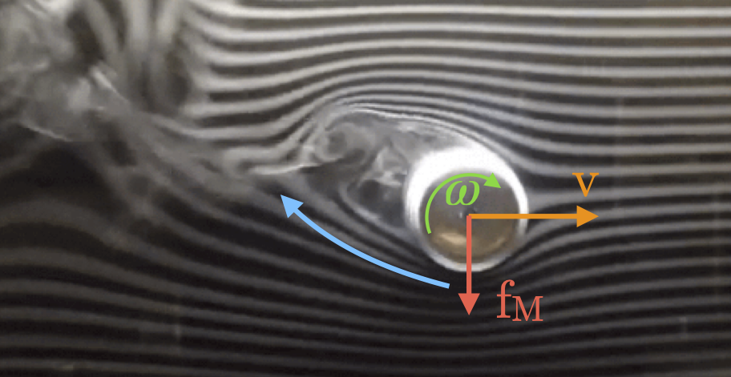
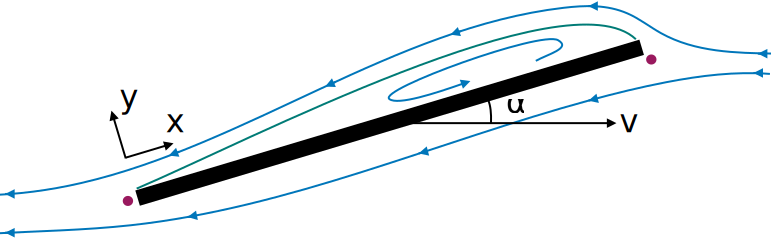
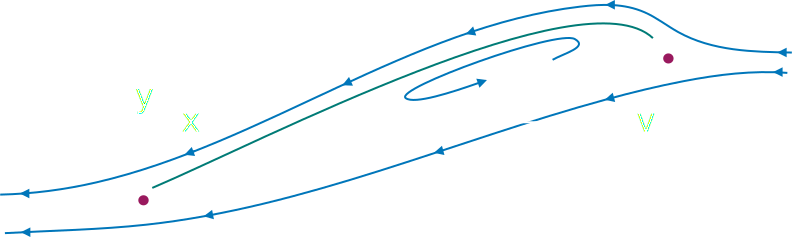

Fluid forces
============

Proper simulation of fluid dynamics is beyond the scope of MuJoCo, and would be too slow for the applications we aim to
facilitate. Nevertheless we provide two phenomenological models which are sufficient for simulating behaviors
such as flying and swimming. These models are *stateless*, in the sense that no additional states are assigned to the
surrounding fluid, yet are able to capture the salient features of rigid bodies moving through a fluid medium.

Both models are enabled by setting the :ref:`density<option-density>` and :ref:`viscosity<option-viscosity>` attributes
to positive values. These parameters correspond to the density :math:`\rho` and viscosity :math:`\beta` of the medium.

1. The :ref:`Inertia-based model<flInertia>`, uses only viscosity and density, inferring geometry from body
   equivalent-inertia boxes.
2. The :ref:`Ellipsoid-based model <flEllipsoid>` is more elaborate, using an ellipsoid approximation of geoms.
   In addition to the global viscosity and density of the medium, this model exposes 5 tunable parameters per
   interacting geom.

.. tip::
   As detailed in the :ref:`Numerical Integration<geIntegration>` section, implicit integration significantly improves
   simulation stability in the presence of velocity-dependent forces. Both of the fluid-force models described below
   exhibit this property, so the ``implicit`` or ``implicitfast`` :ref:`intergrators<option-integrator>` are
   recommended when using fluid forces. The required analytic derivatives for both models are fully implemented.

.. _flInertia:

Inertia model
-------------

In this model the shape of each body, for fluid dynamics purposes, is assumed to be the *equivalent inertia box*,
which can also be visualized. For a body with mass :math:`\mathcal{M}` and inertia matrix :math:`\mathcal{I}`, the
half-dimensions (i.e. half-width, half-depth and half-height) of the equivalent inertia box are

.. math::
   \begin{align*}
   r_x = \sqrt{\frac{3}{2 \mathcal{M}} \left(\mathcal{I}_{yy} + \mathcal{I}_{zz} - \mathcal{I}_{xx} \right)}  \\
   r_y = \sqrt{\frac{3}{2 \mathcal{M}} \left(\mathcal{I}_{zz} + \mathcal{I}_{xx} - \mathcal{I}_{yy} \right)}  \\
   r_z = \sqrt{\frac{3}{2 \mathcal{M}} \left(\mathcal{I}_{xx} + \mathcal{I}_{yy} - \mathcal{I}_{zz} \right)}
   \end{align*}

Let :math:`\mathbf{v}` and :math:`\boldsymbol{\omega}` denote the linear and angular body velocity of the body in
the body-local frame (aligned with the equivalent inertia box). The force :math:`\mathbf{f}_{\text{inertia}}` and
torque :math:`\mathbf{g}_{\text{inertia}}` exerted by the fluid onto the solid are the sum of the terms

.. math::
   \begin{align*}
   \mathbf{f}_{\text{inertia}} &= \mathbf{f}_D + \mathbf{f}_V  \\
   \mathbf{g}_{\text{inertia}} &= \mathbf{g}_D + \mathbf{g}_V
   \end{align*}

Here subscripts :math:`D` and :math:`V` denote quadratic Drag and Viscous resistance.

The quadratic drag terms depend on the density :math:`\rho` of the fluid, scale quadratically with the velocity
of the body, and are a valid approximation of the fluid forces at high Reynolds numbers.
The torque is obtained by integrating the force resulting from the rotation over the surface area.
The :math:`i`-th component of the force and torque can be written as

.. math::
   \begin{aligned}
   f_{D, i} = \quad &- 2  \rho r_j r_k |v_i| v_i \\
   g_{D, i} = \quad &- {1 \over 2} \rho r_i \left(r_j^4 + r_k^4 \right) |\omega_i| \omega_i \\
   \end{aligned}

The viscous resistance terms depend on the fluid viscosity :math:`\beta`, scale linearly with the body velocity, and
approximate the fluid forces at low Reynolds numbers. Note that viscosity can be used independent of density to make
the simulation more damped. We use the formulas for the equivalent sphere with radius
:math:`r_{eq} = (r_x + r_y + r_z) / 3`  at low Reynolds numbers. The resulting 3D force and torque in local
body coordinates are

.. math::
   \begin{aligned}
   f_{V, i} = \quad &- 6 \beta \pi r_{eq} v_i \\
   g_{V, i} = \quad &- 8 \beta \pi r_{eq}^3 \omega_i \\
   \end{aligned}

One can also affect these forces by specifing a non-zero :ref:`wind<option-wind>`, which is a 3D vector subtracted
from the body linear velocity in the fluid dynamics computation.

.. _flEllipsoid:

Ellipsoid model
---------------

.. cssclass:: caption-small

   The flight-capable Drosophila Melanogaster model in this figure is described in :cite:t:`Vaxenburg2024`.

In this section we describe and derive a stateless model of the forces exerted onto a moving rigid body by the
surrounding fluid, based on an ellipsoidal approximation of geom shape. This model provides finer-grained control of the
different types of fluid forces than the inertia-based model of the previous section. The motivating use-case for this
model is insect flight, see figure on the right.

Summary
~~~~~~~

The model is activated per-geom by setting the :ref:`fluidshape<body-geom-fluidshape>` attribute to ``ellipsoid``, which
also disables the inertia-based model for the parent body. The
5 numbers in the :ref:`fluidcoef<body-geom-fluidcoef>` attribute correspond to the following semantics

.. list-table::
   :width: 60%
   :align: left
   :widths: 1 5 2 1
   :header-rows: 1

   * - Index
     - Description
     - Symbol
     - Default
   * - 0
     - Blunt drag coefficient
     - :math:`C_{D, \text{blunt}}`
     - 0.5
   * - 1
     - Slender drag coefficient
     - :math:`C_{D, \text{slender}}`
     - 0.25
   * - 2
     - Angular drag coefficient
     - :math:`C_{D, \text{angular}}`
     - 1.5
   * - 3
     - Kutta lift coefficient
     - :math:`C_K`
     - 1.0
   * - 4
     - Magnus lift coefficient
     - :math:`C_M`
     - 1.0

Elements of the model are a generalization of :cite:t:`andersen2005b` to 3 dimensions.
The force :math:`\mathbf{f}_{\text{ellipsoid}}` and torque
:math:`\mathbf{g}_{\text{ellipsoid}}` exerted by the fluid onto the solid are
the sum of the terms

.. math::
   \begin{align*}
   \mathbf{f}_{\text{ellipsoid}} &= \mathbf{f}_A + \mathbf{f}_D + \mathbf{f}_M + \mathbf{f}_K + \mathbf{f}_V  \\
   \mathbf{g}_{\text{ellipsoid}} &= \mathbf{g}_A + \mathbf{g}_D + \mathbf{g}_V
   \end{align*}

Where subscripts :math:`A`, :math:`D`, :math:`M`, :math:`K` and  :math:`V` denote Added mass, viscous Drag, Magnus lift,
Kutta lift and Viscous resistance, respectively. The :math:`D`, :math:`M` and :math:`K` terms are scaled by the respective
:math:`C_D`, :math:`C_M` and :math:`C_K` coefficients above, the viscous resistance scales with the fluid viscosity
:math:`\beta`, while the added mass term cannot be scaled.

Notation
~~~~~~~~

We describe the motion of the object in an inviscid, incompressible quiescent fluid of density :math:`\rho`. The
arbitrarily-shaped object is described in the model as the equivalent ellipsoid of semi-axes
:math:`\mathbf{r} = \{r_x, r_y, r_z\}`.
The problem is described in a reference frame aligned with the sides of the ellipsoid and moving with it. The
body has velocity :math:`\mathbf{v} = \{v_x, v_y, v_z\}` and angular velocity
:math:`\boldsymbol{\omega} = \{\omega_x, \omega_y, \omega_z\}`. We will also use

.. math::
   \begin{align*}
       r_\text{max} &= \max(r_x, r_y, r_z) \\
       r_\text{min} &= \min(r_x, r_y, r_z) \\
       r_\text{mid} &= r_x + r_y + r_z - r_\text{max} - r_\text{min}
   \end{align*}

The Reynolds number is the ratio between inertial and viscous forces within a flow and is defined as :math:`Re=u~l/\beta`, where
:math:`\beta` is the kinematic viscosity of the fluid, :math:`u` is the characteristic speed of the flow (or, by change of frame, the
speed of the body), and :math:`l` is a characteristic size of the flow or the body.

We will use :math:`\Gamma` to denote circulation, which is the line integral of the velocity field around a closed curve
:math:`\Gamma = \oint \mathbf{v} \cdot \textrm{d} \mathbf{l}` and, due to Stokes' Theorem,
:math:`\Gamma = \int_S \nabla \times \mathbf{v} \cdot \textrm{d}\mathbf{s}`.
In fluid dynamics notation the symbol :math:`\boldsymbol{\omega}` is often used for the
vorticity, defined as :math:`\nabla \times \mathbf{v}`, rather than the angular velocity. For a rigid-body motion, the
vorticity is twice the angular velocity.

Finally, we use the subscripts :math:`i, j, k` to denote triplets of equations that apply symmetrically to
:math:`x, y, z`. For example :math:`a_i = b_j + b_k` is shorthand for the 3 equations

.. math::
   \begin{align*}
       a_x &= b_y + b_z \\
       a_y &= b_x + b_z \\
       a_z &= b_x + b_y
   \end{align*}

.. _flProjection:

Ellipsoid projection
~~~~~~~~~~~~~~~~~~~~

We present the following result.

.. admonition:: Lemma
   :class: note

   Given an ellipsoid with semi-axes :math:`(r_x, r_y, r_z)` aligned with the coordinate axes :math:`(x, y, z)`, and a
   unit vector :math:`\mathbf{u} = (u_x, u_y, u_z)`, the area projected by the ellipsoid onto the plane normal to
   :math:`\mathbf{u}` is

   .. math::
      A^{\mathrm{proj}}_{\mathbf{u}} = \pi \sqrt{\frac{r_y^4 r_z^4 u_x^2 + r_z^4 r_x^4 u_y^2 + r_x^4 r_y^4 u_z^2}{r_y^2 r_z^2 u_x^2 + r_z^2 r_x^2 u_y^2 + r_x^2 r_y^2 u_z^2}}

.. collapse:: Expand for derivation

   .. admonition:: Derivation of lemma
      :class: tip

      **Area of an ellipse**
         Any ellipse centered at the origin can be described in terms of a quadratic form a
         :math:`\mathbf{x}^T Q \mathbf{x} = 1`, where :math:`Q` is a real, symmetric, positive-definite 2x2 matrix that
         defines the orientation and  semi-axis lengths of the ellipse, and :math:`\mathbf{x} = (x, y)` are points on the
         ellipse. The area of the ellipse is given by

         .. math::
            A = \frac{\pi}{\sqrt{\det Q}} .

      **Ellipsoid cross-section**
         We begin by computing the area of the ellipse formed by intersecting an ellipsoid centered at the origin with the
         plane :math:`\Pi_{\mathbf{n}}` through the origin with unit normal :math:`\mathbf{n} = (n_x, n_y, n_z)`. Let
         :math:`(r_x, r_y, r_z)` be the semi-axis lengths of the ellipsoid. Without loss of generality, it is sufficient to
         assume that the axes of the ellipsoid are aligned with the coordinate axes. The ellipsoid can then be described as
         :math:`\mathbf{x}^T Q \mathbf{x} = 1`, where
         :math:`Q = \textrm{diag}\mathopen{}\left( \left. 1 \middle/ r_x^2 \right., \left. 1 \middle/ r_y^2 \right., \left. 1 \middle/ r_z^2 \right. \right)\mathclose{}`
         and :math:`\mathbf{x} = (x, y, z)` are the points on the ellipsoid.

         We proceed by rotating the plane :math:`\Pi_{\mathbf{n}}` together with the ellipsoid so that the normal of the
         rotated plane points along the :math:`z` axis. This would then allow us to get the desired intersection by setting
         the :math:`z` coordinate to zero. Writing :math:`\mathbf{\hat{z}}` for the unit vector along the :math:`z` axis, we
         have

         .. math::
            \begin{align*}
            \mathbf{n} \times \mathbf{\hat{z}} &= \sin\theta \, \mathbf{m}, \\
            \mathbf{n} \cdot \mathbf{\hat{z}} &= \cos\theta ,
            \end{align*}

         where :math:`\mathbf{m}` is the unit vector that defines the rotation axis and :math:`\theta` is the rotation
         angle. We can rearrange these to get quantities that we need to form a rotation quaternion, namely

         .. math::
            \begin{align*}
            \cos\frac{\theta}{2}
            &= \sqrt{\frac{1+\cos\theta}{2}}
            &= \sqrt{\frac{1 + \mathbf{n} \cdot \mathbf{\hat{z}}}{2}}, \\
            \sin\frac{\theta}{2}\,\mathbf{m}
            &= \frac{\mathbf{n} \times \mathbf{\hat{z}}}{2\cos\frac{\theta}{2}}
            &= \frac{\mathbf{n} \times \mathbf{\hat{z}}}{\sqrt{2 (1 + \mathbf{n} \cdot \mathbf{\hat{z}})}} .
            \end{align*}

         The rotation quaternion :math:`q = q_r + q_x \mathbf{i} + q_y \mathbf{j} + q_z \mathbf{k}` is therefore given by

         .. math::
            q_r = \sqrt{\frac{1 + n_z}{2}}, \quad
            q_x = \frac{n_y}{\sqrt{2 \left(1+n_z\right)}},  \quad
            q_y = \frac{-n_x}{\sqrt{2 \left(1+n_z\right)}}, \quad
            q_z = 0 .

         From this, the rotation matrix is given by

         .. math::
            \def\arraystretch{1.33}
            \begin{align*}
            R &= \begin{pmatrix}
            1 - 2 q_y^2 - 2 q_z^2 & 2 \left(q_x q_y - q_r q_z\right) & 2 \left(q_x q_z + q_r q_y\right) \\
            2 \left(q_x q_y + q_r q_z\right) & 1 - 2 q_x^2 - 2 q_z^2 & 2 \left(q_y q_z - q_r q_x\right) \\
            2 \left(q_x q_z - q_r q_y\right) & 2 \left(q_y q_z + q_r q_x\right) & 1 - 2 q_x^2 - 2 q_y^2
            \end{pmatrix} \\
            &= \begin{pmatrix}
            1 - \left. n_x^2 \middle/ \left( 1+n_z \right) \right. & \left. -n_x n_y \middle/ \left( 1+n_z \right) \right. & -n_x \\
            \left. -n_x n_y \middle/ \left( 1+n_z \right) \right. & 1 - \left. n_y^2 \middle/ \left( 1+n_z \right) \right. & -n_y \\
            n_x & n_y & 1 - \left. \left( n_x^2 + n_y^2 \right) \middle/ \left( \vphantom{n_x^2} 1+n_z \right) \right.
            \end{pmatrix},
            \end{align*}

         and the rotated ellipsoid is described via the transformed quadratic form

         .. math::
            \mathbf{x}^T Q' \mathbf{x} = \mathbf{x}^T \left( R^T Q R \right) \mathbf{x} = 1 .

         From the formula for ellipse area above, for the area of the ellipse at :math:`z=0`, we need

         .. math::
            \begin{align*}
            Q'_{xx} &= \frac{1}{r_x^2} R_{xx}^2 + \frac{1}{r_y^2} R_{yx}^2 + \frac{1}{r_z^2} R_{zx}^2 , \\
            Q'_{yy} &= \frac{1}{r_x^2} R_{xy}^2 + \frac{1}{r_y^2} R_{yy}^2 + \frac{1}{r_z^2} R_{zy}^2 , \\
            Q'_{xy} &= \frac{1}{r_x^2} R_{xx} R_{xy} + \frac{1}{r_y^2} R_{yx} R_{yy} + \frac{1}{r_z^2} R_{zx} R_{zy} ,
            \end{align*}

         and the desired area is given by

         .. math::
            A^{\cap}_{\mathbf{n}}
            = \frac{\pi}{\sqrt{\vphantom{Q'^2_{xy}} \det Q'}}
            = \frac{\pi}{\sqrt{Q'_{xx} Q'_{yy} - Q'^2_{xy}}}
            = \frac{\pi r_x r_y r_z}{\sqrt{r_x^2 n_x^2 + r_y^2 n_y^2 + r_z^2 n_z^2}},

         where the superscript :math:`\cap` denotes that the area pertains to the ellipse at the *intersection*
         with :math:`\Pi_{\mathbf{n}}`.

      **Projected ellipse**
         Let :math:`\mathbf{u} = (u_x, u_y, u_z)` be some unit vector (in our context, it is the direction of the velocity
         of the fluid impinging on an ellipsoid) and let :math:`\Pi_{\mathbf{u}}` be the plane normal to :math:`\mathbf{u}`.
         In general, the ellipse formed by projecting an ellipsoid :math:`\mathcal{E}` onto :math:`\Pi_{\mathbf{u}}`
         (denoted :math:`\mathcal{E}^{\mathrm{proj}}_{\mathbf{u}}`) is different from the one formed by intersecting
         :math:`\mathcal{E}` with :math:`\Pi_{\mathbf{u}}` (denoted :math:`\mathcal{E}^{\cap}_{\mathbf{u}}`).

         An important property of :math:`\mathcal{E}^{\mathrm{proj}}_{\mathbf{u}}` is that :math:`\mathbf{u}` is tangent
         to the ellipsoid :math:`\mathcal{E}` at every point on :math:`\mathcal{E}^{\mathrm{proj}}_{\mathbf{u}}`.

         We can regard :math:`\mathcal{E}` as the image of the unit sphere :math:`\mathcal{S}` under a stretching
         transformation :math:`T = \mathrm{diag}(r_x, r_y, r_z)`. Furthermore, if :math:`\mathbf{\tilde{u}}` is a vector
         tangent to :math:`\mathcal{S}`, then its image
         :math:`\mathbf{u}=T\mathbf{\tilde{u}}=(r_x \tilde{u}_x, r_y \tilde{u}_y, r_z \tilde{u}_z)` is tangent to the
         ellipsoid. The ellipse :math:`\mathcal{E}^{\mathrm{proj}}_{\mathbf{u}}` is therefore the image
         under :math:`T` of the circle :math:`\mathcal{C}^{\cap}_{\mathbf{\tilde{u}}}` at the intersection between
         :math:`\mathcal{S}` and :math:`\Pi_{\mathbf{\tilde{u}}}` (for spheres :math:`\mathcal{C}^{\cap}` and
         :math:`\mathcal{C}^{\mathrm{proj}}` do coincide).

         Let :math:`\mathbf{\tilde{v}}` and :math:`\mathbf{\tilde{w}}` be some orthogonal pair of vectors in the plane
         :math:`\Pi_{\mathbf{\tilde{u}}}`, then :math:`\mathbf{\tilde{u}} = \mathbf{\tilde{v}} \times \mathbf{\tilde{w}}`.
         Their images under :math:`T` are :math:`\mathbf{v} = (r_x \tilde{v}_x, r_y \tilde{v}_y, r_z \tilde {v}_z)` and
         :math:`\mathbf{w} = (r_x \tilde{w}_x, r_y \tilde{w}_y, r_z \tilde {w}_z)` respectively, and they remain orthogonal
         vectors in the plane of :math:`\mathcal{E}^{\mathrm{proj}}_{\mathbf{u}}`. A (non-unit) normal to the ellipse
         :math:`\mathcal{E}^{\mathrm{proj}}_{\mathbf{u}}` is therefore given by

         .. math::
            \mathbf{N} = \mathbf{v} \times \mathbf{w}
            = (r_y r_z \tilde{u}_x, r_z r_x \tilde{u}_y, r_x r_y \tilde{u}_z)
            = \left( \frac{r_y r_z}{r_x} u_x, \frac{r_z r_x}{r_y} u_y, \frac{r_x r_y}{r_z} u_z \right).

         This shows that :math:`\mathcal{E}^{\mathrm{proj}}_{\mathbf{u}} = \mathcal{E}^{\cap}_{\mathbf{n}}`, where
         :math:`\mathbf{n} = \mathbf{N} / \left\Vert\mathbf{N}\right\Vert`. Its area is given by the formula derived in the
         previous section, leading to the result stated above.

Added mass
~~~~~~~~~~

For a body moving in a fluid, added mass or virtual mass measures the inertia of the fluid that is moved due to the
body's motion. It can be derived from potential flow theory (i.e. it is present also for inviscid flows).

Following Chapter 5 of :cite:t:`lamb1932`, the forces :math:`\mathbf{f}_{V}` and torques :math:`\mathbf{g}_{V}` exerted
onto a moving body due to generation of motion in the fluid from rest can be written as:

.. math::
   \begin{align*}
       \mathbf{f}_{A} &= - \frac{\textrm{d}}{\textrm{d} t} \nabla_{\mathbf{v}} \mathcal{T} + \nabla_{\mathbf{v}} \mathcal{T} \times \boldsymbol{\omega} \\
       \mathbf{g}_{A} &= - \frac{\textrm{d}}{\textrm{d} t} \nabla_{\boldsymbol{\omega}} \mathcal{T} + \nabla_{\mathbf{v}} \mathcal{T} \times \mathbf{v} + \boldsymbol{\omega} \times \nabla_{\boldsymbol{\omega}} \mathcal{T}
   \end{align*}

where :math:`\mathcal{T}` is the kinetic energy of the fluid alone. These forces are often described as added or
virtual mass because they are due to the inertia of the fluid that is to moved or deflected by the accelerating body. In
fact, for a body with constant linear velocity these forces reduce to zero. We consider the body as having three planes
of symmetry because under this assumption the kinetic energy greatly simplifies and can be written as:

.. math::
   2 \mathcal{T} = m_{A, x} v_x^2 + m_{A, y} v_y^2 + m_{A, z} v_z^2 +
                 I_{A, x} \omega_x^2 + I_ {A, y} \omega_y^2 + I_{A, y} \omega_z^2

For convenience we introduce the added-mass vector :math:`\mathbf{m}_A = \{m_{A, x}, m_{A, y}, m_{A, z}\}` and added-moment of
inertia vector :math:`\mathbf{I}_A = \{I_{A, x}, I_{A, y}, I_{A, z}\}`. Each of these quantities should estimate the inertia
of the moved fluid due the motion of the body in the corresponding direction and can be derived from potential flow
theory for some simple geometries.

For a body with three planes of symmetry, we can write in compact form the forces and torques due to added inertia:

.. math::
   \begin{align*}
       \mathbf{f}_{A} &= - \mathbf{m}_A \circ \dot{\mathbf{v}} + \left(\mathbf{m}_A \circ \mathbf{v} \right) \times \boldsymbol{\omega} \\
       \mathbf{g}_{A} &= - \mathbf{I}_A \circ \dot{\boldsymbol{\omega}} + \left(\mathbf{m}_A \circ \mathbf{v} \right) \times \mathbf{v} + \left(\mathbf{I}_A \circ \boldsymbol{\omega} \right) \times \boldsymbol{\omega}
   \end{align*}

Here :math:`\circ` denotes an element-wise product, :math:`\dot{\mathbf{v}}` is the linear acceleration and
:math:`\dot{\boldsymbol{\omega}}` is the angular acceleration. :math:`\mathbf{m}_A \circ \mathbf{v}` and
:math:`\mathbf{I}_A \circ \boldsymbol{\omega}` are the virtual linear and angular momentum respectively.

For an ellipsoid of semi-axis :math:`\mathbf{r} = \{r_x, r_y, r_z\}` and volume :math:`V = 4 \pi r_x r_y r_z / 3`, the
virtual inertia coefficients were derived by :cite:t:`tuckerman1925`. Let:

.. math::
   \kappa_i = \int_0^\infty \frac{r_i r_j r_k}{\sqrt{(r_i^2 + \lambda)^3 (r_j^2 + \lambda) (r_k^2 + \lambda)}} \textrm{d} \lambda

It should be noted that these coefficients are non-dimensional (i.e. if all semi-axes are multiplied by the same scalar
the coefficients remain the same). The virtual masses of the ellipsoid are:

.. math::
   m_{A, i} = \rho V \frac{\kappa_i}{2 - \kappa_i}

And the virtual moments of inertia are:

.. math::
   I_{A, i} = \frac{\rho V}{5} \frac{(r_j^2 - r_k^2)^2 (\kappa_k-\kappa_j)}{2(r_j^2 - r_k^2) + (r_j^2 + r_k^2) (\kappa_j-\kappa_k)}

Viscous drag
~~~~~~~~~~~~

The drag force acts to oppose the motion of the body relative to the surrounding flow. We found that viscous forces
serve also to reduce the stiffness of the equations of motion extended with the fluid dynamic terms. For this reason, we
opted to err on the conservative side and chose approximations of the viscous terms that may overestimate dissipation.

Despite being ultimately caused by viscous dissipation, for high Reynolds numbers the drag is independent of the
viscosity and scales with the second power of the velocity. It can be written as:

.. math::
   \begin{align*}
   \mathbf{f}_\text{D} = - C_D~\rho~ A_D ~ \|\mathbf{v}\|~ \mathbf{v}\\
   \mathbf{g}_\text{D} = - C_D \rho~ I_D ~ \|\boldsymbol{\omega}\| ~ \boldsymbol{\omega}
   \end{align*}

Where :math:`C_D` is a drag coefficient, and :math:`A_D` is a reference surface area (e.g. a measure of the projected
area on the plane normal to the flow), and :math:`I_D` a reference moment of inertia.

.. youtube:: nljr0X79vI0
   :align: right
   :width: 50%

Even for simple shapes, the terms :math:`C_D`, :math:`A_D` and :math:`I_D` need to be tuned to the problem-specific
physics and dynamical scales :cite:p:`duan2015`. For example, the drag coefficient :math:`C_D` generally decreases with
increasing Reynolds numbers, and a single reference area :math:`A_D` may not be sufficient to account for the skin
drag for highly irregular or slender bodies. For example, experimental fits are derived from problems ranging from
falling playing cards :cite:p:`wang2004,andersen2005a,andersen2005b` to particle transport :cite:p:`loth2008,
bagheri2016`. See screen capture of the
`cards.xml <https://github.com/deepmind/mujoco/blob/main/model/cards/cards.xml>`__ model on the right.

We derive a formula for :math:`\mathbf{f}_\text{D}` based on two surfaces :math:`A^\text{proj}_\mathbf{v}` and
:math:`A_\text{max}`. The first, :math:`A^\text{proj}_\mathbf{v}`, is the cylindrical projection of the body onto a
plane normal to the velocity :math:`\mathbf{v}`. The second is the maximum projected surface
:math:`A_\text{max} = 4 \pi r_{max} r_{min}`.

.. math::
   \mathbf{f}_\text{D} = - \rho~ \big[  C_{D, \text{blunt}} ~ A^\text{proj}_\mathbf{v} ~ +
   C_{D, \text{slender}}\left(A_\text{max} - A^\text{proj}_\mathbf{v} \right) \big] ~ \|\mathbf{v}\|~ \mathbf{v}

The formula and derivation for :math:`A^\text{proj}_\mathbf{v}` is given in the :ref:`lemma<flProjection>` above.

We propose an analogous model for the angular drag. For each Cartesian axis we consider the moment of inertia of the
maximum swept ellipsoid obtained by the rotation of the body around the axis. The resulting diagonal entries of the
moment of inertia are:

.. math::
   \mathbf{I}_{D,ii} = \frac{8\pi}{15} ~r_i ~\max(r_j, ~r_k)^4 .

Given this reference moment of inertia, the angular drag torque is computed as:

.. math::
   \mathbf{g}_\text{D} = - \rho ~ \boldsymbol{\omega} ~ \Big( \big[ C_{D, \text{angular}} ~ \mathbf{I}_D ~ +
   C_{D, \text{slender}} \left(\mathbf{I}_\text{max} - \mathbf{I}_D \right) \big] \cdot \boldsymbol{\omega} \Big)

Here :math:`\mathbf{I}_\text{max}` is a vector with each entry equal to the maximal component of :math:`\mathbf{I}_D`.

Finally the viscous resistance terms, also known as linear drag, well approvimate the fluid forces for Reynolds
numbers around or below :math:`O(10)`. These are computed for the equivalent sphere with Stokes' law
:cite:p:`stokes1850,lamb1932`:

.. math::
   \begin{align*}
   \mathbf{f}_\text{V} &= - 6 \pi r_D \beta \mathbf{v}\\
   \mathbf{g}_\text{V} &= - 8 \pi r_D^3 \beta \boldsymbol{\omega}
   \end{align*}

Here, :math:`r_D = (r_x + r_y + r_z)/3` is the radius of the equivalent sphere and :math:`\beta` is the kinematic
viscosity of the medium (e.g. :math:`1.48~\times 10^{-5}~m^2/s` for ambient-temperature air and
:math:`0.89 \times 10^{-4}~m^2/s` for water). To make a quantitative example, Stokes' law become accurate for
room-temperature air if :math:`u\cdot l \lesssim 2 \times 10^{-4}~m^2/s`, where :math:`u` is the speed and
:math:`l` a characteristic length of the body.

Viscous lift
~~~~~~~~~~~~

The Kutta-Joukowski theorem calculates the lift :math:`L` of a two-dimensional body translating in a uniform flow with
speed `u` as :math:`L = \rho u \Gamma`. Here, :math:`\Gamma` is the circulation around the body. In the next
subsections we define two sources of circulation and the resulting lift forces.

Magnus force
^^^^^^^^^^^^

.. cssclass:: caption-small

   Smoke flow visualization of the flow past a rotating cylinder (WikiMedia Commons, CC BY-SA 4.0). Due to viscosity,
   the rotating cylinder deflects the incoming flow upward and receives a downwards force (red arrow).

The Magnus effect describes the motion of a rotating object moving through a fluid. Through viscous effects, a spinning
object induces rotation in the surrounding fluid. This rotation deflects the trajectory of the fluid past the object
(i.e. it causes linear acceleration), and the object receives an equal an opposite reaction. For a cylinder, the Magnus
force per unit length of the cylinder can be computed as :math:`F_\text{M} / L = \rho v \Gamma`, where :math:`\Gamma`
is the circulation of the flow caused by the rotation and :math:`v` the velocity of the object. We estimate this force
for an arbitrary body as:

.. math::
   \mathbf{f}_{\text{M}} = C_M ~\rho~ V~ \boldsymbol{\omega}\times\mathbf{v} ,

where :math:`V` is the volume of the body and :math:`C_M` is a coefficient for the force, typically set to 1.

It's worth making an example. To reduce the number of variables, suppose a body rotating in only one direction, e.g.
:math:`\boldsymbol{\omega} = \{0, 0, \omega_z\}`, translating along the other two, e.g. :math:`\mathbf{v} = \{v_x, v_y, 0\}`. The
sum of the force due to added mass and the force due to the Magnus effect along, for example, :math:`x` is:

.. math::
   \frac{f}{\pi \rho r_z} = v_y \omega_z \left(2 r_x \min\{r_x, r_z\} - (r_x + r_z)^2\right)

Note that the two terms have opposite signs.

Kutta condition
^^^^^^^^^^^^^^^

A stagnation point is a location in the flow field where the velocity is zero. For a body moving in a flow (in 2D, in
the frame moving with the body) there are two stagnation points: in the front, where the stream-lines separate to either
sides of the body, and in the rear, where they reconnect. A moving body with a sharp trailing (rear) edge will generate
in the surrounding flow a circulation of sufficient strength to hold the rear stagnation point at the trailing edge.
This is the Kutta condition, a fluid dynamic phenomenon that can be observed for solid bodies with sharp corners, such
as slender bodies or the trailing edges of airfoils.

.. cssclass:: caption-small

   Sketch of the Kutta condition. Blue lines are streamlines and the two magenta points are the stagnation points. The
   dividing streamline, which connects the two stagnation points, is marked in green. The dividing streamline and the
   body inscribe an area where the flow is said to be "separated" and recirculates within. This circulation produces an
   upward force acting on the plate.

For a two-dimensional flow sketched in the figure above, the circulation due to the Kutta condition can be estimated as:
:math:`\Gamma_\text{K} = C_K ~ r_x ~ \| \mathbf{v}\| ~ \sin(2\alpha)`,
where :math:`C_K` is a lift coefficient, and :math:`\alpha` is the angle between the velocity vector and its projection
onto the surface. The lift force per unit length can be computed with the Kutta–Joukowski theorem as
:math:`\mathbf{f}_K / L = \rho \Gamma_\text{K} \times \mathbf{v}`.

In order to extend the lift force equation to three-dimensional motions, we consider the normal
:math:`\mathbf{n}_{s, \mathbf{v}} = \{\frac{r_y r_z}{r_x}v_x, \frac{r_z r_x}{r_y}v_y, \frac{r_x r_x}{r_z}v_z\}`
to the cross-section of the body which generates the body's projection :math:`A^\text{proj}_\mathbf{v}` onto a plane
normal to the velocity given in the :ref:`lemma<flProjection>` above and the corresponding unit vector
:math:`\hat{\mathbf{n}}_{s, \mathbf{v}}`.
We use this direction to decompose :math:`\mathbf{v} = \mathbf{v}_\parallel ~+~ \mathbf{v}_\perp` with
:math:`\mathbf{v}_\perp = \left(\mathbf{v} \cdot \hat{\mathbf{n}}_{s, \mathbf{v}}\right) \hat{\mathbf{n}}_{s, \mathbf{v}}`.
We write the lift force as:

.. math::
   \begin{align*}
       \mathbf{f}_\text{K} &= \frac{C_K~\rho~ A^\text{proj}_\mathbf{v}}{\|\mathbf{v}\|}
                                 \left( \mathbf{v} \times \mathbf{v}_\parallel\right)\times \mathbf{v} \\
       &= C_K~\rho~ A^\text{proj}_\mathbf{v} \left(\hat{\mathbf{v}} \cdot \hat{\mathbf{n}}_{s, \mathbf{v}}\right)
                                 \left( \hat{\mathbf{n}}_{s, \mathbf{v}} \times \mathbf{v} \right)\times \mathbf{v}
   \end{align*}

Here, :math:`\hat{\mathbf{v}}` is the unit-normal along :math:`\mathbf{v}`. Note that the direction of :math:`\hat{\mathbf{n}}_{s,
\mathbf{v}}` differs from :math:`\hat{\mathbf{v}}` only on the planes where the semi-axes of the body are unequal. So for
example, for spherical bodies :math:`\hat{\mathbf{n}}_{s, \mathbf{v}} \equiv \hat{\mathbf{v}}` and by construction
:math:`\mathbf{f}_\text{K} = 0`.

Let's unpack the relation with an example. Suppose a body with :math:`r_x = r_y` and :math:`r_z \ll r_x`. Note that the vector
:math:`\hat{\mathbf{n}}_{s, \mathbf{v}} \times \hat{\mathbf{v}}` gives the direction of the circulation induced by the
deflection of the flow by the solid body. Along :math:`z`, the circulation will be proportional to :math:`\frac{r_y r_z}{r_x}v_x v_y
- \frac{r_z r_x}{r_y}v_x v_y = 0` (due to :math:`r_x = r_y`). Therefore, on the plane where the solid is blunt, the motion
produces no circulation.

Now, for simplicity, let :math:`v_x = 0`. In this case also the circulation along :math:`y`, proportional
to :math:`\frac{r_y r_z}{r_x}v_x v_z - \frac{r_y r_x}{r_y}v_x v_z`, is zero. The only non-zero component of the circulation
will be along :math:`x` and be proportional to :math:`\left(\frac{r_x r_z}{r_y} - \frac{r_x r_y}{r_z}\right) v_y v_z \approx
\frac{r_x^2}{r_z} v_y v_z`.

We would have :math:`\mathbf{v}_\parallel = \{v_x, 0, v_z\}` and
:math:`\Gamma \propto \{r_z v_y v_z, ~ 0,~ - r_x v_x v_y \} / \|\mathbf{v}\|`.
The motion produces no circulation on the plane where the solid is blunt, and on the other two planes
the circulation is
:math:`\Gamma \propto r_\Gamma ~ \|\mathbf{v}\|~ \sin(2 \alpha) ~ = ~2 r_\Gamma ~\|\mathbf{v}\| ~\sin(\alpha)~\cos(\alpha)`
with :math:`\alpha` the angle between the velocity and its projection on the body on the plane (e.g. on the plane
orthogonal to :math:`x` we have :math:`\sin(\alpha) = v_y/\|\mathbf{v}\|` and
:math:`\cos(\alpha) = v_z/\|\mathbf{v}\|`), and :math:`r_\Gamma`, the lift surface on the plane (e.g. :math:`r_z` for
the plane orthogonal to :math:`x`). Furthermore, the direction of the circulation is given by the cross product (because
the solid boundary "rotates" the incoming flow velocity towards its projection on the body).

Acknowledgements
~~~~~~~~~~~~~~~~

The design and implementation of the model in this section are the work of Guido Novati.

References
~~~~~~~~~~

.. bibliography::
