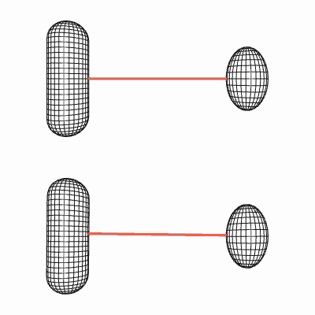
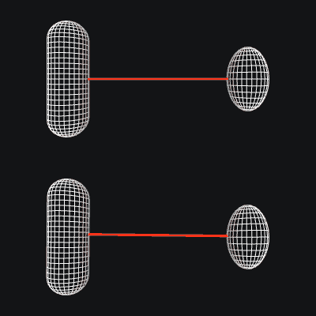

Computation
===========

.. toctree::
    :hidden:

    fluid

Introduction
------------

This chapter describes the mathematical and algorithmic foundations of MuJoCo. The overall framework is fairly standard
for readers familiar with modeling and simulation in generalized or joint coordinates. Therefore we summarize that
material briefly. Most of the chapter is devoted to how we handle contacts and other constraints. This approach is based
on our recent research and is unique to MuJoCo, so we take the time to motivate it and explain it in detail. Additional
information can be found in the paper below, although some of the technical ideas in this chapter are new and have not
been described elsewhere.

   `Analytically-invertible dynamics with contacts and constraints: Theory and implementation in MuJoCo
   <https://scholar.google.com/scholar?cluster=9217655838195954277>`__ E. Todorov (2014).

.. _Motivation:

Soft contact model
------------------

Robots as well as humans interact with their environment primarily through physical contact. Given the increasing
importance of physics modeling in robotics, machine learning, animation, virtual reality, biomechanics and other fields,
there is need for simulation models of contact dynamics that are both physically accurate and computationally efficient.
One application of simulation models is to assess candidate estimation and control strategies before deploying them on
physical systems. Another application is to automate the design of those strategies -- usually through numerical
optimization that uses simulation in an inner loop. The latter application imposes an additional constraint: the
objective function defined with respect to the contact dynamics should be amenable to numerical optimization. The
contact model underlying MuJoCo has benefits along these and other relevant dimensions. In the following sections we
discuss its benefits, while clarifying the differences from the linear complementarity (LCP) family of contact models
which are the *de facto* standard.

.. _moRealism:

Physical realism and soft contacts
~~~~~~~~~~~~~~~~~~~~~~~~~~~~~~~~~~

Many of the advantages of our contact model can be traced to the fact that we drop the strict complementarity constraint
at the heart of the LCP formulation. We will call this family of models convex; see :ref:`References` for related work.
For frictionless contacts dropping the explicit complementarity constraint makes no difference, because the
Karush-Kuhn-Tucker (KKT) optimality conditions for the resulting convex quadratic program are equivalent to an LCP. But
for frictional contacts there are differences.

If one sees convex models as approximations to LCP, the logical question to ask is how good that approximation is.
However we do not see it that way. Instead, we see both LCP models and convex models as different approximations to
physical reality, each with its strengths and weaknesses. The immediate consequence of dropping strict complementarity
and replacing it with a cost is that complementarity can be violated -- meaning that force and velocity in the contact
normal direction can be simultaneously positive, and frictional forces may not be maximally dissipative. A related
phenomenon is that the only way to initiate slip is to generate some motion in the normal direction. These effects are
numerically small yet undesirable. This shortcoming however has little practical relevance, because it is premised on
the assumption of hard contact. Yet all physical materials allow some deformation. This is particularly important in
robotics, where the parts of the robot that come in contact with the environment are usually designed to be soft. For
soft contacts complementarity has to be violated: when there is penetration and the material is pushing the contacting
bodies apart, both the normal force and velocity are positive. Furthermore if an object is resting on a soft surface
with some penetration, and we push it sideways, we would expect it to move up a bit as it starts sliding. So the
deviations from LCP actually increase physical realism in the presence of soft contacts.

Of course not every soft model is desirable; for example spring-damper models are soft but are plagued by instabilities.
At the same time different materials have different profiles, and so unlike hard contact models, a soft model must have
sufficiently rich parameterization if it is to be adapted to multiple systems of interest. This in turn facilitates
system identification of contact model parameters.

.. _moEfficiency:

Computational efficiency
~~~~~~~~~~~~~~~~~~~~~~~~

LCP models with frictional contact correspond to NP-hard optimization problems. This has given rise to an industry of
approximate solvers, with the unfortunate side-effect that many popular physics engines use poorly-documented shortcuts
and the resulting equations of motion are difficult to characterize. To be fair, NP-hardness is a statement about
worst-case performance and does not mean that solving the LCP quickly is impossible in practice. Still, convex
optimization has well-established advantages. In MuJoCo we have observed that for typical robotic models, 10 sweeps of a
projected Gauss-Seidel method (PGS) yield solutions which for practical purposes are indistinguishable from the global
minimum. Of course there are problems that are much harder to solve numerically, even though they are convex, and for
such problems we have conjugate gradient solvers with higher-order convergence.

The requirements for computational efficiency are different depending on the use case. If all we need is real-time
simulation, modern computers are fast enough to handle most robotic systems of interest even with inefficient solvers.
In the context of optimization however, there is no such thing as fast-enough simulation. If the objective functions and
their derivatives can be computed faster, this translates into larger search horizons or training sets or sample sizes,
which in turn leads to increased performance. This is why we have invested a lot of effort in developing efficient
solvers.

.. _moContinuous:

Continuous time
~~~~~~~~~~~~~~~

One might have thought that the equations of motion for any physical system would be uniquely defined in continuous
time. However frictional contacts are problematic because the Coulomb friction model is not well-defined in continuous
time (Painleve's paradox). This has made discrete-time approximations and associated velocity-stepping schemes very
popular. The continuous-time limit of these models is rarely investigated. For a single contact and under not
necessarily realistic assumptions on the applied forces, the limit satisfies the differential-inclusion form of the
Coulomb friction model, while for multiple simultaneous contacts there can be multiple solutions depending on how
exactly the continuous-time limit is taken. These difficulties can be traced to the assumption of hard contact.

Convex models of frictional contact have also relied on discrete-time approximations in the past, but this is not
necessary. The present model is defined in continuous-time, in terms of forces and accelerations. This is more natural
given that time in the real world is continuous. It is also the preferred formulation in the controls literature, and
indeed we are hoping that MuJoCo will attract users from that community. Another advantage of continuous-time
formulations is that they are amenable to sophisticated numerical integration, without having to pay the computational
overhead of discrete-time variational integrators (which are necessarily implicit when the inertia is
configuration-dependent). Continuous-time dynamics are also well-defined backward in time, which is needed in some
optimization algorithms.

.. _moInverse:

Inverse dynamics and optimization
~~~~~~~~~~~~~~~~~~~~~~~~~~~~~~~~~

The objective of inverse dynamics is to recover the applied force and contact force given the position, velocity and
acceleration of the multi-joint system. With hard contacts this computation is impossible. Consider pushing against a
wall without moving. The contact force cannot be recovered from the kinematics, unless of course we consider the
material deformations -- in which case we need a soft contact model. Inverse dynamics are trivial to compute with
spring-damper models of contact, because in that case the contact force is only a function of position and velocity and
does not depend on applied force. But this is also the reason why spring-damper models are undesirable: ignoring the
applied force means that an error is introduced at each time step, and so the simulator is perpetually in
error-correction mode, in turn causing instabilities. In contrast, modern contact solvers take the applied force (as
well as all internal forces) into account when computing the contact force/impulse. But this complicates inversion. The
present contact model has a uniquely-defined inverse. The inverse dynamics are in fact easier to compute than the
forward dynamics, because the optimization problem becomes diagonal and decomposes into independent optimization
problems over individual contacts -- which can be solved analytically.

Inverse dynamics play a key role in optimization algorithms arising in system identification, estimation and control.
They make it possible to treat the sequence of positions (or a parametric representation thereof) as the object being
optimized. Velocities and acceleration are then computed by differentiating the positions; inverse dynamics are used to
compute the applied and contact forces; and finally an objective function is constructed which can depend on all of the
above. This is interchangeably called space-time optimization, spectral method, direct collocation. MuJoCo is uniquely
suited to facilitate such computations in the presence of contacts and other constraints.

.. _Framework:

General framework
-----------------

Our notation is summarized in the table below. Additional notation specific to constraints will be introduced later.
When available, we also show the fields of main data structures :ref:`mjModel` and :ref:`mjData` corresponding to the
mathematical notation.

.. list-table::
   :widths: 2 2 7 4
   :header-rows: 1

   * - Symbol
     - Size
     - Description
     - MuJoCo field
   * - :math:`n_Q`
     -
     - number of position coordinates
     - ``mjModel.nq``
   * - :math:`n_V`
     -
     - number of degrees of freedom
     - ``mjModel.nv``
   * - :math:`n_C`
     -
     - number of active constraints
     - ``mjData.nefc``
   * - :math:`q`
     - :math:`n_Q`
     - joint position
     - ``mjData.qpos``
   * - :math:`v`
     - :math:`n_V`
     - joint velocity
     - ``mjData.qvel``
   * - :math:`\tau`
     - :math:`n_V`
     - applied force: passive, actuation, external
     - ``mjData.qfrc_passive`` + ``mjData.qfrc_actuator`` + ``mjData.qfrc_applied``
   * - :math:`c(q, v)`
     - :math:`n_V`
     - bias force: Coriolis, centrifugal, gravitational
     - ``mjData.qfrc_bias``
   * - :math:`M(q)`
     - :math:`n_V \times n_V`
     - inertia in joint space
     - ``mjData.qM``
   * - :math:`J(q)`
     - :math:`n_C \times n_V`
     - constraint
       Jacobian
     - ``mjData.efc_J``
   * - :math:`r(q)`
     - :math:`n_C`
     - constraint residual
     - ``mjData.efc_pos``
   * - :math:`f(q, v,\tau)`
     - :math:`n_C`
     - constraint force
     - ``mjData.efc_force``

All model elements are enumerated at compile time and assembled into the above system-level vectors and matrices. In our
earlier arm model :ref:`example <Examples>` the model has :math:`n_V = 13` degrees of freedom: 3 for the ball joint, one
for each of the 4 hinge joints, and 6 for the free-floating object. They appear in the same order in all system-level
vectors and matrices whose dimensionality is :math:`n_V`. The data corresponding to a given model element can be
recovered via indexing operations as illustrated in the :ref:`Clarifications` section in the Overview chapter. Vectors
and matrices with dimensionality :math:`n_C` are somewhat different because the active :ref:`constraints <Constraint>`
change at runtime. In that case there is still a fixed enumeration order (corresponding to the order in which the model
elements appear in ``mjModel``) but any inactive constraints are omitted.

The number of position coordinates :math:`n_Q` is larger than the number of degrees of freedom :math:`n_V` whenever
quaternions are used to represent 3D orientations. This occurs when the model contains ball joints or free joints (i.e.,
in most models). In that case :math:`\dot{q}` does not equal :math:`v`, at least not in the usual sense. Instead one has
to consider the group of rigid body orientations :math:`SO(3)` - which has the geometry of a unit sphere in 4D space.
Velocities live in the 3D tangent space to this sphere. This is taken into account by all internal computations. For
custom computations, MuJoCo provides the function :ref:`mj_differentiatePos` which "subtracts" two position vectors with
dimensionality :math:`n_Q` and returns a velocity vector with dimensionality :math:`n_V`. A number of quaternion-related
utility functions are also provided.

MuJoCo computes both forward and inverse dynamics in continuous time. Forward dynamics are then integrated over the
specified ``mjModel.opt.timestep`` with the chosen :ref:`numerical
integrator <geIntegration>`. The general equations of motion in continuous time are

.. math::
   M \dot{v} + c = \tau + J^T f
   :label: eq:motion

The Jacobian establishes the relationship between quantities in joint and constraint coordinates. It maps motion vectors
(velocities and accelerations) from joint to constraint coordinates: the joint velocity :math:`v` maps to velocity
:math:`J v` in constraint coordinates. The transpose of the Jacobian maps force vectors from constraint to joint
coordinates: the constraint force :math:`f` maps to force :math:`J^T f` in joint coordinates.

The joint-space inertia matrix :math:`M` is always invertible. Therefore once the constraint force :math:`f` is known,
we can finalize the forward and inverse dynamics computations as

.. math::
   \begin{aligned}
   \text{forward:} & & \dot{v} &= M^{-1} (\tau + J^T f - c) \\
   \text{inverse:} & & \tau    &= M \dot{v} + c - J^T f \\
   \end{aligned}

The computation of the constraint force is the hard part and will be described later. But first, we complete the
description of the general framework by summarizing how the above quantities up to the constraint Jacobian are computed.

-  The applied force :math:`\tau` includes :ref:`passive <gePassive>` forces from spring-dampers and fluid dynamics,
   :ref:`actuation <geActuation>` forces, and additional forces specified by the user.
-  The bias force :math:`c` includes Coriolis, centrifugal and gravitational forces. Their sum is computed using the
   Recursive Newton-Euler (RNE) algorithm with acceleration set to 0.
-  The joint-space inertia matrix :math:`M` is computed using the Composite Rigid-Body (CRB) algorithm. This matrix is
   usually quite sparse, and we represent it as such, in a custom format tailored to kinematic trees.
-  Since we often need to multiply vectors by the inverse of :math:`M`, we compute its :math:`L^T D L` factorization in
   a way that preserves sparsity. When a quantity of the form :math:`M^{-1} x` is needed later, it is computed via
   sparse back-substitution.

Before any of these computations we apply forward kinematics, which computes the global position and orientation of all
spatial objects as well as the joint axes. While it is often recommended to apply RNE and CRB in local coordinates, here
we are setting the stage for collision detection which is done in global coordinates, thus RNE and CRB are also
implemented in global coordinates. Nevertheless, to improve floating point accuracy, we represent the data for each
kinematic subtree in a global frame centered at the subtree center of mass (fields starting with c in ``mjData``). A
detailed summary of the :ref:`simulation pipeline <Pipeline>` is given at the end of the chapter.

.. _geActuation:

Actuation model
~~~~~~~~~~~~~~~

MuJoCo provides a flexible actuator model. All actuators are single-input-single-output (SISO). The input to actuator
:math:`i` is a scalar control :math:`u_i` specified by the user. The output is a scalar force :math:`p_i` which is
mapped to joint coordinates by a vector of moment arms determined by the transmission. An actuator can also have
activation state :math:`w_i` with its own dynamics. The control inputs for all actuators are stored in ``mjData.ctrl``,
the force outputs are stored in ``mjData.actuator_force``, and the activation states (if any) are stored in
``mjData.act``.

These three components of an actuator -- transmission, activation dynamics, and force generation -- determine how the
actuator works. The user can set them independently for maximum flexibility, or use :ref:`Actuator shortcuts
<CActShortcuts>` which instantiate common actuator types.

.. _geTransmission:

Transmission
^^^^^^^^^^^^

Each actuator has a scalar length :math:`l_i(q)` defined by the type of transmission and its parameters. The gradient
:math:`\nabla l_i` is an :math:`n_V`-dimensional vector of moment arms. It determines the mapping from scalar
actuator force to joint force. The transmission properties are determined by the MuJoCo object to which the actuator
is attached; the possible attachment object types are :at:`joint`, :at:`tendon`, :at:`jointinparent`,
:at:`slider-crank`, :at:`site`, and :at:`body`.

:at:`joint` and :at:`tendon`
   The :at:`joint` and :at:`tendon` transmission types act as expected and correspond to the actuator applying forces or
   torques to the target object. Ball joints are special, see the :ref:`actuator/general/joint<actuator-general-joint>`
   documentation for more details.

:at:`jointinparent`
   The :at:`jointinparent` transmission is unique to ball and free joint and asserts that rotation should be measured
   in the parent rather than child frame.

:at:`slider-crank`
   :at:`slider-crank` `transmissions <https://en.wikipedia.org/wiki/Slider-crank_linkage>`_ transform a linear force to
   a torque, as in a piston-driven combustion engine. `This model
   <https://github.com/google-deepmind/mujoco/blob/main/model/slider_crank/slider_crank.xml>`__ contains pedagogical
   examples. Slider-cranks can also be modeled explicitly by creating MuJoCo bodies and coupling them with equality
   constraints, but that is both less efficient and less stable.

:at:`body`
   :el:`body` transmission corresponds to applying forces at contact points belonging to a body, in
   order to model vacuum grippers and biomechanical adhesive appendages. For more information about adhesion, see the
   :ref:`adhesion<actuator-adhesion>` actuator documentation. These transmission targets have a fixed zero length
   :math:`l_i(q) = 0`.

:at:`site`
   Site transmissions correspond to applying a Cartsian force/torque in the frame of a site. When a :at:`refsite` is not
   defined (see below), these targets have a fixed zero length :math:`l_i(q) = 0` and are useful for modeling jets and
   propellors: forces and torques which are fixed to the site frame.

   If a :at:`site` transmission is defined with the optional :at:`refsite` attribute, forces and torques are applied in
   the frame of the reference site rather than the site's own frame. If a reference site is defined, the length of the
   actuator is nonzero and corresponds to the pose difference of the two sites, projected onto a chosen direction in the
   reference frame. This length can then be controlled with a :el:`position` actuator, allowing for Cartesian
   end-effector control. See the :ref:`refsite<actuator-general-refsite>` documentation for more details.

.. _geActivation:

Stateful actuators
^^^^^^^^^^^^^^^^^^

Some actuators such as pneumatic and hydraulic cylinders as well as biological muscles have an internal state called
"activation". This is a true dynamic state, beyond the joint positions :math:`q` and velocities :math:`v`. Including
such actuators in the model results in 3rd-order dynamics. We denote the vector of actuator activations :math:`w`.
They have some first-order dynamics

.. math::
   \dot{w}_i \left( u_i, w_i, l_i, \dot{l}_i \right)

determined by the activation type and corresponding model parameters. Note that each actuator has scalar dynamics
independent of the other actuators. The activation types currently implemented are

.. math::
   \begin{aligned}
   \text{integrator}:  & & \dot{w}_i &= u_i \\
   \text{filter}:      & & \dot{w}_i &= (u_i - w_i) / \texttt{t} \\
   \text{filterexact}: & & \dot{w}_i &= (u_i - w_i) / \texttt{t} \\
   \text{muscle}:      & & \dot{w}_i &= \textrm{muscle}(u_i, w_i, l_i, \dot{l}_i)
   \end{aligned}

where :math:`\texttt{t}` is an actuator-specific time-constant stored in ``mjModel.actuator_dynprm``. In addition, the
type can be "user", in which case :math:`w_i` is computed by the user-defined callback :ref:`mjcb_act_dyn`. The type can
also be "none" which corresponds to a regular actuator with no activation state. The dimensionality of :math:`w` equals
the number of actuators whose activation type is different from "none".

For more information regarding muscle activation dynamics, see :ref:`CMuscle`.

For ``filterexact`` activation dynamics, Euler integration of :math:`\dot{w}` is replaced with the analytic integral:

.. math::
   \begin{aligned}
   \text{filter}:      & & w_{i+1} &= w_i + h (u_i - w_i) / \texttt{t} \\
   \text{filterexact}: & & w_{i+1} &= w_i + (u_i - w_i) (1 - e^{-h / \texttt{t}}) \\
   \end{aligned}

The two expressions converge to the same value in the :math:`h \rightarrow 0` limit. Note that Euler-integrated filters
diverge for :math:`\texttt{t} < h`, while exactly-integrated filters are stable for any positive :math:`\texttt{t}`.

:ref:`actearly<actuator-general-actearly>`:
  If the :ref:`actearly<actuator-general-actearly>` attribute is set to "true", ``mjData.actuator_force`` is computed
  based on :math:`w_{i+1}` (the next activation), reducing the delay between changes to :math:`u` and their effects on
  the acceleration by one time step (so the total dynamics are second-order rather than third order).

.. _geActuatorForce:

Force generation
^^^^^^^^^^^^^^^^

Each actuator generates a scalar force :math:`p_i` which is some function

.. math::
   p_i \left( u_i, w_i, l_i, \dot{l}_i \right)

Similarly to activation dynamics, the force generation mechanism is actuator-specific and cannot interact with the
other actuators in the model. Currently the force is affine in the activation state when present, and in the control
otherwise:

.. math::
   p_i = (a w_i \; \text{or} \; a u_i) + b_0 + b_1 l_i + b_2 \dot{l}_i

Here :math:`a` is an actuator-specific gain parameter and :math:`b_0, b_1, b_2` are actuator-specific bias
parameters, stored in ``mjModel.actuator_gainprm`` and ``mjModel.actuator_biasprm`` respectively. Different settings
of the gain and bias parameters can be used to model direct force control as well as position and velocity servos -in
which case the control/activation has the meaning of reference position or velocity. One can also compute custom gain
and bias terms by installing the callbacks :ref:`mjcb_act_gain` and :ref:`mjcb_act_bias` and setting the gain and
bias type to "user". Note that affine force generation makes it possible to infer the controls/activations from the
applied force computed in inverse dynamics, using the pseudo-inverse of the matrix of moment arms. However some of
the actuators used in the real world are not affine (especially those that have embedded low-level controllers), so
we are considering extensions to the above model.

Putting all this together, the net force in generalized coordinates contributed by all actuators is

.. math::
   \sum_i \nabla l_i(q) \; p_i \left(u_i, w_i, l_i(q), \dot{l}_i(q, v) \right)

This quantity is stored in ``mjData.qfrc_actuator``. It is added to the applied force vector :math:`\tau`, together
with any user-defined forces in joint or Cartesian coordinates (which are stored in ``mjData.qfrc_applied`` and
``mjData.xfrc_applied`` respectively).

.. _gePassive:

Passive forces
~~~~~~~~~~~~~~

Passive forces are defined as forces that depend only on position and velocity, and not on control in forward dynamics
or acceleration in inverse dynamics. As a result, such forces are inputs to both the forward and inverse dynamics
computations, and are identical in both cases. They are stored in ``mjData.qfrc_passive``. The passive forces computed
by MuJoCo are also passive in the sense of physics, i.e., they do not increase energy, however the user can install the
callback :ref:`mjcb_passive` and add forces to ``mjData.qfrc_passive`` that may increase energy. This will not interfere
with MuJoCo's operation as long as such user forces depend only on position and velocity.

MuJoCo can compute three types of passive forces:

- Spring-dampers in joints and tendons. See the following attributes for details.
  |br| **Joints:**
  :ref:`stiffness<body-joint-stiffness>`, :ref:`springref<body-joint-springref>`,
  :ref:`damping<body-joint-damping>`, :ref:`springdamper<body-joint-springdamper>`.
  |br| **Tendons:** :ref:`stiffness<tendon-spatial-stiffness>`,
  :ref:`springlength<tendon-spatial-springlength>`, :ref:`damping<tendon-spatial-damping>`.
- Gravity compensation forces. See the body :ref:`gravcomp<body-gravcomp>` attribute for details.
- Fluid forces exerted by the surrounding medium. See the :doc:`Fluid forces <fluid>` chapter for details.

.. _geIntegration:

Numerical integration
~~~~~~~~~~~~~~~~~~~~~

MuJoCo computes forward and inverse dynamics in continuous time. The end result of forward dynamics is the joint
acceleration :math:`a=\dot{v}` as well as the actuator activations :math:`\dot{w}` when present in the model. These are
used to advance the simulation time from :math:`t` to :math:`t+h`, and to update the state variables :math:`q, v, w`.

Four numerical integrators are available, three single-step integrators and the multi-step 4th order Runge-Kutta
integrator. Before describing the integrators, we begin with a general description of single-step Euler integrators:
*explicit*, *semi-implicit* and *implicit-in-velocity*. The *explicit* Euler method is not supported by MuJoCo but has
pedagogical value. It can be written as:

.. math::
   :label: eq_explicit

   \begin{aligned}
      \textrm{activation:}\quad w_{t+h} &= w_t + h \dot{w}_t \\
      \textrm{velocity:}\quad v_{t+h} &= v_t + h a_t \\
      \textrm{position:}\quad q_{t+h} &= q_t + h v_t
   \end{aligned}

Note that in the presence of quaternions, the operation :math:`q_t + h v_t` is more involved than a simple summation, as
the dimensionalities of :math:`q` and :math:`v` are different. The reason explicit Euler is not implemented is that the
following formulation, known as *semi-implicit* Euler is `strictly better <https://en.wikipedia.org/wiki/Semi-
implicit_Euler_method>`_, and standard in physics simulation:

.. math::
  :label: eq_semimplicit

   \begin{aligned}
      v_{t+h} &= v_t + h a_t \\
      q_{t+h} &= q_t + h v_{\color{red}t+h}
   \end{aligned}

Comparing :eq:`eq_explicit` and :eq:`eq_semimplicit`, we see that in semi-implicit Euler, the position is updated using
the *new* velocity. *Implicit* Euler means:

.. math::
   :label: eq_implicit

   \begin{aligned}
      v_{t+h} &= v_t + h a_{\color{red}t+h} \\
      q_{t+h} &= q_t + h v_{t+h}
   \end{aligned}

Comparing :eq:`eq_semimplicit` and :eq:`eq_implicit`, we see that the acceleration :math:`a_{t+h}=\dot{v}_{t+h}` on the
right hand side of the velocity update is evaluated at the *next time step*. While evaluating the next acceleration
is not possible without stepping, we can use a first-order Taylor expansion to approximate this quantity, and
take a single step of Newton's method. When the expansion is only with respect to velocity (and not position), the
integrator is known as *implicit-in-velocity* Euler. This approach is particularly effective in systems where
instabilities are caused by velocity-dependent forces: multi-joint pendulums, bodies tumbling through space, systems
with lift and drag forces, and systems with substantial damping in tendons and actuators. Writing the
acceleration as a function of velocity: :math:`a_t = a(v_t)`, the velocity update we aim to approximate is

.. math:: v_{t+h} = v_t + h a(v_{t+h})

This is a non-linear equation in the unknown vector :math:`v_{t+h}` and can be solved numerically at each time step
using a first-order expansion of :math:`a(v_{t+h})` around :math:`v_t`. Recall that the forward dynamics are

.. math::
   :label: eq_forward

   a(v) = M^{-1} \big(\tau(v) - c(v) + J^T f(v)\big)

Thus we define the derivative

.. math::
   \begin{aligned}
       {\partial a(v) \over \partial v} &= M^{-1} D \\
       D &\equiv {\partial \over \partial v} \Big(\tau(v) - c (v) + J^T f(v)\Big)
   \end{aligned}

The velocity update corresponding to Newton's method is as follows. First, we expand the right hand side to first order

.. math::
   \begin{aligned}
      v_{t+h} &= v_t + h a(v_{t+h}) \\
              &\approx v_t + h \big( a(v_t) + {\partial a(v) \over \partial v} \cdot (v_{t+h}-v_t) \big) \\
              &= v_t + h a(v_t) + h M^{-1} D \cdot (v_{t+h}-v_t)
   \end{aligned}

Premultiplying by :math:`M` and rearranging yields

.. math:: (M-h D) v_{t+h} = (M-h D) v_t + h M a(v_t)

Solving for :math:`v_{t+h}`, we obtain the implicit-in-velocity update

.. math::
   :label: eq_implicit_update

   \begin{aligned}
       v_{t+h} &= v_t + h \widehat{M}^{-1} M a(v_t) \\
       \widehat{M} &\equiv M-h D
   \end{aligned}

.. _geIntegrators:

Integrators
^^^^^^^^^^^
MuJoCo supports four integrators: three single-step integrators and the multi-step 4th order Runge-Kutta integrator.
All three single-step integrators in MuJoCo use the update :eq:`eq_implicit_update`, with different definitions of the
:math:`D` matrix, which is always computed analytically.

Semi-implicit with implicit joint damping (``Euler``)
   For this method, :math:`D` only includes derivatives of joint damping. Note that in this case :math:`D` is diagonal
   and :math:`\widehat{M}` is symmetric, so :math:`L^TL` decomposition (a variant of Cholesky) can be used. This
   factorization is stored ``mjData.qLD``. If the model has no joint damping or the
   :ref:`eulerdamp<option-flag-eulerdamp>` disable-flag is set, implicit damping is disabled and the semi-implicit
   update :eq:`eq_semimplicit` is used, rather than :eq:`eq_implicit_update`, avoiding the additional factorization of
   :math:`\widehat{M}` (*additional* because :math:`M` is already factorized for the acceleration update
   :eq:`eq_forward`).

Implicit-in-velocity (``implicit``)
   For this method, :math:`D` includes derivatives of all forces except the constraint forces :math:`J^T f(v)`. These
   are currently ignored since even though computing them is possible, it is complicated, and numerical tests show that
   including them does not confer much benefit. That said, analytical derivatives of constraint forces are planned for a
   future version. Additionally, we restrict :math:`D` to have the same sparsity pattern as :math:`M`, for computational
   efficiency. This restriction will exclude damping in tendons which connect bodies that are on different branches of
   the kinematic tree. Since :math:`D` is not symmetric, we cannot use Cholesky factorization, but because :math:`D` and
   :math:`M` have the same sparsity pattern corresponding to the topology of the kinematic tree, reverse-order
   :math:`LU` factorization of :math:`\widehat{M}` is guaranteed to have `no fill-in
   <https://link.springer.com/book/10.1007/978-1-4899-7560-7>`_.  This factorization is stored ``mjData.qLU``.

Fast implicit-in-velocity (``implicitfast``)
   For this method, :math:`D` includes derivatives of all forces used in the implicit method, with the exception of the
   centripetal and Coriolis forces :math:`c (v)` computed by the RNE algorithm. Additionally, it is symmetrized :math:`D
   \leftarrow (D + D^T)/2`. One reason for dropping the RNE derivatives is that they are the most expensive to compute.
   Second, these forces change rapidly only at high rotational velocities of complex pendula and spinning bodies,
   scenarios which are not common and already well-handled by the Runge-Kutta integrator (see below). Because the RNE
   derivatives are also the main source of asymmetry of :math:`D`, by dropping them and symmetrizing, we can use the
   faster :math:`L^TL` rather than :math:`LU` decomposition.

4th-order Runge-Kutta (``RK4``)
   One advantage of our continuous-time formulation is that we can use higher order integrators such as Runge-Kutta or
   multistep methods. The only such integrator currently implemented is the fixed-step `4th-order Runge-Kutta method
   <https://en.wikipedia.org/wiki/Runge–Kutta_methods#Derivation_of_the_Runge–Kutta_fourth-order_method>`__, though
   users can easily implement other integrators by calling :ref:`mj_forward` and integrating accelerations themselves.
   We have observed that for energy-conserving systems (`example <../_static/pendulum.xml>`__), RK4 is qualitatively
   better than the single-step methods, both in terms of stability and accuracy, even when the timestep is decreased by
   a factor of 4 (so the computational effort is identical). In the presence of large velocity- dependent forces, if the
   chosen single-step method integrates those forces implicitly, single-step methods can be significantly more stable
   than RK4.

.. admonition:: Choosing timestep and integrator
   :class: tip

   :ref:`timestep<option-timestep>`
    The accuracy and stability of all integrators can be improved by reducing the time step :math:`h`.
    Of course a smaller time step also slows down the simulation. The time step is perhaps the single most important
    parameter that the user can adjust. If it is too large, the simulation will become unstable. If it is too small, CPU
    time will be wasted without meaningful improvement in accuracy. There is always a comfortable range where the time
    step is "just right", but that range is model-dependent.

   :ref:`integrator<option-integrator>`
    Summary: The recommended integrator is ``implicitfast`` which usually has the best tradeoff of stabillity and
    performance.

    **Euler**:
     Use ``Euler`` for compatibillity with older models.
    **implicitfast**:
     The ``implicitfast`` integrator has similar computational cost to ``Euler``, yet provides
     increased stability, and is therefore a strict improvement. It is the recommended integrator for most models.
    **implicit**:
     The benefit over ``implicitfast`` is the implicit integration of Coriolis and centripetal forces, including
     gyroscopic forces. The most common case where integrating such forces implicitly leads to noticeable improvement is
     when free objects with asymmetric inertia are spinning quickly. `gyroscopic.xml <../_static/gyroscopic.xml>`__
     shows an ellipsoid rolling on an inclined plane which quickly diverges with ``implicitfast`` but is stable with
     ``implicit``.
    **RK4**:
     This integrator is best for systems which are energy conserving, or almost energy-conserving. `pendulum.xml
     <../_static/pendulum.xml>`__ shows a complicated pendulum mechanism which diverges quickly using ``Euler`` or
     ``implicitfast`` yet conserves energy well under ``RK4``. Note that under ``implicit``, this model doesn't diverge
     but rather loses energy.

.. _geState:

The State
~~~~~~~~~

To complete our description of the general framework we will now discuss the notion of *state*. MuJoCo has a compact,
well-defined internal state which, together with the :ref:`deterministic computational pipeline<piReproducibility>`,
means that operations like resetting the state and computing dynamics derivatives are also well-defined.

The state is entirely encapsulated in the :ref:`mjData` struct and consists of several components. The components are
enumerated in :ref:`mjtState` as bit flags, along with several common combinations, corresponding to the groupings
below. Concatenated state vectors can be conveniently read from and written into :ref:`mjData` using :ref:`mj_getState`
and :ref:`mj_setState`, respectively.

.. _gePhysicsState:

Physics state
^^^^^^^^^^^^^
The *physics state* (:ref:`mjSTATE_PHYSICS<mjtState>`) contains the main quantities which are time-integrated during
stepping. These are ``mjData.{qpos, qvel, act}``:

Position: ``qpos``
  The configuration in generalized coodinates, denoted above as :math:`q`.

Velocity: ``qvel``
  The generalized velocities, denoted above as :math:`v`.

Actuator activation: ``act``
  ``mjData.act`` contains the internal states of stateful actuators, denoted above as :math:`w`.

.. _geFullPhysics:

Full physics state
^^^^^^^^^^^^^^^^^^

The *full physics state* (:ref:`mjSTATE_FULLPHYSICS<mjtState>`) contains the physics state and two additional
components:

Time: ``time``
  The simulation time is given by the scalar ``mjData.time``. Since physics is time-invariant, it is
  excluded from the *physics state*; exceptions include time-dependent user callbacks and plugins (e.g., an open-loop
  controller), in which case time should be included.

Plugin state: ``plugin_state``
  ``mjData.plugin_state`` are states declared by :ref:`engine plugins<exPlugin>`. Please see the :ref:`exPluginState`
  section for more details.

.. _geInput:

User inputs
^^^^^^^^^^^

These input fields (:ref:`mjSTATE_USER<mjtState>`) are set by the user and affect the physics simulation, but are
untouched by the simulator. All input fields except for MoCap poses default to 0.

Control: ``ctrl``
  Controls are defined by the :ref:`actuator<actuator>` section of the XML. ``mjData.ctrl`` values either produce
  generalized forces directly (stateless actuators), or affect the actuator activations in ``mjData.act``, which then
  produce forces.

Auxiliary Controls: ``qfrc_applied`` and ``xfrc_applied``
  | ``mjData.qfrc_applied`` are directly applied generalized forces.
  | ``mjData.xfrc_applied`` are Cartesian wrenches applied to the CoM of individual bodies. This field is used for
    example, by the :ref:`native viewer<saSimulate>` to apply mouse perturbations.
  | Note that the effects of ``qfrc_applied`` and ``xfrc_applied`` can usually be recreated by appropriate actuator
    definitions.

MoCap poses: ``mocap_pos`` and ``mocap_quat``
  ``mjData.mocap_pos`` and ``mjData.mocap_quat`` are special optional kinematic states :ref:`described here<CMocap>`,
  which allow the user to set the positions and orientations of static bodies in real-time, for example when streaming
  6D poses from a motion-capture device. The default values set by :ref:`mj_resetData` are the poses of the bodies at
  the default configuration.

Equality constraint toggle: ``eq_active``
  ``mjData.eq_active`` is a byte-valued array that allows the user to toggle the state of equality constraints at
  runtime. The initial value of this array is ``mjModel.eq_active0`` which can be set in XML using the
  :ref:`active<equality-connect-active>` attribute of :ref:`equality constraints<coEquality>`.

User data: ``userdata``
  ``mjData.userdata`` acts as a user-defined memory space untouched by the engine. For example it can be used by
  callbacks. This is described in more detail in the :ref:`Programming chapter<siSimulation>`.

.. _geWarmstart:

Warmstart acceleration
^^^^^^^^^^^^^^^^^^^^^^

``qacc_warmstart``
  ``mjData.qacc_warmstart`` are accelerations used to warmstart the constraint solver, saved from the previous step.
  When using a slowly-converging :ref:`constraint solver<Solver>` like PGS, these can speed up simulation by reducing
  the number of iterations required for convergence. Note however that the default Newton solver converges so quickly
  (usually 2-3 iterations), that warmstarts often have no effect on speed and can be disabled.

  Different warmstarts have no perceptible effect on the dynamics but should be saved if perfect numerical
  reproducibility is required when loading a non-initial state. Note that even though their effect on physics is
  negligible, many physical systems will accumulate small differences  `exponentially
  <https://en.wikipedia.org/wiki/Lyapunov_exponent>`__ when time-stepping, quickly leading to divergent trajectories
  for different warmstarts.

.. _geIntegrationState:

Integration state
^^^^^^^^^^^^^^^^^

The *integration state* (:ref:`mjSTATE_INTEGRATION<mjtState>`) is the union of all the above :ref:`mjData` fields and
constitutes the entire set of inputs to the *forward dynamics*. In the case of *inverse dynamics*, ``mjData.qacc`` is
also treated as an input variable. All other :ref:`mjData` fields are functions of the integration state.

Note that the full integration state as given by :ref:`mjSTATE_INTEGRATION<mjtState>` is maximalist and includes fields
which are often unused. If a small state size is desired, it might be sensible to avoid saving unused fields.
In particular ``xfrc_applied`` can be quite large (``6 x nbody``) yet is often unused.

.. _geSimulationState:

Simulation state: ``mjData``
^^^^^^^^^^^^^^^^^^^^^^^^^^^^
The *simulation state* is the entirety of the :ref:`mjData` struct and associated memory buffer. This state includes
all derived quantities computed during dynamics computation. Because the :ref:`mjData` buffers are preallocated for the
worst case, it is often significantly faster to recompute derived quantities from the *integration state* rather than
using :ref:`mj_copyData`.

.. _Constraint:

Constraint model
----------------

MuJoCo has a very flexible constraint model, which is nevertheless handled in a uniform way by the
:ref:`solver <Solver>` described later. Here we explain what the individual constraints are conceptually, and how they
are laid out in the system-level vector and matrices with dimensionality :math:`n_C`. Each conceptual constraint can
contribute one or more scalar constraints towards the total count :math:`n_C`, and each scalar constraint has a
corresponding row in the constraint Jacobian :math:`J`. Active constraints are ordered by type in the order in which the
types are described below, and then by model element within each type. The types are: equality, friction loss, limit,
contact. Limits are handled as frictionless contacts by the solver and are not treated as a separate type internally. We
use the prefix ``efc`` in ``mjData`` to denote system-level vectors and matrices with constraint-related data.

.. _coEquality:

Equality
~~~~~~~~

MuJoCo can model equality constraints in the general form :math:`r(q) = 0` where :math:`r` can be any differentiable
scalar or vector function of the position vector :math:`q`. It has the semantics of a residual. The solver can actually
work with non-holonomic constraints as well, but we do not yet have such constraint types defined. Each equality
constraint contributes :math:`\dim(r)` elements to the total constraint count :math:`n_C`. The corresponding block in
:math:`J` is simply the Jacobian of the residual, namely :math:`\partial r / \partial q`. Note that due to the
properties of quaternions, differentiation with respect to :math:`q` produces vectors of size :math:`n_V` rather than
:math:`n_Q`.

Among other applications, equality constraints can be used to create "loop joints", i.e., joints that cannot be modeled
via the kinematic tree. Gaming engines represent all joints in this way. The same can be done in MuJoCo but is not
recommended -- because it leads to both slower and less accurate simulation, effectively turning MuJoCo into a gaming
engine. The only reason to represent joints with equality constraints would be to model soft joints -- which can be done
via the constraint solver but not via the kinematic tree.

There are five types of equality constraints described next. The numbers in the headings correspond to the
dimensionality of the constraint residual in each case.

``connect`` : 3
   This constraint connects two bodies at a point, effectively creating a ball joint outside the kinematic tree. The
   model specifies the two bodies to be connected, and a point (or "anchor") in the local frame of each body. The
   constraint residual is then defined as the difference between the global 3D positions of these points. Note that
   specifying two connect constraints for the same pair of bodies can be used to model a hinge joint outside the
   kinematic tree. Specifying three or more connect constraints (whose anchors are not co-linear) is mathematically
   equivalent to a weld constraint but is less efficient computationally.

``weld`` : 6
   This constraint welds two bodies together, suppressing all relative degrees of freedom between them. The relative
   body positions and orientations that are being enforced by the constraint solver are parameters in ``mjModel``. The
   compiler computes them from the initial configuration in which the model is defined, namely ``mjModel.qpos0``, but
   the user can change them later. The 6D residual has a 3D position component identical to the connect constraint,
   followed by a 3D orientation component. The latter is defined as :math:`\sin(\theta/2)
   (x, y, z)` where :math:`\theta` is the rotation angle in radians and :math:`(x, y, z)` is the unit vector
   corresponding to the rotation axis. For small angles this approaches the exponential map representation of the
   orientation difference (modulo a factor of 2). For large angles it avoids the wrap-around discontinuity that would
   result if we used :math:`\theta` instead of :math:`\sin(\theta/2)`. It does have a drawback though: when the angle
   approaches 180 deg the constraint becomes weak. Note also that if one body is a child of the other body, a faster and
   more accurate way to implement the weld constraint is to simply remove all joints defined in the child body.

``joint`` : 1
   This constraint applies only to scalar joints: hinge and slide. It can be used to lock one joint into a constant
   position, or to couple two joints via a quartic polynomial. Locking a joint is better achieved by removing the joint,
   however it can be useful in special cases such as modeling backlash (via a soft equality constraint). Coupling of two
   joints is useful for modeling helical joints, or other forms of mechanical coupling. The quartic polynomial model is
   defined as follows. Suppose :math:`y` is the position of the first joint and :math:`x` is the position of the second
   joint, and the subscript 0 denotes the corresponding joint positions when the model is in the initial configuration
   ``mjModel.qpos0``. Then the equality constraint is

   .. math::
      y-y_0 = a_0 + a_1 \left( x-x_0 \right) + a_2 \left( x-x_0 \right)^2 +
              a_3 \left( x-x_0 \right)^3 + a_4 \left( x-x_0 \right)^4

   where :math:`a_0, \ldots, a_4` are coefficients defined in the model. If the constraint involves only one joint, it
   reduces to :math:`y-y_0 = a_0`.

``tendon`` : 1
   This constraint is very similar to the joint constraint above, but applies to the length of tendons instead of the
   position of joints. Tendons are length quantities that depend on the vector of positions. This dependence can be a
   linear combination of scalar joint positions, or a minimal-length string wrapping around spatial obstacles. Unlike
   joints whose positions in model configuration ``mjModel.qpos0`` can be read directly from the position vector, the
   computation of tendon lengths is less trivial. This is why the "resting lengths" of all tendons are computed by the
   compiler and stored in ``mjModel``. In general, all fields of ``mjModel`` whose names end with 0 are quantities
   computed by the compiler in the initial model configuration ``mjModel.qpos0``.

``distance`` : 1
   .. attention::
      Distance equality constraints were removed in MuJoCo version 2.2.2. If you are using an earlier version, please
      switch to the corresponding version of the documentation.

.. _coFriction:

Friction loss
~~~~~~~~~~~~~

Friction loss is also known as dry friction, or static friction, or load-independent friction (in contrast with Coulomb
friction which scales with normal force). Similar to damping or viscosity, it has the effect of opposing motion. However
it acts preemptively before the onset of motion, and so it cannot be modeled as a velocity-dependent force. Instead it
is modeled as a constraint, namely an upper limit on the absolute value of the force that friction can generate. This
limit is specified via the attribute frictionloss of the corresponding model element, and can be applied to joints and
tendons.

Friction loss is different from all other constraint types in that there is no position residual that can be associated
with it; so we formally set the corresponding components of :math:`r(q)` to zero. Indeed we will see later that our
constraint solver formulation needs to be extended in an unusual way to incorporate this constraint. Nevertheless the
velocity of the affected joint or tendon acts as a velocity "residual" - because the effect of the constraint is to
reduce this velocity and ideally keep it at zero. Thus the corresponding block in the constraint Jacobian is simply the
Jacobian of the joint position (or tendon length) with respect to :math:`q`. For scalar joints this is a vector of 0s
with a 1 at the joint address. For tendons this is known as the moment arm vector.

``joint`` : 1, 3 or 6
   Friction loss can be defined not only for scalar joints (slide and hinge), but also for ball joints which have 3
   degrees of freedom, and free joints which have 6 degrees of freedom. When defined, it is applied independently to all
   degrees of freedom of the affected joint. The frictionloss parameter has implicit units compatible with the joint
   (linear or angular). Free joints are an exception because they have both linear and angular components, and the MJCF
   model format allows a single frictionloss parameter per joint. In that case the same parameter is used for both the
   linear and angular components. It could be argued that friction loss in free joints should not be allowed. However we
   allow it because it can model useful non-physical effects, such as keeping an object in place until something pushes
   it with sufficient force.

``tendon`` : 1
   Tendons are scalar quantities, thus defining friction loss for a tendon always adds one scalar constraint. For
   spatial tendons this could be used to model friction between the tendon and the surfaces it wraps around. Such
   friction will be load-independent though. To construct a more detailed model of this phenomenon, create several small
   floating spheres and connect them with tendons in series. Then the contacts between the spheres and the surrounding
   surfaces will have load-dependent (i.e., Coulomb) friction, but this is less efficient to simulate.

.. _coLimit:

Limit
~~~~~

Limits as well as contacts have a well-defined spatial residual, but unlike equality constraints they are uni-lateral,
i.e. they introduce inequality rather than equality constraints. Limits can be defined for joints and tendons. This is
done by tagging the corresponding model element as "limited" and defining its "range" parameter. The residual
:math:`r(q)` is the distance between the current position/length and the closer of the two limiting values specified in
range. The sign of this distance is automatically adjusted so that it is positive if the limit is not yet reached, zero
at the limit, and negative if the limit is violated. The constraint becomes active when this distance falls below the
"margin" parameter. However this is not the same as offsetting limit by margin and setting margin to 0. Instead the
constraint force depends on distance through the solver :ref:`parameters <soParameters>` described later.

It is possible that both the lower and the upper limits for a given joint or tendon become active. In that case they are
both included in the list of scalar constraints, however this situation should be avoided -- by increasing the range or
decreasing the margin. In particular, avoid using narrow ranges to approximate an equality constraint. Instead use an
explicit equality constraint, and if some slack is desired make the constraint soft by adjusting the solver parameters.
This is more efficient computationally, not only because it involves one scalar constraint instead of two, but also
because solving for equality constraint forces is generally faster.

``joint`` : 1 or 2
   Limits can be defined for scalar joints (hinge and slide) as well as for ball joints. Scalar joints are treated as
   described above. Ball joint limits are applied to the exponential-map or angle-axis representation of the joint
   quaternion, i.e., the vector :math:`(\theta x, \theta y, \theta z)` where :math:`\theta` is the rotation angle and
   :math:`(x, y, z)` is the unit vector corresponding to the rotation axis. The limit is applied to the absolute value
   of the rotation angle :math:`\theta`. At runtime the limit is determined by the larger of the two range parameters.
   For semantic clarity however, one should use the second range parameter to specify the limit and set the first range
   parameter to 0. This rule is enforced by the compiler.

``tendon`` : 1 or 2
   Tendon are scalar quantities and their limits are treated as described above. Note that fixed tendons (which are
   linear combinations of scalar joint positions) can have both positive and negative "lengths", because joint positions
   are defined relative to the joint reference and can be both positive and negative. Spatial tendons however have true
   lengths which cannot be negative. Keep this in mind when setting ranges and margins for tendon limits.

.. _coContact:

Contact
~~~~~~~

Contacts are the most elaborate constraint type, both in terms of specifying them in the model and in terms of the
computations that need to be performed. This is because contact modeling is challenging to begin with, and furthermore
we support a general contact model allowing tangential, torsional and rolling friction, as well as elliptic and
pyramidal friction cones.

MuJoCo works with point contacts, defined geometrically by a point between two geoms and a spatial frame centered at
that point, both expressed in global coordinates. The first (:math:`x`) axis of this frame is the contact normal
direction, while the remaining (:math:`y` and :math:`z`) axes define the tangent plane. One might have expected the
normal to correspond to the :math:`z` axis, as in MuJoCo's visualization convention, but we support frictionless
contacts where only the normal axis is used, which is why we want to have the normal in first position. Similar to
limits, the contact distance is positive when the two geoms are separated, zero when they touch, and negative when they
penetrate. The contact point is in the middle between the two surfaces along the normal axis (for mesh collisions this
may be approximate). :ref:`Collision
detection <Collision>` is a separate topic discussed in detail below. All we need for now is that the contact point,
spatial frame and normal distance are given by the collision detector.

In addition to the above quantities which are computed online, each contact has several parameters obtained from the
model definition.

.. list-table::
   :widths: 1 5
   :header-rows: 1

   * - Parameter
     - Description
   * - ``condim``
     - Dimensionality of the contact force/torque in the contact frame. |br| It can be 1, 3, 4 or 6.
   * - ``friction``
     - Vector of friction coefficients with dimensionality ``condim-1``. See below for semantics of the specific
       coefficients.
   * - ``margin``
     - The distance margin used to determine if the contact should be included in the global contact array
       ``mjData.contact``.
   * - ``gap``
     - For custom computations it is sometimes convenient to include contacts in ``mjData.contact`` but not generate
       contact forces. This is what ``gap`` does: contact forces are generated only when the normal distance is below
       (margin - gap).
   * - ``solref`` and ``solimp``
     - :ref:`Solver <Solver>` parameters, explained later.

The contact friction cone can be either elliptic or pyramidal. This is a global setting determined by the choice of
constraint solver: the elliptic solvers work with elliptic cones, while the pyramidal solvers work with pyramidal cones,
as defined later. The ``condim`` parameter determines the contact type, and has the following meaning:

``condim = 1`` : 1 for elliptic, 1 for pyramidal
   This corresponds to a frictionless contact and adds only one scalar constraint. Recall that the first axis of the
   contact frame is the contact normal. Frictionless contacts can only generate force along the normal. This is very
   similar to a joint or tendon limit, but is applied to the distance between two geoms.

``condim = 3`` : 3 for elliptic, 4 for pyramidal
   This is a regular frictional contact, which can generate normal force as well as a tangential friction force opposing
   slip. An interpertation of this number is the slope of a surface above which a flat object will begin to slip
   under gravity.

``condim = 4`` : 4 for elliptic, 6 for pyramidal
   In addition to normal and tangential force, this contact can generate torsional friction torque opposing rotation
   around the contact normal, corresponding to a torque generated by a contacting surface patch. This is useful for
   modeling soft fingers, and can substantially improve the stability of simulated grasping. Torsional friction
   coefficients have **units of length** which can be interperted as the diameter of the surface contact patch.

``condim = 6`` : 6 for elliptic, 10 for pyramidal
   This contact can oppose motion in all relative degrees of freedom between the two geoms. In particular it adds
   rolling friction, which can be used for example to stop a ball from rolling indefinitely on a plane. Rolling friction
   in the real world results from energy dissipated by local deformations near the contact point. It can be
   used to model rolling friction between tires and a road, and in general to stabilize contacts. Rolling friction
   coefficients also have **units of length** which can be interperted as the depth of the local deformation within
   which energy is dissipated.

Note that condim cannot be 2 or 5. This is because the two tangential directions and the two rolling directions are
treated as pairs. The friction coefficients within a pair can be different though, which can be used to model skating
for example.

Now we describe the friction cones and the corresponding Jacobians more formally. In this section only, let :math:`f`
denote the vector of constraint forces for a single contact (as opposed to the system-level vector of constraint
forces), :math:`\mu` the vector of friction coefficients, and :math:`n` the contact dimensionality condim. For
:math:`n > 1` the elliptic and pyramidal friction cones are defined as

.. math::
   \begin{aligned}
   \text{elliptic cone}: & & \mathcal{K} &=
      \left\{ f \in \mathbb{R}^n : f_1 \geq 0,
              f_1^2 \geq \sum_{i=2}^n {f_i^2 / \mu_{i-1}^2} \right\} \\
   \text{pyramidal cone}: & & \mathcal{K} &=
      \left\{ f \in \mathbb{R}^{2(n-1)} : f \geq 0 \right\} \\
  \end{aligned}

The vector inequality in the pyramidal cone definition is meant element-wise. For :math:`n=1` both cones are defined as
the non-negative ray (which is a special case of a cone). Note that the system-level friction cone discussed in the
solver section below will also be denoted :math:`\mathcal{K}`. It is the product of the friction cones for the
individual contacts as defined here.

We also need to specify how the constraint force acts on the system. This is done by associating a 6D basis vector with
each component of :math:`f`. The basis vectors are spatial vectors: 3D force followed by 3D torque. Arranging the basis
vectors into the columns of a matrix :math:`E`, the force/torque generated by the constraint force in the contact frame
is :math:`E f`. The matrix of basis vectors is constructed as follows.

.. image:: ../images/computation/contact_frame.svg
   :width: 700px
   :align: center
   :class: only-light

The figure illustrates the full basis set corresponding to the case :math:`n = 6`. Otherwise we use only the first
:math:`n` or :math:`2(n-1)` columns depending on the cone type. Elliptic cones are easier to understand. Since the
matrix :math:`E` is the identity matrix, the first three components of :math:`f` are forces acting along the axes of the
contact frame, while the next three components are torques acting around the axes. For pyramidal cones, the basis
vectors correspond to the edges of a pyramid. Each vector combines a normal force component and either a frictional
force or a frictional torque component. The scaling by the friction coefficients ensures that all basis vectors lie
within the elliptic friction cone we are approximating. The same holds for any convex combination of these vectors.

Finally we specify how the contact Jacobian is computed. First we construct the :math:`6`-by-:math:`n_V` matrix
:math:`S` which maps joint velocities :math:`v` to spatial velocities :math:`S v` expressed in the contact frame. This
is done by considering the contact point as belonging to one or the other geom, computing its spatial Jacobian, and
subtracting these two Jacobians to obtain :math:`S`. The convention we use is that the contact force acts from the first
towards the second geom, so the spatial Jacobian for the first geom has negative sign. The contact Jacobian is then
:math:`E^T S`. As with all other constraints, this matrix is inserted into the system-level Jacobian :math:`J`.

.. _Solver:

Constraint solver
-----------------

This section explains how the constraint forces are computed. This is done in two stages. First, the constraint forces
are defined as the unique global solution to a convex optimization problem. It is a quadratic program for pyramidal
cones and a conic program for elliptic cones. Second, the optimization problem is solved with the algorithms described
below. We also describe the parameters of the constraint model and how they affect the resulting dynamics.

The definition of the optimization problem itself has two steps. We start with a primal problem defined over
accelerations :math:`\dot{v}` where the constraint forces are implicit. We then transform the primal problem over
accelerations into its Lagrange dual. The dual is a convex optimization problem over constraint forces, which also play
the role of Lagrange multipliers for the primal problem. In forward dynamics, either the primal or the dual problem has
to be solved numerically. In inverse dynamics, the problem becomes diagonal and can be solved analytically.

The primal formulation is based on a generalization of the Gauss principle of least constraint. In its basic form, the
Gauss principle states that if we have unconstrained dynamics :math:`M \dot{v} = \tau` and impose acceleration
constraint :math:`J \dot{v} = \ar`, the resulting acceleration will be

.. math::
   \dot{v} = \arg \min_x \left\| x-M^{-1} \tau \right\|^2_M \\
   \textrm{subject to} \; J x = \ar

where the weighted :math:`L_2` norm is the usual :math:`\|x\|^2_M = x^T M x`. Thus the constraint causes the smallest
possible deviation from the unconstrained acceleration :math:`M^{-1}\tau`, where the metric for measuring deviations in
joint coordinates is given by the inertia matrix. This principle is known to be equivalent to the Lagrange-d'Alembert
principle of constrained motion. Here we will use it to obtain a rich yet principled model of soft constraints. This
will be done by generalizing both the cost function and the constraints in the Gauss principle.

We will use the following notation beyond the notation introduced earlier:

.. list-table::
   :widths: 1 1 4
   :header-rows: 1

   * - Symbol
     - Size
     - Description
   * - :math:`z`
     - :math:`n_C`
     - constraint deformations
   * - :math:`\omega`
     - :math:`n_C`
     - velocity of constraint deformations
   * - :math:`k`
     - :math:`n_C`
     - virtual constraint stiffness
   * - :math:`b`
     - :math:`n_C`
     - virtual constraint damping
   * - :math:`d`
     - :math:`n_C`
     - constraint impedance
   * - :math:`A(q)`
     - :math:`n_C \times n_C`
     - inverse inertia in constraint space
   * - :math:`R(q)`
     - :math:`n_C \times n_C`
     - diagonal regularizer in constraint space
   * - :math:`\ar`
     - :math:`n_C`
     - reference acceleration in constraint space
   * - :math:`\au(q, v, \tau)`
     - :math:`n_C`
     - unconstrained acceleration in constraint space
   * - :math:`\ac(q, v, \dot{v})`
     - :math:`n_C`
     - constrained acceleration in constraint space
   * - :math:`\mathcal{K}(q)`
     -
     - product of all contact friction cones
   * - :math:`\eta`
     -
     - upper bounds on friction loss forces
   * - :math:`\Omega(q)`
     -
     - convex set of admissible constraint forces
   * - :math:`\mathcal{E}, \mathcal{F}, \mathcal{C}`
     -
     - index sets for Equality, Friction loss, Contact constraints

The index sets will be used to refer to parts of vectors and matrices. For example, :math:`J_\mathcal{C}` is the
sub-matrix of all rows of the Jacobian that correspond to contact constraints.

.. _soPrimal:

Primal problem
~~~~~~~~~~~~~~

We first formulate the optimization problem whose solution yields the constrained acceleration :math:`\dot{v}`, and then
explain what it means and why it makes sense. That problem is

.. math::
   (\dot{v}, \dot{\omega}) = \arg \min_{(x, y)}
                             \left\|x-M^{-1}(\tau-c)\right\|^2_M +
                             \left\|y-\ar\right\|^{\text{Huber}(\eta)}_{R^{-1}} \\
   \textrm{subject to} \;
   J_\mathcal{E} x_\mathcal{E} - y_\mathcal{E} = 0, \;
   J_\mathcal{F} x_\mathcal{F} - y_\mathcal{F} = 0, \;
   J_\mathcal{C} x_\mathcal{C} - y_\mathcal{C} \in \mathcal{K}^*
   :label: eq:primal

The new players here are the diagonal regularizer :math:`R > 0` which makes the constraints soft, and the reference
acceleration :math:`\ar` which stabilizes the constraints. The latter is similar in spirit to Baumgarte stabilization,
but instead of adding a constraint force directly, it modifies the optimization problem whose solution is the constraint
force. Since this problem is itself constrained, the relation between :math:`\ar` and :math:`f` is generally non-linear.
The quantities :math:`R` and :math:`\ar` are computed from the solver :ref:`parameters <soParameters>` as described
later. For now we assume they are given.

The optimization variable :math:`x` stands for acceleration as in the Gauss principle, while :math:`y` is a slack
variable in constraint space. It is needed to model soft constraints. If we forced the solution to reach
:math:`y = \ar`, which we could do by taking the limit :math:`R \to 0`, we would obtain a hard constraint model. This
limit is not allowed in MuJoCo, but nevertheless one can construct models that are phenomenologically hard.

The symbol :math:`\mathcal{K}^*` denotes the dual to the friction cone. It is motivated by mathematical reverse
engineering: we want to recover the constraint :math:`f \in \mathcal{K}` after taking the dual of our primal problem,
and the dual of the dual of a cone is the cone itself. The pyramidal friction cone defined earlier is actually
self-dual, but the elliptic one is not.

The Huber "norm" is based on the Huber function from robust statistics: it is a quadratic around zero, and transitions
smoothly to a linear function when the absolute value of the argument crosses a threshold -- in this case given by the
friction loss parameters. Setting :math:`\eta = \infty` recovers the quadratic norm; we use this convention for all
constraint forces that are not due to friction loss. This is another instance of reverse engineering: we want to obtain
interval constraints on the friction loss forces, which is non-trivial because Lagrange duality usually yields
non-negativity constraints. It turns out that the Huber function is precisely what one needs in order to obtain interval
constraints in the dual. In the absence of friction loss constraints both norms become quadratic.

We now relate problem :eq:`eq:primal` more closely to the Gauss principle, and give physical meaning to the slack
variables. Consider an augmented dynamical system with position :math:`(q, z)` and velocity :math:`(v, \omega)`. The new
state variables correspond to deformation dynamics. Similarly to the original system where :math:`v` is not the same as
:math:`\dot{q}`, here :math:`\omega` is not the same as :math:`\dot{z}`, although the reason is different. Deformation
is related to non-zero position residual. Recall that we have well-defined position residuals for equality constraints,
limits, all components of pyramidal friction cones, and the normal component of elliptic friction cones. For these
deformation variables we have :math:`\dot{z} = \omega`. For friction loss and frictional components of elliptic cones
however, we have :math:`z = 0` while :math:`\omega \neq 0`. This is because even though there may be motion in the
constraint space (which the constraint force aims to prevent), there is no position error. The augmented dynamics are

.. math::
   \begin{aligned}
   \tilde{q} &= {q \brack z}, &
   \tilde{v} &= {v \brack \omega}, &
   \tilde{c} &= {c \brack 0}, \\
   \tilde{\tau} &= {\tau \brack {R^{-1} \ar}}, &
   \tilde{M} &= \left[\begin{array}{cc}
                      M & 0 \\
                      0 & R^{-1}
                      \end{array} \right], &
   \tilde{J} &= \left[ \begin{array}{cc}J & -I \end{array} \right] \\
   \end{aligned}

Applying the Gauss principle to this system yields the primal optimization problem above, except for the Huber norm. The
general equations of motion :eq:`eq:motion` now become

.. math::
   \tilde{M} \dot{\tilde{v}} + \tilde{c} = \tilde{\tau} + \tilde{J}^T f

Unpacking all the tildes yields the explicit form of the original and the deformation dynamics:

.. math::
   \begin{aligned}
   M \dot{v} + c &= \tau +J^T f \\
   \dot{\omega} &= \ar - R f \\
   \end{aligned}

Thus :math:`R` has the meaning of inverse deformation inertia, while :math:`\ar` has the meaning of unforced deformation
acceleration.

Does MuJoCo keep these deformation variables as part of the system state and integrate their dynamics together with the
joint positions and velocities? No, although such an option may be worth providing in the future. Recall that we defined
the functional dependence of the regularizer and the reference acceleration as :math:`R(q)` and :math:`\ar(q, v)`. This
makes problem :eq:`eq:primal` dependent only on :math:`(q, v, \tau)`, and so the original dynamics are not actually
affected by the deformation dynamics. Since the general constraint model we developed up to now makes no assumptions
about how :math:`R` and :math:`\ar` are computed, our choice is consistent and improves simulator efficiency.
Nevertheless, given that these quantities turned out to be related to the deformation dynamics, it may be more natural
to define them as :math:`R(z)` and :math:`\ar (z, \omega)` and simulate the entire augmented system. Below we clarify
some of the benefits of such a simulation.

When do the deformation dynamics "track" the original dynamics exactly? One can verify that this happens when the
constraint force :math:`f` equals the quantity :math:`f^+` defined in the parameter section below. Then the deformation
states become static functions of the joint position and velocity, namely :math:`z = r(q)` and :math:`\omega = J(q) v`.
But in general this is not the case. Suppose you push your finger into a soft material, pull it back faster than the
material can recover its shape, and push again. The contact force you experience on the second push depends not only on
the rigid-body positions of your finger and the object, but also on the material deformation created during the first
push. Simulating the above augmented dynamics would capture this phenomenon, while the model implemented in MuJoCo
ignores it and instead assumes that all objects recover their shape before the next contact. There is a related
phenomenon associated with slip in friction dimensions which is also ignored.

.. _soReduced:

Reduced primal problem
~~~~~~~~~~~~~~~~~~~~~~

The primal problem defined in :eq:`eq:primal`, as well as the dual problem we will obtain later, are both constrained
optimization problems. The dual will turn out to have a simpler form, but still, constrained optimization is numerically
less efficient than unconstrained optimization. It turns out that the primal problem can be reduced to unconstrained
optimization over accelerations. If :math:`x` in :eq:`eq:primal` is given, minimizing over :math:`y` can be done in
closed form. This also eliminates the constraints, in the sense that the solution for :math:`y` automatically satisfies
the constraints. We are then left with an unconstrained optimization problem over :math:`x` which can be solved with
more efficient algorithms.

The reduction is based on the fact that minimization over :math:`y` in :eq:`eq:primal` comes down to finding the nearest
point on the constraint set -- which is either a plane or a cone, and can be done analytically. Substituting the result,
we obtain the unconstrained problem

.. math::
   \dot{v} = \arg \min_{x} \left\|x-M^{-1}(\tau-c)\right\|^2_M +
             s \left( J x - \ar \right)
   :label: eq:reduced

The function :math:`s(\cdot)` plays the role of a soft-constraint penalty. It can be shown to be convex and
once-continuously-differentiable. In the case of pyramidal friction cones it is a quadratic spline.

Another appealing feature of the reduced formulation is that the inverse dynamics can be easily computed. Since the
above problem is unconstrained and convex, the unique global minimum makes the gradient vanish. This yields the identity

.. math::
   M \dot{v} + c = \tau - J^T \nabla s \left( J \dot{v} - \ar \right)

which is the analytical inverse dynamics in the presence of soft constraints. Comparing to the equations of motion
:eq:`eq:motion`, we see that the constraint forces :math:`f` are given by the negative gradient of the function
:math:`s(\cdot)`. Differentiating one more time with respect to :math:`\dot{v}` yields

.. math::
   \frac{\partial \tau}{\partial \dot{v}} = M + J^T H[s] J

This is the analytical derivative of applied force with respect to acceleration. Thus we see that the function
:math:`s(\cdot)` and its derivatives are key to the MuJoCo physics model.

.. _soDual:

Dual problem
~~~~~~~~~~~~

The procedure for constructing a Lagrange dual is somewhat tedious but well-established. We skip to the result. The
Lagrange dual to the primal problem defined above is

.. math::
   f = \arg\min_\lambda \frac{1}{2} \lambda^{T} \left( A+R \right) \lambda +
       \lambda^T \left( \au - \ar \right) \\
   \text{subject to} \; \lambda \in \Omega
   :label: eq:dual

where the inverse inertia in constraint space is

.. math::
   A = J M^{-1} J^T

and the unconstrained acceleration in constraint space is

.. math::
   \au = J M^{-1} (\tau-c) + \dot{J} v

The constraint set :math:`\Omega` is as follows. :math:`\lambda_\mathcal{E}` is unconstrained, because it is the
Lagrange multiplier for an equality constraint in the primal problem. For friction loss we have the box constraint
:math:`\left|\lambda_\mathcal{F}\right| \leq \eta` applied element-wise. For contacts we have
:math:`\lambda_\mathcal{C} \in \mathcal{K}`. For pyramidal cones this is simply :math:`\lambda_\mathcal{C} \geq 0`,
while for elliptic cones it is a second-order cone constraint. While :math:`A` is only symmetric positive semi-definite,
:math:`R` is symmetric positive definite by construction, and so the above quadratic cost is strictly convex. Thus for
pyramidal friction cones we have a convex box-constrained quadratic program, and for elliptic friction cones we have a
mixture of box constraints and second-order cone constraints. The :ref:`algorithms <soAlgorithms>` for solving this
problem are described later.

As mentioned earlier, MuJoCo's constraint model has uniquely-defined inverse dynamics, and we already saw one way to
derive it in the reduced formulation above. Here we derive it again from the dual formulation. Recall that in inverse
dynamics we have access to :math:`(q, v, \dot{v})` instead of :math:`(q, v, \tau)`, so the unconstrained acceleration
:math:`\au` is unknown. However we can compute the constrained acceleration

.. math::
   \ac = J \dot{v} + \dot{J} v

Inverse dynamics can now be computed by solving the optimization problem

.. math::
   f = \arg \min_\lambda \frac{1}{2} \lambda^{T} R \lambda +
       \lambda^T \left( \ac - \ar \right) \\
   \text{subject to} \; \lambda \in \Omega

By comparing the KKT conditions for these two convex optimization problems, one can verify that their solutions coincide
when

.. math::
   \ac = \au + Af
   :label: eq:identity

This key identity is essentially Newton's second law projected in constraint space. It is derived by moving the term
:math:`c` in the equations of motion :eq:`eq:motion` to the right hand side, multiplying by :math:`J M^{-1}` from the
left, adding :math:`\dot{J} v` to both sides, and substituting the above definitions of :math:`A, \au, \ac`. In terms of
implementation, we do not actually compute the acceleration term :math:`\dot{J} v`. This is because our optimization
problems depend on differences of constraint-space accelerations, and so this term would cancel out even if we were to
compute it.

Note that the quadratic term in the inverse problem is weighted by :math:`R` instead of :math:`A+R`. This tells us two
things. First, in the limit :math:`R \to 0` corresponding to hard constraints the inverse is no longer defined, as one
would expect. Second and more useful, the inverse problem is diagonal, i.e., it decouples into independent optimization
problems over the individual constraint forces. The only remaining coupling is due to the constraint set :math:`\Omega`,
but that set is also decoupled over the conceptual constraints discussed earlier. It turns out that all these
independent optimization problems can be solved analytically. The only non-trivial case is the elliptic friction cone
model; we have shown how it can be handled in the above-referenced
`paper <https://scholar.google.com/scholar?cluster=9217655838195954277>`__. It requires a certain coupling of the
diagonal values of :math:`R`, which is automatically enforced by MuJoCo so as to enable an exact analytical inverse for
every model.

Once the forward dynamics are computed, the inverse dynamics are essentially free in terms of computation. This is
because the forward dynamics need all the quantities that enter into the inverse problem, and so the only extra step is
the analytical formula. This makes it possible to implement an automatic correctness check in MuJoCo. When the flag
``fwdinv`` in ``mjModel.opt.enableflags`` is on, the forward and inverse dynamics are automatically compared at the end
of each time step, and the difference is recorded in ``mjData.solver_fwdinv``. Discrepancies indicate that the forward
solver---which is numerical and is usually terminated early---is not converging well. Of course the inverse dynamics are
also useful on their own, without computing the forward dynamics first.

.. _soAlgorithms:

Algorithms
~~~~~~~~~~

Here we describe the numerical algorithms (or "solvers") for solving the above convex optimization problems. The Newton
and CG solvers work with the reduced primal formulation :eq:`eq:reduced`, while the PGS solver works with the dual
formulation :eq:`eq:dual`. Note that numerical solvers are only needed in forward dynamics. Inverse dynamics are handled
analytically.

Each solver algorithm can be used with both pyramidal and elliptic friction cones, and both dense and sparse
representations of the constraint Jacobian and related matrices.

**CG** : conjugate gradient method
   This algorithm uses the non-linear conjugate gradient method with the Polak-Ribiere-Plus formula. Line-search is
   exact, using Newton's method in one dimension, with analytical second derivatives.

**Newton** : Newton's method
   This algorithm implements the exact Newton method, with analytical second-order derivatives and Cholesky
   factorization of the Hessian. The line-search is the same as in the CG method. It is the default solver.

**PGS** : Projected Gauss-Seidel method
   This is the most common algorithm used in physics simulators, and used to be the default in MuJoCo, until we
   developed the Newton method which appears to be better in every way. PGS uses the dual formulation. Unlike
   gradient-based methods which improve the solution along oblique directions, Gauss-Seidel works on one scalar component
   at a time, and sets it to its optimal value given the current values of all other components. One sweep of PGS has
   the computational complexity of one matrix-vector multiplication (although the constants are larger). It has
   first-order convergence but nevertheless makes rapid progress in a few iterations.

   .. image:: ../images/computation/gPGS.svg
      :width: 500px
      :align: center
      :class: only-light

   .. image:: ../images/computation/gPGS_dark.svg
      :width: 500px
      :align: center
      :class: only-dark

   When using pyramidal friction cones, the problem involves box constraints to which PGS has traditionally been
   applied. If we applied PGS directly to the conic constraints resulting from elliptic friction cones, it would get
   stuck in a continuum of local minima; see left panel. This is because it can only make progress along the coordinate
   axes. The right panel illustrates our solution to this problem. We still update one contact at a time, but within a
   contact we update along non-orthogonal axes adapted to the constraint surface, as follows. First, we optimize the
   quadratic cost along the ray from the tip of the cone through the current solution. Then we slice the cone with a
   hyperplane passing through the current solution and orthogonal to the contact normal. This yields an ellipsoid -which
   can be up to 5-dimensional given our contact model. Now we optimize the quadratic cost within this ellipsoid. This is
   an instance of quadratically constrained quadratic programming (QCQP). Since there is only one scalar constraint
   (however nonlinear it may be), the dual is a scalar optimization problem over the unknown Lagrange multiplier. We
   solve this problem with Newton's method applied until convergence -- which in practice takes less than 10 iterations,
   and involves small matrices. Overall this algorithm has similar behavior to PGS for pyramidal cones, but it can
   handle elliptic cones without approximating them. It does more work per contact, however the contact dimensionality
   is smaller, and these two factors roughly balance each other.

.. _soParameters:

Parameters
~~~~~~~~~~

Here we explain how the quantities :math:`R, \ar` are computed from model parameters. For the chosen
parameterization to make sense, we first need to understand how these quantities affect the dynamics. We focus on the
unconstrained minimizer of :eq:`eq:dual`, namely

.. math::
   f^+ = (A+R)^{-1} (\ar - \au)

If it happens that :math:`f^+ \in \Omega`, then :math:`f^+ = f` is the actual constraint force generated by our model.
We focus on this case because it is common, in the sense that the subset of the constraints in :math:`\Omega` that are
active at any given time is usually small, and furthermore it is the only case that we can actually analyze.
Substituting :math:`f^+` in the constraint dynamics :eq:`eq:identity` and rearranging terms yields

.. math::
   \ac = A(A+R)^{-1} \ar + R (A+R)^{-1} \au

Thus the constrained acceleration interpolates between the unconstrained and the reference acceleration. In particular,
in the limit :math:`R \to 0` we have a hard constraint and :math:`\ac = \ar`, while in the limit :math:`R \to \infty` we
have have an infinitely soft constraint (i.e., no constraint) and :math:`\ac = \au`. It is then natural to introduce a
model parameter which directly controls the interpolation. We call this parameter *impedance* and denote it :math:`d`.
It is a vector with dimensionality :math:`n_C` satisfying :math:`0<d<1` element-wise. Once it is specified, we compute
the diagonal elements of the regularizer as

.. math::
   R_{ii} = \frac{1-d_i}{d_i} \hat{A}_{ii}

Note that we are not using the diagonal of the actual :math:`A` matrix, but an approximation to it. This is because we
do not want to have to compute :math:`A` in the sparse solver or in the inverse dynamics. The approximation (which is
limited to the diagonal) is constructed using the "end-effector" inertias of all bodies, joints and tendons when the
model is in the initial configuration ``mjModel.qpos0``. These quantities are computed by the compiler. If our
approximation happened to be exact, and :math:`A` itself happened to be diagonal, then the acceleration of each scalar
constraint would satisfy

.. math::
   \aci = d_i \ari + (1-d_i) \aui

and so we would achieve the desired interpolation effect. This of course does not hold exactly in general, but the goal
here is to construct a sensible and intuitive parameterization of the constraint model and get the scaling right.

Next we explain how the reference acceleration is computed. As already mentioned, we use a spring-damper model
parameterized by *damping* and *stiffness* coefficients element-wise:

.. math::
   \ari = -b_i (J v)_i - k_i r_i

Recall that :math:`r` is the position residual (which is zero for friction loss and friction dimensions of elliptic
cones), while :math:`J v` is the joint velocity projected in constraint space; the indexing notation refers to one
component of the projected velocity vector.

To summarize, the user specifies the vectors of impedance coefficients :math:`0<d<1`, damping coefficients :math:`b > 0`
and stiffness coefficients :math:`k > 0`. The quantities :math:`R, \ar` are then computed by MuJoCo as shown above, and
the selected optimization algorithm is applied to solve problem :eq:`eq:dual`. As explained in the :ref:`solver
parameters <CSolver>` section of the Modeling chapter, MuJoCo offers additional automation for setting :math:`d, b, k`
so as to achieve critical damping, or model a soft contact layer by varying :math:`d` with distance.

.. _soCones:

Friction cones
~~~~~~~~~~~~~~

As explained above, MuJoCo allows both elliptic friction cones and pyramidal approximations to them; the selected solver
determines which type of friction cone is used. The pyramidal approximation has :math:`2 (n-1)` edges where :math:`n` is
the dimensionality of the contact space as specified by condim. We could add more edges yielding better approximations
to the underlying elliptic cone, but this is pointless because the resulting solver would become slower than its
elliptic counterpart.

One might have expected that if we were to increase the number of edges in the pyramidal approximation, the solution to
our optimization problem :eq:`eq:primal` would converge to the solution for the elliptic cone. This is true in the limit
of hard contacts. For soft contacts however, this turns out not be true. This surprising fact is not merely a
mathematical curiosity; it can have visible effects on the dynamics, which in earlier versions of MuJoCo made it
difficult to achieve fine grasping behaviors with the pyramidal approximation. To understand this phenomenon, consider
fixing the acceleration variables :math:`x` in problem :eq:`eq:primal` and optimize away the deformation variables
:math:`y`. It can be shown that the resulting optimization problem over :math:`x` is equivalent to a penalty method for
constrained optimization, where the penalty is a half-quadratic starting at the constraint boundary. Think of it as a
"shadow" being cast by the boundary. The shape of this shadow is different for elliptic cones and their pyramidal
approximations, no matter how accurate the approximation is. The figure below illustrates this effect for 2D contacts
where the pyramid is not even an approximation, but represents the same constraint set as the elliptic cone. We plot the
contours of the penalty/shadow for the pyramidal (red) and elliptic (dashed blue) cones, for different friction
coefficients varying from left to right. Mathematically, the penalty in the pyramidal case is a quadratic spline, while
the penalty in the elliptic case contains pieces that are quadratics minus square roots of quadratics -- allowing
circular contours around the tip of the cone.

.. image:: ../images/computation/softcontact.png
   :width: 600px
   :align: center
   :class: only-light

In summary, elliptic and pyramidal friction cones define different soft-contact dynamics (although they are usually very
close). The elliptic model is more principled and more consistent with physical intuition, and the corresponding solvers
are quite efficient, but depending on the model may not be as efficient as the pyramidal solvers.

.. _Collision:

Collision detection
-------------------

Collision detection operates on geoms, which are geometric entities rigidly attached to the underlying bodies. The
output of collision detection is the list of active contacts, defined as having contact distance smaller than their
margin parameter. They are stored in the global array ``mjData.contact`` which is then used to construct the constraint
Jacobian and compute the constraint force. Below we explain how geom pairs are selected for collision checking, how
collision checking is done, and how the parameters of the resulting contact are determined.

.. _coSelection:

Selection
~~~~~~~~~

If a model has :math:`n` geoms, there are :math:`n (n-1)/2` geoms pairs that can potentially collide. Checking all these
pairs in detail (also known as near-phase collision detection) is prohibitively expensive for large systems. Fortunately
some of these potential collisions are undesirable and therefore excluded by the user at the modeling stage, while
others can be pruned quickly without a detailed check. MuJoCo has flexible mechanisms for deciding which geom pairs are
checked in detail. The decision process involves two stages: generation and filtering.

Generation
   First we generate a list of candidate geom pairs by merging from two sources: pairs of bodies that might contain
   colliding geoms and the explicit list of geom pairs defined with the :ref:`pair <contact-pair>` element in MJCF.

   The body pairs are generated via broad-phase collision detection based on a modified sweep-and-prune algorithm. The
   modification is that the axis for sorting is chosen as the principal eigenvector of the covariance matrix of all geom
   centers -- which maximizes the spread. Then, for each body pair, mid-phase collision detection is performed using a
   static bounding volume hierarchy (a BVH binary tree) of axis-aligned bounding boxes (AABB). Each body is equipped
   with an AABB tree of its geoms, aligned with the body inertial or geom frames for all inner or leaf nodes,
   respectively.

   Finally, the user can explicitly exclude certain body pairs using the :ref:`exclude <contact-exclude>` element in
   MJCF. At the end of this step we have a list of geoms pairs that is typically much smaller than :math:`n (n-1)/2`,
   but can still be pruned further before detailed collision checking.

Filtering
   Next we apply four filters to the list generated in the previous step. Filters 1 and 2 are applied to all geom pairs.
   Filters 3 and 4 are applied only to pairs generated by the body-pair mechanism, thereby allowing the user to bypass
   those filters by specifying geom pairs explicitly.

   1. The types of the two geoms must correspond to a collision function that is capable of performing the detailed
      check. This is usually the case but there are exceptions (for example plane-plane collisions are not supported),
      and furthermore the user may override the default table of collision functions with NULL pointers, effectively
      disabling collisions between certain geom types.
   2. A bounding sphere test is applied, taking into account the contact margin. If one of the geoms in the pair is a
      plane, this becomes a plane-sphere test.
   3. The two geoms cannot belong to the same body. Furthermore, they cannot belong to a parent and a child body, unless
      the parent is the world body. The motivation is to avoid permanent contacts within bodies and joints. Note that if
      several bodies are welded together in the sense that there are no joints between them, they are treated as a
      single body for the purposes of this test. The parent-filter test can be disabled by the user, while the same-body
      test cannot be disabled.
   4. The two geoms must be "compatible" in the following sense. Each geom has integer parameters ``contype`` and
      ``conaffinity``. The boolean expression below must be true for the test to pass:

      ``(contype1 & conaffinity2) || (contype2 & conaffinity1)``

      This requires the ``contype`` of one geom and the ``conaffinity`` of the other geom to have a common bit set to 1.
      This is a powerful mechanism borrowed from Open Dynamics Engine. The default setting for all geoms is
      ``contype = conaffinity = 1`` which always passes the test, so the user can ignore this mechanism if it is
      confusing at first.

.. _coChecking:

Checking
~~~~~~~~
Detailed collision checking, also known as *near-phase* or narrow-phase_ collision detection, is performed by functions
that depend on the geom types in the pair. The table of narrow-phase collision functions can be inspected at the top of
`engine_collision_driver.c <https://github.com/google-deepmind/mujoco/blob/main/src/engine/engine_collision_driver.c>`__
and exposed to users who wish to install their own colliders as :ref:`mjCOLLISIONFUNC`. MuJoCo supports several
primitive geometric shapes: plane, sphere, capsule, cylinder, ellipsoid, and box. It also supports triangulated meshes and
height-fields.

.. _narrow-phase: https://en.wikipedia.org/wiki/Collision_detection#Narrow_phase

With the notable exception of :ref:`SDF plugins<exSDF>` (see documentation therein), collision detection is limited to
*convex* geoms. All primitive types are convex. Height-fields are not convex but internally they are treated as a
collection of triangular prisms (using custom collision pruning beyond the filters described above). Meshes specified by
the user can be non-convex, and are rendered as such. For collision purposes however they are replaced with their convex
hulls (visualized with the 'H' key in :ref:`simulate <saSimulate>`), computed by the `qhull <http://www.qhull.org/>`__
library.

.. _coCCD:

Convex collisions
^^^^^^^^^^^^^^^^^
All collisions involving pairs of geoms that do not have an analytic collider (e.g., meshes), are handled by one of two
general-purpose convex collision detection (CCD) pipelines:

native pipeline (default)
  The native CCD pipeline ("nativeccd") is implemented natively in MuJoCo, based on the Gilbert-Johnson-Keerthi and
  Expanding Polytope algorithms (GJK_ / EPA_). The native pipeline is both faster and more robust than the MPR-based
  pipeline.

libccd pipeline (legacy)
  This legacy pipeline is based on the libccd_ library, and uses Minkowski Portal Refinement (MPR_). It is activated by
  disabling the :ref:`nativeccd<option-flag-nativeccd>` flag.

.. _libccd: https://github.com/danfis/libccd
.. _MPR: https://en.wikipedia.org/wiki/Minkowski_Portal_Refinement
.. _GJK: https://en.wikipedia.org/wiki/Gilbert%E2%80%93Johnson%E2%80%93Keerthi_distance_algorithm
.. _EPA: http://scroll.stanford.edu/courses/cs468-01-fall/Papers/van-den-bergen.pdf

Both pipelines are controlled by a tolerance (in units of distance) and maximum iteration parameters exposed as
``mjOption.ccd_tolerance`` (:ref:`ccd_tolerance<option-ccd_tolerance>`) and ``mjOption.ccd_iterations``
(:ref:`ccd_iterations<option-ccd_iterations>`), respectively.

.. _coMultiCCD:

Multiple contacts
^^^^^^^^^^^^^^^^^
Some colliders can return more than one contact per colliding pair to model line or surface contacts, as when two flat
objects touch. For example the capsule-plane and box-plane colliders can return up to two or four contacts,
respectively. Standard general-purpose convex collision algorithms like MPR and GJK always return a single contact
point, which is problematic for surface contact scenarios (e.g., box-stacking). Both of MuJoCo's CCD pipelines can
return multiple points per contacting pair ("multiccd"). This behavior is controlled by the
:ref:`multiccd<option-flag-multiccd>` flag, but is implemented in different ways with different trade-offs:

libccd pipeline (legacy)
  Multiple contact points are found by rotating the two geoms by ±1e-3 radians around the tangential axes and
  re-running the collision routine. If a new contact is detected it is added, allowing for up to 4 additional contact
  points. This method is effective, but increases the cost of each collision call by a factor of 5.

native pipeline
  Native multiccd discovers multiple contacts using a novel analysis of the contacting surfaces at the solution,
  avoiding full re-runs of the collision routine, and is thus effectively "free". Note that native multiccd currently
  does not support positive contact margins. If one of the two geoms has a positive margin, native multiccd will fall
  back to legacy algorithm.

.. _coDistance:

Geom distance
^^^^^^^^^^^^^

The narrow-phase collision functions described :ref:`above<coChecking>` drive the :ref:`mj_geomDistance` function and
associated :ref:`collision-sensors`. Due to the limitations of MPR, the legacy pipeline will return incorrect values
(top) except at very small distances relative to the geom sizes, and is discouraged for this use case. In
contrast, the GJK-based native pipeline (bottom), computes the correct values at all distances.

Convex decomposition
^^^^^^^^^^^^^^^^^^^^

In order to model a non-convex object other than a height field, the user must decompose it into a union of convex geoms
(which can be primitive shapes or meshes) and attach them to the same body. A height-field is essentially a shape that
is automatically-decomposed into prisms

Open mesh-decomposition tools like the
`CoACD library <https://github.com/SarahWeiii/CoACD>`__ can be used outside MuJoCo to automate this process. Finally,
all built-in collision functions can be replaced with custom callbacks. This can be used to incorporate a
general-purpose "triangle soup" collision detector for example. However we do not recommend such an approach.
Pre-processing the geometry and representing it as a union of convex geoms takes some work, but it pays off at runtime
and yields both faster and more stable simulation.

The exception to this rule are :ref:`SDF plugins<exSDF>` (see documentation therein), which in
`certain cases <https://github.com/google-deepmind/mujoco/blob/main/plugin/sdf/README.md#gear>`__ can be efficient,
but have other requirements and limitations.

.. _Pipeline:

Simulation pipeline
-------------------

Here we summarize the sequence of computations involved in forward and inverse dynamics respectively. Most of them were
already described. Keep in mind that the bit flags in ``mjModel.opt.disableflags`` and ``mjModel.opt.enableflags`` can
be used to skip default steps and to enable optional steps respectively. Callbacks are not shown here.

.. _piForward:

Forward dynamics
~~~~~~~~~~~~~~~~

The source file `engine_forward.c <https://github.com/google-deepmind/mujoco/blob/main/src/engine/engine_forward.c>`__
contains the high-level forward dynamics pipeline.

Top level
^^^^^^^^^
- The top-level function :ref:`mj_step` invokes the entire sequence of computations below.
- :ref:`mj_forward` invokes only stages **2-22**, computing the continuous-time forward dynamics, ending with the
  acceleration ``mjData.qacc``.
- :ref:`mj_step1` invokes stages **1-18** and :ref:`mj_step2` invokes stages **19-25**, breaking :ref:`mj_step` into two
  distinct phases. This allows the user to write controllers that depend on quantities derived from the positions and
  velocities (but not forces, since those have not yet been computed). Note that the :ref:`mj_step1` → :ref:`mj_step2`
  pipeline does not support the Runge Kutta integrator.
- :ref:`mj_fwdPosition` invokes stages **2-11**, the position-dependent part of the pipeline.

.. _piStages:

Stages
^^^^^^
Below we describe the pipeline stages and API functions corresponding to each stage. All functions write their outputs
into attributes of :ref:`mjData`. It is informative to compare the list below with the :ref:`mjData` struct definition,
wherein comments above blocks of attributes specify the function that computes them. Note that each stage depends on
the values computed in some or all of the previous stages.

1. Check the positions and velocities for invalid or unacceptably large real values indicating divergence. If divergence
   is detected, the state is automatically reset and the corresponding warning is raised:
   :ref:`mj_checkPos`, :ref:`mj_checkVel`

Position
''''''''
The stages below compute quantities that depend on the generalized positions ``mjData.qpos``.

2. Compute the forward kinematics. This yields the global positions and orientations of all bodies, geoms, sites,
   cameras and lights. It also normalizes all quaternions: :ref:`mj_kinematics`, :ref:`mj_camLight`
3. Compute the body inertias and joint axes, in global frames centered at the centers of mass of the corresponding
   kinematic subtrees: :ref:`mj_comPos`
4. Compute quantities related to :ref:`flex<deformable-flex>` objects: :ref:`mj_flex`
5. Compute the tendon lengths and moment arms. This includes the computation of minimal-length paths for spatial
   tendons: :ref:`mj_tendon`
6. Compute the composite rigid body inertias and joint-space inertia matrix: :ref:`mj_makeM`
7. Compute the sparse factorization of the joint-space inertia matrix: :ref:`mj_factorM`
8. Construct the list of active contacts. This includes both broad-phase and near-phase collision detection:
   :ref:`mj_collision`
9. Construct the constraint Jacobian and compute the constraint residuals: :ref:`mj_makeConstraint`
10. Compute the actuator lengths and moment arms: :ref:`mj_transmission`
11. Compute the matrices and vectors needed by the constraint solvers: :ref:`mj_projectConstraint`
12. Compute sensor data that only depends on position, and the potential energy if enabled: :ref:`mj_sensorPos`,
    :ref:`mj_energyPos`

Velocity
''''''''
The stages below compute quantities that depend on the generalized velocity ``mjData.qvel``. Due to the sequential
dependence structure of the pipeline, the actual dependence is on both ``qpos`` and ``qvel``.

13. Compute the tendon, flex edge and actuator velocities: :ref:`mj_fwdVelocity`
14. Compute the body velocities and rates of change of the joint axes, again in the global coordinate frames centered at
    the subtree centers of mass: :ref:`mj_comVel`
15. Compute passive forces -- spring-dampers in joints and tendons, and fluid forces: :ref:`mj_passive`
16. Compute sensor data that depends on velocity, and the kinetic energy if enabled
    (if required by sensors, call :ref:`mj_subtreeVel`): :ref:`mj_sensorVel`
17. Compute the reference constraint acceleration: :ref:`mj_referenceConstraint`
18. Compute the vector of Coriolis, centrifugal and gravitational forces: :ref:`mj_rne`

Force/acceleration
''''''''''''''''''
The stages below compute quantities that depend on :ref:`user inputs<geInput>`. Due to the sequential nature
of the pipeline, the actual dependence is on the entire :ref:`integration state<geIntegrationState>`.

19. Compute the actuator forces and activation dynamics if defined: :ref:`mj_fwdActuation`
20. Compute the joint acceleration resulting from all forces except for the (still unknown) constraint forces:
    :ref:`mj_fwdAcceleration`
21. Compute the constraint forces with the selected solver, and update the joint acceleration so as to account for the
    constraint forces. This yields the vector ``mjData.qacc`` which is the main output of forward dynamics:
    :ref:`mj_fwdConstraint`
22. Compute sensor data that depends on force and acceleration if enabled
    (if required by sensors, call :ref:`mj_rnePostConstraint`): :ref:`mj_sensorAcc`
23. Check the acceleration for invalid or unacceptably large real values. If divergence is detected, the state is
    automatically reset and the corresponding warning is raised: :ref:`mj_checkAcc`
24. Compare the results of forward and inverse dynamics, so as to diagnose poor solver convergence in the forward
    dynamics. This is an optional step, and is performed only when enabled: :ref:`mj_compareFwdInv`
25. Advance the simulation state by one time step, using the selected integrator. Note that the Runge-Kutta integrator
    repeats the above sequence three more times, except for the optional computations which are performed only once:
    one of :ref:`mj_Euler`, :ref:`mj_RungeKutta`, :ref:`mj_implicit`

.. _piConsistency:

Consistency in ``mjData``
~~~~~~~~~~~~~~~~~~~~~~~~~
The MuJoCo computation pipeline is entirely imperative, nothing happens automatically. This leads to behavior which
can seem unexpected to users more familiar with other paradigms. Here are two examples of intended behaviors which can
sometimes be surprising:

- After setting :ref:`the state<geState>`, state-derived quantities do not automatically correspond to the new state.
  The required stage or stages must be manually invoked. For example after setting the generalized positions
  ``mjData.qpos``, Cartesian positions and orientations will not be consistent with ``qpos`` without first calling
  :ref:`mj_kinematics`.
- After an :ref:`mj_step`, which terminates immediately after updating the state, quantities in ``mjData`` correspond
  to the *previous* state (or more precisely, the *transition* between the previous and current state).
  In particular, all position-dependent sensor values and position-dependent computations like kinematic
  :ref:`Jacobians<mj_jac>`, will be with respect to the *previous positions*.

.. _piReproducibility:

Reproducibility
~~~~~~~~~~~~~~~

MuJoCo's simulation pipeline is entirely deterministic and reproducible -- if a :ref:`state<geState>` in a trajectory is
saved and reloaded and :ref:`mj_step` called again, the resulting next state will be identical. However, there are some
important caveats:

- Save all the required :ref:`integration state<geIntegrationState>` components. In particular :ref:`warmstart
  accelerations<geWarmstart>` have only a very small effect on the next state, but should be saved if bit-wise equality
  is required.
- Any numerical difference between states, no matter how small, will become significant upon integration, especially for
  systems with contact. Contact events have high `Lyapunov exponents
  <https://en.wikipedia.org/wiki/Lyapunov_exponent>`__; this is a property of any rigid-body simulator (and indeed of
  `real-world physics <https://en.wikipedia.org/wiki/Roulette>`__) and is not MuJoCo-specific.
- Exact reproducibility is only guaranteed within a **single version**, on the **same architecture**. Small numerical
  differences are quite common between versioned releases, for example due to code optimizations. This means that when
  saving an initial state and an open-loop control sequence, the resulting rolled-out trajectory will be identical
  within the same version, but will likely be different between MuJoCo versions or different operating systems.

.. _piInverse:

Inverse dynamics
~~~~~~~~~~~~~~~~

The top-level function :ref:`mj_inverse` invokes the following sequence of computations. The notes above regarding
:ref:`consistency<piConsistency>` and :ref:`reproducibility<piReproducibility>` apply here as well.

#. Compute the forward kinematics.
#. Compute the body inertias and joint axes.
#. Compute the tendon lengths and moment arms.
#. Compute the actuator lengths and moment arms.
#. Compute the composite rigid body inertias and form the joint-space inertia matrix.
#. Compute the sparse factorization of the joint-space inertia matrix.
#. Construct the list of active contacts.
#. Construct the constraint Jacobian and compute the constraint residuals.
#. Compute sensor data that only depends on position, and the potential energy if enabled.
#. Compute the tendon and actuator velocities.
#. Compute the body velocities and joint axes rates of change.
#. Compute sensor data that depends on velocity, and the kinetic energy if enabled.
   If required by sensors, call :ref:`mj_subtreeVel`.
#. Compute all passive forces.
#. Compute the reference constraint acceleration.
#. If the :ref:`invdiscrete<option-flag-invdiscrete>` flag is set and the :ref:`integrator<option-integrator>` is not
   ``RK4``, convert input accelerations from discrete to continuous time.
#. Compute the constraint force. This is done analytically, without using a numerical solver.
#. Compute the inverse dynamics for the unconstrained system.
#. Compute sensor data that depends on force and acceleration if enabled.
   If required by sensors, call :ref:`mj_rnePostConstraint`.
#. Compute the vector ``mjData.qfrc_inverse`` by combining all results. This is the main output of inverse dynamics. It
   equals the sum of external and actuation forces.

.. _derivatives:

Derivatives
-----------

MuJoCo's entire computational pipeline including its constraint solver are analytically differentiable in principle.
Writing efficient implementations of these derivatives is a long term goal of the development team. Analytic derivatives
of the smooth dynamics (excluding constraints) with respect to velocity are already computed and enable the two
:ref:`implicit integrators<geIntegration>`.

Note that the default value of the :ref:`solver impedance<CSolverImpedance>` is such that contacts are *not*
differentiable by default, and needs to be :ref:`set to 0<solimp0>` in order for contact-force onset to be smooth.

Two functions are currently available which use efficient finite-differencing in order to compute dynamics Jacobians:

:ref:`mjd_transitionFD`:
  Computes state-transition and control-transition Jacobians for the discrete-time forward dynamics (:ref:`mj_step`).
  See :ref:`documentation<mjd_transitionFD>`.

:ref:`mjd_inverseFD`:
  Computes Jacobians for the continuous or discrete-time inverse dynamics (:ref:`mj_inverse`).
  See :ref:`documentation<mjd_inverseFD>`.

These derivatives are made efficient by exploiting MuJoCo's configurable computation pipeline so that quantities are not
recomputed when not required. For example when differencing with respect to controls, quantities which depend only on
position and velocity are not recomputed. Additionally, solver warmstarts, quaternions and control clamping are handled
correctly. Both forward and centered differences are supported.

.. _References:

References
----------

Here we provide a brief annotated list of references and relate them to the main text.

Recursive algorithms for computing robot kinematics and dynamics have a long history. The book by Featherstone is a
standard reference. Our implementation of the RNE and CRB algorithms as well as sparse inertia factorization are based
on it.

   R. Featherstone. Rigid Body Dynamics Algorithms. Springer, 2008.

The MPR algorithm we use for convex mesh collisions was introduced by Snethen.

   G. Snethen. Complex collision made simple, Game Programming Gems 7, 165-178, 2008.

The linear complementarity (LCP) approach to contact modeling, which we discussed but did not actually use here, was
introduced by Stewart and Trinkle. Note that this is a well-developed area with many more recent papers on it.

   D. Stewart and J. Trinkle. An implicit time-stepping scheme for rigid-body dynamics with inelastic collisions and
   coulomb friction. International Journal Numerical Methods Engineering, 39:2673-2691, 1996.

We now address the prior work related to our constraint model and its roots in the Gauss principle. Udwadia and Kalaba
resurrected interest in the Gauss principle by pointing out the possibility of generalizing it.

   F. Udwadia and R. Kalaba. A new perspective on constrained motion. Proceedings of the Royal Society, 1992.

The first such generalization relevant to contact modeling was done by Redon et al, who extended the Gauss principle to
include inequality constraints on acceleration and used it to model frictionless contacts. This resulted in a convex
quadratic program (QP).

   S. Redon, A. Kheddar and S. Coquillart. Gauss's least constraint principle and rigid body simulations. IEEE
   International Conference on Robotics and Automation, 2002.

In an effort to approximate the LCP problem with a more tractable one, Anitescu proposed a QP over accelerations which
is essentially the hard limit of the contact model we developed here. The difference from the earlier model by Redon et
al is that instead of using a single inequality per contact (in the normal direction only), Anitescu used multiple
inequalities forming a pyramid. This is all it takes to transition from frictionless to frictional contacts in convex
complementarity-free models.

   M. Anitescu. Optimization-based simulation of nonsmooth rigid multibody dynamics. Math. Program. Ser. A, 105:113-143,
   2006.

Drumwright and Shell proposed a QP over contact forces, which is the dual to the QP developed earlier by Anitescu, and
is again restricted to hard contacts.

   E. Drumwright and D. Shell, Modeling contact friction and joint friction in dynamic robotic simulation using the
   principle of maximum dissipation. International Workshop on the Algorithmic Foundations of Robotics, 2010.

The first version of our present model was developed in the paper below. This was again a convex optimization problem,
but it allowed soft contacts and other constraints and had a uniquely-defined inverse.

   E. Todorov. A convex, smooth and invertible contact model for trajectory optimization. IEEE International Conference
   on Robotics and Automation, 2011.

None of these convex models of frictional contact were derived from the Gauss principle systematically, as we did in the
present chapter. The augmented dynamics developed here is new. The continuous-time formulation is also new, and is a
departure from modern contact solvers which rely on "velocity-stepping" schemes in discrete time.

The way we obtained a soft constraint model is reminiscent of the constraint force mixing (CFM) parameter in the Open
Dynamics Engine (ODE), even though ODE is based on the LCP formalism and solves a different problem.

   R. Smith. Open Dynamics Engine user guide. 2006.

Lacoursiere introduced "ghost variables" which appear related to our deformation dynamics. However they are somewhat
difficult to interpret (as their name suggests) and the exact relation to our model remains to be clarified.

   C. Lacoursiere. Ghosts and machines: Regularized variational methods for interactive simulations of multibodies with
   dry frictional contacts. PhD Thesis, Umea University, 2007.
