========
Modeling
========

Introduction
------------

MuJoCo can load XML model files in its native **MJCF** format, as well as in the popular but more limited **URDF**
format. This chapter is the MJCF modeling guide. The reference manual is available in the :doc:`XMLreference`
chapter. The URDF documentation can be found elsewhere; here we only describe
MuJoCo-specific :ref:`URDF extensions <CURDF>`.

MJCF models can represent complex dynamical systems with a wide range of features and model elements. Accessing all
these features requires a rich modeling format, which can become cumbersome if it is not designed with usability in
mind. Therefore we have made an effort to design MJCF as a scalable format, allowing users to start small and build
more detailed models later. Particularly helpful in this regard is the extensive :ref:`default setting <CDefault>`
mechanism inspired by the idea of Cascading Style Sheets (CSS) inlined in HTML. It enables users to rapidly create
new models and experiment with them. Experimentation is further aided by numerous :ref:`options <option>` which
can be used to reconfigure the simulation pipeline, and by quick re-loading that makes model editing an interactive
process.

One can think of MJCF as a hybrid between a modeling format and a programming language. There is a built-in compiler,
which is a concept normally associated with programming languages. While MJCF does not have the power of a
general-purpose programming language, a number of sophisticated compile-time computations are invoked automatically
depending on how the model is designed.

.. _Load:

Loading models
~~~~~~~~~~~~~~

As explained in :ref:`Model instances <Instance>` in the Overview chapter, MuJoCo models can be loaded from plain-text
XML files in the MJCF or URDF formats, and then compiled into a low-level mjModel. Alternatively a previously saved
mjModel can be loaded directly from a binary MJB file -- whose format is not documented but is essentially a copy of the
mjModel memory buffer. MJCF and URDF files are loaded with :ref:`mj_loadXML` while MJB files are loaded with
:ref:`mj_loadModel`.

When an XML file is loaded, it is first parsed into a document object model (DOM) using the TinyXML parser internally.
This DOM is then processed and converted into a high-level :ref:`mjSpec` object. The conversion depends on the model
format -- which is inferred from the top-level element in the XML file, and not from the file extension. Recall that a
valid XML file has a unique top-level element. This element must be :el:`mujoco` for MJCF, and :el:`robot` for URDF.

.. _Compile:

Compiling models
~~~~~~~~~~~~~~~~

Once a high-level :ref:`mjSpec` is created---by loading an MJCF file or a URDF file, or
:doc:`programmatically<programming/modeledit>`---it is compiled into :ref:`mjModel`.
Compilation is independent of loading, meaning that the compiler works in the same way regardless of how :ref:`mjSpec`
was created. Both the parser and the compiler perform extensive error checking, and abort
when the first error is encountered. The resulting error messages contain the row and column number in the XML file,
and are self-explanatory so we do not document them here. The parser uses a custom schema to make sure that the file
structure, elements and attributes are valid. The compiler then applies many additional semantic checks. Finally, one
simulation step of the compiled model is performed and any runtime errors are intercepted. The latter is done by
(temporarily) setting :ref:`mju_user_error` to point to a function that throws C++
exceptions; the user can implement similar error-interception functionality at runtime if desired.

The entire process of parsing and compilation is very fast -- less than a second if the model does not contain large
meshes or actuator lengthranges that need to be computed via simulation. This makes it possible to design models
interactively, by re-loading often and visualizing the changes. Note that the :ref:`simulate.cc <saSimulate>` code
sample has a keyboard shortcut for re-loading the current model (Ctrl+L).

.. _Save:

Saving models
~~~~~~~~~~~~~

An MJCF model can consist of multiple (included) XML files as well as meshes, height fields and textures referenced
from the XML. After compilation, the contents of all these files are assembled into mjModel, which can be saved into a
binary MJB file with :ref:`mj_saveModel`. The MJB is a stand-alone file and does not
refer to any other files. It also loads faster. So we recommend saving commonly used models as MJB and loading them
when needed for simulation.

It is also possible to save a compiled :ref:`mjSpec` as MJCF with :ref:`mj_saveLastXML`. If any real-valued fields in
the corresponding mjModel were modified after compilation (which is unusual but can happen in system identification
applications for example), the modifications are automatically copied back into :ref:`mjSpec` before saving. Note that
structural changes cannot be made in the compiled model. The XML writer attempts to generate the smallest MJCF file
which is guaranteed to compile into the same model, modulo negligible numeric differences caused by the plain text
representation of real values. The resulting file may not have the same structure as the original because MJCF has many
user convenience features, allowing the same model to be specified in different ways. The XML writer uses a "canonical"
subset of MJCF where all coordinates are local and all body positions, orientations and inertial properties are
explicitly specified. In the Computation chapter we showed an `example <_static/example.xml>`__ MJCF file and the
corresponding `saved example <_static/example_saved.xml>`__.

.. _EditModel:

Editing models
~~~~~~~~~~~~~~

As of MuJoCo 3.2, it is possible to create and modify models using the :ref:`mjSpec` struct and related API.
For further documentation, please see the :doc:`Model Editing<programming/modeledit>` chapter.

.. _Mechanisms:

MJCF Mechanisms
---------------

MJCF uses several mechanisms for model creation which span multiple model elements. To avoid repetition we describe them
in detail only once in this section. These mechanisms do not correspond to new simulation concepts beyond those
introduced in the Computation chapter. Their role is to simplify the creation of MJCF models, and to enable the use of
different data formats without need for manual conversion to a canonical format.

.. _CTree:

Kinematic tree
~~~~~~~~~~~~~~

The main part of the MJCF file is an XML tree created by nested :ref:`body <body>` elements. The top-level body is
special and is called :el:`worldbody`. This tree organization is in contrast with URDF where one creates a collection of
links and then connects them with joints that specify a child and a parent link. In MJCF the child body is literally a
child of the parent body, in the sense of XML.

When a :ref:`joint <body-joint>` is defined inside a body, its function is not to connect the parent and child but
rather to create motion degrees of freedom between them. If no joints are defined within a given body, that body is
welded to its parent. A body in MJCF can contain multiple joints, thus there is no need to introduce dummy bodies for
creating composite joints. Instead simply define all the primitive joints that form the desired composite joint within
the same body. For example, two sliders and one hinge can be used to model a body moving in a plane.

Other MJCF elements can be defined within the tree created by nested body elements, in particular
:ref:`joint <body-joint>`, :ref:`geom <body-geom>`, :ref:`site <body-site>`, :ref:`camera <body-camera>`, :ref:`light
<body-light>`. When an element is defined within a body, it is fixed to the local frame of that body and always moves
with it. Elements that refer to multiple bodies, or do not refer to bodies at all, are defined in separate sections
outside the kinematic tree.

.. _CDefault:

Default settings
~~~~~~~~~~~~~~~~

MJCF has an elaborate mechanism for setting default attribute values. This allows us to have a large number of elements
and attributes needed to expose the rich functionality of the software, and at the same time write short and readable
model files. This mechanism further enables the user to introduce a change in one place and have it propagate throughout
the model. We start with an example.

.. code-block:: xml

   <mujoco>
     <default class="main">
       <geom rgba="1 0 0 1"/>
       <default class="sub">
         <geom rgba="0 1 0 1"/>
       </default>
     </default>

     <worldbody>
       <geom type="box"/>
       <body childclass="sub">
         <geom type="ellipsoid"/>
         <geom type="sphere" rgba="0 0 1 1"/>
         <geom type="cylinder" class="main"/>
       </body>
     </worldbody>
   </mujoco>

This example will not actually compile because some required information is missing, but here we are only interested
in the setting of geom rgba values. The four geoms created above will end up with the following rgba values as a
result of the default setting mechanism:

========= =========
geom type geom rgba
========= =========
box       1 0 0 1
ellipsoid 0 1 0 1
sphere    0 0 1 1
cylinder  1 0 0 1
========= =========

The box uses the top-level defaults class "main" to set the values of its undefined attributes, because no other class
was specified. The body specifies childclass "sub", causing all children of this body (and all their children etc.) to
use class "sub" unless specified otherwise. So the ellipsoid uses class "sub". The sphere has explicitly defined rgba
which overrides the default settings. The cylinder specifies defaults class "main", and so it uses "main" instead of
"sub", even though the latter was specified in the childclass attribute of the body containing the geom.

Now we describe the general rules. MuJoCo supports unlimited number of defaults classes, created by possibly nested
:ref:`default <default>` elements in the XML. Each class has a unique name -- which is a required
attribute except for the top-level class whose name is "main" if left undefined. Each class also has a complete
collection of dummy model elements, with their attributes set as follows. When a defaults class is defined within
another defaults class, the child automatically inherits all attribute values from the parent. It can then override
some or all of them by defining the corresponding attributes. The top-level defaults class does not have a parent, and
so its attributes are initialized to internal defaults which are shown in the :doc:`Reference chapter<XMLreference>`.

The dummy elements contained in the defaults classes are not part of the model; they are only used to initialize the
attribute values of the actual model elements. When an actual element is first created, all its attributes are copied
from the corresponding dummy element in the defaults class that is currently active. There is always an active
defaults class, which can be determined in one of three ways. If no class is specified in the present element or any
of its ancestor bodies, the top-level class is used (regardless of whether it is called "main" or something else). If
no class is specified in the present element but one or more of its ancestor bodies specify a childclass, then the
childclass from the nearest ancestor body is used. If the present element specifies a class, that class is used
regardless of any childclass attributes in its ancestor bodies.

Some attributes, such as body inertia, can be in a special undefined state. This instructs the compiler to infer the
corresponding value from other information, in this case the inertias of the geoms attached to the body. The undefined
state cannot be entered in the XML file. Therefore once an attribute is defined in a given class, it cannot be undefined
in that class or in any of its child classes. So if the goal is to leave a certain attribute undefined in a given model
element, it must be undefined in the active defaults class.

A final twist here is actuators. They are different because some of the actuator-related elements are actually
shortcuts, and shortcuts interact with the defaults setting mechanism in a non-obvious way. This is explained in the
:ref:`Actuator shortcuts <CActShortcuts>` section below.

.. _CFrame:

Coordinate frames
~~~~~~~~~~~~~~~~~

The positions and orientations of all elements defined in the kinematic tree are expressed in local coordinates,
relative to the parent body for bodies, and relative to the body that contains the element for geoms, joints, sites,
cameras and lights.

A related attribute is :ref:`compiler/angle<compiler-angle>`. It specifies whether angles in the MJCF file are expressed
in degrees or radians (after compilation, angles are always expressed in radians).

Positions are specified using

:at:`pos`: :at-val:`real(3), "0 0 0"`
   Position relative to parent.

.. _COrientation:

Frame orientations
^^^^^^^^^^^^^^^^^^

Several model elements have right-handed spatial frames associated with them. These are all the elements defined in the
kinematic tree except for joints. A spatial frame is defined by its position and orientation. Specifying 3D positions is
straightforward, but specifying 3D orientations can be challenging. This is why MJCF provides several alternative
mechanisms. No matter which mechanism the user chooses, the frame orientation is always converted internally to a unit
quaternion. Recall that a 3D rotation by angle :math:`a` around axis given by the unit vector :math:`(x, y, z)`
corresponds to the quaternion :math:`(\cos(a/2), \: \sin(a/2) \cdot (x, y, z))`. Also recall that every 3D orientation
can be uniquely specified by a single 3D rotation by some angle around some axis.

All MJCF elements that have spatial frames allow the five attributes listed below. The frame orientation is specified
using at most one of these attributes. The :at:`quat` attribute has a default value corresponding to the null
rotation, while the others are initialized in the special undefined state. Thus if none of these attributes are
specified by the user, the frame is not rotated.

:at:`quat`: :at-val:`real(4), "1 0 0 0"`
   If the quaternion is known, this is the preferred was to specify the frame orientation because it does not involve
   conversions. Instead it is normalized to unit length and copied into mjModel during compilation. When a model is
   saved as MJCF, all frame orientations are expressed as quaternions using this attribute.
:at:`axisangle`: :at-val:`real(4), optional`
   These are the quantities :math:`(x, y, z, a)` mentioned above. The last number is the angle of rotation, in degrees
   or radians as specified by the :at:`angle` attribute of :ref:`compiler <compiler>`. The first three numbers determine
   a 3D vector which is the rotation axis. This vector is normalized to unit length during compilation, so the user can
   specify a vector of any non-zero length. Keep in mind that the rotation is right-handed; if the direction of the
   vector :math:`(x, y, z)` is reversed this will result in the opposite rotation. Changing the sign of :math:`a` can
   also be used to specify the opposite rotation.
:at:`euler`: :at-val:`real(3), optional`
   Rotation angles around three coordinate axes. The sequence of axes around which these rotations are applied is
   determined by the :at:`eulerseq` attribute of :ref:`compiler <compiler>` and is the same for the
   entire model.
:at:`xyaxes`: :at-val:`real(6), optional`
   The first 3 numbers are the X axis of the frame. The next 3 numbers are the Y axis of the frame, which is
   automatically made orthogonal to the X axis. The Z axis is then defined as the cross-product of the X and Y axes.
:at:`zaxis`: :at-val:`real(3), optional`
   The Z axis of the frame. The compiler finds the minimal rotation that maps the vector :math:`(0, 0, 1)` into the
   vector specified here. This determines the X and Y axes of the frame implicitly. This is useful for geoms with
   rotational symmetry around the Z axis, as well as lights -- which are oriented along the Z axis of their frame.

.. _CSolver:

Solver parameters
~~~~~~~~~~~~~~~~~

The solver :ref:`Parameters <soParameters>` section of the Computation chapter explained the mathematical and
algorithmic meaning of the quantities :math:`d, b, k` which determine the behavior of the constraints in MuJoCo. Here we
explain how to set them. Setting is done indirectly, through the attributes :at:`solref` and :at:`solimp` which are
available in all MJCF elements involving constraints. These parameters can be adjusted per constraint, or per defaults
class, or left undefined -- in which case MuJoCo uses the internal defaults shown below. Note also the override mechanism
available in :ref:`option <option>`; it can be used to change all contact-related solver parameters at runtime, so as to
experiment interactively with parameter settings or implement continuation methods for numerical optimization.

Here we focus on a single scalar constraint. Using slightly different notation from the Computation chapter, let
:math:`\ac` denote the acceleration, :math:`v` the velocity, :math:`r` the position or residual (defined as 0 in
friction dimensions), :math:`k` and :math:`b` the stiffness and damping of the virtual spring used to define the
reference acceleration :math:`\ar = -b v - k r`. Let :math:`d` be the constraint impedance, and :math:`\au` the
acceleration in the absence of constraint force. Our earlier analysis revealed that the dynamics in constraint space are
approximately

.. math::
   \ac + d \cdot (b v + k r) = (1 - d)\cdot \au
   :label: eq:constraint

Again, the parameters that are under the user's control are :math:`d, b, k`. The remaining quantities are functions of
the system state and are computed automatically at each time step.

.. _CSolverImpedance:

Impedance
^^^^^^^^^

We begin by explaining the constraint impedance :math:`d`.

.. admonition:: Intuitive description of the **impedance**

   The *impedance* :math:`d \in (0, 1)` corresponds to a constraint's **ability to generate force**.
   Small values of :math:`d` correspond to weak constraints while large values of :math:`d`
   correspond to strong constraints. The impedance affects the constraint at all times, in particular when the system is
   at rest. Impedance is set using the :at:`solimp` attribute.

Recall that :math:`d` must lie between 0 and 1; internally MuJoCo clamps it to the range [:ref:`mjMINIMP mjMAXIMP
<glNumeric>`] which is currently set to [0.0001 0.9999]. It causes the solver to interpolate between the unforced
acceleration :math:`\au` and reference acceleration :math:`\ar`. The user can set :math:`d` to a constant, or
take advantage of its interpolating property and make it position-dependent, i.e., a function of the constraint
violation :math:`r`. Position-dependent impedance can be used to model soft contact layers around objects, or define
equality constraints that become stronger with larger violation (so as to approximate backlash, for example). The shape
of the function :math:`d(r)` is determined by the element-specific parameter vector :at:`solimp`.

**solimp :** real(5), "0.9 0.95 0.001 0.5 2"
   The five numbers (:math:`d_0`, :math:`d_\text{width}`, :math:`\text{width}`, :math:`\text{midpoint}`,
   :math:`\text{power}`) parameterize :math:`d(r)` -- the impedance :math:`d` as a function of the constraint
   violation :math:`r`.

   The first 3 values indicate that the impedance will vary smoothly as :math:`r` varies from
   :math:`0` to :math:`\text{width}`:

   .. math::
      d(0) = d_0, \quad d(\text{width}) = d_\text{width}

   The 4th and 5th values, :math:`\text{midpoint}` and :math:`\text{power}`, control the shape of the sigmoidal
   function that interpolates between :math:`d_0` and :math:`d_\text{width}`, as shown in the plots below.
   The plots show two reflected sigmoids, because the impedance :math:`d(r)` depends on the absolute
   value of :math:`r`. The :math:`\text{power}` (of the polynomial spline used to generate the function) must be 1 or
   greater. The :math:`\text{midpoint}` (specifying the inflection point) must be between 0 and 1, and is expressed in
   units of :math:`\text{width}`. Note that when :math:`\text{power}` is 1, the function is linear regardless of the
   :math:`\text{midpoint}`.

   .. image:: images/modeling/impedance.png
      :width: 600px
      :align: center
      :class: only-light

   .. image:: images/modeling/impedance_dark.png
      :width: 600px
      :align: center
      :class: only-dark

   These plots show the impedance :math:`d(r)` on the vertical axis, as a function of the constraint violation :math:`r`
   on the horizontal axis.

   For equality constraints, :math:`r` is the constraint violation. For limits, normal directions of elliptic cones and
   all directions of pyramidal cones, :math:`r` is the (limit or contact) distance minus the margin at which the
   constraint becomes active; for contacts this margin is :ref:`margin<body-geom-margin>`-:ref:`gap<body-geom-gap>`.
   Limit and contact constraints are active when :math:`r < 0` (penetration).

   For friction loss or friction dimensions of elliptic cones, the violation :math:`r` is identically zero, so
   only :math:`d(0)` affects these constraints, all other :at:`solimp` values are ignored.

   .. _solimp0:

   .. admonition:: Smoothness and differentiability
      :class: tip

      For completely smooth (differentiable) dynamics, limits and contacts should have :math:`d_0=0` (``solimp[0]=0``).
      Specifically for contacts, the :ref:`mixing rules<solmixing>` of geom-associated solver parameters should be kept
      in mind. See also discussion of derivatives in the :ref:`Computation chapter<derivatives>` and in the
      :ref:`mjd_transitionFD` documentation.

.. _CSolverReference:

Reference
^^^^^^^^^

Next we explain the setting of the stiffness :math:`k` and damping :math:`b` which control the reference acceleration
:math:`\ar`.

.. admonition:: Intuitive description of the **reference acceleration**

   The *reference acceleration* :math:`\ar` determines the **motion that constraint is trying to achieve** in order to
   rectify violation. Imagine a body dropped onto the plane. Upon impact the constraint will generate a normal force
   which attempts to rectify the penetration using a particular motion; this motion is the reference acceleration.

   Another way of understanding the reference acceleration is to think of the unmodeled deformation variables
   described in the :ref:`Computation chapter<soPrimal>`. Imagine two bodies pressed together, leading to deformation at
   the contact. Now pull the bodies apart very quickly; the motion of the deformation as it settles into its undeformed
   state is the reference acceleration.

   This acceleration is defined by two numbers, a stiffness :math:`k` and damping :math:`b` which can be set directly or
   re-parameterized as the time-constant and damping ratio of a mass-spring-damper system (a `harmonic oscillator
   <https://en.wikipedia.org/wiki/Harmonic_oscillator>`__). The reference acceleration is controlled by the :at:`solref`
   attribute.

There are two formats for this attribute, determined by the sign of the numbers. If both numbers are positive the
specification is considered to be in the :math:`(\text{timeconst}, \text{dampratio})` format. If negative it is in the
"direct" :math:`(-\text{stiffness}, -\text{damping})` format.

Frictional constraints whose residual is identically 0 have first-order dynamics and the mass-spring-damper analysis
below does not apply. In this case the time constant is the rate of exponential decay of the constraint velocity,
and the damping ratio is ignored. Equivalently, in the direct format, the :math:`\text{stiffness}` is ignored.

**solref :** real(2), "0.02 1"
   We first describe the default, positive-value format where the two numbers are
   :math:`(\text{timeconst}, \text{dampratio})`.

   The idea here is to re-parameterize the model in terms of the time constant and damping ratio of a mass-spring-damper
   system. By "time constant" we mean the inverse of the natural frequency times the damping ratio. In this case we use
   a mass-spring-damper model to compute :math:`k, b` after suitable scaling. Note that the effective stiffness
   :math:`d(r) \cdot k` and damping :math:`d(r) \cdot b` are scaled by the impedance :math:`d(r)` which is a function of
   the distance :math:`r`. Thus we cannot always achieve the specified mass-spring-damper properties, unless we
   completely undo the scaling by :math:`d`. But the latter is undesirable because it would ruin the interpolating
   property, in particular the limit :math:`d=0` would no longer disable the constraint. Instead we scale the stiffness
   and damping so that the damping ratio remains constant, while the time constant increases when :math:`d(r)` gets
   smaller. The scaling formulas are

   .. math::
      \begin{aligned}
      b &= 2 / (d_\text{width}\cdot \text{timeconst}) \\
      k &= d(r) / (d_\text{width}^2 \cdot \text{timeconst}^2 \cdot \text{dampratio}^2) \\
      \end{aligned}

   The timeconst parameter should be at least two times larger than the simulation time step, otherwise the system can
   become too stiff relative to the numerical integrator (especially when Euler integration is used) and the simulation
   can go unstable. This is enforced internally, unless the :ref:`refsafe<option-flag-refsafe>` attribute of :ref:`flag
   <option-flag>` is set to false. The :math:`\text{dampratio}` parameter would normally be set to 1, corresponding to
   critical damping. Smaller values result in under-damped or bouncy constraints, while larger values result in
   over-damped constraints. Combining the above formula with :eq:`eq:constraint`, we can derive the following result.
   If the reference acceleration is given using the positive number format and the impedance is constant
   :math:`d = d_0 = d_\text{width}`, then the penetration depth at rest is

   .. math::
      r = \au \cdot (1 - d) \cdot \text{timeconst}^2 \cdot \text{dampratio}^2

   Next we describe the direct format where the two numbers are :math:`(-\text{stiffness}, -\text{damping})`. This
   allows direct control over restitution in particular. We still apply some scaling so that the same numbers can be
   used with different impedances, but the scaling no longer depends on :math:`r` and the two numbers no longer
   interact. The scaling formulas are

   .. math::
      \begin{aligned}
      b &= \text{damping} / d_\text{width} \\
      k &= \text{stiffness} \cdot d(r) / d_\text{width}^2 \\
      \end{aligned}

   Similarly to the above derivation, if the reference acceleration is given using the negative number format and the
   impedance is constant, then the penetration depth at rest is

   .. math::
      r = \frac{\au (1 - d)}{\text{stiffness}}

.. tip::
   In the positive-value default format, the :math:`\text{timeconst}` parameter controls constraint **softness**.
   It is specified in units of time and means "how quickly is the constraint trying to resolve the violation". Larger
   values correspond to softer constraints.

   The negative-value "direct" format is more flexible, for example allowing for perfectly elastic collisions
   (:math:`\text{damping} = 0`). It is the recommended format for system identification.

   A :math:`\text{dampratio}` of 1 in the positive-value format is equivalent to
   :math:`\text{damping} = 2 \sqrt{ \text{stiffness} }` in the direct format.

.. _CContact:

Contact parameters
~~~~~~~~~~~~~~~~~~

The parameters of each contact were described in the :ref:`Contact <coContact>` section of the Computation
chapter. Here we explain how these parameters are set. If the geom pair is explicitly defined with the XML element
:ref:`pair <contact-pair>`, it has attributes specifying all contact parameters directly. In that case the
parameters of the individual geoms are ignored. If on the other hand the contact is generated by the dynamic mechanism,
its parameters need to be inferred from the two geoms in the contact pair. If the two geoms have identical parameters
there is nothing to do, but what if their parameters are different? In that case we use the geom attributes
:at:`solmix` and :at:`priority` to decide how to combine them. The combination rules for each contact parameter
are as follows:

**condim**
   If one of the two geoms has higher priority, its condim is used. If both geoms have the same priority, the maximum of
   the two condims is used. In this way a frictionless geom and a frictional geom form a frictional contact, unless the
   frictionless geom has higher priority. The latter is desirable in particle systems for example, where we may not want
   the particles to stick to any objects.
**friction**
   Recall that contacts can have up to 5 friction coefficients: two tangential, one torsional, two rolling. Each contact
   in mjData.contact actually has all 5 of them, even if condim is less than 6 and not all coefficients are used. In
   contrast, geoms have only 3 friction coefficients: tangential (same for both axes), torsional, rolling (same for both
   axes). Each of these 3D vectors of friction coefficients is expanded into a 5D vector of friction coefficients by
   replicating the tangetial and rolling components. See the :ref:`Contact<coContact>` section in the Computation
   chapter for an intuitive description of the semantics of tangential, torsional and rolling coefficients.

   The contact friction coefficients are then computed according to the following rule: if one of the two geoms has
   higher priority, its friction coefficients are used. Otherwise the **element-wise maximum** of each friction
   coefficient over the two geoms is used.

   The reason for having 5 coefficients per contact and only 3 per geom is as follows. For a contact pair, we want to
   allow the most flexible model our solver can handle. As mentioned earlier, anisotropic friction can be exploited to
   model effects such as skating. This however requires knowing how the two axes of the contact tangent plane are
   oriented. For a predefined contact pair we know the two geom types in advance, and the corresponding collision
   function always generates contact frames oriented in the same way -- which we do not describe here but it can be seen
   in the visualizer. For individual geoms however, we do not know which other geoms they might collide with and what
   their geom types might be, so there is no way to know how the contact tangent plane will be oriented when specifying
   an individual geom. This is why MuJoCo does not allow anisotropic friction in the individual geom specifications, but
   only in the explicit contact pair specifications.
**margin**, **gap**
   The maximum of the two geom margins (or gaps respectively) is used. The geom priority is ignored here, because the
   margin and gap are distance properties and a one-sided specification makes little sense.

.. _solmixing:

**solref**, **solimp**
   If one of the two geoms has higher :ref:`priority<body-geom-priority>`, its solref and solimp parameters are used. If
   both geoms have the same priority, the weighted average is used. The weights are proportional to the solmix
   attributes, i.e., weight1 = solmix1 / (solmix1 + solmix2) and similarly for weight2. There is one important exception
   to this weighted averaging rule. If solref for either geom is non-positive, i.e., it relies on the direct format,
   then the element-wise minimum is used regardless of solmix. This is because averaging solref parameters in different
   formats would be meaningless.

.. _COverride:

Contact override
~~~~~~~~~~~~~~~~

MuJoCo uses an elaborate as well as novel :ref:`Constraint model <Constraint>` described in the
Computation chapter. Gaining an intuition for how this model works requires some experimentation. In order to
facilitate this process, we provide a mechanism to override some of the solver parameters, without making changes to
the actual model. Once the override is disabled, the simulation reverts to the parameters specified in the model. This
mechanism can also be used to implement continuation methods in the context of numerical optimization (such as optimal
control or state estimation). This is done by allowing contacts to act from a distance in the early phases of
optimization---so as to help the optimizer find a gradient and get close to a good solution---and reducing this effect
later to make the final solution physically realistic.

The relevant settings here are the :at:`override` attribute of :ref:`flag <option-flag>` which
enables and disables this mechanism, and the :at:`o_margin`, :at:`o_solref`, :at:`o_solimp` attributes of
:ref:`option <option>` which specify the new solver parameters. Note that the override applies only to
contacts, and not to other types of constraints. In principle there are many real-valued parameters in a MuJoCo model
that could benefit from a similar override mechanism. However we had to draw a line somewhere, and contacts are the
natural choice because they give rise to the richest yet most difficult-to-tune behavior. Furthermore, contact
dynamics often present a challenge in terms of numerical optimization, and experience has shown that continuation over
contact parameters can help avoid local minima.

.. _CUser:

User parameters
~~~~~~~~~~~~~~~

A number of MJCF elements have the optional attribute :at:`user`, which defines a custom element-specific parameter
array. This interacts with the corresponding "nuser_XXX" attribute of the :ref:`size <size>` element. If for example we
set :at:`nuser_geom` to 5, then every geom in mjModel will have a custom array of 5 real-valued parameters. These geom-
specific parameters are either defined in the MJCF file via the :at:`user` attribute of :ref:`geom <body-geom>`, or set
to 0 by the compiler if this attribute is omitted. The default value of all "nuser_XXX" attributes is -1, which
instructs the compiler to automatically set this value to the length of the maximum associated :at:`user` attribute
defined in the model. MuJoCo does not use these parameters in any internal computations; instead they are available for
custom computations. The parser allows arrays of arbitrary length in the XML, and the compiler later resizes them to
length nuser_XXX.

Some element-specific parameters that are normally used in internal computations can also be used in custom
computations. This is done by installing user callbacks which override parts of the simulation pipeline. For example,
the :ref:`general <actuator-general>` actuator element has attributes :at:`dyntype` and :at:`dynprm`. If
:at:`dyntype` is set to "user", then MuJoCo will call :ref:`mjcb_act_dyn` to compute
the actuator dynamics instead of calling its internal function. The user function pointed to by
:ref:`mjcb_act_dyn` can interpret the parameters defined in :at:`dynprm` however it
wishes. However the length of this parameter array cannot be changed (unlike the custom arrays described earlier whose
length is defined in the MJCF file). The same applies to other callbacks.

In addition to the element-specific user parameters described above, one can include global data in the model via
:ref:`custom <custom>` elements. For data that change in the course of the simulation, there is also
the array mjData.userdata whose size is determined by the :at:`nuserdata` attribute of the
:ref:`size <size>` element.

.. _CAlgorithms:

Solver settings
~~~~~~~~~~~~~~~

The computation of constraint forces and constrained accelerations involves solving an optimization problem
numerically. MuJoCo has three algorithms for solving this optimization problem: CG, Newton, PGS. Each of them can be
applied to a pyramidal or elliptic model of the friction cones, and with dense or sparse constraint Jacobians. In
addition, the user can specify the maximum number of iterations, and tolerance level which controls early termination.
There is also a second Noslip solver, which is a post-processing step enabled by specifying a positive number of
noslip iterations. All these algorithm settings can be specified in the :ref:`option <option>` element.

The default settings work well for most models, but in some cases it is necessary to tune the algorithm. The best way to
do this is to experiment with the relevant settings and use the visual profiler in :ref:`simulate.cc <saSimulate>`,
which shows the timing of different computations as well as solver statistics per iteration. We can offer the following
general guidelines and observations:

-  The constraint Jacobian should be dense for small models and sparse for large models. The default setting is 'auto';
   it resolves to dense when the number of degrees of freedom is up to 60, and sparse over 60. Note however that the
   threshold is better defined in terms of number of active constraints, which is model and behavior dependent.
-  The choice between pyramidal and elliptic friction cones is a modeling choice rather than an algorithmic choice,
   i.e., it leads to a different optimization problem solved with the same algorithms. Elliptic cones correspond more
   closely to physical reality. However pyramidal cones can improve the performance of the algorithms -- but not
   necessarily. While the default is pyramidal, we recommend trying the elliptic cones. When contact slip is a problem,
   the best way to suppress it is to use elliptic cones, large impratio, and the Newton algorithm with very small
   tolerance. If that is not sufficient, enable the Noslip solver.
-  The Newton algorithm is the best choice for most models. It has quadratic convergence near the global minimum and
   gets there in surprisingly few iterations -- usually around 5, and rarely more than 20. It should be used with
   aggressive tolerance values, say 1e-10, because it is capable of achieving high accuracy without added delay (due to
   quadratic convergence at the end). The only situation where we have seen it slow down are large models with elliptic
   cones and many slipping contacts. In that regime the Hessian factorization needs a lot of updates. It may also slow
   down in some large models with unfortunate ordering of model elements that results in high fill-in (computing the
   optimal elimination order is NP-hard, so we are relying on a heuristic). Note that the number of non-zeros in the
   factorized Hessian can be monitored in the profiler.
-  The CG algorithm works well in the situation described above where Newton slows down. In general CG shows linear
   convergence with a good rate, but it cannot compete with Newton in terms of number of iterations, especially when
   high accuracy is desired. However its iterations are much faster, and are not affected by fill-in or increased
   complexity due to elliptic cones. If Newton proves to be too slow, try CG next.
-  The PGS solver is best when the number of degrees of freedom is larger than the number of constraints. PGS solves a
   constrained optimization problem and has sub-linear convergence in our experience, however it usually makes rapid
   progress on the first few iterations. So it is a good choice when inaccurate solutions can be tolerated. For systems
   with large mass ratios or other model properties causing poor conditioning, PGS convergence tends to be rather slow.
   Keep in mind that PGS performs sequential updates, and therefore breaks symmetry in systems where the physics should
   be symmetric. In contrast, CG and Newton perform parallel updates and preserve symmetry.
-  The Noslip solver is a modified PGS solver. It is executed as a post-processing step after the main solver (which can
   be Newton, CG or PGS). The main solver updates all unknowns. In contrast, the Noslip solver updates only the
   constraint forces in friction dimensions, and ignores constraint regularization. This has the effect of suppressing
   the drift or slip caused by the soft-constraint model. However, this cascade of optimization steps is no longer
   solving a well-defined optimization problem (or any other problem); instead it is just an adhoc mechanism. While it
   usually does its job, we have seen some instabilities in models with more complex interactions among multiple
   contacts.
-  PGS has a setup cost (in terms of CPU time) for computing the inverse inertia in constraint space. Similarly, Newton
   has a setup cost for the initial factorization of the Hessian, and incurs additional factorization costs depending on
   how many factorization updates are needed later. CG does not have any setup cost. Since the Noslip solver is also a
   PGS solver, the PGS setup cost will be paid whenever Noslip is enabled, even if the main solver is CG or Newton. The
   setup operation for the main PGS and Noslip PGS is the same, thus the setup cost is paid only once when both are
   enabled.

.. _CActuators:

Actuators
~~~~~~~~~

This section describes various aspects of using actuators in MuJoCo. See the :ref:`Actuation model <geActuation>`
regarding the computational model.

.. _CActDisable:

Group disable
^^^^^^^^^^^^^

The :ref:`actuatorgroupdisable<option-actuatorgroupdisable>` attribute, which can be changed at runtime by setting the
:ref:`mjOption.disableactuator<mjOption>` integer bitfield, allows the user to disable sets of actuators according to
their :ref:`group<actuator-general-group>`. This feature is convenient when one would like to use multiple types of
actuators for the same kinematic tree. For example consider a robot with firmware that supports multiple control modes
e.g., torque-control and position-control. In this case, one can define both types of actuators in the same MJCF
model, assigning one type of actuator to group 0 and the other to group 1.

.. youtube:: H9qG9Zf2W44
   :aspect: 2:1
   :align: right
   :width: 40%

The :ref:`actuatorgroupdisable<option-actuatorgroupdisable>` MJCF attribute selects which groups are disabled by
default, and :ref:`mjOption.disableactuator<mjOption>` can be set at runtime to switch the active set. Note that the
total number of actuators ``mjModel.nu`` remains unchanged, as do the actuator indices, so it is up to the user to know
that the respective ``mjData.ctrl`` values of disabled actuators will be ignored and produce no force. `This example
model <https://github.com/google-deepmind/mujoco/blob/main/test/engine/testdata/actuation/actuator_group_disable.xml>`__
has three actuator groups which can be toggled at runtime in the :ref:`simulate<saSimulate>` interactive viewer.
See `example model
<https://github.com/google-deepmind/mujoco/blob/main/test/engine/testdata/actuation/actuator_group_disable.xml>`__
and associated screen-capture on the right.

.. _CActShortcuts:

Shortcuts
^^^^^^^^^

As explained in the :ref:`Actuation model <geActuation>` section of the Computation chapter, MuJoCo offers a flexible
actuator model with transmission, activation dynamics and force generation components that can be specified
independently. The full functionality can be accessed via the XML element :ref:`general <actuator-general>` which allows
the user to create a variety of custom actuators. In addition, MJCF provides shortcuts for configuring common actuators.
This is done via the XML elements :ref:`motor <actuator-motor>`, :ref:`position <actuator-position>`, :ref:`velocity
<actuator-velocity>`, :ref:`intvelocity <actuator-intvelocity>`, :ref:`damper<actuator-damper>`,
:ref:`cylinder<actuator-cylinder>`, :ref:`muscle <actuator-muscle>`, and :ref:`adhesion <actuator-adhesion>`. These are
*not* separate model elements. Internally MuJoCo supports only one actuator type -which is why when an MJCF model is
saved all actuators are written as :el:`general`. Shortcuts create general actuators implicitly, set their attributes to
suitable values, and expose a subset of attributes with possibly different names. For example, :el:`position` creates a
position servo with attribute :at:`kp` which is the servo gain. However :el:`general` does not have an attribute
:at:`kp`. Instead the parser adjusts the gain and bias parameters of the general actuator in a coordinated way so as to
mimic a position servo. The same effect could have been achieved by using :el:`general` directly, and setting its
attributes to certain values as described below.

Actuator shortcuts also interact with defaults. Recall that the :ref:`default setting <CDefault>` mechanism involves
classes, each of which has a complete collection of dummy elements (one of each element type) used to initialize the
attributes of the actual model elements. In particular, each defaults class has only one general actuator element.
What happens if we specify :el:`position` and later :el:`velocity` in the same defaults class? The XML elements are
processed in order, and the attributes of the single general actuator are set every time an actuator-related element
is encountered. Thus :el:`velocity` has precedence. If however we specify :el:`general` in the defaults class, it will
only set the attributes that are given explicitly, and leave the rest unchanged. A similar complication arises when
creating actual model elements. Suppose the active defaults class specified :el:`position`, and now we create an
actuator using :el:`general` and omit some of its attributes. The missing attributes will be set to whatever values
are used to model a position servo, even though this actuator may not be intended as a position servo.

In light of these potential complications, we recommend a simple approach: use the same actuator shortcut in both the
defaults class and in the creation of actual model elements. If a given model requires different actuators, either
create multiple defaults classes, or avoid using defaults for actuators and instead specify all their attributes
explicitly.

.. _CForceRange:

Force limits
^^^^^^^^^^^^

Actuator forces are usually limited between lower and upper bounds. These limits can be enforced in three ways:

Control clamping with :ref:`ctrlrange<actuator-general-ctrlrange>`:
  If this actuator attribute is set, the input control value will be clamped. For simple :ref:`motors<actuator-motor>`,
  clamping the control input is equivalent to clamping the force output.

Force clamping at actuator output with :ref:`forcerange<actuator-general-forcerange>`:
  If this actuator attribute is set, the actuator's output force will be clamped. This attribute is useful for e.g.
  :ref:`position actuators<actuator-position>`, to keep the forces within bounds. Note that position actuators
  usually also require control range clamping to avoid hitting joint limits.

Force clamping at joint input with :ref:`joint/actuatorfrcrange<body-joint-actuatorfrcrange>`:
  This joint attribute clamps input forces from all actuators acting on the joint, after passing through the
  :ref:`transmission<geTransmission>`. Clamping actuator forces at the joint is equivalent to clamping them at the
  actuator if the transmission is trivial (there is a one-to-one relationship between the actuator and the joint).
  However, in situations where multiple actuators act on one joint or one actuator acts on multiple joints---yet the
  actual torque is applied by a single physical actuator at the joint---it is desirable to clamp the forces at the joint
  itself. Below are three examples where it is desirable to clamp actuator forces at the joint, rather than the
  actuator:

  - In `this example model
    <https://github.com/google-deepmind/mujoco/blob/main/test/engine/testdata/actuation/joint_force_clamp.xml>`__ ,
    two actuators, a :ref:`motor<actuator-motor>` and a :ref:`damper<actuator-damper>`, act on a single joint.
  - In `this example model <https://github.com/google-deepmind/mujoco/blob/main/model/car/car.xml>`__ (similar to a "Dubin's
    Car"), two actuators act on two wheels via a :ref:`fixed tendon<tendon-fixed>` transmission in order to apply
    symmetric (roll forward/back) and antisymmetric (turn right/left) torques.
  - In `this example model <https://github.com/google-deepmind/mujoco/tree/main/test/engine/testdata/actuation/refsite.xml>`__,
    a :ref:`site transmission<actuator-general-refsite>` implements a Cartesian controller of an arm end-effector.
    In order for the computed torques to be realisable by individual, torque-limited joint motors, they need to be
    clamped at the joints.

  Note that in this case, where forces/torques are combined by the transmission, one should use the
  :ref:`jointactuatorfrc<sensor-jointactuatorfrc>` sensor to report the total actuator force acting on a joint.
  The standard :ref:`actuatorfrc<sensor-actuatorfrc>` sensor will continue to report the pre-clamped actuator force.

Force clamping at tendon input with :ref:`tendon/actuatorfrcrange<tendon-spatial-actuatorfrcrange>`:
  This tendon attribute clamps input forces from all actuators acting on the tendon.

The clamping options above are non-exclusive and can be combined as required.

.. _CLengthRange:

Length range
^^^^^^^^^^^^

The field ``mjModel.actuator_lengthrange`` contains the range of feasible actuator lengths (or more
precisely, lengths of the actuator's transmission). This is needed to simulate :ref:`muscle actuators <CMuscle>`.
Here we focus on what actuator_lengthrange means and how to set it.

Unlike all other fields of mjModel which are exact physical or geometric quantities, actuator_lengthrange is an
approximation. Intuitively it corresponds to the minimum and maximum length that the actuator's transmission can reach
over all "feasible" configurations of the model. However MuJoCo constraints are soft, so in principle any
configuration is feasible. Yet we need a well-defined range for muscle modeling. There are three ways to set this
range: (1) provide it explicitly using the new attribute lengthrange available in all actuators; (2) copy it from the
limits of the joint or tendon to which the actuator is attached; (3) compute it automatically, as explained in the
rest of this section. There are many options here, controlled with the new XML element
:ref:`lengthrange <compiler-lengthrange>`.

Automatic computation of actuator length ranges is done at compile time, and the results are stored in
mjModel.actuator_lengthrange of the compiled model. If the model is then saved (either as XML or MJB), the computation
does not need to be repeated at the next load. This is important because the computation can slow down the model
compiler with large musculo-skeletal models. Indeed we have made the compiler multi-threaded just to speed up this
operation (different actuators are processed in parallel in different threads).

Automatic computation relies on modified physics simulation. For each actuator we apply force (negative when computing
the minimum, positive when computing the maximum) through the actuator's transmission, advance the simulation in a
damped regime avoiding instabilities, give it enough time to settle and record the result. This is related to gradient
descent with momentum, and indeed we have experimented with explicit gradient-based optimization, but the problem is
that it is not clear what objective we should be optimizing (given the mix of soft constraints). By using simulation,
we are essentially letting the physics tell us what to optimize. Keep in mind though that this is still an
optimization process, and as such it has parameters that may need to be adjusted. We provide conservative defaults
which should work with most models, but if they don't, use the attributes of
:ref:`lengthrange <compiler-lengthrange>` for fine-tuning.

It is important to keep in mind the geometry of the model when using this feature. The implicit assumption here is
that feasible actuator lengths are indeed limited. Furthermore we do not consider contacts as limiting factors (in
fact we disable contacts internally in this simulation, together with passive forces, gravity, friction loss and
actuator forces). This is because models with contacts can tangle up and produce many local minima. So the actuator
should be limited either because of joint or tendon limits defined in the model (which are enabled during this
simulation) or due to geometry. To illustrate the latter, consider a tendon with one end attached to the world and the
other end attached to an object spinning around a hinge joint attached to the world. In this case the minimum and
maximum length of the tendon are well-defined and depend on the size of the circle that the attachment point traces in
space, even though neither the joint nor the tendon have limits defined by the user. But if the actuator is attached
to the joint, or to a fixed tendon equal to the joint, then it is unlimited. The compiler will return an error in this
case, but it cannot tell if the error is due to lack of convergence or because the actuator length is unlimited. All
of this sounds overly complicated, and it is in the sense that we are considering all possible corner cases here. In
practice length ranges will almost always be used with muscle actuators attached to spatial tendons, and there will be
joint limits defined in the model, effectively limiting the lengths of the muscle actuators. If you get a convergence
error in such a model, the most likely explanation is that you forgot to include joint limits.

.. _CActivation:

Stateful actuators
^^^^^^^^^^^^^^^^^^

As described in the :ref:`Actuation model <geActuation>` section of the Computation chapter, MuJoCo supports actuators
with internal dynamics whose states are called "activations".

.. _CActRange:

Activation limits
'''''''''''''''''

One useful application of stateful actuators is the
"integrated-velocity" actuator, implemented by the :ref:`intvelocity<actuator-intvelocity>` shortcut. Different from the
:ref:`pure velocity<actuator-velocity>` actuators, which implement direct feedback on transmission target's velocity,
*integrated-velocity* actuators couple an *integrator* with a *position-feedback* actuator. In this case the semantics
of the activation state are "the setpoint of the position actuator", and the semantics of the control signal are "the
velocity of the setpoint of the position actuator". Note that in real robotic systems this integrated-velocity actuator
is the most common implementation of actuators with velocity semantics, rather than pure feedback on velocity which is
often quite unstable (both in real life and in simulation).

In the case of integrated-velocity actuators, it is often desirable to *clamp* the activation state, since otherwise the
position target would keep integrating beyond the joint limits, leading to loss of controllabillity. To see the effect
of activation clamping, load the example model below:

.. collapse:: Example model with activation limits

   .. code-block:: xml

      <mujoco>
      <default>
         <joint axis="0 0 1" limited="true" range="-90 90" damping="0.3"/>
         <geom size=".1 .1 .1" type="box"/>
      </default>

      <worldbody>
         <body>
            <joint name="joint1"/>
            <geom/>
         </body>
         <body pos=".3 0 0">
            <joint name="joint2"/>
            <geom/>
         </body>
      </worldbody>

      <actuator>
         <general name="unclamped" joint="joint1" gainprm="1" biastype="affine"
            biasprm="0 -1" dyntype="integrator"/>
         <intvelocity name="clamped" joint="joint2" actrange="-1.57 1.57"/>
      </actuator>
      </mujoco>

Note that the :at:`actrange` attribute is always specified in native units (radians), even though the joint range
can be either in degrees (the default) or radians, depending on the :ref:`compiler/angle <compiler>` attribute.

.. _CMuscle:

Muscles
'''''''

We provide a set of tools for modeling biological muscles. Users who want to add muscles with minimum
effort can do so with a single line of XML in the actuator section:

.. code-block:: xml

   <actuator>
       <muscle name="mymuscle" tendon="mytendon">
   </actuator>

Biological muscles look very different from each other, yet behave in remarkably similar ways once certain scaling is
applied. Our default settings apply such scaling, which is why one can obtain a reasonable muscle model without
adjusting any parameters. Constructing a more detailed model will of course require parameter adjustment, as explained
in this section.

Keep in mind that even though the muscle model is quite elaborate, it is still a type of MuJoCo actuator and obeys the
same conventions as all other actuators. A muscle can be defined using :ref:`general <actuator-general>`, but
the shortcut :ref:`muscle <actuator-muscle>` is more convenient. As with all other actuators, the force
production mechanism and the transmission are defined independently. Nevertheless, muscles only make (bio)physical
sense when attached to tendon or joint transmissions. For concreteness we will assume a tendon transmission here.

First we discuss length and length scaling. The range of feasible lengths of the transmission (i.e., MuJoCo tendon) will
play an important role; see :ref:`Length range <CLengthRange>` section above. In biomechanics, a muscle and a tendon are
attached in series and form a muscle-tendon actuator. Our convention is somewhat different: in MuJoCo the entity that
has spatial properties (in particular length and velocity) is the tendon, while the muscle is an abstract force-
generating mechanism that pulls on the tendon. Thus the tendon length in MuJoCo corresponds to the muscle+tendon length
in biomechanics. We assume that the biological tendon is inelastic, with constant length :math:`L_T`, while the
biological muscle length :math:`L_M` varies over time. The MuJoCo tendon length is the sum of the biological muscle and
tendon lengths:

.. math::
   \texttt{actuator\_length} = L_T + L_M

Another important constant is the optimal resting length of the muscle, denoted :math:`L_0`. It equals the length
:math:`L_M` at which the muscle generates maximum active force at zero velocity. We do not ask the user to specify
:math:`L_0` and :math:`L_T` directly, because it is difficult to know their numeric values given the spatial complexity
of the tendon routing and wrapping. Instead we compute :math:`L_0` and :math:`L_T` automatically as follows. The length
range computation described above already provided the operating range for :math:`L_T+L_M`. In addition, we ask the user
to specify the operating range for the muscle length :math:`L_M` scaled by the (still unknown) constant :math:`L_0`.
This is done with the attribute range; the default scaled range is :math:`(0.75, 1.05)`. Now we can compute the two
constants, using the fact that the actual and scaled ranges have to map to each other:

.. math::
   \begin{aligned}
   (\texttt{actuator\_lengthrange[0]} - L_T) / L_0 &= \texttt{range[0]} \\
   (\texttt{actuator\_lengthrange[1]} - L_T) / L_0 &= \texttt{range[1]} \\
   \end{aligned}

At runtime, we compute the scaled muscle length and velocity as:

.. math::
   \begin{aligned}
   L &= (\texttt{actuator\_length} - L_T) / L_0 \\
   V &= \texttt{actuator\_velocity} / L_0 \\
   \end{aligned}

The advantage of the scaled quantities is that all muscles behave similarly in that representation. The behavior is
captured by the Force-Length-Velocity (:math:`\text{\small FLV}`) function measured in many experimental papers. We
approximate this function as follows:

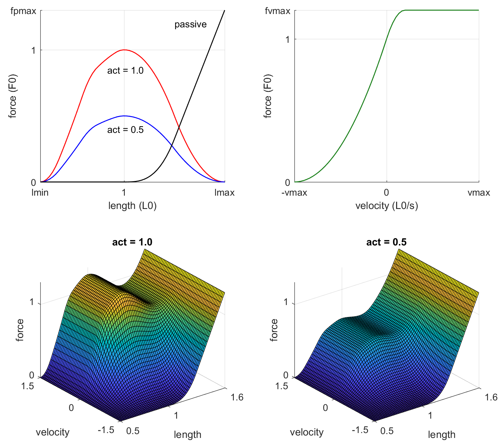

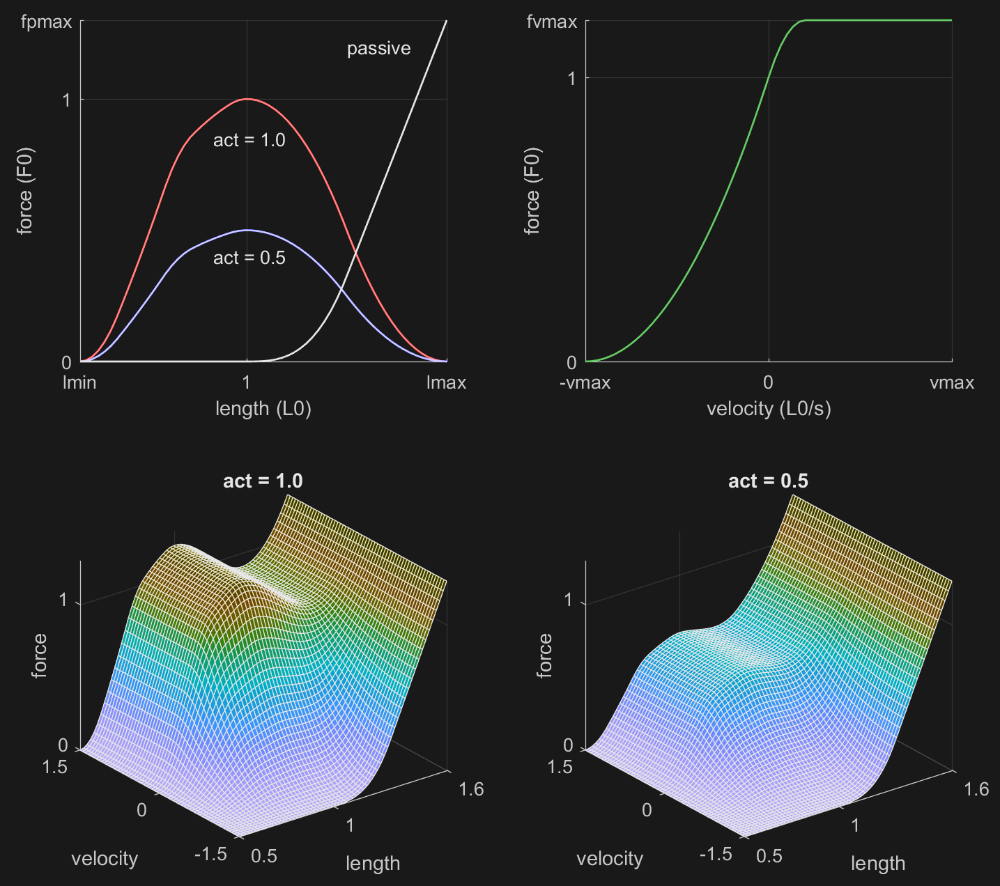

The function is in the form:

.. math::
   \text{\small FLV}(L, V, \texttt{act}) = F_L(L)\cdot F_V(V)\cdot \texttt{act} + F_P(L)

Comparing to the general form of a MuJoCo actuator, we see that :math:`F_L\cdot F_V` is the actuator gain and
:math:`F_P` is the actuator bias. :math:`F_L` is the active force as a function of length, while :math:`F_V` is the
active force as a function of velocity. They are multiplied to obtain the overall active force (note the scaling by act
which is the actuator activation). :math:`F_P` is the passive force which is always present regardless of activation.
The output of the :math:`\text{\small FLV}` function is the scaled muscle force. We multiply the scaled force by a
muscle-specific constant :math:`F_0` to obtain the actual force:

.. math::
   \texttt{actuator\_force} = -\text{\small FLV}(L, V, \texttt{act}) \cdot F_0

The negative sign is because positive muscle activation generates pulling force. The constant :math:`F_0` is the peak
active force at zero velocity. It is related to the muscle thickness (i.e., physiological cross-sectional area or PCSA).
If known, it can be set with the attribute force of element :ref:`muscle <actuator-muscle>`. If it is not known, we set
it to :math:`-1` which is the default. In that case we rely on the fact that larger muscles tend to act on joints that
move more weight. The attribute scale defines this relationship as:

.. math::
   F_0 = \text{scale} / \texttt{actuator\_acc0}

The quantity :math:`\texttt{actuator\_acc0}` is precomputed by the model compiler. It is the norm of the joint
acceleration caused by unit force acting on the actuator transmission. Intuitively, :math:`\text{scale}` determines how
strong the muscle is "on average" while its actual strength depends on the geometric and inertial properties of the
entire model.

Thus far we encountered three constants that define the properties of an individual muscle: :math:`L_T, L_0, F_0`. In
addition, the function :math:`\text{\small FLV}` itself has several parameters illustrated in the above figure:
:math:`l_\text{min}, l_\text{max}, v_\text{max}, f_\text{pmax}, f_\text{vmax}`. These are supposed to be the same for
all muscles, however different experimental papers suggest different shapes of the FLV function, thus users familiar
with that literature may want to adjust them. We provide the MATLAB function `FLV.m <_static/FLV.m>`__ which was used to
generate the above figure and shows how we compute the :math:`\text{\small FLV}` function.

Before embarking on a mission to design more accurate :math:`\text{\small FLV}` functions, consider the fact that the
operating range of the muscle has a bigger effect than the shape of the :math:`\text{\small FLV}` function, and in many
cases this parameter is unknown. Below is a graphical illustration:

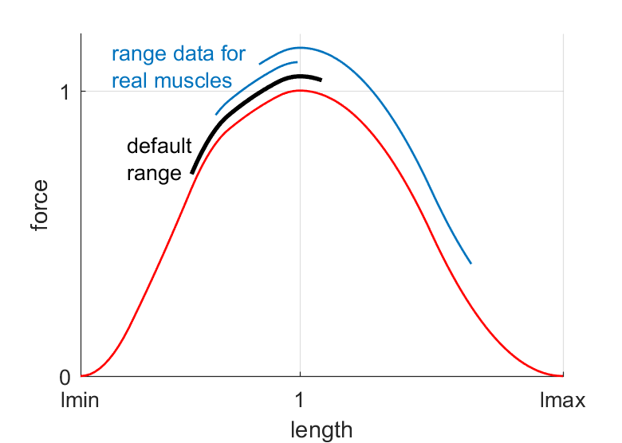

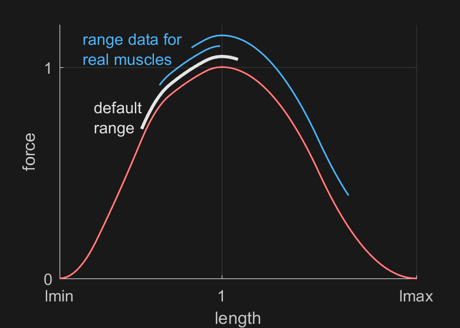

This figure format is common in the biomechanics literature, showing the operating range of each muscle superimposed on
the normalized :math:`\text{FL}` curve (ignore the vertical displacement). Our default range is shown in black. The blue
curves are experimental data for two arm muscles. One can find muscles with small range, large range, range spanning the
ascending portion of the :math:`\text{FL}` curve, or the descending portion, or some of both. Now suppose you have a
model with 50 muscles. Do you believe that someone did careful experiments and measured the operating range for every
muscle in your model, taking into account all the joints that the muscle spans? If not, then it is better to think of
musculo-skeletal models as having the same general behavior as the biological system, while being different in various
details -- including details that are of great interest to some research community. For most muscle properties which
modelers consider constant and known, there is an experimental paper showing that they vary under some conditions. This
is not to discourage people from building accurate models, but rather to discourage people from believing too strongly
in their models.

Coming back to our muscle model, there is the muscle activation ``act``. This is the state of a first-order nonlinear
filter whose input is the control signal. The filter dynamics are:

.. math::
   \frac{\partial}{\partial t}\texttt{act} = \frac{\texttt{ctrl} - \texttt{act}}{\tau(\texttt{ctrl}, \texttt{act})}

Internally the control signal is clamped to [0, 1] even if the actuator does not have a control range specified. There
are two time constants specified with the attribute timeconst, namely :math:`\text{timeconst} = (\tau_\text{act},
\tau_\text{deact})` with defaults :math:`(0.01, 0.04)`. Following `Millard et al. (2013)
<https://doi.org/10.1115/1.4023390>`__, the effective time constant :math:`\tau` is then computed at runtime as:

.. math::
   \tau(\texttt{ctrl}, \texttt{act}) =
   \begin{cases}
      \tau_\text{act} \cdot (0.5 + 1.5\cdot\texttt{act}) & \texttt{ctrl}-\texttt{act} \gt 0 \\
      \tau_\text{deact} / (0.5 + 1.5\cdot\texttt{act}) & \texttt{ctrl} - \texttt{act} \leq 0
   \end{cases}

Since the above equation describes discontinuous switching, which can be undesirable when using derivative-based
optimization, we introduce the optional smoothing parameter :ref:`tausmooth<actuator-muscle-tausmooth>`. When greater
than 0, the switching is replaced by :ref:`mju_sigmoid`, which will smoothly interpolate between the two values within
the range :math:`(\texttt{ctrl}-\texttt{act}) \pm \text{tausmooth}/2`.

Now we summarize the attributes of element :ref:`muscle <actuator-muscle>` which users may want to adjust,
depending on their familiarity with the biomechanics literature and availability of detailed measurements with regard
to a particular model:

Defaults
   Use the built-in defaults everywhere. All you have to do is attach a muscle to a tendon, as shown at the beginning of
   this section. This yields a generic yet reasonable model.
scale
   If you do not know the strength of individual muscles but want to make all muscles stronger or weaker, adjust scale.
   This can be adjusted separately for each muscle, but it makes more sense to set it once in the
   :ref:`default <default>` element.
force
   If you know the peak active force :math:`F_0` of the individual muscles, enter it here. Many experimental papers
   contain this data.
range
   The operating range of the muscle in scaled lengths is also available in some papers. It is not clear how reliable
   such measurements are (given that muscles act on many joints) but they do exist. Note that the range differs
   substantially between muscles.
timeconst
   Muscles are composed of slow-twitch and fast-twitch fibers. The typical muscle is mixed, but some muscles have a
   higher proportion of one or the other fiber type, making them faster or slower. This can be modeled by adjusting the
   time constants. The vmax parameter of the :math:`\text{\small FLV}` function should also be adjusted accordingly.
tausmooth
   When positive, smooths the transition between activation and de-activation time-constants. While a single
   `motor unit <https://en.wikipedia.org/wiki/Motor_unit>`__ is either activating or de-activating, an entire muscle
   will have a mixture of many units, leading to a corresponding mixture of timescales.
lmin, lmax, vmax, fpmax, fvmax
   These are the parameters controlling the shape of the :math:`\text{\small FLV}` function. Advanced users can
   experiment with them; see MATLAB function `FLV.m <_static/FLV.m>`__. Similar to the scale setting, if you want to
   change the :math:`\text{\small FLV}` parameters for all muscles, do so in the :ref:`default <default>` element.
Custom model
   Instead of adjusting the parameters of our muscle model, users can implement a different model, by setting gaintype,
   biastype and dyntype of a :ref:`general <actuator-general>` actuator to "user" and providing callbacks at
   runtime. Or, leave some of these types set to "muscle" and use our model, while replacing the other components. Note
   that tendon geometry computations are still handled by the standard MuJoCo pipeline providing actuator_length,
   actuator_velocity and actuator_lengthrange as inputs to the user's muscle model. Custom callbacks could then simulate
   elastic tendons or any other detail we have chosen to omit.

**Relation to OpenSim**

The standard software used by researchers in biomechanics is OpenSim. We have designed our muscle model to be similar
to the OpenSim model where possible, while making simplifications which result in significantly faster and more stable
simulations. To help MuJoCo users convert OpenSim models, here we summarize the similarities and differences.

The activation dynamics model is identical to OpenSim, including the default time constants.

The :math:`\text{\small FLV}` function is not exactly the same, but both MuJoCo and OpenSim approximate the same
experimental data, so they are very close. For a description of the OpenSim model and summary of relevant experimental
data, see `Millard et al. (2013) <https://doi.org/10.1115/1.4023390>`__.

We assume inelastic tendons while OpenSim can model tendon elasticity. We decided not to do that here, because tendon
elasticity requires fast-equilibrium assumptions which in turn require various tweaks and are prone to simulation
instability. In practice tendons are quite stiff, and their effect can be captured approximately by stretching the
:math:`\text{FL}` curve corresponding to the inelastic case (`Zajac (1989)
<https://pubmed.ncbi.nlm.nih.gov/2676342/>`__). This can be done in MuJoCo by shortening the muscle operating range.

Pennation angle (i.e., the angle between the muscle and the line of force) is not modeled in MuJoCo and is assumed to
be 0. This effect can be approximated by scaling down the muscle force and also adjusting the operating range.

Tendon wrapping is also more limited in MuJoCo. We allow spheres and infinite cylinders as wrapping objects, and require
two wrapping objects to be separated by a fixed site in the tendon path. This is to avoid the need for iterative
computations of tendon paths. We also allow "side sites" to be placed inside the sphere or cylinder,
which causes an inverse wrap: the tendon path is constrained to pass through the object instead of going around it. This
can replace torus wrapping objects used in OpenSim to keep the tendon path within a given area. Overall, tendon wrapping
is the most challenging part of converting an OpenSim model to a MuJoCo model, and requires some manual work. On the
bright side, there is a small number of high-quality OpenSim models in use, so once they are converted we are done.

Below we illustrate the four types of tendon wrapping available. Note that the curved sections of the
wrapping tendons are rendered as straight, but the geometry pipeline works with the actual curves and computes their
lengths and moments analytically:

|image3|

.. _CSensor:

Sensors
~~~~~~~

MuJoCo can simulate a wide variety of sensors as described in the :ref:`sensor <sensor>` element below.
User sensor types can also be defined, and are evaluated by the callback
:ref:`mjcb_sensor`. Sensors do not affect the simulation. Instead their outputs are
copied in the array mjData.sensordata and are available for user processing.

Here we describe the XML attributes common to all sensor types, so as to avoid repetition later.

:at:`name`: :at-val:`string, optional`
   Name of the sensor.
:at:`noise`: :at-val:`real, "0"`
   The standard deviation of the noise model of this sensor. In versions prior to 3.1.4, this would lead to noise being
   added to the sensors. In release 3.1.4 this feature was removed, see :doc:`3.1.4 changelog <changelog>` for a
   detailed justification. As of subsequent versions, this attrbute serves as a convenient location for saving standard
   deviation information for later use.
:at:`cutoff`: :at-val:`real, "0"`
   When this value is positive, it limits the absolute value of the sensor output. It is also used to normalize the
   sensor output in the sensor data plots in :ref:`simulate.cc <saSimulate>`.
:at:`user`: :at-val:`real(nuser_sensor), "0 0 ..."`
   See :ref:`User parameters <CUser>`.

.. _CCamera:

Cameras
~~~~~~~

Besides the default, user-controllable, free camera, "fixed" cameras can be attached to the kinematic tree.

Extrinsics
   By default, camera frames are attached to the containing body. The optional :ref:`mode<body-camera-mode>` and
   :ref:`target<body-camera-target>` attributes can be used to specify camera that track (move with) or target (look at)
   a body or subtree. Cameras look towards the negative Z axis of the camera frame, while positive X and Y correspond to
   *right* and *up* in the image plane, respectively.

Intrinsics
   Camera intrinsics are specified using :ref:`ipd<body-camera-ipd>` (inter-pupilary distance, required for
   stereoscopic rendering and VR) and :ref:`fovy<body-camera-fovy>` (vertical field of view, in degrees).

   The above specification implies a perfect point camera with no aberrations. However when calibrating real cameras,
   two types of linear aberration can be expressed using standard rendering pipelines. The first is different focal
   lengths in the vertical and horizontal directions (axis-aligned astigmatism). The second is a non-centered principal
   point. These can be specified using the :ref:`focal<body-camera-focal>` and :ref:`principal<body-camera-principal>`
   attributes. When these calibration-related attributes are used, the physical
   :ref:`sensor size<body-camera-sensorsize>` and camera :ref:`resolution<body-camera-resolution>` must also be
   specified. In this case, the rendering frustum can be visualized.

.. _CComposite:

Composite objects
~~~~~~~~~~~~~~~~~

Composite objects are not new model elements. Instead, they are collections of existing element originally designed to
simulate particle systems, ropes, cloth, and soft bodies. Over time, most of these types have been replaced by
:ref:`replicate<replicate>` (for repeated objects) and :ref:`flexcomp<body-flexcomp>` (for soft objects). Therefore, the
only supported composite type is now ``cable``, which produces an inextensible chain of bodies connected with ball
joints.

Composite objects are made up of regular MuJoCo bodies, which we call "element bodies" in this context. The collection
of element bodies is generated by the model compiler automatically. The user configures the automatic generator on a
high level, using the new XML element :ref:`composite <body-composite>` and its attributes and sub-elements, as
described in the XML reference chapter. If the compiled model is then saved, :el:`composite` is no longer present and is
replaced with the collection of regular model elements that were automatically generated. So think of it as a macro that
gets expanded by the model compiler. The element bodies are created as children of the body within which :el:`composite`
appears; thus a composite object appears in the same place in the XML where a regular child body may have been defined.
Each automatically-generated element body has a single geom attached to it. We have designed the composite object
generator to have intuitive high-level controls as much as possible, but at the same time it exposes a large number of
options that interact with each other and can profoundly affect the resulting physics. So at some point users should
read the :ref:`reference documentation <body-composite>` carefully.

In addition to setting up the physics, the composite object generator creates suitable rendering. Objects can be
rendered as :ref:`skins <asset-skin>`. The skin is generated automatically, and can be textured as well as subdivided
using bi-cubic interpolation. The actual physics and in particular the collision detection are based on the element
bodies and their geoms, while the skin is purely a visualization object. Yet in some situations we prefer to look at the
skin representation, as in `this model
<https://github.com/google-deepmind/mujoco/blob/main/model/plugin/elasticity/belt.xml>`__, whose skin is a continuous
flexible surface and not a collection of discontinuous thin boxes. However when fine-tuning the model and trying to
understand the physics behind it, it is useful to be able to render the geoms. To switch the rendering style, disable
the rendering of skins and enable group 3 for geoms and tendons.

**Cable**.

As a quick start, MuJoCo comes with an example of composite cables. In all examples we have a static scene which is
included in the model, followed by a single composite object. The XML snippets below are just the definition of the
composite object; see the XML model files in the distribution for the complete examples.

|coil|

.. code-block:: xml

   <extension>
      <plugin plugin="mujoco.elasticity.cable"/>
   </extension>

   <worldbody>
      <composite prefix="actuated" type="cable" curve="cos(s) sin(s) s" count="41 1 1"
                 size="0.25 .1 4" offset="0.25 0 .05" initial="none">
         <plugin plugin="mujoco.elasticity.cable">
            <!--Units are in Pa (SI)-->
            <config key="twist" value="5e8"/>
            <config key="bend" value="15e8"/>
            <config key="vmax" value="0"/>
         </plugin>
         <joint kind="main" damping="0.15" armature="0.01"/>
         <geom type="capsule" size=".005" rgba=".8 .2 .1 1"/>
      </composite>
   </worldbody>

The cable simulates an inextensible elastic 1D object having twist and bending stiffness. It is discretized using a
sequence of capsules or boxes. Its stiffness and inertia properties are computed directly from the given parameters and
the shape of the cross section, which allows for anisotropic behaviors, which can be found in e.g. belts or computer
cables. It is a single kinematic tree, so it is exactly inextensible without the use of additional constraints, enabling
the use of large time steps. The elastic model is geometrically exact and based on computing the Bishop or twist-free
frame of the centerline, i.e., the line passing through the center of the cross section. The orientations of the geoms
are expressed with respect to this frame and then decomposed into twist and bending components, hence different
stiffnesses can be set independently. Moreover, it is possible to specify if the stress-free configuration is flat or
curve, such as in the case of coil springs. The cable requires using a first-party :ref:`engine plugin<exPlugin>`, which
may be integrated directly into the engine in the future.

**Particle**.

The particle type is deprecated. It is recommended to use the more generic :ref:`replicate<replicate>` instead, for
example `this model <https://github.com/google-deepmind/mujoco/blob/main/model/replicate/particle.xml>`__.

**Grid**.

The grid composite type has been removed. It is recommended to use 2D flex :ref:`deformable objects <CDeformable>` for
simulating thin elastic structures.

**Rope and loop**.

The rope and loop are deprecated. It is recommended to use the cable for simulating inextensible elastic rods that are
bent and twisted and 1D flex :ref:`deformable objects <CDeformable>` for extensible strings in a tensile loading
scenario (e.g. a stretched rubber band).

**Cloth**.

The cloth is deprecated. It is recommended to use 2D flex :ref:`deformable objects <CDeformable>` for simulating thin
elastic structures.

**Box, cylinder and ellipsoid**.

The box type, as well as the cylinder and ellipsoid types, are now deprecated in favor of 3D flex :ref:`deformable
objects <CDeformable>`. element.

.. _CDeformable:

Deformable objects
~~~~~~~~~~~~~~~~~~

The :ref:`composite objects <CComposite>` described earlier were intended to emulate soft bodies in what is effectively
a rigid-body simulator. This was possible because MuJoCo constraints are soft, but nevertheless it was limited in
functionality and modeling power. In MuJoCo 3.0 we have introduced true deformable objects involving new model elements.
The :ref:`skin<deformable-skin>` described earlier was actually one such element, but it is merely used for
visualization. We now have a related element :ref:`flex<deformable-flex>` which generates contact forces, constraint
forces and passive forces as needed to model a wide range of deformable entities. Both skins and flexes are now defined
within a new grouping element in the XML called :ref:`deformable<deformable>`. A flex is a low-level element that
specifies everything needed at runtime, but is difficult to design at modeling time. To aid with modeling, we have
further introduced the element :ref:`flexcomp<body-flexcomp>` which automates the creation of the low-level flex,
similar to how :ref:`composite<body-composite>` automates the creation of (collections of) MuJoCo objects needed to
emulate a soft body. Flexes may eventually supersede composites, but for now both are useful for somewhat different
purposes.

A flex is a collection of MuJoCo bodies that are connected with massless stretchable elements. These elements can be
capsules (1D flex), triangles (2D flex), or tetrahedra (3D flex). In all cases we allow a radius, which makes the
elements smooth and also volumetric in 1D and 2D. The primitive elements are illustrated below:

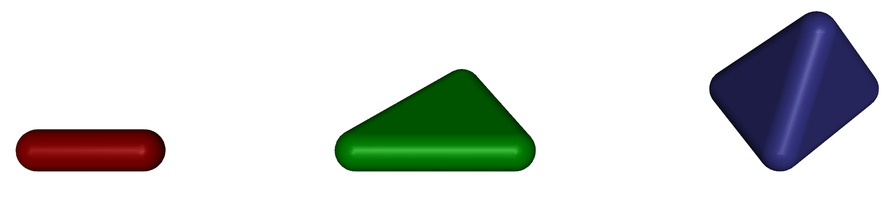

Thus far these look like geoms. But the key difference is that they deform: as the bodies (vertices) move independently
of each other, the shape of the elements changes in real time. Collisions and contact forces are now generalized to
handle these deformable geometric elements. Note that when two such elements collide, the contact no longer involves
just two bodies, but can involve up to 8 bodies (if both elements are tetrahedra). Contact forces are computed as
before, given the contact frame and relevant quantities expressed in that frame. But then the contact force is
distributed among all interacting bodies. The notion of contact Jacobian is complicated because the contact point cannot
be considered fixed in any body frame. Instead we use a weighting scheme to "assign" each contact point to multiple
bodies. It is also possible to create a rigid flex, by assigning all vertices to the same body. This is a way to
re-purpose the new flex collision machinery to implement rigid non-convex mesh collisions (unlike mesh geoms which are
convexified for collision purposes).

**Deformation model**.

In order to preserve the shape of the flex (in a soft sense), we need to generate passive or constraint forces. Prior to
MuJoCo 3.0 this would involve a large number of tendons plus constraints on tendons and joints. This is still possible
here, but inefficient both in terms of modeling and in terms of simulation when the flex is large. Instead, the design
philosophy is to use a single set of parameters and provide two modeling choices: a new (soft) equality constraint type
that applies to all edges of a given flex, which permits large time steps, or a discretized continuum representation,
where each element is in a constant stress state, which is equivalent to piecewise linear finite elements and achieves
improved realism and accuracy. The edge-based model could be seen as a "lumped" stiffness model, where the correct
coupling of deformation modes (e.g. shear and volumetric) is averaged in a single quantity. The continuum model enables
instead to specify shear and volumetic stiffnesses separately using the `Poisson's ratio
<https://en.wikipedia.org/wiki/Poisson%27s_ratio>`__ of the material. For more details, see the `Saint Venant-Kirchhoff
<https://en.wikipedia.org/wiki/Hyperelastic_material#Saint_Venant%E2%80%93Kirchhoff_model>`__ hyperelastic model.

**Creation and visualization**.

.. code-block:: xml

   <option timestep=".001"/>

   <worldbody>
      <flexcomp type="grid" count="24 4 4" spacing=".1 .1 .1" pos=".1 0 1.5"
                radius=".0" rgba="0 .7 .7 1" name="softbody" dim="3" mass="7">
         <contact condim="3" solref="0.01 1" solimp=".95 .99 .0001" selfcollide="none"/>
         <edge damping="1"/>
         <elasticity poisson="0.2" young="5e4">
      </flexcomp>
   </worldbody>

Using the :ref:`flexcomp<body-flexcomp>` element, we can create flexes from meshes, including tetrahedral meshes, and
automatically generate all the bodies/vertices and connect them with suitable elements. We can also create grids and
other topologies automatically. This machinery makes it easy to create very large flexes, involving thousands or even
tens of thousands of bodies, elements and edges. Obviously such simulations will not be fast. Even for medium-sized
flexes, pruning of collision pairs is essential. This is why we have developed elaborate methods for pruning
self-collisions; see XML reference.

In case of 3D flexes made of tetrahedra, it may be useful to examine how the flex is "triangulated" internally. We have
a special visualization mode that peels off the outer layers. Below is an example with the Stanford Bunny. Note how it
has smaller tetrahedra on the outside and larger ones on the inside. This mesh design makes sense, because we want the
collision surface to be accurate, but on the inside we just need soft material properties -- which require less spatial
resolution. In order to convert a surface mesh to a tetrahedral mesh, we recommend open tools like the
`fTetWild library <https://github.com/wildmeshing/fTetWild>`__.

|bunny1| |bunny2|

.. _CInclude:

Including files
~~~~~~~~~~~~~~~

MJCF files can include other XML files using the :ref:`include <include>` element. Mechanistically, the
parser replaces the DOM node corresponding to the include element in the master file with the list of XML elements
that are children of the top-level element in the included file. The top-level element itself is discarded, because it
is a grouping element for XML purposes and would violate the MJCF format if included.

This functionality enables modular MJCF models; see the MPL family of models in the model library. One example of
modularity is constructing a model of a robot (which tends to be elaborate) and then including it in multiple
"scenes", i.e., MJCF models defining the objects in the robot's environment. Another example is creating a file with
commonly used assets (say materials with carefully adjusted rgba values) and including it in multiple models which
reference those assets.

The included files are not required to be valid MJCF files on their own, but they usually are. Indeed we have designed
this mechanism to allow MJCF models to be included in other MJCF models. To make this possible, repeated MJCF sections
are allowed even when that does not make sense semantically in the context of a single model. For example, we allow
the kinematic tree to have multiple roots (i.e., multiple :el:`worldbody` elements) which are merged automatically by
the parser. Otherwise including robots into scenes would be impossible.

The flexibility of repeated MCJF sections comes at a price: global settings that apply to the entire model, such as
the :at:`angle` attribute of :ref:`compiler <compiler>` for example, can be defined multiple times.
MuJoCo allows this, and uses the last definition encountered in the composite model, after all include elements have
been processed. So if model A is defined in degrees and model B is defined in radians, and A is included in B after
the :el:`compiler` element in B, the entire composite model will be treated as if it was defined in degrees -- leading
to undesirable consequences in this case. The user has to make sure that models included in each other are compatible
in this sense; local vs. global coordinates is another compatibility requirement.

Finally, as explained next, element names must be unique among all elements of the same type. So for example if the
same geom name is used in two models, and one model is included in the other, this will result in compile error.
Including the same XML file more than once is a parsing error. The reason for this restriction is that we want to
avoid repeated element names as well as infinite recursion caused by inclusion.

.. _CName:

Naming elements
~~~~~~~~~~~~~~~

Most model elements in MJCF can have names. They are defined with the attribute :at:`name` of the corresponding XML
element. When a given model element is named, its name must be unique among all elements of the same type. Names are
case-sensitive. They are used at compile time to reference the corresponding element, and are also saved in mjModel
for user convenience at runtime.

The name is usually an optional attribute. We recommend leaving it undefined (so as to keep the model file shorter)
unless there is a specific reason to define it. There can be several such reasons:

-  Some model elements need to reference other elements as part of their creation. For example, a spatial tendon needs
   to reference sites in order to specify the via points it passes through. Referencing can only be done by name. Note
   that assets exist for the sole purpose of being referenced, so they must have a name, however it can be omitted and
   set implicitly from the corresponding file name.
-  The visualizer offers the option to label all model elements of a given type. When a name is available, it is printed
   next to the object in the 3D view; otherwise a generic label in the format "body 7" is printed.
-  The function :ref:`mj_name2id` returns the index of the model element with given type and
   name. Conversely, the function :ref:`mj_id2name` returns the name given the index. This
   is useful for custom computations involving a model element that is identified by its name in the XML (as opposed to
   relying on a fixed index which can change when the model is edited).
-  The model file could in principle become more readable by naming certain elements. Keep in mind however that XML
   itself has a commenting mechanism, and that mechanism is more suitable for achieving readability -- especially since
   most text editors provide syntax highlighting which detects XML comments.

.. _CURDF:

URDF extensions
~~~~~~~~~~~~~~~

The Unified Robot Description Format (URDF) is a popular XML file format in which many existing robots have been
modeled. This is why we have implemented support for URDF even though it can only represent a subset of the model
elements available in MuJoCo. In addition to standard URDF files, MuJoCo can load files that have a custom (from the
viewpoint of URDF) :el:`mujoco` element as a child of the top-level element :el:`robot`. This custom element can have
sub-elements :ref:`compiler <compiler>`, :ref:`option <option>`,
:ref:`size <size>` with the same functionality as in MJCF, except that the default compiler settings
are modified so as to accommodate the URDF modeling convention. The :ref:`compiler <compiler>` extension
in particular has proven very useful, and indeed several of its attributes were introduced because a number of
existing URDF models have non-physical dynamics parameters which MuJoCo's built-in compiler will reject if left
unmodified. This extension is also needed to specify mesh directories. Also note that the compiler attributes
:ref:`strippath<compiler-strippath>`, :ref:`angle<compiler-angle>`, :ref:`fusestatic<compiler-fusestatic>` and
:ref:`discardvisual<compiler-discardvisual>` have different default values for URDF and MJCF.

Note that the while MJCF models are checked against a custom XML schema by the parser, URDF models are not. Even the
MuJoCo-specific elements embedded in the URDF file are not checked. As a result, mis-typed attribute names are
silently ignored, which can result in major confusion if the typo remains unnoticed.

Here is an example extension section of a URDF model:

.. code-block:: xml

   <robot name="darwin">
     <mujoco>
       <compiler meshdir="../mesh/darwin/" balanceinertia="true" discardvisual="false"/>
     </mujoco>
     <link name="MP_BODY">
       ...
   </robot>

The above extensions make URDF more usable but still limited. If the user wants to build models taking full advantage of
MuJoCo and at the same time maintain URDF compatibility, we recommend the following procedure. Introduce extensions in
the URDF as needed, load it and save it as MJCF. Then add information to the MJCF using
:ref:`include <include>` elements whenever possible. In this way, if the URDF is modified, the
corresponding MJCF can be easily re-created. In our experience though, URDF files tend to be static while MJCF files are
often edited. Thus in practice it is usually sufficient to convert the URDF to MJCF once and after that only work with
the MJCF.

.. _CMocap:

MoCap bodies
~~~~~~~~~~~~

``mocap`` bodies are static children of the world (i.e., have no joints) and their :at:`mocap` attribute is set to
"true". They can be used to input a data stream from a motion capture device into a MuJoCo simulation. Suppose you are
holding a VR controller, or an object instrumented with motion capture markers (e.g. Vicon), and want to have a
simulated object moving in the same way but also interacting with other simulated objects. There is a dilemma here:
virtual objects cannot push on your physical hand, so your hand (and thereby the object you are controlling) can
violate the simulated physics. But at the same time we want the resulting simulation to be reasonable. How do we do
this?

The first step is to define a mocap body in the MJCF model, and implement code that reads the data stream at runtime and
sets mjModel.mocap_pos and mjModel.mocap_quat to the position and orientation received from the motion capture system.
The :ref:`simulate.cc <saSimulate>` code sample uses the mouse as a motion capture device, allowing the user to move
mocap bodies around:

|particle|

The key thing to understand about mocap bodies is that the simulator treats them as being fixed. We are causing them to
move from one simulation time step to the next by updating their position and orientation directly, but as far as the
physics model is concerned their position and orientation are constant. So what happens if we make contact with a
regular dynamic body, as in the particle examples provided with the MuJoCo distribution (recall that in those example we
have a capsule probe which is a mocap body that we move with the mouse). A contact between two regular bodies will
experience penetration as well as relative velocity, while contact with a mocap body is missing the relative velocity
component because the simulator does not know that the mocap body itself is moving. So the resulting contact force is
smaller and it takes longer for the contact to push the dynamic object away. Also, in more complex simulations the fact
that we are doing something inconsistent with the physics can cause instabilities.

There is however a better-behaved alternative. In addition to the mocap body, we include a second regular body and
connect it to the mocap body with a weld equality constraint. In the plots below, the pink box is the mocap body and
it is connected to the base of the hand. In the absence of other constraints, the hand tracks the mocap body almost
perfectly (and much better than a spring-damper would) because the constraints are handled implicitly and can produce
large forces without destabilizing the simulation. But if the hand is forced to make contact with the table for example
(right plot) it cannot simultaneously respect the contact constraint and track the mocap body. This is because the
mocap body is free to go through the table. So which constraint wins? That depends on the softness of the weld
constraint realtive to the contact constraint. The corresponding :at:`solref` and :at:`solimp` parameters need to be
adjusted so as to achieve the desired trade-off. See the Modular Prosthetic Limb (MPL) hand model available on the
MuJoCo Forum for an example; the plots below are generated with that model.

|image18| |image19|

.. _CSize:

Memory allocation
~~~~~~~~~~~~~~~~~

MuJoCo preallocates all the memory needed at runtime in :ref:`mjData`, and does not access the heap allocator after
model creation. Memory in :ref:`mjData` is allocated by :ref:`mj_makeData` in two contiguous blocks:

- ``mjData.buffer`` contains fixed-size arrays.
- ``mjData.arena`` contains dynamically-sized arrays.

There are two types of dynamic arrays allocated in the ``arena`` memory space.

- contacts and constraint-related arrays are laid out from the beginning of the ``arena``.
- :ref:`stack <siStack>` arrays are laid out from the end of the ``arena``.

By allocating dynamic quantities from both sides of the ``arena`` space, variable-sized memory allocation is controlled
by a single number: the :at:`memory` attribute of the :ref:`size <size>` MJCF element. Unlike the fixed-size arrays in
the ``buffer``, variable-sized arrays in the arena can be ``NULL``, for example after a call to :ref:`mj_resetData`.
When ``arena`` memory runs out, one of three things will happen, depending on the type of memory requested:

- If memory runs out during contact allocation, a warning will be raised and subsequent contacts will not be added in
  this step, but simulation continues as usual.
- If memory runs out during constraint-related allocation, a warning will be raised and the constraint solver will be
  disabled in this step, but simulation continues as usual. Note that physics without the constraint solver will
  generally be very different, but allowing the simulation to continue can still be useful, e.g. during
  scene initialization when many bodies are temporarily overlapping.
- If memory runs out during stack array allocation, a hard error will occur.

Unlike the size of the ``buffer``, the size of the ``arena`` cannot be pre-computed, since the number of contacts and
stack usage is not known in advance. So how should one choose it? The following simple heuristic is currently used,
though it may be improved in the future: enough memory is allocated for 100 contacts and 500 scalar constraints, under
worst-case conditions. If this heuristic is insufficient, we recommend the following procedure. Increase the ``arena``
memory significantly using the :at:`memory` attribute, and inspect the actual memory used at runtime.
``mjData.maxuse_arena`` keeps track of the maximum ``arena`` memory utilization since the last reset. The :ref:`simulate
<saSimulate>` viewer shows this number as a fraction of the total arena space (in the info window in the lower-left
corner). So one can start with a large number, simulate for a while, and if the fractions are small go back to the XML
and reduce the allocation size. Keep in mind though that memory utilization can change dramatically in the course of the
simulation, depending on how many constraints are active and which constraint solver is used. The CG solver is the most
memory efficient, followed by the Newton solver, while the PGS solver is the most memory intensive. When we design
models, we usually aim for 50% utilization in the worst-case scenario encountered while exploring the model. If you only
intend to use the CG solver, you can get away with significantly smaller arena allocation.

.. attention::

   Memory allocation behaviour changed in MuJoCo 2.3.0. Before this version, the :at:`njmax`, :at:`nconmax` and
   :at:`nstack` attributes of the :ref:`size <size>` MJCF element had the semantics of maximum memory allocated for
   contacts, constraints and stack, respectively. If you are using an earlier version of MuJoCo, please switch to an
   `earlier <https://mujoco.readthedocs.io/en/2.2.2/modeling.html#model-sizes>`_ documentation version to read about the
   previous behaviour.

.. _Tips:

Tips and tricks
---------------

Here we provide guidance on how to accomplish some common modeling tasks. There is no new material here, in the sense
that everything in this section can be inferred from the rest of the documentation. Nevertheless the inference process
is not always obvious, so it may be useful to have it spelled out.

.. _CPerformance:

Performance tuning
~~~~~~~~~~~~~~~~~~

Below is a list of steps one can take in order to maximize simulation throughput. All of the recommendations
involve parameter tweaking. It is recommended that these be carried out in interactive fashion while looking at the
:ref:`simulate<saSimulate>` utility's built-in profiler. A detailed and sometimes more useful profile is also reported
by the :ref:`testspeed<saTestspeed>` utility. When embarking on the more elaborate steps below, target the most
expensive pipeline component reported by the profiler. Note that some of these are subtly different for MJX, see
dedicated section :ref:`therein<MjxPerformance>`.

1. :ref:`Timestep<option-timestep>`: Try to increase the simulation timestep. As explained at the end of the
   :ref:`Numerical Integration<geIntegration>` section, the timestep is the single most important parameter in any
   model. The default value is chosen for stability rather than efficiency, and can often be increased. At some point,
   increasing it further will cause diveregence, so the optimal timestep is the largest timestep at which divergence
   never happens or is very rare. The actual value is model-dependent.
2. :ref:`Integrator<option-integrator>`: Choose your integrator according to the recommendations at the end of the
   :ref:`Numerical Integration<geIntegration>` section. The default recommended choice is the ``implicitfast``
   integrator.
3. :ref:`Constraint Jacobians<option-jacobian>`: Try switching the Jacobian setting between "dense" and "sparse". These
   two options use separate code paths using dense or sparse algebra, but are otherwise computationally identical, so
   the faster one is always preferred. The default "auto" heuristic does not always make the right choice.
4. **Constraint solver:** If the profiler reports that a large chunk of time is spent in the solver, consider the
   following:

   - :ref:`solver<option-solver>`: The default Newton is often the fastest solver, as it requires the smallest
     number of iterations to converge. For large models the CG solver might be faster, for models with more degrees of
     freedom than constraints, the PGS solver will be fastest, though this situation is not common.
   - :ref:`iterations<option-iterations>` and :ref:`tolerance<option-tolerance>`: Try reducing the number of iterations
     or, equivalently, increasing the solver's termination tolerance. In particular for the Newton solver, which
     typically achieves numerical convergence in 2-3 (expensive) iterations, the last iteration increases the precision
     to a level that has no noticeable effect, and can be skipped.
5. **Collisions:** If the profiler reports that collision detection takes up a large chunk of the computation
   time, consider the following steps:

   - Reduce the number of checked collisions using the
     :ref:`contype<body-geom-contype>` / :ref:`conaffinity<body-geom-conaffinity>` mechanism described in the
     :ref:`Collison detection<Collision>` section.
   - Modify collision geometries, replacing expensive collision tests (e.g. mesh-mesh) with cheaper primitive-primitive
     collisions. As a rule of thumb, collisions which have custom pair functions in the collision table at the top of
     `engine_collision_driver.c <https://github.com/google-deepmind/mujoco/blob/main/src/engine/engine_collision_driver.c>`__
     are significantly cheaper than those that use the generic convex-convex collider ``mjc_Convex``. The most expensive
     collisions are those involving SDF geometries.
   - If replacing collision meshes with primitives is not feasible, decimate the meshes as much as possible. Open source
     tools like trimesh, Blender, MeshLab and CoACD are very useful in this regard.
6. :ref:`Friction cones<option-cone>`: Elliptic cones are more accurate and better at preventing slip with high
   :ref:`impratio<option-impratio>`, but are more expensive. If accurate friction is not important, try switching
   to pyramidal cones.
7. Compile MuJoCo with 32-bit floating point precision (rather than the default 64). For large models running in
   multi-threaded mode, where memory access is more expensive than computation, this can lead to (up to) 2x performance
   improvement. See :ref:`mjtNum` for more information.

.. _CSlippage:

Preventing slip
~~~~~~~~~~~~~~~

Below is a list of steps one can take in order to diagnose and solve contact slippage, which is especially problematic
in manipulation tasks. In order to diagnose slippage, it is recommended to use the :ref:`simulate<saSimulate>` utility's
built in visualization options to inspect contacts and contact forces. It is often helpful to tweak the visual size of
contacts and forces (using the global :ref:`meansize<statistic-meansize>` or the specific
:ref:`contactwidth<visual-scale-contactwidth>`, :ref:`contactheight<visual-scale-contactheight>` and
:ref:`forcewidth<visual-scale-forcewidth>` attributes) and the :ref:`force scaling<visual-map-force>` attribute, to
better visualize and understand the contact configuration and resulting forces.

**Slip-preventing contact forces are outside the friction cone**
  This implies that the physics cannot prevent slip, even in principle. This occurs when:

  a. *The normal force is too small.* Ensure that the maximum force that can be applied by the gripper mutiplied by
     the sliding friction coefficient is significantly greater than the weight of the object.
  b. *The sliding friction coefficient is too low.* Increase the sliding :ref:`friction<body-geom-friction>`
     coefficient.
  c. *Torsional friction is insufficient to apply the required torques.* Increase :ref:`condim<body-geom-condim>` to
     4 or 6 and choose appropriate friction coefficients.
     **condim 4** enables torsional friction, preventing rotation around the normal.
     **condim 6** also enables rolling friction, preventing rotation around the tangential directions.
     See the :ref:`Contact<coContact>` section for details and the specifc semantics of these coefficients.

**The geometry does not support the required forces or torques**
  This is a common real-world problem, solved by improved design of grippers and handles.

  a. Improve the geometry of the contacting geoms in order to add more contact points, possibly with non-flat
     geometry (e.g., bumps), so slippage is prevented by the normal force and not only frictional components.
  b. If contacts are between flat surfaces, try enabling the :ref:`multiccd<option-flag-multiccd>` flag, which allows
     the detector to find more contacts than the single contact returned by the convex-convex collider.
  c. Try enabling the native collision detection pipeline by setting the :ref:`nativeccd<option-flag-nativeccd>` flag,
     which uses a more accurate and efficient convex collision detection algorithm.

**High-frequency vibration**
  High-frequency, low-amplitude vibrations are also a real-world problem in many industrial settings, but unlike in
  simulation, in the real world they are audible. Such vibration is often caused by controllers with very
  high gains and sometimes by stick-slip feedback from contacts or joints, resonating with the eigen-modes of the
  mechanism. The easist way to diagnose such vibration is to visualize contact forces in
  :ref:`simulate<saSimulate>`. The solution is usually to reduce the :ref:`timestep<option-timestep>` and/or add
  some :ref:`armature<body-joint-armature>` to the relevant joints. Another reason for vibration is feedback from
  explicit damping. Use the implicit or implicitfast integrators, as documented in the
  :ref:`Numerical Integration<geIntegration>` section.

**Slow slippage**
  Unlike the above problems which lead to fast slippage, slow, gradual slippage is a property of MuJoCo's contact
  model by design, since without it the inverse dynamics are not defined. This is discussed in detail in the
  :ref:`softness and slip<Soft>` clarification. This type of slippage can be addressed in two ways.

  a. Increase the :ref:`impratio<option-impratio>` parameter. This will reduce (but not entirely prevent) slow
     slippage. Note that high impratio values work well only with :ref:`elliptic cones<option-cone>`.
  b. Enable the noslip solver by increasing :ref:`noslip_iterations<option-noslip_iterations>` to a positive integer.
     A small number (1, 2 or 3) is usually sufficient. The noslip post-processing solver will entirely prevent slip,
     at the cost of making inverse dynamics ill-defined and additional computational cost.

.. _CBacklash:

Backlash
~~~~~~~~

Backlash is present in many robotic joints. It is usually caused by small gaps between gears in the gearbox, but could
also be caused by some sloppiness in the joint mechanism. The effect is that the motor can turn for a small angle before
the joint turns, or vice versa (when external force is applied on the joint). Backlash can be modeled in MuJoCo as
follows. Instead of having a single hinge joint within the body, define two hinge joints with identical position and
orientation:

.. code-block:: xml

   <body>
     <joint name="J1" type="hinge" pos="0 0 0" axis="0 0 1" armature="0.01"/>
     <joint name="J2" type="hinge" pos="0 0 0" axis="0 0 1" limited="true" range="-1 1"/>
   </body>

Thus the overall rotation of the body relative to its parent is J1+J2. Now define an actuator acting only on J1. The
small joint range on J2 keeps it near 0, yet allows it to move a bit in the direction of the force acting on it,
producing a backlash effect. Note the :at:`armature` attribute in J1. Without it the joint-space inertia matrix
will be singular, because the two joints could accelerate in opposite directions without encountering any inertia. The
physical gears responsible for the backlash actually have rotational inertia (which we call armature) so this is a
realistic modeling approach. The numbers in this example should be adjusted to obtain the desired behavior. The
:at:`solref` and :at:`solimp` parameters of the joint limit constraint could also be adjusted, to make the
backlash rotation end at a softer or a harder limit.

Instead of specifying joint limits in J2, one can specify a soft equality constraint keeping J2=0. The constraint
impedance function should then be adjusted so the constraint is weak near J2=0 and gets stronger away from 0. The new
parameterization of impedance functions shown in :ref:`Solver parameters <CSolver>` enables this. Compared to joint
limits, the equality constraint approach will generate a softer transition between the backlash regime and the limit
regime. It will also be active all the time, which is convenient in user code that needs the constraint violation or
constraint force as input.

.. _CRestitution:

Restitution
~~~~~~~~~~~

Another mechanism exists for specifying :at:`solref`, as explained in :ref:`Solver parameters <CSolver>`.
When both numbers are non-positive, they are interpreted as (-stiffness, -damping) and scaled by the constraint
impedance. To achieve perfect restitution for contacts and other constraints, set stiffness to some reasonably large
value and damping to zero. Below is an example of a sphere bouncing on a plane with restitution coefficient of 1, so
that the energy before and after contact is approximately preserved. It is not exactly preserved because the contact
itself is soft and takes several time steps, and the (implicit) deformations during those time steps are not exactly
energy-preserving. But the overall effect is that the ball bounces for a very long time without changing its peak height
in a visible way, and the energy fluctuates around the initial value instead of drifting.

.. code-block:: xml

   <worldbody>
     <geom type="plane" size="1 1 .1"/>

     <body pos="0 0 1">
       <freejoint/>
       <geom type="sphere" size="0.1" solref="-1000 0"/>
     </body>
   </worldbody>

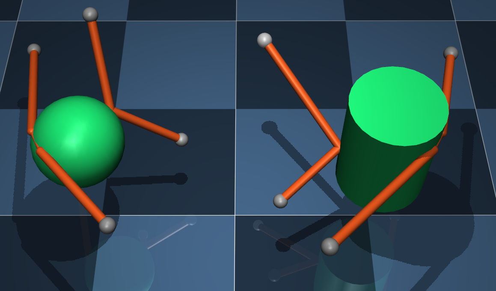
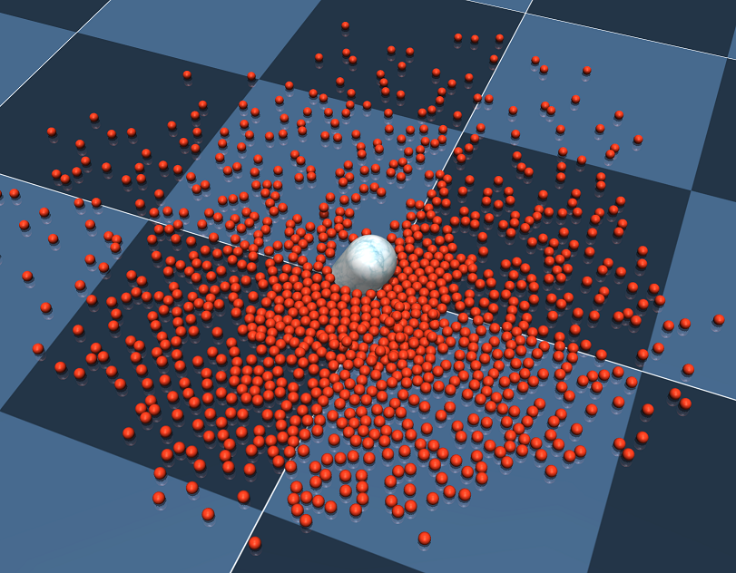
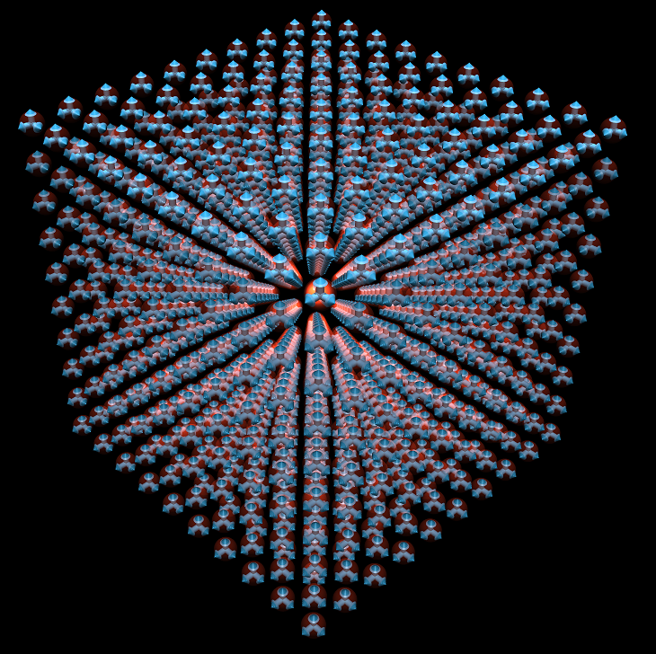
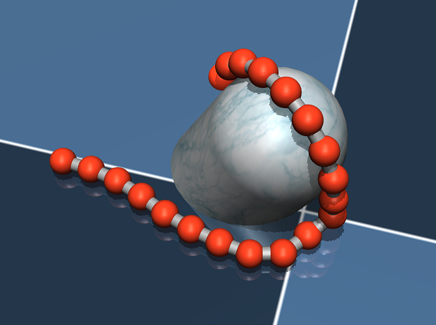
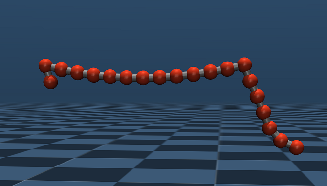
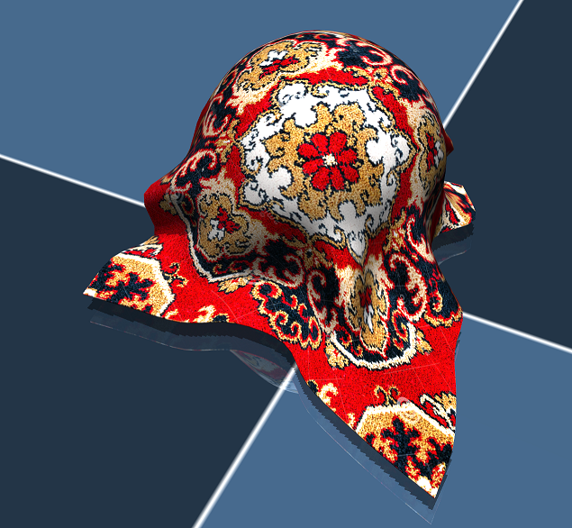
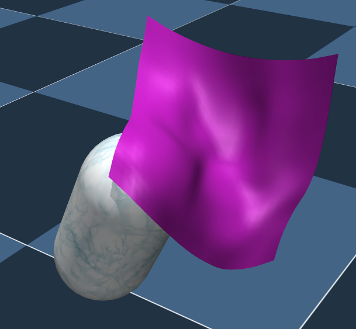
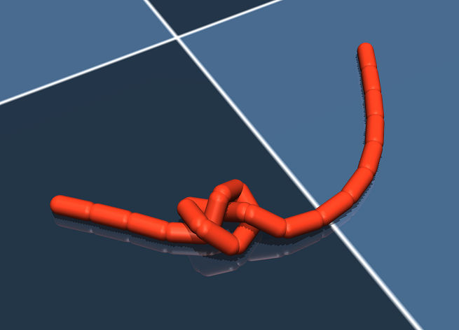
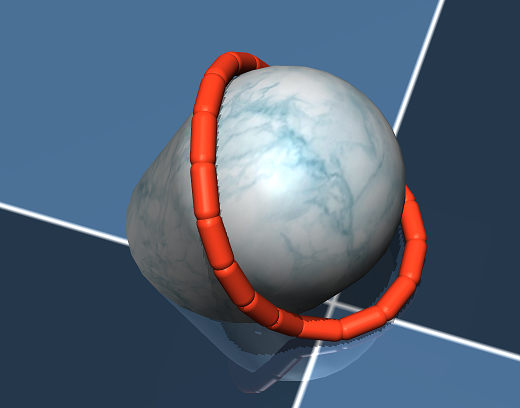
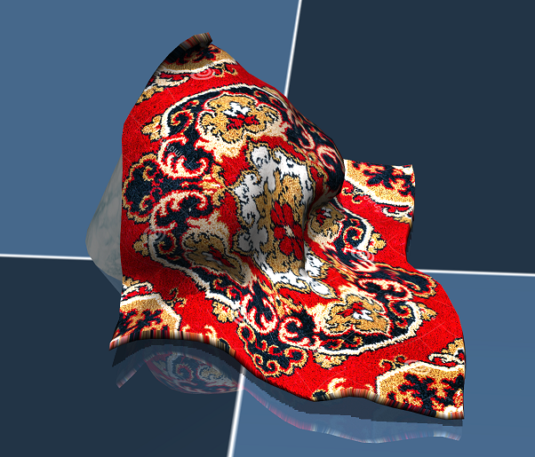
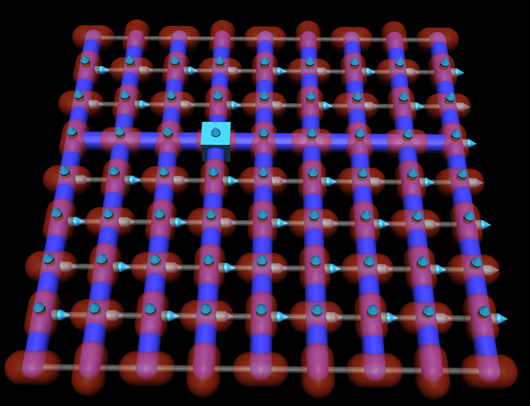
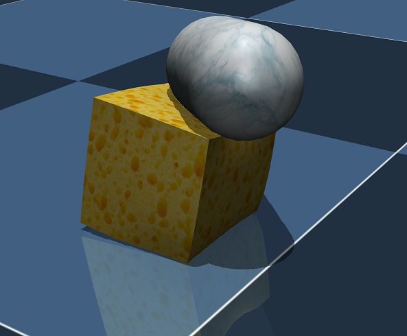
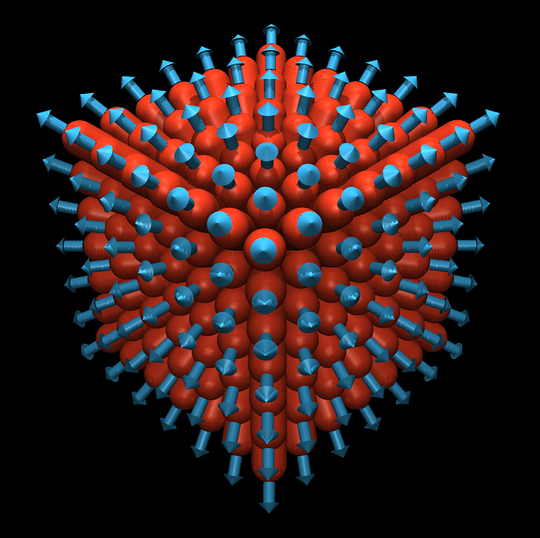
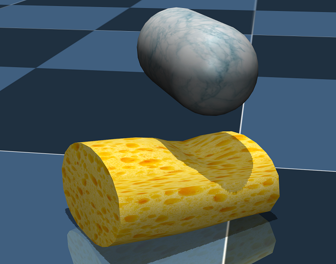
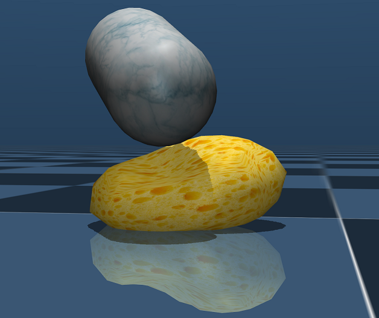
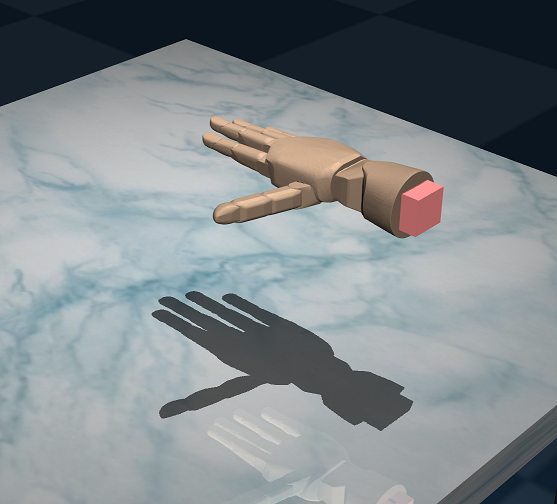
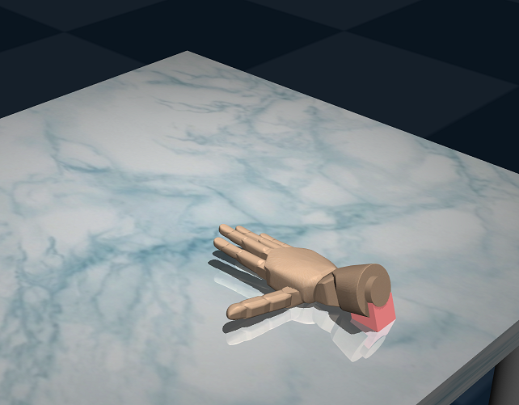
.. |particle| image:: images/models/particle.gif
   :width: 270px
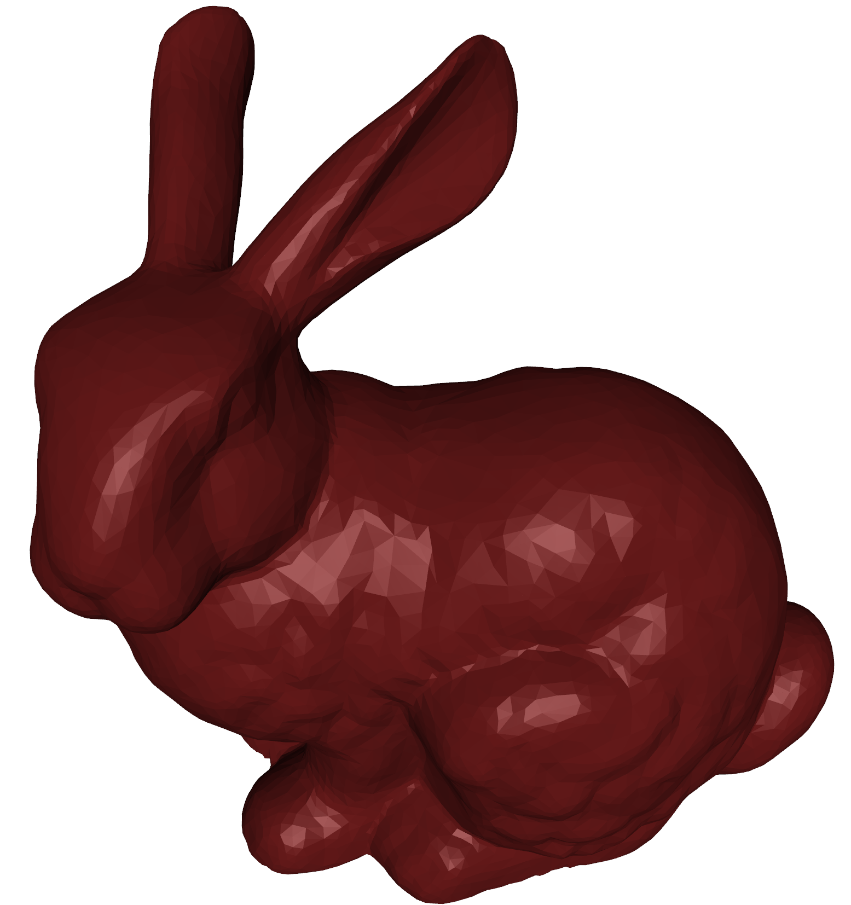
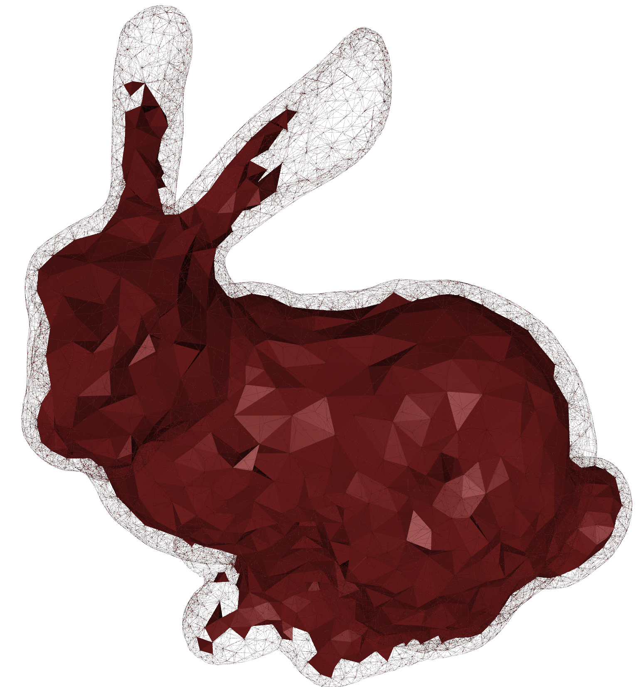
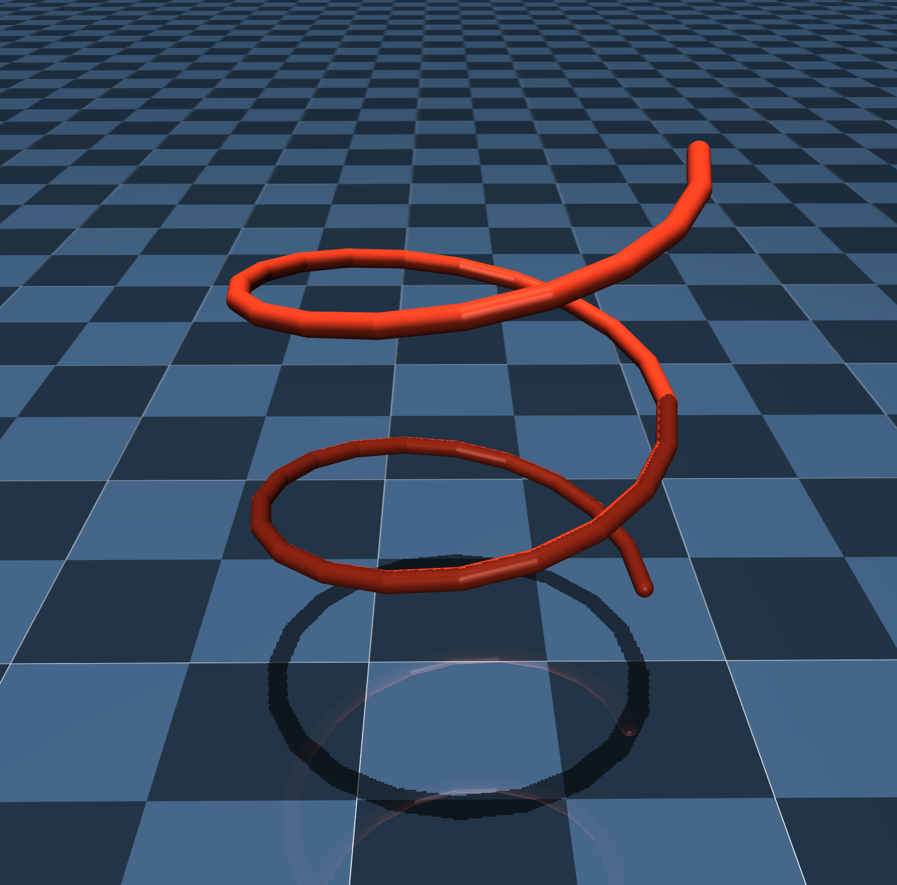
