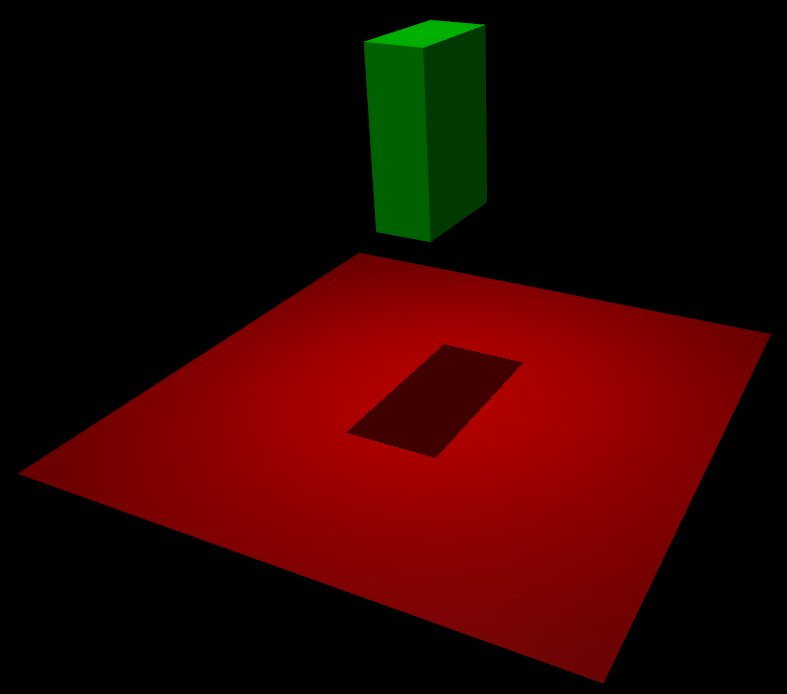
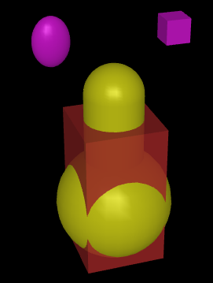

Overview
========

Introduction
------------

**MuJoCo** stands for **Mu**\ lti-**Jo**\ int dynamics with **Co**\ ntact. It is a general purpose physics engine that
aims to facilitate research and development in robotics, biomechanics, graphics and animation, machine learning, and
other areas that demand fast and accurate simulation of articulated structures interacting with their environment.
Initially developed by Roboti LLC, it was acquired and made `freely available
<https://github.com/google-deepmind/mujoco/blob/main/LICENSE>`__ by DeepMind in October 2021, and open sourced in May
2022. The MuJoCo codebase is available at the `google-deepmind/mujoco <https://github.com/google-deepmind/mujoco>`__ repository
on GitHub.

MuJoCo is a C/C++ library with a C API, intended for researchers and developers. The runtime simulation module is tuned
to maximize performance and operates on low-level data structures which are preallocated by the built-in XML parser and
compiler. The user defines models in the native MJCF scene description language -- an XML file format designed to be as
human readable and editable as possible. URDF model files can also be loaded. The library includes interactive
visualization with a native GUI, rendered in OpenGL. MuJoCo further exposes a large number of utility functions for
computing physics-related quantities.

MuJoCo can be used to implement model-based computations such as control synthesis, state estimation, system
identification, mechanism design, data analysis through inverse dynamics, and parallel sampling for machine learning
applications. It can also be used as a more traditional simulator, including for gaming and interactive virtual
environments.

.. _Features:

Key features
~~~~~~~~~~~~

MuJoCo has a long list of features. Here we outline the most notable ones.

Generalized coordinates combined with modern contact dynamics
   Physics engines have traditionally separated in two categories. Robotics and biomechanics engines use efficient and
   accurate recursive algorithms in generalized or joint coordinates. However they either leave out contact dynamics, or
   rely on the earlier spring-damper approach which requires very small time-steps. Gaming engines use a more modern
   approach where contact forces are found by solving an optimization problem. However, they often resort to the
   over-specified Cartesian representation where joint constraints are imposed numerically, causing inaccuracies and
   instabilities when elaborate kinematic structures are involved. MuJoCo was the first general-purpose engine to
   combine the best of both worlds: simulation in generalized coordinates and optimization-based contact dynamics. Other
   simulators have more recently been adapted to use MuJoCo's approach, but that is not usually compatible with all of
   their functionality because they were not designed to do this from the start. Users accustomed to gaming engines may
   find the generalized coordinates counterintuitive at first; see :ref:`Clarifications` section below.

Soft, convex and analytically-invertible contact dynamics
   In the modern approach to contact dynamics, the forces or impulses caused by frictional contacts are usually defined
   as the solution to a linear or non-linear complementarity problem (LCP or NCP), both of which are NP-hard. MuJoCo is
   based on a different formulation of the physics of contact which reduces to a convex optimization problem, as
   explained in detail in the :doc:`computation/index` chapter. Our model allows soft contacts and other constraints,
   and has a uniquely-defined inverse facilitating data analysis and control applications. There is a choice of
   optimization algorithms, including a generalization to the projected Gauss-Seidel method that can handle elliptic
   friction cones. The solver provides unified treatment of frictional contacts including torsional and rolling
   friction, frictionless contacts, joint and tendon limits, dry friction in joints and tendons, as well as a variety of
   equality constraints.

Tendon geometry
   MuJoCo can model the 3D geometry of tendons -- which are minimum-path-length strings obeying wrapping and via-point
   constraints. The mechanism is similar to the one in OpenSim but implements a more restricted, closed-form set of
   wrapping options to speed up computation. It also offers robotics-specific structures such as pulleys and coupled
   degrees of freedom. Tendons can be used for actuation as well as to impose inequality or equality constraints on the
   tendon length.

General actuation model
   Designing a sufficiently rich actuation model while using a model-agnostic API is challenging. MuJoCo achieves this
   goal by adopting an abstract actuation model that can have different types of transmission, force generation, and
   internal dynamics (i.e., state variables which make the overall dynamics 3rd order). These components can be
   instantiated so as to model motors, pneumatic and hydraulic cylinders, PD controllers, biological muscles and many
   other actuators in a unified way.

Reconfigurable computation pipeline
   MuJoCo has a top-level stepper function :ref:`mj_step` which runs the entire forward dynamics and advances the state
   of the simulation. In many applications beyond simulation, however, it is beneficial to be able to run selected parts
   of the computation pipeline. To this end MuJoCo provides a large number of :ref:`flags <option-flag>` which can be
   set in any combination, allowing the user to reconfigure the pipeline as needed, beyond the selection of algorithms
   and algorithm parameters via :ref:`options <option>`. Furthermore many lower-level functions can be called directly.
   User-defined callbacks can implement custom force fields, actuators, collision routines, and feedback controllers.

Model compilation
   As mentioned above, the user defines a MuJoCo model in an XML file format called MJCF. This model is then compiled by
   the built-in compiler into the low-level data structure :ref:`mjModel`, which is cross-indexed and optimized for
   runtime computation. The compiled model can also be saved in a binary MJB file.

.. _ModelAndData:

Separation of model and data
   MuJoCo separates simulation parameters into two data structures (C structs) at runtime:

   -  :ref:`mjModel` contains the model description and is expected to remain constant. There are other structures
      embedded in it that contain simulation and visualization options, and those options need to be changed
      occasionally, but this is done by the user.
   -  :ref:`mjData` contains all dynamic variables and intermediate results. It is used as a scratch pad where all
      functions read their inputs and write their outputs -- which then become the inputs to subsequent stages in the
      simulation pipeline. It also contains a preallocated and internally managed stack, so that the runtime module
      does not need to call memory allocation functions after the model is initialized.

   :ref:`mjModel` is constructed by the compiler. :ref:`mjData` is constructed at runtime, given
   :ref:`mjModel`. This separation makes it easy to simulate multiple models as well as multiple states and controls for
   each model, in turn facilitating :ref:`multi-threading <siMultithread>` for sampling and :ref:`finite
   differences <mjd_transitionFD>`. The top-level API functions reflect this basic separation, and have
   the format:

   .. code:: C

      void mj_step(const mjModel* m, mjData* d);

Interactive simulation and visualization
   The native :ref:`3D visualizer <Visualization>` provides rendering of meshes and geometric primitives, textures,
   reflections, shadows, fog, transparency, wireframes, skyboxes, stereoscopic visualization (on video cards supporting
   quad-buffered OpenGL). This functionality is used to generate 3D rendering that helps the user gain insight into the
   physics simulation, including visual aids such as automatically generated model skeletons, equivalent inertia boxes,
   contact positions and normals, contact forces that can be separated into normal and tangential components, external
   perturbation forces, local frames, joint and actuator axes, and text labels. The visualizer expects a generic window
   with an OpenGL rendering context, thereby allowing users to adopt a GUI library of their choice. The code sample
   :ref:`simulate.cc <saSimulate>` distributed with MuJoCo shows how to do that with the GLFW library. A related
   usability feature is the ability to "reach into" the simulation, push objects around and see how the physics respond.
   The user selects the body to which the external forces and torques will be applied, and sees a real-time rendering of
   the perturbations together with their dynamic consequences. This can be used to debug the model visually, to test the
   response of a feedback controller, or to configure the model into a desired pose.

Powerful yet intuitive modeling language
   MuJoCo has its own modeling language called MJCF. The goal of MJCF is to provide access to all of MuJoCo's compute
   capabilities, and at the same time enable users to develop new models quickly and experiment with them. This goal is
   achieved in large part due to an extensive :ref:`default setting <CDefault>` mechanism that resembles Cascading Style
   Sheets (CSS) inlined in HTML. While MJCF has many elements and attributes, the user needs to set surprisingly few of
   them in any given model. This makes MJCF files shorter and more readable than many other formats.

Automated generation of composite flexible objects
   MuJoCo's soft constraints can be used to model ropes, cloth, and deformable 3D objects. This requires a large
   collection of regular bodies, joint, tendons and constraints to work together. The modeling language has high-level
   macros which are automatically expanded by the model compiler into the necessary collections of standard model
   elements. Importantly, these resulting flexible objects are able to fully interact with the rest of the simulation.

.. _Instance:

Model instances
~~~~~~~~~~~~~~~

There are several entities called "model" in MuJoCo. The user defines the model in an XML file written in MJCF or URDF.
The software can then create multiple instances of the same model in different media (file or memory) and on different
levels of description (high or low). All combinations are possible as shown in the following table:

+------------+---------------------------+----------------------------+
|            | High level                | Low level                  |
+============+===========================+============================+
| **File**   | MJCF/URDF (XML)           | MJB (binary)               |
+------------+---------------------------+----------------------------+
| **Memory** | :ref:`mjSpec` (C struct)  | :ref:`mjModel` (C struct)  |
+------------+---------------------------+----------------------------+

All runtime computations are performed with :ref:`mjModel` which is too complex to create manually. This is why we have
two levels of modeling. The high level exists for user convenience: its sole purpose is to be compiled into a low level
model on which computations can be performed. The resulting :ref:`mjModel` can be loaded and saved into a binary file
(MJB), however those are version-specific and cannot be decompiled, thus models should always be maintained as XML
files.

The :ref:`mjSpec` C struct is in one-to-one correspondence with the MJCF file format. The XML loader interprets the MJCF
or URDF file, creates the corresponding :ref:`mjSpec` and compiles it to :ref:`mjModel`. The user can create
:ref:`mjSpec` programmatically and then save it to MJCF or compile it. Procedural model creation and editing is
described in the :doc:`Model Editing <programming/modeledit>` chapter.

The following diagram shows the different paths to obtaining an :ref:`mjModel`:

-  (text editor) → MJCF/URDF file → (MuJoCo parser → mjSpec → compiler) → mjModel
-  (user code) → mjSpec → (MuJoCo compiler) → mjModel
-  MJB file → (model loader) → mjModel

.. _Examples:

Examples
~~~~~~~~

Here is a simple model in MuJoCo's MJCF format. It defines a plane fixed to the world, a light to better illuminate
objects and cast shadows, and a floating box with 6 DOFs (this is what the "free" joint does).

`hello.xml <_static/hello.xml>`__:

.. code:: xml

   <mujoco>
     <worldbody>
       <light diffuse=".5 .5 .5" pos="0 0 3" dir="0 0 -1"/>
       <geom type="plane" size="1 1 0.1" rgba=".9 0 0 1"/>
       <body pos="0 0 1">
         <joint type="free"/>
         <geom type="box" size=".1 .2 .3" rgba="0 .9 0 1"/>
       </body>
     </worldbody>
   </mujoco>

The built-in OpenGL visualizer renders this model as:

If this model is simulated, the box will fall on the ground. Basic simulation code for the passive dynamics, without
rendering, is given below.

.. code:: c

   #include "mujoco.h"
   #include "stdio.h"

   char error[1000];
   mjModel* m;
   mjData* d;

   int main(void) {
     // load model from file and check for errors
     m = mj_loadXML("hello.xml", NULL, error, 1000);
     if (!m) {
       printf("%s\n", error);
       return 1;
     }

     // make data corresponding to model
     d = mj_makeData(m);

     // run simulation for 10 seconds
     while (d->time < 10)
       mj_step(m, d);

     // free model and data
     mj_deleteData(d);
     mj_deleteModel(m);

     return 0;
   }

This is technically a C file, but it is also a legitimate C++ file. Indeed the MuJoCo API is compatible with both C and
C++. Normally user code would be written in C++ because it adds convenience, and does not sacrifice efficiency because
the computational bottlenecks are in the simulator which is already highly optimized.

The function :ref:`mj_step` is the top-level function which advances the simulation state by one time step. This example
of course is just a passive dynamical system. Things get more interesting when the user specifies controls or applies
forces and starts interacting with the system.

Next we provide a more elaborate example illustrating several features of MJCF. Consider the following
`example.xml <_static/example.xml>`__:

.. code:: xml

   <mujoco model="example">
     <default>
       <geom rgba=".8 .6 .4 1"/>
     </default>

     <asset>
       <texture type="skybox" builtin="gradient" rgb1="1 1 1" rgb2=".6 .8 1" width="256" height="256"/>
     </asset>

     <worldbody>
       <light pos="0 1 1" dir="0 -1 -1" diffuse="1 1 1"/>
       <body pos="0 0 1">
         <joint type="ball"/>
         <geom type="capsule" size="0.06" fromto="0 0 0  0 0 -.4"/>
         <body pos="0 0 -0.4">
           <joint axis="0 1 0"/>
           <joint axis="1 0 0"/>
           <geom type="capsule" size="0.04" fromto="0 0 0  .3 0 0"/>
           <body pos=".3 0 0">
             <joint axis="0 1 0"/>
             <joint axis="0 0 1"/>
             <geom pos=".1 0 0" size="0.1 0.08 0.02" type="ellipsoid"/>
             <site name="end1" pos="0.2 0 0" size="0.01"/>
           </body>
         </body>
       </body>

       <body pos="0.3 0 0.1">
         <joint type="free"/>
         <geom size="0.07 0.1" type="cylinder"/>
         <site name="end2" pos="0 0 0.1" size="0.01"/>
       </body>
     </worldbody>

     <tendon>
       <spatial limited="true" range="0 0.6" width="0.005">
         <site site="end1"/>
         <site site="end2"/>
       </spatial>
     </tendon>
   </mujoco>

.. raw:: html

   <figure class="align-right">
      <video width="200" height="295" muted autoplay loop>
         <source src="_static/example.mp4" type="video/mp4">
      </video>
   </figure>

This model is a 7 degree-of-freedom arm "holding" a string with a cylinder attached at the other end. The string is
implemented as a tendon with length limits. There is ball joint at the shoulder and pairs of hinge joints at the elbow
and wrist. The box inside the cylinder indicates a free "joint". The outer body element in the XML is the required
:el:`worldbody`. Note that using multiple joints between two bodies does not require creating dummy bodies.

The MJCF file contains the minimum information needed to specify the model. Capsules are defined by line-segments in
space -- in which case only the radius of the capsule is needed. The positions and orientations of body frames are
inferred from the geoms belonging to them. Inertial properties are inferred from the geom shape under a uniform density
assumption. The two sites are named because the tendon definition needs to reference them, but nothing else is named.
Joint axes are defined only for the hinge joints but not the ball joint. Collision rules are defined automatically.
Friction properties, gravity, simulation time step etc. are set to their defaults. The default geom color specified at
the top applies to all geoms.

Apart from saving the compiled model in the binary MJB format, we can save it as MJCF or as human-readable text; see
`example_saved.xml <_static/example_saved.xml>`__ and `example_saved.txt <_static/example_saved.txt>`__
respectively. The XML version is similar to the original, while the text version contains all information from
``mjModel``. Comparing the text version to the XML version reveals how much work the model compiler did for us.

.. _Elements:

Model elements
--------------

This section provides brief descriptions of all elements that can be included in a MuJoCo model. Later we explain in
more detail the underlying computations, the way elements are specified in MJCF, and their representation in
``mjModel``.

.. _Options:

Options
~~~~~~~

Each model has three sets of options listed below. They are always included. If their values are not specified in the
XML file, default values are used. The options are designed such that the user can change their values before each
simulation time step. Within a time step however none of the options should be changed.

``mjOption``
^^^^^^^^^^^^

This structure contains all options that affect the physics simulation. It is used to select algorithms and set their
parameters, enable and disable different portions of the simulation pipeline, and adjust system-level physical
properties such as gravity.

``mjVisual``
^^^^^^^^^^^^

This structure contains all visualization options. There are additional OpenGL rendering options, but these are
session-dependent and are not part of the model.

``mjStatistic``
^^^^^^^^^^^^^^^

This structure contains statistics about the model which are computed by the compiler: average body mass, spatial
extent of the model etc. It is included for information purposes, and also because the visualizer uses it for
automatic scaling.

.. _Assets:

Assets
~~~~~~

Assets are not in themselves model elements. Model elements can reference them, in which case the asset somehow changes
the properties of the referencing element. One asset can be referenced by multiple model elements. Since the sole
purpose of including an asset is to reference it, and referencing can only be done by name, every asset has a name
(which may be inferred from a file name when applicable). In contrast, the names of regular elements can be left
undefined.

Mesh
^^^^

MuJoCo can load triangulated meshes from OBJ files and binary STL. Software such as `MeshLab
<https://www.meshlab.net/>`__ can be used to convert from other formats. While any collection of triangles can be
loaded and visualized as a mesh, the collision detector works with the convex hull. There are compile-time options
for scaling the mesh, as well as fitting a primitive geometric shape to it. The mesh can also be used to
automatically infer inertial properties -- by treating it as a union of triangular pyramids and combining their
masses and inertias. Note that meshes have no color, instead the mesh is colored using the material properties of the
referencing geom. In contrast, all spatial properties are determined by the mesh data. MuJoCo supports both OBJ and a
custom binary file format for normals and texture coordinates. Meshes can also be embedded directly in the XML.

Skin
^^^^

Skinned meshes (or skins) are meshes whose shape can deform at runtime. Their vertices are attached to rigid bodies
(called bones in this context) and each vertex can belong to multiple bones, resulting in smooth deformations of the
skin. Skins are purely visualization objects and do not affect the physics, but nevertheless they can enhance visual
realism significantly. Skins can be loaded from custom binary files, or embedded directly in the XML, similar to
meshes. When generating composite flexible objects automatically, the model compiler also generates skins for these
objects.

Height field
^^^^^^^^^^^^

Height fields can be loaded from PNG files (converted to gray-scale internally) or from files in a custom binary
format described later. A height field is a rectangular grid of elevation data. The compiler normalizes the data to
the range [0-1]. The actual spatial extent of the height field is then determined by the size parameters of the
referencing geom. Height fields can only be referenced from geoms that are attached to the world body. For rendering
and collision detection purposes, the grid rectangles are automatically triangulated, thus the height field is
treated as a union of triangular prisms. Collision detection with such a composite object can in principle generate a
large number of contact points for a single geom pair. If that happens, only the first 64 contact points are kept.
The rationale is that height fields should be used to model terrain maps whose spatial features are large compared to
the other objects in the simulation, so the number of contacts will be small for well-designed models.

Texture
^^^^^^^

Textures can be loaded from PNG files or synthesized by the compiler based on user-defined procedural parameters.
There is also the option to leave the texture empty at model creation time and change it later at runtime -- so as to
render video in a MuJoCo simulation, or create other dynamic effects. The visualizer supports two types of texture
mapping: 2D and cube. 2D mapping is useful for planes and height fields. Cube mapping is useful for "shrink-wrapping"
textures around 3D objects without having to specify texture coordinates. It is also used to create a skybox. The six
sides of a cube maps can be loaded from separate image files, or from one composite image file, or generated by
repeating the same image. Unlike all other assets which are referenced directly from model elements, textures can
only be referenced from another asset (namely material) which is then referenced from model elements.

Material
^^^^^^^^

Materials are used to control the appearance of geoms, sites and tendons. This is done by referencing the material
from the corresponding model element. Appearance includes texture mapping as well as other properties that interact
with OpenGL lights below: RGBA, specularity, shininess, emission. Materials can also be used to make objects
reflective. Currently reflections are rendered only on planes and on the Z+ faces of boxes. Note that model elements
can also have their local RGBA parameter for setting color. If both material and local RGBA are specified, the local
definition has precedence.

.. _Kinematic:

Kinematic tree
~~~~~~~~~~~~~~

MuJoCo simulates the dynamics of a collection of rigid bodies whose motion is usually constrained. The system state is
represented in joint coordinates and the bodies are explicitly organized into kinematic trees. Each body except for the
top-level "world" body has a unique parent. Kinematic loops are not allowed; if loop joints are needed they should be
modeled with equality constraints. Thus the backbone of a MuJoCo model is one or several kinematic trees formed by
nested body definitions; an isolated floating body counts as a tree. Several other elements listed below are defined
within a body and belong to that body. This is in contrast with the stand-alone elements listed later which cannot be
associated with a single body.

Body
^^^^

Bodies have mass and inertial properties but do not have any geometric properties. Instead geometric shapes (or
geoms) are attached to the bodies. Each body has two coordinate frames: the frame used to define it as well as to
position other elements relative to it, and an inertial frame centered at the body's center of mass and aligned with
its principal axes of inertia. The body inertia matrix is therefore diagonal in this frame. At each time step MuJoCo
computes the forward kinematics recursively, yielding all body positions and orientations in global Cartesian
coordinates. This provides the basis for all subsequent computations.

Joint
^^^^^

Joints are defined within bodies. They create motion degrees of freedom (DOFs) between the body and its parent. In
the absence of joints the body is welded to its parent. This is the opposite of gaming engines which use
over-complete Cartesian coordinates, where joints remove DOFs instead of adding them. There are four types of joints:
ball, slide, hinge, and a "free joint" which creates floating bodies. A single body can have multiple joints. In this
way composite joints are created automatically, without having to define dummy bodies. The orientation components of
ball and free joints are represented as unit quaternions, and all computations in MuJoCo respect the properties of
quaternions.

Joint reference
'''''''''''''''

The reference pose is a vector of joint positions stored in ``mjModel.qpos0``. It corresponds to the numeric values
of the joints when the model is in its initial configuration. In our earlier example the elbow was created in a bent
configuration at 90° angle. But MuJoCo does not know what an elbow is, and so by default it treats this joint
configuration as having numeric value of 0. We can override the default behavior and specify that the initial
configuration corresponds to 90°, using the ref attribute of :ref:`joint <body-joint>`. The reference values of all
joints are assembled into the vector ``mjModel.qpos0``. Whenever the simulation is reset, the joint configuration
``mjData.qpos`` is set to ``mjModel.qpos0``. At runtime the joint position vector is interpreted relative to the
reference pose. In particular, the amount of spatial transformation applied by the joints is ``mjData.qpos -
mjModel.qpos0``. This transformation is in addition to the parent-child translation and rotation offsets stored in
the body elements of ``mjModel``. The ref attribute only applies to scalar joints (slide and hinge). For ball joints,
the quaternion saved in ``mjModel.qpos0`` is always (1,0,0,0) which corresponds to the null rotation. For free
joints, the global 3D position and quaternion of the floating body are saved in ``mjModel.qpos0``.

Spring reference
''''''''''''''''

This is the pose in which all joint and tendon springs achieve their resting length. Spring forces are generated
when the joint configuration deviates from the spring reference pose, and are linear in the amount of deviation. The
spring reference pose is saved in ``mjModel.qpos_spring``. For slide and hinge joints, the spring reference is
specified with the attribute springref. For ball and free joints, the spring reference corresponds to the initial
model configuration.

DOF
^^^

Degrees of freedom are closely related to joints, but are not in one-to-one correspondence because ball and free
joints have multiple DOFs. Think of joints as specifying positional information, and of DOFs as specifying velocity
and force information. More formally, the joint positions are coordinates over the configuration manifold of the
system, while the joint velocities are coordinates over the tangent space to this manifold at the current position.
DOFs have velocity-related properties such as friction loss, damping, armature inertia. All generalized forces acting
on the system are expressed in the space of DOFs. In contrast, joints have position-related properties such as limits
and spring stiffness. DOFs are not specified directly by the user. Instead they are created by the compiler given the
joints.

Geom
^^^^

Geoms are 3D shapes rigidly attached to the bodies. Multiple geoms can be attached to the same body. This is
particularly useful in light of the fact that MuJoCo only supports convex geom-geom collisions, and the only way to
create non-convex objects is to represent them as a union of convex geoms. Apart from collision detection and
subsequent computation of contact forces, geoms are used for rendering, as well as automatic inference of body masses
and inertias when the latter are omitted. MuJoCo supports several primitive geometric shapes: plane, sphere, capsule,
ellipsoid, cylinder, box. A geom can also be a mesh or a height field; this is done by referencing the corresponding
asset. Geoms have a number of material properties that affect the simulation and visualization.

Site
^^^^

Sites are essentially light geoms. They represent locations of interest within the body frame. Sites do not
participate in collision detection or automated computation of inertial properties, however they can be used to
specify the spatial properties of other objects like sensors, tendon routing, and slider-crank endpoints.

Camera
^^^^^^

Multiple cameras can be defined in a model. There is always a default camera which the user can freely move with the
mouse in the interactive visualizer. However it is often convenient to define additional cameras that are either
fixed to the world, or are attached to one of the bodies and move with it. In addition to the camera position and
orientation, the user can adjust the vertical field of view and the inter-pupilary distance for stereoscopic rendering,
as well as create oblique projections needed for stereoscopic virtual environments. When modeling real cameras with
imperfect optics, it is possible to specify separate focal lengths for the horizontal and vertical directions and a
non-centered principal point.

Light
^^^^^

Lights can be fixed to the world body or attached to moving bodies. The visualizer provides access to the full
lighting model in OpenGL (fixed function) including ambient, diffuse and specular components, attenuation and cutoff,
positional and directional lighting, fog. Lights, or rather the objects illuminated by them, can also cast shadows.
However, similar to material reflections, each shadow-casting light adds one rendering pass so this feature should be
used with caution. Documenting the lighting model in detail is beyond the scope of this chapter; see `OpenGL
documentation <http://www.glprogramming.com/red/chapter05.html>`__ instead. Note that in addition to lights defined
by the user in the kinematic tree, there is a default headlight that moves with the camera. Its properties are
adjusted through the mjVisual options.

.. _Standalone:

Stand-alone
~~~~~~~~~~~

Here we describe the model elements which do not belong to an individual body, and therefore are described outside the
kinematic tree.

Tendon
^^^^^^

Tendons are scalar length elements that can be used for actuation, imposing limits and equality constraints, or
creating spring-dampers and friction loss. There are two types of tendons: fixed and spatial. Fixed tendons are
linear combinations of (scalar) joint positions. They are useful for modeling mechanical coupling. Spatial tendons
are defined as the shortest path that passes through a sequence of specified sites (or via-points) or wraps around
specified geoms. Only spheres and cylinders are supported as wrapping geoms, and cylinders are treated as having
infinite length for wrapping purposes. To avoid abrupt jumps of the tendon from one side of the wrapping geom to the
other, the user can also specify the preferred side. If there are multiple wrapping geoms in the tendon path they
must be separated by sites, so as to avoid the need for an iterative solver. Spatial tendons can also be split into
multiple branches using pulleys.

Actuator
^^^^^^^^

MuJoCo provides a flexible actuator model, with three components that can be specified independently. Together they
determine how the actuator works. Common actuator types are obtained by specifying these components in a coordinated
way. The three components are transmission, activation dynamics, and force generation. The transmission specifies how
the actuator is attached to the rest of the system; available types are joint, tendon and slider-crank. The
activation dynamics can be used to model internal activation states of pneumatic or hydraulic cylinders as well as
biological muscles; using such actuators makes the overall system dynamics 3rd-order. The force generation mechanism
determines how the scalar control signal provided as input to the actuator is mapped into a scalar force, which is in
turn mapped into a generalized force by the moment arms inferred from the transmission.

Sensor
^^^^^^

MuJoCo can generate simulated sensor data which is saved in the global array ``mjData.sensordata``. The result is not
used in any internal computations; instead it is provided because the user presumably needs it for custom computation
or data analysis. Available sensor types include touch sensors, inertial measurement units (IMUs), force-torque
sensors, joint and tendon position and velocity sensors, actuator position, velocity and force sensors, motion
capture marker positions and quaternions, and magnetometers. Some of these require extra computation, while others
are copied from the corresponding fields of ``mjData``. There is also a user sensor, allowing user code to insert any
other quantity of interest in the sensor data array. MuJoCo also has off-screen rendering capabilities, making it
straightforward to simulate both color and depth camera sensors. This is not included in the standard sensor model
and instead has to be done programmatically, as illustrated in the code sample :ref:`simulate.cc <saSimulate>`.

Equality
^^^^^^^^

Equality constraints can impose additional constraints beyond those already imposed by the kinematic tree structure
and the joints/DOFs defined in it. They can be used to create loop joints, or in general model mechanical coupling.
The internal forces that enforce these constraints are computed together with all other constraint forces. The
available equality constraint types are: connect two bodies at a point (creating a ball joint outside the kinematic
tree); weld two bodies together; fix the position of a joint or tendon; couple the positions of two joints or two
tendons via a cubic polynomial; constrain the edges of a flex (i.e. deformable mesh) to their initial lengths.

Flex
^^^^

Flexes were added in MuJoCo 3.0. They represent deformable meshes that can be 1, 2 or 3 dimensional (thus their elements
are capsules, triangles or tetrahedra). Unlike geoms which are static shapes attached rigidly to a single body, the
elements of a flex are deformable: they are constructed by connecting multiple bodies, thus the body positions and
orientations determine the shape of the flex elements at runtime. These deformable elements support collisions and
contact forces, as well as generate passive and constraint forces which softly preserve the shape of the deformable
entity. Automation is provided to load a mesh from a file, construct bodies corresponding to the mesh vertices,
construct flex elements corresponding to the mesh faces (or lines or tetrahedra, depending on dimensionality), and
obtain a corresponding deformable mesh.

Contact pair
^^^^^^^^^^^^

Contact generation in MuJoCo is an elaborate process. Geom pairs that are checked for contact can come from two
sources: automated proximity tests and other filters collectively called "dynamic", as well as an explicit list of
geom pairs provided in the model. The latter is a separate type of model element. Because a contact involves a
combination of two geoms, the explicit specification allows the user to define contact parameters in ways that cannot
be done with the dynamic mechanism. It is also useful for fine-tuning the contact model, in particular adding contact
pairs that were removed by an aggressive filtering scheme. The contact machinery is now extended to flex elements,
which can create contact interactions between more than two bodies. However such collisions are automated and cannot
be finetuned using contact pairs.

Contact exclude
^^^^^^^^^^^^^^^

This is the opposite of contact pairs: it specifies pairs of bodies (rather than geoms) which should be excluded from
the generation of candidate contact pairs. It is useful for disabling contacts between bodies whose geometry causes
an undesirable permanent contact. Note that MuJoCo has other mechanisms for dealing with this situation (in
particular geoms cannot collide if they belong to the same body or to a parent and a child body), but sometimes these
automated mechanisms are not sufficient and explicit exclusion becomes necessary.

Custom numeric
^^^^^^^^^^^^^^

There are three ways to enter custom numbers in a MuJoCo simulation. First, global numeric fields can be defined in
the XML. They have a name and an array of real values. Second, the definition of certain model elements can be
extended with element-specific custom arrays. This is done by setting the attributes ``nuser_XXX`` in the XML element
``size``. Third, there is the array ``mjData.userdata`` which is not used by any MuJoCo computations. The user can
store results from custom computations there; recall that everything that changes over time should be stored in
``mjData`` and not in ``mjModel``.

Custom text
^^^^^^^^^^^

Custom text fields can be saved in the model. They can be used in custom computations -- either to specify keyword
commands, or to provide some other textual information. Do not use them for comments though; there is no benefit to
saving comments in a compiled model. XML has its own commenting mechanism (ignored by MuJoCo's parser and compiler)
which is more suitable.

Custom tuple
^^^^^^^^^^^^

Custom tuples are lists of MuJoCo model elements, possibly including other tuples. They are not used by the
simulator, but are available for specifying groups of elements that are needed for user code. For example, one can
use tuples to define pairs of bodies for custom contact processing.

Keyframe
^^^^^^^^

A keyframe is a snapshot of the simulation state variables. It contains the vectors of joint positions, joint
velocities, actuator activations when present, and the simulation time. The model can contain a library of keyframes.
They are useful for resetting the state of the system to a point of interest. Note that keyframes are not intended
for storing trajectory data in the model; external files should be used for this purpose.

.. _Clarifications:

Clarifications
--------------

The reader is likely to have experience with other physics simulators and related conventions, as well as general
programming practices that are not aligned with MuJoCo. This has the potential to cause confusion. The goal of this
section is to preemptively clarify the aspects that are most likely to be confusing; it is somewhere in-between a FAQ
and a tutorial on selected topics. We will need to refer to material covered later in the documentation, but
nevertheless the text below is as self-contained and introductory as possible.

.. _Divergence:

Divergence
~~~~~~~~~~

Divergence of a simulation happens when elements of the state tend quickly to infinity. In MuJoCo this is usually
manifested as an :ref:`mjWARN_BADQACC<mjtwarning>` warning. Divergence is endemic to all physics simulation and is not
necessarily indicative of a bad model or bug in the simulator, but is rather a hint that the timestep  is too large for
the given choice of integrator. In physics simulation there is always a tension between speed (large time steps) and
stability (small timesteps). A model which is well-tuned for speed has the largest possible timestep that does not
diverge, which usually means that it *can* be made to diverge under extreme conditions. In that sense *rare* cases of
divergence can actually be indicative of a well-tuned model. In all cases it should be possible to prevent divergence by
reducing the timestep and/or switching to a more stable :ref:`integrator <geIntegration>`. If that fails, the culprit is
different. For example in models where bodies are initialized in penetration, large repulsive forces could push them
away and cause divergence.

.. _Units:

Units are unspecified
~~~~~~~~~~~~~~~~~~~~~

MuJoCo does not specify basic physical units. The user may interpret the system of units as they choose, as long as it
is consistent. To understand this, consider an example: the dynamics of a 1 meter spaceship that weighs 1 kilogram and
has a 1 Newton thruster are the same as those of a 1 cm spaceship that weighs 1 gram and has a 1 dyn thruster. This is
because both `MKS <https://en.wikipedia.org/wiki/MKS_system_of_units>`__ and `CGS
<https://en.wikipedia.org/wiki/Centimetre%E2%80%93gram%E2%80%93second_system_of_units>`__ are consistent systems of
units. This property allows the user to scale their model as they choose, which is useful when simulating very small or
very large things, to improve the numerical properties of the simulation.

That said, users are encouraged to use MKS, as there are two places where MuJoCo uses MKS-like default values:

- The default value of :ref:`gravity<option>` is (0, 0, -9.81), which corresponds to Earth surface gravity in MKS.
  Note that this does not really specify the MKS system of units, since we might be using CGS on
  `Enceladus <https://en.wikipedia.org/wiki/Enceladus>`__.
- The default value of :ref:`geom density<body-geom>` (used to infer body masses and inertias) is 1000, which
  corresponds to the density of water in MKS.

Once a consistent system of basic units (length, mass, time) is chosen, all derived units correspond to this system, as
in `Dimensional Analysis <https://en.wikipedia.org/wiki/Dimensional_analysis>`__. For example if our model is
interpreted as MKS, then forces and torques are in Newton and Newton-Meter, respectively.

**Angles:** Although angles can be specified using degrees in MJCF (and indeed degrees are the
:ref:`default <compiler>`), all angular quantities :ref:`mjModel` and :ref:`mjData` are expressed in
`radians <https://en.wikipedia.org/wiki/Radian>`__. So, for example, if we are using MKS, angular velocities reported by
:ref:`gyroscopes<sensor-gyro>` would be in rad/s while stiffness of hinge joints would be in Nm/rad.

.. _SurprisingCollisions:

Surprising Collisions
~~~~~~~~~~~~~~~~~~~~~

MuJoCo by default excludes collisions between geoms that belong to body pairs which have a direct parent-child
relationship. For example, consider the arm model in the :ref:`Examples` section above: there is no collision at the
"elbow" even though the capsule geoms are penetrating, because the forearm is an immediate child of the upper arm.

However, this exclusion is **not applied if the parent is a static body** i.e., the world body, or a body without any
degrees of freedom relative to the world body. This behavior, documented in the :ref:`Collision detection<Collision>`
section, prevents objects from falling through the floor or moving through walls. However, this behavior often leads to
the following situation:

The user comments out the root joint of a floating-base model, perhaps in order to prevent it from falling; now that the
base body is counted as static, new collisions appear that were not there before and the user is confused. There are two
easy ways to avoid this problem:

1. Don't remove the root joint. Perhaps it is enough to :ref:`disable gravity<option-flag>` and possibly add some
   :ref:`fluid viscosity<option>` in order to prevent your model from moving around too much.

2. Use :ref:`collision filtering<Collision>` to explicitly disable the unwanted collisions, either by setting the
   relevant :at:`contype` and :at:`conaffinity` attributes, or by using a contact :ref:`exclude <contact-exclude>`
   directive.

.. _NotObject:

Not object-oriented
~~~~~~~~~~~~~~~~~~~

Object-oriented programming is a very useful abstraction, built on top of the more fundamental (and closer-to-hardware)
notion of data structures vs. functions that operate on them. An object is a collection of data structures and functions
that correspond to one semantic entity, and thereby have stronger dependencies among them than with the rest of the
application. The reason we are not using this here is because the dependency structure is such that the natural entity
is the entire physics simulator. Instead of objects, we have a small number of data structures and a large number of
functions that operate on them.

We still use a type of grouping, but it is different from the object-oriented approach. We separate the model
(``mjModel``) from the data (``mjData``). These are both data structures. The model contains everything needed to
describe the constant properties of the physical system being modeled, while the data contains the time-varying state
and the reusable intermediate results of internal computations. All top-level functions expect pointers to ``mjModel``
and ``mjData`` as arguments. In this way we avoid global variables which pollute the workspace and interfere with
multi-threading, but we do so in a way that is different from how object-oriented programming achieves the same effect.

.. _Soft:

Softness and slip
~~~~~~~~~~~~~~~~~

As we will explain at length in the :doc:`computation/index` chapter, MuJoCo is based on a mathematical model of the
physics of contact and other constraints. This model is inherently soft, in the sense that pushing harder against a
constraint will always result in larger acceleration, and so the inverse dynamics can be uniquely defined. This is
desirable because it yields a convex optimization problem and enables analyses that rely on inverse dynamics, and
furthermore, most contacts that we need to model in practice have some softness. However once we allow soft constraints,
we are effectively creating a new type of dynamics -- namely deformation dynamics -- and now we must specify how these
dynamics behave. This calls for elaborate parameterization of contacts and other constraints, involving the attributes
:at:`solref` and :at:`solimp` that can be set per constraints and will be described later.

An often confusing aspect of this soft model is that gradual contact slip cannot be avoided. Similarly, frictional
joints will gradually yield under gravity. This is not because the solver is unable to prevent slip, in the sense of
reaching the friction cone or friction loss limit, but because it is not trying to prevent slip in the first place.
Recall that larger force against a given constraint must result in larger acceleration. If slip were to be fully
suppressed, this key property would have to be violated. So if you see gradual slip in your simulation, the intuitive
explanation may be that the friction is insufficient, but that is rarely the case in MuJoCo. Instead the ``solref`` and
``solimp`` parameter vectors need to be adjusted in order to reduce this effect. Increasing constraint impedance (first
two elements of ``solimp``) as well as the global ``mjModel.opt.impratio`` setting can be particularly effective. Such
adjustment often requires smaller time steps to keep the simulation stable, because they make the nonlinear dynamics
more difficult to integrate numerically. Slip is also reduced by the Newton solver which is more accurate in general.

For situations where it is desirable to suppress slip completely, there is a second ``noslip`` solver which runs after
the main solver. It updates the contact forces in friction dimensions by disregarding constraint softness. When this
option is used however, MuJoCo is no longer solving the convex optimization problem it was designed to solve, and the
simulation may become less robust. Thus using the Newton solver with elliptic friction cones and large value of
``impratio`` is the recommended way of reducing slip. For more detailed recommendations, see
:ref:`preventing slip<CSlippage>` in the Modeling chapter.

.. _TypeNameId:

Types, names, ids
~~~~~~~~~~~~~~~~~

MuJoCo supports a large number of model elements, as summarized earlier. Each element type has a corresponding section
in ``mjModel`` listing its various properties. For example the joint limit data is in the array

.. code:: C

   mjtNum* jnt_range;             // joint limits       (njnt x 2)

The size of each array (``njnt`` in this case) is also given in ``mjModel``. The limits of the first joint are included
first, followed by the limits of the second joint etc. This ordering reflects the fact that all matrices in MuJoCo have
row-major format.

The available element types are defined in `mjmodel.h
<https://github.com/google-deepmind/mujoco/blob/main/include/mujoco/mjmodel.h#L237>`_, in the enum type :ref:`mjtObj`.
These enums are mostly used internally. One exception are the functions :ref:`mj_name2id` and :ref:`mj_id2name` in the
MuJoCo API, which map element names to integer ids and vice versa. These functions take an element type as input.

Naming model elements in the XML is optional. Two elements of the same type (e.g. two joints) cannot have the same name.
Naming is required only when a given element needs to be referenced elsewhere in the model; referencing in the XML can
only be done by name. Once the model is compiled, the names are still stored in ``mjModel`` for user convenience,
although they have no further effect on the simulation. Names are useful for finding the corresponding integer ids, as
well as rendering: if you enable joint labels for example, a string will be shown next to each joint (elements with
undefined names are labeled as "joint N" where N is the id).

The integer ids of the elements are essential for indexing the MuJoCo data arrays. The ids are 0-based, following the C
convention. Suppose we already have ``mjModel* m``. To print the range of a joint named "elbow", do:

.. code:: C

   int jntid = mj_name2id(m, mjOBJ_JOINT, "elbow");
   if (jntid >= 0)
      printf("(%f, %f)\n", m->jnt_range[2*jntid], m->jnt_range[2*jntid+1]);

If the name is not found the function returns -1, which is why one should always check for id>=0.

.. _BodyGeomSite:

Bodies, geoms, sites
~~~~~~~~~~~~~~~~~~~~

Bodies, geoms and sites are MuJoCo elements which roughly correspond to rigid bodies in the physical world. So why are
they separate? For semantic as well as computational reasons explained here.

First the similarities. Bodies, geoms and sites all have spatial frames attached to them (although bodies also have a
second frame which is centered at the body center of mass and aligned with the principal axes of inertia). The positions
and orientations of these frames are computed at each time step from ``mjData.qpos`` via forward kinematics. The results
of forward kinematics are available in ``mjData`` as xpos, xquat and xmat for bodies, geom_xpos and geom_xmat for geoms,
site_xpos and site_xmat for sites.

Now the differences. Bodies are used to construct the kinematic tree and are containers for other elements, including
geoms and sites. Bodies have a spatial frame, inertial properties, but no properties related to appearance or collision
geometry. This is because such properties do not affect the physics (except for contacts of course, but these are
handled separately). If you have seen diagrams of kinematic trees in robotics textbooks, the bodies are usually drawn as
amorphous shapes -- to make the point that their actual shape is irrelevant to the physics.

Geoms (short for geometric primitive) are used to specify appearance and collision geometry. Each geom belongs to a body
and is rigidly attached to that body. Multiple geoms can be attached to the same body. This is particularly useful in
light of the fact that MuJoCo's collision detector assumes that all geoms are convex (it internally replaces meshes with
their convex hulls if the meshes are not convex). Thus if you want to model a non-convex shape, you have to decompose it
into a union of convex geoms and attach all of them to the same body.

A geom can also have density or mass values specified in the XML, which the model compiler uses to compute the parent
body's mass and inertia. Mass is either specified or computed from a geom's volume and :ref:`density
<body-geom-density>`. Inertia is computed from the mass, shape, and uniform density assumption. If the
:ref:`shellinertia <body-geom-shellinertia>` flag is set, mass is assumed to be uniformly distributed on the **surface**,
:at:`density` is interpreted as mass-per-area, and the inertia contribution to the parent body is computed accordingly.
In the actual ``mjModel`` being simulated, geoms do not have inertial properties.

Sites are light geoms. They have the same appearance properties but cannot participate in collisions and cannot be used
to infer body masses. On the other hand sites can do things that geoms cannot do: they can specify the volumes of touch
sensors, the attachment of IMU sensors, the routing of spatial tendons, the end-points of slider-crank actuators. These
are all spatial quantities, and yet they do not correspond to entities that should have mass or collide with other
entities -- which is why the site element was created. Sites can also be used to specify points (or rather frames) of
interest to the user.

The following example illustrates the point that multiple sites and geoms can be attached to the same body: two sites
and two geoms to one body in this case.

.. code:: XML

   <mujoco>
     <worldbody>
       <body pos="0 0 0">
         <geom type="sphere" size=".1" rgba=".9 .9 .1 1"/>
         <geom type="capsule" pos="0 0 .1" size=".05 .1" rgba=".9 .9 .1 1"/>
         <site type="box" pos="0 -.1 .3" size=".02 .02 .02" rgba=".9 .1 .9 1"/>
         <site type="ellipsoid" pos="0 .1 .3" size=".02 .03 .04" rgba=".9 .1 .9 1"/>
       </body>
     </worldbody>
   </mujoco>

This model is rendered by the OpenGL visualizer as:

Note the red box. This is an equivalent-inertia box rendering of the body inertial properties, and is generated by
MuJoCo internally. The box is over the geoms but not over the sites. This is because only the geoms were used to
(automatically) infer the inertial properties of the body. If we happen to know the latter, we can of course specify
them directly. But it is often more convenient to let the model compiler infer these body properties from the geoms
attached to it, using the assumption of uniform density (geom density can be specified in the XML; the default is the
density of water).

.. _JointCo:

Joint coordinates
~~~~~~~~~~~~~~~~~

One of the key distinctions between MuJoCo and gaming engines is that MuJoCo operates in generalized or joint
coordinates, while most gaming engines operate in Cartesian coordinates. The differences between these two approaches
can be summarized as follows:

Joint coordinates:

-  Best suited for elaborate kinematic structures such as robots;
-  Joints **add** degrees of freedom among bodies that would be welded together by default;
-  Joint constraints are implicit in the representation and cannot be violated;
-  The positions and orientations of the simulated bodies are obtained from the generalized coordinates via forward
   kinematics, and cannot be manipulated directly (except for root bodies).

Cartesian coordinates:

-  Best suited for many bodies that bounce off each other, as in molecular dynamics and box stacking;
-  Joints **remove** degrees of freedom among bodies that would be free-floating by default;
-  Joint constraints are enforced numerically and can be violated;
-  The positions and orientations of the simulated bodies are represented explicitly and can be manipulated directly,
   although this can introduce further joint constraint violations.

Joint coordinates can be particularly confusing when working with free-floating bodies that are part of a model which
also contains kinematic trees. This is clarified below.

.. _Floating:

Floating objects
~~~~~~~~~~~~~~~~

When working in joint coordinates, you cannot simply set the position and orientation of an arbitrary body to whatever
you want. To achieve that effect you would have to implement some form of inverse kinematics, which computes a (not
necessarily unique) set of joint coordinates for which the forward kinematics place the body where you want it to be.

The situation is different for floating bodies, i.e., bodies that are connected to the world with a free joint. The
positions and orientations as well as the linear and angular velocities of such bodies are explicitly represented in
``mjData.qpos`` and ``mjData.qvel``, and can therefore be manipulated directly.

The semantics of free joints are as follows. The position data is 7 numbers (3D position followed
by unit quaternion) while the velocity data is 6 numbers (3D linear velocity followed by 3D angular velocity).
The linear positions of free joints are in the global frame, as are
linear velocities. The orientation of a free joint (the quaternion) is also in the global frame. However, the rotational
velocities of a free joint are in the local body frame. This is not so much a design decision but rather correct
use of the topology of quaternions. Angular velocities live in the quaternion tangent space, which is defined locally
for a certain orientation, so frame-local angular velocities are the natural parameterization.
Accelerations are defined in the same space as the corresponding velocities.

Free joints are always defined in the body frame, yet it is computationally favorable to align this frame with the
body's inertia. Read more about this option in the documentation of the :ref:`freejoint/align<body-freejoint-align>`
attribute.
