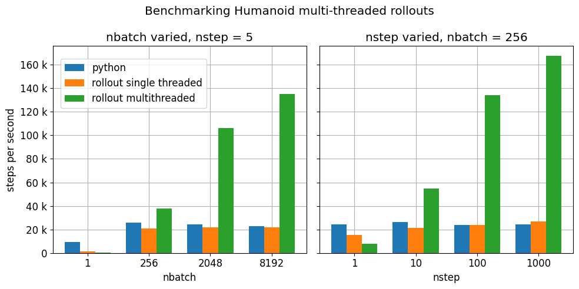

======
Python
======

MuJoCo comes with native Python bindings that are developed in C++ using
`pybind11 <https://pybind11.readthedocs.io/>`__. The Python API is consistent with the underlying C API. This leads to
some non-Pythonic code structure (e.g. order of function arguments), but it has the benefit that the
:doc:`API documentation<APIreference/index>` is applicable to both languages.

The Python bindings are distributed as the ``mujoco`` package on `PyPI <https://pypi.org/project/mujoco>`__. These are
low-level bindings that are meant to give as close to a direct access to the MuJoCo library as possible. However, in
order to provide an API and semantics that developers would expect in a typical Python library, the bindings
deliberately diverge from the raw MuJoCo API in a number of places, which are documented throughout this page.

Google DeepMind’s `dm_control <https://github.com/google-deepmind/dm_control>`__ reinforcement learning library depends
on the ``mujoco`` package and continues to be supported by Google DeepMind. For code that depends on dm_control versions
prior to 1.0.0, consult the
`migration guide <https://github.com/google-deepmind/dm_control/blob/main/migration_guide_1.0.md>`__.

For mujoco-py users, we include :ref:`migration notes <PyMjpy_migration>` below.

.. _PyNotebook:

Tutorial notebook
=================

A MuJoCo tutorial using the Python bindings is available here: |mjcolab|

.. |mjcolab| image:: https://colab.research.google.com/assets/colab-badge.svg
             :target: https://colab.research.google.com/github/google-deepmind/mujoco/blob/main/python/tutorial.ipynb

.. _PyInstallation:

Installation
============

The recommended way to install this package is via `PyPI <https://pypi.org/project/mujoco/>`__:

.. code-block:: shell

   pip install mujoco

A copy of the MuJoCo library is provided as part of the package and does **not** need to be downloaded or installed
separately.

.. _PyViewer:

Interactive viewer
==================

An interactive GUI viewer is provided as part of the Python package in the ``mujoco.viewer`` module. It is based on the
same codebase as the :ref:`simulate<saSimulate>` application that ships with the MuJoCo binary releases. Three distinct
use cases are supported:

.. _PyViewerApp:

Standalone app
--------------

- ``python -m mujoco.viewer`` launches an empty visualization session, where a model can be loaded by drag-and-drop.
- ``python -m mujoco.viewer --mjcf=/path/to/some/mjcf.xml`` launches a visualization session for the specified
  model file.

.. _PyViewerManaged:

Managed viewer
--------------

Called from a Python program/script, through the function ``viewer.launch``. This function *blocks user code* to
support precise timing of the physics loop. This mode should be used if user code is implemented as
:ref:`engine plugins<exPlugin>` or :ref:`physics callbacks<glPhysics>`, and is called by MuJoCo during :ref:`mj_step`.

- ``viewer.launch()`` launches an empty visualization session, where a model can be loaded by drag-and-drop.
- ``viewer.launch(model)`` launches a visualization session for the given ``mjModel`` where the visualizer
  internally creates its own instance of ``mjData``
- ``viewer.launch(model, data)`` is the same as above, except that the visualizer operates directly on the given
  ``mjData`` instance -- upon exit the ``data`` object will have been modified.

.. _PyViewerPassive:

Passive viewer
--------------

By calling ``viewer.launch_passive(model, data)``. This function *does not block*, allowing user code to continue
execution. In this mode, the user's script is responsible for timing and advancing the physics state, and mouse-drag
perturbations will not work unless the user explicitly synchronizes incoming events.

.. warning::
  On MacOS, ``launch_passive`` requires that the user script is executed via a special ``mjpython`` launcher.
  The ``mjpython`` command is installed as part of the ``mujoco`` package, and can be used as a drop-in replacement
  for the usual ``python`` command and supports an identical set of command line flags and arguments. For example,
  a script can be executed via ``mjpython my_script.py``, and an IPython shell can be launched via
  ``mjpython -m IPython``.

The ``launch_passive`` function returns a handle which can be used to interact with the viewer. It has the following
attributes:

- ``cam``, ``opt``, and ``pert`` properties: correspond to :ref:`mjvCamera`, :ref:`mjvOption`, and :ref:`mjvPerturb`
  structs, respectively.

- ``lock()``: provides a mutex lock for the viewer as a context manager. Since the viewer operates its own
  thread, user code must ensure that it is holding the viewer lock before modifying any physics or visualization
  state. These include the ``mjModel`` and ``mjData`` instance passed to ``launch_passive``, and also the ``cam``,
  ``opt``, and ``pert`` properties of the viewer handle.

- ``sync()``: synchronizes state between ``mjModel``, ``mjData``, and GUI user inputs since the previous call to
  ``sync``. In order to allow user scripts to make arbitrary modifications to ``mjModel`` and ``mjData`` without
  needing to hold the viewer lock, the passive viewer does not access or modify these structs outside of ``sync``
  calls.

  User scripts must call ``sync`` in order for the viewer to reflect physics state changes. The ``sync`` function
  also transfers user inputs from the GUI back into ``mjOption`` (inside ``mjModel``) and ``mjData``, including
  enable/disable flags, control inputs, and mouse perturbations.

- ``update_hfield(hfieldid)``: updates the height field data at the specified ``hfieldid`` for subsequent renderings.

- ``update_mesh(meshid)``: updates the mesh data at the specified ``meshid`` for subsequent renderings.

- ``update_texture(texid)``: updates the texture data at the specified ``texid`` for subsequent renderings.

- ``close()``: programmatically closes the viewer window. This method can be safely called without locking.

- ``is_running()``: returns ``True`` if the viewer window is running and ``False`` if it is closed.
  This method can be safely called without locking.

- ``user_scn``: an :ref:`mjvScene` object that allows users to add change rendering flags and add custom
  visualization geoms to the rendered scene. This is separate from the ``mjvScene`` that the viewer uses internally to
  render the final scene, and is entirely under the user's control. User scripts can call e.g. :ref:`mjv_initGeom` or
  :ref:`mjv_connector` to add visualization geoms to ``user_scn``, and upon the next call to ``sync()``, the viewer
  will incorporate these geoms to future rendered images. Similarly, user scripts can make changes to ``user_scn.flags``
  which would be picked up at the next call to ``sync()``. The ``sync()`` call also copies changes to rendering flags
  made via the GUI back into ``user_scn`` to preserve consistency. For example:

  .. code-block:: python

    with mujoco.viewer.launch_passive(m, d, key_callback=key_callback) as viewer:

      # Enable wireframe rendering of the entire scene.
      viewer.user_scn.flags[mujoco.mjtRndFlag.mjRND_WIREFRAME] = 1
      viewer.sync()

      while viewer.is_running():
        ...
        # Step the physics.
        mujoco.mj_step(m, d)

        # Add a 3x3x3 grid of variously colored spheres to the middle of the scene.
        viewer.user_scn.ngeom = 0
        i = 0
        for x, y, z in itertools.product(*((range(-1, 2),) * 3)):
          mujoco.mjv_initGeom(
              viewer.user_scn.geoms[i],
              type=mujoco.mjtGeom.mjGEOM_SPHERE,
              size=[0.02, 0, 0],
              pos=0.1*np.array([x, y, z]),
              mat=np.eye(3).flatten(),
              rgba=0.5*np.array([x + 1, y + 1, z + 1, 2])
          )
          i += 1
        viewer.user_scn.ngeom = i
        viewer.sync()
        ...

The viewer handle can also be used as a context manager which calls ``close()`` automatically upon exit. A minimal
example of a user script that uses ``launch_passive`` might look like the following. (Note that example is a simple
illustrative example that does **not** necessarily keep the physics ticking at the correct wallclock rate.)

.. code-block:: python

  import time

  import mujoco
  import mujoco.viewer

  m = mujoco.MjModel.from_xml_path('/path/to/mjcf.xml')
  d = mujoco.MjData(m)

  with mujoco.viewer.launch_passive(m, d) as viewer:
    # Close the viewer automatically after 30 wall-seconds.
    start = time.time()
    while viewer.is_running() and time.time() - start < 30:
      step_start = time.time()

      # mj_step can be replaced with code that also evaluates
      # a policy and applies a control signal before stepping the physics.
      mujoco.mj_step(m, d)

      # Example modification of a viewer option: toggle contact points every two seconds.
      with viewer.lock():
        viewer.opt.flags[mujoco.mjtVisFlag.mjVIS_CONTACTPOINT] = int(d.time % 2)

      # Pick up changes to the physics state, apply perturbations, update options from GUI.
      viewer.sync()

      # Rudimentary time keeping, will drift relative to wall clock.
      time_until_next_step = m.opt.timestep - (time.time() - step_start)
      if time_until_next_step > 0:
        time.sleep(time_until_next_step)

Optionally, ``viewer.launch_passive`` accepts the following keyword arguments.

- ``key_callback``: A callable which gets called each time a keyboard event occurs in the viewer window. This allows
  user scripts to react to various key presses, e.g., pause or resume the run loop when the spacebar is pressed.

  .. code-block:: python

    paused = False

    def key_callback(keycode):
      if chr(keycode) == ' ':
        nonlocal paused
        paused = not paused

    ...

    with mujoco.viewer.launch_passive(m, d, key_callback=key_callback) as viewer:
      while viewer.is_running():
        ...
        if not paused:
          mujoco.mj_step(m, d)
          viewer.sync()
        ...

- ``show_left_ui`` and ``show_right_ui``: Boolean arguments indicating whether UI panels should be visible
  or hidden when the viewer is launched. Note that regardless of the values specified, the user can still toggle the
  visibility of these panels after launch by pressing Tab or Shift+Tab.

.. _PyUsage:

Basic usage
===========

Once installed, the package can be imported via ``import mujoco``. Structs, functions, constants, and enums are
available directly from the top-level ``mujoco`` module.

.. _PyStructs:

Structs
-------

The bindings include Python classes that expose MuJoCo data structures. For maximum performance, these classes provide
access to the raw memory used by MuJoCo without copying or buffering. This means that some MuJoCo functions (e.g.,
:ref:`mj_step`) change the content of fields *in place*. The user is therefore advised to create copies where required.
For example, when logging the position of a body, one could write
``positions.append(data.body('my_body').xpos.copy())``. Without the ``.copy()``, the list would contain identical
elements, all pointing to the most recent value. The same applies to NumPy slices. For example if a local
variable ``qpos_slice = data.qpos[3:8]`` is created and then :ref:`mj_step` is called, the values in ``qpos_slice``
will have been changed.

In order to conform to `PEP 8 <https://peps.python.org/pep-0008/>`__
naming guidelines, struct names begin with a capital letter, for example ``mjData`` becomes ``mujoco.MjData`` in Python.

All structs other than ``mjModel`` have constructors in Python. For structs that have an ``mj_defaultFoo``-style
initialization function, the Python constructor calls the default initializer automatically, so for example
``mujoco.MjOption()`` creates a new ``mjOption`` instance that is pre-initialized with :ref:`mj_defaultOption`.
Otherwise, the Python constructor zero-initializes the underlying C struct.

Structs with a ``mj_makeFoo``-style initialization function have corresponding constructor overloads in Python,
for example ``mujoco.MjvScene(model, maxgeom=10)`` in Python creates a new ``mjvScene`` instance that is
initialized with ``mjv_makeScene(model, [the new mjvScene instance], 10)`` in C. When this form of initialization is
used, the corresponding deallocation function ``mj_freeFoo/mj_deleteFoo`` is automatically called when the Python
object is deleted. The user does not need to manually free resources.

The ``mujoco.MjModel`` class does not a have Python constructor. Instead, we provide three static factory functions
that create a new :ref:`mjModel` instance: ``mujoco.MjModel.from_xml_string``, ``mujoco.MjModel.from_xml_path``, and
``mujoco.MjModel.from_binary_path``. The first function accepts a model XML as a string, while the latter two
functions accept the path to either an XML or MJB model file. All three functions optionally accept a Python
dictionary which is converted into a MuJoCo :ref:`Virtualfilesystem` for use during model compilation.

.. _PyFunctions:

Functions
---------

MuJoCo functions are exposed as Python functions of the same name. Unlike with structs, we do not attempt to make
the function names `PEP 8 <https://peps.python.org/pep-0008/>`__-compliant, as MuJoCo uses both underscores and
CamelCases. In most cases, function arguments appear exactly as they do in C, and keyword arguments are supported
with the same names as declared in :ref:`mujoco.h<inHeader>`. Python bindings to C functions that accept array input
arguments expect NumPy arrays or iterable objects that are convertible to NumPy arrays (e.g. lists). Output
arguments (i.e. array arguments that MuJoCo expect to write values back to the caller) must always be writeable
NumPy arrays.

In the C API, functions that take dynamically-sized arrays as inputs expect a pointer argument to the array along with
an integer argument that specifies the array's size. In Python, the size arguments are omitted since we can
automatically (and indeed, more safely) deduce it from the NumPy array. When calling these functions, pass all
arguments other than array sizes in the same order as they appear in :ref:`mujoco.h<inHeader>`, or use keyword
arguments. For example, :ref:`mj_jac` should be called as ``mujoco.mj_jac(m, d, jacp, jacr, point, body)`` in Python.

The bindings **releases the Python Global Interpreter Lock (GIL)** before calling the underlying MuJoCo function.
This allows for some thread-based parallelism, however users should bear in mind that the GIL is only released for the
duration of the MuJoCo C function itself, and not during the execution of any other Python code.

.. note::
   One place where the bindings do offer added functionality is the top-level :ref:`mj_step` function. Since it is
   often called in a loop, we have added an additional ``nstep`` argument, indicating how many times the underlying
   :ref:`mj_step` should be called. If not specified, ``nstep`` takes the default value of 1. The following two code
   snippets perform the same computation, but the first one does so without acquiring the GIL in between subsequent
   physics steps:

   .. code-block:: python

      mj_step(model, data, nstep=20)

   .. code-block:: python

      for _ in range(20):
        mj_step(model, data)

.. _PyEnums:

Enums and constants
-------------------

MuJoCo enums are available as ``mujoco.mjtEnumType.ENUM_VALUE``, for example ``mujoco.mjtObj.mjOBJ_SITE``. MuJoCo
constants are available with the same name directly under the ``mujoco`` module, for example ``mujoco.mjVISSTRING``.

.. _PyExample:

Minimal example
---------------

.. code-block:: python

   import mujoco

   XML=r"""
   <mujoco>
     <asset>
       <mesh file="gizmo.stl"/>
     </asset>
     <worldbody>
       <body>
         <freejoint/>
         <geom type="mesh" name="gizmo" mesh="gizmo"/>
       </body>
     </worldbody>
   </mujoco>
   """

   ASSETS=dict()
   with open('/path/to/gizmo.stl', 'rb') as f:
     ASSETS['gizmo.stl'] = f.read()

   model = mujoco.MjModel.from_xml_string(XML, ASSETS)
   data = mujoco.MjData(model)
   while data.time < 1:
     mujoco.mj_step(model, data)
     print(data.geom_xpos)

.. _PyNamed:

Named access
------------

Most well-designed MuJoCo models assign names to objects (joints, geoms, bodies, etc.) of interest. When the model is
compiled down to an ``mjModel`` instance, these names become associated with numeric IDs that are used to index into the
various array members. For convenience and code readability, the Python bindings provide "named access" API on
``MjModel`` and ``MjData``. Each ``name_fooadr`` field in the ``mjModel`` struct defines a name category ``foo``.

For each name category ``foo``, ``mujoco.MjModel`` and ``mujoco.MjData`` objects provide a method ``foo`` that takes
a single string argument, and returns an accessor object for all arrays corresponding to the entity ``foo`` of the
given name. The accessor object contains attributes whose names correspond to the fields of either ``mujoco.MjModel`` or
``mujoco.MjData`` but with the part before the underscore removed. In addition, accessor objects also provide ``id`` and
``name`` properties, which can be used as replacements for ``mj_name2id`` and ``mj_id2name`` respectively. For example:

- ``m.geom('gizmo')`` returns an accessor for arrays in the ``MjModel`` object ``m`` associated with the geom named
  "gizmo".
- ``m.geom('gizmo').rgba`` is a NumPy array view of length 4 that specifies the RGBA color for the geom.
  Specifically, it corresponds to the portion of ``m.geom_rgba[4*i:4*i+4]`` where
  ``i = mujoco.mj_name2id(m, mujoco.mjtObj.mjOBJ_GEOM, 'gizmo')``.
- ``m.geom('gizmo').id`` is the same number as returned by ``mujoco.mj_name2id(m, mujoco.mjtObj.mjOBJ_GEOM, 'gizmo')``.
- ``m.geom(i).name`` is ``'gizmo'``, where ``i = mujoco.mj_name2id(m, mujoco.mjtObj.mjOBJ_GEOM, 'gizmo')``.

Additionally, the Python API define a number of aliases for some name categories corresponding to the XML element name
in the MJCF schema that defines an entity of that category. For example, ``m.joint('foo')`` is the same as
``m.jnt('foo')``. A complete list of these aliases are provided below.

The accessor for joints is somewhat different that of the other categories. Some ``mjModel`` and ``mjData`` fields
(those of size size ``nq`` or ``nv``) are associated with degrees of freedom (DoFs) rather than joints. This is because
different types of joints have different numbers of DoFs. We nevertheless associate these fields to their corresponding
joints, for example through ``d.joint('foo').qpos`` and ``d.joint('foo').qvel``, however the size of these arrays would
differ between accessors depending on the joint's type.

Named access is guaranteed to be O(1) in the number of entities in the model. In other words, the time it takes to
access an entity by name does not grow with the number of names or entities in the model.

For completeness, we provide here a complete list of all name categories in MuJoCo, along with their corresponding
aliases defined in the Python API.

- ``body``
- ``jnt`` or ``joint``
- ``geom``
- ``site``
- ``cam`` or ``camera``
- ``light``
- ``mesh``
- ``skin``
- ``hfield``
- ``tex`` or ``texture``
- ``mat`` or ``material``
- ``pair``
- ``exclude``
- ``eq`` or ``equality``
- ``tendon`` or ``ten``
- ``actuator``
- ``sensor``
- ``numeric``
- ``text``
- ``tuple``
- ``key`` or ``keyframe``

.. _PyRender:

Rendering
---------

MuJoCo itself expects users to set up a working OpenGL context before calling any of its ``mjr_`` rendering routine.
The Python bindings provide a basic class ``mujoco.GLContext`` that helps users set up such a context for offscreen
rendering. To create a context, call ``ctx = mujoco.GLContext(max_width, max_height)``. Once the context is created,
it must be made current before MuJoCo rendering functions can be called, which you can do so via ``ctx.make_current()``.
Note that a context can only be made current on one thread at any given time, and all subsequent rendering calls must be
made on the same thread.

The context is freed automatically when the ``ctx`` object is deleted, but in some multi-threaded scenario it may be
necessary to explicitly free the underlying OpenGL context. To do so, call ``ctx.free()``, after which point it is the
user's responsibility to ensure that no further rendering calls are made on the context.

Once the context is created, users can follow MuJoCo's standard rendering, for example as documented in the
:ref:`Visualization` section.

.. _PyError:

Error handling
--------------

MuJoCo reports irrecoverable errors via the :ref:`mju_error` mechanism, which immediately terminates the entire process.
Users are permitted to install a custom error handler via the :ref:`mju_user_error` callback, but it too is expected
to terminate the process, otherwise the behavior of MuJoCo after the callback returns is undefined. In actuality, it is
sufficient to ensure that error callbacks do not return *to MuJoCo*, but it is permitted to use
`longjmp <https://en.cppreference.com/w/c/program/longjmp>`__ to skip MuJoCo's call stack back to the external callsite.

The Python bindings utilizes longjmp to allow it to convert irrecoverable MuJoCo errors into Python exceptions of type
``mujoco.FatalError`` that can be caught and processed in the usual Pythonic way. Furthermore, it installs its error
callback in a thread-local manner using a currently private API, thus allowing for concurrent calls into MuJoCo from
multiple threads.

.. _PyCallbacks:

Callbacks
---------

MuJoCo allows users to install custom callback functions to modify certain parts of its computation pipeline.
For example, :ref:`mjcb_sensor` can be used to implement custom sensors, and :ref:`mjcb_control` can be used to
implement custom actuators. Callbacks are exposed through the function pointers prefixed ``mjcb_`` in
:ref:`mujoco.h<inHeader>`.

For each callback ``mjcb_foo``, users can set it to a Python callable via ``mujoco.set_mjcb_foo(some_callable)``. To
reset it, call ``mujoco.set_mjcb_foo(None)``. To retrieve the currently installed callback, call
``mujoco.get_mjcb_foo()``. (The getter **should not** be used if the callback is not installed via the Python bindings.)
The bindings automatically acquire the GIL each time the callback is entered, and release it before reentering MuJoCo.
This is likely to incur a severe performance impact as callbacks are triggered several times throughout MuJoCo's
computation pipeline and is unlikely to be suitable for "production" use case. However, it is expected that this feature
will be useful for prototyping complex models.

Alternatively, if a callback is implemented in a native dynamic library, users can use
`ctypes <https://docs.python.org/3/library/ctypes.html>`__ to obtain a Python handle to the C function pointer and pass
it to ``mujoco.set_mjcb_foo``. The bindings will then retrieve the underlying function pointer and assign it directly to
the raw callback pointer, and the GIL will **not** be acquired each time the callback is entered.

.. _PyModelEdit:

Model editing
=============
The C API for model editing is documented in the :doc:`Programming<../programming/modeledit>` chapter.
This functionality is mirrored in the Python API, with the addition of several convenience methods.
Below is a minimal usage example, more examples can be found in the Model Editing
`colab notebook <https://colab.research.google.com/github/google-deepmind/mujoco/blob/main/python/mjspec.ipynb>`__.

.. code-block:: python

   import mujoco
   spec = mujoco.MjSpec()
   spec.modelname = "my model"
   body = spec.worldbody.add_body(
       pos=[1, 2, 3],
       quat=[0, 1, 0, 0],
   )
   geom = body.add_geom(
       name='my_geom',
       type=mujoco.mjtGeom.mjGEOM_SPHERE,
       size=[1, 0, 0],
       rgba=[1, 0, 0, 1],
   )
   ...
   model = spec.compile()

Construction
------------

The ``MjSpec`` object wraps the :ref:`mjSpec` struct and can be constructed in three ways:

1. Create an empty spec: ``spec = mujoco.MjSpec()``
2. Load the spec from XML string: ``spec = mujoco.MjSpec.from_string(xml_string)``
3. Load the spec from XML file: ``spec = mujoco.MjSpec.from_file(file_path)``

Note the ``from_string()`` and ``from_file()`` methods can only be called at construction time.

Assets
^^^^^^

All three methods take in an optional argument called ``assets`` which is used to resolve asset references in the XML.
This argument is a dictionary that maps asset name (string) to asset data (bytes), as demonstrated below:

.. code-block:: python

  assets = {'image.png': b'image_data'}
  spec = mujoco.MjSpec.from_string(xml_referencing_image_png, assets=assets)
  model = spec.compile()

Save to XML
-----------

Compiled ``MjSpec`` objects can be saved to XML string with the ``to_xml()`` method:

.. code-block:: python

   print(spec.to_xml())

.. code-block:: XML

   <mujoco model="my model">
     <compiler angle="radian"/>

     <worldbody>
       <body pos="1 2 3" quat="0 1 0 0">
         <geom name="my_geom" size="1" rgba="1 0 0 1"/>
       </body>
     </worldbody>
   </mujoco>

Attachment
----------

It is possible to combine multiple specs by using attachments. The following options are possible:

-   Attach a body from the child spec to a frame in the parent spec: ``body.attach_body(body, prefix, suffix)``, returns
    the reference to the attached body, which should be identical to the body used as input.
-   Attach a frame from the child spec to a body in the parent spec: ``body.attach_frame(frame, prefix, suffix)``,
    returns the reference to the attached frame, which should be identical to the frame used as input.
-   Attach a child spec to a site in the parent spec: ``parent_spec.attach(child_spec, site=site_name_or_obj)``, returns
    the reference to a frame, which is the attached worldbody transformed into a frame. The site must belong to the
    child spec. Prefix and suffix can also be specified as keyword arguments.
-   Attach a child spec to a frame in the parent spec: ``parent_spec.attach(child_spec, frame=frame_name_or_obj)``,
    returns the reference to a frame, which is the attached worldbody transformed into a frame. The frame must belong to
    the child spec. Prefix and suffix can also be specified as keyword arguments.

The default behavior of attaching is to not copy, so all the child references (except for the worldbody) are still valid
in the parent and therefore modifying the child will modify the parent. This is not true for the attach
:ref:`attach<body-attach>` and :ref:`replicate<replicate>` meta-elements in MJCF, which create deep copies while
attaching. However, it is possible to override the default behavior by setting ``spec.copy_during_attach`` to
``True``. In this case, the child spec is copied and the references to the child will not point to the parent.

.. code-block:: python

   import mujoco

   # Create the parent spec.
   parent = mujoco.MjSpec()
   body = parent.worldbody.add_body()
   frame = parent.worldbody.add_frame()
   site = parent.worldbody.add_site()

   # Create the child spec.
   child = mujoco.MjSpec()
   child_body = child.worldbody.add_body()
   child_frame = child.worldbody.add_frame()

   # Attach the child to the parent in different ways.
   body_in_frame = frame.attach_body(child_body, 'child-', '')
   frame_in_body = body.attach_frame(child_frame, 'child-', '')
   worldframe_in_site = parent.attach(child, site=site, prefix='child-')
   worldframe_in_frame = parent.attach(child, frame=frame, prefix='child-')

Convenience methods
-------------------

The Python bindings provide a number of convenience methods and attributes not directly available in the C API in order
to make model editing easier:

Named access
^^^^^^^^^^^^
The ``MjSpec`` object has methods like ``.body(), .joint(), .site(), ...`` for named access of elements.
``spec.geom('my_geom')`` will return the :ref:`mjsGeom` called "my_geom", or ``None`` if it does not exist.

Element lists
^^^^^^^^^^^^^
Lists of all elements in a spec can be accessed using named properties, using the plural form. For example,
``spec.meshes`` returns a list of all meshes in the spec. The following properties are implemented: ``sites``,
``geoms``, ``joints``, ``lights``, ``cameras``, ``bodies``, ``frames``, ``materials``, ``meshes``, ``pairs``,
``equalities``, ``tendons``, ``actuators``, ``skins``, ``textures``, ``texts``, ``tuples``, ``flexes``, ``hfields``,
``keys``, ``numerics``, ``excludes``, ``sensors``, ``plugins``.

Element removal
^^^^^^^^^^^^^^^
For elements that can have children (bodies and defaults), the methods ``spec.detach_body(body)`` and
``spec.detach_default(def)`` remove, respectively, ``body`` and ``def`` from the spec, together with all of their
children. When detaching body subtrees, all elements which reference elements in the subtree, will also be removed. For
all other elements, the method ``delete()`` removes the corresponding element from the spec, e.g.
``spec.geom('my_geom').delete()`` will remove the geom named "my_geom" and all of the elements that reference it.

Tree traversal
^^^^^^^^^^^^^^
Traversal of the kinematic tree is aided by the following methods which return tree-related lists of elements:

Direct children:
  Like the spec-level element lists described above, bodies have properties which return lists of all direct children.
  For example, ``body.geoms`` returns a list of all geoms that are direct children of the body. This works for all
  in tree elements namely ``bodies``, ``joints``, ``geoms``, ``sites``, ``cameras``, ``lights`` and ``frames``.

Recursive search:
  ``body.find_all()`` returns a list of all elements of the given type which are in the subtree of the given body.
  Element types can be specified with the :ref:`mjtObj` enum, or with the corresponding string. For example either
  ``body.find_all(mujoco.mjtObj.mjOBJ_SITE)`` or ``body.find_all('site')`` will return a list of all sites under the
  body.

Parent:
  The parent body of a given element -- including bodies and frames -- can be accessed via the ``parent`` property.
  For example, the parent of a site can be accessed via ``site.parent``.

Serialization
^^^^^^^^^^^^^
The ``MjSpec`` object can be serialized with all of its assets using the function ``spec.to_zip(file)``, where ``file``
can be either a path to a file or a file object. In order to load the spec from a zip file, use ``spec =
MjSpec.from_zip(file)``, where ``file`` is a path to a zip file or a zip file object.

.. _PyMJCF:

Relationship to ``PyMJCF`` and ``bind``
---------------------------------------

`dm_control <https://github.com/google-deepmind/dm_control/tree/main>`__'s
`PyMJCF <https://github.com/google-deepmind/dm_control/blob/main/dm_control/mjcf/README.md>`__ module provides similar
functionality to the native model editing API described here, but is roughly two orders of magnitude slower due to its
reliance on Python manipulation of strings.

For users familiar with ``PyMJCF``, the ``MjSpec`` object is conceptually similar to ``dm_control``'s
``mjcf_model``. A more detailed migration guide could be added here in the future; in the meantime, note that the
Model Editing
`colab notebook <https://colab.research.google.com/github/google-deepmind/mujoco/blob/main/python/mjspec.ipynb>`__
includes a reimplementation of the ``PyMJCF`` example in the ``dm_control``
`tutorial notebook <https://github.com/google-deepmind/dm_control/blob/main/dm_control/mjcf/tutorial.ipynb>`__.

``PyMJCF`` provides a notion of "binding", giving access to :ref:`mjModel` and :ref:`mjData` values via a helper class.
In the native API, the helper class is not needed, so it is possible to directly bind an ``mjs`` object to
:ref:`mjModel` and :ref:`mjData`. For example, say we have multiple geoms containing the string "torso" in their name.
We want to get their Cartesian positions in the XY plane from ``mjData``. This can be done as follows:

.. code-block:: python

   torsos = [data.bind(geom) for geom in spec.geoms if 'torso' in geom.name]
   pos_x = [torso.xpos[0] for torso in torsos]
   pos_y = [torso.xpos[1] for torso in torsos]

Using the ``bind`` method requires the :ref:`mjModel` and :ref:`mjData` to be compiled from the :`ref:`mjSpec`. If
objects are added or removed from the :ref:`mjSpec` since the last compilation, an error is raised.

Notes
-----

- :ref:`mj_recompile` works differently than in the C API. In the C API, it modifies the model and the data in place,
  while in the Python API it returns new :ref:`MjModel` and :ref:`MjData` objects. This is to avoid dangling references.

.. _PyBuild:

Building from source
====================

.. note::
    Building from source is only necessary if you are modifying the
    Python bindings (or are trying to run on exceptionally old Linux systems).
    If that's not the case, then we recommend installing the prebuilt binaries
    from PyPI.

1. Make sure you have CMake and a C++17 compiler installed.

2. Download the `latest binary release <https://github.com/google-deepmind/mujoco/releases>`__
   from GitHub. On macOS, the download corresponds to a DMG file which you can mount by
   double-clicking or running ``hdiutil attach <dmg_file>``.

3. Clone the entire ``mujoco`` repository from GitHub and ``cd`` into the python
   directory:

   .. code-block:: shell

      git clone https://github.com/google-deepmind/mujoco.git
      cd mujoco/python

4. Create a virtual environment:

   .. code-block:: shell

      python3 -m venv /tmp/mujoco
      source /tmp/mujoco/bin/activate

5. Generate a `source distribution <https://packaging.python.org/en/latest/glossary/#term-Source-Distribution-or-sdist>`__
   tarball with the ``make_sdist.sh`` script.

   .. code-block:: shell

      bash make_sdist.sh

   The ``make_sdist.sh`` script generates additional C++ header files that are
   needed to build the bindings, and also pulls in required files from elsewhere
   in the repository outside the ``python`` directory into the sdist. Upon
   completion, the script will create a ``dist`` directory with a
   ``mujoco-x.y.z.tar.gz`` file (where ``x.y.z`` is the version number).

6. Use the generated source distribution to build and install the bindings.
   You'll need to specify the path to the MuJoCo library you downloaded earlier
   in the ``MUJOCO_PATH`` environment variable, and the path to the MuJoCo
   plugin directory in the ``MUJOCO_PLUGIN_PATH`` environment variable.

   .. note::
      For macOS, the files need to be extracted from the DMG.
      Once you mounted it as in step 2, the ``mujoco.framework`` directory can be found in ``/Volumes/MuJoCo``,
      and the plugins directory can be found in ``/Volumes/MuJoCo/MuJoCo.app/Contents/MacOS/mujoco_plugin``.
      Those two directories can be copied out somewhere convenient, or you can use
      ``MUJOCO_PATH=/Volumes/MuJoCo MUJOCO_PLUGIN_PATH=/Volumes/MuJoCo/MuJoCo.app/Contents/MacOS/mujoco_plugin``.

   .. code-block:: shell

      cd dist
      MUJOCO_PATH=/PATH/TO/MUJOCO \
      MUJOCO_PLUGIN_PATH=/PATH/TO/MUJOCO_PLUGIN \
      pip install mujoco-x.y.z.tar.gz

The Python bindings should now be installed! To check that they've been
successfully installed, ``cd`` outside of the ``mujoco`` directory and run
``python -c "import mujoco"``.

.. tip::
   As a reference, a working build configuration can be found in MuJoCo's
   `continuous integration setup <https://github.com/google-deepmind/mujoco/blob/main/.github/workflows/build.yml>`_ on
   GitHub.

.. _PyModule:

Modules
=======

The ``mujoco`` package contains two sub-modules: ``mujoco.rollout`` and ``mujoco.minimize``

.. _PyRollout:

rollout
-------
``mujoco.rollout`` and ``mujoco.rollout.Rollout`` shows how to add additional C/C++ functionality, exposed as a Python
module via pybind11. It is implemented in `rollout.cc
<https://github.com/google-deepmind/mujoco/blob/main/python/mujoco/rollout.cc>`__ and wrapped in `rollout.py
<https://github.com/google-deepmind/mujoco/blob/main/python/mujoco/rollout.py>`__. The module addresses a common
use-case where tight loops implemented outside of Python are beneficial: rolling out a trajectory (i.e., calling
:ref:`mj_step` in a loop), given an initial state and sequence of controls, and returning subsequent states and sensor
values. The rollouts are run in parallel with an internally managed thread pool if multiple MjData instances (one per
thread) are passed as an argument. This notebook shows how to use ``rollout`` |rollout_colab|, along with some
benchmarks e.g., the figure below.

.. |rollout_colab| image:: https://colab.research.google.com/assets/colab-badge.svg
                   :target: https://colab.research.google.com/github/google-deepmind/mujoco/blob/main/python/rollout.ipynb

The basic usage form is

.. code-block:: python

   state, sensordata = rollout.rollout(model, data, initial_state, control)

- ``model`` is either a single instance of MjModel or a sequence of homogeneous MjModels of length ``nbatch``.
  Homogeneous models have the same integer sizes, but floating point values can differ.
- ``data`` is either a single instance of MjData or a sequence of compatible MjDatas of length ``nthread``.
- ``initial_state`` is an ``nbatch x nstate`` array, with ``nbatch`` initial states of size ``nstate``, where
  ``nstate = mj_stateSize(model, mjtState.mjSTATE_FULLPHYSICS)`` is the size of the
  :ref:`full physics state<geFullPhysics>`.
- ``control`` is a ``nbatch x nstep x ncontrol`` array of controls. Controls are by default the ``mjModel.nu`` standard
  actuators, but any combination of :ref:`user input<geInput>` arrays can be specified by passing an optional
  ``control_spec`` bitflag.

If a rollout diverges, the current state and sensor values are used to fill the remainder of the trajectory.
Therefore, non-increasing time values can be used to detect diverged rollouts.

The ``rollout`` function is designed to be computationally stateless, so all inputs of the stepping pipeline are set and
any values already present in the given ``MjData`` instance will have no effect on the output.

By default ``rollout.rollout`` creates a new thread pool every call if ``len(data) > 1``. To reuse the thread pool
over multiple calls use the ``persistent_pool`` argument. ``rollout.rollout`` is not thread safe when using
a persistent pool. The basic usage form is

.. code-block:: python

   state, sensordata = rollout.rollout(model, data, initial_state, persistent_pool=True)

The pool is shutdown on interpreter shutdown or by a call to ``rollout.shutdown_persistent_pool``.

To use multiple thread pools from multiple threads, use ``Rollout`` objects. The basic usage form is

.. code-block:: python

   # Pool shutdown upon exiting block.
   with rollout.Rollout(nthread=nthread) as rollout_:
    rollout_.rollout(model, data, initial_state)

or

.. code-block:: python

   # Pool shutdown on object deletion or call to rollout_.close().
   # To ensure clean shutdown of threads, call close() before interpreter exit.
   rollout_ = rollout.Rollout(nthread=nthread)
   rollout_.rollout(model, data, initial_state)
   rollout_.close()

Since the Global Interpreter Lock is released, this function can also be threaded using Python threads. However, this
is less efficient than using native threads. See the ``test_threading`` function in
`rollout_test.py <https://github.com/google-deepmind/mujoco/blob/main/python/mujoco/rollout_test.py>`__ for an example
of threaded operation (and for more general usage examples).

.. _PyMinimize:

minimize
--------

This module contains optimization-related utilities.

The ``minimize.least_squares()`` function implements a nonlinear Least Squares optimizer solving sequential
Quadratic Programs with :ref:`mju_boxQP`. It is documented in the associated notebook: |lscolab|

.. |lscolab| image:: https://colab.research.google.com/assets/colab-badge.svg
             :target: https://colab.research.google.com/github/google-deepmind/mujoco/blob/main/python/least_squares.ipynb

.. _PyUSDexport:

USD exporter
------------

The `USD exporter <https://github.com/google-deepmind/mujoco/tree/main/python/mujoco/usd>`__ module allows users to save
scenes and trajectories in the `USD format <https://openusd.org/release/index.html>`__ for rendering in external
renderers such as NVIDIA Omniverse or Blender. These renderers provide higher quality rendering capabilities not
provided by the default renderer. Additionally, exporting to USD allows users to include different types of texture maps
to make objects in the scene look more realistic.

.. _PyUSDInstallation:

Installation
^^^^^^^^^^^^

The recommended way to install the necessary requirements for the USD exporter is via
`PyPI <https://pypi.org/project/mujoco/>`__:

.. code-block:: shell

   pip install mujoco[usd]

This installs the optional dependencies ``usd-core`` and ``pillow`` required by the USD exporter.

If you are building from source, please ensure to `build the Python bindings
<https://mujoco.readthedocs.io/en/stable/python.html#building-from-source>`__. Then, using pip, install the required
``usd-core`` and ``pillow`` packages.

.. _PyUSDExporter:

USDExporter
^^^^^^^^^^^

The ``USDExporter`` class in the ``mujoco.usd.exporter`` module allows saving full trajectories in addition to defining
custom cameras and lights. The constructor arguments of a ``USDExporter`` instance are:

- ``model``: An MjModel instance. The USD exporter reads relevant information from the model including details about
  cameras, lights, textures, and object geometries.

- ``max_geom``: Maximum number of geoms in a scene, required when instatiating the internal .
  `mjvScene <https://mujoco.readthedocs.io/en/stable/APIreference/APItypes.html#mjvscene>`__.

- ``output_directory``: Name of the directory under which the exported USD file and all relevant
  assets are stored. When saving a scene/trajectory as a USD file, the exporter creates the following directory
  structure.

  .. code-block:: text

      output_directory_root/
      └-output_directory/
        ├-assets/
        | ├-texture_0.png
        | ├-texture_1.png
        | └-...
        └─frames/
          └-frame_301.usd

  Using this file structure allows users to easily archive the ``output_directory``. All paths to assets in the USD file
  are relative, facilitating the use of the USD archive on another machine.

- ``output_directory_root``: Root directory to add USD trajectory to.

- ``light_intensity``: Intensity of all lights. Note that the units of intensity may be defined differently in
  different renderers, so this value may need to be adjusted on a render-specific basis.

- ``camera_names``: List of cameras to be stored in the USD file. At each time step, for each camera defined, we
  calculate its position and orientation and add that value for that given frame in the USD. USD allows us to store
  multiple cameras.

- ``verbose``: Whether or not to print log messages from the exporter.

If you wish to export a model loaded directly from an MJCF, we provide a `demo
<https://github.com/google-deepmind/mujoco/blob/main/python/mujoco/usd/demo.py>`__ script that shows how to do so. This
demo file also serves as an example of the USD export functionality.

.. _PyUSDBasicUsage:

Basic usage
^^^^^^^^^^^

Once the optional dependencies are installed, the USD exporter can be imported via ``from mujoco.usd import exporter``.

Below, we demonstrate a simple example of using the ``USDExporter``. During initialization, the ``USDExporter`` creates
an empty USD stage, as well as the assets and frames directories if they do not already exist. Additionally, it
generates .png files for each texture defined in the model. Every time ``update_scene`` is called, the exporter records
the position and orientation of all geoms, lights, and cameras in the scene.

The ``USDExporter`` keeps track of frames internally by maintaining a frame counter. Each time ``update_scene`` is
called, the counter is incremented, and the poses of all geoms, cameras, and lights are saved for the corresponding
frame. It's important to note that you can step through the simulation multiple times before calling ``update_scene``.
The final USD file will only store the poses of the geoms, lights, and cameras as they were at the last update_scene
call.

.. code-block:: python

    import mujoco
    from mujoco.usd import exporter

    m = mujoco.MjModel.from_xml_path('/path/to/mjcf.xml')
    d = mujoco.MjData(m)

    # Create the USDExporter
    exp = exporter.USDExporter(model=m)

    duration = 5
    framerate = 60
    while d.time < duration:

      # Step the physics
      mujoco.mj_step(m, d)

      if exp.frame_count < d.time * framerate:
        # Update the USD with a new frame
        exp.update_scene(data=d)

    # Export the USD file
    exp.save_scene(filetype="usd")

.. _PyUSDExportAPI:

USD Export API
^^^^^^^^^^^^^^

- ``update_scene(self, data, scene_option)``: updates the scene with the latest simulation data passed in by the
  user. This function updates the geom, cameras, and lights in the scene.

- ``add_light(self, pos, intensity, radius, color, obj_name, light_type)``: adds a light to the USD scene with the
  given properties post hoc.

- ``add_camera(self, pos, rotation_xyz, obj_name)``: adds a camera to the USD scene with the given properties post hoc.

- ``save_scene(self, filetype)``:  exports the USD scene using one of the USD filetype extensions ``.usd``, ``.usda``,
  or ``.usdc``.

.. _PyUSDTodos:

Missing features
^^^^^^^^^^^^^^^^

Below, we list remaining action items for the USD exporter. Please feel free to suggest additional requests
by creating a new `feature request <https://github.com/google-deepmind/mujoco/issues/new/choose>`__ in GitHub.

- Add support for additional texture maps including metallic, occlusion, roughness, bump, etc.

- Add support for online rendering with Isaac.

- Add support for custom cameras.

.. _PyUtility:

Utilities
=========

The `python/mujoco <https://github.com/google-deepmind/mujoco/tree/main/python/mujoco>`__ directory also contains
utility scripts.

.. _PyMsh2obj:

msh2obj.py
----------

The `msh2obj.py <https://github.com/google-deepmind/mujoco/blob/main/python/mujoco/msh2obj.py>`__ script converts the
:ref:`legacy .msh format<legacy-msh-docs>` for surface meshes (different from the possibly-volumetric
:ref:`gmsh format<gmsh-file-docs>` also using .msh), to OBJ files. The legacy format is deprecated and will be removed
in a future release. Please convert all legacy files to OBJ.

.. _PyMjpy_migration:

mujoco-py migration
===================

In mujoco-py, the main entry point is the `MjSim <https://github.com/openai/mujoco-py/blob/master/mujoco_py/mjsim.pyx>`_
class.  Users construct a stateful ``MjSim`` instance from an MJCF model (similar to ``dm_control.Physics``), and this
instance holds references to an ``mjModel`` instance and its associated ``mjData``.  In contrast, the MuJoCo Python
bindings (``mujoco``) take a more low-level approach, as explained above: following the design principle of the C
library, the ``mujoco`` module itself is stateless, and merely wraps the underlying native structs and functions.

While a complete survey of mujoco-py is beyond the scope of this document, we offer below implementation notes for a
non-exhaustive list of specific mujoco-py features:

``mujoco_py.load_model_from_xml(bstring)``
   This factory function constructs a stateful ``MjSim`` instance. When using ``mujoco``, the user should call the
   factory function ``mujoco.MjModel.from_xml_*`` as described :ref:`above <PyStructs>`. The user is then responsible
   for holding the resulting ``MjModel`` struct instance and explicitly generating the corresponding ``MjData`` by
   calling ``mujoco.MjData(model)``.

``sim.reset()``, ``sim.forward()``, ``sim.step()``
   Here as above, ``mujoco`` users needs to call the underlying library functions, passing instances of ``MjModel`` and
   ``MjData``: :ref:`mujoco.mj_resetData(model, data) <mj_resetData>`, :ref:`mujoco.mj_forward(model, data)
   <mj_forward>`, and :ref:`mujoco.mj_step(model, data) <mj_step>`.

``sim.get_state()``, ``sim.set_state(state)``, ``sim.get_flattened_state()``, ``sim.set_state_from_flattened(state)``
   The MuJoCo library’s computation is deterministic given a specific input, as explained in the :ref:`Programming
   section <Simulation>`. mujoco-py implements methods for getting and setting some of the relevant fields (and
   similarly ``dm_control.Physics`` offers methods that correspond to the flattened case). ``mujoco`` do not offer such
   abstraction, and the user is expected to get/set the values of the relevant fields explicitly.

``sim.model.get_joint_qvel_addr(joint_name)``
   This is a convenience method in mujoco-py that returns a list of contiguous indices corresponding to this joint. The
   list starts from ``model.jnt_qposadr[joint_index]``, and its length depends on the joint type. ``mujoco`` doesn't
   offer this functionality, but this list can be easily constructed using ``model.jnt_qposadr[joint_index]`` and
   ``xrange``.

``sim.model.*_name2id(name)``
   mujoco-py creates dicts in ``MjSim`` that allow for efficient lookup of indices for objects of different types:
   ``site_name2id``, ``body_name2id`` etc. These functions replace the function :ref:`mujoco.mj_name2id(model,
   type_enum, name) <mj_name2id>`. ``mujoco`` offers a different approach for using entity names – :ref:`named access
   <PyNamed>`, as well as access to the native :ref:`mj_name2id`.

``sim.save(fstream, format_name)``
   This is the one context in which the MuJoCo library (and therefore also ``mujoco``) is stateful: it holds a copy in
   memory of the last XML that was compiled, which is used in :ref:`mujoco.mj_saveLastXML(fname) <mj_saveLastXML>`. Note
   that mujoco-py’s implementation has a convenient extra feature, whereby the pose (as determined by ``sim.data``’s
   state) is transformed to a keyframe that’s added to the model before saving.  This extra feature is not currently
   available in ``mujoco``.
