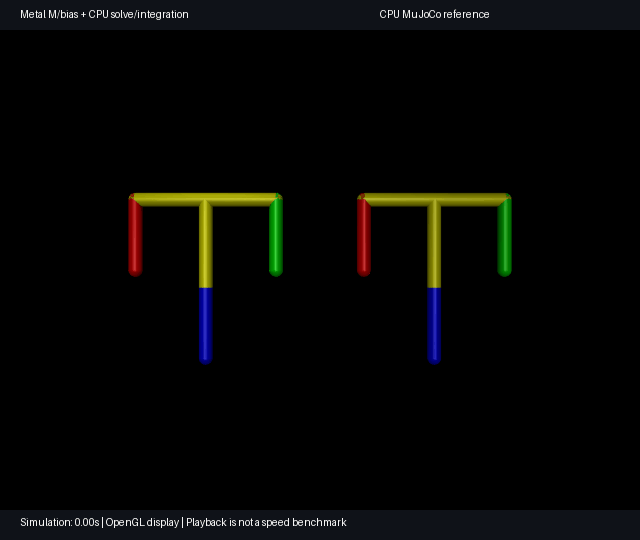

# Mac pendulum backend comparison

This adapts the four-hinge chaotic pendulum from MuJoCo's
[Python tutorial](../../python/tutorial.ipynb), Copyright 2021 DeepMind
Technologies Limited, Apache-2.0. It has no contacts, actuators or passive forces.

Choose one of three explicit physics modes. Every mode compares the left state
with an independent CPU `mj_step` reference on the right, using the same initial
state. MuJoCo's OpenGL renderer displays both states.

- `metal`: native MPS generalized dynamics, dense acceleration solve and
  semi-implicit Euler for the supported `contact_free_euler_v1` profile.
- `metal-hybrid`: experimental Metal mass matrix and gravity/inertial bias,
  followed by CPU NumPy acceleration solve and CPU semi-implicit Euler.
- `cpu`: MuJoCo `mj_step` on both sides for a baseline.

The native mode covers this bundled contact-free, unactuated rigid-body model.
This visualization does not establish contact support, broad MuJoCo feature
coverage or execution speed. See the separate [CPU8/Metal timing report](../benchmarks/README.md)
for measured physics throughput and its limitations. It has no CPU physics fallback. The recorded GIF below remains the
hybrid mode; its label describes the physics shown in that recording.

From the repository root, in an isolated Python 3.12 environment:

```sh
python3.12 -m venv .venv-demo
.venv-demo/bin/python -m pip install './metal[metal,test]'
PYTHONPATH=metal .venv-demo/bin/mjpython metal/examples/pendulum.py
```

Use `mjpython` for the interactive viewer on macOS. Press **R** to reset both
pendulums; close the window to stop. Avoid dragging or applying forces: these
viewer interactions are outside this fixed-model comparison. The right-hand
pendulum is translated only for display. Each frame advances ten 1 ms steps;
slow machines display slower-than-real-time motion without skipping steps.
The simulation continues until closed; reset periodically when comparing:
chaotic trajectories eventually diverge due to floating-point differences.
Interactive display needs an active macOS viewer session; the demo checks for
one before GPU initialization. On a Mac without a display, `mjpython` itself
may wait for the GUI session before it starts the script, so the script cannot
show its display check in that case. Use ordinary `python` with the headless
commands below to qualify physics. Native-mode interactive viewer qualification remains pending on a host with an
active display; the earlier hybrid viewer passed a separate launch/shutdown check.

Run a short numerical check without opening a window:

```sh
PYTHONPATH=metal .venv-demo/bin/python metal/examples/pendulum.py --headless --check
MUJOCO_METAL_RUN_GPU=1 PYTORCH_ENABLE_MPS_FALLBACK=0 PYTHONPATH=metal .venv-demo/bin/python -m pytest -q metal/tests/test_pendulum.py
```

Select and check native stepping explicitly with:

```sh
PYTHONPATH=metal .venv-demo/bin/mjpython metal/examples/pendulum.py --mode metal
PYTORCH_ENABLE_MPS_FALLBACK=0 PYTHONPATH=metal .venv-demo/bin/python metal/examples/pendulum.py --mode metal --headless --check --steps 200
MUJOCO_METAL_RUN_GPU=1 PYTORCH_ENABLE_MPS_FALLBACK=0 PYTHONPATH=metal .venv-demo/bin/python -m pytest -q metal/tests/test_pendulum.py -k native
```

Use `--mode metal-hybrid` for the earlier CPU-solve demonstration and
`--mode cpu` for the CPU baseline. The default remains `metal-hybrid` for
compatibility with the existing viewer and GIF recording. Printed mode and
report fields identify where physics and rendering run.

`--check` requires at most 200 steps and checks maximum absolute joint-position
error below 0.001 rad and velocity error below 0.01 rad/s throughout the rollout.
`--mode cpu` provides a viewer/control baseline with CPU physics on both sides.
`--viewer-seconds 10` closes the viewer automatically for a smoke test.

Optional PNG export still needs an OpenGL context (headless means no interactive
viewer, not software rendering):

```sh
.venv-demo/bin/python -m pip install pillow
PYTHONPATH=metal .venv-demo/bin/python metal/examples/pendulum.py --headless --check --image pendulum.png
```

On the local Apple M1 validation machine, the initial 200-step hybrid rollout
had maximum errors of approximately 2.2e-8 rad and 5.8e-7 rad/s. The GPU test
also reruns after reset. These results apply to this bundled model and pinned
dependencies, not arbitrary XML models or full MuJoCo feature coverage.

The native `--mode metal` 200-step check on the M1 Max had maximum errors of
approximately 1.90e-6 rad and 1.49e-5 rad/s across the rollout. Headless physics
and native offscreen PNG export passed. To export the native mode, add
`--mode metal` to the PNG command above. The benchmark uses no per-step display
readback; this comparison viewer does, so its frame rate is not physics throughput.

Some `uv` Python installations need their base interpreter's library directory
for `mjpython`. If startup reports `libpython3.12.dylib` missing, launch with:

```sh
DEMO_PYTHON_LIB="$(.venv-demo/bin/python -c 'import sys; print(sys.base_prefix + "/lib")')"
DYLD_FALLBACK_LIBRARY_PATH="$DEMO_PYTHON_LIB${DYLD_FALLBACK_LIBRARY_PATH:+:$DYLD_FALLBACK_LIBRARY_PATH}" PYTHONPATH=metal .venv-demo/bin/mjpython metal/examples/pendulum.py
```

## Recorded comparison



This records the actual hybrid rollout alongside CPU MuJoCo, using 1 ms physics
steps and one rendered frame every 40 steps. Playback is fixed at 25 frames/s;
recording wall time is not represented. The clip loops back to its initial state
after three seconds. Longer chaotic rollouts can diverge.

Regenerate from the repository root with Pillow installed:

```sh
PYTHONPATH=metal .venv-demo/bin/python metal/examples/record_pendulum.py metal/examples/assets/pendulum.gif
```
