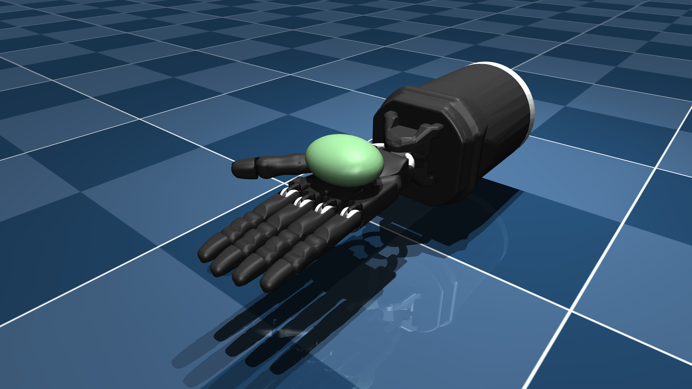

# Shadow Hand E3M5 Description (MJCF)

Requires MuJoCo 3.0.0 or later.

## Overview

This package contains assets of the "E3M5" version of the Shadow Hand robot,
including both right-handed and left-handed versions.
The original URDF and assets were provided directly by
[Shadow Robot Company](https://www.shadowrobot.com/) under the
[Apache 2.0 License](LICENSE).

The [original Menagerie Shadow Hand](https://github.com/google-deepmind/mujoco_menagerie/tree/main/shadow_hand)
has been modified for MJX simulation in the following ways:

* Solver switched to CG with 8 iterations
* Condim switched to 3 (MJX does not yet support condim != 3)
* Object converted from ellipsoid to sphere (MJX does not yet support ellipsoids)
* Explicit contact pairs for fingers and object
* Removed some unused geoms in the arm base

  

## License

These models are released under an [Apache-2.0 License](LICENSE).
