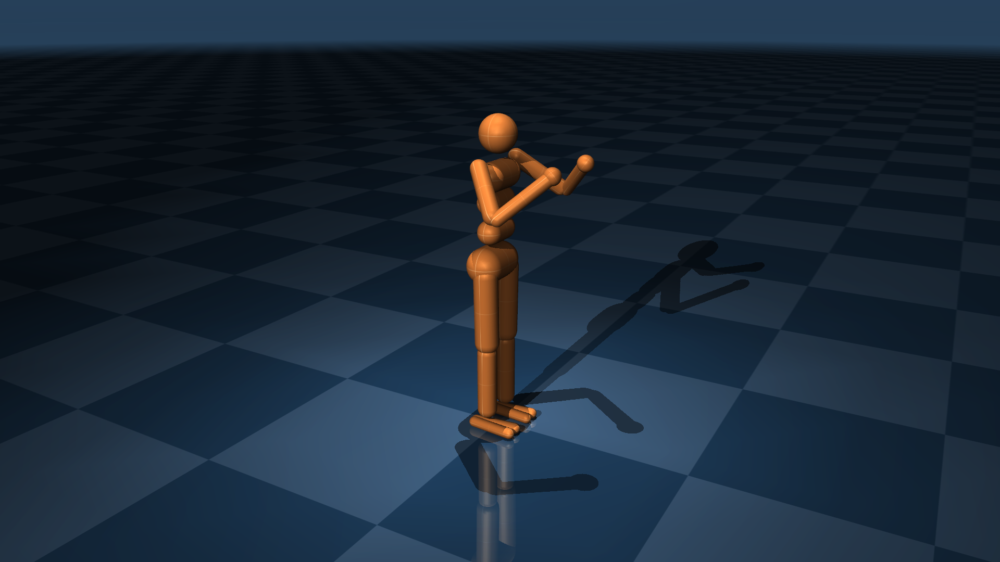

# Humanoid

This simplified humanoid model, introduced in [1], is designed for bipedal locomotion
behaviours. While several variants of it exist in the wild, this version is based on the model
in the DeepMind Control Suite [2], which has fairly realistic actuator gains.

* Degrees of Freedom: 27
* Actuators: 21

  

## Changelog

* 08-10-2024: Moved tracking light from the torso to the world.
* 20-02-2024: Sorted actuators in the same order as the joints.
* 02-01-2024: Add more keyframes.
* 27-11-2023: Move humanoid geoms to group 1.
* 05-04-2023: Fix typo in texture size.
* 20-09-2022: Use default class for left_upper_arm geom.
* 17-09-2022: Increase offscreen render buffer resolution of the humanoid to 2560x1440.
* 12-09-2022:
  * Increased maximum hip flexion.
  * Symmetrised shoulder and ankle joints.
  * Added hamstring tendons which couple the hip and knee at large flexion values.
  * Moved duplicated values into defaults.
  * Added two keyframes.
  * Improved lighting.
  * Changed naming convention.

## References

[1] [Synthesis and Stabilization of Complex Behaviors through Online Trajectory Optimization](https://doi.org/10.1109/IROS.2012.6386025).

[2] [DeepMind Control Suite](https://arxiv.org/abs/1801.00690).
