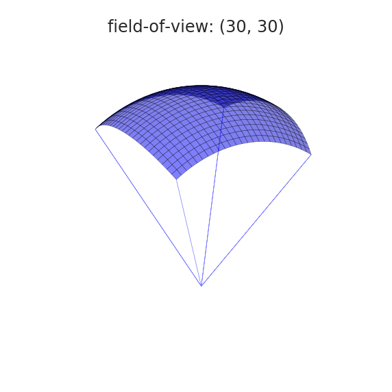
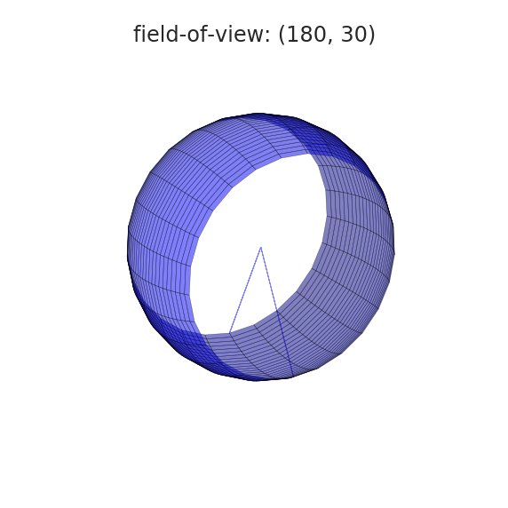
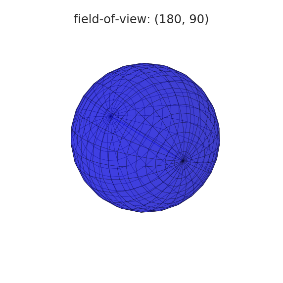
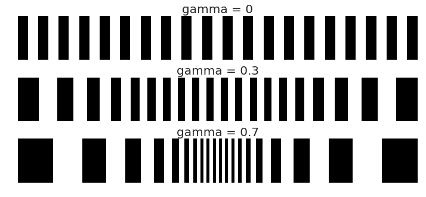
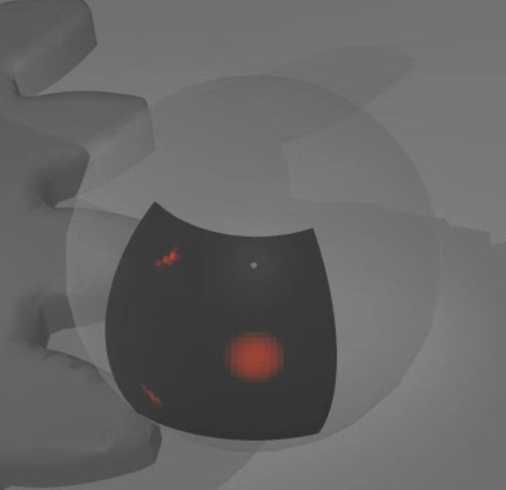
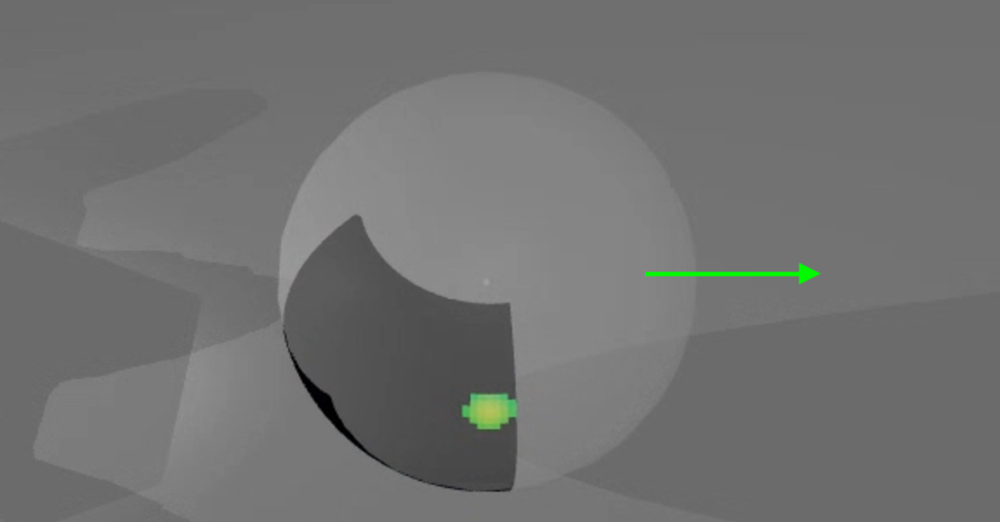
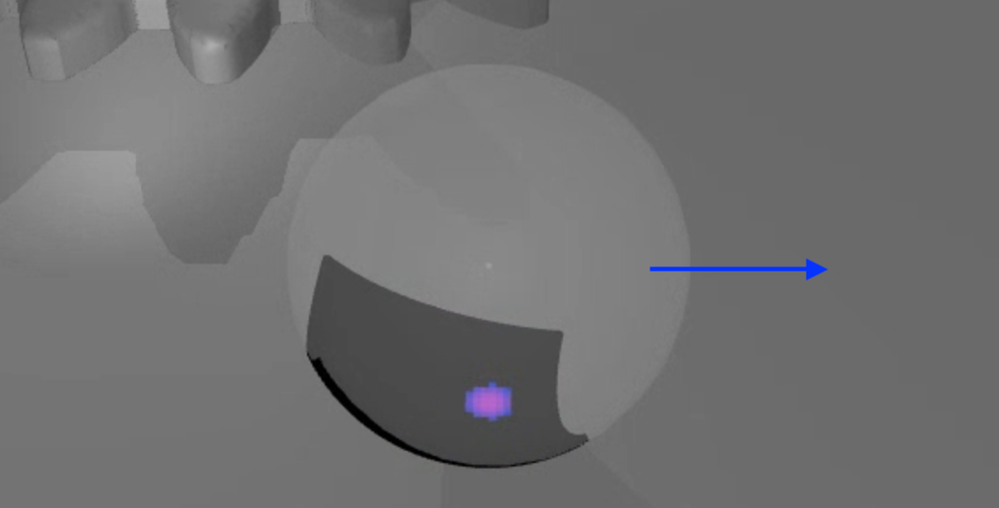

# Sensor Plugins

Custom sensors implemented as [engine
plugins](https://mujoco.readthedocs.io/en/latest/programming/extension.html#engine-plugins).

- [Touch Grid](#touch-grid)
  - [Example model](#example-model)
  - [Illustration of fields-of-view in spherical coordinates](#illustration-of-fields-of-view-in-spherical-coordinates)
  - [Illustration of foveal deformation](#illustration-of-foveal-deformation)
  - [Illustration combining resolution, fields-of-view and foveal deformation](#illustration-combining-resolution-fields-of-view-and-foveal-deformation)

- [Touch Stress](#touch-stress)
  - [Example model with analytical SDF](#example-model-with-analytical-sdf)

## [Touch Grid](touch_grid.h)

This sensor aggregates contact forces into "taxels": a rectangular array of pixel-like elements.

A `touch_grid` sensor is associated with a site and senses contact forces and
torques between the site's parent body and all other bodies. The site's frame
determines the orientation of the sensor with the same convention used for
cameras and lights: the sensor points in the frame's **negative-z** direction,
so the x and y axes correspond to horizontal and vertical, respectively.

The output of the sensor is a stack of 1 to 6 "touch images" corresponding to forces
and torques in the frame of the sensor. Forces and torques are in the in [z, x,
y] order, corresponding to the ordering in contact frames: [normal, tangent,
tangent] and [torsional, rolling, rolling]. Each "taxel" corresponds to an angular bin
in spherical coordinates, and aggregates all the forces occurring inside this bin, which occur
between the body in which the sensor's site is defined and any other body.

The sensor is parametrized by 6 numbers:

1. Number of channels, in the order given above. _positive integer in [1 6]_
2. Horizontal resolution. _positive integer_
3. Vertical resolution. _positive integer_
4. Horizontal field-of-view. _positive float in (0, 180] degrees_
5. Vertical field-of-view. _positive float in (0, 90] degrees_
6. Foveal deformation. _positive float in [0, 1]_

See illustrations below for a visual explanation of the field-of-view and foveal
deformation parameters. These parameters are passed as plugin config attributes:

```xml
<mujoco>
  <extension>
    <plugin plugin="mujoco.sensor.touch_grid"/>
  </extension>
  ...
  <sensor>
    <plugin name="touch" plugin="mujoco.sensor.touch_grid" objtype="site" objname="touch">
      <config key="nchannel" value="3"/>
      <config key="size" value="7 7"/>
      <config key="fov" value="45 45"/>
      <config key="gamma" value="0"/>
    </plugin>
  </sensor>
</mujoco>
```

Note the following:

- The dimensionality of the sensor output is `nchannel * size_x *size_y`.
- `objtype="site" objname="touch"` specify that the sensor is associated with a
  site, and the name of the specific site.
- Field-of-view angles are always in degrees, disregarding the `<compiler>`
  "angle" directive.

### Example model

<a href="https://youtu.be/0LOJ3WMnqeA" target="_blank">
 
</a>

See [touch_grid.xml](../../model/plugin/sensor/touch_grid.xml) to play with the model above.

### Illustration of fields-of-view in spherical coordinates





### Illustration of foveal deformation



### Illustration combining resolution, fields-of-view and foveal deformation

[](https://www.youtube.com/watch?v=YScjmR8LwQI)

## [Touch Stress](touch_stress.h)

This sensor is based on similar concepts and parametrization as the `touch_grid`,
while overcoming some of its limitations. In particular, the `touch_grid` can
only provide sparse information, depending on the number of contact points
generated. The `touch_stress` sensor can instead generate a high-resolution
touch image. In order to do this, it requires a signed distance function (SDF)
of the object that is in contact with the sensor. This is handled internally for
primitives or it must be declared explicitly in the model using SDF plugins.

There is one important difference with respect to the `touch_grid`: in this case,
the force is computed in the local taxel frame and not in the frame of the sensor.
This allows for a more intuitive interpretation of normal and tangential stresses,
as shown in the images below.

Note that in this case, the absolute values of the stresses reported by the
sensor are unrelated to the contact forces. They are purely based on geometric
and kinematic considerations, i.e. the SDF for the normal stress and the sliding
velocity for the tangential contributions.

### Example model with analytical SDF

```xml
<extension>
  <plugin plugin="mujoco.sdf.gear">
    <instance name="gear">
      <config key="alpha" value="0"/>
    </instance>
  </plugin>
  <plugin plugin="mujoco.sensor.touch_stress">
    <instance name="touch_stress">
      <config key="size" value="37 37"/>
      <config key="fov" value="45 45"/>
      <config key="gamma" value="0"/>
      <config key="nchannel" value="3"/>
    </instance>
  </plugin>
  ...
  <asset>
    <mesh name="gear">
      <plugin instance="gear"/>
    </mesh>
  </asset>
  ...
  <worldbody>
    <geom type="sdf" name="gear" mesh="gear">
      <plugin instance="gear"/>
    </geom>
  ...
  <sensor>
    <plugin instance="touch_stress" objtype="site" objname="touch_site"/>
  </sensor>
</extension>
```
The images below show a static sphere over a gear described by an analytic SDF
and the same sphere dragged along the x and y axes.




